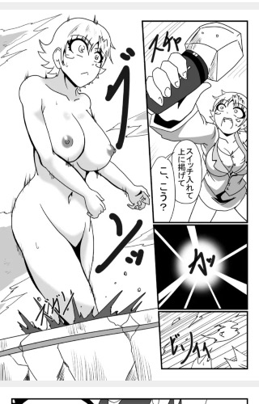

# ドリームキャッチャーメイ

作者：月月月月食

TID：34151

<title>1</title> <link href="../Styles/Style.css" type="text/css" rel="stylesheet">

# 1

從第一晚開始看，頭幾集都是有關巨大化的
Link: https://sp.seiga.nicovideo.jp/comic/49038 <title>2</title> <link href="../Styles/Style.css" type="text/css" rel="stylesheet">

# 2

 <ignore_js_op>[2DFE808A-9400-4A9F-8A61-DEFEA88760D9.jpeg](forum.php?mod=attachment&aid=OTkzOTZ8ZGRlOTNkMmZ8MTY3NDA2OTMwNHwxODIzMHwzNDE1MQ%3D%3D&nothumb=yes) *(62.16 KB, 下載次數: 3)*

[下載附件](forum.php?mod=attachment&aid=OTkzOTZ8ZGRlOTNkMmZ8MTY3NDA2OTMwNHwxODIzMHwzNDE1MQ%3D%3D&nothumb=yes)

2022-9-22 22:21 上傳  

</ignore_js_op> <title>3</title> <link href="../Styles/Style.css" type="text/css" rel="stylesheet">

# 3

打錯了，是集不是晚                                  <title>4</title> <link href="../Styles/Style.css" type="text/css" rel="stylesheet">

# 4

> 田棒棒 發表於 2022-9-23 08:15
> 复制黏贴链接去看了，为何会这样？

如果你大陸的話，他不會你上外網，但是你可以連接VPN再上去，如果用完vpn後你真的看不了，我可以截圖再放上mega
<title>5</title> <link href="../Styles/Style.css" type="text/css" rel="stylesheet">

# 5

> 田棒棒 發表於 2022-9-23 12:10
> 可是我人在台湾，复制黏贴点进去也那样

那你可以在ニコニコ漫画複製漫畫的名稱 <title>6</title> <link href="../Styles/Style.css" type="text/css" rel="stylesheet">

# 6

> 田棒棒 發表於 2022-9-23 18:41
> https://play.google.com/store/apps/details?id=jp.co.dwango.seiga.manga.android&hl=ja&gl=US 找了ニ ...

不一定要下載哦，手機和PC網站版就已經可以看了，不過能夠看到就沒有所謂了 <title>7</title> <link href="../Styles/Style.css" type="text/css" rel="stylesheet">

# 7

> 田棒棒 發表於 2022-9-23 20:28
> 电脑浏览网页的话，都只能看到那话第一页的
> 
> 还有你不能弄个对外链接么？手机点不进去，只能电脑鼠标复制 ...

[https://sp.seiga.nicovideo.jp/viewer/mg494079](https://sp.seiga.nicovideo.jp/viewer/mg494079)

第一話

[https://sp.seiga.nicovideo.jp/watch/mg494559](https://sp.seiga.nicovideo.jp/watch/mg494559)

第二話 <title>8</title> <link href="../Styles/Style.css" type="text/css" rel="stylesheet">

# 8

> 田棒棒 發表於 2022-9-23 08:15
> 复制黏贴链接去看了，为何会这样？

只要把链接里的sp去掉就行了。。。