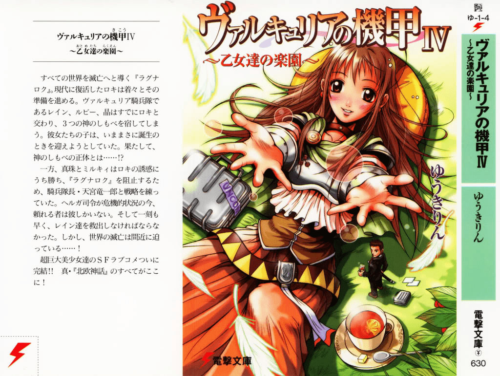

# ヴァルキュリアの機甲

作者：ckw

TID：10470

<title>1</title> <link href="../Styles/Style.css" type="text/css" rel="stylesheet">

# 1

10年前左右的輕小說,4本完,似乎沒有中文代理(自己照原書名翻譯:女武神的機甲)
既然應該都沒多少人看過,包括我。
內容:16米巨娘*6,蟲形/不定形巨大生物,疑似腦衝血式保衛地球劇情,其餘超省略
不信有巨大娘的可以看卷4封面 <title>2</title> <link href="../Styles/Style.css" type="text/css" rel="stylesheet">

# 2

日文什么的还是苦手……LZ既然发帖了就附张图嘛~
不过在下觉得比起巨大娘更像缩小男多些……

[ *本帖最後由 eventually 於 2011-6-26 12:13 編輯* ] <title>3</title> <link href="../Styles/Style.css" type="text/css" rel="stylesheet">

# 3

 <ignore_js_op>[Valkyria_04_000a.jpg](forum.php?mod=attachment&aid=MjUwMTd8YTI4MjBjMWR8MTY3NDA2OTE1OXwxODIzMHwxMDQ3MA%3D%3D&nothumb=yes) *(220.11 KB, 下載次數: 3)*

[下載附件](forum.php?mod=attachment&aid=MjUwMTd8YTI4MjBjMWR8MTY3NDA2OTE1OXwxODIzMHwxMDQ3MA%3D%3D&nothumb=yes)

2011-6-26 12:10 上傳  

</ignore_js_op> <title>4</title> <link href="../Styles/Style.css" type="text/css" rel="stylesheet">

# 4

.
光看封面真的挺吸引人的（再次印證輕小說的銷量與插畫作者息息相關）

沒有中文版的確很可惜…… <title>5</title> <link href="../Styles/Style.css" type="text/css" rel="stylesheet">

# 5

> 原帖由 *eventually* 於 2011-6-26 12:10 發表 
> 日文什么的还是苦手……LZ既然发帖了就附张图嘛~
> 不过在下觉得比起巨大娘更像缩小男多些……

人懶

因為巨娘旁邊的巨大杯具做成的視差

> 原帖由 *Dante* 於 2011-6-26 19:51 發表 
> .
> 光看封面真的挺吸引人的（再次印證輕小說的銷量與插畫作者息息相關）
> 
> 沒有中文版的確很可惜……

題材不夠商業化(ry <title>6</title> <link href="../Styles/Style.css" type="text/css" rel="stylesheet">

# 6

楼主要汉化么？ <title>7</title> <link href="../Styles/Style.css" type="text/css" rel="stylesheet">

# 7

哦~！楼上的看来有要翻译的冲动！哦，错了，是希望楼主翻译的冲动~
这个题材，可，真像超时空要塞呀~就是画的男主看上去不是少年呀~！！ <title>8</title> <link href="../Styles/Style.css" type="text/css" rel="stylesheet">

# 8

小说？？还是漫画来的