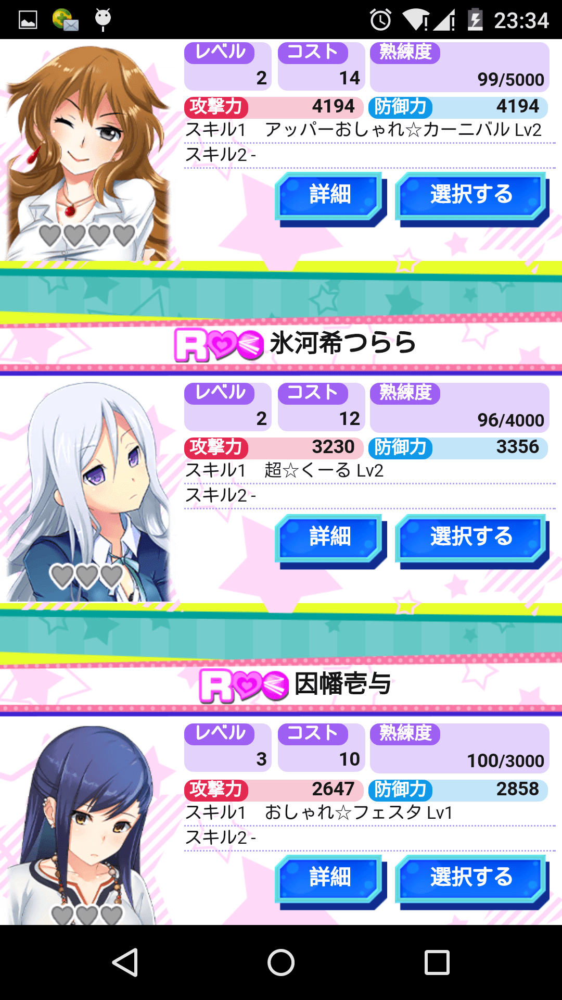
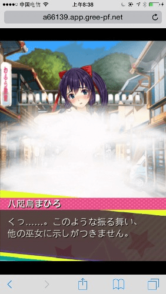

# 『でか☆むす』交友征集贴！

作者：michael

TID：20026

<title>1</title> <link href="../Styles/Style.css" type="text/css" rel="stylesheet">

# 1

*本帖最後由 dasers_100 於 2015-10-28 12:57 編輯*

恩，为了方便广大群众交（shai）友（mei）而发的帖子（我会告诉你其实我是为了完成任务才发的吗）
就这样，
发帖请注明id并附二维码之类……
P.S. 附上目前自家妹（hou）子（gong）图，
不不，不要误会，我并不是针对你，我是说在座的各位，都是。。。（被打死
PPS. ID 718154103 才发现自己截图的时候犯二了没加上ID

<title>2</title> <link href="../Styles/Style.css" type="text/css" rel="stylesheet">

# 2

 <ignore_js_op>[D4940E5EB310E2E41EEBEF1DB7435365.png](forum.php?mod=attachment&aid=NTUzODZ8ZGIzNGEwYTJ8MTY3NDA2ODA2MHwxODIzMHwyMDAyNg%3D%3D&nothumb=yes) *(1.06 MB, 下載次數: 8)*

[下載附件](forum.php?mod=attachment&aid=NTUzODZ8ZGIzNGEwYTJ8MTY3NDA2ODA2MHwxODIzMHwyMDAyNg%3D%3D&nothumb=yes)

2015-10-27 14:02 上傳  

</ignore_js_op> <ignore_js_op>[cd9ba701a18b87d66423abbd070828381e30fdb2.jpg](forum.php?mod=attachment&aid=NTUzODd8OTNhZTA5YmF8MTY3NDA2ODA2MHwxODIzMHwyMDAyNg%3D%3D&nothumb=yes) *(67.38 KB, 下載次數: 3)*

[下載附件](forum.php?mod=attachment&aid=NTUzODd8OTNhZTA5YmF8MTY3NDA2ODA2MHwxODIzMHwyMDAyNg%3D%3D&nothumb=yes)

2015-10-27 14:03 上傳  

</ignore_js_op> <title>3</title> <link href="../Styles/Style.css" type="text/css" rel="stylesheet">

# 3

<ignore_js_op>

**QQ图片20151027182020.jpg** *(57.23 KB, 下載次數: 0)*

[下載附件](forum.php?mod=attachment&aid=NTUzODh8YzExZTdjMTF8MTY3NDA2ODA2MHwxODIzMHwyMDAyNg%3D%3D&nothumb=yes)

2015-10-27 18:21 上傳

<ignore_js_op>

**QQ图片20151027182621.png** *(473.89 KB, 下載次數: 0)*

[下載附件](forum.php?mod=attachment&aid=NTUzODl8YTY1NjA4MmN8MTY3NDA2ODA2MHwxODIzMHwyMDAyNg%3D%3D&nothumb=yes)

2015-10-27 18:26 上傳

你的截图我没法看到你ID啊
<title>4</title> <link href="../Styles/Style.css" type="text/css" rel="stylesheet">

# 4

好友人数很容易满的啊…… <title>5</title> <link href="../Styles/Style.css" type="text/css" rel="stylesheet">

# 5

今天抽了个重复的SR，感觉有点想死。。。 <title>6</title> <link href="../Styles/Style.css" type="text/css" rel="stylesheet">

# 6

> [Yagami_ray 發表於 2015-10-27 18:27](https://giantessnight.cf/gnforum2012/forum.php?mod=redirect&goto=findpost&pid=272909&ptid=20026)
> 你的截图我没法看到你ID啊

然而没什么用，改造币完全出不起
<title>7</title> <link href="../Styles/Style.css" type="text/css" rel="stylesheet">

# 7

> [xhz 發表於 2015-10-27 22:06](https://giantessnight.cf/gnforum2012/forum.php?mod=redirect&goto=findpost&pid=272929&ptid=20026)
> 然而没什么用，改造币完全出不起

那不是挺好的，可以觉醒了~
改造又是什么玩意~

<title>8</title> <link href="../Styles/Style.css" type="text/css" rel="stylesheet">

# 8

*本帖最後由 (12345) 於 2015-11-9 14:29 編輯*

ID 1005303535  ID rfxiaoy非洲人求加好友啦~
<title>9</title> <link href="../Styles/Style.css" type="text/css" rel="stylesheet">

# 9

> [(12345) 發表於 2015-10-27 22:38](https://giantessnight.cf/gnforum2012/forum.php?mod=redirect&goto=findpost&pid=272930&ptid=20026)
> 那不是挺好的，可以觉醒了~
> 改造又是什么玩意~

觉醒要花1万改造用的货币
<title>10</title> <link href="../Styles/Style.css" type="text/css" rel="stylesheet">

# 10

绿色属性卡好难抽，我打SR妹子的队伍还在用N卡输出，太吃亏了
紫色已经爆仓 <title>11</title> <link href="../Styles/Style.css" type="text/css" rel="stylesheet">

# 11

> [xhz 發表於 2015-10-27 23:24](https://giantessnight.cf/gnforum2012/forum.php?mod=redirect&goto=findpost&pid=272939&ptid=20026)
> 绿色属性卡好难抽，我打SR妹子的队伍还在用N卡输出，太吃亏了
> 紫色已经爆仓 ...

目前只抽到一张SR……非洲如我
SR那只妹子一个人根本解决不了，多个人打又会被抢人头，痛苦

<title>12</title> <link href="../Styles/Style.css" type="text/css" rel="stylesheet">

# 12

ID求好友
万恶的字数 <title>13</title> <link href="../Styles/Style.css" type="text/css" rel="stylesheet">

# 13

 <ignore_js_op>[Screenshot_2015-10-27-23-36-03.png](forum.php?mod=attachment&aid=NTUzOTN8MzllN2UyYTF8MTY3NDA2ODEwNXwxODIzMHwyMDAyNg%3D%3D&nothumb=yes) *(224.46 KB, 下載次數: 0)*

[下載附件](forum.php?mod=attachment&aid=NTUzOTN8MzllN2UyYTF8MTY3NDA2ODEwNXwxODIzMHwyMDAyNg%3D%3D&nothumb=yes)

2015-10-27 23:37 上傳  

</ignore_js_op> <title>14</title> <link href="../Styles/Style.css" type="text/css" rel="stylesheet">

# 14

属性不怎么样，差不多熟练度的SR大姐头没比下面河希妹子强多少，好羡慕能抽到SR绿输出卡的楼主 <title>15</title> <link href="../Styles/Style.css" type="text/css" rel="stylesheet">

# 15

 <ignore_js_op>[Screenshot_2015-10-27-23-33-22.png](forum.php?mod=attachment&aid=NTUzOTR8MDZlOTJjYzN8MTY3NDA2ODEwNXwxODIzMHwyMDAyNg%3D%3D&nothumb=yes) *(749 KB, 下載次數: 0)*

[下載附件](forum.php?mod=attachment&aid=NTUzOTR8MDZlOTJjYzN8MTY3NDA2ODEwNXwxODIzMHwyMDAyNg%3D%3D&nothumb=yes)

2015-10-27 23:37 上傳  

</ignore_js_op> <ignore_js_op>[Screenshot_2015-10-27-23-34-34.png](forum.php?mod=attachment&aid=NTUzOTV8NzQ4ZjhiNWV8MTY3NDA2ODEwNXwxODIzMHwyMDAyNg%3D%3D&nothumb=yes) *(824.99 KB, 下載次數: 0)*

[下載附件](forum.php?mod=attachment&aid=NTUzOTV8NzQ4ZjhiNWV8MTY3NDA2ODEwNXwxODIzMHwyMDAyNg%3D%3D&nothumb=yes)

2015-10-27 23:38 上傳  

</ignore_js_op> <title>16</title> <link href="../Styles/Style.css" type="text/css" rel="stylesheet">

# 16

> [taroxd 發表於 2015-10-27 20:56](https://giantessnight.cf/gnforum2012/forum.php?mod=redirect&goto=findpost&pid=272925&ptid=20026)
> 好友人数很容易满的啊……

这运营方倒很实在啊，第一天用了本指导书被回档了指导，他们赔了5本，今天我被BUG掉的爪子他们又寄回来了
<title>17</title> <link href="../Styles/Style.css" type="text/css" rel="stylesheet">

# 17

> [xhz 發表於 2015-10-28 19:34](https://giantessnight.cf/gnforum2012/forum.php?mod=redirect&goto=findpost&pid=273002&ptid=20026)
> 这运营方倒很实在啊，第一天用了本指导书被回档了指导，他们赔了5本，今天我被BUG掉的爪子他们又寄回来了 ...

为啥我都遇不到这些bug TAT
<title>18</title> <link href="../Styles/Style.css" type="text/css" rel="stylesheet">

# 18

> [taroxd 發表於 2015-10-28 20:49](https://giantessnight.cf/gnforum2012/forum.php?mod=redirect&goto=findpost&pid=273023&ptid=20026)
> 为啥我都遇不到这些bug TAT

你第一天没用指导书道具吧，而且你的爪子正常工作了
<title>19</title> <link href="../Styles/Style.css" type="text/css" rel="stylesheet">

# 19

> [taroxd 發表於 2015-10-28 20:49](https://giantessnight.cf/gnforum2012/forum.php?mod=redirect&goto=findpost&pid=273023&ptid=20026)
> 为啥我都遇不到这些bug TAT

我翻了下高级抽卡的抽卡池，SR才7张，比SSR都少。。。怪不得能重复。。。
然后看了下图鉴，发现有20张，去掉野外1张，奖励的3张，还有9张在普通抽卡里，还有张SSR被藏了，高级抽只有9张，野外1张，图鉴有11张
<title>20</title> <link href="../Styles/Style.css" type="text/css" rel="stylesheet">

# 20

> [xhz 發表於 2015-10-28 21:52](https://giantessnight.cf/gnforum2012/forum.php?mod=redirect&goto=findpost&pid=273036&ptid=20026)
> 我翻了下高级抽卡的抽卡池，SR才7张，比SSR都少。。。怪不得能重复。。。
> 然后看了下图鉴，发现有20张， ...

今天晚上打SR妹子终于掉卡了~开心
然后居然给我掉了个100%爪子，吓尿了~

每日免费单抽出R，感觉也是转运了~

然后发现每日免费居然可以无限抽了……什么鬼……

<title>21</title> <link href="../Styles/Style.css" type="text/css" rel="stylesheet">

# 21

> [(12345) 發表於 2015-10-28 23:36](https://giantessnight.cf/gnforum2012/forum.php?mod=redirect&goto=findpost&pid=273055&ptid=20026)
> 今天晚上打SR妹子终于掉卡了~开心
> 然后居然给我掉了个100%爪子，吓尿了~

难道要紧急维护吗
<title>22</title> <link href="../Styles/Style.css" type="text/css" rel="stylesheet">

# 22

> [(12345) 發表於 2015-10-28 23:48](https://giantessnight.cf/gnforum2012/forum.php?mod=redirect&goto=findpost&pid=273058&ptid=20026)
> 难道要紧急维护吗

这种hotfix下就好了，不过我估计会持续很久，毕竟人气不高的样子 <title>23</title> <link href="../Styles/Style.css" type="text/css" rel="stylesheet">

# 23

> [dsa123 發表於 2015-10-28 23:57](https://giantessnight.cf/gnforum2012/forum.php?mod=redirect&goto=findpost&pid=273059&ptid=20026)
> 这种hotfix下就好了，不过我估计会持续很久，毕竟人气不高的样子

2333，居然没了，难道被修复了？
<title>24</title> <link href="../Styles/Style.css" type="text/css" rel="stylesheet">

# 24

不过也出不了什么好货，R都不出一个 <title>25</title> <link href="../Styles/Style.css" type="text/css" rel="stylesheet">

# 25

> [xhz 發表於 2015-10-29 00:25](https://giantessnight.cf/gnforum2012/forum.php?mod=redirect&goto=findpost&pid=273063&ptid=20026)
> 不过也出不了什么好货，R都不出一个

说起来10000抽可以抽50次200吧，那10000抽R概率50%以上有何意义呢……
<title>26</title> <link href="../Styles/Style.css" type="text/css" rel="stylesheet">

# 26

> [(12345) 發表於 2015-10-29 00:08](https://giantessnight.cf/gnforum2012/forum.php?mod=redirect&goto=findpost&pid=273060&ptid=20026)
> 2333，居然没了，难道被修复了？

今早看到的，开始还没当回事，我在考虑能不能靠水硬吃SSR，结果这人就真这么干了。。。
<title>27</title> <link href="../Styles/Style.css" type="text/css" rel="stylesheet">

# 27

*本帖最後由 xhz 於 2015-10-29 08:59 編輯*

> [taroxd 發表於 2015-10-27 20:56](https://giantessnight.cf/gnforum2012/forum.php?mod=redirect&goto=findpost&pid=272925&ptid=20026)
> 好友人数很容易满的啊……

论坛没AT功能还真不方便
好吧是我2没看到有个AT按钮
<title>28</title> <link href="../Styles/Style.css" type="text/css" rel="stylesheet">

# 28

 <ignore_js_op>[Screenshot_2015-10-29-08-35-31.png](forum.php?mod=attachment&aid=NTU1NzB8ZGNiNmQxZDJ8MTY3NDA2ODE0MXwxODIzMHwyMDAyNg%3D%3D&nothumb=yes) *(804.11 KB, 下載次數: 0)*

[下載附件](forum.php?mod=attachment&aid=NTU1NzB8ZGNiNmQxZDJ8MTY3NDA2ODE0MXwxODIzMHwyMDAyNg%3D%3D&nothumb=yes)

2015-10-29 08:38 上傳  

</ignore_js_op> <title>29</title> <link href="../Styles/Style.css" type="text/css" rel="stylesheet">

# 29

我算了下，如果SSR不放AOE灭团，我的阵容一次能打2500,3BP估计能到10000,18个水能拿下，但AOE造成太不稳定了，经常第一回合就出了灭团 <title>30</title> <link href="../Styles/Style.css" type="text/css" rel="stylesheet">

# 30

> [xhz 發表於 2015-10-29 08:39](https://giantessnight.cf/gnforum2012/forum.php?mod=redirect&goto=findpost&pid=273078&ptid=20026)
> 论坛没AT功能还真不方便
> 好吧是我2没看到有个AT按钮

可以的，我有一个好友就是这么拿的。

他说是因为手贱点了掉落率100%的道具，于是氪金砸死了那只

<title>31</title> <link href="../Styles/Style.css" type="text/css" rel="stylesheet">

# 31

> [taroxd 發表於 2015-10-29 19:24](https://giantessnight.cf/gnforum2012/forum.php?mod=redirect&goto=findpost&pid=273127&ptid=20026)
> 可以的，我有一个好友就是这么拿的。
> 
> 他说是因为手贱点了掉落率100%的道具，于是氪金砸死了那只

氪金代价太大了，而且不单刷又容易被NTR
他花了多少？

<title>32</title> <link href="../Styles/Style.css" type="text/css" rel="stylesheet">

# 32

现在看来肉盾角色是最废柴的，防再高也很难撑下一击，技能又都不怎么好，输出型完爆，攻击型技能不说，辅助型也都很实用 <title>33</title> <link href="../Styles/Style.css" type="text/css" rel="stylesheet">

# 33

[@taroxd](https://giantessnight.cf/gnforum2012/home.php?mod=space&uid=10098) 新公告什么意思？明天有活动？奖励的什么果实？ <title>34</title> <link href="../Styles/Style.css" type="text/css" rel="stylesheet">

# 34

> [xhz 發表於 2015-10-29 23:11](https://giantessnight.cf/gnforum2012/forum.php?mod=redirect&goto=findpost&pid=273152&ptid=20026)
> @taroxd 新公告什么意思？明天有活动？奖励的什么果实？

今天下午会有和《灰色的果实》联动的活动，时间可能会变更……没了，没说其他有用的消息
<title>35</title> <link href="../Styles/Style.css" type="text/css" rel="stylesheet">

# 35

> [taroxd 發表於 2015-10-30 07:01](https://giantessnight.cf/gnforum2012/forum.php?mod=redirect&goto=findpost&pid=273180&ptid=20026)
> 今天下午会有和《灰色的果实》联动的活动，时间可能会变更……没了，没说其他有用的消息
> ...

原来是灰色的果实。。。假名我读不懂 <title>36</title> <link href="../Styles/Style.css" type="text/css" rel="stylesheet">

# 36

> taroxd 發表於 2015-10-30 07:01
> 今天下午会有和《灰色的果实》联动的活动，时间可能会变更……没了，没说其他有用的消息
> ...

灰色的果实人设还是很棒的……就是不知道出什么活动，估计是特殊探索，然后击破金发双马尾←_← <title>37</title> <link href="../Styles/Style.css" type="text/css" rel="stylesheet">

# 37

> xhz 發表於 2015-10-30 07:23
> 原来是灰色的果实。。。假名我读不懂

SSR我至今就见过一次被击破……最近总是SR那只，都比R等级高了 <title>38</title> <link href="../Styles/Style.css" type="text/css" rel="stylesheet">

# 38

> xhz 發表於 2015-10-29 20:30
> 现在看来肉盾角色是最废柴的，防再高也很难撑下一击，技能又都不怎么好，输出型完爆，攻击型技能不说，辅助 ...

肉盾系能抗住一下意义就很大……问题除R卡攻击怎么都扛不住……
单抽又是R……愉快的一天…… <title>39</title> <link href="../Styles/Style.css" type="text/css" rel="stylesheet">

# 39

> [(12345) 發表於 2015-10-30 10:13](https://giantessnight.cf/gnforum2012/forum.php?mod=redirect&goto=findpost&pid=273196&ptid=20026)
> 肉盾系能抗住一下意义就很大……问题除R卡攻击怎么都扛不住……
> 单抽又是R……愉快的一天…… ...

我单抽就没出过R，不过今天特抽终于出绿色输出SR了 <title>40</title> <link href="../Styles/Style.css" type="text/css" rel="stylesheet">

# 40

> [xhz 發表於 2015-10-30 10:16](https://giantessnight.cf/gnforum2012/forum.php?mod=redirect&goto=findpost&pid=273197&ptid=20026)
> 我单抽就没出过R，不过今天特抽终于出绿色输出SR了

不，我说的就是特抽……像我这样的非洲部落人民……
<title>41</title> <link href="../Styles/Style.css" type="text/css" rel="stylesheet">

# 41

> [(12345) 發表於 2015-10-30 10:38](https://giantessnight.cf/gnforum2012/forum.php?mod=redirect&goto=findpost&pid=273199&ptid=20026)
> 不，我说的就是特抽……像我这样的非洲部落人民……

[@taroxd](https://giantessnight.cf/gnforum2012/home.php?mod=space&uid=10098) 活动开始了，想不到官方藏的SR在这里 <title>42</title> <link href="../Styles/Style.css" type="text/css" rel="stylesheet">

# 42

> [xhz 發表於 2015-10-30 11:12](https://giantessnight.cf/gnforum2012/forum.php?mod=redirect&goto=findpost&pid=273203&ptid=20026)
> @taroxd 活动开始了，想不到官方藏的SR在这里

好豪华！！！！！！！！！！！！！
<title>43</title> <link href="../Styles/Style.css" type="text/css" rel="stylesheet">

# 43

> xhz 發表於 2015-10-30 11:12
> @taroxd 活动开始了，想不到官方藏的SR在这里

获得SSR要刷15w……你特么在逗我…… <title>44</title> <link href="../Styles/Style.css" type="text/css" rel="stylesheet">

# 44

求翻译剧情〒_〒，感觉很棒的样子 <title>45</title> <link href="../Styles/Style.css" type="text/css" rel="stylesheet">

# 45

 <ignore_js_op>[S51030-122807.jpg](forum.php?mod=attachment&aid=NTU2MjB8NDc4NWJkOTJ8MTY3NDA2ODE0OXwxODIzMHwyMDAyNg%3D%3D&nothumb=yes) *(69.23 KB, 下載次數: 0)*

[下載附件](forum.php?mod=attachment&aid=NTU2MjB8NDc4NWJkOTJ8MTY3NDA2ODE0OXwxODIzMHwyMDAyNg%3D%3D&nothumb=yes)

2015-10-30 13:07 上傳  

</ignore_js_op> <title>46</title> <link href="../Styles/Style.css" type="text/css" rel="stylesheet">

# 46

> [(12345) 發表於 2015-10-30 13:07](https://giantessnight.cf/gnforum2012/forum.php?mod=redirect&goto=findpost&pid=273210&ptid=20026)
> 求翻译剧情〒_〒，感觉很棒的样子

不过女仆装巨大娘挺赞的，这样看来氪金也不算厉害，几张官方雪藏卡平时氪金抽不到的 <title>47</title> <link href="../Styles/Style.css" type="text/css" rel="stylesheet">

# 47

> xhz 發表於 2015-10-30 19:33
> 不过女仆装巨大娘挺赞的，这样看来氪金也不算厉害，几张官方雪藏卡平时氪金抽不到的 ...

〒_〒话说gree怎么氪金呀……想氪金不知道怎么买gree的货币…… <title>48</title> <link href="../Styles/Style.css" type="text/css" rel="stylesheet">

# 48

> [(12345) 發表於 2015-10-30 21:38](https://giantessnight.cf/gnforum2012/forum.php?mod=redirect&goto=findpost&pid=273289&ptid=20026)
> 〒_〒话说gree怎么氪金呀……想氪金不知道怎么买gree的货币……

不知道，没氪过。。。
<title>49</title> <link href="../Styles/Style.css" type="text/css" rel="stylesheet">

# 49

> xhz 發表於 2015-10-30 23:20
> 不知道，没氪过。。。

←_←你遇到过那只活动SSR嘛……？我一次都没见过哎……
好像要十天完成一个任务送SR <title>50</title> <link href="../Styles/Style.css" type="text/css" rel="stylesheet">

# 50

> [(12345) 發表於 2015-10-31 00:51](https://giantessnight.cf/gnforum2012/forum.php?mod=redirect&goto=findpost&pid=273300&ptid=20026)
> ←_←你遇到过那只活动SSR嘛……？我一次都没见过哎……
> 好像要十天完成一个任务送SR ...

今天援助见过了，7000多血不算变态，而且打前排半血
<title>51</title> <link href="../Styles/Style.css" type="text/css" rel="stylesheet">

# 51

还搞排位，怎么一股舰娘的既视感，前十的怪物都上万了。。。 <title>52</title> <link href="../Styles/Style.css" type="text/css" rel="stylesheet">

# 52

这抽的我想死。。。2天抽了3张一模一样。。。
@taroxd <title>53</title> <link href="../Styles/Style.css" type="text/css" rel="stylesheet">

# 53

 <ignore_js_op>[Screenshot_2015-10-31-23-11-52.png](forum.php?mod=attachment&aid=NTU2NDV8MjRhZGM4MGF8MTY3NDA2ODE1MnwxODIzMHwyMDAyNg%3D%3D&nothumb=yes) *(1.54 MB, 下載次數: 0)*

[下載附件](forum.php?mod=attachment&aid=NTU2NDV8MjRhZGM4MGF8MTY3NDA2ODE1MnwxODIzMHwyMDAyNg%3D%3D&nothumb=yes)

2015-10-31 23:15 上傳  

</ignore_js_op> <title>54</title> <link href="../Styles/Style.css" type="text/css" rel="stylesheet">

# 54

活动真是坑……拿到SSR要么排位前15要么刷15w，哪个都是超难达成啊~
R卡一次增加89血，SR是149，SSR好像是240+，这个等级慢慢累积上去简直要命啊……到了第十天不知道会养出什么怪物……
有个问题，你们打活动巨大娘用过援军打raid吗，如果让别人帮忙打了不知道有没有点数的获得……
不然后面真的打不动了
每日任务神坑，必须每天打掉一只SSR，谁知道能不能遇到啊…… <title>55</title> <link href="../Styles/Style.css" type="text/css" rel="stylesheet">

# 55

> [(12345) 發表於 2015-11-1 01:54](https://giantessnight.cf/gnforum2012/forum.php?mod=redirect&goto=findpost&pid=273341&ptid=20026)
> 活动真是坑……拿到SSR要么排位前15要么刷15w，哪个都是超难达成啊~
> R卡一次增加89血，SR是1 ...

我试了下援助别人似乎没点数只有奖励，每日任务在哪？我没发现 <title>56</title> <link href="../Styles/Style.css" type="text/css" rel="stylesheet">

# 56

> [xhz 發表於 2015-11-1 09:41](https://giantessnight.cf/gnforum2012/forum.php?mod=redirect&goto=findpost&pid=273344&ptid=20026)
> 我试了下援助别人似乎没点数只有奖励，每日任务在哪？我没发现

根据我目前的测试，支援SR和R都是没有点数的……SSR支援了两次没注意看……
然后就是支援积分点数获得问题，现在测试下来，被抢了MPV和尾刀都是不影响点数获得的。
R的点数计算公式应该是P=50+2*Lv，比如现在45级获得的就是50+2*45=140点；血量成长，一次增加89
SR的计算公式还在推倒……遇见的比较少数据太少，大概是P=100+5*llv；血量成长，一次增加149
SSR的计算公式……因为实在太少了，根据上面的推导大概是P=200+10*lv；血量成长，一次增加229（？不确定，可能不止）
刚才打了一次SSR支援，确实没点数……Orz
再过几天大概会看到大量的支援邀请吧，我觉得至少能碰到100级的R卡……
另外，关于每日任务，探索下面那个按钮有，

要求是1.击破SSR2.击破SR.3击破R4.击破合计1只5.击破合计5只6击破合计10只，
关键就是击破SSR，因为碰得到与否根本不取决与自己……Orz，而且支援击破不算……血崩……
合计10日奖励是一直SR，爱堂小姐女仆装……
巨大娘血量成长可怕，需要大量支援，

不过反正最重要的BP水是发现者的，大概无所谓吧~

以上！
<title>57</title> <link href="../Styles/Style.css" type="text/css" rel="stylesheet">

# 57

> [(12345) 發表於 2015-11-1 11:40](https://giantessnight.cf/gnforum2012/forum.php?mod=redirect&goto=findpost&pid=273345&ptid=20026)
> 根据我目前的测试，支援SR和R都是没有点数的……SSR支援了两次没注意看……
> 然后就是支援积分点数获得问 ...

这次活动刷BP水简直可怕，打完我就去单刷SSR去
<title>58</title> <link href="../Styles/Style.css" type="text/css" rel="stylesheet">

# 58

> [xhz 發表於 2015-11-1 12:05](https://giantessnight.cf/gnforum2012/forum.php?mod=redirect&goto=findpost&pid=273347&ptid=20026)
> 这次活动刷BP水简直可怕，打完我就去单刷SSR去

排位机制太可怕……随时会被别人刷下来……
<title>59</title> <link href="../Styles/Style.css" type="text/css" rel="stylesheet">

# 59

> [(12345) 發表於 2015-11-1 01:54](https://giantessnight.cf/gnforum2012/forum.php?mod=redirect&goto=findpost&pid=273341&ptid=20026)
> 活动真是坑……拿到SSR要么排位前15要么刷15w，哪个都是超难达成啊~
> R卡一次增加89血，SR是1 ...

能打就不错了，我直接卡在一个探索里动不了，0%一点就结束，返回还是0%。表示几天前就已经发邮件报告了这个bug，现在都还没解决，工作效率略低
<ignore_js_op>

**QQ图片20151104222008.png** *(43.85 KB, 下載次數: 0)*

[下載附件](forum.php?mod=attachment&aid=NTU2ODh8Y2Y1OTExMmV8MTY3NDA2ODE3N3wxODIzMHwyMDAyNg%3D%3D&nothumb=yes)

2015-11-4 22:20 上傳

<title>60</title> <link href="../Styles/Style.css" type="text/css" rel="stylesheet">

# 60

> [dsa123 發表於 2015-11-4 22:21](https://giantessnight.cf/gnforum2012/forum.php?mod=redirect&goto=findpost&pid=273456&ptid=20026)
> 能打就不错了，我直接卡在一个探索里动不了，0%一点就结束，返回还是0%。表示几天前就已经发邮件报告了这 ...

最近一直是用移动客户端玩得……电脑根本玩不了…… <title>61</title> <link href="../Styles/Style.css" type="text/css" rel="stylesheet">

# 61

好坑啊！剧情结束得太简单~虽然早就猜到了……
之后居然是循环……而且感觉道具出现率大幅提升……
上次修正把大量获得金币的bug去掉了……再也遇不到连续的金币暴走模式了……
排位在31~35摇摆不定……就是进不去31，教练我想要两只天音啊！
肝不动了，15w点数收集就是个笑话吧~目标49000好了…… <title>62</title> <link href="../Styles/Style.css" type="text/css" rel="stylesheet">

# 62

简直了，你们一个个都这么肝怎么和你们交流_(:з」∠)_
我最高排名才119，你们这帮子肝帝太可怕了 <title>63</title> <link href="../Styles/Style.css" type="text/css" rel="stylesheet">

# 63

*本帖最後由 michael 於 2015-11-5 17:01 編輯*

真休闲党一直排在200多，日常也断了两天无望，早期苹果也没拿233
由于经常满体力放置所以排名什么的（远目

把图跑完据说放妖几率会降低很多，也不是什么好事，可是这玩意又没法停所以只能节哀OTL

GREE ID : [http://gree.jp/1000903610](http://gree.jp/1000903610)
昵称 忍者猫
求加好友

PS:
加攻buff真的太可怜了，加的伤害太少。比如说给后排远程学技能，一个加所有全程攻击，再学个加sexy属性攻击增加，这样全体享受，不过全体属性加的并不多，我记了下前后的伤害，大概技能1级，也就多打3-8点伤害OTL，平均算5点好了
<ignore_js_op>

**QQ图片20151105083707.png** *(35.45 KB, 下載次數: 0)*

[下載附件](forum.php?mod=attachment&aid=NTU3MDN8YWFhZmU1OWR8MTY3NDA2ODE3N3wxODIzMHwyMDAyNg%3D%3D&nothumb=yes)

2015-11-5 08:37 上傳

这样就使得有属性攻击加成的那几张R卡变得很有价值了，抽到就立刻喂给有技能的主力，一级按5点算的话，升高了应该还是可以的吧OTL
不过应该还是比不过那些SSR，毕竟特大伤害什么的频繁出几次直接就伤害上千了OTL

<title>64</title> <link href="../Styles/Style.css" type="text/css" rel="stylesheet">

# 64

> [dsa123 發表於 2015-11-4 22:21](https://giantessnight.cf/gnforum2012/forum.php?mod=redirect&goto=findpost&pid=273456&ptid=20026)
> 能打就不错了，我直接卡在一个探索里动不了，0%一点就结束，返回还是0%。表示几天前就已经发邮件报告了这 ...

<ignore_js_op>

**1.png** *(128.55 KB, 下載次數: 0)*

[下載附件](forum.php?mod=attachment&aid=NTU3MDh8ZDBlOTc1ZDV8MTY3NDA2ODE3N3wxODIzMHwyMDAyNg%3D%3D&nothumb=yes)

2015-11-5 20:20 上傳

探索BUG修正了，不光大佬你还有很多人都遇到了这个问题，补偿了小瓶和大瓶的AP药BP药，但是耽误的时间和日常（尤其是日常比较伤）补不回来，只能说节哀

另外下面写到2周目跑图居然能得SSR的BUG？吓哭了，我怎么老碰不到这种好事OTL
<title>65</title> <link href="../Styles/Style.css" type="text/css" rel="stylesheet">

# 65

*本帖最後由 xhz 於 2015-11-5 21:42 編輯*

> [michael 發表於 2015-11-5 03:06](https://giantessnight.cf/gnforum2012/forum.php?mod=redirect&goto=findpost&pid=273489&ptid=20026)
> 真休闲党一直排在200多，日常也断了两天无望，早期苹果也没拿233
> 由于经常满体力放置所以排名什么的（远目
> ...

M大加你了
其实SSR不一定优势特别大，毕竟输出型SSR少，肉盾型SSR攻击也就和SR半径八两，而且难觉醒
SR因为总数还不如SSR所以重复概率挺大的(我看着我的4级SR哭泣)
<title>66</title> <link href="../Styles/Style.css" type="text/css" rel="stylesheet">

# 66

*本帖最後由 xhz 於 2015-11-5 21:45 編輯*

> [xhz 發表於 2015-11-5 20:23](https://giantessnight.cf/gnforum2012/forum.php?mod=redirect&goto=findpost&pid=273546&ptid=20026)
> M大加你了
> 其实SSR不一定优势特别大，毕竟输出型SSR少，肉盾型SSR攻击也就和SR半径八两，而且难觉醒
> SR因 ...

首先你要能抽到一样的SSR卡，这概率太浮云，非氪金真得天文学概率了
<title>67</title> <link href="../Styles/Style.css" type="text/css" rel="stylesheet">

# 67

> [xhz 發表於 2015-11-5 21:43](https://giantessnight.cf/gnforum2012/forum.php?mod=redirect&goto=findpost&pid=273554&ptid=20026)
> 首先你要能抽到一样的SSR卡，这概率太浮云，非氪金真得天文学概率了

我会告诉你我抽到了一张SSR吗~
虽然和这次的小满是一样的属性

不过SSR的成长是很可怕，再加上四次觉醒，五格好感，三个技能，应该是成长非常可怕的。

毕竟是SSR……恩……
<title>68</title> <link href="../Styles/Style.css" type="text/css" rel="stylesheet">

# 68

*本帖最後由 michael 於 2015-11-6 04:16 編輯*

确实，SSR的升级确实难了点，现在商城也没有贩卖SR以上升级的道具。

看现在蛋池里的9张SSR和灰果实联动的几张卡

首先，SSR是全部3个技能槽保证，SR并不是所有卡都是3个技能槽。

第二，除了几张卡的特效不是本属性以外，剩下的都是造成本属性极大/超极大伤害的初始技能，这些哪怕是1级不升级都好使。

——————————————————————————————————————————————

目前我知道的几张SR

<ignore_js_op>

**c-00019_i.png** *(13.86 KB, 下載次數: 0)*

[下載附件](forum.php?mod=attachment&aid=NTU3MzN8MjA0MDI4NzN8MTY3NDA2ODE4NHwxODIzMHwyMDAyNg%3D%3D&nothumb=yes)

2015-11-6 04:10 上傳

<ignore_js_op>

**c-00015_i.png** *(14.93 KB, 下載次數: 0)*

[下載附件](forum.php?mod=attachment&aid=NTU3MzR8YjAwOGIxN2F8MTY3NDA2ODE4NHwxODIzMHwyMDAyNg%3D%3D&nothumb=yes)

2015-11-6 04:10 上傳

低命中，命中后超极大伤害。非克制属性（与敌人属性相同，下略）。3技能槽

<ignore_js_op>

**c-00020_i.png** *(15.29 KB, 下載次數: 0)*

[下載附件](forum.php?mod=attachment&aid=NTU3MzJ8OWY1MGZkM2J8MTY3NDA2ODE4NHwxODIzMHwyMDAyNg%3D%3D&nothumb=yes)

2015-11-6 04:16 上傳

<ignore_js_op>

**c-00026_i.png** *(14.49 KB, 下載次數: 0)*

[下載附件](forum.php?mod=attachment&aid=NTU3NDF8ZTVhMTRmNmV8MTY3NDA2ODE4NHwxODIzMHwyMDAyNg%3D%3D&nothumb=yes)

2015-11-6 04:16 上傳

<ignore_js_op>

**c-00030_i.png** *(14.83 KB, 下載次數: 0)*

[下載附件](forum.php?mod=attachment&aid=NTU3NDJ8ZDI3ZjQwYjZ8MTY3NDA2ODE4NHwxODIzMHwyMDAyNg%3D%3D&nothumb=yes)

2015-11-6 04:16 上傳

极大伤害，非克制属性。3技能槽

<ignore_js_op>

**c-00014_i.png** *(13.39 KB, 下載次數: 0)*

[下載附件](forum.php?mod=attachment&aid=NTU3MzZ8MzAxNjgyNmJ8MTY3NDA2ODE4NHwxODIzMHwyMDAyNg%3D%3D&nothumb=yes)

2015-11-6 04:16 上傳

自身攻防大UP，因为是技巧系，所以加攻就算好卡，毕竟输出就是一切。可惜的是和R级卡的技能相差不多（R级卡有几张都是攻击大UP，防御有区别）。

<ignore_js_op>

**c-00013_i.png** *(15.35 KB, 下載次數: 0)*

[下載附件](forum.php?mod=attachment&aid=NTU3NDV8MWJiZmNhMWN8MTY3NDA2ODE4NHwxODIzMHwyMDAyNg%3D%3D&nothumb=yes)

2015-11-6 04:16 上傳

全体同系加防。2技能槽。对于2speed+3技巧的阵容可以用，只要有power系在前排做tank此卡基本初始技能没用，本来槽就只有两个还浪费一个OTL。speed系目前来看输出更好。

<ignore_js_op>

**c-00017_i.png** *(15.15 KB, 下載次數: 0)*

[下載附件](forum.php?mod=attachment&aid=NTU3NDl8Mjc2NDc1ZWN8MTY3NDA2ODE4NHwxODIzMHwyMDAyNg%3D%3D&nothumb=yes)

2015-11-6 04:16 上傳

<ignore_js_op>

**c-00032_i.png** *(14.27 KB, 下載次數: 0)*

[下載附件](forum.php?mod=attachment&aid=NTU3NTh8MzlhM2NmMDJ8MTY3NDA2ODE4NHwxODIzMHwyMDAyNg%3D%3D&nothumb=yes)

2015-11-6 04:16 上傳

<ignore_js_op>

**c-00012_i.png** *(14.67 KB, 下載次數: 0)*

[下載附件](forum.php?mod=attachment&aid=NTU3Njd8YmUwNGU2NDV8MTY3NDA2ODE4NHwxODIzMHwyMDAyNg%3D%3D&nothumb=yes)

2015-11-6 04:16 上傳

全体同系加攻。2技能槽。实测加攻效果并不明显，适合3技巧互相叠BUFF的阵容。

<ignore_js_op>

**9.png** *(28.59 KB, 下載次數: 0)*

[下載附件](forum.php?mod=attachment&aid=NTU3NTF8MTIzZGRiMDd8MTY3NDA2ODE4NHwxODIzMHwyMDAyNg%3D%3D&nothumb=yes)

2015-11-5 22:58 上傳

<ignore_js_op>

**c-00018_i.png** *(15.71 KB, 下載次數: 0)*

[下載附件](forum.php?mod=attachment&aid=NTU3NjR8NjJiZGRmN2R8MTY3NDA2ODE4NHwxODIzMHwyMDAyNg%3D%3D&nothumb=yes)

2015-11-6 04:16 上傳

全体同属性加防，事前登陆卡技能翻版。2技能槽。

<ignore_js_op>

**c-00028_i.png** *(13.96 KB, 下載次數: 0)*

[下載附件](forum.php?mod=attachment&aid=NTU3NTV8OWRkOWRmNGN8MTY3NDA2ODE4NHwxODIzMHwyMDAyNg%3D%3D&nothumb=yes)

2015-11-6 04:16 上傳

<ignore_js_op>

**c-00027_i.png** *(13.79 KB, 下載次數: 0)*

[下載附件](forum.php?mod=attachment&aid=NTU3NjF8YjUwMzZkODB8MTY3NDA2ODE4NHwxODIzMHwyMDAyNg%3D%3D&nothumb=yes)

2015-11-6 04:16 上傳

<ignore_js_op>

**c-00031_i.png** *(14.07 KB, 下載次數: 0)*

[下載附件](forum.php?mod=attachment&aid=NTU3NjJ8MWEyNWY2ZTB8MTY3NDA2ODE4NHwxODIzMHwyMDAyNg%3D%3D&nothumb=yes)

2015-11-6 04:16 上傳

全体同属性加攻。2技能槽。实测技能lv1加攻伤害5点左右，稍微有点低。

<ignore_js_op>

**c-00029_i.png** *(14.04 KB, 下載次數: 0)*

[下載附件](forum.php?mod=attachment&aid=NTU3NTR8NjRiYjJiMWV8MTY3NDA2ODE4NHwxODIzMHwyMDAyNg%3D%3D&nothumb=yes)

2015-11-6 04:16 上傳

随机波动伤害。2技能槽。实测效果还可以，至少所观察的基本比普攻要高。

<ignore_js_op>

**c-00016_i.png** *(14.7 KB, 下載次數: 0)*

[下載附件](forum.php?mod=attachment&aid=NTU3NTl8YzIyMzhkNTV8MTY3NDA2ODE4NHwxODIzMHwyMDAyNg%3D%3D&nothumb=yes)

2015-11-6 04:16 上傳

极大伤害。2技能槽。比较实用的技能卡，打出去就是赚，而且同技能有R级卡来做狗粮升级，技能可以很容易升级。

<ignore_js_op>

**c-00025_i.png** *(15.77 KB, 下載次數: 0)*

[下載附件](forum.php?mod=attachment&aid=NTU3NjZ8YTUyZjMwYTF8MTY3NDA2ODE4NHwxODIzMHwyMDAyNg%3D%3D&nothumb=yes)

2015-11-6 04:16 上傳

新手任务卡。减防我方卡回血，配合前排tank的power系的，不过第一除非是高级巨大娘否则tank很难死，第二浪费了自身一回合攻击，自身还是技巧系，伤害又不低，除非是打周常的觉醒素材，否则巨大娘战斗就3回合，拿一回合来奶一张前排实在浪费。是一张在低等级巨大娘我不希望看到触发技能的卡。

R级实用嘲讽卡
<ignore_js_op>

**c-00099_i.png** *(14.8 KB, 下載次數: 0)*

[下載附件](forum.php?mod=attachment&aid=NTU3NzF8NWNiMGQwMTl8MTY3NDA2ODE4NHwxODIzMHwyMDAyNg%3D%3D&nothumb=yes)

2015-11-6 04:16 上傳

<ignore_js_op>

**c-00112_i.png** *(13.53 KB, 下載次數: 0)*

[下載附件](forum.php?mod=attachment&aid=NTU3NzJ8NGI2YTMxMWZ8MTY3NDA2ODE4NHwxODIzMHwyMDAyNg%3D%3D&nothumb=yes)

2015-11-6 04:16 上傳

如果是power系喂前者，如果是speed喂后者，并不是用他们，请喂给你现在的前排。2speed+3技巧的阵容，让一个血厚点的speed学嘲讽也可以，只是前期感觉没必要，中期看自己抽到什么卡来配置。毕竟再好的R卡power也不如一张SR的speed。比如前者给事前登陆卡的音音音音学个嘲讽，音4就可以很出色的做tank了。

<title>69</title> <link href="../Styles/Style.css" type="text/css" rel="stylesheet">

# 69

想起来忘记求好友了

[http://gree.jp/718513249](http://gree.jp/718513249)
ID: 電 <title>70</title> <link href="../Styles/Style.css" type="text/css" rel="stylesheet">

# 70

> [michael 發表於 2015-11-5 22:38](https://giantessnight.cf/gnforum2012/forum.php?mod=redirect&goto=findpost&pid=273563&ptid=20026)
> 确实，SSR的升级确实难了点，现在商城也没有贩卖SR以上升级的道具。
> 
> 看现在蛋池里的9张SSR和灰果实联动的 ...

看来M大也是个欧洲人，前面几张3技能是因为她们都是初始16费卡，比其他SR都高半级，R里面也有分10费和12费，初始属性也有差距，12费有几张用起来挺不错的
<title>71</title> <link href="../Styles/Style.css" type="text/css" rel="stylesheet">

# 71

> [michael 發表於 2015-11-5 22:38](https://giantessnight.cf/gnforum2012/forum.php?mod=redirect&goto=findpost&pid=273563&ptid=20026)
> 确实，SSR的升级确实难了点，现在商城也没有贩卖SR以上升级的道具。
> 
> 看现在蛋池里的9张SSR和灰果实联动的 ...

现在的SR基本就是这些啦，这次送的天音cool SR属性不错的，另一只SR的表现就不尽如人意了
相对，有些R卡的属性还是可以一看的。
这里问几个问题，
1）技能槽是什么意思？可以喂其他角色的技能？那喂了之后还能删除吗？
2）耐性down究竟要到了几级才能起作用……一直被对面抵抗的说
3）个人指导究竟怎么选才能大成功或者超成功_(:зゝ∠)_
这次给的SSR，要是能拿到属性也是很赞的……
看了一下平时探索的奖励栏，还有三个空位，应该还是要出巨大娘，活动结束了小期待一下~

<title>72</title> <link href="../Styles/Style.css" type="text/css" rel="stylesheet">

# 72

*本帖最後由 michael 於 2015-11-6 00:13 編輯*

> [(12345) 發表於 2015-11-5 23:44](http://giantessnight.com/gnforum2012/forum.php?mod=redirect&goto=findpost&pid=273574&ptid=20026)
> 现在的SR基本就是这些啦，这次送的天音cool SR属性不错的，另一只SR的表现就不尽如人意了
> 相对，有些R卡 ...

1\. 技能槽就是这个卡能学习几个技能，比如说像这图的卡就是有3个技能槽，自身带一个初始技能，你还可以自由追加两个技能。完全看你用什么技能狗粮卡。

比如我随便点开一个事前登陆卡做头像的好友，他的音没有追加技能，所以只有1个初始，技能2是空着的。
<ignore_js_op>

**33333.png** *(92.88 KB, 下載次數: 0)*

[下載附件](forum.php?mod=attachment&aid=NTU3ODd8MDljYzRjZGN8MTY3NDA2ODE4NHwxODIzMHwyMDAyNg%3D%3D&nothumb=yes)

2015-11-5 23:49 上傳

在强化界面，觉醒的右边就是强化技能。

<ignore_js_op>

**11111.png** *(132.56 KB, 下載次數: 0)*

[下載附件](forum.php?mod=attachment&aid=NTU3OTB8OWYwZTViNDJ8MTY3NDA2ODE4NHwxODIzMHwyMDAyNg%3D%3D&nothumb=yes)

2015-11-5 23:51 上傳

你可以选择一个其他卡的技能喂给你的主力卡，因为R级以上才有技能所以一般R级就被称为技能狗粮卡。

技能相同的卡拿去喂给技能相同的，可以提升主力卡的技能经验。
你可以从一些派不上场的R卡里选一些技能好的卡去做狗粮，追加给你的SR/SSR。
除了第一个初始技能无法删除只能强化以外，第二第三技能追加了以后是可以删除换别的的，你觉得不爽了随时可以换，只要你有技能狗粮。

2\. 耐性down类技能我没带过，在我的理解里这是废柴技能，浪费攻击回合，所以我并不了解抵抗的几率问题，抱歉。

3\. 大成功我个人猜测和卡的人物介绍有关，比如有些角色是S属性，有些角色喜欢研究，有些角色个性十足

比如音音音音性格沉默寡言，喜欢听音乐，羡慕其他聊天的女孩子，问道你喜欢偶像，王女还是女王的时候我会选择偶像。问你他带的耳机感觉如何要选很合适之类的。总之我一般都选顺着角色性格的答案。

具体我还真的不清楚这个回答的标准答案，我这些天的个人指导一般是大成功，没有出过超成功，也有几次普通成功，不过大成功体感多一点，总之我也不能下定论，也许就是纯随机的也没准233

PS：活动凑10000苹果我并没有凑够，前几天太休闲了，所以并没有拿到联动卡，天音确实好卡，技能也克制敌人，我要等到2W7苹果才能拿，哎。然后日常也断了，第一天少出了一种巨大娘，后来一算不够10天，我就放弃了。少拿一张卡就意味着少一级少一次觉醒，少一个图鉴，属性也会低，很要命呢，哎。
<title>73</title> <link href="../Styles/Style.css" type="text/css" rel="stylesheet">

# 73

> [michael 發表於 2015-11-6 00:04](https://giantessnight.cf/gnforum2012/forum.php?mod=redirect&goto=findpost&pid=273576&ptid=20026)
> 1\. 技能槽就是这个卡能学习几个技能，比如说像这图的卡就是有3个技能槽，自身带一个初始技能，你还可以自 ...

10000果子什么情况？我都不知道 <title>74</title> <link href="../Styles/Style.css" type="text/css" rel="stylesheet">

# 74

> [michael 發表於 2015-11-6 00:04](https://giantessnight.cf/gnforum2012/forum.php?mod=redirect&goto=findpost&pid=273576&ptid=20026)
> 1\. 技能槽就是这个卡能学习几个技能，比如说像这图的卡就是有3个技能槽，自身带一个初始技能，你还可以自 ...

多谢M大打了这么多字指导~其实我也觉得，指导什么的都是随机吧，大概
至少，超成功肯定是随机的，我觉得，三个选项应该是在（成功）（成功~大成功）（大成功~超成功）这样浮动

不过你们都是用电脑玩嘛，为什么我各种浏览器都是爆炸，移动端和ipad玩得没问题……

天音的卡要27500，再拿就要10w+了……运营我日你先人

那加了技能R卡会消失吗~？

<title>75</title> <link href="../Styles/Style.css" type="text/css" rel="stylesheet">

# 75

> [(12345) 發表於 2015-11-6 10:07](https://giantessnight.cf/gnforum2012/forum.php?mod=redirect&goto=findpost&pid=273591&ptid=20026)
> 多谢M大打了这么多字指导~其实我也觉得，指导什么的都是随机吧，大概
> 至少，超成功 ...

当然消失，不然不是给你无限加，话说第一页好几个氪金战神SSR三层觉醒了。。。 <title>76</title> <link href="../Styles/Style.css" type="text/css" rel="stylesheet">

# 76

> [(12345) 發表於 2015-11-6 10:07](https://giantessnight.cf/gnforum2012/forum.php?mod=redirect&goto=findpost&pid=273591&ptid=20026)
> 多谢M大打了这么多字指导~其实我也觉得，指导什么的都是随机吧，大概
> 至少，超成功 ...

我猜的是选对了会是大成功，其他两个成功，而超成功则是道具触发。总之随缘了。反正一天一次。
目前我就是几个小时上去清一下AP，其他时候因为要等AP回复所以根本没事干。另外大的AP药感觉设计的不合理，回复500在前期AP就100多的时候让人很舍不得用，如果出个AP回复100的相信会更容易促进氪金，至少让人不会有什么浪费感。

另外不知道是我一个人的情况还是大家都这样，只要在自己探索后，才很频繁的能看到其他人发出的支援请求，自己一直在挂着不动的时候怎么刷新页面都不出其他人的支援，有时候想刷刷熟练度和经验，半天没有，也是烦，虽然我知道支援请求只能发给那么10来个人，但是也不至于半天一个没有吧，然而一探索下立刻就有好几个支援请求了OTL 错觉么

chrome+F12控制台模拟，从来没崩过。
<title>77</title> <link href="../Styles/Style.css" type="text/css" rel="stylesheet">

# 77

> [xhz 發表於 2015-11-6 08:32](https://giantessnight.cf/gnforum2012/forum.php?mod=redirect&goto=findpost&pid=273590&ptid=20026)
> 10000果子什么情况？我都不知道

<ignore_js_op>

**1.jpg** *(55.17 KB, 下載次數: 0)*

[下載附件](forum.php?mod=attachment&aid=NTU5MjB8YWJmZjU0ZmN8MTY3NDA2ODE5MXwxODIzMHwyMDAyNg%3D%3D&nothumb=yes)

2015-11-6 22:47 上傳

就是这个，在10月3号前攒够1W就能得到这两张卡。
我当时刚玩的时候基本把给的AP药有了就用也没攒着，3号之前我好像也就7000-8000个苹果的样子，哎，也罢，没有就没有吧。
<title>78</title> <link href="../Styles/Style.css" type="text/css" rel="stylesheet">

# 78

> [michael 發表於 2015-11-6 22:48](https://giantessnight.cf/gnforum2012/forum.php?mod=redirect&goto=findpost&pid=273678&ptid=20026)
> 就是这个，在10月3号前攒够1W就能得到这两张卡。
> 我当时刚玩的时候基本把给的AP药有了就用也没攒着，3 ...

OTL完全不知道，这活动福利东一个西一个完全让人找不着头脑
<title>79</title> <link href="../Styles/Style.css" type="text/css" rel="stylesheet">

# 79

> [michael 發表於 2015-11-6 22:46](https://giantessnight.cf/gnforum2012/forum.php?mod=redirect&goto=findpost&pid=273677&ptid=20026)
> 我猜的是选对了会是大成功，其他两个成功，而超成功则是道具触发。总之随缘了。反正一天一次。
> 目前我就 ...

我也是这么觉得，要么应援没人来，要么一来给秒了
所以没事干的时候都是默默刷小号，给大号刷票

chrome用了F12还需要改其他什么设置吗，我打开都是黑屏

<title>80</title> <link href="../Styles/Style.css" type="text/css" rel="stylesheet">

# 80

> [michael 發表於 2015-11-6 22:46](https://giantessnight.cf/gnforum2012/forum.php?mod=redirect&goto=findpost&pid=273677&ptid=20026)
> 我猜的是选对了会是大成功，其他两个成功，而超成功则是道具触发。总之随缘了。反正一天一次。
> 目前我就 ...

<ignore_js_op>

**奇怪.jpg** *(94.89 KB, 下載次數: 0)*

[下載附件](forum.php?mod=attachment&aid=NTU5MjV8YmQyNDMyYzJ8MTY3NDA2ODE5MXwxODIzMHwyMDAyNg%3D%3D&nothumb=yes)

2015-11-7 11:58 上傳

『でか☆むす』をプレイするには会員登録が必要となります。
<title>81</title> <link href="../Styles/Style.css" type="text/css" rel="stylesheet">

# 81

*本帖最後由 michael 於 2015-11-7 21:09 編輯*

> [(12345) 發表於 2015-11-7 11:59](https://giantessnight.cf/gnforum2012/forum.php?mod=redirect&goto=findpost&pid=273737&ptid=20026)
> 『でか☆むす』をプレイするには会員登録が必要となります。

<ignore_js_op>

**111111.png** *(12.98 KB, 下載次數: 0)*

[下載附件](forum.php?mod=attachment&aid=NTU5Mzl8NWVhMWI1ZmN8MTY3NDA2ODE5MXwxODIzMHwyMDAyNg%3D%3D&nothumb=yes)

2015-11-7 21:01 上傳

chrome我是F12然后esc，调出模拟设置，然后在这里输一下坐标，按我的输就成，35.5 140
然后地址栏先去gree.jp，登陆你的gree号，登陆了再开gree.jp/r/79396/1

第一次设置下，以后只要开F12再点书签进gree.jp/r/79396/1就成了，主要是必须保持F12开着才能模拟，不然就模拟失败不让你登陆

PS：你也太肝了，还玩小号……莫非你小号也刷没了，再继续换么6666
你要多开的话可以用隐身窗口（无痕模式），这样两个号用一个浏览器登陆也不会冲突

<title>82</title> <link href="../Styles/Style.css" type="text/css" rel="stylesheet">

# 82

> [michael 發表於 2015-11-7 21:04](https://giantessnight.cf/gnforum2012/forum.php?mod=redirect&goto=findpost&pid=273815&ptid=20026)
> chrome我是F12然后esc，调出模拟设置，然后在这里输一下坐标，按我的输就成，35.5 140
> 然后地址栏先去g ...

我小号也快进前60了，小号援助比大号多得多，有250个10AP药。。。大号半天吃不到一个援助命真苦 <title>83</title> <link href="../Styles/Style.css" type="text/css" rel="stylesheet">

# 83

> [xhz 發表於 2015-11-7 23:29](https://giantessnight.cf/gnforum2012/forum.php?mod=redirect&goto=findpost&pid=273848&ptid=20026)
> 我小号也快进前60了，小号援助比大号多得多，有250个10AP药。。。大号半天吃不到一个援助命真苦 ...

大号援助再多也只能蹭经验，一次攻击蹭10点，然后参与和击破给友情和金币，发现者给圣水，但是AP依然循环不过来OTL
你们都是怎么刷的大号……不是自己发现也不给苹果，难道就小号无限给大号10点10点经验蹭到升级么OTL
<title>84</title> <link href="../Styles/Style.css" type="text/css" rel="stylesheet">

# 84

> [michael 發表於 2015-11-7 21:04](https://giantessnight.cf/gnforum2012/forum.php?mod=redirect&goto=findpost&pid=273815&ptid=20026)
> chrome我是F12然后esc，调出模拟设置，然后在这里输一下坐标，按我的输就成，35.5 140
> 然后地址栏先去g ...

玩个小号，给大号刷票，10个就换号，大概这样
那么多根本肝不动啦~

电脑顺利运行，谢谢M大

<title>85</title> <link href="../Styles/Style.css" type="text/css" rel="stylesheet">

# 85

Q_Q活动结束了……你们的奖励发放了吗 <title>86</title> <link href="../Styles/Style.css" type="text/css" rel="stylesheet">

# 86

*本帖最後由 michael 於 2015-11-9 12:53 編輯*

> [(12345) 發表於 2015-11-9 11:35](http://giantessnight.com/gnforum2012/forum.php?mod=redirect&goto=findpost&pid=274005&ptid=20026)
> Q_Q活动结束了……你们的奖励发放了吗

然而又出活动了，个人指导书的，这个还不错，可以刷点给SR全部弄到满，这样出金币buff的几率会很高，属性也能提升一些。不过这种活动并不用肝，反正也没什么奖励，而且跑一下才2%，无所谓了。

记得每天点一下下面的横幅，每天发一句话能抽奖一次。

PS：我最后160名。在10点50分的时候我还20点经验升级，但是没AP了，一直等着能有好友放个妖打两次我就能升级，升级了放几个妖应该就能150吧感觉，后面的竞争并不激烈，然而并没有T T
这次活动日常的10次卡没拿到，然后150名的天音也没有OTL 有比我还苦的吗，我看熟人好像都100名以内T T
<title>87</title> <link href="../Styles/Style.css" type="text/css" rel="stylesheet">

# 87

*本帖最後由 (12345) 於 2015-11-9 14:20 編輯*

啊官方公告出来了，结果以11:59的结果统计，10月10日13点开始依次发放~
真是吓死我了
吐槽一下新活动，指导书活动，分为三个区域，分别是可爱区，性感区，cool区，boss分别是这三种属，路上掉落R卡的觉醒碎片，好像也没啥其他的了……
一次探索消耗3点AP，增加经验12，算是目前为止比率最高的了，升级利器。
然而一次只加2%探索率……也就是说一次要150点AP才行
boss也是强的一笔……除了防御性单位都是一下一个，血量也不少，基本一次肯定打不死
掉落倒是不错，10000金币1个BP药1本书，但是代价稍微有点大……恩
再就是签到抽奖活动，纯福利啦~
总算不用肝活动了，安心~ <title>88</title> <link href="../Styles/Style.css" type="text/css" rel="stylesheet">

# 88

不用肝排名好多了，明天虚空之遗要出了，然后下周舰娘还得开秋活，真是累 <title>89</title> <link href="../Styles/Style.css" type="text/css" rel="stylesheet">

# 89

信賴度超過有啥用嗎？還是純粹只是浪費？ <title>90</title> <link href="../Styles/Style.css" type="text/css" rel="stylesheet">

# 90

順便哭哭一下，那把唯一抓巨娘的夾子被我順手點掉了，抓的是一開始的藍長直，真是他媽的想哭死 <title>91</title> <link href="../Styles/Style.css" type="text/css" rel="stylesheet">

# 91

*本帖最後由 michael 於 2015-11-10 15:13 編輯*

<ignore_js_op>

**222222222222222222.png** *(610.87 KB, 下載次數: 0)*

[下載附件](forum.php?mod=attachment&aid=NTU5NjB8MzM0YzljZjN8MTY3NDA2ODIwMHwxODIzMHwyMDAyNg%3D%3D&nothumb=yes)

2015-11-10 15:01 上傳

75/80的时候训练了一次结果超成功了，哭哭

<ignore_js_op>

**1111111111111111.png** *(61.72 KB, 下載次數: 0)*

[下載附件](forum.php?mod=attachment&aid=NTU5NjF8YmE2YzE4NWN8MTY3NDA2ODIwMHwxODIzMHwyMDAyNg%3D%3D&nothumb=yes)

2015-11-10 15:01 上傳

今天在选的时候出现了同样的问题，一次大成功，第二次成功，所以看来是选对也是几率问题了。
不过顺着妹子的心意选确实有好处，就是也有几率超成功，逆着心意估计大几率只有成功（个人猜测。

另外就是上限超了也没有属性提升，最高就是30%，然后也不会给礼物，一共就4次。
SSR的礼物很强大，排名拿了SSR的大佬们赶紧训练，会给遗忘技能的道具。

<title>92</title> <link href="../Styles/Style.css" type="text/css" rel="stylesheet">

# 92

今天仔細看了一下，才發現原來一般圖的那三隻發現者兼擊破者有機會獲得掉落 <title>93</title> <link href="../Styles/Style.css" type="text/css" rel="stylesheet">

# 93

感觉队伍提升到瓶颈了，只有SSR能有比较大的提升了，可这概率。。。 <title>94</title> <link href="../Styles/Style.css" type="text/css" rel="stylesheet">

# 94

> [xhz 發表於 2015-11-12 16:25](https://giantessnight.cf/gnforum2012/forum.php?mod=redirect&goto=findpost&pid=274304&ptid=20026)
> 感觉队伍提升到瓶颈了，只有SSR能有比较大的提升了，可这概率。。。

氪不容緩(字不夠 <title>95</title> <link href="../Styles/Style.css" type="text/css" rel="stylesheet">

# 95

> [小虎 發表於 2015-11-12 23:33](https://giantessnight.cf/gnforum2012/forum.php?mod=redirect&goto=findpost&pid=274347&ptid=20026)
> 氪不容緩(字不夠

玄不改命，氪不救非
<title>96</title> <link href="../Styles/Style.css" type="text/css" rel="stylesheet">

# 96

官方又玩新花样了 <title>97</title> <link href="../Styles/Style.css" type="text/css" rel="stylesheet">

# 97

每次看公告修正的BUG全没赶上……各位刷小号很多的大佬有拿到多张后续的抽奖券么…… <title>98</title> <link href="../Styles/Style.css" type="text/css" rel="stylesheet">

# 98

> [michael 發表於 2015-11-17 16:18](https://giantessnight.cf/gnforum2012/forum.php?mod=redirect&goto=findpost&pid=274936&ptid=20026)
> 每次看公告修正的BUG全没赶上……各位刷小号很多的大佬有拿到多张后续的抽奖券么…… ...

我小号79级时候没拿到，我还纳闷。。。然后就出了公告。。。
<title>99</title> <link href="../Styles/Style.css" type="text/css" rel="stylesheet">

# 99

> [xhz 發表於 2015-11-17 16:26](https://giantessnight.cf/gnforum2012/forum.php?mod=redirect&goto=findpost&pid=274937&ptid=20026)
> 我小号79级时候没拿到，我还纳闷。。。然后就出了公告。。。

你是大号小号都没拿到？是不是没有用邮件邀请的好友？只有从邮件发邀请的才算数，直接扫二维或者直接加好友的都不算数的 <title>100</title> <link href="../Styles/Style.css" type="text/css" rel="stylesheet">

# 100

> [michael 發表於 2015-11-17 16:54](https://giantessnight.cf/gnforum2012/forum.php?mod=redirect&goto=findpost&pid=274941&ptid=20026)
> 你是大号小号都没拿到？是不是没有用邮件邀请的好友？只有从邮件发邀请的才算数，直接扫二维或者直接加好 ...

不是，从30级拿到78级，79没拿到还觉得奇怪
<title>101</title> <link href="../Styles/Style.css" type="text/css" rel="stylesheet">

# 101

> [xhz 發表於 2015-11-17 17:37](https://giantessnight.cf/gnforum2012/forum.php?mod=redirect&goto=findpost&pid=274944&ptid=20026)
> 不是，从30级拿到78级，79没拿到还觉得奇怪

.......有BUG不共享自己私藏，鄙视你-.-
等于你白抽了40多次……
<title>102</title> <link href="../Styles/Style.css" type="text/css" rel="stylesheet">

# 102

> [michael 發表於 2015-11-18 05:49](https://giantessnight.cf/gnforum2012/forum.php?mod=redirect&goto=findpost&pid=274998&ptid=20026)
> .......有BUG不共享自己私藏，鄙视你-.-
> 等于你白抽了40多次……

。。。招待那边的假名我看不懂，我以为这是正常的，而且那么多人刷小号我还以为都知道。。。
<title>103</title> <link href="../Styles/Style.css" type="text/css" rel="stylesheet">

# 103

IOS在哪裡看自己的ID啊0.0 <title>104</title> <link href="../Styles/Style.css" type="text/css" rel="stylesheet">

# 104

劝氪活动大好评，所以延长……鬼信啦！ <title>105</title> <link href="../Styles/Style.css" type="text/css" rel="stylesheet">

# 105

*本帖最後由 xhz 於 2015-12-1 16:03 編輯*

又有新活动了，真是拼。。。这次日常只要5天算好多了@taroxd @(12345)

<title>106</title> <link href="../Styles/Style.css" type="text/css" rel="stylesheet">

# 106

遇到了Rare GTS,PRPR
万恶的字数 <title>107</title> <link href="../Styles/Style.css" type="text/css" rel="stylesheet">

# 107

 <ignore_js_op>[Screenshot_2015-12-01-16-05-53.png](forum.php?mod=attachment&aid=NTY2ODN8OTc1OWY5MmZ8MTY3NDA2ODIxMXwxODIzMHwyMDAyNg%3D%3D&nothumb=yes) *(1.16 MB, 下載次數: 0)*

[下載附件](forum.php?mod=attachment&aid=NTY2ODN8OTc1OWY5MmZ8MTY3NDA2ODIxMXwxODIzMHwyMDAyNg%3D%3D&nothumb=yes)

2015-12-1 16:10 上傳  

</ignore_js_op> <title>108</title> <link href="../Styles/Style.css" type="text/css" rel="stylesheet">

# 108

*本帖最後由 xhz 於 2015-12-1 16:57 編輯*

这黑丝真是极好的
话说这些人物都不认识，等会查查看 <title>109</title> <link href="../Styles/Style.css" type="text/css" rel="stylesheet">

# 109

 <ignore_js_op>[Screenshot_2015-12-01-16-17-36.png](forum.php?mod=attachment&aid=NTY2ODR8YjMxNzNlZmN8MTY3NDA2ODIyM3wxODIzMHwyMDAyNg%3D%3D&nothumb=yes) *(1.42 MB, 下載次數: 83)*

[下載附件](forum.php?mod=attachment&aid=NTY2ODR8YjMxNzNlZmN8MTY3NDA2ODIyM3wxODIzMHwyMDAyNg%3D%3D&nothumb=yes)

2015-12-1 16:32 上傳  

</ignore_js_op> <title>110</title> <link href="../Styles/Style.css" type="text/css" rel="stylesheet">

# 110

> [xhz 發表於 2015-12-1 16:26](https://giantessnight.cf/gnforum2012/forum.php?mod=redirect&goto=findpost&pid=276094&ptid=20026)
> 这黑丝真是极好的
> 话说这些人物都不认识，等会查查看

那三个新的巨大娘里我也最喜欢这个，姿势和比例都不错，黑丝也好prpr
<title>111</title> <link href="../Styles/Style.css" type="text/css" rel="stylesheet">

# 111

> [xhz 發表於 2015-12-1 15:05](https://giantessnight.cf/gnforum2012/forum.php?mod=redirect&goto=findpost&pid=276085&ptid=20026)
> 又有新活动了，真是拼。。。这次日常只要5天算好多了@taroxd @(12345)
> 
> ...

表示才看到……_(:зゝ∠)_，我加油
<title>112</title> <link href="../Styles/Style.css" type="text/css" rel="stylesheet">

# 112

> [michael 發表於 2015-12-2 05:33](https://giantessnight.cf/gnforum2012/forum.php?mod=redirect&goto=findpost&pid=276149&ptid=20026)
> 那三个新的巨大娘里我也最喜欢这个，姿势和比例都不错，黑丝也好prpr

这次的好看！刷刷刷起来！
<title>113</title> <link href="../Styles/Style.css" type="text/css" rel="stylesheet">

# 113

今天特意看了一下，卡片的地址并没有加密，可以批量下载。可惜遭遇战的BOSS图片地址以及卡片人物全身立绘地址我看不出规律 <title>114</title> <link href="../Styles/Style.css" type="text/css" rel="stylesheet">

# 114

出雾和进战斗的概率比上次高了不少，有时候20点体力就能触发雾+进战斗OTL
这样挺好的， 以前运气不好一管体力都不出雾 <title>115</title> <link href="../Styles/Style.css" type="text/css" rel="stylesheet">

# 115

> [michael 發表於 2015-12-4 03:33](https://giantessnight.cf/gnforum2012/forum.php?mod=redirect&goto=findpost&pid=276301&ptid=20026)
> 出雾和进战斗的概率比上次高了不少，有时候20点体力就能触发雾+进战斗OTL
> 这样挺好的， 以前运气不好一管体 ...

这次二周目也短了，没上次加长这么多，而且初级GTS也会根据等级加分了，上次固定88左右。
ps：前十五好难保，爆菊太快了 <title>116</title> <link href="../Styles/Style.css" type="text/css" rel="stylesheet">

# 116

這次聖代因為前幾天的活動瘋狂消耗掉了，但是因為大家很給力的拼命叫支援，靠著支援經驗值升級的AP補滿竟然也讓我湊夠了早期10000點 <title>117</title> <link href="../Styles/Style.css" type="text/css" rel="stylesheet">

# 117

題外話，雖然做為圈外遊戲，能有巨大娘就應該心存感激了，但是............為啥不能是咱指揮巨大妹子對戰巨大妹子呢？作為我方為啥就得恢復原狀？ <title>118</title> <link href="../Styles/Style.css" type="text/css" rel="stylesheet">

# 118

還有，立繪功力先不論，每個角色基本上都是巨乳 <title>119</title> <link href="../Styles/Style.css" type="text/css" rel="stylesheet">

# 119

靠杯，剛剛才知道，原來巨大化過的角色信賴度滿了圖鑑還會新增巨大化時的立繪 <title>120</title> <link href="../Styles/Style.css" type="text/css" rel="stylesheet">

# 120

> [小虎 發表於 2015-12-6 01:26](https://giantessnight.cf/gnforum2012/forum.php?mod=redirect&goto=findpost&pid=276488&ptid=20026)
> 靠杯，剛剛才知道，原來巨大化過的角色信賴度滿了圖鑑還會新增巨大化時的立繪 ...

第一次听说感觉刷不动了，前15都太可怕了
<title>121</title> <link href="../Styles/Style.css" type="text/css" rel="stylesheet">

# 121

我連75都辦不到 <title>122</title> <link href="../Styles/Style.css" type="text/css" rel="stylesheet">

# 122

姑且就先截個圖吧 <title>123</title> <link href="../Styles/Style.css" type="text/css" rel="stylesheet">

# 123

 <ignore_js_op>[1111111111111111.png](forum.php?mod=attachment&aid=NTc3NTJ8NzdiNWI2MTJ8MTY3NDA2ODIzNXwxODIzMHwyMDAyNg%3D%3D&nothumb=yes) *(680.23 KB, 下載次數: 0)*

[下載附件](forum.php?mod=attachment&aid=NTc3NTJ8NzdiNWI2MTJ8MTY3NDA2ODIzNXwxODIzMHwyMDAyNg%3D%3D&nothumb=yes)

2015-12-6 18:06 上傳  

</ignore_js_op> <title>124</title> <link href="../Styles/Style.css" type="text/css" rel="stylesheet">

# 124

> [小虎 發表於 2015-12-6 18:06](https://giantessnight.cf/gnforum2012/forum.php?mod=redirect&goto=findpost&pid=276547&ptid=20026)
> 姑且就先截個圖吧

还是黑丝女仆好PRPR75不难，有200个小冰激凌就够了
<title>125</title> <link href="../Styles/Style.css" type="text/css" rel="stylesheet">

# 125

我只有20個聖代 <title>126</title> <link href="../Styles/Style.css" type="text/css" rel="stylesheet">

# 126

等最后一天最后几个小时全吃掉冲刺下也是有希望升个几十名的……至少上次我最后追了好多 <title>127</title> <link href="../Styles/Style.css" type="text/css" rel="stylesheet">

# 127

第16位好像放弃了，后面的都没什么机会，看来我能保住前15了。。、 <title>128</title> <link href="../Styles/Style.css" type="text/css" rel="stylesheet">

# 128

今天早上差点被爆菊，这群人最后一天真不安分。。。 <title>129</title> <link href="../Styles/Style.css" type="text/css" rel="stylesheet">

# 129

活動結束是明天下午兩點吧？ <title>130</title> <link href="../Styles/Style.css" type="text/css" rel="stylesheet">

# 130

這兩天很倒楣，滿滿一管AP只出現一次或兩次巨妹子，現在掉到100位左右，剛剛看了一下，差75位兩三千點，就算把聖代都吃掉也追不上，我還是乖乖保150位吧 <title>131</title> <link href="../Styles/Style.css" type="text/css" rel="stylesheet">

# 131

> [小虎 發表於 2015-12-9 15:16](https://giantessnight.cf/gnforum2012/forum.php?mod=redirect&goto=findpost&pid=276751&ptid=20026)
> 活動結束是明天下午兩點吧？

对，还得担心受怕这么久
小号倒是无所谓了，怎么混75还是掉不出去的
<title>132</title> <link href="../Styles/Style.css" type="text/css" rel="stylesheet">

# 132

> [小虎 發表於 2015-12-9 15:20](https://giantessnight.cf/gnforum2012/forum.php?mod=redirect&goto=findpost&pid=276752&ptid=20026)
> 這兩天很倒楣，滿滿一管AP只出現一次或兩次巨妹子，現在掉到100位左右，剛剛看了一下，差75位兩三千點，就 ...

这种情况我也有，最长一次350AP没出雾，还有一次出了升级没有补AP的BUG <title>133</title> <link href="../Styles/Style.css" type="text/css" rel="stylesheet">

# 133

我应该也是保150了，现在100多，还40个圣代，最后2点前全用掉应该可以在150内吧……上次160名的悲剧希望这次不要再发生了233 <title>134</title> <link href="../Styles/Style.css" type="text/css" rel="stylesheet">

# 134

> [michael 發表於 2015-12-10 05:35](https://giantessnight.cf/gnforum2012/forum.php?mod=redirect&goto=findpost&pid=276813&ptid=20026)
> 我应该也是保150了，现在100多，还40个圣代，最后2点前全用掉应该可以在150内吧……上次160名的悲剧希望这 ...

我发现了个规律，这次GTS是不会同时重复出现的，也就是说如果我卡了一只迷彩裤loli不推倒去探索，迷雾出现的肯定不是loli，我今天才总结出来是不是太晚了。。。
冲刺用这招卡了3只稀有空姐
<title>135</title> <link href="../Styles/Style.css" type="text/css" rel="stylesheet">

# 135

结束了，差点被爆了 <title>136</title> <link href="../Styles/Style.css" type="text/css" rel="stylesheet">

# 136

 <ignore_js_op>[Screenshot_2015-12-10-14-00-48.png](forum.php?mod=attachment&aid=NTc3ODB8Yzc3YzJiYTh8MTY3NDA2ODI0NXwxODIzMHwyMDAyNg%3D%3D&nothumb=yes) *(913.21 KB, 下載次數: 0)*

[下載附件](forum.php?mod=attachment&aid=NTc3ODB8Yzc3YzJiYTh8MTY3NDA2ODI0NXwxODIzMHwyMDAyNg%3D%3D&nothumb=yes)

2015-12-10 14:03 上傳  

</ignore_js_op> <title>137</title> <link href="../Styles/Style.css" type="text/css" rel="stylesheet">

# 137

你可真有时间OTL  我一白天都没上，刚到家已经晚了，圣代和身上200多体都没用，不然还能靠前点，也罢，不去计较了 <title>138</title> <link href="../Styles/Style.css" type="text/css" rel="stylesheet">

# 138

> [michael 發表於 2015-12-10 15:25](https://giantessnight.cf/gnforum2012/forum.php?mod=redirect&goto=findpost&pid=276826&ptid=20026)
> 你可真有时间OTL  我一白天都没上，刚到家已经晚了，圣代和身上200多体都没用，不然还能靠前点，也罢，不去 ...

毕竟手游，手机方便
<title>139</title> <link href="../Styles/Style.css" type="text/css" rel="stylesheet">

# 139

*本帖最後由 michael 於 2015-12-10 18:24 編輯*

<ignore_js_op>

**c-10201_dekamusu.png** *(194.81 KB, 下載次數: 2)*

[下載附件](forum.php?mod=attachment&aid=NTc3ODN8OTFhYTI4OWR8MTY3NDA2ODI0NXwxODIzMHwyMDAyNg%3D%3D&nothumb=yes)

2015-12-10 18:24 上傳

<ignore_js_op>

**c-10203_dekamusu.png** *(213.23 KB, 下載次數: 2)*

[下載附件](forum.php?mod=attachment&aid=NTc3ODJ8ZTE3MTljMjF8MTY3NDA2ODI0NXwxODIzMHwyMDAyNg%3D%3D&nothumb=yes)

2015-12-10 18:23 上傳

<ignore_js_op>

**c-10202_dekamusu.png** *(208.9 KB, 下載次數: 2)*

[下載附件](forum.php?mod=attachment&aid=NTc3ODF8NTY5MGI3YWN8MTY3NDA2ODI0NXwxODIzMHwyMDAyNg%3D%3D&nothumb=yes)

2015-12-10 18:21 上傳

大图~
<title>140</title> <link href="../Styles/Style.css" type="text/css" rel="stylesheet">

# 140

*本帖最後由 xhz 於 2015-12-10 23:40 編輯*

> [michael 發表於 2015-12-10 18:22](https://giantessnight.cf/gnforum2012/forum.php?mod=redirect&goto=findpost&pid=276834&ptid=20026)
> 大图~

PRPR，黑丝真是极好的
<title>141</title> <link href="../Styles/Style.css" type="text/css" rel="stylesheet">

# 141

> [xhz 發表於 2015-12-10 13:21](https://giantessnight.cf/gnforum2012/forum.php?mod=redirect&goto=findpost&pid=276822&ptid=20026)
> 我发现了个规律，这次GTS是不会同时重复出现的，也就是说如果我卡了一只迷彩裤loli不推倒去探索，迷雾出 ...

上次活動我也有這種猜想，結果試了幾次馬上破功，所以這次就沒再試

而且我也有連續碰過三次空姐，所以說不定只是你運氣好，下次活動再試試看吧
<title>142</title> <link href="../Styles/Style.css" type="text/css" rel="stylesheet">

# 142

明天台北(北京)時間中午十二點到下午三點維修 <title>143</title> <link href="../Styles/Style.css" type="text/css" rel="stylesheet">

# 143

剛剛花光了兩百個聖代，基本上大致可以確定王打掉前不會重複出了 <title>144</title> <link href="../Styles/Style.css" type="text/css" rel="stylesheet">

# 144

元旦開始又有新活動了，趁還剩幾天先回頭跑低等關卡攢聖代 <title>145</title> <link href="../Styles/Style.css" type="text/css" rel="stylesheet">

# 145

登陆终于不是扭蛋券了....第一天就送20圣代，可以了，比扭蛋券强不少
27号开始这几天都有送点零七八碎的东西，BP的是真没什么用 <title>146</title> <link href="../Styles/Style.css" type="text/css" rel="stylesheet">

# 146

> [michael 發表於 2015-12-27 01:53](https://giantessnight.cf/gnforum2012/forum.php?mod=redirect&goto=findpost&pid=278081&ptid=20026)
> 登陆终于不是扭蛋券了....第一天就送20圣代，可以了，比扭蛋券强不少
> 27号开始这几天都有送点零七八碎的东 ...

扭蛋券還是有吧？303030
<title>147</title> <link href="../Styles/Style.css" type="text/css" rel="stylesheet">

# 147

> [小虎 發表於 2015-12-28 01:58](https://giantessnight.cf/gnforum2012/forum.php?mod=redirect&goto=findpost&pid=278173&ptid=20026)
> 扭蛋券還是有吧？303030

嗯，还有，那天我以为是换奖励，后来发现还是给……这扭蛋券奖励也不换点花样OTL，一看奖励每天全是1扭蛋，哪怕搞点花样，弄个连续登陆给多点的阶梯性也成啊，好懒……

最近3次活动都是3个属性的单属性本，等属性的弄完，下次应该出点新了吧感觉，我存点圣代
<title>148</title> <link href="../Styles/Style.css" type="text/css" rel="stylesheet">

# 148

> [michael 發表於 2015-12-28 05:26](https://giantessnight.cf/gnforum2012/forum.php?mod=redirect&goto=findpost&pid=278174&ptid=20026)
> 嗯，还有，那天我以为是换奖励，后来发现还是给……这扭蛋券奖励也不换点花样OTL，一看奖励每天全是1扭蛋 ...

下一个活动快来吧~！
<title>149</title> <link href="../Styles/Style.css" type="text/css" rel="stylesheet">

# 149

> [(12345) 發表於 2015-12-28 08:27](https://giantessnight.cf/gnforum2012/forum.php?mod=redirect&goto=findpost&pid=278176&ptid=20026)
> 下一个活动快来吧~！

预告圣诞节已经出来了 <title>150</title> <link href="../Styles/Style.css" type="text/css" rel="stylesheet">

# 150

> [xhz 發表於 2015-12-28 11:11](https://giantessnight.cf/gnforum2012/forum.php?mod=redirect&goto=findpost&pid=278179&ptid=20026)
> 预告圣诞节已经出来了

看到了1/1的下午3点到12号下午3点，这次又是10+天的活动
<title>151</title> <link href="../Styles/Style.css" type="text/css" rel="stylesheet">

# 151

> [michael 發表於 2015-12-29 02:24](https://giantessnight.cf/gnforum2012/forum.php?mod=redirect&goto=findpost&pid=278254&ptid=20026)
> 看到了1/1的下午3点到12号下午3点，这次又是10+天的活动

感觉好累，虽然存了500多个小AP，但估计还是只能混个前30
<title>152</title> <link href="../Styles/Style.css" type="text/css" rel="stylesheet">

# 152

*本帖最後由 michael 於 2016-1-2 03:28 編輯*

<ignore_js_op>

**C10401.png** *(396.38 KB, 下載次數: 3)*

[下載附件](forum.php?mod=attachment&aid=NTgyNDB8ZTdmMTNkOWJ8MTY3NDA2ODI2M3wxODIzMHwyMDAyNg%3D%3D&nothumb=yes)

2016-1-2 03:22 上傳

<ignore_js_op>

**C10403.png** *(212.11 KB, 下載次數: 2)*

[下載附件](forum.php?mod=attachment&aid=NTgyMzl8ZmZkODZiYTZ8MTY3NDA2ODI2M3wxODIzMHwyMDAyNg%3D%3D&nothumb=yes)

2016-1-2 03:22 上傳

<ignore_js_op>

**C10402.png** *(249.96 KB, 下載次數: 2)*

[下載附件](forum.php?mod=attachment&aid=NTgyMzh8YTc4YTdkMDJ8MTY3NDA2ODI2M3wxODIzMHwyMDAyNg%3D%3D&nothumb=yes)

2016-1-2 03:22 上傳

新的巫女也蛮赞的~~
<title>153</title> <link href="../Styles/Style.css" type="text/css" rel="stylesheet">

# 153

*本帖最後由 michael 於 2016-1-2 03:42 編輯*

<ignore_js_op>

**C10401_normal.png** *(221.12 KB, 下載次數: 3)*

[下載附件](forum.php?mod=attachment&aid=NTgyNDN8OGJkMDExOWN8MTY3NDA2ODI2M3wxODIzMHwyMDAyNg%3D%3D&nothumb=yes)

2016-1-2 03:26 上傳

<ignore_js_op>

**C10402_normal.png** *(246.9 KB, 下載次數: 3)*

[下載附件](forum.php?mod=attachment&aid=NTgyNDR8YjY0Y2MwMTV8MTY3NDA2ODI2M3wxODIzMHwyMDAyNg%3D%3D&nothumb=yes)

2016-1-2 03:31 上傳

<ignore_js_op>

**C10403_normal.png** *(172.29 KB, 下載次數: 3)*

[下載附件](forum.php?mod=attachment&aid=NTgyNDV8NmRkNWI1ZjN8MTY3NDA2ODI2M3wxODIzMHwyMDAyNg%3D%3D&nothumb=yes)

2016-1-2 03:31 上傳

~~~

这次活动SSR就只有前7名啊= = 然后也没有早期完成，绘马收集奖励里全是道具没有角色拿（100那个除外），看来这期只能刷点升级SR的道具了
<title>154</title> <link href="../Styles/Style.css" type="text/css" rel="stylesheet">

# 154

哇哦！这次的感觉非常非常不错呢！喜欢的！ <title>155</title> <link href="../Styles/Style.css" type="text/css" rel="stylesheet">

# 155

卡片升級難道只能吃同張卡或用升級道具嗎? <title>156</title> <link href="../Styles/Style.css" type="text/css" rel="stylesheet">

# 156

> [joke0857 發表於 2016-1-4 22:07](https://giantessnight.cf/gnforum2012/forum.php?mod=redirect&goto=findpost&pid=278938&ptid=20026)
> 卡片升級難道只能吃同張卡或用升級道具嗎?

打BOSS也可以吧，每次看打完以后都会提示熟练度加2，不过好少（活动BOSS似乎除外） <title>157</title> <link href="../Styles/Style.css" type="text/css" rel="stylesheet">

# 157

> [wrm901231 發表於 2016-1-5 00:45](https://giantessnight.cf/gnforum2012/forum.php?mod=redirect&goto=findpost&pid=278968&ptid=20026)
> 打BOSS也可以吧，每次看打完以后都会提示熟练度加2，不过好少（活动BOSS似乎除外） ...

沒辦法，所以我才問的
<title>158</title> <link href="../Styles/Style.css" type="text/css" rel="stylesheet">

# 158

> [joke0857 發表於 2016-1-4 22:07](https://giantessnight.cf/gnforum2012/forum.php?mod=redirect&goto=findpost&pid=278938&ptid=20026)
> 卡片升級難道只能吃同張卡或用升級道具嗎?

是的，SR以上升级就比较难，R级以下的话多抽友情点扭蛋就成了
升级主要就是为了觉醒和立绘变化，但其实提升并没有想的那么大（除了数值天生就高的那些优质卡），所以个人感觉也就那么回事……
<title>159</title> <link href="../Styles/Style.css" type="text/css" rel="stylesheet">

# 159

> [michael 發表於 2016-1-5 17:04](https://giantessnight.cf/gnforum2012/forum.php?mod=redirect&goto=findpost&pid=279048&ptid=20026)
> 是的，SR以上升级就比较难，R级以下的话多抽友情点扭蛋就成了
> 升级主要就是为了觉醒和立绘变化，但其实提 ...

确实，我也感觉升级对能力的影响太小了，主要还是看初始属性
<title>160</title> <link href="../Styles/Style.css" type="text/css" rel="stylesheet">

# 160

> [wrm901231 發表於 2016-1-5 17:17](https://giantessnight.cf/gnforum2012/forum.php?mod=redirect&goto=findpost&pid=279049&ptid=20026)
> 确实，我也感觉升级对能力的影响太小了，主要还是看初始属性

我是没有觉醒的SSR……反正SR的二段觉醒也就20%，2级10% 3级20%，也就后排的技巧系的输出卡觉醒后能提升比较大，假设1W4左右攻的卡，觉醒能提升个近3000，而前排的两系就算觉醒也就那么回事，尤其是这游戏防御数值真的不觉得有什么用，况且嘲讽技能感觉还被削过，触发比开服的时候变低了好多（错觉？）……

靠扭蛋券蛋池的那6,7张SR，抽多了倒是可以都觉醒……活动送的那些不是很好拿，估计只能靠SR升级道具了OTL
<title>161</title> <link href="../Styles/Style.css" type="text/css" rel="stylesheet">

# 161

> [michael 發表於 2016-1-5 17:44](https://giantessnight.cf/gnforum2012/forum.php?mod=redirect&goto=findpost&pid=279053&ptid=20026)
> 我是没有觉醒的SSR……反正SR的二段觉醒也就20%，2级10% 3级20%，也就后排的技巧系的输出卡觉醒后能提升 ...

各种强化叠加后还是很变态的，比如某个排名常客的图：
4层觉醒加长本身升级加成估计能有50%，然后SSR五星好感再加50%，算式也比较迷，貌似不是直接叠加或者叠乘？
<title>162</title> <link href="../Styles/Style.css" type="text/css" rel="stylesheet">

# 162

 <ignore_js_op>[Screenshot_2016-01-06-23-59-58.png](forum.php?mod=attachment&aid=NTgzNzN8MmRiNjE0NmZ8MTY3NDA2ODI3NHwxODIzMHwyMDAyNg%3D%3D&nothumb=yes) *(932.13 KB, 下載次數: 0)*

[下載附件](forum.php?mod=attachment&aid=NTgzNzN8MmRiNjE0NmZ8MTY3NDA2ODI3NHwxODIzMHwyMDAyNg%3D%3D&nothumb=yes)

2016-1-7 00:25 上傳  

</ignore_js_op> <title>163</title> <link href="../Styles/Style.css" type="text/css" rel="stylesheet">

# 163

> [xhz 發表於 2016-1-7 00:29](https://giantessnight.cf/gnforum2012/forum.php?mod=redirect&goto=findpost&pid=279208&ptid=20026)
> 各种强化叠加后还是很变态的，比如某个排名常客的图：
> 4层觉醒加长本身升级加成估计能有50%，然后SSR五星 ...

是的，也就技巧系了
嘛反正SSR的觉醒对于我这种一天最多上一两次清掉体力的人来说没啥关系，也没必要算那些www
<title>164</title> <link href="../Styles/Style.css" type="text/css" rel="stylesheet">

# 164

借問一下，六天任務達成有送角色嗎？我差一天，但是聖代沒了 <title>165</title> <link href="../Styles/Style.css" type="text/css" rel="stylesheet">

# 165

> [小虎 發表於 2016-1-7 17:21](https://giantessnight.cf/gnforum2012/forum.php?mod=redirect&goto=findpost&pid=279291&ptid=20026)
> 借問一下，六天任務達成有送角色嗎？我差一天，但是聖代沒了

我看说明只说给扭蛋券和R升级道具，没有提送角色。这次的每日任务感觉不咋样的，还有积分攒多了也不给角色，只有排名给
<title>166</title> <link href="../Styles/Style.css" type="text/css" rel="stylesheet">

# 166

> [michael 發表於 2016-1-8 05:06](https://giantessnight.cf/gnforum2012/forum.php?mod=redirect&goto=findpost&pid=279382&ptid=20026)
> 我看说明只说给扭蛋券和R升级道具，没有提送角色。这次的每日任务感觉不咋样的，还有积分攒多了也不给角 ...

运营也意识到了每次都给SR的话SR太泛滥了，毕竟人物足够三队组成就够了
这次的橙色技巧SR正好是我比较缺的，努力冲排名，现在已经用掉200个小AP了
<title>167</title> <link href="../Styles/Style.css" type="text/css" rel="stylesheet">

# 167

<ignore_js_op>

**C00135_normal.png** *(279.99 KB, 下載次數: 0)*

[下載附件](forum.php?mod=attachment&aid=NTg2MTN8MDlmZDgzZjZ8MTY3NDA2ODI3NHwxODIzMHwyMDAyNg%3D%3D&nothumb=yes)

2016-1-15 23:19 上傳

补一下前一阵新巨大娘的图，然后刚才看了眼，之前活动左眼带眼罩的那个巨大娘也加入常驻巨大娘了，忘了截图了，以后补上
反正就是和巫女换身衣服，人设一样

<title>168</title> <link href="../Styles/Style.css" type="text/css" rel="stylesheet">

# 168

篮球少女是这游戏里少有的稀缺资源 <title>169</title> <link href="../Styles/Style.css" type="text/css" rel="stylesheet">

# 169

<ignore_js_op>

**C00011_normal.png** *(242.66 KB, 下載次數: 0)*

[下載附件](forum.php?mod=attachment&aid=NTg2Mzh8YmE5Y2Q2YWZ8MTY3NDA2ODI3NHwxODIzMHwyMDAyNg%3D%3D&nothumb=yes)

2016-1-18 10:46 上傳

补上新常驻妖，其实就是巫女换了身衣服OTL
<title>170</title> <link href="../Styles/Style.css" type="text/css" rel="stylesheet">

# 170

新的訓練場很好的解決了聖水過剩的問題，大家快去領抽卡券啊 <title>171</title> <link href="../Styles/Style.css" type="text/css" rel="stylesheet">

# 171

> [xhz 發表於 2016-1-15 23:30](https://giantessnight.cf/gnforum2012/forum.php?mod=redirect&goto=findpost&pid=280181&ptid=20026)
> 篮球少女是这游戏里少有的稀缺资源

为何我感觉遇到几率挺大的，差不多5次雾能碰上1次。
<title>172</title> <link href="../Styles/Style.css" type="text/css" rel="stylesheet">

# 172

> [wrm901231 發表於 2016-2-2 23:12](https://giantessnight.cf/gnforum2012/forum.php?mod=redirect&goto=findpost&pid=282364&ptid=20026)
> 为何我感觉遇到几率挺大的，差不多5次雾能碰上1次。

平胸啊，字数补丁 <title>173</title> <link href="../Styles/Style.css" type="text/css" rel="stylesheet">

# 173

昨晚開始進訓練場都很容易讀取不到，遊戲其他區塊完全沒這問題，你們有這樣嗎？還是只有我？ <title>174</title> <link href="../Styles/Style.css" type="text/css" rel="stylesheet">

# 174

*本帖最後由 michael 於 2016-2-16 02:12 編輯*

又来活动了~~

<ignore_js_op>

**3331111111111.png** *(196.43 KB, 下載次數: 0)*

[下載附件](forum.php?mod=attachment&aid=NTkxODF8ZmZlOGY3Mzh8MTY3NDA2ODI5M3wxODIzMHwyMDAyNg%3D%3D&nothumb=yes)

2016-2-11 16:54 上傳

<ignore_js_op>

**merutina_dekamusu.png** *(148.61 KB, 下載次數: 0)*

[下載附件](forum.php?mod=attachment&aid=NTkxODN8ZTcwZmJiMjR8MTY3NDA2ODI5M3wxODIzMHwyMDAyNg%3D%3D&nothumb=yes)

2016-2-11 16:56 上傳

<ignore_js_op>

**774`3.png** *(241.55 KB, 下載次數: 0)*

[下載附件](forum.php?mod=attachment&aid=NTkzNTB8M2NhYTUzMTV8MTY3NDA2ODI5M3wxODIzMHwyMDAyNg%3D%3D&nothumb=yes)

2016-2-16 02:12 上傳

<title>175</title> <link href="../Styles/Style.css" type="text/css" rel="stylesheet">

# 175

> [michael 發表於 2016-2-11 16:54](https://giantessnight.cf/gnforum2012/forum.php?mod=redirect&goto=findpost&pid=283587&ptid=20026)
> 又来活动了~~

这次的好可爱！！好可爱！！！
不过好像是纯收集，没有每日也没有排名
讲道理第一张都是giga级了，为啥不是SSR呀
<title>176</title> <link href="../Styles/Style.css" type="text/css" rel="stylesheet">

# 176

> [michael 發表於 2016-2-11 16:54](https://giantessnight.cf/gnforum2012/forum.php?mod=redirect&goto=findpost&pid=283587&ptid=20026)
> 又来活动了~~

第二个遇到过，不过诚意欠佳，没有RY动画，击破图也没有
<title>177</title> <link href="../Styles/Style.css" type="text/css" rel="stylesheet">

# 177

> [michael 發表於 2016-2-11 16:54](https://giantessnight.cf/gnforum2012/forum.php?mod=redirect&goto=findpost&pid=283587&ptid=20026)
> 又来活动了~~

说起来这次的活动好像收集点数给的很多很多，
有心刷个SSR了

<title>178</title> <link href="../Styles/Style.css" type="text/css" rel="stylesheet">

# 178

> [(12345) 發表於 2016-2-15 20:10](https://giantessnight.cf/gnforum2012/forum.php?mod=redirect&goto=findpost&pid=284297&ptid=20026)
> 说起来这次的活动好像收集点数给的很多很多，
> 有心刷个SSR了

.....我这期活动一点都没刷，连着遇到最常见的那种巨大娘，后来就懒得上了OTL 感觉也来不及了更加自暴自弃了
<title>179</title> <link href="../Styles/Style.css" type="text/css" rel="stylesheet">

# 179

> [wrm901231 發表於 2016-2-15 13:39](https://giantessnight.cf/gnforum2012/forum.php?mod=redirect&goto=findpost&pid=284230&ptid=20026)
> 第二个遇到过，不过诚意欠佳，没有RY动画，击破图也没有

补上了，确实没诚意啊，就是女巫版和常驻巨大娘的那只眼罩娘，换了身衣服又出来了（摔
<title>180</title> <link href="../Styles/Style.css" type="text/css" rel="stylesheet">

# 180

> [xhz 發表於 2016-1-7 00:29](https://giantessnight.cf/gnforum2012/forum.php?mod=redirect&goto=findpost&pid=279208&ptid=20026)
> 各种强化叠加后还是很变态的，比如某个排名常客的图：
> 4层觉醒加长本身升级加成估计能有50%，然后SSR五星 ...

SSR样子怎么变得？必须要4层觉醒吗？
<title>181</title> <link href="../Styles/Style.css" type="text/css" rel="stylesheet">

# 181

> [michael 發表於 2016-2-16 02:09](https://giantessnight.cf/gnforum2012/forum.php?mod=redirect&goto=findpost&pid=284361&ptid=20026)
> .....我这期活动一点都没刷，连着遇到最常见的那种巨大娘，后来就懒得上了OTL 感觉也来不及了更加自暴自 ...

人鱼也没有爆衣差评！
掉落BP和AP药还是听良心，但是不能支援不良心

等级到100级锁定，R最高给495，已经很多了

<title>182</title> <link href="../Styles/Style.css" type="text/css" rel="stylesheet">

# 182

> [(12345) 發表於 2016-2-16 10:47](https://giantessnight.cf/gnforum2012/forum.php?mod=redirect&goto=findpost&pid=284409&ptid=20026)
> SSR样子怎么变得？必须要4层觉醒吗？

是啊，觉醒都是升级啊~所以SSR比较难一些，但是属性基础值高，百分比提高的也多

话说昨天公告说修正了收集获得的数量，是改少了么？
<title>183</title> <link href="../Styles/Style.css" type="text/css" rel="stylesheet">

# 183

> [michael 發表於 2016-2-17 06:55](https://giantessnight.cf/gnforum2012/forum.php?mod=redirect&goto=findpost&pid=284564&ptid=20026)
> 是啊，觉醒都是升级啊~所以SSR比较难一些，但是属性基础值高，百分比提高的也多
> 
> 话说昨天公告说修正了收 ...

好像修改的是强敌的报酬，就是觉醒碎片呀指导书那样的……
<title>184</title> <link href="../Styles/Style.css" type="text/css" rel="stylesheet">

# 184

この度「でか☆むす」は、2016年4月28日（木）14:00をもちまして、サービスの提供を終了させていただくはこびとなりました。

 <title>185</title> <link href="../Styles/Style.css" type="text/css" rel="stylesheet">

# 185

hahaha，虽然我知道会很短命，没想到会这么短就黄了233 <title>186</title> <link href="../Styles/Style.css" type="text/css" rel="stylesheet">

# 186

找不到画室了吗！ <title>187</title> <link href="../Styles/Style.css" type="text/css" rel="stylesheet">

# 187

开始各种GTS的狂欢了，不知为何有点伤感sad【 <title>188</title> <link href="../Styles/Style.css" type="text/css" rel="stylesheet">

# 188

可以直接捕获了？！我去？！ <title>189</title> <link href="../Styles/Style.css" type="text/css" rel="stylesheet">

# 189

 <ignore_js_op>[image.jpg](forum.php?mod=attachment&aid=NTk3MzV8ZDc0NDg3YTV8MTY3NDA2ODMwOHwxODIzMHwyMDAyNg%3D%3D&nothumb=yes) *(40.91 KB, 下載次數: 0)*

[下載附件](forum.php?mod=attachment&aid=NTk3MzV8ZDc0NDg3YTV8MTY3NDA2ODMwOHwxODIzMHwyMDAyNg%3D%3D&nothumb=yes)

2016-3-3 08:39 上傳  

</ignore_js_op></ignore_js_op></ignore_js_op></ignore_js_op></ignore_js_op></ignore_js_op></ignore_js_op></ignore_js_op></ignore_js_op></ignore_js_op></ignore_js_op></ignore_js_op></ignore_js_op></ignore_js_op></ignore_js_op></ignore_js_op></ignore_js_op></ignore_js_op></ignore_js_op></ignore_js_op></ignore_js_op></ignore_js_op></ignore_js_op></ignore_js_op></ignore_js_op></ignore_js_op></ignore_js_op></ignore_js_op></ignore_js_op></ignore_js_op></ignore_js_op></ignore_js_op></ignore_js_op></ignore_js_op></ignore_js_op></ignore_js_op></ignore_js_op></ignore_js_op></ignore_js_op></ignore_js_op></ignore_js_op></ignore_js_op></ignore_js_op></ignore_js_op></ignore_js_op></ignore_js_op></ignore_js_op>