# 『でか☆むす』正式版 Release！

作者：xhz

TID：19995

<title>1</title> <link href="../Styles/Style.css" type="text/css" rel="stylesheet">

# 1

*本帖最後由 taroxd 於 2015-10-23 18:40 編輯*

> 『でか☆むす』
> 事前登録された皆様に
> 正式版リリースのご案内
> 
> 今すぐ遊ぶ！！
> [http://gree.jp/r/79396/1](http://gree.jp/r/79396/1)
> 
> 事前登録された皆様には
> 限定SRカード「おとねねおん（音音音音）」や
> その他豪華アイテムをプレゼント♪
> 
> ※事前登録特典はチュートリアルクリア後にプレゼントよりご確認いただけます。
> ※配布日時はお客様によって異なる場合や、遅れる場合がございます。
> -----
> ▼このメッセージは下記のURLよりログインしてチャットでも確認できます。
> スマートフォンの方はこちら
> [http://sns.gree.net/chat#view=ch ... _link_external_mail](http://sns.gree.net/chat#view=chat_delivery_view&id=staff_660238&from_chat_link_external_mail)
> 携帯の方はこちら
> [http://m.gree.jp/?mode=chat&act= ... _link_external_mail](http://m.gree.jp/?mode=chat&act=delivery_list&id=1_660238&from_chat_link_external_mail)
> ※このメールは、お客さまの「GREEチャットの受信通知」の設定内容に関わらず配信させていただいております。
> ※このメールは、送信専用メールアドレスから配信されています。返信はできません。
> GREEトップへ
> [http://gree.jp/r/21488/1](http://gree.jp/r/21488/1)

用手机戳进链接 [http://gree.jp/r/79396/1](http://gree.jp/r/79396/1) 开始游戏即可。
提示地区不对的话，只要登录账号就可以了。不需要VPN！

事前登录的礼品可以在教程结束后的 プレゼント 中领取。

<ignore_js_op>

**IMG_0342.PNG** *(540 Bytes, 下載次數: 0)*

[下載附件](forum.php?mod=attachment&aid=NTUxMTd8YzQ4NzcxODh8MTY3NDA2ODE2MHwxODIzMHwxOTk5NQ%3D%3D&nothumb=yes)

2015-10-23 13:47 上傳

欢迎扫二维码加 GREE 好友~

游戏本身似乎很一般。看看 CG 就好
<title>2</title> <link href="../Styles/Style.css" type="text/css" rel="stylesheet">

# 2

可惜的是沒有聲音 <title>3</title> <link href="../Styles/Style.css" type="text/css" rel="stylesheet">

# 3

氪金手游
沒有良心啊
坐等CG打包下載 <title>4</title> <link href="../Styles/Style.css" type="text/css" rel="stylesheet">

# 4

> [xxx99 發表於 2015-10-23 14:09](https://giantessnight.cf/gnforum2012/forum.php?mod=redirect&goto=findpost&pid=272260&ptid=19995)
> 氪金手游
> 沒有良心啊
> 坐等CG打包下載

感觉CG并不多的样子   
<title>5</title> <link href="../Styles/Style.css" type="text/css" rel="stylesheet">

# 5

抽奖哪个好呢？？？？？ <title>6</title> <link href="../Styles/Style.css" type="text/css" rel="stylesheet">

# 6

而且敵人的強度超極高的...... <title>7</title> <link href="../Styles/Style.css" type="text/css" rel="stylesheet">

# 7

都报下ID好参加好友招待？ <title>8</title> <link href="../Styles/Style.css" type="text/css" rel="stylesheet">

# 8

> [joke0857 發表於 2015-10-23 14:29](https://giantessnight.cf/gnforum2012/forum.php?mod=redirect&goto=findpost&pid=272264&ptid=19995)
> 而且敵人的強度超極高的......

我试了一下，前期的巨大娘基本都是两个人全力攻击就能搞定的。并没有觉得强度很高的说……？
<title>9</title> <link href="../Styles/Style.css" type="text/css" rel="stylesheet">

# 9

> [taroxd 發表於 2015-10-23 14:50](https://giantessnight.cf/gnforum2012/forum.php?mod=redirect&goto=findpost&pid=272269&ptid=19995)
> 我试了一下，前期的巨大娘基本都是两个人全力攻击就能搞定的。并没有觉得强度很高的说……？
> ...

探索會遇到3種，有一的抱大樓的血有6萬(有機率掉SSR本體卡)，站鐵塔旁的血有1萬(有機率掉SR本體卡)，坐壞大樓的血大概一千多(有機率掉R本體卡)
<title>10</title> <link href="../Styles/Style.css" type="text/css" rel="stylesheet">

# 10

加個好友吧 <ignore_js_op>

**Screenshot_2015-10-23-14-57-28.png** *(111.56 KB, 下載次數: 0)*

[下載附件](forum.php?mod=attachment&aid=NTUxMTh8YWEyNTljOTZ8MTY3NDA2ODE2MHwxODIzMHwxOTk5NQ%3D%3D&nothumb=yes)

2015-10-23 14:58 上傳

<title>11</title> <link href="../Styles/Style.css" type="text/css" rel="stylesheet">

# 11

额，本体卡是有概率？我拿了那张R的 <title>12</title> <link href="../Styles/Style.css" type="text/css" rel="stylesheet">

# 12

> [xhz 發表於 2015-10-23 15:00](https://giantessnight.cf/gnforum2012/forum.php?mod=redirect&goto=findpost&pid=272272&ptid=19995)
> 额，本体卡是有概率？我拿了那张R的

R的那張算比較好掉的，但我打到後面也掉沒有幾張，這類遊戲也還是要看運氣的
<title>13</title> <link href="../Styles/Style.css" type="text/css" rel="stylesheet">

# 13

> [joke0857 發表於 2015-10-23 15:04](https://giantessnight.cf/gnforum2012/forum.php?mod=redirect&goto=findpost&pid=272273&ptid=19995)
> R的那張算比較好掉的，但我打到後面也掉沒有幾張，這類遊戲也還是要看運氣的
> ...

没搞懂怎么强化战力，感觉都是各种被秒
<title>14</title> <link href="../Styles/Style.css" type="text/css" rel="stylesheet">

# 14

*本帖最後由 月食 於 2015-10-23 16:29 編輯*

登录之后表示还是不在能用区域  真不需要VPN？
<title>15</title> <link href="../Styles/Style.css" type="text/css" rel="stylesheet">

# 15

出了13600血的那个，估计打不掉了。。。 <title>16</title> <link href="../Styles/Style.css" type="text/css" rel="stylesheet">

# 16

采用的是氪金王的游戏方式啊 有点失望   话说是游戏本身没有声音么  我还以为是我设备的原因= =

附上招待
<title>17</title> <link href="../Styles/Style.css" type="text/css" rel="stylesheet">

# 17

 <ignore_js_op>[IMG_0953.PNG](forum.php?mod=attachment&aid=NTUxMjN8MDk2ZDAxZTF8MTY3NDA2ODE2NHwxODIzMHwxOTk5NQ%3D%3D&nothumb=yes) *(102.46 KB, 下載次數: 0)*

[下載附件](forum.php?mod=attachment&aid=NTUxMjN8MDk2ZDAxZTF8MTY3NDA2ODE2NHwxODIzMHwxOTk5NQ%3D%3D&nothumb=yes)

2015-10-23 17:24 上傳  

</ignore_js_op> <title>18</title> <link href="../Styles/Style.css" type="text/css" rel="stylesheet">

# 18

弄了个VPN能玩了  话说耍半天了也没见一个巨大的妹纸呀？？ <title>19</title> <link href="../Styles/Style.css" type="text/css" rel="stylesheet">

# 19

所以说……这是个手机页游？ <title>20</title> <link href="../Styles/Style.css" type="text/css" rel="stylesheet">

# 20

嘛，大家互相帮忙扫下任务吧 <title>21</title> <link href="../Styles/Style.css" type="text/css" rel="stylesheet">

# 21

 <ignore_js_op>[Screenshot_2015-10-23-19-07-46.png](forum.php?mod=attachment&aid=NTUxMjV8YjFlMzVhZjd8MTY3NDA2ODE2NHwxODIzMHwxOTk5NQ%3D%3D&nothumb=yes) *(166.37 KB, 下載次數: 1)*

[下載附件](forum.php?mod=attachment&aid=NTUxMjV8YjFlMzVhZjd8MTY3NDA2ODE2NHwxODIzMHwxOTk5NQ%3D%3D&nothumb=yes)

2015-10-23 19:11 上傳  

[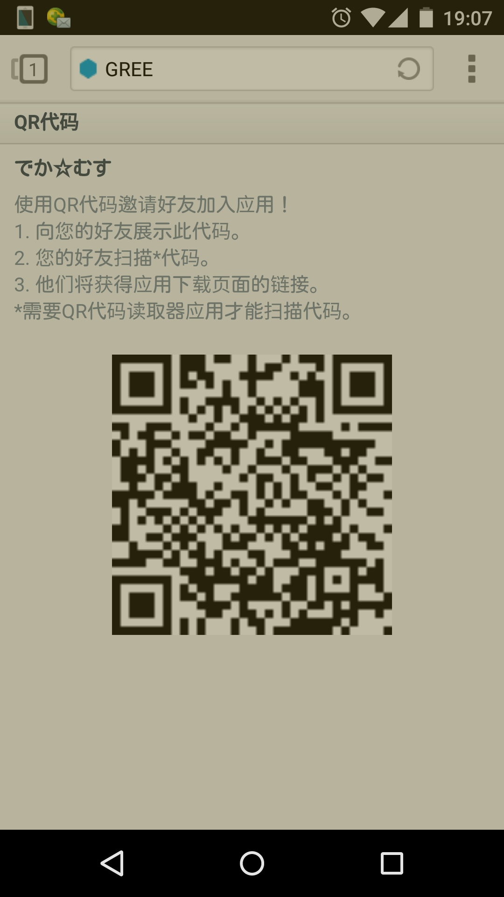](javascript:;)</ignore_js_op> <title>22</title> <link href="../Styles/Style.css" type="text/css" rel="stylesheet">

# 22

游戏模式竟然和扩散MA差不多……GREE网页游戏的弊病当时玩城姬就已经凸显了……实在不行试试安卓模拟器 <title>23</title> <link href="../Styles/Style.css" type="text/css" rel="stylesheet">

# 23

從沒玩過課金手遊的借串問一下基本的問題

編隊只能選擇四個，可是看其他功能的列表有很多妹子啊？為啥沒有出現選項，是有分啥"本體卡"嗎？ <title>24</title> <link href="../Styles/Style.css" type="text/css" rel="stylesheet">

# 24

+1幫忙幫好友解任
感覺巨大女圖指遇過一個 <title>25</title> <link href="../Styles/Style.css" type="text/css" rel="stylesheet">

# 25

 <ignore_js_op>[未命名.png](forum.php?mod=attachment&aid=NTUxMjZ8YjI0MjUxZTF8MTY3NDA2ODE2OXwxODIzMHwxOTk5NQ%3D%3D&nothumb=yes) *(43.6 KB, 下載次數: 0)*

[下載附件](forum.php?mod=attachment&aid=NTUxMjZ8YjI0MjUxZTF8MTY3NDA2ODE2OXwxODIzMHwxOTk5NQ%3D%3D&nothumb=yes)

2015-10-23 19:28 上傳  

[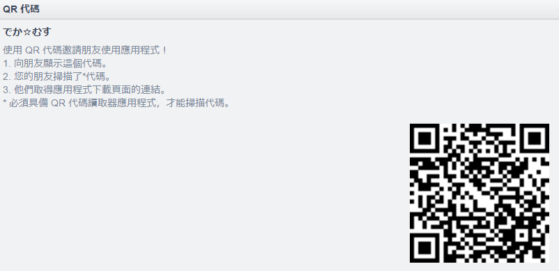](javascript:;)</ignore_js_op> <title>26</title> <link href="../Styles/Style.css" type="text/css" rel="stylesheet">

# 26

> [小虎 發表於 2015-10-23 19:18](https://giantessnight.cf/gnforum2012/forum.php?mod=redirect&goto=findpost&pid=272301&ptid=19995)
> 從沒玩過課金手遊的借串問一下基本的問題

点击总防御力上方的右箭头，就可以自己编成了
<title>27</title> <link href="../Styles/Style.css" type="text/css" rel="stylesheet">

# 27

听说很氪金，还是算了吧 <title>28</title> <link href="../Styles/Style.css" type="text/css" rel="stylesheet">

# 28

没声音怎么解决          <title>29</title> <link href="../Styles/Style.css" type="text/css" rel="stylesheet">

# 29

這樣算有成功嗎?

<ignore_js_op>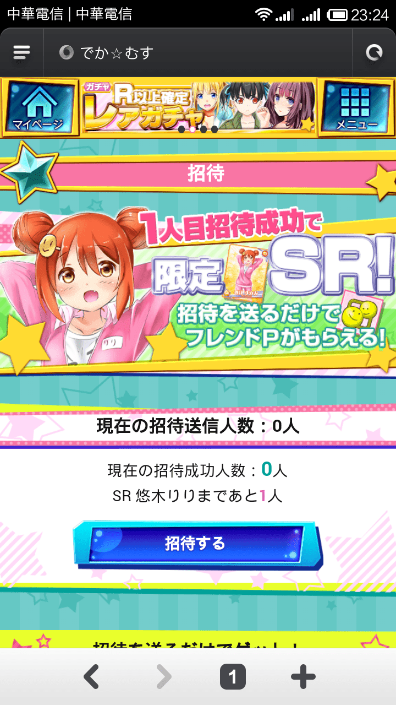

**Screenshot_2015-10-23-23-24-55.png** *(529.84 KB, 下載次數: 0)*

[下載附件](forum.php?mod=attachment&aid=NTUxNjB8ZDEwYzliM2N8MTY3NDA2ODE2OXwxODIzMHwxOTk5NQ%3D%3D&nothumb=yes)

2015-10-23 23:27 上傳

<ignore_js_op>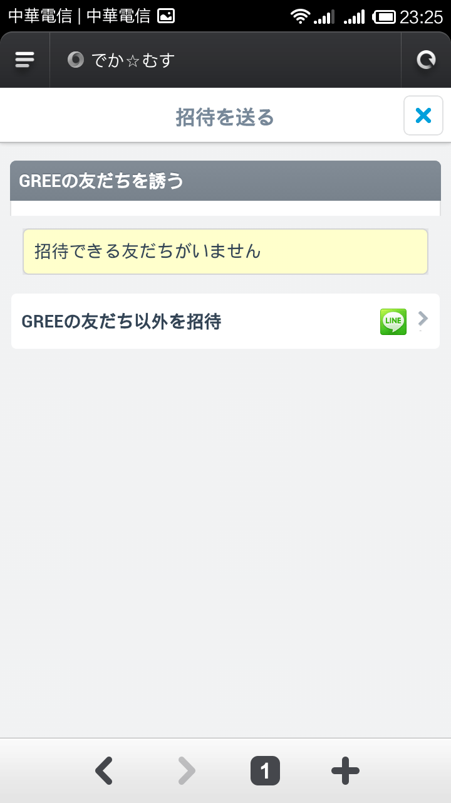

**Screenshot_2015-10-23-23-25-05.png** *(62.38 KB, 下載次數: 0)*

[下載附件](forum.php?mod=attachment&aid=NTUxNjF8NGFiMTMxZWV8MTY3NDA2ODE2OXwxODIzMHwxOTk5NQ%3D%3D&nothumb=yes)

2015-10-23 23:27 上傳

<title>30</title> <link href="../Styles/Style.css" type="text/css" rel="stylesheet">

# 30

> [joke0857 發表於 2015-10-23 23:27](https://giantessnight.cf/gnforum2012/forum.php?mod=redirect&goto=findpost&pid=272337&ptid=19995)
> 這樣算有成功嗎?

当然。。。没成功
<title>31</title> <link href="../Styles/Style.css" type="text/css" rel="stylesheet">

# 31

<ignore_js_op>

**C52AACA73F394C70068818D098FF029C.png** *(46.69 KB, 下載次數: 0)*

[下載附件](forum.php?mod=attachment&aid=NTUxNjh8MjNlYTBhMTd8MTY3NDA2ODE2OXwxODIzMHwxOTk5NQ%3D%3D&nothumb=yes)

2015-10-24 00:03 上傳

++++扫了能拿sr啊
<title>32</title> <link href="../Styles/Style.css" type="text/css" rel="stylesheet">

# 32

*本帖最後由 JOYYSOSOSO 於 2015-10-24 00:21 編輯*

你们这群不厚道的家伙 拿出来的都是招待扫码 加好友扫码需要在gree的朋友选项里面
到目前能加到好友的只有taroxd爷
而且大家都是已经进游戏了的 即使扫了码也不能给你们那个SSR了 所以老老实实的开个新的推特或者google+账号自己刷吧 反正SSR只能拿一张 之后都是朋友点数了
顺便我的码
<ignore_js_op>

**QQ图片20151024001339.png** *(30.2 KB, 下載次數: 0)*

[下載附件](forum.php?mod=attachment&aid=NTUxNjl8N2EzNWY0Mzl8MTY3NDA2ODE2OXwxODIzMHwxOTk5NQ%3D%3D&nothumb=yes)

2015-10-24 00:14 上傳

然后怎么找到这个码

首先去gree首页
[http://gree.jp/r/21488/1](http://gree.jp/r/21488/1)
并且登录你的账号

然后点这个
<ignore_js_op>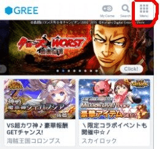

**QQ图片20151024001621.jpg** *(21.34 KB, 下載次數: 0)*

[下載附件](forum.php?mod=attachment&aid=NTUxNzB8NWIxNGMzZTF8MTY3NDA2ODE2OXwxODIzMHwxOTk5NQ%3D%3D&nothumb=yes)

2015-10-24 00:16 上傳

之后点friend 或者 友だち　
<ignore_js_op>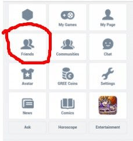

**QQ图片20151024001803.jpg** *(9.78 KB, 下載次數: 0)*

[下載附件](forum.php?mod=attachment&aid=NTUxNzF8NmEzY2FkN2F8MTY3NDA2ODE2OXwxODIzMHwxOTk5NQ%3D%3D&nothumb=yes)

2015-10-24 00:19 上傳

然后选择QR代码
<ignore_js_op>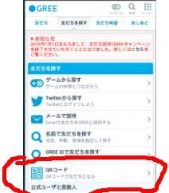

**QQ图片20151024001958.jpg** *(12.5 KB, 下載次數: 0)*

[下載附件](forum.php?mod=attachment&aid=NTUxNzJ8NTcwNzhjN2V8MTY3NDA2ODE2OXwxODIzMHwxOTk5NQ%3D%3D&nothumb=yes)

2015-10-24 00:20 上傳

这里面的二维码才是加好友用的

<title>33</title> <link href="../Styles/Style.css" type="text/css" rel="stylesheet">

# 33

> [taroxd 發表於 2015-10-23 20:30](https://giantessnight.cf/gnforum2012/forum.php?mod=redirect&goto=findpost&pid=272320&ptid=19995)
> 点击总防御力上方的右箭头，就可以自己编成了

我把圖貼出來，幫我看一下

<title>34</title> <link href="../Styles/Style.css" type="text/css" rel="stylesheet">

# 34

 <ignore_js_op>[gfdgrdg.png](forum.php?mod=attachment&aid=NTUxNzN8ZWI0MGEzNDh8MTY3NDA2ODE2OXwxODIzMHwxOTk5NQ%3D%3D&nothumb=yes) *(448.51 KB, 下載次數: 0)*

[下載附件](forum.php?mod=attachment&aid=NTUxNzN8ZWI0MGEzNDh8MTY3NDA2ODE2OXwxODIzMHwxOTk5NQ%3D%3D&nothumb=yes)

2015-10-24 00:21 上傳  

[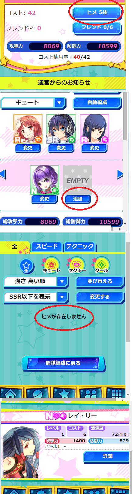](javascript:;)</ignore_js_op> <title>35</title> <link href="../Styles/Style.css" type="text/css" rel="stylesheet">

# 35

> [小虎 發表於 2015-10-24 00:21](https://giantessnight.cf/gnforum2012/forum.php?mod=redirect&goto=findpost&pid=272357&ptid=19995)
> 我把圖貼出來，幫我看一下

看你第一张图里面的 コスト使用量 ： 40/42
证明你总共可以容纳42的cost上场 你已经用了40  如果剩下的一个大于2cost 自然不会再编成里面显示出来
升级可以加总cost 貌似一级1点
<title>36</title> <link href="../Styles/Style.css" type="text/css" rel="stylesheet">

# 36

也掃一下我，我沒有智慧型手機(還在用3G)，我是用電腦玩的

<title>37</title> <link href="../Styles/Style.css" type="text/css" rel="stylesheet">

# 37

 <ignore_js_op>[jgrhjtyue56.png](forum.php?mod=attachment&aid=NTUxNzR8NjFjMjI4ZTd8MTY3NDA2ODE5N3wxODIzMHwxOTk5NQ%3D%3D&nothumb=yes) *(9.16 KB, 下載次數: 0)*

[下載附件](forum.php?mod=attachment&aid=NTUxNzR8NjFjMjI4ZTd8MTY3NDA2ODE5N3wxODIzMHwxOTk5NQ%3D%3D&nothumb=yes)

2015-10-24 00:28 上傳  

</ignore_js_op> <title>38</title> <link href="../Styles/Style.css" type="text/css" rel="stylesheet">

# 38

> [JOYYSOSOSO 發表於 2015-10-24 00:27](https://giantessnight.cf/gnforum2012/forum.php?mod=redirect&goto=findpost&pid=272358&ptid=19995)
> 看你第一张图里面的 コスト使用量 ： 40/42
> 证明你总共可以容纳42的cost上场 你已经用了40  如果剩下的一 ...

嗯嗯，感謝，因為完全沒概念，所以不知道還有這種組合限制
<title>39</title> <link href="../Styles/Style.css" type="text/css" rel="stylesheet">

# 39

请问大陆就不能注册吗？注册时提示所处该地区不能注册。 <title>40</title> <link href="../Styles/Style.css" type="text/css" rel="stylesheet">

# 40

不懂日语的我正在乱玩中
<title>41</title> <link href="../Styles/Style.css" type="text/css" rel="stylesheet">

# 41

遊戲配信了，請問事前登錄(奬勵)是不是已結束？ <title>42</title> <link href="../Styles/Style.css" type="text/css" rel="stylesheet">

# 42

(ಥ_ಥ)没号 还不让注册 orz。。
<title>43</title> <link href="../Styles/Style.css" type="text/css" rel="stylesheet">

# 43

> [level 發表於 2015-10-24 02:06](https://giantessnight.cf/gnforum2012/forum.php?mod=redirect&goto=findpost&pid=272365&ptid=19995)
> 请问大陆就不能注册吗？注册时提示所处该地区不能注册。

挂代理注册个账号，进去不用挂代理
<title>44</title> <link href="../Styles/Style.css" type="text/css" rel="stylesheet">

# 44

欢迎扫二维码加 GREE 好友 <title>45</title> <link href="../Styles/Style.css" type="text/css" rel="stylesheet">

# 45

 <ignore_js_op>[Screenshot_2015-10-24-09-58-10.png](forum.php?mod=attachment&aid=NTUxNzd8YTgzYWU2NWJ8MTY3NDA2ODE5N3wxODIzMHwxOTk5NQ%3D%3D&nothumb=yes) *(100.24 KB, 下載次數: 0)*

[下載附件](forum.php?mod=attachment&aid=NTUxNzd8YTgzYWU2NWJ8MTY3NDA2ODE5N3wxODIzMHwxOTk5NQ%3D%3D&nothumb=yes)

2015-10-24 10:05 上傳  

</ignore_js_op> <title>46</title> <link href="../Styles/Style.css" type="text/css" rel="stylesheet">

# 46

偶像到手了，SR萝莉貌似有BUG两次都没成功 <title>47</title> <link href="../Styles/Style.css" type="text/css" rel="stylesheet">

# 47

分享玩到現在的看法
1.巨大娘目前只有3種,好失望

2.本身AP消耗和回復對這遊戲來講算可接受

3.主要是獲得卡片方式頗糟糕的
a.砸錢去抽卡片
b.遊戲必抽卡片.可是重的機率低到不行都是N卡
c.打倒巨大娘的獎勵
d.活動???

4.BOSS巨大娘這社訂有點高
3種R,SR,SSR血量差了N倍
沒砸錢玩家大概只有參戰的份,可是參戰獎勵是回副AP藥水*1
發現巨大娘的獎勵孩不錯
MVP和尾刀獎勵真的很不錯

R卡血量幾千而已,找1-3人可以輕鬆解決
SR血量破萬3-4人可以決
SSR這血量目前沒有打倒過,目前有15人參加一起打.最後還是失敗

5.尾刀和MVP問題
傷害最高當然是MVP
最後一擊就是尾刀
但這會有一個問題,就是玩家會算血量
誰不想要MVP和尾刀的獎勵
造成前期玩家參戰而已(BP-0),不會真的打
到最後巨大娘血量低於多少,就會開始搶MVP和尾刀

SSR打不贏大概也是這個原因
誰都不想浪費BP去參戰而已,加上打不贏(逃走),什麼都不會有
只是浪費,那個血量一般玩家參戰只有幾百傷害
這遊戲前期碰到SSR沒人要打
R,SR比較有人
目前繼續觀望

<title>48</title> <link href="../Styles/Style.css" type="text/css" rel="stylesheet">

# 48

都是百万氪金王起的好头，我想象不出不氪金怎么弄到SSR，有无SSR输出一个天一个地 <title>49</title> <link href="../Styles/Style.css" type="text/css" rel="stylesheet">

# 49

为什么说 您所在的地区不适用啊.... <title>50</title> <link href="../Styles/Style.css" type="text/css" rel="stylesheet">

# 50

> [LZJ2230861341 發表於 2015-10-24 15:59](https://giantessnight.cf/gnforum2012/forum.php?mod=redirect&goto=findpost&pid=272420&ptid=19995)
> 为什么说 您所在的地区不适用啊....

挂代理注册，然后直接登录就是
<title>51</title> <link href="../Styles/Style.css" type="text/css" rel="stylesheet">

# 51

> [xhz 發表於 2015-10-24 16:05](https://giantessnight.cf/gnforum2012/forum.php?mod=redirect&goto=findpost&pid=272421&ptid=19995)
> 挂代理注册，然后直接登录就是

      知道了        谢了
<title>52</title> <link href="../Styles/Style.css" type="text/css" rel="stylesheet">

# 52

> [taroxd 發表於 2015-10-23 14:19](https://giantessnight.cf/gnforum2012/forum.php?mod=redirect&goto=findpost&pid=272261&ptid=19995)
> 感觉CG并不多的样子

T大你引了一只SSR，然后又刷出一只，简直狂欢
<title>53</title> <link href="../Styles/Style.css" type="text/css" rel="stylesheet">

# 53

*本帖最後由 taroxd 於 2015-10-24 20:25 編輯*

> [ud556gx 發表於 2015-10-24 13:34](https://giantessnight.cf/gnforum2012/forum.php?mod=redirect&goto=findpost&pid=272405&ptid=19995)
> 分享玩到現在的看法
> 1.巨大娘目前只有3種,好失望

关于尾刀和MVP，其实那个奖励无所谓，以帮忙的态度打就好，反正平时AP用完了BP也没啥大用，顺手打个全力攻击就闪人。而且掉落必须是发现者兼尾刀才能获得。反正一个手游而已，游戏性也一般，并不是太在意那点奖励啦。~~反正图片已经拉出来了，继续玩舰娘去~~

SR 那只，一个人也可以靠 BP 药堆死
SSR 那只，继续观望。毕竟朋友个数有限，估计还是得堆 BP 药吧（等自己队伍实力上去一点之后）……

<title>54</title> <link href="../Styles/Style.css" type="text/css" rel="stylesheet">

# 54

我发现了这游戏几个规则：
1.只有发出了援助请求才会有人参与raid，而且只有你游戏里加过的好友
2.好友有上限，可以随机搜索和制定搜索
所以打SSR有个15个人撑死了
话说我搜索时候看到个27级的土豪有了SSR巨大娘卡 <title>55</title> <link href="../Styles/Style.css" type="text/css" rel="stylesheet">

# 55

*本帖最後由 taroxd 於 2015-10-24 20:31 編輯*

> [xhz 發表於 2015-10-24 20:27](https://giantessnight.cf/gnforum2012/forum.php?mod=redirect&goto=findpost&pid=272478&ptid=19995)
> 我发现了这游戏几个规则：
> 1.只有发出了援助请求才会有人参与raid，而且只有你游戏里加过的好友
> 2.好友有上 ...

是的，这都是help里有的。想单刷的话不发援助请求就可以了。
好友的上限随等级提升而提升。不知道最多能多少个。

SSR不一定是土豪，有可能只是欧洲人。在抽卡的时候有1.5%的概率呢~~玩个舰娘让我觉得1.5%还挺高的~~

<title>56</title> <link href="../Styles/Style.css" type="text/css" rel="stylesheet">

# 56

手机用什么代理好啊 <title>57</title> <link href="../Styles/Style.css" type="text/css" rel="stylesheet">

# 57

> [源青之绅 發表於 2015-10-24 21:09](https://giantessnight.cf/gnforum2012/forum.php?mod=redirect&goto=findpost&pid=272495&ptid=19995)
> 手机用什么代理好啊

其实电脑上chrome可以玩哦~ 按F12打开开发者工具，然后点工具左上角那个手机图标~

顺便，只有注册需要代理，登录是不需要代理的
<title>58</title> <link href="../Styles/Style.css" type="text/css" rel="stylesheet">

# 58

> [taroxd 發表於 2015-10-24 21:20](https://giantessnight.cf/gnforum2012/forum.php?mod=redirect&goto=findpost&pid=272498&ptid=19995)
> 其实电脑上chrome可以玩哦~ 按F12打开开发者工具，然后点工具左上角那个手机图标~
> 
> 顺便，只有注册需要代 ...

哦，这样啊，谢谢，我试试用谷歌吧
<title>59</title> <link href="../Styles/Style.css" type="text/css" rel="stylesheet">

# 59

> [taroxd 發表於 2015-10-24 20:30](https://giantessnight.cf/gnforum2012/forum.php?mod=redirect&goto=findpost&pid=272479&ptid=19995)
> 是的，这都是help里有的。想单刷的话不发援助请求就可以了。
> 好友的上限随等级提升而提升。不知道最多能多 ...

不不，作为一个图鉴差风云的提督，舰娘的尝试次数实在太多了，我现在堆着30W没地方用。。。
这游戏10张辅助抽一次太慢了。。。
T大几张SR了？
<title>60</title> <link href="../Styles/Style.css" type="text/css" rel="stylesheet">

# 60

從沒玩過課金手遊而且日文只會看漢字的又來問問題了，因為也算是資深提督，可以的話請用艦娘內類似項目來舉例解說

1.強化、覺醒、路上撿到卡牌的lv up，三者有何不同？
2.之前隨便按了一次強化，結果卡牌都被吃了，意思是說強化會消耗你等級已經堆起來的卡牌？
3.每個階段關卡下面都有4個頭像，我現在刷1-1，其他3個都快堆到lv10了，第四個都沒掉，是單純臉黑還是有其他因素？
4.熟練度堆滿有啥功能？要如何提升？
5.攻擊、防禦、hp要如何提升？
6.技能要如何獲得？
7.角色信賴度要如何才能開始出現(空愛心)？
8.角色有像艦娘一樣的圖鑑和渠位上限嗎？
9.角色名稱旁邊的三個圖示，英文字母我知道是代表稀有度，請問另兩個圖示是代表啥？圖示顏色也有代表意義嗎？
10.靠著遊戲裡的幣和贈送的道具抽卡牌，有沒有甚麼要注意的地方或小技巧？還是有多少用多少，全用光抽下去就對了？ <title>61</title> <link href="../Styles/Style.css" type="text/css" rel="stylesheet">

# 61

> [小虎 發表於 2015-10-24 23:15](https://giantessnight.cf/gnforum2012/forum.php?mod=redirect&goto=findpost&pid=272534&ptid=19995)
> 從沒玩過課金手遊而且日文只會看漢字的又來問問題了，因為也算是資深提督，可以的話請用艦娘內類似項目來舉 ...

日语苦手只能凭经验说说了：
1.强化加熟练，相当于舰娘的改修，觉醒相当于改造，等级好像就重复卡会加，应该也是加强属性
2.吃卡加熟练，吃狗粮是手游优良传统
3.这个不清楚，我没重复刷过图
4.熟练度会加属性，塞狗粮和出击都会加，相当于经验吧
5.上面几个貌似都加属性，好像指导也加？
6.觉醒？日语苦手不清楚
7.个人指导
8不知道
9.颜色是属性，剪刀拳头布关系，爆炸图标是近战，属性高防低攻，只能放前排；流星是远程，只能后排高攻低防，折线是中庸，前后都能放，攻防差不多。
10.我现在是招待券10张抽一次，然后钱攒1W一抽，小号招待直接出了个SR闪瞎我狗眼

<title>62</title> <link href="../Styles/Style.css" type="text/css" rel="stylesheet">

# 62

这个游戏是没有声音的吗 <title>63</title> <link href="../Styles/Style.css" type="text/css" rel="stylesheet">

# 63

> [xhz 發表於 2015-10-24 23:26](https://giantessnight.cf/gnforum2012/forum.php?mod=redirect&goto=findpost&pid=272536&ptid=19995)
> 日语苦手只能凭经验说说了：
> 1.强化加熟练，相当于舰娘的改修，觉醒相当于改造，等级好像就重复卡会加， ...

謝謝你的回復

萬惡的30字
<title>64</title> <link href="../Styles/Style.css" type="text/css" rel="stylesheet">

# 64

大家多多帮忙做任务啦！！话说这个的意思是，必须要扫描登陆游戏，也就是说之前gree账号没有玩这个游戏，需要新注册扫描嘛。 <title>65</title> <link href="../Styles/Style.css" type="text/css" rel="stylesheet">

# 65

 <ignore_js_op>[S51024-234234.jpg](forum.php?mod=attachment&aid=NTUyNDJ8MjM0ZTUzMDN8MTY3NDA2ODIwMnwxODIzMHwxOTk5NQ%3D%3D&nothumb=yes) *(64.29 KB, 下載次數: 0)*

[下載附件](forum.php?mod=attachment&aid=NTUyNDJ8MjM0ZTUzMDN8MTY3NDA2ODIwMnwxODIzMHwxOTk5NQ%3D%3D&nothumb=yes)

2015-10-24 23:45 上傳  

</ignore_js_op> <title>66</title> <link href="../Styles/Style.css" type="text/css" rel="stylesheet">

# 66

> [小虎 發表於 2015-10-24 23:15](https://giantessnight.cf/gnforum2012/forum.php?mod=redirect&goto=findpost&pid=272534&ptid=19995)
> 從沒玩過課金手遊而且日文只會看漢字的又來問問題了，因為也算是資深提督，可以的話請用艦娘內類似項目來舉 ...

我来补充几条

2.我使用角色来强化角色那一项里面永远是空的 所以并不清楚使用角色怎么来强化角色 我只知道一旦获得同样的角色会自动给这个角色升一级
3.没错 就是虎爷您脸黑 每张图四个女生全得到获得 十分之一次抽角色机会（那个抽取辅助卷）
4.熟练度的狗粮就是指那个恼杀的唇膏 一次增加50熟练度 并消耗2500金钱 属性确实有提升
6.技能估计之后会掉落之类的 目前还没有任何信息
8.游戏当前版本最高容纳120名角色 但是经过我研究他的立绘发现。。。目前只有120名角色= 。=所以绝对不会溢出
9.这游戏有两套属性 橙色是可爱类角色 绿色是cool系角色 粉色是性感类角色 目前的克制关系是 可爱克制cool cool克制性感 性感克制可爱
  还有一个图标属性 一个爆炸样子的图标 那是力量型角色 往往血高 防御大于攻击 往往放在前排
                               第二个是两条拐弯的线条 这个是速度型角色 会抢先出手 特典是攻防平衡 前后排皆可
                               第三种好像抛物线的 是输出型角色 血很低 攻击大于防御 是站在后排的

<ignore_js_op>

**c-00001_i.png** *(14.86 KB, 下載次數: 0)*

[下載附件](forum.php?mod=attachment&aid=NTUyNTF8ZTczYmU2MjF8MTY3NDA2ODIwMnwxODIzMHwxOTk5NQ%3D%3D&nothumb=yes)

2015-10-25 00:28 上傳

<ignore_js_op>

**c-00004_i.png** *(13.37 KB, 下載次數: 0)*

[下載附件](forum.php?mod=attachment&aid=NTUyNTJ8NjVmNmVhNGJ8MTY3NDA2ODIwMnwxODIzMHwxOTk5NQ%3D%3D&nothumb=yes)

2015-10-25 00:28 上傳

<ignore_js_op>

**c-00007_i.png** *(14.95 KB, 下載次數: 0)*

[下載附件](forum.php?mod=attachment&aid=NTUyNTN8MWU1ZTFhMjZ8MTY3NDA2ODIwMnwxODIzMHwxOTk5NQ%3D%3D&nothumb=yes)

2015-10-25 00:28 上傳

从左到右 依次是 可爱类力量型 cool类输出型 性感类速度型
<title>67</title> <link href="../Styles/Style.css" type="text/css" rel="stylesheet">

# 67

幫作任務
還有事前的怪手是使用了直接拿到卡片還是使用了要打贏才拿到卡片? <title>68</title> <link href="../Styles/Style.css" type="text/css" rel="stylesheet">

# 68

 <ignore_js_op>[下載.png](forum.php?mod=attachment&aid=NTUyNTV8Nzk1MTA0ZWN8MTY3NDA2ODIwMnwxODIzMHwxOTk5NQ%3D%3D&nothumb=yes) *(550 Bytes, 下載次數: 0)*

[下載附件](forum.php?mod=attachment&aid=NTUyNTV8Nzk1MTA0ZWN8MTY3NDA2ODIwMnwxODIzMHwxOTk5NQ%3D%3D&nothumb=yes)

2015-10-25 01:12 上傳  

</ignore_js_op> <title>69</title> <link href="../Styles/Style.css" type="text/css" rel="stylesheet">

# 69

> JOYYSOSOSO 發表於 2015-10-24 00:12
> 你们这群不厚道的家伙 拿出来的都是招待扫码 加好友扫码需要在gree的朋友选项里面
> 到目前能加到好友的只有 ...

没懂SSR怎么拿〒_〒，难道是要邀请一个从来没有玩过的人来玩吗 <title>70</title> <link href="../Styles/Style.css" type="text/css" rel="stylesheet">

# 70

就這免洗破遊戲還有120個角色，大暈

話說就目前來說巨大妹子只有那三個？自己人都是縮小的？ <title>71</title> <link href="../Styles/Style.css" type="text/css" rel="stylesheet">

# 71

> JOYYSOSOSO 發表於 2015-10-25 00:29
> 我来补充几条
> 
> 2.我使用角色来强化角色那一项里面永远是空的 所以并不清楚使用角色怎么来强化角色 我只知 ...

╮(╯▽╰)╭可以删除好友吗 <title>72</title> <link href="../Styles/Style.css" type="text/css" rel="stylesheet">

# 72

話說要記得預先編成屬性相剋部隊，這樣打大妹子事半功倍，如果用探索部隊打，純粹浪費攻擊回合 <title>73</title> <link href="../Styles/Style.css" type="text/css" rel="stylesheet">

# 73

> [(12345) 發表於 2015-10-25 13:29](https://giantessnight.cf/gnforum2012/forum.php?mod=redirect&goto=findpost&pid=272633&ptid=19995)
> ╮(╯▽╰)╭可以删除好友吗

可以，要在好友里面单个点进去
<title>74</title> <link href="../Styles/Style.css" type="text/css" rel="stylesheet">

# 74

感覺畫風不錯，劇情也OK但是++CG咧.... <title>75</title> <link href="../Styles/Style.css" type="text/css" rel="stylesheet">

# 75

> xhz 發表於 2015-10-25 13:44
> 可以，要在好友里面单个点进去

＠(￣-￣)＠单个点进去？是在游戏里面还是gree平台？ <title>76</title> <link href="../Styles/Style.css" type="text/css" rel="stylesheet">

# 76

> [JOYYSOSOSO 發表於 2015-10-25 00:29](https://giantessnight.cf/gnforum2012/forum.php?mod=redirect&goto=findpost&pid=272563&ptid=19995)
> 我来补充几条
> 
> 2.我使用角色来强化角色那一项里面永远是空的 所以并不清楚使用角色怎么来强化角色 我只知 ...

屬性剋制你打相反了，應該是cool(綠)剋可愛(橘)剋性感(粉紅)剋cool(綠) <title>77</title> <link href="../Styles/Style.css" type="text/css" rel="stylesheet">

# 77

找到圖鑑了

萬惡的30字
<title>78</title> <link href="../Styles/Style.css" type="text/css" rel="stylesheet">

# 78

 <ignore_js_op>[gftghdr.png](forum.php?mod=attachment&aid=NTUyNzN8ZTM2MmYxYTZ8MTY3NDA2ODIxM3wxODIzMHwxOTk5NQ%3D%3D&nothumb=yes) *(242.54 KB, 下載次數: 0)*

[下載附件](forum.php?mod=attachment&aid=NTUyNzN8ZTM2MmYxYTZ8MTY3NDA2ODIxM3wxODIzMHwxOTk5NQ%3D%3D&nothumb=yes)

2015-10-25 18:05 上傳  

[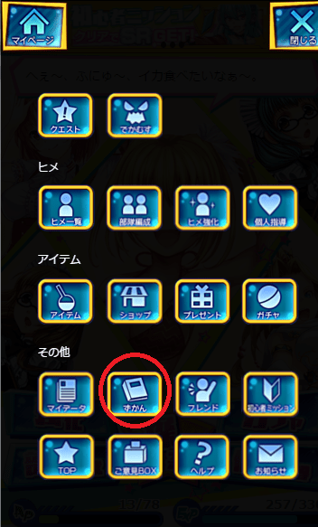](javascript:;)</ignore_js_op> <title>79</title> <link href="../Styles/Style.css" type="text/css" rel="stylesheet">

# 79

> [(12345) 發表於 2015-10-25 17:52](https://giantessnight.cf/gnforum2012/forum.php?mod=redirect&goto=findpost&pid=272684&ptid=19995)
> ＠(￣-￣)＠单个点进去？是在游戏里面还是gree平台？

游戏里，游戏好友和GREE是分开的
<title>80</title> <link href="../Styles/Style.css" type="text/css" rel="stylesheet">

# 80

> [xhz 發表於 2015-10-25 18:26](https://giantessnight.cf/gnforum2012/forum.php?mod=redirect&goto=findpost&pid=272690&ptid=19995)
> 游戏里，游戏好友和GREE是分开的

了解了！让我们来加好友吧！ID 1005303535
顺便吐槽几个地方……

1,，AP和BP分布极为不合理，AP恢复为1小时20点，BP则是一小时3点……AP根本不够用，BP则是经常溢出，除非你参战了一堆好友的邀请。
2，万恶的一小时3点BP，一个巨大娘boss出现一小时，全力出击一次3点，全恢复要一小时，也就是说……除非你算好AP刚好升一级，否则就必须要用道具恢复一次，实力劝氪……
3，1抽300円，10抽3000円，好像也么有保底，概率分别是SSR 1.5%，SR13.5%，R85%，非洲如我果然四连R……
4，P点抽10000一次，R以上获得率百分之50；200一次N，可以抽50次N……说到底这，10000抽有啥意义……
5，金钱获得的地方太少……根本不够用……
6，SSR女巨人是人打的？
7，单抽券究竟怎么获得？给好友发邮件？
8，画风其实还是不错的……说实话巨大娘要素也还不错，就是游戏性欠缺，再一个……声音呢！
9，周一到周五是打什么？觉醒素材？
10，初始R娘可爱的wwww
11，1005303535，大家都来加好友吧！！！！www
<title>81</title> <link href="../Styles/Style.css" type="text/css" rel="stylesheet">

# 81

> [(12345) 發表於 2015-10-25 20:34](https://giantessnight.cf/gnforum2012/forum.php?mod=redirect&goto=findpost&pid=272699&ptid=19995)
> 了解了！让我们来加好友吧！ID 1005303535
> 顺便吐槽几个地方……

加你了，我是1005267600，大家加好了 <title>82</title> <link href="../Styles/Style.css" type="text/css" rel="stylesheet">

# 82

我已经被小号晒瞎了，这个小号有后宫王的潜质，抽的全是大小姐
大号抽的都是歪瓜裂枣 <title>83</title> <link href="../Styles/Style.css" type="text/css" rel="stylesheet">

# 83

 <ignore_js_op>[Screenshot_2015-10-25-21-29-32.png](forum.php?mod=attachment&aid=NTUyNzd8MjYwNTAwZTh8MTY3NDA2ODIxOHwxODIzMHwxOTk5NQ%3D%3D&nothumb=yes) *(630.22 KB, 下載次數: 0)*

[下載附件](forum.php?mod=attachment&aid=NTUyNzd8MjYwNTAwZTh8MTY3NDA2ODIxOHwxODIzMHwxOTk5NQ%3D%3D&nothumb=yes)

2015-10-25 21:31 上傳  

[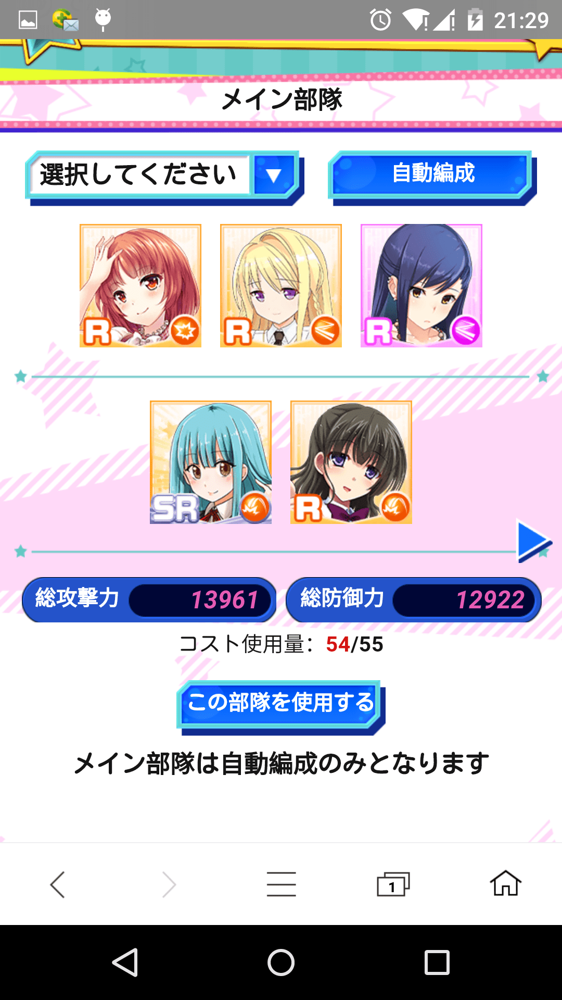](javascript:;)</ignore_js_op> <title>84</title> <link href="../Styles/Style.css" type="text/css" rel="stylesheet">

# 84

> [xhz 發表於 2015-10-25 21:32](https://giantessnight.cf/gnforum2012/forum.php?mod=redirect&goto=findpost&pid=272708&ptid=19995)
> 我已经被小号晒瞎了，这个小号有后宫王的潜质，抽的全是大小姐
> 大号抽的都是歪瓜裂枣 ...

人类为何要玩小号，玩小号的意义难道不是伤害大号嘛
非洲人何以为战！

<title>85</title> <link href="../Styles/Style.css" type="text/css" rel="stylesheet">

# 85

> [(12345) 發表於 2015-10-25 21:39](https://giantessnight.cf/gnforum2012/forum.php?mod=redirect&goto=findpost&pid=272709&ptid=19995)
> 人类为何要玩小号，玩小号的意义难道不是伤害大号嘛
> 非洲人何以为战！

嘛，小号是可以刷点GTS让大号补刀领辅助券
<title>86</title> <link href="../Styles/Style.css" type="text/css" rel="stylesheet">

# 86

> [xhz 發表於 2015-10-25 21:59](https://giantessnight.cf/gnforum2012/forum.php?mod=redirect&goto=findpost&pid=272713&ptid=19995)
> 嘛，小号是可以刷点GTS让大号补刀领辅助券

切换起来太麻烦了所以我放弃惹……
顺便，那个公式参加获得券的 是怎么弄？

单抽又是R

<title>87</title> <link href="../Styles/Style.css" type="text/css" rel="stylesheet">

# 87

能告诉我怎么注册吖╭(°A°`)╮ <title>88</title> <link href="../Styles/Style.css" type="text/css" rel="stylesheet">

# 88

借問一下，應援邀請會不會分薄戰利品？還是只是讓別人多拿？ <title>89</title> <link href="../Styles/Style.css" type="text/css" rel="stylesheet">

# 89

> [(12345) 發表於 2015-10-25 22:01](https://giantessnight.cf/gnforum2012/forum.php?mod=redirect&goto=findpost&pid=272714&ptid=19995)
> 切换起来太麻烦了所以我放弃惹……
> 顺便，那个公式参加获得券的 是怎么弄？

两个不同内核浏览器可以双开，不用切账号
<title>90</title> <link href="../Styles/Style.css" type="text/css" rel="stylesheet">

# 90

> [仅存的骄傲 發表於 2015-10-25 22:27](https://giantessnight.cf/gnforum2012/forum.php?mod=redirect&goto=findpost&pid=272725&ptid=19995)
> 能告诉我怎么注册吖╭(°A°`)╮

挂代理GREE上注册个账号，然后就可以不用代理登陆账号玩 <title>91</title> <link href="../Styles/Style.css" type="text/css" rel="stylesheet">

# 91

> [xhz 發表於 2015-10-25 22:43](https://giantessnight.cf/gnforum2012/forum.php?mod=redirect&goto=findpost&pid=272733&ptid=19995)
> 两个不同内核浏览器可以双开，不用切账号

我的浏览器使用不能！你是用什么浏览器啊~
<title>92</title> <link href="../Styles/Style.css" type="text/css" rel="stylesheet">

# 92

> [xhz 發表於 2015-10-25 22:43](https://giantessnight.cf/gnforum2012/forum.php?mod=redirect&goto=findpost&pid=272733&ptid=19995)
> 两个不同内核浏览器可以双开，不用切账号

我用chrome就是这样：“『でか☆むす』をプレイするには会員登録が必要となります。”
<ignore_js_op>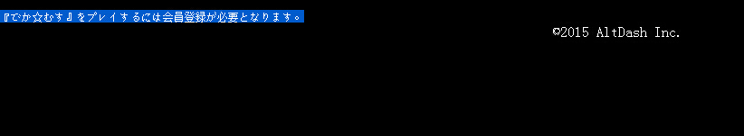

**QQ截图20151025235003.jpg** *(29.92 KB, 下載次數: 0)*

[下載附件](forum.php?mod=attachment&aid=NTUyNzl8MjZiYTdiNTF8MTY3NDA2ODIyNnwxODIzMHwxOTk5NQ%3D%3D&nothumb=yes)

2015-10-25 22:50 上傳

<title>93</title> <link href="../Styles/Style.css" type="text/css" rel="stylesheet">

# 93

> [(12345) 發表於 2015-10-25 22:50](https://giantessnight.cf/gnforum2012/forum.php?mod=redirect&goto=findpost&pid=272737&ptid=19995)
> 我用chrome就是这样：“『でか☆むす』をプレイするには会員登録が必要となります。 ...

你没有登陆就连APP当然不给你上，先上GREE登陆下 <title>94</title> <link href="../Styles/Style.css" type="text/css" rel="stylesheet">

# 94

再借問一下，主畫面BP旁邊那個硬幣是做啥用的？ <title>95</title> <link href="../Styles/Style.css" type="text/css" rel="stylesheet">

# 95

> [xhz 發表於 2015-10-25 22:51](https://giantessnight.cf/gnforum2012/forum.php?mod=redirect&goto=findpost&pid=272738&ptid=19995)
> 你没有登陆就连APP当然不给你上，先上GREE登陆下

<ignore_js_op>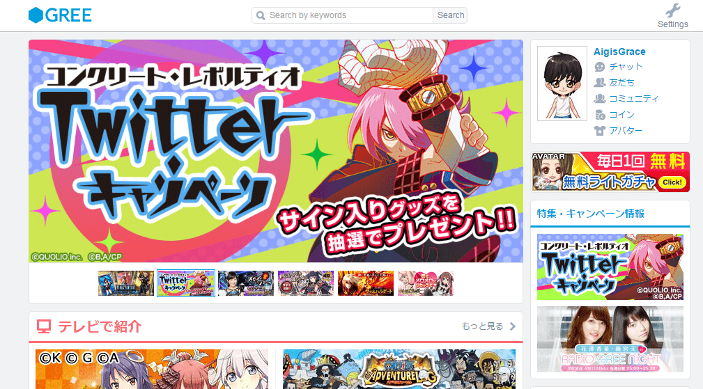

**QQ截图20151025235633.jpg** *(811.9 KB, 下載次數: 0)*

[下載附件](forum.php?mod=attachment&aid=NTUyODB8ZDk2Y2U0MmN8MTY3NDA2ODIyNnwxODIzMHwxOTk5NQ%3D%3D&nothumb=yes)

2015-10-25 22:58 上傳

应该是在登陆状态吧，我还试了一下其他游戏，有的就是可以玩~
<title>96</title> <link href="../Styles/Style.css" type="text/css" rel="stylesheet">

# 96

> [xhz 發表於 2015-10-25 22:51](https://giantessnight.cf/gnforum2012/forum.php?mod=redirect&goto=findpost&pid=272738&ptid=19995)
> 你没有登陆就连APP当然不给你上，先上GREE登陆下

<ignore_js_op>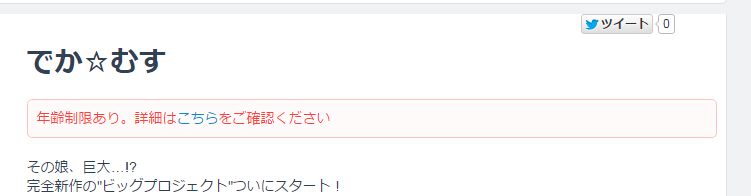

**QQ截图20151026001809.jpg** *(68.98 KB, 下載次數: 0)*

[下載附件](forum.php?mod=attachment&aid=NTUyODF8ZDRkMGI0MzF8MTY3NDA2ODIyNnwxODIzMHwxOTk5NQ%3D%3D&nothumb=yes)

2015-10-25 23:18 上傳

去掉代理显示年龄限制我去……
<title>97</title> <link href="../Styles/Style.css" type="text/css" rel="stylesheet">

# 97

> [小虎 發表於 2015-10-25 22:57](https://giantessnight.cf/gnforum2012/forum.php?mod=redirect&goto=findpost&pid=272739&ptid=19995)
> 再借問一下，主畫面BP旁邊那個硬幣是做啥用的？

强化除了吃狗粮还要强化币，就这个，我钱都不够吃的 <title>98</title> <link href="../Styles/Style.css" type="text/css" rel="stylesheet">

# 98

招待
拜託各位                                                       <title>99</title> <link href="../Styles/Style.css" type="text/css" rel="stylesheet">

# 99

 <ignore_js_op>[下載.png](forum.php?mod=attachment&aid=NTUyODJ8Zjk1ZWRhNjV8MTY3NDA2ODIyNnwxODIzMHwxOTk5NQ%3D%3D&nothumb=yes) *(550 Bytes, 下載次數: 0)*

[下載附件](forum.php?mod=attachment&aid=NTUyODJ8Zjk1ZWRhNjV8MTY3NDA2ODIyNnwxODIzMHwxOTk5NQ%3D%3D&nothumb=yes)

2015-10-26 02:03 上傳  

</ignore_js_op> <title>100</title> <link href="../Styles/Style.css" type="text/css" rel="stylesheet">

# 100

> [小虎 發表於 2015-10-25 17:59](https://giantessnight.cf/gnforum2012/forum.php?mod=redirect&goto=findpost&pid=272685&ptid=19995)
> 屬性剋制你打相反了，應該是cool(綠)剋可愛(橘)剋性感(粉紅)剋cool(綠)

感谢虎爷指正 我一直以为因潘一与是cool角色才犯了这个错 不好意思咯
<title>101</title> <link href="../Styles/Style.css" type="text/css" rel="stylesheet">

# 101

> xhz 發表於 2015-10-25 23:32
> 强化除了吃狗粮还要强化币，就这个，我钱都不够吃的

＠(￣-￣)＠年龄限制的问题怎么解决呀 <title>102</title> <link href="../Styles/Style.css" type="text/css" rel="stylesheet">

# 102

> [(12345) 發表於 2015-10-26 07:35](https://giantessnight.cf/gnforum2012/forum.php?mod=redirect&goto=findpost&pid=272770&ptid=19995)
> ＠(￣-￣)＠年龄限制的问题怎么解决呀

你是不是注册的时候没改生日。。。
<title>103</title> <link href="../Styles/Style.css" type="text/css" rel="stylesheet">

# 103

> xhz 發表於 2015-10-26 09:25
> 你是不是注册的时候没改生日。。。

注册的时候肯定是大于18岁的呀，而且我又去设置里改了一次＠(￣-￣)＠
╮(╯▽╰)╭而且手机是能玩的 <title>104</title> <link href="../Styles/Style.css" type="text/css" rel="stylesheet">

# 104

招待
拜託各位
完全不懂怎麼用@@ <title>105</title> <link href="../Styles/Style.css" type="text/css" rel="stylesheet">

# 105

 <ignore_js_op>[GREE.png](forum.php?mod=attachment&aid=NTUyODN8NTRjNDgzN2R8MTY3NDA2ODIzN3wxODIzMHwxOTk5NQ%3D%3D&nothumb=yes) *(550 Bytes, 下載次數: 0)*

[下載附件](forum.php?mod=attachment&aid=NTUyODN8NTRjNDgzN2R8MTY3NDA2ODIzN3wxODIzMHwxOTk5NQ%3D%3D&nothumb=yes)

2015-10-26 13:58 上傳  

</ignore_js_op> <title>106</title> <link href="../Styles/Style.css" type="text/css" rel="stylesheet">

# 106

> [FINAL 發表於 2015-10-26 13:58](https://giantessnight.cf/gnforum2012/forum.php?mod=redirect&goto=findpost&pid=272782&ptid=19995)
> 招待
> 拜託各位
> 完全不懂怎麼用@@

你拜托我们没用，要找没进过游戏新建账号的人
<title>107</title> <link href="../Styles/Style.css" type="text/css" rel="stylesheet">

# 107

感觉今天Raid援助请求很少，我小号有好几个大号都看不到，小号就大号一个好友，估计和等级有关，过了20级后10多级的Raid貌似就收不到了 <title>108</title> <link href="../Styles/Style.css" type="text/css" rel="stylesheet">

# 108

> [xhz 發表於 2015-10-26 18:22](https://giantessnight.cf/gnforum2012/forum.php?mod=redirect&goto=findpost&pid=272806&ptid=19995)
> 感觉今天Raid援助请求很少，我小号有好几个大号都看不到，小号就大号一个好友，估计和等级有关，过了20级后 ...

因为简单的就自己打掉了。比如说我遇到那只R的巨大娘的话，请求完1分钟不到就有两个人来打，然后我自己3BP就打死了。

<title>109</title> <link href="../Styles/Style.css" type="text/css" rel="stylesheet">

# 109

> xhz 發表於 2015-10-26 18:22
> 感觉今天Raid援助请求很少，我小号有好几个大号都看不到，小号就大号一个好友，估计和等级有关，过了20级后 ...

今天连SR和SSR的请求都很少……＠(￣-￣)＠一天不知道该做什么 <title>110</title> <link href="../Styles/Style.css" type="text/css" rel="stylesheet">

# 110

> taroxd 發表於 2015-10-26 21:55
> 因为简单的就自己打掉了。比如说我遇到那只R的巨大娘的话，请求完1分钟不到就有两个人来打，然后我自己3B ...

＠(￣-￣)＠今天自己找到的SR被抢了人头，超不开心……砸了6BP上去 <title>111</title> <link href="../Styles/Style.css" type="text/css" rel="stylesheet">

# 111

> [taroxd 發表於 2015-10-26 21:55](https://giantessnight.cf/gnforum2012/forum.php?mod=redirect&goto=findpost&pid=272829&ptid=19995)
> 因为简单的就自己打掉了。比如说我遇到那只R的巨大娘的话，请求完1分钟不到就有两个人来打，然后我自己3B ...

我感觉等级有关，我小号有的请求大号都看不到，而且小号到了二十级也什么都收不到了 <title>112</title> <link href="../Styles/Style.css" type="text/css" rel="stylesheet">

# 112

> xhz 發表於 2015-10-26 22:34
> 我感觉等级有关，我小号有的请求大号都看不到，而且小号到了二十级也什么都收不到了 ...

觉醒除了耀日素材还要什么呀 <title>113</title> <link href="../Styles/Style.css" type="text/css" rel="stylesheet">

# 113

 <ignore_js_op>[S51026-231901.jpg](forum.php?mod=attachment&aid=NTUzNzZ8ZGI0MmU5OTZ8MTY3NDA2ODIzN3wxODIzMHwxOTk5NQ%3D%3D&nothumb=yes) *(68.9 KB, 下載次數: 0)*

[下載附件](forum.php?mod=attachment&aid=NTUzNzZ8ZGI0MmU5OTZ8MTY3NDA2ODIzN3wxODIzMHwxOTk5NQ%3D%3D&nothumb=yes)

2015-10-26 23:19 上傳  

[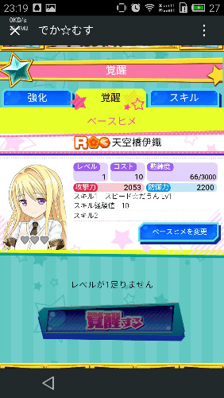](javascript:;)</ignore_js_op> <title>114</title> <link href="../Styles/Style.css" type="text/css" rel="stylesheet">

# 114

> [(12345) 發表於 2015-10-26 23:20](https://giantessnight.cf/gnforum2012/forum.php?mod=redirect&goto=findpost&pid=272841&ptid=19995)
> 觉醒除了耀日素材还要什么呀

有个睫毛膏样子的不知道哪弄 <title>115</title> <link href="../Styles/Style.css" type="text/css" rel="stylesheet">

# 115

> [xhz 發表於 2015-10-26 23:30](https://giantessnight.cf/gnforum2012/forum.php?mod=redirect&goto=findpost&pid=272845&ptid=19995)
> 有个睫毛膏样子的不知道哪弄

睫毛膏今天的曜日给，但是打了还是不能觉醒……
<title>116</title> <link href="../Styles/Style.css" type="text/css" rel="stylesheet">

# 116

> [(12345) 發表於 2015-10-26 23:32](https://giantessnight.cf/gnforum2012/forum.php?mod=redirect&goto=findpost&pid=272846&ptid=19995)
> 睫毛膏今天的曜日给，但是打了还是不能觉醒……

哪个难度的？话说我怀疑有外挂bot了，我现在这个世界相当于日本凌晨2点放了个raid在5秒内被4个人刷爆 <title>117</title> <link href="../Styles/Style.css" type="text/css" rel="stylesheet">

# 117

> xhz 發表於 2015-10-27 00:50
> 哪个难度的？话说我怀疑有外挂bot了，我现在这个世界相当于日本凌晨2点放了个raid在5秒内被4个人刷爆 ...

初级给R觉醒素材，中级SR，上级SSR，好像觉醒必要是等级二……也就是说除了掉落的boss卡以外都要抽到复制人才行……神坑啊＠(￣-￣)＠ <title>118</title> <link href="../Styles/Style.css" type="text/css" rel="stylesheet">

# 118

> [(12345) 發表於 2015-10-27 01:20](https://giantessnight.cf/gnforum2012/forum.php?mod=redirect&goto=findpost&pid=272856&ptid=19995)
> 初级给R觉醒素材，中级SR，上级SSR，好像觉醒必要是等级二……也就是说除了掉落的boss卡以外都要抽到复制 ...

刚刚一波raid大井喷我小号收了8个人头。。。大号就出了一个援助。。。肯定有问题 <title>119</title> <link href="../Styles/Style.css" type="text/css" rel="stylesheet">

# 119

> xhz 發表於 2015-10-27 01:55
> 刚刚一波raid大井喷我小号收了8个人头。。。大号就出了一个援助。。。肯定有问题 ...

大号30了……至今搜索不到什么raid，前天晚上明明那么多</ignore_js_op></ignore_js_op></ignore_js_op></ignore_js_op></ignore_js_op></ignore_js_op></ignore_js_op></ignore_js_op></ignore_js_op></ignore_js_op></ignore_js_op></ignore_js_op></ignore_js_op></ignore_js_op></ignore_js_op>