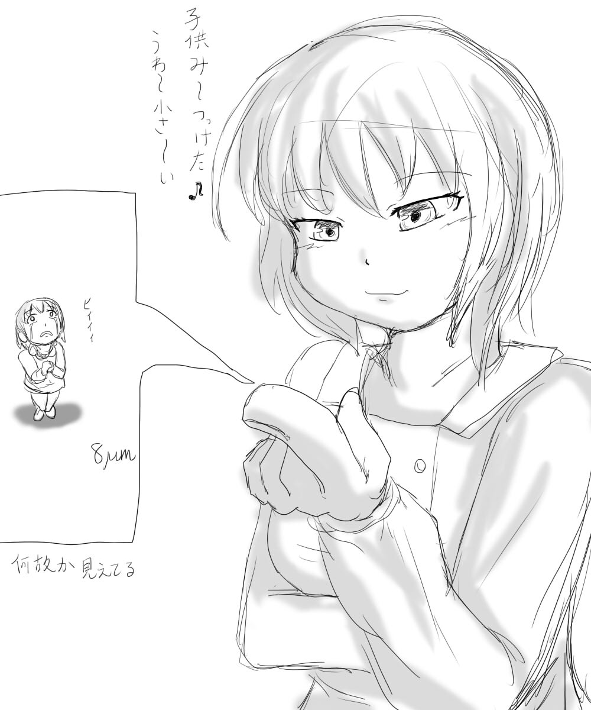
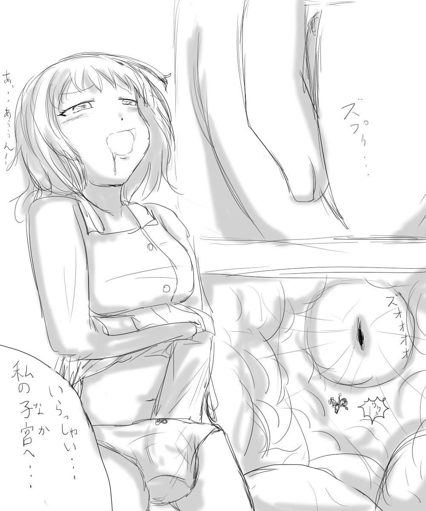
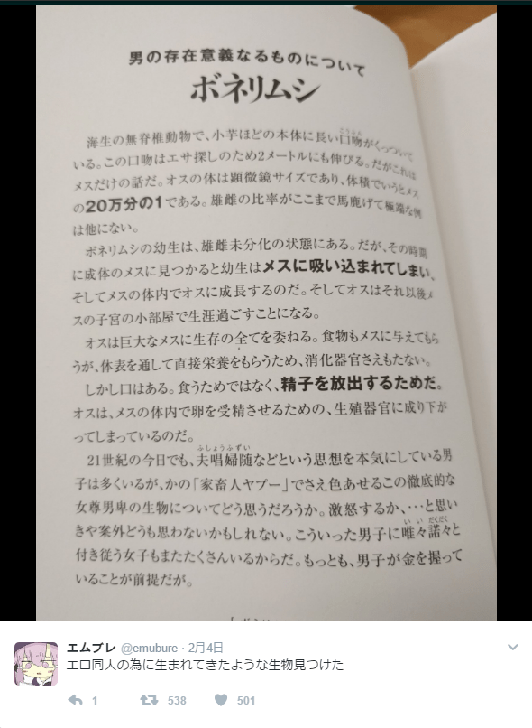

# ボネリムシ拟人化

作者：amira

TID：22572

<title>1</title> <link href="../Styles/Style.css" type="text/css" rel="stylesheet">

# 1

> 在アシダカ（@ashidaka20）的推上看到了有趣的漫画
> [https://twitter.com/ashidaka20/status/828109724981698565](https://twitter.com/ashidaka20/status/828109724981698565)
> 是将ボネリムシ的生态拟人化的结果

<ignore_js_op>

**C34JVoqVUAIZMHw.jpg** *(114.67 KB, 下載次數: 0)*

[下載附件](forum.php?mod=attachment&aid=NjY3Nzl8Y2ZlOTgxMTR8MTY3NDA2NzcwM3wxODIzMHwyMjU3Mg%3D%3D&nothumb=yes)

2017-2-6 03:38 上傳

<ignore_js_op>

**C34JW2fUcAENryZ.jpg** *(129.77 KB, 下載次數: 0)*

[下載附件](forum.php?mod=attachment&aid=NjY3ODB8ZDQ3Y2IxZTZ8MTY3NDA2NzcwM3wxODIzMHwyMjU3Mg%3D%3D&nothumb=yes)

2017-2-6 03:38 上傳

<ignore_js_op>

**C34JX6KVYAAGLgX.jpg** *(104.33 KB, 下載次數: 0)*

[下載附件](forum.php?mod=attachment&aid=NjY3ODF8ZWQ1NjcwMDF8MTY3NDA2NzcwM3wxODIzMHwyMjU3Mg%3D%3D&nothumb=yes)

2017-2-6 03:38 上傳

> 关于ボネリムシ（Bonellia，后螠），属于螠虫动物门里的，因此如果要搜索的话，建议做好心理准备

<ignore_js_op>

**QQ图片20170206034135.png** *(356.18 KB, 下載次數: 0)*

[下載附件](forum.php?mod=attachment&aid=NjY3ODJ8NDRlOWM5Mzd8MTY3NDA2NzcwM3wxODIzMHwyMjU3Mg%3D%3D&nothumb=yes)

2017-2-6 03:42 上傳

各位有受到什么启发吗？
<title>2</title> <link href="../Styles/Style.css" type="text/css" rel="stylesheet">

# 2

大自然真是不可思議(茶) <title>3</title> <link href="../Styles/Style.css" type="text/css" rel="stylesheet">

# 3

这个心理准备实在是太大了一点 <title>4</title> <link href="../Styles/Style.css" type="text/css" rel="stylesheet">

# 4

可以的啊，这个缩小的级别是最能勾起人遐想的不是麽 <title>5</title> <link href="../Styles/Style.css" type="text/css" rel="stylesheet">

# 5

所以这个实际上是一个人外娘？ <title>6</title> <link href="../Styles/Style.css" type="text/css" rel="stylesheet">

# 6

我很久以前就曾想关于这种动物居然没人理</ignore_js_op></ignore_js_op></ignore_js_op></ignore_js_op>