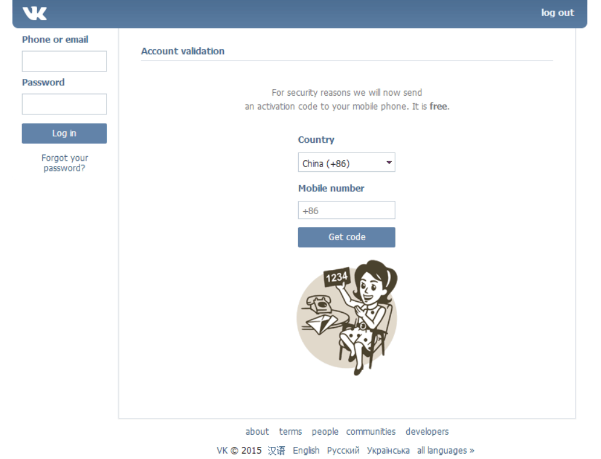
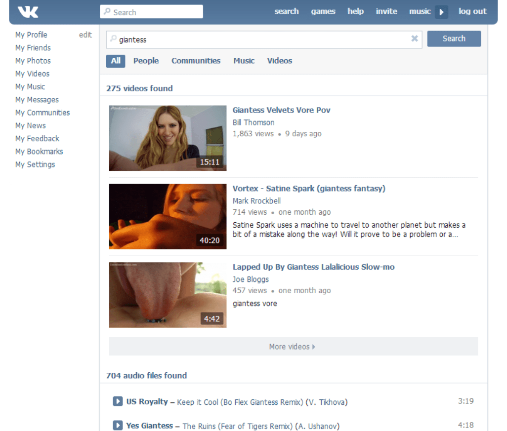
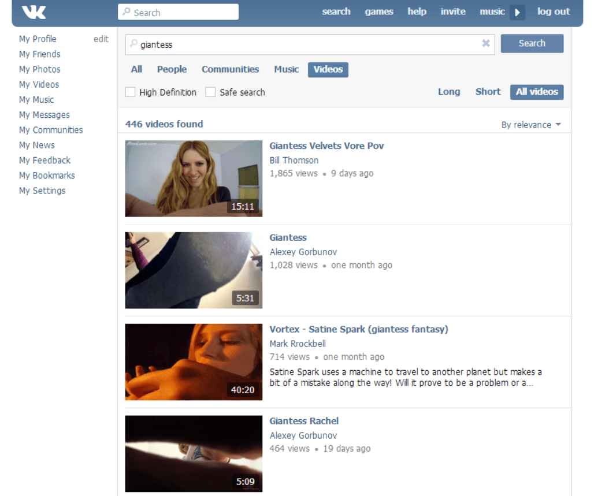
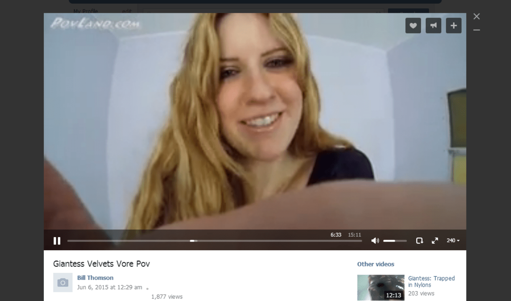

# 【DON'T PANIC】VK在线影片漫游指南——没有资源，再也不用...

作者：摸鱼摸鱼

TID：19199

<title>1</title> <link href="../Styles/Style.css" type="text/css" rel="stylesheet">

# 1

*本帖最後由 alberta 於 2015-6-25 12:00 編輯*

这是alberta的第1篇主题

***DON'T***
****PANIC**** 

**[1]****简介**
VK（原VKontakte）是欧洲最大的社交网站，Alexa的全球排名第20位，仅次于搜索引擎Yandex的俄罗斯第二大网站。主要用户分布在俄罗斯、乌克兰、白俄罗斯、阿塞拜疆、哈萨克斯坦、吉尔吉斯斯坦、摩尔多瓦等俄语区，截至2012年12月，VK拥有至少195万个账户，平均43万日常用户。
作为一个拥有大量用户群体的社交网站，VK中的视频资源绝对超乎你想象。并且因为资源检索系统采用了年龄分级制度（safe serach），我们能发掘到的资源深度就肯定会比Youtube等一众视频网站更多更广。同时，这个国外的社交网站**无需翻墙**，大陆人民可以直连（我就不吐槽很多人用这个平台勾搭俄罗斯妹子的事，详情请看VK百度贴吧）。<ignore_js_op>

**VK.jpg** *(5.46 KB, 下載次數: 0)*

[下載附件](forum.php?mod=attachment&aid=NTI0ODJ8ZTVlMzc2NGV8MTY3NDA2OTQ1MXwxODIzMHwxOTE5OQ%3D%3D&nothumb=yes)

2015-6-15 15:36 上傳

* * *

**[2]****登入**输入坐标：**[vk.com](http://vk.com)**（注册的过程需要使用移动电话）。
<ignore_js_op></ignore_js_op> **注册.jpg** *(67.39 KB, 下載次數: 2)*

[下載附件](forum.php?mod=attachment&aid=NTI0ODZ8ZjFjYzNmZWV8MTY3NDA2OTQ1MXwxODIzMHwxOTE5OQ%3D%3D&nothumb=yes)

2015-6-15 15:41 上傳 （姓-名-男女性别确认-**Sign up**）
<ignore_js_op></ignore_js_op> **注册1.png** *(34.8 KB, 下載次數: 0)*

[下載附件](forum.php?mod=attachment&aid=NTI0ODd8ODZhMDdhOWF8MTY3NDA2OTQ1MXwxODIzMHwxOTE5OQ%3D%3D&nothumb=yes)

2015-6-15 15:41 上傳

（国际区号确认-电话号-**Get code**）
（输入手机验证码-设置密码-**Join Vk**）

* * *

**[3]搜索**
个人首页最上方的导航工具项（**Search**相关）提供有搜索功能。
<ignore_js_op></ignore_js_op> **搜索.png** *(274.23 KB, 下載次數: 0)*

[下載附件](forum.php?mod=attachment&aid=NTI0ODR8NjM1MzBjYTh8MTY3NDA2OTQ1MXwxODIzMHwxOTE5OQ%3D%3D&nothumb=yes)

2015-6-15 15:40 上傳

（包含所有内容项的搜索结果）
<ignore_js_op></ignore_js_op> **搜索1.png** *(296.36 KB, 下載次數: 0)*

[下載附件](forum.php?mod=attachment&aid=NTI0ODV8YTE0MjkzYmN8MTY3NDA2OTQ1MXwxODIzMHwxOTE5OQ%3D%3D&nothumb=yes)

2015-6-15 15:40 上傳

（选择**Videos**筛选项，然后把**Safe search**选项的勾取消掉。）
 <ignore_js_op></ignore_js_op> **观看.png** *(352.13 KB, 下載次數: 0)*

[下載附件](forum.php?mod=attachment&aid=NTI0ODh8YWRiZTZjNDB8MTY3NDA2OTQ1MXwxODIzMHwxOTE5OQ%3D%3D&nothumb=yes)

2015-6-15 15:58 上傳 （愉快的观看吧！）

* * *

**[4]****关键词**
 *   这两个词缀基本可以检索到60%的资源：**Giantess**（女巨人）、**Vore**（吞食）
*   同时你可以尝试这些词汇：**Shrink**（缩小）、**GTS**（女巨人）、**Tiny man**（小人）
*   搜索出结果后一定要把**Safe search**选项的勾取消掉。 

* * *

**[5]用户** 某些用户往往会选择隐藏自己上传的视频，所以另外40%的资源往往就需要**深度发掘**才能找到。

*   **Mark Rrockbell（6部影片）**
*   **Franta Prchal（762部影片）**
*   **Peter Mac（391部影片，默认头像）**
*   **Jay Bqu（223部影片）**
*   **Dzhon Konor（172部影片，海豹头像）**
*   **Edward Lopez（132部影片，3D头像）**

以上用户需选择**People**筛选项进入其个人用户页面，点击**Videos**选项方可查看他收藏的影片。
（这样的用户在VK里还有很多，特别是有些拥有大量影片的用户都设置了隐私选项，无法直接通过搜索搜到，比如说**Ali Ali**，他收藏有1666部影片。）

* * *

**[6]****社区**
除了查找用户以外，检索社区也是不错的选择。除了影片之外，社区里也有大量的图片资源。
 *   **World of Giantess (Size Fetish)**
*   **GIANTESS AND SEXY PLANET**
*   **Великанши и уменьшенные люди (Femdom, БДСМ)** 
以上社区需选择**Communities**筛选项进入其社区群页面，点击**Videos**选项方可查看社区中上传的影片。

<title>2</title> <link href="../Styles/Style.css" type="text/css" rel="stylesheet">

# 2

*本帖最後由 alberta 於 2015-6-18 10:20 編輯*

**[7]****下载**

<ignore_js_op>

**Chrome.jpg** *(5.31 KB, 下載次數: 0)*

[下載附件](forum.php?mod=attachment&aid=NTI1MDd8OWZhMGE5ZGZ8MTY3NDA2OTQ1MXwxODIzMHwxOTE5OQ%3D%3D&nothumb=yes)

2015-6-17 15:39 上傳

**流媒体截取**（使用**谷歌Chrome**浏览器） 

|  
*   页面空白处单击鼠标右键，选择**审查元素**。
*   刷新页面并播放视频。
*   点击**network**选项块，通过**size**按钮从大到小筛选，查找视频的扩展名（多是**mp4**格式），选择**Open link in new tab**（新窗口打开）或者**Copy link adress**（复制链接）就能获取视频地址链接。

 |

<ignore_js_op></ignore_js_op> **Firefox.jpg** *(6.83 KB, 下載次數: 0)*

[下載附件](forum.php?mod=attachment&aid=NTI1MDh8ZTlkYjlhZTd8MTY3NDA2OTQ1MXwxODIzMHwxOTE5OQ%3D%3D&nothumb=yes)

2015-6-17 15:39 上傳

**第三方插件**（使用**火狐Firefox**浏览器） 

|  
*   在Firefox中单击**工具**菜单，打开**附加组件**。
*   在右侧的搜索框里输入**视频**，单击右边的**搜索**按钮。
*   在列表中找到**NetVideohunter Video Downloader**，单击右边的**安装**按钮。
*   安装完成之后单击**立即重启**，重新启动浏览器。
*   重启之后在Firefox的工具栏上会出现一个此插件的按钮。
*   播放在线视频后点击插件按钮按相应提示便能下载视频。

 |

 **第三方软件或网站**（使用**其它**浏览器） 

|   |

<title>3</title> <link href="../Styles/Style.css" type="text/css" rel="stylesheet">

# 3

*本帖最後由 alberta 於 2015-6-17 15:48 編輯*

**[8]****其它**来自11楼**jiachufan1**的使用心得：

| 琢磨了一下午 VK（不需要翻墙） 发现 VK有一个好处
其实VK有很多隐藏的giantess 视频内容
VK的搜索系统不太好 单纯 搜索giantess 或一些其他名词 都不能搜索到全部内容

于是乎 我研究了一个 好方法
那就是找作者
举个例子，你找到了一个giantess视频（最好纯giantess）
你查看他作者（就是上传用户） 怎么看？（直接点击 视频↗的XX）
就可以看到作者
然后往下翻
就可以找到 很多 关于giantess 的视频  
（为什么搜索giantess搜索不到？）
因为很多giantess 视频都是 俄罗斯文 或者改了一个其他的名字
然后尽情的去找作者 然后去翻视频吧
奋斗了4个小时 终于找到了 不少
然后层层赛选出来了一些（由于我对这东西比较苛刻。只选了5个高质量的  链接就不发了，要的私信我。就这几天 过期就删了）
还是蛮给力的
------------------------------------------
下载视频 用火狐浏览器 安装VideoHunter插件 就可以下载了
不会 百度搜 |

<title>4</title> <link href="../Styles/Style.css" type="text/css" rel="stylesheet">

# 4

这上面的视频和[http://biqle.ru/video/](http://biqle.ru/video/)
的有区别吗？ <title>5</title> <link href="../Styles/Style.css" type="text/css" rel="stylesheet">

# 5

> [jiachufan1 發表於 2015-6-15 16:36](https://giantessnight.cf/gnforum2012/forum.php?mod=redirect&goto=findpost&pid=257876&ptid=19199)
> 这上面的视频和http://biqle.ru/video/
> 的有区别吗？

bigle video上所能看到的资源只是VK的一部分。同时，它能搜索到的资源数全都来自之于VK。

<title>6</title> <link href="../Styles/Style.css" type="text/css" rel="stylesheet">

# 6

都是大神  膜拜。。。。 <title>7</title> <link href="../Styles/Style.css" type="text/css" rel="stylesheet">

# 7

膜拜之，都是专业人士啊 <title>8</title> <link href="../Styles/Style.css" type="text/css" rel="stylesheet">

# 8

这个VK网站需要VPN吗？家里没VPN啊。。 <title>9</title> <link href="../Styles/Style.css" type="text/css" rel="stylesheet">

# 9

涨知识了涨知识了~         <title>10</title> <link href="../Styles/Style.css" type="text/css" rel="stylesheet">

# 10

咦 好像不用VPN直接就能上了 <title>11</title> <link href="../Styles/Style.css" type="text/css" rel="stylesheet">

# 11

*本帖最後由 jiachufan1 於 2015-6-15 22:55 編輯*

[http://biqle.ru/video/](http://biqle.ru/video/) 上是有VK全部内容的
在2个网站上 搜索 gaintess 得出的东西都一样
（那玩什么biqle上 只有那么一点啊？）
其实可以翻页的
（为什么我没有翻页选项啊）
1.RP 2.重新下载一个浏览器吧

琢磨了一下午 VK（不需要翻墙）
发现 VK有一个好处
其实VK有很多隐藏的giantess 视频内容
VK的搜索系统不太好 单纯 搜索giantess 或一些其他名词 都不能搜索到全部内容

于是乎 我研究了一个 好方法
那就是找作者
举个例子，你找到了一个giantess视频（最好纯giantess）
你查看他作者（就是上传用户） 怎么看？（直接点击 视频↗的XX）
就可以看到作者
然后往下翻
就可以找到 很多 关于giantess 的视频  
（为什么搜索giantess搜索不到？）
因为很多giantess 视频都是 俄罗斯文 或者改了一个其他的名字
然后尽情的去找作者 然后去翻视频吧
奋斗了4个小时 终于找到了 不少
然后层层赛选出来了一些        （由于我对这东西比较苛刻。只选了5个高质量的  链接就不发了，要的私信我。就这几天 过期就删了）
还是蛮给力的
------------------------------------------
下载视频 用火狐浏览器 安装VideoHunter插件 就可以下载了
不会 百度搜

打字累死我了。希望有所帮助
<title>12</title> <link href="../Styles/Style.css" type="text/css" rel="stylesheet">

# 12

涨姿势了，昨天看见这个楼施工就没回复。一定要去勾搭个俄罗斯妹子！ <title>13</title> <link href="../Styles/Style.css" type="text/css" rel="stylesheet">

# 13

感謝樓主熱心教學
又多了一個可以挖資源的地方 <title>14</title> <link href="../Styles/Style.css" type="text/css" rel="stylesheet">

# 14

这个网站的东西很好很全，感谢楼主了。 <title>15</title> <link href="../Styles/Style.css" type="text/css" rel="stylesheet">

# 15

爪机无力，不过还是感谢楼主的教学 <title>16</title> <link href="../Styles/Style.css" type="text/css" rel="stylesheet">

# 16

这个厉害 赞赞赞赞赞赞赞赞赞 <title>17</title> <link href="../Styles/Style.css" type="text/css" rel="stylesheet">

# 17

这个真心厉害了！！我真有中发现新大陆的感觉 <title>18</title> <link href="../Styles/Style.css" type="text/css" rel="stylesheet">

# 18

lz太厉害了..介绍得非常详细非常好 <title>19</title> <link href="../Styles/Style.css" type="text/css" rel="stylesheet">

# 19

我发现，你把下载链接复制到360的下载器上下载德更快，火狐的下载器下起来好慢的说
<title>20</title> <link href="../Styles/Style.css" type="text/css" rel="stylesheet">

# 20

膜拜啊！楼主真是神一样的存在~ <title>21</title> <link href="../Styles/Style.css" type="text/css" rel="stylesheet">

# 21

膜拜啊！楼主真是神一样的存在~ <title>22</title> <link href="../Styles/Style.css" type="text/css" rel="stylesheet">

# 22

我家网速苏是10兆的啊  为什么一卡一卡的   ？？？ <title>23</title> <link href="../Styles/Style.css" type="text/css" rel="stylesheet">

# 23

这个网站是不是有点卡？要怎么样才能加载的快一些啊？ <title>24</title> <link href="../Styles/Style.css" type="text/css" rel="stylesheet">

# 24

太厉害了！！真的可以！！五体投地！！楼主我要给你生猴子！！快过来！！ <title>25</title> <link href="../Styles/Style.css" type="text/css" rel="stylesheet">

# 25

涨知识，无需翻墙大好评。马上去注册
<title>26</title> <link href="../Styles/Style.css" type="text/css" rel="stylesheet">

# 26

我去，专业人士啊，膜拜膜拜，收下膝盖 <title>27</title> <link href="../Styles/Style.css" type="text/css" rel="stylesheet">

# 27

我去，很强大啊，涨姿势 <title>28</title> <link href="../Styles/Style.css" type="text/css" rel="stylesheet">

# 28

这个网站用手机可以选择中文的...233333 <title>29</title> <link href="../Styles/Style.css" type="text/css" rel="stylesheet">

# 29

感谢分享，非常不错的资源。 <title>30</title> <link href="../Styles/Style.css" type="text/css" rel="stylesheet">

# 30

找不到safe search的选项欸。。怎么办 <title>31</title> <link href="../Styles/Style.css" type="text/css" rel="stylesheet">

# 31

  膜拜大佬 ， 专业~            <title>32</title> <link href="../Styles/Style.css" type="text/css" rel="stylesheet">

# 32

搜不到啊，只有很少的一些 <title>33</title> <link href="../Styles/Style.css" type="text/css" rel="stylesheet">

# 33

膜拜dalao，以后看视频更方便了，多谢lz <title>34</title> <link href="../Styles/Style.css" type="text/css" rel="stylesheet">

# 34

搜不到啊，特此少的。。。。。。。。。。。。。。 <title>35</title> <link href="../Styles/Style.css" type="text/css" rel="stylesheet">

# 35

楼主这都能找到，很神奇了，膜拜 <title>36</title> <link href="../Styles/Style.css" type="text/css" rel="stylesheet">

# 36

视频显示“Playback of this video is restricted ”怎么取消播放限制呀……PS：我是app <title>37</title> <link href="../Styles/Style.css" type="text/css" rel="stylesheet">

# 37

感谢楼主，一直在寻找这样的网站 <title>38</title> <link href="../Styles/Style.css" type="text/css" rel="stylesheet">

# 38

膜拜dalao，以后看视频更方便了，多谢lz <title>39</title> <link href="../Styles/Style.css" type="text/css" rel="stylesheet">

# 39

膜拜dalao，以后看视频更方便 <title>40</title> <link href="../Styles/Style.css" type="text/css" rel="stylesheet">

# 40

牛…比，我竟然这么晚才发现，谢谢lz <title>41</title> <link href="../Styles/Style.css" type="text/css" rel="stylesheet">

# 41

今天偶尔看见另外一篇说VK上面视频的帖子 找论坛找VK才找到这个帖子 貌似在个人资料那边setting那把language改成汉语就好多了 美中不足的是我暂时点开的几个视频不是清晰度较低就是缓冲要好久  但还是十分感谢分享 有得看总比没得看好 <title>42</title> <link href="../Styles/Style.css" type="text/css" rel="stylesheet">

# 42

真专业啊，学习了学习了</ignore_js_op></ignore_js_op>