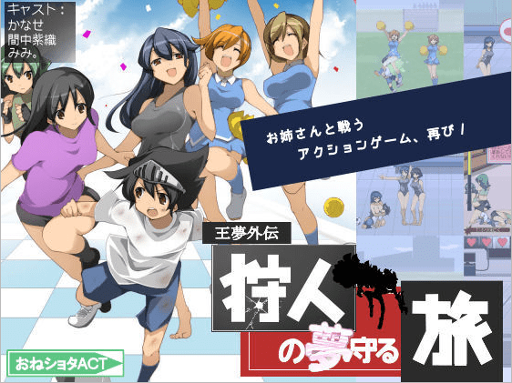
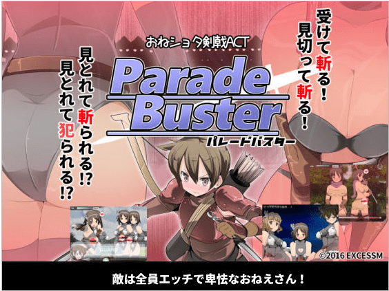

# （GTS擦边） 关于パレードバスター

作者：dajiangjiang

TID：22462

<title>1</title> <link href="../Styles/Style.css" type="text/css" rel="stylesheet">

# 1

*本帖最後由 dajiangjiang 於 2017-1-19 15:56 編輯*

大家还记得 **[狩人の夢守る旅](http://www.dlsite.com/maniax/work/=/product_id/RJ117304.html)** 这款游戏吗？没错就是少林足球（拖走）偶然得到消息这系列又出新作啦，虽然很可能全程无gts但是真鸡儿好玩啊，游戏风格、操作与前作不同，前作相对依赖键盘而本作用鼠标就可以操作啦，附上贴吧找的下载链接，不保证是最新的版本但转区后玩是没有问题的。magnet:?xt=urn:btih:BB51DBF3C6A09C034150A76CF2203510E3B56347
大概贴一下游戏说明：esc可以打开菜单使用道具/更换武器
左键攻击，鼠标往下拉/按空格键是防御，小姐姐身边红条读完后会攻击，记得防御，如果小姐姐身边有个红心那就是她要发动H技能了，你成功攻击小姐姐后右下角有倒计时，在倒计时内无法对你进行H攻击（绅士怎么会舍得放弃被H呢？）  剩下的留给大家自己来探索，当然有能力的可以买正版支持一下价不算太贵，1620日元，100人民币左右[http://www.dlsite.com/maniax/work/=/product_id/RJ176518.html](http://www.dlsite.com/maniax/work/=/product_id/RJ176518.html)小伙伴们我们下次再见 这个游戏竟然是有gts相关内容的，感谢10楼dalao提供情报 

<title>2</title> <link href="../Styles/Style.css" type="text/css" rel="stylesheet">

# 2

 <ignore_js_op>[3.png](forum.php?mod=attachment&aid=NjY0NjJ8Mjg2ZWI2MjR8MTY3NDA2ODg3OHwxODIzMHwyMjQ2Mg%3D%3D&nothumb=yes) *(342.24 KB, 下載次數: 1)*

[下載附件](forum.php?mod=attachment&aid=NjY0NjJ8Mjg2ZWI2MjR8MTY3NDA2ODg3OHwxODIzMHwyMjQ2Mg%3D%3D&nothumb=yes)

2017-1-18 11:49 上傳  

</ignore_js_op> <ignore_js_op>[2.png](forum.php?mod=attachment&aid=NjY0NjN8MjhkNDVhYjR8MTY3NDA2ODg3OHwxODIzMHwyMjQ2Mg%3D%3D&nothumb=yes) *(370.84 KB, 下載次數: 1)*

[下載附件](forum.php?mod=attachment&aid=NjY0NjN8MjhkNDVhYjR8MTY3NDA2ODg3OHwxODIzMHwyMjQ2Mg%3D%3D&nothumb=yes)

2017-1-18 12:00 上傳  

</ignore_js_op> <title>3</title> <link href="../Styles/Style.css" type="text/css" rel="stylesheet">

# 3

自从我玩了这款游戏，麦克雷甩枪稳得一匹，已经准备冲击国服第一了 <title>4</title> <link href="../Styles/Style.css" type="text/css" rel="stylesheet">

# 4

新作是2月份 这个是上年的 <title>5</title> <link href="../Styles/Style.css" type="text/css" rel="stylesheet">

# 5

> [白夜的魔王 發表於 2017-1-18 13:14](https://giantessnight.cf/gnforum2012/forum.php?mod=redirect&goto=findpost&pid=320632&ptid=22462)
> 新作是2月份 这个是上年的

原来如此...似乎是我火星了，今天看到这款游戏
<title>6</title> <link href="../Styles/Style.css" type="text/css" rel="stylesheet">

# 6

话说作者的站点不更新我还以为出啥意外了……
不说了梦想系列的更新是全太监了……之前那俩rpg游戏版不知道啥感觉 <title>7</title> <link href="../Styles/Style.css" type="text/css" rel="stylesheet">

# 7

万一玩了以后麦克雷上不了分咋办。。。撸多了的情况下 <title>8</title> <link href="../Styles/Style.css" type="text/css" rel="stylesheet">

# 8

> [suannaimm 發表於 2017-1-18 22:00](https://giantessnight.cf/gnforum2012/forum.php?mod=redirect&goto=findpost&pid=320674&ptid=22462)
> 万一玩了以后麦克雷上不了分咋办。。。撸多了的情况下

上不了分就去打作者
<title>9</title> <link href="../Styles/Style.css" type="text/css" rel="stylesheet">

# 9

> [紫色欧石楠 發表於 2017-1-18 13:56](https://giantessnight.cf/gnforum2012/forum.php?mod=redirect&goto=findpost&pid=320640&ptid=22462)
> 话说作者的站点不更新我还以为出啥意外了……
> 不说了梦想系列的更新是全太监了……之前那俩rpg游戏 ...

太监的原因估计就是生意不太好吧，但讲真都挺受用的，至少我超喜欢
<title>10</title> <link href="../Styles/Style.css" type="text/css" rel="stylesheet">

# 10

> [dajiangjiang 發表於 2017-1-18 23:04](https://giantessnight.cf/gnforum2012/forum.php?mod=redirect&goto=findpost&pid=320684&ptid=22462)
> 太监的原因估计就是生意不太好吧，但讲真都挺受用的，至少我超喜欢
> ...

原作者曾经表示要把正传里的角色尽量都搬过来……不过考虑到新cg系统……成倍的新图……结果在出了俩新角色和搬了一个ol进来之后就没了……（不过也挺好啦），虽然感觉上没啥人气，不过在动作类小黄油里绝对是颗新星了（还是准备去买之前的两部rpg……结果因为汇率问题……刚好少了那么几毛钱……尴尬）
<title>11</title> <link href="../Styles/Style.css" type="text/css" rel="stylesheet">

# 11

*本帖最後由 紫色欧石楠 於 2017-1-19 20:12 編輯*

对了lz可以改标题了……这游戏里还真有gts！虽然互动不是那么明显啦……在最后的地图里在情报收集里和好奇心旺盛的船客对话就可以解锁一个新地图 魔棲岛  敌人强度很高就是了，我先打一会。
大概就是最后有一个12层挑战塔，根据图鉴看（正常打完游戏流程还有大概十个角色不能解锁，支线任务里的梦境篇有兔女郎，ol,和游泳部成员。并且可以获得王样梦想中的水枪和足球……魔之岛里有雪女，巨人，米诺陶和大史莱姆，最终隐藏关翼之塔有魅魔，以及（推测是）魅魔女王）Ps： 就算之前的角色没解锁去翼之塔打怪可以遇到……但是翼之塔难度巨高……怪的数量也很多……好不容易打到第一层最后阶段好几次被双子翼魔一巴掌拍死然后按在地上ooxx……不过每次被搞倒之后需要重新开游戏并且看解说的内容有点烦……破拆了下游戏的文件里确定最后角色是魅魔女王了……

回忆事件里正常打完有两个事件是锁定的，一个是需要去支线任务里：每个地图都有的 最下面的所谓（卖身任务）建议尽早做完……因为会直接把等级清零……还有一个就是打完剧情流程，在最后的城里情报调查里和公主谈话，解锁事件……嘛，就是和公主姐姐鸳鸯浴和xxoo啦
<title>12</title> <link href="../Styles/Style.css" type="text/css" rel="stylesheet">

# 12

> [紫色欧石楠 發表於 2017-1-19 14:15](https://giantessnight.cf/gnforum2012/forum.php?mod=redirect&goto=findpost&pid=320728&ptid=22462)
> 对了lz可以改标题了……这游戏里还真有gts！虽然互动不是那么明显啦……在最后的地图里在情报收集里和好奇 ...

我的天？我这就去玩一下， 感谢情报
<title>13</title> <link href="../Styles/Style.css" type="text/css" rel="stylesheet">

# 13

我也好想玩，有没有大佬发个链接什么的~ <title>14</title> <link href="../Styles/Style.css" type="text/css" rel="stylesheet">

# 14

> [15000402503 發表於 2017-1-19 19:56](https://giantessnight.cf/gnforum2012/forum.php?mod=redirect&goto=findpost&pid=320765&ptid=22462)
> 我也好想玩，有没有大佬发个链接什么的~

我一楼不是放了磁力链接么？你复制下来在迅雷之类下载工具里就能下载了，不会的话百度一下就会了
<title>15</title> <link href="../Styles/Style.css" type="text/css" rel="stylesheet">

# 15

[https://sstmlt.moe/thread-170193-1-1.html](https://sstmlt.moe/thread-170193-1-1.html)
完美存档 <title>16</title> <link href="../Styles/Style.css" type="text/css" rel="stylesheet">

# 16

 <ignore_js_op>

[PBsave.rar](forum.php?mod=attachment&aid=NjY0OTV8NTQ3ZWMwMDB8MTY3NDA2ODg4NHwxODIzMHwyMjQ2Mg%3D%3D)

2017-1-20 00:22 上傳

點擊文件名下載附件

1.35 MB, 下載次數: 16</ignore_js_op> <title>17</title> <link href="../Styles/Style.css" type="text/css" rel="stylesheet">

# 17

> [泡面 發表於 2017-1-20 00:22](https://giantessnight.cf/gnforum2012/forum.php?mod=redirect&goto=findpost&pid=320805&ptid=22462)
> https://sstmlt.moe/thread-170193-1-1.html
> 完美存档

该来的还是来了，膜拜触手
<title>18</title> <link href="../Styles/Style.css" type="text/css" rel="stylesheet">

# 18

表示全是乱码。用的是WIN10的系统不能像以前一样用app了，很难受。 <title>19</title> <link href="../Styles/Style.css" type="text/css" rel="stylesheet">

# 19

*本帖最後由 紫色欧石楠 於 2017-1-21 00:22 編輯*

目前最新的版本是1.40…加了几个新角色和剧情的感觉…新作我还没翻墙去看……另外二月份作者的作品在dmm上大概要50%off（怎么一股某胖的感觉）………可以趁机把之前两个rpg买了看看
<title>20</title> <link href="../Styles/Style.css" type="text/css" rel="stylesheet">

# 20

> [429888482 發表於 2017-1-21 00:07](https://giantessnight.cf/gnforum2012/forum.php?mod=redirect&goto=findpost&pid=320909&ptid=22462)
> 表示全是乱码。用的是WIN10的系统不能像以前一样用app了，很难受。

用locale emulator 试试，我也是win10，用着没问题
<title>21</title> <link href="../Styles/Style.css" type="text/css" rel="stylesheet">

# 21

看起来不错的样子，可以试一试（故作淡定）