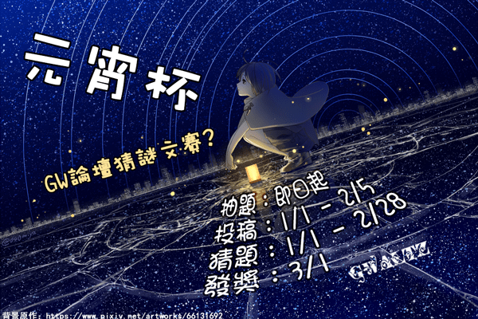

# 【GW論壇】2023元宵杯猜謎文賽活動宣傳

作者：phone2345

TID：34621

<title>1</title> <link href="../Styles/Style.css" type="text/css" rel="stylesheet">

# 1

*本帖最後由 phone2345 於 2022-12-28 00:12 編輯*

**《2023元宵杯猜題文賽》**

 **腳落三窗碎，能開二丈坑。**
**過江千尺浪，入城萬家逃。**

**——改編自李峤《風》**

上面的詩謎，你猜到答案了嗎？
 一年一度的元宵節即將到來，GW論壇也將舉辦寫文比賽，但與上屆不同的是難度會大大的提升。如同「一簽定音」的抽題，本次文賽準備了50個題目讓寫手們抽，每人將隨機獲得5個指定題目，分別為故事背景，人物設定，突發事件，關鍵要素與異常狀態，每一類10抽1。讀者則要透過閱讀文章，猜出寫手抽到了什麽題目。活動將從1/1持續到2月底，希望大家可以在過年期間體驗與巨娘們猜謎的樂趣。

　　非常感謝GN站長Dante提供宣傳活動的空間，雖然因為活動內容過於複雜又須要改寫網頁程式碼，導致本活動只能在GW論壇舉辦，幸好文章區版主KEY跳出來救場了，GN論壇將會舉辦【朝陽杯】文章大賽，同時參與GW論壇2023元宵杯活動的帖子也獲准一稿雙投參加【朝陽杯】，希望大家可以多多支持一下。

【朝陽杯】文章大賽詳見：[https://giantessnight.com/gnforum2012/forum.php?mod=viewthread&tid=34631](https://giantessnight.com/gnforum2012/forum.php?mod=viewthread&tid=34631)

**活動網址**

[https://giantesswaltz.org/forum.php?mod=forumdisplay&fid=154](https://giantesswaltz.org/forum.php?mod=forumdisplay&fid=154)

**活動時間**

**抽題期：**活動公告後至2023/1/31

**投稿期：**2023/1/1至2/5 (元宵節截止)

**猜題期：**2023/1/1至2/28(投稿公開後即可猜題)

**發獎日：**3/1後，預計1周統計結果

**活動方式**

**抽題：**
作者在指定抽題板塊發文抽題，系統派發5個題目(每個分類一題)，可自行選擇是否要根據抽到的題開始寫，或刪除主題再抽一次。當確定答題並完成一部分文章內容後，可申請搬運主題至活動投稿板塊，並隱藏抽題結果，顯示答題問卷。未抽中的題目內容也可以寫，但請以抽中的題目為主。

抽題投稿區鏈接： [https://giantesswaltz.org/forum.php?mod=forumdisplay&fid=155](https://giantesswaltz.org/forum.php?mod=forumdisplay&fid=155)

投稿參與本活動的作品，也能參加**GN論壇【朝陽杯】**文章大賽，詳見：
GW: [forum.php?mod=viewthread&tid=12939](https://giantessnight.cf/gnforum2012/forum.php?mod=viewthread&tid=12939)
GN: [https://giantessnight.com/gnforum2012/forum.php?mod=viewthread&tid=34631](https://giantessnight.com/gnforum2012/forum.php?mod=viewthread&tid=34631)

**猜題：**
活動板塊中，每一篇投稿首樓會出現答題問卷，讀者可在閱讀文章後，選出自己認為作者抽到哪些題，並提交自己的匿名評論。猜題可複選，最多選5，獎勵將隨著選取的選項數量而降低。可以重複做答，將以最後提交的答案為最終結果。

**活動獎勵**

本次活動難度較高，娛樂性也偏多，因此不設置排名獎勵，只要達到一定的條件就能獲得相應的獎勵。因此別太在意自己的文筆，抽到有趣的題目就來投稿吧！

**【寫手答題獎勵】**
根據自己獲得5個題目的猜中率，只要有3題超過50%即可獲得元宵杯活動勳章及論壇積分獎勵(30貢獻 / 30遊戲幣)

猜中率 = 猜中人數 / 此文章參與猜題人數
(不論多選幾個選項，有一個中就算猜中)

**【讀者猜題獎勵】**
每猜中一題，都可獲得固定積分獎勵(1貢獻 /1遊戲幣)，猜中正確率總和排名前30高的讀者可獲得活動勳章

猜中正確率 = 是否猜中(0或1) / 多選選取的答案數量

例：
選3個沒有猜中 = 0 / 3 = 0
選5個猜中 = 1 / 5 = 0.2
選1個猜中 = 1 / 1 = 1

猜中正確率總和 = 所有參與猜題的猜中率加總
(每個投稿猜題最少0最多5)

**注意事項：**
1.可重複抽題，每人抽題與投稿數量不限，但請勿過於頻繁刷題。
2.抽題結果僅樓主與管理員可見，請勿對第三人洩漏題目內容。
3.投稿內容須為未公開原創文章，並符合論壇規章的帖子內容規範，字數須介於5000至30000字之間，以字數檢查中的內容字數為依據。
4.投稿請於抽題的帖子中以回帖形式提交，總字數超過5000字後於抽題表單填妥作品名稱後送出，管理員將協助搬運至活動文章公開板塊，並開放猜題。
5.商業販售的小說動漫番劇二創作品可視為原創投稿，以圈內創作者作品進行二創須先經原作者同意。
6.投稿內容需遵守論壇規章，同時不能有政治敏感、GT、GC、扶他(Futa)、過度獵奇、大量排糞劇情，或其他應屬於極限區(GW:極限領域)的相關內容。
7.此次活動投稿禁用回覆可見功能。
8.若投稿內容不符合規範或管理員認為不適合，管理員有拒絕此投稿參賽的權力。
9.猜題問卷固定位於首樓，共有5題複選題，可多次填答，以最後提交的為主。

  ── 本次活動在GW舉辦，沒有GW帳號只要填GN用戶名就會過審了。

 <title>2</title> <link href="../Styles/Style.css" type="text/css" rel="stylesheet">

# 2

 <ignore_js_op>[2023元宵杯活動廣告GN.png](forum.php?mod=attachment&aid=MTAxMTc1fDQxMDhiYTY1fDE2NzQwNjkyMjN8MTgyMzB8MzQ2MjE%3D&nothumb=yes) *(520.7 KB, 下載次數: 0)*

[下載附件](forum.php?mod=attachment&aid=MTAxMTc1fDQxMDhiYTY1fDE2NzQwNjkyMjN8MTgyMzB8MzQ2MjE%3D&nothumb=yes)

2022-12-27 00:55 上傳  

</ignore_js_op> <title>3</title> <link href="../Styles/Style.css" type="text/css" rel="stylesheet">

# 3

*本帖最後由 phone2345 於 2022-12-26 01:02 編輯*

**《元宵杯文賽全部題目》**

**A.故事背景/世界觀**
(可以多個混合使用，但須以抽到的為主要背景/世界觀)
**1.未來科技：**以高科技，尖端技術為主的世界(包含蒸汽朋克)
**2.魔法世界：**可以使用各種魔法的世界
**3.校園生活：**故事場景在學校中，有學生與老師
**4.亂世戰爭：**經曆長時間戰爭的世界
**5.宇宙星際：**以外太空為背景在星際中發展的世界
**6.幻想異界：**像遊戲般有著勇者與怪物的異世界
**7.古代舊世：**有著古代建築宮殿或是老舊工業技術的世界
**8.天然原始：**低開發的原始自然環境，森林或海洋等地
**9.極端環境：**會持續不斷造成傷害的環境，例如大氣有毒或長年暴風雪
**0.虛無世界：**世界觀不限，但從頭到尾都只是某個人的幻想或夢境

上述1至10隨機抽一個

**B.角色特性或身份**
(至少須有一個主角或配角含有此屬性)
**1.君王或領導者：**可以是一國之君、企業總裁或組織老大之類的身份
**2.宗教信仰狂熱：**對某種宗教或信仰異常狂熱，中二病之類的也算
**3.某個專業大師：**某領域的頂尖人才，例如廚神，神匠，世界紀錄保持者
**4.教職或指導者：**具備教師身分或有收徒弟的師傅
**5.四處旅行的人，**可能是旅行者、航海家或遊牧民族之類居無定所的人
**6.運氣異常極端：**平常非常好運但壞運來時極慘，或平時運氣差卻大難不死的人
**7.罕見超能力者：**具有某種與周圍其他人相比非常特殊的超能力
**8.受到限制的人：**被某種約束力量或契約控制，使某些能力無法自由使用的人
**9.間諜或背叛者：**表面上是同夥卻暗地裏出賣別人的家夥或間諜類特務人員
**0.沒有實體的人：**可能是某個能附身的靈魂或網路中的人造智能程序

上述1至10隨機抽一個

**C.特殊事件**
(包含在主要人物故事中且重要性不低)
**1.卷入紛爭：**刻意參與或意外加入均可，對抗雙方需要明確
**2.萬衆矚目：**因為某件事變得出名，如成為救世主或通緝犯
**3.參與慶典：**以任何形式加入慶祝活動，如慶典、廟會或遊行等
**4.參加競賽：**可以是運動會，競技或考試測驗
**5.遭遇劫難：**遇到一場大災難，可能是自然災害或人為事故
**6.秘密任務：**在盡可能不被發現的情況下偷偷摸摸做一件重要的事
**7.因故犧牲：**為了某人或事犧牲了自己的生命
**8.刷新三觀：**經曆一場影響非常大的事件後三觀被改變了
**9.痛失所愛：**失去身邊非常重要的人、權力，或物品，失去方式不限
**0.春夢一場：**從夢中醒過來發現世界變了，改變可以與夢境或睡前對比

上述1至10隨機抽一個

**D.關鍵要素**
(可能是有形的人、生物、物品或無形的權力、信念、記憶，名稱可自訂，不需與題目一致)
**1.賢者石：**某個蘊含或代表巨大的能量、財富或權力的寶物
**2.全能車：**特殊交通工具，外表可以普通但功能須與衆不同
**3.小孩子：**一個孩子，或某個物種的幼體，性別不拘
**4.複制人：**一個外貌完全相同的分身或複制人
**5.智慧體：**一個帶有自我意識的物品，例如會說話的魔劍
**6.除錯棒：**可以改變物理量的道具，例如改變速度、時間、尺寸等物理量
**7.傳送陣：**可以強制移動或轉移目標對象的道具，例如瞬間移動或靈魂互換
**8.讀心術：**只要使用就能夠讀取對方想法的道具或能力
**9.刪除鍵：**只要使用就能讓目標對象消失的道具，包含無形物，如信任感
**0.沒有人：**在故事中從頭到尾根本不存曾在或無人見過，純靠吹出來的人或物

上述1至10隨機抽一個

**E.異常狀態**
(必須發生在主要人物身上，持續一段不算短的時間)
**1.沈迷：**對某種事物有著強烈的興趣，戀愛也屬于此類
**2.自負：**對某種事物展現出誇張的自信心，超越一般人能理解的程度
**3.恐懼：**對某種不影響一般人的事物感到害怕或逃避，但怕痛怕死這類不算
**4.無敵：**暫時性的具備某種強大力量，包含增強防禦，例如超人變身時
**5.脆弱：**暫時性的很容易受傷，不論是身體或內心均可
**6.封印：**某種能力突然無法使用，可能是身體移動，思考或特殊能力
**7.受控：**身體被外在力量操控，不受自我意識控制，或心理被魅惑而暫時失常
**8.時停：**周圍人事物的時間變得靜止不動，但自己完全不受影響或能限度的活動
**9.變形：**暫時性的完全改變外貌、種族、性別，不可只變一半
**0.虛無：**暫時從他人眼中消失、身體變得透明，可穿越物體或被他人無視的狀態

上述1至10隨機抽一個

**抽題方法：於抽題版發新帖可獲得題目**
可自行選擇是否要根據抽到的題開始寫，或刪除主題再抽一次。

點此鏈接快速發新帖抽題(須要有GW論壇帳號)：
[https://giantesswaltz.org/forum.php?mod=post&action=newthread&fid=155](https://giantesswaltz.org/forum.php?mod=post&action=newthread&fid=155)
<title>4</title> <link href="../Styles/Style.css" type="text/css" rel="stylesheet">

# 4

好诶！又是新的文章活动呢！

每次都会出现好多好看的文章！

我在考虑这次我要不要试试看参加……主要是实在是感觉自己写不出来。

最短多少字来着……？五千字……

五千字的话，我有可能写的出来。

试试看吧。 <title>5</title> <link href="../Styles/Style.css" type="text/css" rel="stylesheet">

# 5

啊，竟然是GW限定活动。

印象中以前每次都是两个站一起搞的……嘛，不管了，反正我基本上重要的帖子都同时发在两边。

然后，如果要发在GN，就是在活动进行到，在GW文章公开以后就可以发到GN上了吧？

我的题目抽完了，姑且ABCD部分还算有灵感，不过E部分有点卡壳……

微妙的有点抽象，想不太好要怎么写。

不管了，开工吧。