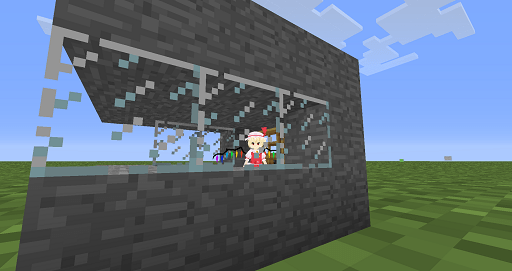

# 【MC擦边球】MC的女巨人整合包联机测试

作者：archer

TID：19725

<title>1</title> <link href="../Styles/Style.css" type="text/css" rel="stylesheet">

# 1

*本帖最後由 塔防精兵 於 2015-8-28 15:58 編輯*

本人我的世界整合渣渣，整合了格列佛MOD和小方块MOD，想试试联机的效果，求加QQ测试（私信）效果如下

正常大小

对比8倍大小

可以把生物或玩家拿起来

扔出去！

还可以把自己变小

住在自己建的小房子里

求测试！！！
<title>2</title> <link href="../Styles/Style.css" type="text/css" rel="stylesheet">

# 2

有截图吗，MC的方块子实在是。。。想看看效果先233 <title>3</title> <link href="../Styles/Style.css" type="text/css" rel="stylesheet">

# 3

你还需要自定义Steve (´･ω･`) <title>4</title> <link href="../Styles/Style.css" type="text/css" rel="stylesheet">

# 4

我记得有个可以把MMD模型放进去的MOD呀～ 虽然我之前试了一下有点卡，而且东方系的角色很多的样子 <title>5</title> <link href="../Styles/Style.css" type="text/css" rel="stylesheet">

# 5

联机的时候能互相看见对方的模型吗 <title>6</title> <link href="../Styles/Style.css" type="text/css" rel="stylesheet">

# 6

> [RMB战士 發表於 2015-8-28 11:05](https://giantessnight.cf/gnforum2012/forum.php?mod=redirect&goto=findpost&pid=267071&ptid=19725)
> 联机的时候能互相看见对方的模型吗

应该可以吧，已经做出来了，下面放截图
[@月食](https://giantessnight.cf/gnforum2012/home.php?mod=space&uid=737) [@Growtopia](https://giantessnight.cf/gnforum2012/home.php?mod=space&uid=13748) [@archer](https://giantessnight.cf/gnforum2012/home.php?mod=space&uid=528)

整合了格列佛，自定义史蒂夫（就是MMD模型放进去），小地图，TMI
如果需要继续添加
<title>7</title> <link href="../Styles/Style.css" type="text/css" rel="stylesheet">

# 7

放一下下载地址，这个是纯MC小白根本不知道MC这个东西的人都可以用的整合包，包含了2个BAT文件，具体的我会发到电玩区，相当于一个快照吧

效果如下
<ignore_js_op>

**2015-08-28_14.34.47.png** *(96.69 KB, 下載次數: 0)*

[下載附件](forum.php?mod=attachment&aid=NTQwMjh8NGUxODMyN2R8MTY3NDA2ODE5MXwxODIzMHwxOTcyNQ%3D%3D&nothumb=yes)

2015-8-28 14:32 上傳

正常大小

<ignore_js_op>

**2015-08-28_14.35.49.png** *(247.16 KB, 下載次數: 0)*

[下載附件](forum.php?mod=attachment&aid=NTQwMjl8OGQ5YWNjNjB8MTY3NDA2ODE5MXwxODIzMHwxOTcyNQ%3D%3D&nothumb=yes)

2015-8-28 14:32 上傳

对比8倍大小
<ignore_js_op>

**2015-08-28_14.36.19.png** *(196.32 KB, 下載次數: 0)*

[下載附件](forum.php?mod=attachment&aid=NTQwMzB8YTEzNjJhMWJ8MTY3NDA2ODE5MXwxODIzMHwxOTcyNQ%3D%3D&nothumb=yes)

2015-8-28 14:32 上傳

可以把生物或玩家拿起来
<ignore_js_op>

**2015-08-28_14.36.37.png** *(232.09 KB, 下載次數: 0)*

[下載附件](forum.php?mod=attachment&aid=NTQwMzF8NjQxYTMzMTR8MTY3NDA2ODE5MXwxODIzMHwxOTcyNQ%3D%3D&nothumb=yes)

2015-8-28 14:32 上傳

扔出去！
<ignore_js_op>

**2015-08-28_14.36.43.png** *(199.57 KB, 下載次數: 0)*

[下載附件](forum.php?mod=attachment&aid=NTQwMzJ8ZTg4ZTA4OGJ8MTY3NDA2ODE5MXwxODIzMHwxOTcyNQ%3D%3D&nothumb=yes)

2015-8-28 14:32 上傳

还可以把自己变小
<ignore_js_op>

**2015-08-28_14.48.32.png** *(96.6 KB, 下載次數: 0)*

[下載附件](forum.php?mod=attachment&aid=NTQwMzN8MWQ5MjFmYTR8MTY3NDA2ODE5MXwxODIzMHwxOTcyNQ%3D%3D&nothumb=yes)

2015-8-28 14:41 上傳

住在自己建的小房子里
<ignore_js_op>

**2015-08-28_14.50.18.png** *(114.12 KB, 下載次數: 0)*

[下載附件](forum.php?mod=attachment&aid=NTQwMzR8MmYzYWQ4NDR8MTY3NDA2ODE5MXwxODIzMHwxOTcyNQ%3D%3D&nothumb=yes)

2015-8-28 14:41 上傳

求大家和我测试一下！！！
<title>8</title> <link href="../Styles/Style.css" type="text/css" rel="stylesheet">

# 8

下载地址：[http://yunpan.cn/cmjNFetXktbRk](http://yunpan.cn/cmjNFetXktbRk)  访问密码 1394 <title>9</title> <link href="../Styles/Style.css" type="text/css" rel="stylesheet">

# 9

应该在国庆节可以发布正式Version2.0版 <title>10</title> <link href="../Styles/Style.css" type="text/css" rel="stylesheet">

# 10

记得gts吧有人用这个mod说是自己做的,还收费啦赞助
然后被原作者Gank了
希望楼主不要玩火,这个mod我也是玩过的,1.2beta还暂时不支持服务器联机.
<title>11</title> <link href="../Styles/Style.css" type="text/css" rel="stylesheet">

# 11

> [ZERO001 發表於 2015-8-28 14:49](https://giantessnight.cf/gnforum2012/forum.php?mod=redirect&goto=findpost&pid=267087&ptid=19725)
> 记得gts吧有人用这个mod说是自己做的,还收费啦赞助
> 然后被原作者Gank了
> 希望楼主不要玩火,这个mod我也是玩 ...

然而我并没有说这是我做的，也并没有收费，只是测试，这是整合包
<title>12</title> <link href="../Styles/Style.css" type="text/css" rel="stylesheet">

# 12

> [RMB战士 發表於 2015-8-28 11:05](https://giantessnight.cf/gnforum2012/forum.php?mod=redirect&goto=findpost&pid=267071&ptid=19725)
> 联机的时候能互相看见对方的模型吗

不能啊，怎么办呢，只能等这个自定义史蒂夫作者更新再说了。反正是测试对吧？
<title>13</title> <link href="../Styles/Style.css" type="text/css" rel="stylesheet">

# 13

> [塔防精兵 發表於 2015-8-28 15:37](https://giantessnight.cf/gnforum2012/forum.php?mod=redirect&goto=findpost&pid=267095&ptid=19725)
> 不能啊，怎么办呢，只能等这个自定义史蒂夫作者更新再说了。反正是测试对吧？
> ...

那倒是，看楼主这情况是已经联机成功但是并不理想，可否看看截图 大家一起找问题。
<title>14</title> <link href="../Styles/Style.css" type="text/css" rel="stylesheet">

# 14

 哦哦 有MMD模型可以放进去吗～～  好棒  那么要怎样放入啊～ 大小是怎样修改呢 <title>15</title> <link href="../Styles/Style.css" type="text/css" rel="stylesheet">

# 15

could not create the java vitual machine
a fatal exception has occurred.Progam will exit.
进不去呀～～  报错怎么破 <title>16</title> <link href="../Styles/Style.css" type="text/css" rel="stylesheet">

# 16

> [RMB战士 發表於 2015-8-28 22:37](https://giantessnight.cf/gnforum2012/forum.php?mod=redirect&goto=findpost&pid=267134&ptid=19725)
> 那倒是，看楼主这情况是已经联机成功但是并不理想，可否看看截图 大家一起找问题。
> ...

还没联机呢，找人测试啊
<title>17</title> <link href="../Styles/Style.css" type="text/css" rel="stylesheet">

# 17

> [archer 發表於 2015-8-29 12:20](https://giantessnight.cf/gnforum2012/forum.php?mod=redirect&goto=findpost&pid=267178&ptid=19725)
> could not create the java vitual machine
> a fatal exception has occurred.Progam will exit.
> 进不去呀～ ...

你还没设置最大内存吧，进群里教你。
<title>18</title> <link href="../Styles/Style.css" type="text/css" rel="stylesheet">

# 18

> [archer 發表於 2015-8-29 11:38](https://giantessnight.cf/gnforum2012/forum.php?mod=redirect&goto=findpost&pid=267175&ptid=19725)
> 哦哦 有MMD模型可以放进去吗～～  好棒  那么要怎样放入啊～ 大小是怎样修改呢 ...

我写了一个BAT小程序，有自动放入的功能，但是不完善因为我也不太熟悉，继续改吧。。
<title>19</title> <link href="../Styles/Style.css" type="text/css" rel="stylesheet">

# 19

> [archer 發表於 2015-8-29 11:38](https://giantessnight.cf/gnforum2012/forum.php?mod=redirect&goto=findpost&pid=267175&ptid=19725)
> 哦哦 有MMD模型可以放进去吗～～  好棒  那么要怎样放入啊～ 大小是怎样修改呢 ...

自定义史蒂夫有点不支持格列佛，当我喝下变大药水是模型并不会变大，要自行设置才可以，这是个大问题。
<title>20</title> <link href="../Styles/Style.css" type="text/css" rel="stylesheet">

# 20

第一次测试成功，但是自定义史蒂夫无法使用，在下一次完善 <title>21</title> <link href="../Styles/Style.css" type="text/css" rel="stylesheet">

# 21

所谓的放大缩小效果其实只是在提示视角啦～～   似乎按K键在模型选择里面可以直接选择自己的大小啊～～  
感觉挺好玩的

<title>22</title> <link href="../Styles/Style.css" type="text/css" rel="stylesheet">

# 22

 <ignore_js_op>[QQ图片20150829170007.jpg](forum.php?mod=attachment&aid=NTQxMjF8MTgzOWRmMWN8MTY3NDA2ODIwMnwxODIzMHwxOTcyNQ%3D%3D&nothumb=yes) *(98.58 KB, 下載次數: 0)*

[下載附件](forum.php?mod=attachment&aid=NTQxMjF8MTgzOWRmMWN8MTY3NDA2ODIwMnwxODIzMHwxOTcyNQ%3D%3D&nothumb=yes)

2015-8-29 17:06 上傳  

</ignore_js_op> <ignore_js_op>[QQ图片20150829165738.png](forum.php?mod=attachment&aid=NTQxMjJ8NWVkOGFkNjJ8MTY3NDA2ODIwMnwxODIzMHwxOTcyNQ%3D%3D&nothumb=yes) *(1.93 MB, 下載次數: 0)*

[下載附件](forum.php?mod=attachment&aid=NTQxMjJ8NWVkOGFkNjJ8MTY3NDA2ODIwMnwxODIzMHwxOTcyNQ%3D%3D&nothumb=yes)

2015-8-29 17:07 上傳  

</ignore_js_op> <title>23</title> <link href="../Styles/Style.css" type="text/css" rel="stylesheet">

# 23

> archer 發表於 2015-8-29 17:08
> 所谓的放大缩小效果其实只是在提示视角啦～～   似乎按K键在模型选择里面可以直接选择自己的大小啊～～  
> ...

谁说，你只有放大了才能把东西拿起来，当然啦，有可能你不知道怎么玩，在国庆节我会出的。自定义史蒂夫是要报废的节奏吧 <title>24</title> <link href="../Styles/Style.css" type="text/css" rel="stylesheet">

# 24

> [塔防精兵 發表於 2015-8-30 08:51](https://giantessnight.cf/gnforum2012/forum.php?mod=redirect&goto=findpost&pid=267256&ptid=19725)
> 谁说，你只有放大了才能把东西拿起来，当然啦，有可能你不知道怎么玩，在国庆节我会出的。自定义史蒂夫是 ...

 我在家自己和自己联机了一下。。结果发现别人屏幕看到的还是史蒂夫。。。真蛋疼

<title>25</title> <link href="../Styles/Style.css" type="text/css" rel="stylesheet">

# 25

> archer 發表於 2015-8-30 10:04
> 我在家自己和自己联机了一下。。结果发现别人屏幕看到的还是史蒂夫。。。真蛋疼
> 
> ...

我不懂JAVA更不懂MMD所以等作者更新吧 <title>26</title> <link href="../Styles/Style.css" type="text/css" rel="stylesheet">

# 26

> [塔防精兵 發表於 2015-8-30 12:50](https://giantessnight.cf/gnforum2012/forum.php?mod=redirect&goto=findpost&pid=267276&ptid=19725)
> 我不懂JAVA更不懂MMD所以等作者更新吧

看贴吧说是可以互相看到的。。似乎得有个服务器？
<title>27</title> <link href="../Styles/Style.css" type="text/css" rel="stylesheet">

# 27

> 塔防精兵 發表於 2015-8-30 12:50
> 我不懂JAVA更不懂MMD所以等作者更新吧

感觉原作者要弃坑的样子。。。装个女仆MOD和NPC算了 <title>28</title> <link href="../Styles/Style.css" type="text/css" rel="stylesheet">

# 28

> [archer 發表於 2015-8-30 12:53](https://giantessnight.cf/gnforum2012/forum.php?mod=redirect&goto=findpost&pid=267277&ptid=19725)
> 看贴吧说是可以互相看到的。。似乎得有个服务器？

服务器是可以用家用电脑搭建的，但是用来搭建服务器的电脑没有，或者说没人愿意电脑一天到晚开着，但是技术上是可行的
<title>29</title> <link href="../Styles/Style.css" type="text/css" rel="stylesheet">

# 29

> [塔防精兵 發表於 2015-8-30 15:40](https://giantessnight.cf/gnforum2012/forum.php?mod=redirect&goto=findpost&pid=267285&ptid=19725)
> 服务器是可以用家用电脑搭建的，但是用来搭建服务器的电脑没有，或者说没人愿意电脑一天到晚开着，但是技 ...

我下了个服务器BAT的文件。。。但是不会用。。。
我发现局域网联机其实很自己开两个就可以了。。。问题就在于R放大最多只有8倍。。这样就算用改大模型也看不到。。只能看到脚。。因为视角上不去。。。</ignore_js_op></ignore_js_op></ignore_js_op></ignore_js_op></ignore_js_op></ignore_js_op></ignore_js_op>