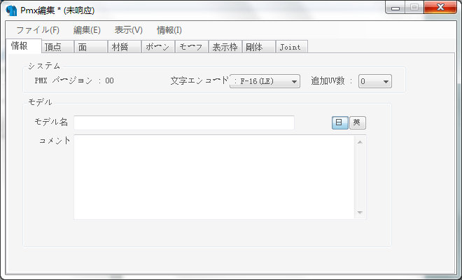
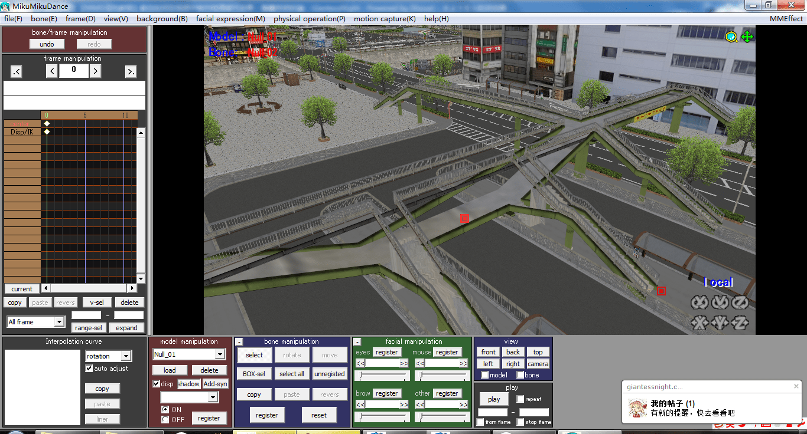

# 【MMD深坑教程】教你如何在视频中制作物理破坏效果

作者：langborghini

TID：16909

<title>1</title> <link href="../Styles/Style.css" type="text/css" rel="stylesheet">

# 1

有生之年系列了……如果不顺利的话……下一次发帖就是七月份了……丢个回帖奖励。。。希望我可以看到最多的一次回复……所以还不如丢点东西出来造福社会 嘛 授人以鱼不如授人以渔
第一步当然还是先丢预览图咯
嘛 因为时间关系 就只找了个简单的模型来搞了 不过以此类推 可以在建筑上进行修改 从而制造物理破坏效果
因为我还是没有掌握图片上传顺序的问题 就原谅我一楼一图了 毕竟这个是深坑向教程……
<title>2</title> <link href="../Styles/Style.css" type="text/css" rel="stylesheet">

# 2

 <ignore_js_op>[教你怎么制作物理破坏.jpg](forum.php?mod=attachment&aid=NDMwNzV8YWQzZGM1Y2R8MTY3NDA2OTY0NXwxODIzMHwxNjkwOQ%3D%3D&nothumb=yes) *(121.96 KB, 下載次數: 9)*

[下載附件](forum.php?mod=attachment&aid=NDMwNzV8YWQzZGM1Y2R8MTY3NDA2OTY0NXwxODIzMHwxNjkwOQ%3D%3D&nothumb=yes)

2014-5-22 13:13 上傳  

</ignore_js_op> <title>3</title> <link href="../Styles/Style.css" type="text/css" rel="stylesheet">

# 3

首先是准备工具 这玩意不得不使用PE了 这玩意随便百度就找得到的 就不用我多说了当然 如果你要对建筑物进行破坏操作的话 还需要一台强劲的电脑 不然刷权重的时候 还是多多少少有点卡的
其实破坏原理很简单 就是追加一个骨骼 然后配合动作 移动骨骼 从而制造破坏效果- -不过目前来看 我也只能教你们扭曲性的破坏了 追加顶点太高深了 我PE学术不精……只能这样了……
<title>4</title> <link href="../Styles/Style.css" type="text/css" rel="stylesheet">

# 4

 <ignore_js_op>[QQ截图20140522132156.jpg](forum.php?mod=attachment&aid=NDMwNzZ8NjlkMTkyOTV8MTY3NDA2OTY0NXwxODIzMHwxNjkwOQ%3D%3D&nothumb=yes) *(31.33 KB, 下載次數: 1)*

[下載附件](forum.php?mod=attachment&aid=NDMwNzZ8NjlkMTkyOTV8MTY3NDA2OTY0NXwxODIzMHwxNjkwOQ%3D%3D&nothumb=yes)

2014-5-22 13:22 上傳  

</ignore_js_op> <title>5</title> <link href="../Styles/Style.css" type="text/css" rel="stylesheet">

# 5

这次我就演示一下桥梁坍塌的制作方法吧……
I fell good 咋是有库存的人……
先用追加的方式 打开这个月台小站的文件……
[然后就会出现调节大小倍数 场景地图非常大 那么我们就该小一些 如果是小屋什么的 刷权重顶点太密集 就调大一些]
附言：其实你们平时如果用PE来放大人物模型的话 最好就用追加调整倍数然后保存的方法来调整模型大小 这样调整 骨骼的位置还是在那些地方 刚体 J点也是会保留在原来的位置 就不会错位 重新更改了 J点和刚体出错的话 还可能导致 载入模型 MMD崩溃的问题
<title>6</title> <link href="../Styles/Style.css" type="text/css" rel="stylesheet">

# 6

 <ignore_js_op>[QQ截图20140522132604.jpg](forum.php?mod=attachment&aid=NDMwNzh8OGZjYzI4ODR8MTY3NDA2OTY0NXwxODIzMHwxNjkwOQ%3D%3D&nothumb=yes) *(132.59 KB, 下載次數: 0)*

[下載附件](forum.php?mod=attachment&aid=NDMwNzh8OGZjYzI4ODR8MTY3NDA2OTY0NXwxODIzMHwxNjkwOQ%3D%3D&nothumb=yes)

2014-5-22 13:31 上傳  

</ignore_js_op> <ignore_js_op>[QQ截图20140522132643.jpg](forum.php?mod=attachment&aid=NDMwNzd8NzJlZDgxYWZ8MTY3NDA2OTY0NXwxODIzMHwxNjkwOQ%3D%3D&nothumb=yes) *(184.36 KB, 下載次數: 0)*

[下載附件](forum.php?mod=attachment&aid=NDMwNzd8NzJlZDgxYWZ8MTY3NDA2OTY0NXwxODIzMHwxNjkwOQ%3D%3D&nothumb=yes)

2014-5-22 13:31 上傳  

</ignore_js_op> <title>7</title> <link href="../Styles/Style.css" type="text/css" rel="stylesheet">

# 7

如图所示 修改之后 把模型导出 再打开 就变成另外一种东西了……
<title>8</title> <link href="../Styles/Style.css" type="text/css" rel="stylesheet">

# 8

 <ignore_js_op>[QQ截图20140522132703.jpg](forum.php?mod=attachment&aid=NDMwODF8NmI4OThlOWV8MTY3NDA2OTY0NXwxODIzMHwxNjkwOQ%3D%3D&nothumb=yes) *(133.15 KB, 下載次數: 0)*

[下載附件](forum.php?mod=attachment&aid=NDMwODF8NmI4OThlOWV8MTY3NDA2OTY0NXwxODIzMHwxNjkwOQ%3D%3D&nothumb=yes)

2014-5-22 13:36 上傳  

</ignore_js_op> <ignore_js_op>[QQ截图20140522132721.jpg](forum.php?mod=attachment&aid=NDMwODB8MzM2MGNmNWV8MTY3NDA2OTY0NXwxODIzMHwxNjkwOQ%3D%3D&nothumb=yes) *(9.94 KB, 下載次數: 0)*

[下載附件](forum.php?mod=attachment&aid=NDMwODB8MzM2MGNmNWV8MTY3NDA2OTY0NXwxODIzMHwxNjkwOQ%3D%3D&nothumb=yes)

2014-5-22 13:36 上傳  

</ignore_js_op> <ignore_js_op>[QQ截图20140522132810.jpg](forum.php?mod=attachment&aid=NDMwNzl8ZTBmOTAwZTl8MTY3NDA2OTY0NXwxODIzMHwxNjkwOQ%3D%3D&nothumb=yes) *(93.38 KB, 下載次數: 0)*

[下載附件](forum.php?mod=attachment&aid=NDMwNzl8ZTBmOTAwZTl8MTY3NDA2OTY0NXwxODIzMHwxNjkwOQ%3D%3D&nothumb=yes)

2014-5-22 13:36 上傳  

</ignore_js_op> <title>9</title> <link href="../Styles/Style.css" type="text/css" rel="stylesheet">

# 9

载入模型是一项吃内存的活路 尤其是载入场景模型 不过怎么说 只要等一下就可以了
真棒 读取之后我们看到的是灰白的一片
这是因为PE追加模型识别的时候 认为贴图文件位置是你上一次打开模型的文件路径 因为两个模型不在一个文件夹 所以追加会导致没有贴图 我们只要吧这个文件"名前保存"然后再用"打开"的方式读取出来 就可以了……
<title>10</title> <link href="../Styles/Style.css" type="text/css" rel="stylesheet">

# 10

 <ignore_js_op>[QQ截图20140522132837.jpg](forum.php?mod=attachment&aid=NDMwODV8YmMzYmQ5ZDJ8MTY3NDA2OTY0NXwxODIzMHwxNjkwOQ%3D%3D&nothumb=yes) *(269.61 KB, 下載次數: 0)*

[下載附件](forum.php?mod=attachment&aid=NDMwODV8YmMzYmQ5ZDJ8MTY3NDA2OTY0NXwxODIzMHwxNjkwOQ%3D%3D&nothumb=yes)

2014-5-22 13:39 上傳  

</ignore_js_op> <ignore_js_op>[QQ截图20140522132858.jpg](forum.php?mod=attachment&aid=NDMwODR8NmY1ZjBiMjB8MTY3NDA2OTY0NXwxODIzMHwxNjkwOQ%3D%3D&nothumb=yes) *(262.94 KB, 下載次數: 0)*

[下載附件](forum.php?mod=attachment&aid=NDMwODR8NmY1ZjBiMjB8MTY3NDA2OTY0NXwxODIzMHwxNjkwOQ%3D%3D&nothumb=yes)

2014-5-22 13:39 上傳  

</ignore_js_op> <ignore_js_op>[QQ截图20140522132913.jpg](forum.php?mod=attachment&aid=NDMwODN8NGQzMTQ1Mjl8MTY3NDA2OTY0NXwxODIzMHwxNjkwOQ%3D%3D&nothumb=yes) *(177.06 KB, 下載次數: 0)*

[下載附件](forum.php?mod=attachment&aid=NDMwODN8NGQzMTQ1Mjl8MTY3NDA2OTY0NXwxODIzMHwxNjkwOQ%3D%3D&nothumb=yes)

2014-5-22 13:38 上傳  

</ignore_js_op> <ignore_js_op>[QQ截图20140522133032.jpg](forum.php?mod=attachment&aid=NDMwODJ8ZmUzMDVjZDB8MTY3NDA2OTY0NXwxODIzMHwxNjkwOQ%3D%3D&nothumb=yes) *(100.89 KB, 下載次數: 0)*

[下載附件](forum.php?mod=attachment&aid=NDMwODJ8ZmUzMDVjZDB8MTY3NDA2OTY0NXwxODIzMHwxNjkwOQ%3D%3D&nothumb=yes)

2014-5-22 13:38 上傳  

</ignore_js_op> <title>11</title> <link href="../Styles/Style.css" type="text/css" rel="stylesheet">

# 11

嘛 出现彩色了 我们就去准备一下 在编辑器上面 找到那个木一……的区域 然后追加一个骨骼 然后选择好骨骼的模式{如图所示} 然后我们就选择骨的操作 把这个骨骼移动到那个桥上去 准备做下一步工作……
<title>12</title> <link href="../Styles/Style.css" type="text/css" rel="stylesheet">

# 12

 <ignore_js_op>[QQ截图20140522134155.jpg](forum.php?mod=attachment&aid=NDMwOTB8NjNlOTM5MGF8MTY3NDA2OTY0NXwxODIzMHwxNjkwOQ%3D%3D&nothumb=yes) *(485.95 KB, 下載次數: 0)*

[下載附件](forum.php?mod=attachment&aid=NDMwOTB8NjNlOTM5MGF8MTY3NDA2OTY0NXwxODIzMHwxNjkwOQ%3D%3D&nothumb=yes)

2014-5-22 13:58 上傳  

</ignore_js_op> <ignore_js_op>[我打算让这儿坍塌.jpg](forum.php?mod=attachment&aid=NDMwODl8YjBhMzkzMTF8MTY3NDA2OTY0NXwxODIzMHwxNjkwOQ%3D%3D&nothumb=yes) *(437.98 KB, 下載次數: 0)*

[下載附件](forum.php?mod=attachment&aid=NDMwODl8YjBhMzkzMTF8MTY3NDA2OTY0NXwxODIzMHwxNjkwOQ%3D%3D&nothumb=yes)

2014-5-22 13:57 上傳  

</ignore_js_op> <ignore_js_op>[QQ截图20140522134337.jpg](forum.php?mod=attachment&aid=NDMwODh8NGZjY2NlYzB8MTY3NDA2OTY0NXwxODIzMHwxNjkwOQ%3D%3D&nothumb=yes) *(250.55 KB, 下載次數: 0)*

[下載附件](forum.php?mod=attachment&aid=NDMwODh8NGZjY2NlYzB8MTY3NDA2OTY0NXwxODIzMHwxNjkwOQ%3D%3D&nothumb=yes)

2014-5-22 13:57 上傳  

</ignore_js_op> <ignore_js_op>[QQ截图20140522134628.jpg](forum.php?mod=attachment&aid=NDMwODd8ZjRiNjY4ZjB8MTY3NDA2OTY0NXwxODIzMHwxNjkwOQ%3D%3D&nothumb=yes) *(270.58 KB, 下載次數: 0)*

[下載附件](forum.php?mod=attachment&aid=NDMwODd8ZjRiNjY4ZjB8MTY3NDA2OTY0NXwxODIzMHwxNjkwOQ%3D%3D&nothumb=yes)

2014-5-22 13:57 上傳  

</ignore_js_op> <ignore_js_op>[QQ截图20140522135032.jpg](forum.php?mod=attachment&aid=NDMwODZ8ZmM1Y2VhZDF8MTY3NDA2OTY0NXwxODIzMHwxNjkwOQ%3D%3D&nothumb=yes) *(557.24 KB, 下載次數: 0)*

[下載附件](forum.php?mod=attachment&aid=NDMwODZ8ZmM1Y2VhZDF8MTY3NDA2OTY0NXwxODIzMHwxNjkwOQ%3D%3D&nothumb=yes)

2014-5-22 13:57 上傳  

</ignore_js_op> <title>13</title> <link href="../Styles/Style.css" type="text/css" rel="stylesheet">

# 13

补一下楼上的两张图……这样就可以操作2号骨骼了
<title>14</title> <link href="../Styles/Style.css" type="text/css" rel="stylesheet">

# 14

 <ignore_js_op>[QQ截图20140522135212.jpg](forum.php?mod=attachment&aid=NDMwOTJ8NDEyMzkwYzl8MTY3NDA2OTY0NXwxODIzMHwxNjkwOQ%3D%3D&nothumb=yes) *(588.2 KB, 下載次數: 0)*

[下載附件](forum.php?mod=attachment&aid=NDMwOTJ8NDEyMzkwYzl8MTY3NDA2OTY0NXwxODIzMHwxNjkwOQ%3D%3D&nothumb=yes)

2014-5-22 14:00 上傳  

</ignore_js_op> <ignore_js_op>[QQ截图20140522135253.jpg](forum.php?mod=attachment&aid=NDMwOTF8ZDk0NTEyMjR8MTY3NDA2OTY0NXwxODIzMHwxNjkwOQ%3D%3D&nothumb=yes) *(473.15 KB, 下載次數: 0)*

[下載附件](forum.php?mod=attachment&aid=NDMwOTF8ZDk0NTEyMjR8MTY3NDA2OTY0NXwxODIzMHwxNjkwOQ%3D%3D&nothumb=yes)

2014-5-22 14:00 上傳  

</ignore_js_op> <title>15</title> <link href="../Styles/Style.css" type="text/css" rel="stylesheet">

# 15

*本帖最後由 dsj 於 2014-5-22 14:09 編輯*

要接近尾声了  我们先点显示器上面的【绞】 选择材质 然后点击 [面描画同期] 勾选你需要显示的材质 因为刷权重的距离是无限大的 所以我们必须捡出需要的那一部分
绞掉了不要的材质之后(当然 只是不显示而已) 我们点一下刚才的2号骨 然后点击显示器上面的【涂】←好像是的确是这个字吧 接着 点一下[开始]……
然后就会出现这个画面 ：到处都是黑色的点 你的鼠标变成一个红圈 黑色的点 是没有被选中的 也就是说 没有任何骨骼是操作这个顶点的(附言：0号全动骨的移动 不是建立在顶点移动的基础上的) 如果你看人物模型的话 还会发现蓝色的点 蓝色的点 就是代表已经绑定了的顶点 当你用圆圈 在那些黑点上点击鼠标左键时 他们会变成红色 那就是说明你选择好了- -(这个地图有点大 我刷权重的时候 有点卡 所以……点了的一瞬间 pe会卡一下)……
当你完成【涂】之后 就可以保存输出这个场景了[名前保存]√
<title>16</title> <link href="../Styles/Style.css" type="text/css" rel="stylesheet">

# 16

 <ignore_js_op>[QQ截图20140522135316.jpg](forum.php?mod=attachment&aid=NDMwOTd8NzU0OTdjMTJ8MTY3NDA2OTY0NXwxODIzMHwxNjkwOQ%3D%3D&nothumb=yes) *(485.41 KB, 下載次數: 0)*

[下載附件](forum.php?mod=attachment&aid=NDMwOTd8NzU0OTdjMTJ8MTY3NDA2OTY0NXwxODIzMHwxNjkwOQ%3D%3D&nothumb=yes)

2014-5-22 14:02 上傳  

</ignore_js_op> <ignore_js_op>[QQ截图20140522135358.jpg](forum.php?mod=attachment&aid=NDMwOTZ8NTk1OGMyYTZ8MTY3NDA2OTY0NXwxODIzMHwxNjkwOQ%3D%3D&nothumb=yes) *(425.79 KB, 下載次數: 0)*

[下載附件](forum.php?mod=attachment&aid=NDMwOTZ8NTk1OGMyYTZ8MTY3NDA2OTY0NXwxODIzMHwxNjkwOQ%3D%3D&nothumb=yes)

2014-5-22 14:02 上傳  

</ignore_js_op> <ignore_js_op>[QQ截图20140522135447.jpg](forum.php?mod=attachment&aid=NDMwOTV8MDEwZDUzY2R8MTY3NDA2OTY0NXwxODIzMHwxNjkwOQ%3D%3D&nothumb=yes) *(408.61 KB, 下載次數: 0)*

[下載附件](forum.php?mod=attachment&aid=NDMwOTV8MDEwZDUzY2R8MTY3NDA2OTY0NXwxODIzMHwxNjkwOQ%3D%3D&nothumb=yes)

2014-5-22 14:02 上傳  

</ignore_js_op> <ignore_js_op>[QQ截图20140522135548.jpg](forum.php?mod=attachment&aid=NDMwOTR8N2Y1ZWJmOTF8MTY3NDA2OTY0NXwxODIzMHwxNjkwOQ%3D%3D&nothumb=yes) *(277.63 KB, 下載次數: 0)*

[下載附件](forum.php?mod=attachment&aid=NDMwOTR8N2Y1ZWJmOTF8MTY3NDA2OTY0NXwxODIzMHwxNjkwOQ%3D%3D&nothumb=yes)

2014-5-22 14:01 上傳  

</ignore_js_op> <ignore_js_op>[QQ截图20140522135613.jpg](forum.php?mod=attachment&aid=NDMwOTN8NTdmNDRkZTh8MTY3NDA2OTY0NXwxODIzMHwxNjkwOQ%3D%3D&nothumb=yes) *(195.24 KB, 下載次數: 0)*

[下載附件](forum.php?mod=attachment&aid=NDMwOTN8NTdmNDRkZTh8MTY3NDA2OTY0NXwxODIzMHwxNjkwOQ%3D%3D&nothumb=yes)

2014-5-22 14:01 上傳  

</ignore_js_op> <title>17</title> <link href="../Styles/Style.css" type="text/css" rel="stylesheet">

# 17

*本帖最後由 dsj 於 2014-5-22 14:18 編輯*

真棒 然后用MMD读取刚才的操作模型 然后找到我们追加的那个骨……
呀 实验有点失败啊 绞的时候 忘记绞栅栏出来了…… 不过总体上来说 还是完成目标了……
通过移动那个骨骼 来制造所谓的物理破坏效果吧 时间不多了 没法再配合实例上图了…
…………如果有问题 不介意Q聊的……
如果有什么其他的需求或者是在MMD方面需要帮助 就进一下Q群吧 qq群企鹅号 247154481 ……欢迎互相指导 共同进步

~~~~~END~~~~~

<title>18</title> <link href="../Styles/Style.css" type="text/css" rel="stylesheet">

# 18

 <ignore_js_op>[QQ截图20140522141141.jpg](forum.php?mod=attachment&aid=NDMwOTl8YTBiZDExNzl8MTY3NDA2OTY0NXwxODIzMHwxNjkwOQ%3D%3D&nothumb=yes) *(1.18 MB, 下載次數: 0)*

[下載附件](forum.php?mod=attachment&aid=NDMwOTl8YTBiZDExNzl8MTY3NDA2OTY0NXwxODIzMHwxNjkwOQ%3D%3D&nothumb=yes)

2014-5-22 14:12 上傳  

</ignore_js_op> <ignore_js_op>[QQ截图20140522141211.jpg](forum.php?mod=attachment&aid=NDMwOTh8NWU2ZTVhZDN8MTY3NDA2OTY0NXwxODIzMHwxNjkwOQ%3D%3D&nothumb=yes) *(1.06 MB, 下載次數: 1)*

[下載附件](forum.php?mod=attachment&aid=NDMwOTh8NWU2ZTVhZDN8MTY3NDA2OTY0NXwxODIzMHwxNjkwOQ%3D%3D&nothumb=yes)

2014-5-22 14:12 上傳  

</ignore_js_op> <title>19</title> <link href="../Styles/Style.css" type="text/css" rel="stylesheet">

# 19

看来你在科技树方面点的比我好多了。。。
我感觉我的MMD已经学歪了- -
楼主是最近又学会的吗？感觉我们差距拉大了 <title>20</title> <link href="../Styles/Style.css" type="text/css" rel="stylesheet">

# 20

*本帖最後由 dsj 於 2014-5-22 19:42 編輯*

> [冰西瓜 發表於 2014-5-22 17:52](https://giantessnight.cf/gnforum2012/forum.php?mod=redirect&goto=findpost&pid=223002&ptid=16909)
> 看来你在科技树方面点的比我好多了。。。
> 我感觉我的MMD已经学歪了- -
> 楼主是最近又学会的吗？感觉我们差距 ...

- -嘛？
……多互相交流交流吧……其实刷权重以前和那些角虫学过……但是不知道能用在什么地方……然后猛然发现了可以这么玩……
差距什么的不谈……但是我们能一起合作 制作出更好的作品_(:з」∠)_
<title>21</title> <link href="../Styles/Style.css" type="text/css" rel="stylesheet">

# 21

高洋上檔的教學貼
吾等懶漢還是不明覺厲等福利了 <title>22</title> <link href="../Styles/Style.css" type="text/css" rel="stylesheet">

# 22

刚刚刚入坑的MMD新新新手先来马克一下顺便膜拜一下楼主
不过现在还在琢磨绑骨与动作的细化...
这帖子，恐怕要等很久才能派上用场吧.... <title>23</title> <link href="../Styles/Style.css" type="text/css" rel="stylesheet">

# 23

写的很详细，多谢楼主 <title>24</title> <link href="../Styles/Style.css" type="text/css" rel="stylesheet">

# 24

辛苦了樓主謝謝!雖然還是這個結論~用MMD日語得棒...:) <title>25</title> <link href="../Styles/Style.css" type="text/css" rel="stylesheet">

# 25

技术宅啊，楼主好厉害，赞 <title>26</title> <link href="../Styles/Style.css" type="text/css" rel="stylesheet">

# 26

感谢楼主的教程~~~~~
 <title>27</title> <link href="../Styles/Style.css" type="text/css" rel="stylesheet">

# 27

太复杂了...最近在学MAYA...感觉MAYA也能很好的制作动力学模拟... <title>28</title> <link href="../Styles/Style.css" type="text/css" rel="stylesheet">

# 28

顶起来，我才不是为了回复奖励来的呢 <title>29</title> <link href="../Styles/Style.css" type="text/css" rel="stylesheet">

# 29

技术贴必须顶，来抱抱大腿 <title>30</title> <link href="../Styles/Style.css" type="text/css" rel="stylesheet">

# 30

感觉上好难的样子，，
<title>31</title> <link href="../Styles/Style.css" type="text/css" rel="stylesheet">

# 31

虽然早就明白了 但是还是谢谢楼主的教程 <title>32</title> <link href="../Styles/Style.css" type="text/css" rel="stylesheet">

# 32

虽然我不会制作MMD，不过还是十分佩服和感谢楼主这种乐于把自己经验分享的人，赞一个！ <title>33</title> <link href="../Styles/Style.css" type="text/css" rel="stylesheet">

# 33

好高端的样子。。。表示看不懂啊。 <title>34</title> <link href="../Styles/Style.css" type="text/css" rel="stylesheet">

# 34

楼主辛苦了，目测是第一个面向mmd的GTS向中文教程。除了LZ提到的这个以外，还可以用连续分解这个PMX插件去实现破坏效果，不过这个插件更偏向于分解物质这种效果。 <title>35</title> <link href="../Styles/Style.css" type="text/css" rel="stylesheet">

# 35

6666 学习了·······！！！ <title>36</title> <link href="../Styles/Style.css" type="text/css" rel="stylesheet">

# 36

马克 日文苦手前来学习~ <title>37</title> <link href="../Styles/Style.css" type="text/css" rel="stylesheet">

# 37

好专业的样子，想学但是又看不懂 <title>38</title> <link href="../Styles/Style.css" type="text/css" rel="stylesheet">

# 38

oooooo!多谢楼主，正愁找不到教程呢 <title>39</title> <link href="../Styles/Style.css" type="text/css" rel="stylesheet">

# 39

不行啊 对日语一窍不通的我没法研究MMD啊 <title>40</title> <link href="../Styles/Style.css" type="text/css" rel="stylesheet">

# 40

MMD的模型骨骼我是看不懂，不过还是支持楼主挖坑 <title>41</title> <link href="../Styles/Style.css" type="text/css" rel="stylesheet">

# 41

很难
。。。。。。。。。
<title>42</title> <link href="../Styles/Style.css" type="text/css" rel="stylesheet">

# 42

好难啊，我感觉看别人做的更舒服