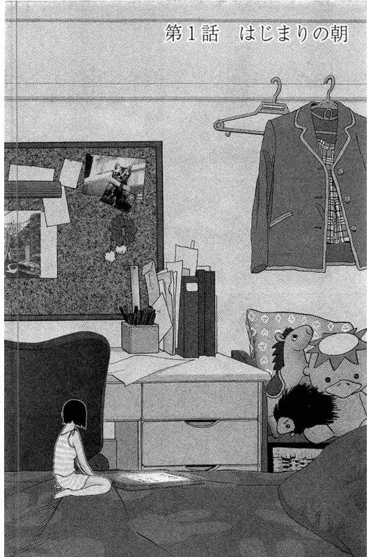

# 《Wonderland》一部惊艳到我了的作品

作者：深巷少女与猫

TID：28842

<title>1</title> <link href="../Styles/Style.css" type="text/css" rel="stylesheet">

# 1

刷E绅士的时候看到的

作者估计并不控gts，单纯想讲一个一个城市里的人都突然缩小的故事。

开头就惊艳到我了，女主醒过来发现自己缩小了，她养的宠物狗爬上床舔着讨好它的“小”主人，这时候我就觉得这个切入点不像圈内的作品。
果然当小狗驮着她下楼，就看到她家的宠物猫在虐杀她的父母，窗外在大街上突然缩小的人们被鸟类和野猫捕食，宛如地狱。

虽然我不懂日文，但是大概的剧情依然显得非常有趣。
比如警察们依旧六七人一组，分工驾驶警车尝试维护治安。
便利店中缩小的人们用打火机驱逐野猫。
突然出现了一个说着异族语言有超能力的少女。
相对封闭的商城中已经出现了疯狂的麦克斯那样的暴走族团体。

缩小症状会传染，所以前来控制局面的军队发现小人后立刻收容扑杀。

真的等不及想知道接下来会发生什么了

我感觉陪伴了女主一路的小狗如果死了，我这种泪点低的真的会忍不住。
它一路保护女主不被野猫抓走，但是偶尔又会分不清楚状况，所以在她家的宠物猫想抓住女主的时候无动于衷，还会闹脾气肚子饿了要带它去找狗粮。
如果它是一只德牧还好，其实就是一只很小的狗，只是因为女主缩小了才显得那么“可靠”

<title>2</title> <link href="../Styles/Style.css" type="text/css" rel="stylesheet">

# 2

 <ignore_js_op>[1653468-c71194bef6-00000005.jpg](forum.php?mod=attachment&aid=ODMzMDV8NmMwN2Q5MTN8MTY3NDA2NjQzMnwxODIzMHwyODg0Mg%3D%3D&nothumb=yes) *(84.33 KB, 下載次數: 1)*

[下載附件](forum.php?mod=attachment&aid=ODMzMDV8NmMwN2Q5MTN8MTY3NDA2NjQzMnwxODIzMHwyODg0Mg%3D%3D&nothumb=yes)

2020-6-6 12:54 上傳  

</ignore_js_op> <title>3</title> <link href="../Styles/Style.css" type="text/css" rel="stylesheet">

# 3

這漫畫早就有了，已經完結了，要不要剧透。簡體中文，叫做“梦游仙境”，我去找找正版地址。 <title>4</title> <link href="../Styles/Style.css" type="text/css" rel="stylesheet">

# 4

> [524 發表於 2020-6-6 16:07](https://giantessnight.cf/gnforum2012/forum.php?mod=redirect&goto=findpost&pid=438661&ptid=28842)
> 這漫畫早就有了，已經完結了，要不要剧透。簡體中文，叫做“梦游仙境”，我去找找正版地址。 ...

我看这上传的图片质量就知道这漫画年纪肯定不小了，应该只是我一直不知道而已

说惊艳也是因为抱着看gts的心态看了它的头三章，因为看不懂日文，所以脑子里很大一部分是在尝试用它这种现实的角度来欣赏“缩小属性”
感觉这种圈外的侧重点非常新鲜

剧透就不必了，如果找到中文资源，还是想好好看完的（就是不知道文本质量如何

<title>5</title> <link href="../Styles/Style.css" type="text/css" rel="stylesheet">

# 5

这不是梦游仙境吗，当初看到女主父母被猫玩死就对猫没啥好感了。。。
gts倒是后边有点擦边，总得来说相当于没有。汉化组早就弃坑了，作者好像也弃坑了。。。。当初刚出来确实是挺出名 <title>6</title> <link href="../Styles/Style.css" type="text/css" rel="stylesheet">

# 6

> [jack369605 發表於 2020-6-6 17:37](https://giantessnight.cf/gnforum2012/forum.php?mod=redirect&goto=findpost&pid=438666&ptid=28842)
> 这不是梦游仙境吗，当初看到女主父母被猫玩死就对猫没啥好感了。。。
> gts倒是后边有点擦边，总得来说相当于 ...

我查到停更的时候还觉得蛮可惜的

一开始完全是抱着冲的心情点进去的，毕竟是在Ehentai，然后就被吓到了
<title>7</title> <link href="../Styles/Style.css" type="text/css" rel="stylesheet">

# 7

更完了，汉化也完了。咪咕漫画有正版全集（免费的，56话）我也全看完了。但正版下架了，盗版全卡在14话，找遍所有网站都没有14话之后的。倒是有生肉购买地址 <title>8</title> <link href="../Styles/Style.css" type="text/css" rel="stylesheet">

# 8

b漫以前有过，刚刚看了一下也没了。
怎么说呢，剧情还蛮奇特的，主要是反战的。
但是后期gts元素挺少的。 <title>9</title> <link href="../Styles/Style.css" type="text/css" rel="stylesheet">

# 9

Wonderland我看完了之后还特意买了原版实体漫画收藏，确实很棒，福利不多倒是了，结局比较辛酸