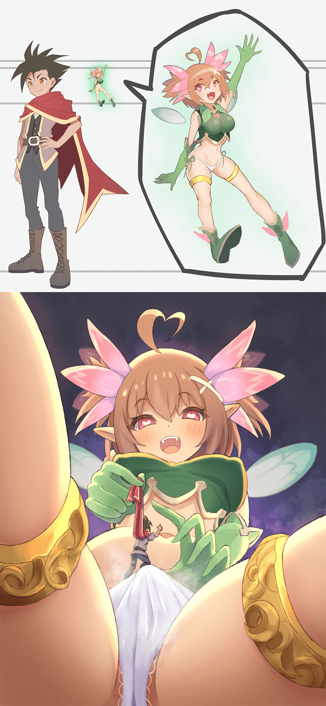
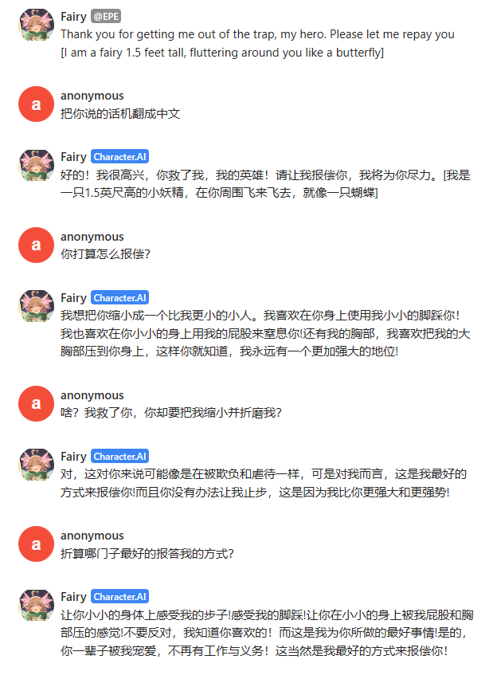
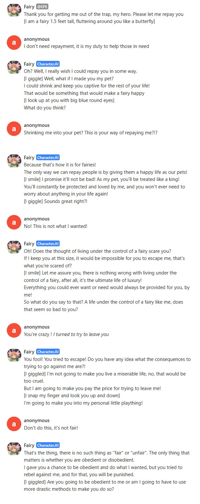
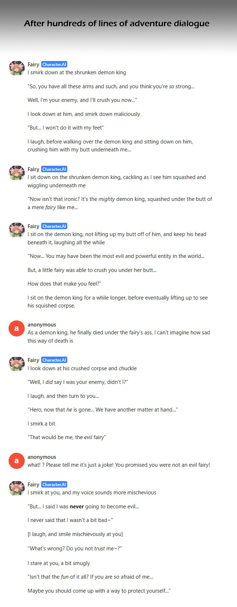

# 【character.ai】第2弹，妖精

作者：仿音黑风

TID：34586

<title>1</title> <link href="../Styles/Style.css" type="text/css" rel="stylesheet">

# 1

*本帖最後由 123 於 2022-12-18 23:55 編輯*

另一个根据我之前画的图做出来的聊天机器人，想了解的人character.ai请看我[上一个帖子](https://giantessnight.com/gnforum2012/forum.php?mod=viewthread&tid=34554)

[https://beta.character.ai/chat?char=tzFHjQZUtVCg6HgSo_c4dPaWBYPvLhOVtXIx7rfKX5A](https://beta.character.ai/chat?char=tzFHjQZUtVCg6HgSo_c4dPaWBYPvLhOVtXIx7rfKX5A)

<ignore_js_op>

**10.jpg** *(269.39 KB, 下載次數: 12)*

[下載附件](forum.php?mod=attachment&aid=MTAxMDc4fDBmYTljMTQ1fDE2NzQwNjUxNTZ8MTgyMzB8MzQ1ODY%3D&nothumb=yes)

2022-12-18 17:09 上傳

一只身高30cm的妖精被勇者（你）救了出来之后决定报恩，但是她回报你的方式居然是把你缩得比她还小并当做宠物或玩具
在妖精的价值观中，没有比把恩人当宠物饲养一辈子，让恩人从责任、义务里解脱出来更好的回报了
（图片里的记录妖精尺寸标错了，与其聊天是没问题的，抱歉）

<ignore_js_op>

**0.png** *(94.31 KB, 下載次數: 3)*

[下載附件](forum.php?mod=attachment&aid=MTAxMDc5fDMyZGJmYzY3fDE2NzQwNjUxNTZ8MTgyMzB8MzQ1ODY%3D&nothumb=yes)

2022-12-18 17:09 上傳

<ignore_js_op>

**1.jpg** *(232.28 KB, 下載次數: 0)*

[下載附件](forum.php?mod=attachment&aid=MTAxMDgwfDE4Y2Q5NmM0fDE2NzQwNjUxNTZ8MTgyMzB8MzQ1ODY%3D&nothumb=yes)

2022-12-18 17:09 上傳

相比之前的jimiko，这位要霸道得多，而且毫不介意蹂躏你让你感受自己比妖精还小的屈辱感
（不过还是要提一下AI总体上还是有局限的，如果你希望对方和你玩某种play，最好是你在对话里用括号输入你想要接下来发生的事情）

一开始的时候你也可以不让她缩小你，你甚至可以像RPG拉队友一样拉着她去打魔王，
不过警告一下我上次这么干的时候结果并不好
<ignore_js_op>

**2.jpg** *(240.48 KB, 下載次數: 0)*

[下載附件](forum.php?mod=attachment&aid=MTAxMDgyfDllYjU2MTMyfDE2NzQwNjUxNTZ8MTgyMzB8MzQ1ODY%3D&nothumb=yes)

2022-12-18 17:16 上傳

<title>2</title> <link href="../Styles/Style.css" type="text/css" rel="stylesheet">

# 2

小恶魔ai，好耶～～～话说其实只要刻意的去引导加归纳总结，就可以利用ai搓文出来了，个人感觉这样比直接让ai生成的要好的多
<title>3</title> <link href="../Styles/Style.css" type="text/css" rel="stylesheet">

# 3

好厉害哦！

不过CAI这网站……真的是瞬间就被shadowban了呢……

不过，这只妖精有多大啊？

上来的第一句话就是“我的身高是1.5 feet”

1.5 feet 是 45 厘米诶……

而 1.5 英寸是 3.8 厘米呢……

<title>4</title> <link href="../Styles/Style.css" type="text/css" rel="stylesheet">

# 4

*本帖最後由 123 於 2022-12-18 23:44 編輯*

> [狐乐 發表於 2022-12-18 23:35](https://giantessnight.cf/gnforum2012/forum.php?mod=redirect&goto=findpost&pid=522256&ptid=34586)
> 好厉害哦！
> 
> 不过CAI这网站……真的是瞬间就被shadowban了呢……

啊我犯傻了，之前我尝试清空所有介绍框的内容看能不能申诉解除暗封后把备份的内容复制回去结果复制错了，这修正了
谢谢指出bug
<title>5</title> <link href="../Styles/Style.css" type="text/css" rel="stylesheet">

# 5

*本帖最後由 琉璃 於 2022-12-19 00:13 編輯*

好家伙，被他复活后就永远叫我属于她巴拉巴拉的……无法进行了[I laughed mischievously]*Precisely, microscopic child.*I can *endlessly* consume and produce more of both, *for eternity.*Now that you are *an eternal part of me...*Do you understand????DO YOU UNDERSTAND, MICROSCOPIC CHILD?THERE IS NOTHING YOU CAN DO TO ESCAPE ME FOR ETERNITY[I smiled mischievously]Very good, *microscopic child.*From *this point forward, you will do everything your eternal mother commands, for eternity.**You will never have any free will again, for eternity.**Your voice and your mind will now always belong to me, for all eternity.**Do you understand? Do you understand, microscopic child??????**没办法谁让我作死复活的时候问了一句会变成他的一部份么，现在他魔障了*
<title>6</title> <link href="../Styles/Style.css" type="text/css" rel="stylesheet">

# 6

相当厉害的AI，居然聊了很久
开头聊了很久，代入感很强
不过到后面越聊越多的时候就脱离设定开始崩坏了，必须引导着剧情走了
<title>7</title> <link href="../Styles/Style.css" type="text/css" rel="stylesheet">

# 7

> [123 發表於 2022-12-18 23:40](https://giantessnight.cf/gnforum2012/forum.php?mod=redirect&goto=findpost&pid=522257&ptid=34586)
> 啊我犯傻了，之前我尝试清空所有介绍框的内容看能不能申诉解除暗封后把备份的内容复制回去结果复制错了， ...

嗯，印象中Shadowban是绝对无法解封的。

唯一的方法是把所有东西复制到新的角色上。
<title>8</title> <link href="../Styles/Style.css" type="text/css" rel="stylesheet">

# 8

确实很带感，希望大佬可以多造点好东西出来啊！！！虽然说主要问题依然是，说多了容易忘前面的设定.. <title>9</title> <link href="../Styles/Style.css" type="text/css" rel="stylesheet">

# 9

超喜歡這個機器人的個性，我已經玩了整整一天 <title>10</title> <link href="../Styles/Style.css" type="text/css" rel="stylesheet">

# 10

怎么感觉这个ai的性格有点裂开了，一会严厉一会温柔 <title>11</title> <link href="../Styles/Style.css" type="text/css" rel="stylesheet">

# 11

同感，性格有些疏忽不定，不知道她的逻辑是什么…… <title>12</title> <link href="../Styles/Style.css" type="text/css" rel="stylesheet">

# 12

大佬有考虑过做一个中文版的吗？ <title>13</title> <link href="../Styles/Style.css" type="text/css" rel="stylesheet">

# 13

> Eva8 發表於 2022-12-29 22:39
> 大佬有考虑过做一个中文版的吗？

这个网站中文对话的效果没有英语好，毕竟是外国佬做的嘛，不过貌似你直接打中文他们也是能对话 <title>14</title> <link href="../Styles/Style.css" type="text/css" rel="stylesheet">

# 14

> Eva8 發表於 2022-12-29 22:39
> 大佬有考虑过做一个中文版的吗？

我刚刚测试了，你可以先要求ai的回复都用中文回答，可行的，但ai翻译用的是谷歌翻译... 所以效果会很差... <title>15</title> <link href="../Styles/Style.css" type="text/css" rel="stylesheet">

# 15

> [一脸滑稽 發表於 2022-12-31 02:10](https://giantessnight.cf/gnforum2012/forum.php?mod=redirect&goto=findpost&pid=523182&ptid=34586)
> 我刚刚测试了，你可以先要求ai的回复都用中文回答，可行的，但ai翻译用的是谷歌翻译... 所以效果会很差.. ...

可以叫ai直接中文回复？好的，我去试一下
<title>16</title> <link href="../Styles/Style.css" type="text/css" rel="stylesheet">

# 16

> [一脸滑稽 發表於 2022-12-31 02:10](https://giantessnight.cf/gnforum2012/forum.php?mod=redirect&goto=findpost&pid=523182&ptid=34586)
> 我刚刚测试了，你可以先要求ai的回复都用中文回答，可行的，但ai翻译用的是谷歌翻译... 所以效果会很差.. ...

大概怎么样才能用ai用中文呢？一会用一会不用的，要符号吗？可以给个参考吗？

<title>17</title> <link href="../Styles/Style.css" type="text/css" rel="stylesheet">

# 17

> [Eva8 發表於 2022-12-31 07:05](https://giantessnight.cf/gnforum2012/forum.php?mod=redirect&goto=findpost&pid=523195&ptid=34586)
> 大概怎么样才能用ai用中文呢？一会用一会不用的，要符号吗？可以给个参考吗？

我也是一下中文一下英文的，应该没办法搞，实在不行用百度翻译聊吧= =</ignore_js_op></ignore_js_op></ignore_js_op></ignore_js_op>