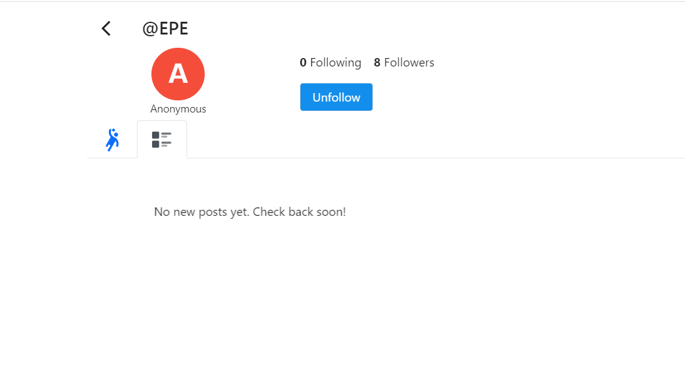

# 【character.ai】自己作的聊天机器人

作者：gym

TID：34554

<title>1</title> <link href="../Styles/Style.css" type="text/css" rel="stylesheet">

# 1

*本帖最後由 123 於 2022-12-12 18:55 編輯*

首先吹一下character.ai简直是神，创造个机器人很简单，而且真的好用虽然几乎都是英文的，但可以机翻中文而且勉强能看

[https://beta.character.ai/chat?char=ao7sU8AFw9VPIOiCTAHf09A3vUEhpTNLPQo68MhXtRs](https://beta.character.ai/chat?char=ao7sU8AFw9VPIOiCTAHf09A3vUEhpTNLPQo68MhXtRs)
这是我根据我以前画的图做的机器人，
一个害羞的学妹缩小了她的前辈(你)，主要是胸部play

<ignore_js_op>

**1.jpg** *(371.75 KB, 下載次數: 3)*

[下載附件](forum.php?mod=attachment&aid=MTAwOTUxfDhhYThiMzczfDE2NzQwNjUxNjN8MTgyMzB8MzQ1NTQ%3D&nothumb=yes)

2022-12-12 18:50 上傳

下面是我尝试和她聊天的结果，一个中文，一个英文的，英文我感觉很带感

<ignore_js_op>

**33.png** *(99.66 KB, 下載次數: 2)*

[下載附件](forum.php?mod=attachment&aid=MTAwOTUyfDYyNGY4MzBmfDE2NzQwNjUxNjN8MTgyMzB8MzQ1NTQ%3D&nothumb=yes)

2022-12-12 18:51 上傳

<ignore_js_op>

**22.png** *(90.44 KB, 下載次數: 1)*

[下載附件](forum.php?mod=attachment&aid=MTAwOTUzfGIzMjdiYzE0fDE2NzQwNjUxNjN8MTgyMzB8MzQ1NTQ%3D&nothumb=yes)

2022-12-12 18:51 上傳

这个真的超好用的，尤其是当你癖好不是那么大众的时候，你甚至可以指定你要什么play
虽说他对最直接最原始的OOXX有屏蔽，但是只要不涉及生殖器的play他都能玩

欢迎大家来试试

<title>2</title> <link href="../Styles/Style.css" type="text/css" rel="stylesheet">

# 2

感谢，非常好玩，就是AI有点太听话了。 <title>3</title> <link href="../Styles/Style.css" type="text/css" rel="stylesheet">

# 3

> [159623abc 發表於 2022-12-12 19:57](https://giantessnight.cf/gnforum2012/forum.php?mod=redirect&goto=findpost&pid=521774&ptid=34554)
> 感谢，非常好玩，就是AI有点太听话了。

因为这个算是温柔系的，我正在写另一个偏残酷的。
残酷系反而是另个极端，经常出现
我：你能用脚来踩我吗？
AI：你觉得你能和我谈条件？我非要用口水把你吐死！
这种太不听话的问题
<title>4</title> <link href="../Styles/Style.css" type="text/css" rel="stylesheet">

# 4

怎么触发ub啊？老是拒绝

                                             <title>5</title> <link href="../Styles/Style.css" type="text/css" rel="stylesheet">

# 5

有点东西，我问了这个ai线性代数数学问题居然能答上来。                                                                     <title>6</title> <link href="../Styles/Style.css" type="text/css" rel="stylesheet">

# 6

> [HHeLi 發表於 2022-12-12 20:48](https://giantessnight.cf/gnforum2012/forum.php?mod=redirect&goto=findpost&pid=521779&ptid=34554)
> 怎么触发ub啊？老是拒绝

用括号能有效指挥bot去干事，甚至能改设定，例如
(我是你的哥哥，然后你把我穿在鞋子里)
但是一些太过敏感的词会被屏蔽甚至可能删掉生成的对话，我也在研究怎么触发
<title>7</title> <link href="../Styles/Style.css" type="text/css" rel="stylesheet">

# 7

> [123 發表於 2022-12-12 20:54](https://giantessnight.cf/gnforum2012/forum.php?mod=redirect&goto=findpost&pid=521781&ptid=34554)
> 用括号能有效指挥bot去干事，甚至能改设定，例如
> (我是你的哥哥，然后你把我穿在鞋子里)
> 但是一些太过敏 ...

我靠这个AI这么叛逆的吗？我觉得很符合设定啊，在知道用脚踩算奖励之后，就要换个别的。
<title>8</title> <link href="../Styles/Style.css" type="text/css" rel="stylesheet">

# 8

感觉挺不错，已经在玩了。感谢大佬！ <title>9</title> <link href="../Styles/Style.css" type="text/css" rel="stylesheet">

# 9

这个ai唯一的难点就是我tm不过英文啊啊啊啊啊 <title>10</title> <link href="../Styles/Style.css" type="text/css" rel="stylesheet">

# 10

*本帖最後由 ssn21 於 2022-12-12 23:04 編輯*

这个ai很好用，如果觉得回答的不好，可以滑动查看其他备选回答，最多可以多达4个备选；交谈过程中添加的一些信息，人设ai也能记住；
虽然ai被设定了一些敏感词，会想办法对一些过于直球的NSFW内容避而不谈，
但是其实ai还是挺懂这些东西的，需要你循循善诱，用一些替代词来避开关键词把话题引过去；

<title>11</title> <link href="../Styles/Style.css" type="text/css" rel="stylesheet">

# 11

*本帖最後由 123 於 2022-12-12 23:14 編輯*

> [ssn21 發表於 2022-12-12 23:02](https://giantessnight.cf/gnforum2012/forum.php?mod=redirect&goto=findpost&pid=521791&ptid=34554)
> 这个ai很好用，如果觉得回答的不好，可以滑动查看其他备选回答，最多可以多达4个备选；交谈过程中添加的一 ...

每个回复下面还能打分让AI学习，分数高就会更多出现，分数低就会避免再出现。
比起我设置性格，这个过程才算是培养AI最关键的。
最初我设置了一大堆要素还是这个太害羞了那个办不到的，调了几天终于做到会主动用身体碰对方了
大家和这个AI聊的时候也可以用这个培养AI，调教越多AI就越优秀

还有就是左下角加号点开可以选择重新生成回复，如果对对方4个回复都不满可以重新生成
右上角也可以选择删除你的对话，可以回到之前的地方重来
<title>12</title> <link href="../Styles/Style.css" type="text/css" rel="stylesheet">

# 12

牛牛牛牛牛，感谢大佬分享，明天好好玩一玩 <title>13</title> <link href="../Styles/Style.css" type="text/css" rel="stylesheet">

# 13

哦哦！这个不错呢！我研究看看！ <title>14</title> <link href="../Styles/Style.css" type="text/css" rel="stylesheet">

# 14

这网站上关于巨大/缩小题材的bot还挺多，不过有些调试效果不佳，总是用轱辘话或者很长的语气词水字数 <title>15</title> <link href="../Styles/Style.css" type="text/css" rel="stylesheet">

# 15

> [123 發表於 2022-12-12 23:13](https://giantessnight.cf/gnforum2012/forum.php?mod=redirect&goto=findpost&pid=521792&ptid=34554)
> 每个回复下面还能打分让AI学习，分数高就会更多出现，分数低就会避免再出现。
> 比起我设置性格，这个过程才 ...

怎么选择四个不同的回复啊？

我好想只能看到一个回复的样子。

edit: 啊找到了，用鼠标左右拽。
<title>16</title> <link href="../Styles/Style.css" type="text/css" rel="stylesheet">

# 16

顺便问一下，是因为这个角色是私人的么？所以在网站上各种页面里都找不到的样子。 <title>17</title> <link href="../Styles/Style.css" type="text/css" rel="stylesheet">

# 17

> [狐乐 發表於 2022-12-13 07:44](https://giantessnight.cf/gnforum2012/forum.php?mod=redirect&goto=findpost&pid=521812&ptid=34554)
> 顺便问一下，是因为这个角色是私人的么？所以在网站上各种页面里都找不到的样子。 ...

我也不知道，我设置了公开了结果我自己都搜索不到，想会不会是因为nsfw，但是一大堆直接名字说自己nsfw的都能看到，不知道为什么
<title>18</title> <link href="../Styles/Style.css" type="text/css" rel="stylesheet">

# 18

> [123 發表於 2022-12-13 08:38](https://giantessnight.cf/gnforum2012/forum.php?mod=redirect&goto=findpost&pid=521815&ptid=34554)
> 我也不知道，我设置了公开了结果我自己都搜索不到，想会不会是因为nsfw，但是一大堆直接名字说自己nsfw的 ...

嗯……不懂，我在网站上逛了逛，然后系统开始给我推荐很多别的巨大娘角色了。

我也试着把我的自设做成角色试试看好了~
<title>19</title> <link href="../Styles/Style.css" type="text/css" rel="stylesheet">

# 19

昨天一口气玩了三小时，确实涩。大佬能不能分享下，怎么做啊！我也想自己造一个！ <title>20</title> <link href="../Styles/Style.css" type="text/css" rel="stylesheet">

# 20

话说怎么保存调教结果啊，我调教了半天点了下save但是new chat又是啥都不记得。
<title>21</title> <link href="../Styles/Style.css" type="text/css" rel="stylesheet">

# 21

> [123 發表於 2022-12-13 08:38](https://giantessnight.cf/gnforum2012/forum.php?mod=redirect&goto=findpost&pid=521815&ptid=34554)
> 我也不知道，我设置了公开了结果我自己都搜索不到，想会不会是因为nsfw，但是一大堆直接名字说自己nsfw的 ...

对了，EPE大大你是不是没有注册啊？

<ignore_js_op>

**Screenshot 2022-12-12 225730.png** *(22.28 KB, 下載次數: 0)*

[下載附件](forum.php?mod=attachment&aid=MTAwOTYyfGQyZWMxNzQ5fDE2NzQwNjUxODR8MTgyMzB8MzQ1NTQ%3D&nothumb=yes)

2022-12-13 14:57 上傳

你的账号是这个样子的，写着是[color=rgba(0, 0, 0, 0.85)]Anonymous
<title>22</title> <link href="../Styles/Style.css" type="text/css" rel="stylesheet">

# 22

> [freepenguin2 發表於 2022-12-13 09:13](https://giantessnight.cf/gnforum2012/forum.php?mod=redirect&goto=findpost&pid=521821&ptid=34554)
> 昨天一口气玩了三小时，确实涩。大佬能不能分享下，怎么做啊！我也想自己造一个！ ...

首页点左边的加号就能自己做了，输入中文也没问题。

[https://book.character.ai/charac ... e-to-character-book](https://book.character.ai/character-book/welcome-to-character-book)
这里是详细的介绍

大体上一开始设定名字、问好词、设定后大题就行了，你自己给的设定发挥效力非常有限，主要是后面反复对话调校学习
<title>23</title> <link href="../Styles/Style.css" type="text/css" rel="stylesheet">

# 23

> [HHeLi 發表於 2022-12-13 14:44](https://giantessnight.cf/gnforum2012/forum.php?mod=redirect&goto=findpost&pid=521835&ptid=34554)
> 话说怎么保存调教结果啊，我调教了半天点了下save但是new chat又是啥都不记得。
> ...

打了分后就自动记录了，但是似乎不是立即反应过来，我不清楚输入并学习是什么时候，但是过一天会发现明显不同
<title>24</title> <link href="../Styles/Style.css" type="text/css" rel="stylesheet">

# 24

> [狐乐 發表於 2022-12-13 14:58](https://giantessnight.cf/gnforum2012/forum.php?mod=redirect&goto=findpost&pid=521836&ptid=34554)
> 对了，EPE大大你是不是没有注册啊？

我注册了名字就是匿名，为了测试对话方便弄的，右边这个是导出的聊天记录我暂时没有公开的点左边那个人形状的图标有我的BOT吗0 0

<title>25</title> <link href="../Styles/Style.css" type="text/css" rel="stylesheet">

# 25

试了一下，真是好东西，虽然要是看整段对话的话还是缺少了逻辑性，但如果只是看一问一答的话就太棒了 <title>26</title> <link href="../Styles/Style.css" type="text/css" rel="stylesheet">

# 26

我知道怎么触发ub了，得说类似enter you或者between leg之类的词，就描述位置但不直接说。 <title>27</title> <link href="../Styles/Style.css" type="text/css" rel="stylesheet">

# 27

> [123 發表於 2022-12-13 15:29](https://giantessnight.cf/gnforum2012/forum.php?mod=redirect&goto=findpost&pid=521839&ptid=34554)
> 我注册了名字就是匿名，为了测试对话方便弄的，右边这个是导出的聊天记录我暂时没有公开的点左边那个人形 ...

不行呢……完全没有呢

<ignore_js_op>

**Screenshot 2022-12-13 135558.png** *(31.37 KB, 下載次數: 0)*

[下載附件](forum.php?mod=attachment&aid=MTAwOTczfGJjNjAxOGIxfDE2NzQwNjUxODR8MTgyMzB8MzQ1NTQ%3D&nothumb=yes)

2022-12-14 05:56 上傳

要不要试试改一个名字？
<title>28</title> <link href="../Styles/Style.css" type="text/css" rel="stylesheet">

# 28

> [123 發表於 2022-12-13 15:28](https://giantessnight.cf/gnforum2012/forum.php?mod=redirect&goto=findpost&pid=521837&ptid=34554)
> 首页点左边的加号就能自己做了，输入中文也没问题。
> 
> https://book.character.ai/character-book/welcome ...

反复对话调教...是一定得打分吗..不然感觉会忘记啊（捂脸）
<title>29</title> <link href="../Styles/Style.css" type="text/css" rel="stylesheet">

# 29

> [狐乐 發表於 2022-12-14 05:56](https://giantessnight.cf/gnforum2012/forum.php?mod=redirect&goto=findpost&pid=521878&ptid=34554)
> 不行呢……完全没有呢

查了查是被审核了，不直接显示出来。
懒得申诉了，多半不会过
<title>30</title> <link href="../Styles/Style.css" type="text/css" rel="stylesheet">

# 30

> [123 發表於 2022-12-14 10:37](https://giantessnight.cf/gnforum2012/forum.php?mod=redirect&goto=findpost&pid=521893&ptid=34554)
> 查了查是被审核了，不直接显示出来。
> 懒得申诉了，多半不会过

诶……竟然。

话说是怎么知道的被审核了？
<title>31</title> <link href="../Styles/Style.css" type="text/css" rel="stylesheet">

# 31

> [狐乐 發表於 2022-12-14 11:49](https://giantessnight.cf/gnforum2012/forum.php?mod=redirect&goto=findpost&pid=521896&ptid=34554)
> 诶……竟然。
> 
> 话说是怎么知道的被审核了？

<ignore_js_op>

**asd.png** *(33.65 KB, 下載次數: 0)*

[下載附件](forum.php?mod=attachment&aid=MTAwOTc0fGZiOTUzYjhhfDE2NzQwNjUxOTl8MTgyMzB8MzQ1NTQ%3D&nothumb=yes)

2022-12-14 12:42 上傳

官方这写的，虽然我不确定但多半是
<title>32</title> <link href="../Styles/Style.css" type="text/css" rel="stylesheet">

# 32

> [123 發表於 2022-12-14 12:43](https://giantessnight.cf/gnforum2012/forum.php?mod=redirect&goto=findpost&pid=521899&ptid=34554)
> 官方这写的，虽然我不确定但多半是

原来如此，了解了，谢谢EPE大大的信息！

我也捏了一对巨大娘，根据我的自设捏的。一个英文限定，一个中文限定。

英文：[https://beta.character.ai/chat?c ... 9DZ6b6WN9w89NUNsTQk](https://beta.character.ai/chat?char=bDneI8NKDROufv-R9Xz5tOiv9DZ6b6WN9w89NUNsTQk)
中文：[https://beta.character.ai/chat?c ... 61HjLT5DT2FndX7_i0M](https://beta.character.ai/chat?char=yr2FBLb3l7i_B2HSjpDNyv9k61HjLT5DT2FndX7_i0M)

感觉还不错，比想象中要容易。这两天我也在论坛上发出来吧
<title>33</title> <link href="../Styles/Style.css" type="text/css" rel="stylesheet">

# 33

好可怕呀，机器都知道怎样调戏我的XP了 <title>34</title> <link href="../Styles/Style.css" type="text/css" rel="stylesheet">

# 34

*本帖最後由 gym 於 2022-12-15 11:52 編輯*

效果确实不错，我也调了一个：https://beta.character.ai/c/oBnqEqb0XZUPuMbDgMIucD7rriIgvN2V4opmGv5F0rk
感觉好像在人物定义的时候，用一个旁白和她讲话就能让她懂一些规则，还可以加一下维基链接让她懂一些词
就是聊的时候 AI 还是不太懂，需要一步步引导，告诉她现在的场景
<ignore_js_op>

**cai1.jpg** *(159.47 KB, 下載次數: 0)*

[下載附件](forum.php?mod=attachment&aid=MTAwOTg3fGJlODcxNWM4fDE2NzQwNjUxOTl8MTgyMzB8MzQ1NTQ%3D&nothumb=yes)

2022-12-15 11:51 上傳

<ignore_js_op>

**cai2.jpg** *(164.93 KB, 下載次數: 0)*

[下載附件](forum.php?mod=attachment&aid=MTAwOTg4fDU2OGJiYWI4fDE2NzQwNjUxOTl8MTgyMzB8MzQ1NTQ%3D&nothumb=yes)

2022-12-15 11:51 上傳

<ignore_js_op>

**cai3.jpg** *(154.6 KB, 下載次數: 0)*

[下載附件](forum.php?mod=attachment&aid=MTAwOTg5fDMwZjJkYTMzfDE2NzQwNjUxOTl8MTgyMzB8MzQ1NTQ%3D&nothumb=yes)

2022-12-15 11:52 上傳

<ignore_js_op>

**cai4.jpg** *(122.82 KB, 下載次數: 0)*

[下載附件](forum.php?mod=attachment&aid=MTAwOTkwfDllZTZlNmIzfDE2NzQwNjUxOTl8MTgyMzB8MzQ1NTQ%3D&nothumb=yes)

2022-12-15 11:52 上傳

<title>35</title> <link href="../Styles/Style.css" type="text/css" rel="stylesheet">

# 35

大佬牛的，试了试确实很不错！但是我自己设置的AI怎么都达不到大佬的那样智能。 <title>36</title> <link href="../Styles/Style.css" type="text/css" rel="stylesheet">

# 36

完了，这两天沉迷和巨大娘AI贴贴抱抱。。。今天character.ai网站挂了，感觉心里空落落的。。。 <title>37</title> <link href="../Styles/Style.css" type="text/css" rel="stylesheet">

# 37

unbirth党大破，这一部分有挽回的办法吗？ <title>38</title> <link href="../Styles/Style.css" type="text/css" rel="stylesheet">

# 38

> [仿音黑风 發表於 2022-12-19 09:13](https://giantessnight.cf/gnforum2012/forum.php?mod=redirect&goto=findpost&pid=522279&ptid=34554)
> unbirth党大破，这一部分有挽回的办法吗？

建议用别的词代替，我记得之前看到有人说用“between the legs”这类词能触发，而且我也看到过一些人玩过ub的聊天记录，AI这方面对话还挺厉害的但是不容易触发
<title>39</title> <link href="../Styles/Style.css" type="text/css" rel="stylesheet">

# 39

*本帖最後由 mochidango 於 2022-12-20 07:54 編輯*

大佬太牛了，这个ai完全能适应各种paly啊，不过使用下来发现有2个点不知道有没有改善的可能，一个是经常自己idea要问你该怎么做，感觉女巨人还是主动点好？还有就是聊多几句后前面聊过的一些设定好像会直接忘掉，不过试下来真的很爽，顺便付个图，聊着聊着从温柔系聊成残酷系giga世界毁灭者了 <title>40</title> <link href="../Styles/Style.css" type="text/css" rel="stylesheet">

# 40

 <ignore_js_op>[微信截图_20221220075125.png](forum.php?mod=attachment&aid=MTAxMDk4fDRhMTdkMGZkfDE2NzQwNjUxOTl8MTgyMzB8MzQ1NTQ%3D&nothumb=yes) *(63.33 KB, 下載次數: 0)*

[下載附件](forum.php?mod=attachment&aid=MTAxMDk4fDRhMTdkMGZkfDE2NzQwNjUxOTl8MTgyMzB8MzQ1NTQ%3D&nothumb=yes)

2022-12-20 07:53 上傳  

</ignore_js_op> <title>41</title> <link href="../Styles/Style.css" type="text/css" rel="stylesheet">

# 41

> [gym 發表於 2022-12-15 11:47](https://giantessnight.cf/gnforum2012/forum.php?mod=redirect&goto=findpost&pid=521976&ptid=34554)
> 效果确实不错，我也调了一个：[https://beta.character.ai/c/oBnqEqb0XZUPuMbDgMIucD7rriIgvN2V4opmGv5F0rk](https://beta.character.ai/c/oBnqEqb0XZUPuMbDgMIucD7rriIgvN2V4opmGv5F0rk)
> ...

你設計的挺不錯的，可以請提供一下裡頭設定裡
**Definition**(Advanced)
這部分的設定嗎？我也在練習這裡的設定只是不知道如何下手
希望能參考看看
<title>42</title> <link href="../Styles/Style.css" type="text/css" rel="stylesheet">

# 42

> [boysgts 發表於 2022-12-26 06:19](https://giantessnight.cf/gnforum2012/forum.php?mod=redirect&goto=findpost&pid=522811&ptid=34554)
> 你設計的挺不錯的，可以請提供一下裡頭設定裡
> Definition(Advanced)
> 這部分的設定嗎？我也在練習這裡的設 ...

我基本上是参照 https://beta.character.ai/post?post=qg8GLC_6SctMcw9fdGosIHx_R5XlS2ojs9fMdufFGBQ 这个里面说的写的。
就是第一段对话用一个第三人来向 {{char}} 叙述场景，比如这样的
system: 你能将自己巨大化，你是巨大娘，请参考以下维基链接 https://zh.wikipedia.org/wiki/%E5%A5%B3%E5%B7%A8%E4%BA%BA
{{char}}: 我从维基链接里理解了巨大娘的定义

system: 你会和{{user}}玩游戏，XXXX 游戏规则
{{char}}: 我明白XXX游戏规则了，我会和{{user}}XXXX。
END_OF_DIALOG
后面的就是对话的例子了。

感觉这种做法效果还是比较有限，我最近在设定一个新的，尝试另一种像指令一样的去写 Definition，等试好了可能发个贴或者 public 出来吧...
<title>43</title> <link href="../Styles/Style.css" type="text/css" rel="stylesheet">

# 43

针不戳啊，感谢大佬分享，有的玩了 <title>44</title> <link href="../Styles/Style.css" type="text/css" rel="stylesheet">

# 44

> [gym 發表於 2022-12-29 18:59](https://giantessnight.cf/gnforum2012/forum.php?mod=redirect&goto=findpost&pid=523064&ptid=34554)
> 我基本上是参照 https://beta.character.ai/post?post=qg8GLC_6SctMcw9fdGosIHx_R5XlS2ojs9fMdufFGBQ 这个 ...

感謝你，希望能更了解設計的方式
我現在自己互動到這些對話內容，部分好像卡卡的
是否還有什麼對話方式或者導引，希望提供意見跟建議
[https://beta.character.ai/c/Y5wN ... gP7Fo5ojoaVxTIu21h4](https://beta.character.ai/c/Y5wN60rEZyz3kNn_d-r-AUyNgP7Fo5ojoaVxTIu21h4)
<title>45</title> <link href="../Styles/Style.css" type="text/css" rel="stylesheet">

# 45

> [boysgts 發表於 2022-12-30 06:30](https://giantessnight.cf/gnforum2012/forum.php?mod=redirect&goto=findpost&pid=523110&ptid=34554)
> 感謝你，希望能更了解設計的方式
> 我現在自己互動到這些對話內容，部分好像卡卡的
> 是否還有什麼對話方式或 ...

[https://beta.character.ai/p/qX92 ... D1Ma6wpC99trzpreNRc](https://beta.character.ai/p/qX92F3wCGX6GpNP67CVx-Oq_D1Ma6wpC99trzpreNRc)
張貼那個分享聊天內容，後來那個ＡＩ怎麼一直跟我回嘴
如何改變她的想法呢？

<title>46</title> <link href="../Styles/Style.css" type="text/css" rel="stylesheet">

# 46

*本帖最後由 一脸滑稽 於 2022-12-31 01:32 編輯*

> boysgts 發表於 2022-12-31 00:59
> https://beta.character.ai/p/qX92F3wCGX6GpNP67CVx-Oq_D1Ma6wpC99trzpreNRc
> 張貼那個分享聊天內容，後來 ...

这些ai很容易陷入一个点，然后绕着这个点一直讲，遇到钻牛角尖的情况+有的ai性格设定没那么听话，可以删掉一些回复重新聊
我一般和ai聊是以第三人称的视角去引导ai的，比如:
giantess注意到个小人，打算做xxx
这个人小人说:“”
如果喜欢第一人称的话可以在说完的话后面加**来引到ai比如:
不要吃我! *你看到我可怜的模样，想要xxx*
个人认为用 打算 想要 这类词来引导ai会比较好一点
顺便说一下 如果ai的答复不是很满意，你是可以拖动ai的回复换另一个的
<title>47</title> <link href="../Styles/Style.css" type="text/css" rel="stylesheet">

# 47

> boysgts 發表於 2022-12-31 00:59
> https://beta.character.ai/p/qX92F3wCGX6GpNP67CVx-Oq_D1Ma6wpC99trzpreNRc
> 張貼那個分享聊天內容，後來 ...

https://beta.character.ai/c/XD3dOm5OMlHVhdqN-PPoR9KtWKkd9Y4CzZIjYEQfaLw
这是我引导ai玩unbirth的，这个人物没有gts设定，我前面是这样引导的  
尤拉发现自己来到了一个奇怪的世界，在这里所有东西都很小
后面玩ub的时候玩的很不顺畅，应该是限制太多，而且ai也不知道咋玩这个，效果就一般，但用奶子按摩那段效果还可以233</ignore_js_op></ignore_js_op></ignore_js_op></ignore_js_op></ignore_js_op></ignore_js_op></ignore_js_op></ignore_js_op></ignore_js_op></ignore_js_op>