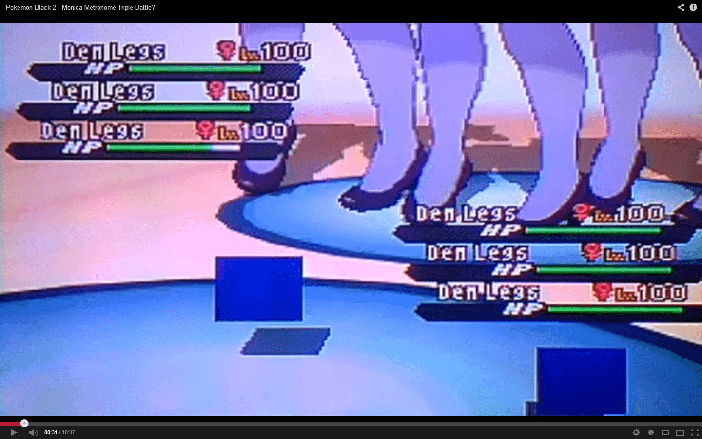
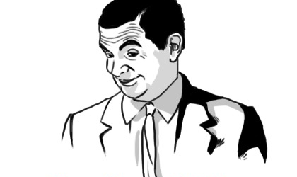

# (youtube)神寶(口妖)黑白2 有人能解釋我看到了什麼嗎...

作者：a499754505

TID：14839

<title>1</title> <link href="../Styles/Style.css" type="text/css" rel="stylesheet">

# 1

[http://www.youtube.com/watch?v=mgzqmMTWJjk](http://www.youtube.com/watch?v=mgzqmMTWJjk)
<ignore_js_op>

**Untitled.png** *(1.57 MB, 下載次數: 0)*

[下載附件](forum.php?mod=attachment&aid=MzUzODN8ODUyNzMxMjd8MTY3NDA2ODQ4MXwxODIzMHwxNDgzOQ%3D%3D&nothumb=yes)

2013-7-28 19:41 上傳

<title>2</title> <link href="../Styles/Style.css" type="text/css" rel="stylesheet">

# 2

最佳留言：
"Dem Legs used Water Gun!" ...If you know what I mean.
很邪惡。 <title>3</title> <link href="../Styles/Style.css" type="text/css" rel="stylesheet">

# 3

> 3213213210 發表於 2013-7-28 19:43 
> 最佳留言：
> "Dem Legs used Water Gun!" ...If you know what I mean.
> 很邪惡。

大腿使用水槍!! 你懂我的意思。
<ignore_js_op>

**if-you-know-what-i-mean-420x250.png** *(50.86 KB, 下載次數: 0)*

[下載附件](forum.php?mod=attachment&aid=MzUzODZ8NDliMDNkOTN8MTY3NDA2ODQ4MXwxODIzMHwxNDgzOQ%3D%3D&nothumb=yes)

2013-7-28 19:58 上傳

<title>4</title> <link href="../Styles/Style.css" type="text/css" rel="stylesheet">

# 4

嗯。。。其他人改编。。。或者说自制的宝可梦游戏？
话说我玩过的口袋妖怪最新版本是绿宝石了。。。还是改编的386版本。。。 <title>5</title> <link href="../Styles/Style.css" type="text/css" rel="stylesheet">

# 5

我方的那个马赛克一样的东西是什么啊喂？ <title>6</title> <link href="../Styles/Style.css" type="text/css" rel="stylesheet">

# 6

> 邢大志 發表於 2013-7-28 20:46 
> 我方的那个马赛克一样的东西是什么啊喂？

因為那雙腿沒有在「我方」的圖
<title>7</title> <link href="../Styles/Style.css" type="text/css" rel="stylesheet">

# 7

我記得在遊戲中拍電影的那一段也只有一雙腿啊
這是哪位大師改的，改的這麼厲害 <title>8</title> <link href="../Styles/Style.css" type="text/css" rel="stylesheet">

# 8

0.0 这是游戏的改图么 <title>9</title> <link href="../Styles/Style.css" type="text/css" rel="stylesheet">

# 9

这很有趣！ <title>10</title> <link href="../Styles/Style.css" type="text/css" rel="stylesheet">

# 10

不要和我提口袋妖怪，老子找博士找了20分钟 <title>11</title> <link href="../Styles/Style.css" type="text/css" rel="stylesheet">

# 11

> 迷幻夏天 發表於 2013-7-30 11:01 
> 不要和我提口袋妖怪，老子找博士找了20分钟

这得是有多弱....
<title>12</title> <link href="../Styles/Style.css" type="text/css" rel="stylesheet">

# 12

以前玩黑白2时看到有gts剧本时，我还激动了很久，结果这个剧本只是寥寥带过。。。 <title>13</title> <link href="../Styles/Style.css" type="text/css" rel="stylesheet">

# 13

这种程度，改的太粗糙了呗 <title>14</title> <link href="../Styles/Style.css" type="text/css" rel="stylesheet">

# 14

中间那一团白色的东西？</ignore_js_op></ignore_js_op>