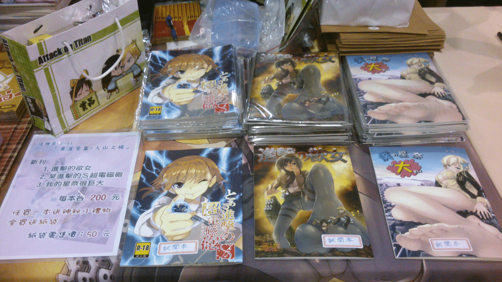
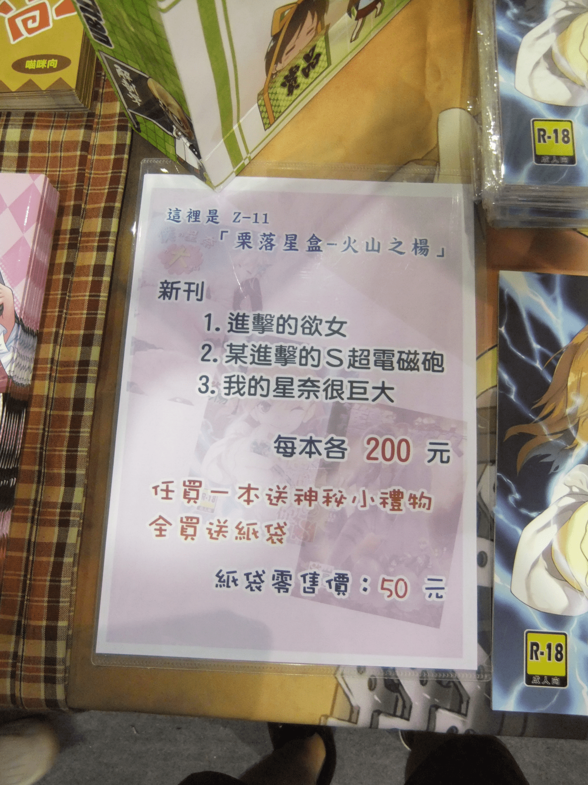
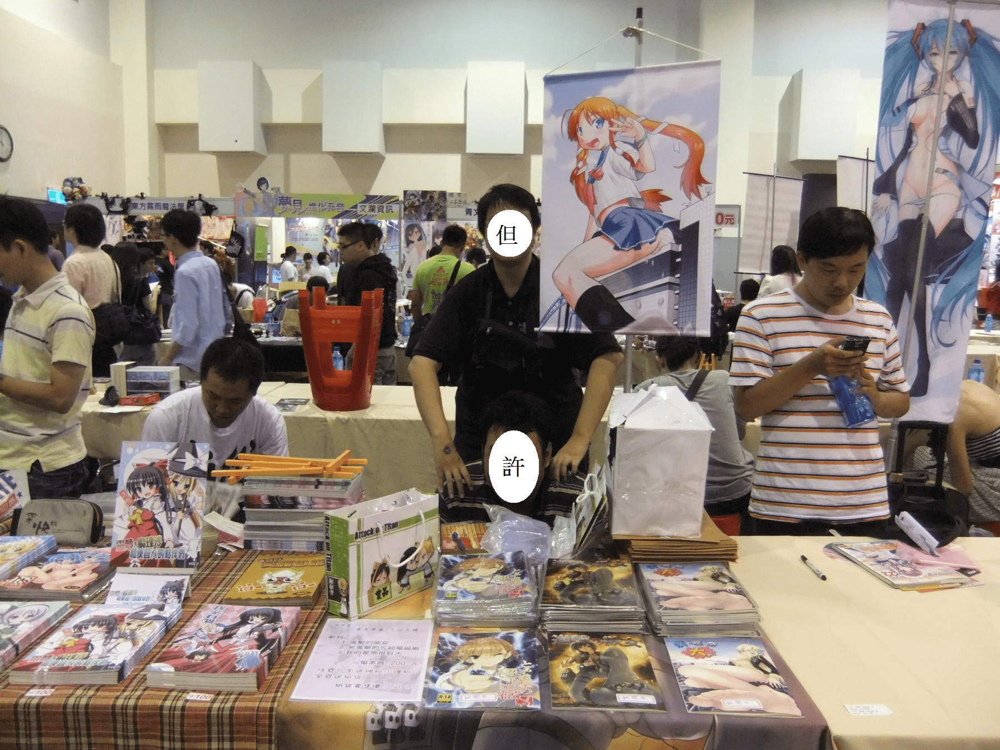
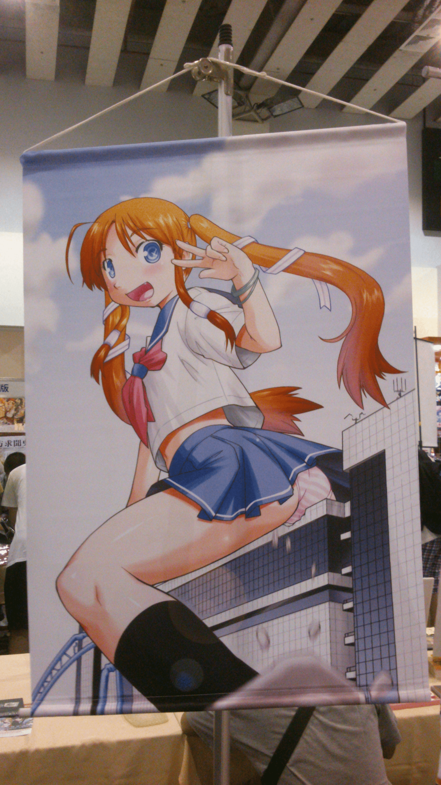
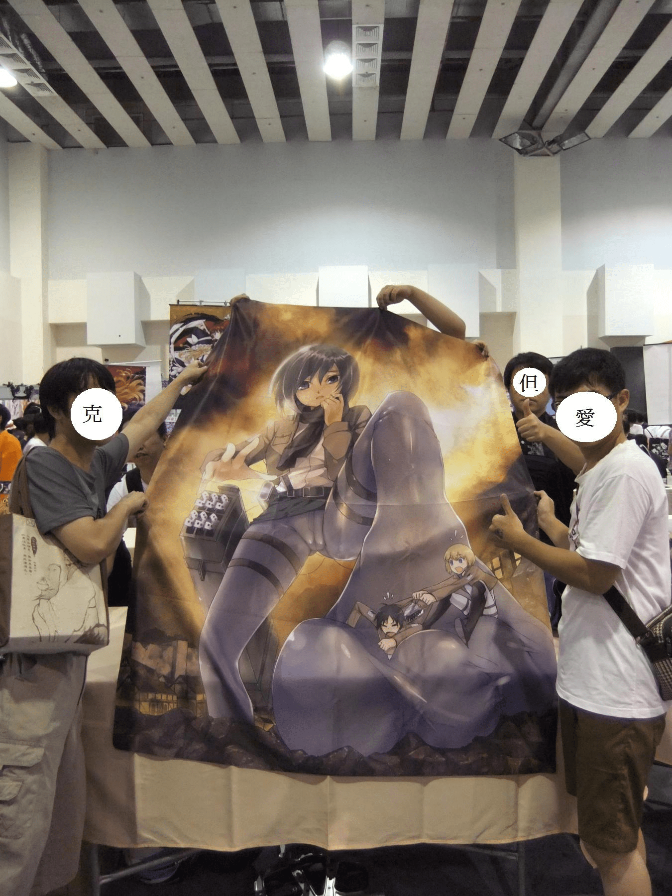

# 【不負責任圖文心得】2013_7／27 台大體育館FF22

作者：wz6252870

TID：14834

<title>1</title> <link href="../Styles/Style.css" type="text/css" rel="stylesheet">

# 1

今天是GN第一次在FF22上擺攤耶！！

一大早就跟但大、阿許在體育館會合
在此感謝某位善心人士開車幫我們載貨，不然以我跟但丁的機車載個兩趟是跑不掉的～
一到會場人山人海，排隊要進場的人潮綿延不覺，令第一次踏進FF的我與阿許嚇了一跳...

擺攤時間從10點半到16點半～看看我們的攤位吧!!
<ignore_js_op>

**2013-07-27 09.59.53.jpg** *(1.37 MB, 下載次數: 0)*

[下載附件](forum.php?mod=attachment&aid=MzUzNTl8MzFhNjFiODZ8MTY3NDA2ODk0NXwxODIzMHwxNDgzNA%3D%3D&nothumb=yes)

2013-7-27 23:05 上傳

價目表：
<ignore_js_op>

**DSCF6558.JPG** *(1.6 MB, 下載次數: 0)*

[下載附件](forum.php?mod=attachment&aid=MzUzNjB8MjY0N2QzNmJ8MTY3NDA2ODk0NXwxODIzMHwxNDgzNA%3D%3D&nothumb=yes)

2013-7-27 23:06 上傳

攤位外觀...真的好窄，還好隔壁攤位沒來!!（大心）
順理成章的就成為我們的地盤XD
<ignore_js_op>

**DSCF6556_1.jpg** *(337.53 KB, 下載次數: 0)*

[下載附件](forum.php?mod=attachment&aid=MzUzNjF8OGM3NWY3MDZ8MTY3NDA2ODk0NXwxODIzMHwxNDgzNA%3D%3D&nothumb=yes)

2013-7-27 23:07 上傳

我們的招牌～好醒目，一看就知道是GTS。當然這只有圈內人才懂了～～
<ignore_js_op>

**2013-07-27 10.00.01.jpg** *(4.3 MB, 下載次數: 0)*

[下載附件](forum.php?mod=attachment&aid=MzUzNjJ8MDg4NTE2MGN8MTY3NDA2ODk0NXwxODIzMHwxNDgzNA%3D%3D&nothumb=yes)

2013-7-27 23:11 上傳

期間陸續有版友們來拿貨，有一位竟然還帶妹來!!太可惡了!!（誤）
克里亞、蚱蜢叔、pliod也陸續到現場幫忙顧攤。

也可能因為我們口味與眾不同，一位宅宅翻了試閱本後直呼太誇張了、太扯了!!
看來要一般人接受我們的口味似乎有點難......
不過來翻翻看得人還是蠻多的，尤其是進擊的慾女這本，翻等封面都翹起來了
看來進擊的巨人真的很紅阿～

最後收攤時來跟我們的大桌布巾合照吧
(其實我們的招牌應該是這張XD ...只是太大張了吊不起來)
<ignore_js_op>

**DSCF6596_1.jpg** *(242.16 KB, 下載次數: 0)*

[下載附件](forum.php?mod=attachment&aid=MzUzNjR8YWY2NTMwNzl8MTY3NDA2ODk0NXwxODIzMHwxNDgzNA%3D%3D&nothumb=yes)

2013-7-27 23:27 上傳

end~~

<title>2</title> <link href="../Styles/Style.css" type="text/css" rel="stylesheet">

# 2

进击风o(￣ヘ￣o＃)拉人气的时候还是挺有用的
话说许是中文么。。。坐下来一点都看不出来哪里进击了啊w(ﾟДﾟ)w
隔壁的东方本好像很好看的样子(喂！(#`O′)
还有仔细看后面好像有只不笑猫的样子(喂！(╬￣皿￣)＝○＃(￣＃)３￣)
---
_(:зゝ∠)_旗帜一点都不嚣张。。。看看隔壁。。。为了人气连裤子都拖了。。。 <title>3</title> <link href="../Styles/Style.css" type="text/css" rel="stylesheet">

# 3

贩售情况如何啊？ <title>4</title> <link href="../Styles/Style.css" type="text/css" rel="stylesheet">

# 4

.
海報變桌布是我的疏失，沒有想到場地根本不夠大，誰知道當桌布居然超級適合的。
我想我們的桌布應該是全館最H的一張桌布。
讀者們拿起試閱本之後馬上就看見三笠的股間……（掩面）

我也會補一個完整的心得，不過今晚太累了，我得睡去 <title>5</title> <link href="../Styles/Style.css" type="text/css" rel="stylesheet">

# 5

三本都是中文的!
其實會場晃一圈，我發現有9成9的人物我都不認識... <title>6</title> <link href="../Styles/Style.css" type="text/css" rel="stylesheet">

# 6

我才不要當宅宅XDD <title>7</title> <link href="../Styles/Style.css" type="text/css" rel="stylesheet">

# 7

*本文章最後由 ADSL 於 2013-7-28 00:41 編輯*

支持支持~~
话说摊位真的好小！
诶.....找了半天，发现两米级巨人原来坐下去了。
果然没有出乎咱的意料呢，巨人带有新番效应的大BUFF......
嗯......摆摊的诸位辛苦了。
等之后蛋大的心得了，希望是热卖XD。

另外，仔细一看图，发现克里亚前辈的袋子是个亮点——我似乎看见了杜Sir...... <title>8</title> <link href="../Styles/Style.css" type="text/css" rel="stylesheet">

# 8

这是在那啊？ <title>9</title> <link href="../Styles/Style.css" type="text/css" rel="stylesheet">

# 9

> 六六六 發表於 2013-7-28 00:44 
> 这是在那啊？

标题上写着。。。
看不懂繁体可以尝试转换一下。。。比如拿到百度搜索一下就会默认变为简体了。。。
<title>10</title> <link href="../Styles/Style.css" type="text/css" rel="stylesheet">

# 10

幸好我們左邊的攤位當天沒來擺.不然依個攤位的位置其實只能坐3.4人
旁邊的東方攤算是幫了我們蠻大的忙.因為許多人經過可以假裝是看東方攤
蠻多人都有瞄到桌上擺的.翻的人也不少,有些3.4人一團的可能翻一下之後就跑走私下討論
不過拿起試閱本就看到三笠股間這點其實還是讓人難免會感到一些尷尬就是...
印象中有3.4人是3本都買,就以我這個不常站在攤位的來說比預期況來的好.

7樓真是眼尖呢0.0,那袋子確實是杜X的"愉悅人蔘"袋;不過感覺快被我搞破了
<title>11</title> <link href="../Styles/Style.css" type="text/css" rel="stylesheet">

# 11

> shendanxiaogui 發表於 2013-7-28 00:52 
> 标题上写着。。。
> 看不懂繁体可以尝试转换一下。。。比如拿到百度搜索一下就会默认变为简体了。。。
> ...

不知道这地方 <title>12</title> <link href="../Styles/Style.css" type="text/css" rel="stylesheet">

# 12

這次跟冬季差太多...
早上9點多就去排了,快中午才進場,隊伍都排到N公里遠
大大辛苦了,好好休息吧!! <title>13</title> <link href="../Styles/Style.css" type="text/css" rel="stylesheet">

# 13

大家都幸苦了呢，吾还是在等电子本啊 <title>14</title> <link href="../Styles/Style.css" type="text/css" rel="stylesheet">

# 14

因為有不少事要處理
所以沒機會去
錯過了一次體驗
下次一定要去 <title>15</title> <link href="../Styles/Style.css" type="text/css" rel="stylesheet">

# 15

嗯。。。许兄真矮啊~ <title>16</title> <link href="../Styles/Style.css" type="text/css" rel="stylesheet">

# 16

所以販售情況呢? <title>17</title> <link href="../Styles/Style.css" type="text/css" rel="stylesheet">

# 17

虽然我知道这些很贵……但是每本200元也太贵了 <title>18</title> <link href="../Styles/Style.css" type="text/css" rel="stylesheet">

# 18

感謝板上熱心人士推廣ＧＴＳ文化
<title>19</title> <link href="../Styles/Style.css" type="text/css" rel="stylesheet">

# 19

羡慕嫉妒恨啊，我等电子版吧，说实话，非常想收藏，可惜手头资金有限啊 <title>20</title> <link href="../Styles/Style.css" type="text/css" rel="stylesheet">

# 20

这也可以吗？为啥我们这边没有啊
、 <title>21</title> <link href="../Styles/Style.css" type="text/css" rel="stylesheet">

# 21

> boysgts 發表於 2013-7-29 06:42 
> 感謝板上熱心人士推廣ＧＴＳ文化

签名是啥看不到啊 <title>22</title> <link href="../Styles/Style.css" type="text/css" rel="stylesheet">

# 22

哇~原來還有這事呢~雖然我還不了解火山之楊，只知道它是但丁等同好參與的一個出版方~
支持哦！：）這兩年不知會不會有呢嘿嘿~還有不知火山之楊能不能動員會員們也登陸大陸的CJ和動漫遊戲展覽會呢~讓大陸的同好們也能親身感受一下呵~
<title>23</title> <link href="../Styles/Style.css" type="text/css" rel="stylesheet">

# 23

好东西啊 要是能买到就好了 <title>24</title> <link href="../Styles/Style.css" type="text/css" rel="stylesheet">

# 24

一股好羞耻的赶脚 <title>25</title> <link href="../Styles/Style.css" type="text/css" rel="stylesheet">

# 25

佩服得全体透地啊  勇气可嘉啊 <title>26</title> <link href="../Styles/Style.css" type="text/css" rel="stylesheet">

# 26

果然成熟的人就是在做成熟的事情啊！
什么时候我也能如此成熟呢！</ignore_js_op></ignore_js_op></ignore_js_op></ignore_js_op></ignore_js_op>