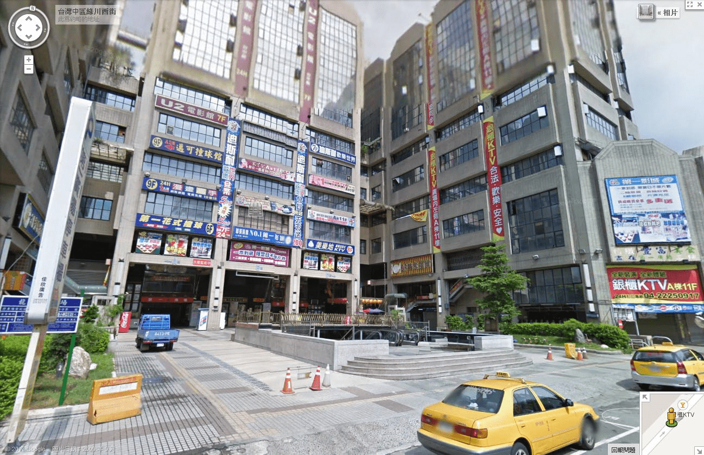

# 【交流互動】2013台中網聚 更新

作者：lovegts

TID：14675

<title>1</title> <link href="../Styles/Style.css" type="text/css" rel="stylesheet">

# 1

*本文章最後由 中文之許 於 2013-7-6 22:50 編輯*

最近因為很多事情在忙，所以太晚開帖

**目前定案7/14中午**
 **預計花費300元(有零頭的話我解決)**

**1點在前火車站前的廣場集合吧(很明顯的一個地點)**

**若是不知道的人，廣場正對著所有客運車站(統聯、國光、台中客運)**

大概4~5點結束，若是想要續場，大概會帶人逛街(一中街、逢甲街)或是附近的百貨商場

包廂內好像沒有插座(之前沒注意)外面有插座

中餐應該在ktv解決，若是真的餓到撐不到ktv(其實只是對面而已...)火車站附近甚麼店都有，也可以在那附近解決

我當天會帶usb，目前電腦裡面只有存漫畫(giantess fans、giantess katelyn、giantess clubs、pp、國內三作者、mm系列)要哪一本，就直接跟我私信吧，不過不一定保證有(除非裡面有縮小女)我通常收到一本漫畫都是直接刪的，有時候也會清掉電腦裡存的gts漫畫，所以不一定都有

因為這次有些人是外地來的，不好意思全額給他們付費，我多少出一點比較零頭的費用(例如ktv加場次、喝飲料等)

by the way ，太安靜的話，大概會在那邊聽我劈哩啪啦的講縮小女講三小時喔

**Dante管理員
我
小蚱蜢超級版主
克里亞
rock1633**
<title>2</title> <link href="../Styles/Style.css" type="text/css" rel="stylesheet">

# 2

看样子中文兄格外的健谈......

很期待，可惜去不了。

所以......嗯，如果可以的话，到时候能发一发聚会照吗？ <title>3</title> <link href="../Styles/Style.css" type="text/css" rel="stylesheet">

# 3

.
有人要唱歌也是可以，或者說應該唱個幾首，免得被服務生懷疑說怎麼這一桌都不唱歌。
那我得趕緊練一下歌喉了XD

有沒有人要跟我一起從台北下去？我想搭國道客運。 <title>4</title> <link href="../Styles/Style.css" type="text/css" rel="stylesheet">

# 4

大陆什么时候能有聚会………… <title>5</title> <link href="../Styles/Style.css" type="text/css" rel="stylesheet">

# 5

但丁幫我包機。。我也要參加啦。。555 <title>6</title> <link href="../Styles/Style.css" type="text/css" rel="stylesheet">

# 6

但大和中文兄唱歌吗

我觉得这个唱歌比福利还诱惑
<title>7</title> <link href="../Styles/Style.css" type="text/css" rel="stylesheet">

# 7

作为非宝岛居民我只能默默地祈祷哪天我也能去台湾…… <title>8</title> <link href="../Styles/Style.css" type="text/css" rel="stylesheet">

# 8

等大陆有了。。我肯定去 <title>9</title> <link href="../Styles/Style.css" type="text/css" rel="stylesheet">

# 9

真是糟糕@@
那天剛好要上班= ="
希望能跟別人換到班 <title>10</title> <link href="../Styles/Style.css" type="text/css" rel="stylesheet">

# 10

希望樓上能跟別人換到班

唱歌0.0...我只有唱過國歌跟校歌啊.國歌還只記得旋律..

坐到台中火車站應該就差不多了吧

<title>11</title> <link href="../Styles/Style.css" type="text/css" rel="stylesheet">

# 11

大陆其实可以自己搞个聚会，可惜地方太大了，估计只有搞个地域聚会了 <title>12</title> <link href="../Styles/Style.css" type="text/css" rel="stylesheet">

# 12

别忘了拍照啊 <title>13</title> <link href="../Styles/Style.css" type="text/css" rel="stylesheet">

# 13

> LKW 發表於 2013-7-3 16:53 
> 别忘了拍照啊

根据之前几次大大网聚来看，照片只会拍本子的，放心好了。
<title>14</title> <link href="../Styles/Style.css" type="text/css" rel="stylesheet">

# 14

> shendanxiaogui 發表於 2013-7-3 18:15 
> 根据之前几次大大网聚来看，照片只会拍本子的，放心好了。

是啊……不过看到各位大大的珍藏还是值得了
（你去不去啊
<title>15</title> <link href="../Styles/Style.css" type="text/css" rel="stylesheet">

# 15

羡慕屎了… <title>16</title> <link href="../Styles/Style.css" type="text/css" rel="stylesheet">

# 16

> LKW 發表於 2013-7-3 20:06 
> 是啊……不过看到各位大大的珍藏还是值得了
> （你去不去啊

我喵的在大陆。。。蛋大报销飞机票和我这两天的伙食费还有误工费我就去。。。
<title>17</title> <link href="../Styles/Style.css" type="text/css" rel="stylesheet">

# 17

> shendanxiaogui 發表於 2013-7-3 20:17 
> 我喵的在大陆。。。蛋大报销飞机票和我这两天的伙食费还有误工费我就去。。。
> ...

海外苦逼握爪
大陆还可能有机会举办地域性的，我这边完全都没联系
<title>18</title> <link href="../Styles/Style.css" type="text/css" rel="stylesheet">

# 18

回复万恶点评的ADSL（╯－＿－）╯╧╧：
有照片是为了记录座谈会，因为脸有肖像权，虽然没什么人在意不过还是别拍。
(比如说小马哥、射命丸文和我，谢谢，谢谢大家)
误工费。。。我开始当然不忙啦(＃°Д°) 拖延症的综合表现就是把一个礼拜的事拖到最后两天干
(比如说sin、雾雨魔理沙和我，谢谢，谢谢大家) <title>19</title> <link href="../Styles/Style.css" type="text/css" rel="stylesheet">

# 19

毕竟我觉得见面了就好了，拍照什么的也许会不太好。
现在GTS还是被看做拿不上台面的爱好啊 <title>20</title> <link href="../Styles/Style.css" type="text/css" rel="stylesheet">

# 20

> shendanxiaogui 發表於 2013-7-3 21:39 
> 回复万恶点评的ADSL（╯－＿－）╯╧╧：
> 有照片是为了记录座谈会，因为脸有肖像权，虽然没什么人在意不过 ...

不能理解就TM别回复了啊(＃°Д°) 你为了积分不择手段了是吧（╯－＿－）╯╧╧
盯着我点评了4次了你什么心态（╯－＿－）╯╧╧这个帖子你TM再点评我就去把你所有评论全点评一遍
<title>21</title> <link href="../Styles/Style.css" type="text/css" rel="stylesheet">

# 21

> shendanxiaogui 發表於 2013-7-3 21:45 
> 不能理解就TM别回复了啊(＃°Д°) 你为了积分不择手段了是吧（╯－＿－）╯╧╧
> 盯着我点评了4次了你什 ...

刷楼帝之间の互掐
那么ADSL君也不会去吗？
<title>22</title> <link href="../Styles/Style.css" type="text/css" rel="stylesheet">

# 22

如果改到14號就不用換班^^
不過這麼多人要因為我換日子
實在不好意思
13號我已經確定沒辦法換班@@一定要上班
所以有機會在參加聚會了 <title>23</title> <link href="../Styles/Style.css" type="text/css" rel="stylesheet">

# 23

> rock1633 發表於 2013-7-4 23:07 
> 如果改到14號就不用換班^^
> 不過這麼多人要因為我換日子
> 實在不好意思

那就考慮換到14號吧，我會問問GIANTESS NIGHTS管理員大哥

若是參加的人都沒意見 那就改一天 我覺得應該沒差
<title>24</title> <link href="../Styles/Style.css" type="text/css" rel="stylesheet">

# 24

感謝大家的幫忙^^
要麻煩大家換日子了 <title>25</title> <link href="../Styles/Style.css" type="text/css" rel="stylesheet">

# 25

.
我可以改到週日喔，那就定在14號吧！ <title>26</title> <link href="../Styles/Style.css" type="text/css" rel="stylesheet">

# 26

.
有把改時間的事通知所有人了嗎？

小蚱蜢的話我剛剛是寄短訊時順便提醒了他。 <title>27</title> <link href="../Styles/Style.css" type="text/css" rel="stylesheet">

# 27

話說新聞說這禮拜有颱風
不知道會不會影響到
預估週末會登台 <title>28</title> <link href="../Styles/Style.css" type="text/css" rel="stylesheet">

# 28

祝玩的开心！ <title>29</title> <link href="../Styles/Style.css" type="text/css" rel="stylesheet">

# 29

.
颱風看來已經走了，明天應該會是個陽光普照的好日子！
也請各位去檢查一下論壇的短訊息，我有發一些私人留言給各位！
沒有我手機號碼的人請用短訊息跟我要！ <title>30</title> <link href="../Styles/Style.css" type="text/css" rel="stylesheet">

# 30

.
這兩天已經把所有該通知的人都聯繫一輪了，接著就希望整天都是好天氣囉。
也感謝昨天晚上熬夜加班把鐵路修好的工人伯伯們～～！
我要出門囉！ <title>31</title> <link href="../Styles/Style.css" type="text/css" rel="stylesheet">

# 31

今天真是好天氣!!!祝版聚順利~~ <title>32</title> <link href="../Styles/Style.css" type="text/css" rel="stylesheet">

# 32

雖然12點就回到家了卻拖到現在才來回心得
不同於上一次.這次因為是包廂(KTV),所以不會被旁邊客人影響(雖然上次我也是當眾照拿18X起來翻)

剛集合時聽說今天因為台中有教師甄試.所以有許許多多的外籍人員都跑來該地聚集
約1點就集合完畢但實際進到包廂卻是超過2點的事,期間
我們在一間"漫畫高手"的店(圖中自己找)裡閒聊+翻漫畫(眼尖的前輩們馬上知道哪些有GTS)+討論時事(都是一些學校不會教的事)
後來因為前面包廂客人要加時間所以我們才轉至某銀櫃KTV(圖中也有.看不到去配副新眼鏡吧)

<title>33</title> <link href="../Styles/Style.css" type="text/css" rel="stylesheet">

# 33

 <ignore_js_op>[1.JPG](forum.php?mod=attachment&aid=MzUxNTh8ZWQzNzkwNGJ8MTY3NDA2ODUwOHwxODIzMHwxNDY3NQ%3D%3D&nothumb=yes) *(215.72 KB, 下載次數: 0)*

[下載附件](forum.php?mod=attachment&aid=MzUxNTh8ZWQzNzkwNGJ8MTY3NDA2ODUwOHwxODIzMHwxNDY3NQ%3D%3D&nothumb=yes)

2013-7-15 02:24 上傳  

</ignore_js_op>