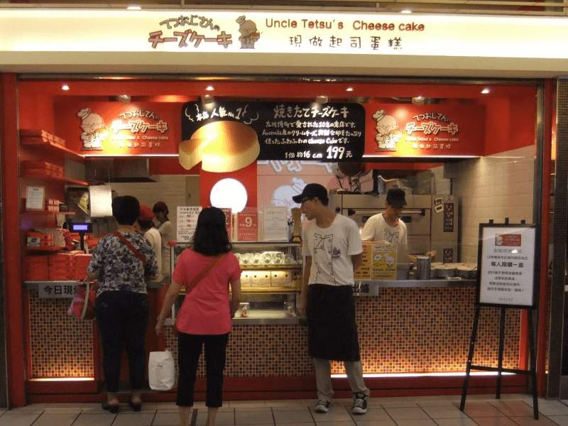

# 【交流互動】2013夏季-台中版聚心得

作者：小劍

TID：14734

<title>1</title> <link href="../Styles/Style.css" type="text/css" rel="stylesheet">

# 1

.
**今年台灣的GN版聚甫於昨日圓滿結束！**

連我在內，到場者五人。雖不若去年多，但都熱情十足。
本次特地離開台北而在台中舉辦，原本希望能釣到傳說中的上古神獸--某隻老虎出來，不過終究事與願違。
看來神獸之所以叫神獸就是因為他不輕易出動呢，好吧！
但至少幫助到一位同好能夠前來參與，這樣辦在台中也算有意義了，而且之後還有意想不到的大收穫。
此事容後再題，待我緩緩道來。

首先必須要提起的是：**某人換不到班真是太幸運了！**
如果照我們原本約好的7月13日舉辦版聚，就會變成冒著12級強陣風出門了。
依照我們五人當中有四個人把出門理由講成是同學會的這點來看，
在颱風天舉辦同學會果然是太過詭異了一點……吧？
幸好延後了一天，剛好避開颱風！
而且辛苦的鐵路局伯伯們也在前一天深夜加班把鐵軌修復，讓我不至於沒車可搭，太感謝他們了…！
在此也特別給台鐵的職員們至上最深敬意！

**參與本次版聚的成員有五人，分別是我、小蚱蜢、克里亞、rock1633與進擊的中文之許。**
原本以為還有別人跟我一樣從台北出發，沒想到原來這裡面是台北人的只有我。
小蚱蜢、rock與阿許都是台中當地人，克里亞則遠從宜蘭繞過半個台灣來赴會！
宜蘭耶！換成是我，大概沒辦法辦到繞過半個台灣的這種長征……單趟車程超過四小時而且得換車。
明年版聚考慮選在山明水秀的台灣東部以方便後山同好～～！

下面開始附帶一些照片。
由於我此行基本是以小旅行的心態出門，所以相機照個不停，若有看起來很囉唆的感覺還請見諒！

**啟程：**
我在早上十點之前抵達台北火車站，東逛西逛直到十點半去搭車。
台北火車站也算是重新裝潢了不少次，很符合國營企業的風格，那就是沒有風格……
總之目前台北車站的大廳與售票處是長成這個樣子：
<ignore_js_op>

**DSCF6332-1.JPG** *(239.15 KB, 下載次數: 0)*

[下載附件](forum.php?mod=attachment&aid=MzUxNDR8Y2MxZWFkNDV8MTY3NDA2ODI5MXwxODIzMHwxNDczNA%3D%3D&nothumb=yes)

2013-7-15 02:15 上傳

順便排隊買了個起司蛋糕，大家有吃到真是太好了，我本來還擔心大家不好意思而不肯吃。
說真的很合我胃口，不愧是十點營業之前就已經有超過十個人在排隊的店家。
我因為離搭車還有段時間所以也去排了。
<ignore_js_op>

**DSCF6340-1.JPG** *(219.14 KB, 下載次數: 0)*

[下載附件](forum.php?mod=attachment&aid=MzUxNDV8ZjVhZjJlYjV8MTY3NDA2ODI5MXwxODIzMHwxNDczNA%3D%3D&nothumb=yes)

2013-7-15 02:15 上傳

買完食物就去搭車了。這次狠下心來搭台鐵最高票價級距的「**自強號**」列車。
其實搭公路客運可以省下約三分之一的車錢，不過我這個隱性鐵宅難得出一次遠門，說什麼都想搭火車看風景。
西部幹線的風景雖然沒有北迴線好，但也是山啊海啊都可以看到。而且颱風剛過的天空是最晴朗了！
真的可以從窗外看見遙遠的層疊山景！（看到忘記照下來還真是抱歉）

不過，回到上車的時刻，在我面前開來的是台鐵自強號當中最破爛的車種。
<ignore_js_op>

**DSCF6362-1.JPG** *(93.02 KB, 下載次數: 0)*

[下載附件](forum.php?mod=attachment&aid=MzUxNDZ8OTMwMTMxNTR8MTY3NDA2ODI5MXwxODIzMHwxNDczNA%3D%3D&nothumb=yes)

2013-7-15 02:16 上傳

......台鐵EMU300型電聯車

說也奇特，現在最新最好的車子都安排去跑北迴線，要在西部幹線搭到那些車根本不可能。
台鐵的策略基本上已經完全放棄西部幹線的高級客群了吧，反正那些人都搭更貴更好的高鐵去了。
但是搭高鐵就沒有傳統坐火車的感動了啊，風景咻咻咻的飛過去是要看什麼？而且幾乎全程都有隔音牆擋著！
我說高鐵就給那些趕時間的商人去搭吧……

旅程上的事情就不多提了，其實也沒什麼有趣的事。
要說的話，就是在經過大甲溪的時候，有注意到溪水非常湍急，而且是泥黑色的。
颱風據說在桃竹苗一帶的山區降下驚人雨量，結果就成了這樣大晴天但是溪水卻大暴漲的狀態。
車子在開過昨夜搶通的路段時也有明顯減速，不過終究還是準時抵達台中火車站。
版聚是約一點整，我的車子12點54分進站，算得是剛剛好！

**聚會：**
步出火車站之後，立刻被小蚱蜢與克里亞攔了下來，他們似乎已經等了半小時了！天哪，真不好意思！
阿許與rock很快也來會合，都是騎機車過來的。
順便說一下，我很後悔沒有把台中火車站的外觀照下來！這可是很有名的建築物啊！（鐵宅上身）

好吧！人都到齊了，自然是立刻就往預定的聚會地點出發！

預定的聚會場地，位在台中非常知名的第一廣場商業大樓，而且離火車站只要步行三分鐘即可到達。
不過這裡也是個非常「特別」的地方。
該怎麼說呢？讓人覺得是東南亞諸國的租界？喔不本來就是胡志強市嘛（笑）
<ignore_js_op>

**DSCF6398-1.JPG** *(249.52 KB, 下載次數: 0)*

[下載附件](forum.php?mod=attachment&aid=MzUxNDd8YWNkMzMzNDR8MTY3NDA2ODI5MXwxODIzMHwxNDczNA%3D%3D&nothumb=yes)

2013-7-15 02:16 上傳

←其實是非常氣派的綜合商業大樓，位置也非常好……

但是，下圖各位能夠看到的路人，有超過八成都來自於東南亞……
↓
<ignore_js_op>

**DSCF6400-1.JPG** *(276.44 KB, 下載次數: 0)*

[下載附件](forum.php?mod=attachment&aid=MzUxNDh8NWU3MWY1ZTN8MTY3NDA2ODI5MXwxODIzMHwxNDczNA%3D%3D&nothumb=yes)

2013-7-15 02:16 上傳

**版聚辦在被外勞包圍的地方真的沒問題嗎？！**

幸好，外勞只有在底下活動。等到我們搭電梯上到11樓的KTV時，總算又看到台灣人的面孔了。
光是要走去搭電梯就得穿過一堆不知越南還是印尼來的勞工兄弟……難怪總有人說女生絕對不能夠單獨來第一廣場。
不過幸好（或者說不幸）本次版聚的五位同好沒有人是女性，嗯……

總之版聚就在一片歡樂又吃吃喝喝的情況下進行了！！
<ignore_js_op>

**DSCF6410-1.JPG** *(106.84 KB, 下載次數: 0)*

[下載附件](forum.php?mod=attachment&aid=MzUxNTN8NWE3MzY5OTJ8MTY3NDA2ODI5MXwxODIzMHwxNDczNA%3D%3D&nothumb=yes)

2013-7-15 02:16 上傳

←大家都躲在鏡頭後面

雖然是KTV但完全沒有人唱歌，包廂關起門就是小眾文化的天下啦！管你有什麼18禁的玩意都直接秀出來！
就隱蔽性來說真的比去年在台北的那次好太多了，以後都直接在KTV舉辦吧！
當初我還以為店員會過來關心一下為啥都沒人點歌什麼的……想太多了！

基本上，聊天的話題都不脫圈內的大小事。對GTS本身的想法倒沒有人提，因為彼此都有一定熟悉度了。
五人當中有四人去年參加過版聚，另一位也參加了很多年的影片團購。
所以話題大概都圍繞著一些八卦或者網路上的奇聞軼事……其實光這樣就足夠聊滿三個小時了。
我也帶了一些禮物過去分發給大家，算是感謝大家來捧場。
禮物的部份沒有刻意去拍，應該說是單純的疏忽還是覺得沒必要呢…？反正拿到的人覺得開心就好了！
我給得也很開心！

除了聊八卦以外，小蚱蜢這次也依然有梗。
儘管沒有帶漫畫來，但是他居然帶了能夠讓大家安心拍照的神器！！
<ignore_js_op>

**DSCF6401-1.JPG** *(85.04 KB, 下載次數: 0)*

[下載附件](forum.php?mod=attachment&aid=MzUxNDl8NDJmZWExMTZ8MTY3NDA2ODI5MXwxODIzMHwxNDczNA%3D%3D&nothumb=yes)

2013-7-15 02:16 上傳

←左邊根本就不是面具！！

說真的，那個面具的眼睛部份太小了啦！會刺到眼睛啦！
要當V怪客原來還得有忍住不眨眼的本事！！

**接著猜猜這哪位？**
<ignore_js_op>

**DSCF6402-1.JPG** *(63.96 KB, 下載次數: 1)*

[下載附件](forum.php?mod=attachment&aid=MzUxNTB8MWY3ZWM5M2Z8MTY3NDA2ODI5MXwxODIzMHwxNDczNA%3D%3D&nothumb=yes)

2013-7-15 02:16 上傳

答案：**小蚱蜢**！
下巴都掉下來了有沒有？！

然後GN過去一年勞苦功高的多拉A夢版主也利用任意門來到了現場！！
<ignore_js_op>

**DSCF6404-1.JPG** *(148.5 KB, 下載次數: 0)*

[下載附件](forum.php?mod=attachment&aid=MzUxNTF8MDQwNWFlMDZ8MTY3NDA2ODI5MXwxODIzMHwxNDczNA%3D%3D&nothumb=yes)

2013-7-15 02:16 上傳

←**A夢版主利用任意門現身會場！**

等等……A夢版主的手上還拿著什麼東西！
口古月！！那是縮小燈！！怎麼不是放大燈呢？！
原來A夢版主早已知道這間包廂有個巨人需要給他進擊一下！
<ignore_js_op>

**DSCF6405-1.JPG** *(122.83 KB, 下載次數: 0)*

[下載附件](forum.php?mod=attachment&aid=MzUxNTJ8NmYwMjVkM2R8MTY3NDA2ODI5MXwxODIzMHwxNDczNA%3D%3D&nothumb=yes)

2013-7-15 02:16 上傳

←調查兵團的新武器，受死吧兩米級巨人！

嘿嘿嘿，縮小成米粒之後扔去給女服務生踩扁吧！
不過這樣的我是否在短暫的一瞬間成為類似GT的存在？為了達成GTS而必須先有GT？
這似乎是一個既科學也哲學的問題！
疲累的我就不忙著探討這中間是否存在邏輯上的謬誤了！

總而言之，包廂內的三小時非常歡樂地度過了！基本上就是恰恰好，不長也不短！
接近尾聲時rock兄也獻了一下歌喉，好強啊！
我本來想找林肯公園的歌來空耳一下結果都找不到！這什麼KTV啊囧
<ignore_js_op>

**DSCF6415-1.JPG** *(65.56 KB, 下載次數: 0)*

[下載附件](forum.php?mod=attachment&aid=MzUxNTR8ZGJiOTg0OTd8MTY3NDA2ODI5MXwxODIzMHwxNDczNA%3D%3D&nothumb=yes)

2013-7-15 02:16 上傳

←版聚尾聲時桌上杯盤狼藉的模樣，喔那個蛋糕就是我帶的

原本以為版聚就這樣平安結束了，沒想到……
小蚱蜢大大邀請我們到他家作客！！！

**插曲：**
老實說哩，其實我過去就時常與小蚱蜢交流漫畫資源，所以我知道他家的住址。
不過當然了，我從來沒有登門造訪的念頭，豈料這次小蚱蜢自己開口邀請了！
很好，那當然不能錯過這個機會！
立刻坐上小蚱蜢的摩托車去虐待他的懸吊系統！（你們知道為啥前面的照片總是沒拍到肚子了吧）
小蚱蜢預備的安全帽還是新買的，這真是太叫人感動了！他為了這天準備多少道具啊！

小蚱蜢家的外觀我就沒拍了，是真的沒拍，這畢竟涉及到隱私問題！
雖然這年頭在台灣只要掌握住址就能夠利用谷歌街景看到房子長怎樣了……咳咳我講太多了！
總之小蚱蜢家是個非常舒適的雅房！機能齊全又乾淨，而且完全被屋主的嗜好所圍繞！
書櫃就不用說，甚至床底下、電視櫃、角落的紙箱裡面，全部都是GTS漫畫書！！！
我的天哪！！！他睡在GTS漫畫的環抱裡！
<ignore_js_op>

**DSCF6420-1.JPG** *(132.1 KB, 下載次數: 0)*

[下載附件](forum.php?mod=attachment&aid=MzUxNTZ8MTMxNzQyN2R8MTY3NDA2ODI5MXwxODIzMHwxNDczNA%3D%3D&nothumb=yes)

2013-7-15 02:17 上傳

←書櫃，目測這裡的藏書只是收藏總量的十分之一左右

小蚱蜢的收藏從最新的到最舊的都有，他相當樸實地從網路蒐集資訊、然後從日文書店訂購回來。
就在我上半年忙到暈頭的時候，他已經收集了很多連我都忍不住想跳坑的好漫畫。
而且這些漫畫毫無疑問還沒有電子檔在網路上流通！
至於懷舊漫畫，有古早到1980年代的盜版出版物，都是小蚱蜢遊遍全台舊書店蒐集回來的。
這已經是可以開博物館的程度了啊……連出版這些漫畫的公司都灰飛煙滅了吧……？
小蚱蜢手上的書不知道有多少甚至是全台灣的最後一本了呢？這真的很難說喔……
而且80年代的漫畫書就連日本方面的情報網站也並不齊全，小蚱蜢因此而很想把他的資訊告知給日方呢。
畢竟這些本來就是來自日本的漫畫書啊。能夠把原版出版品保留下來的話，一定是非常偉大的事。

<ignore_js_op>

**DSCF6421-1.JPG** *(81.65 KB, 下載次數: 1)*

[下載附件](forum.php?mod=attachment&aid=MzUxNTd8ZDZlYWM0ZmR8MTY3NDA2ODI5MXwxODIzMHwxNDczNA%3D%3D&nothumb=yes)

2013-7-15 02:17 上傳

↑
基本上都是今年出版的漫畫書，少部份例外。
這其中伊藤伸平的「まりかセヴン」是我認為值得收實體書的一套作品，戰鬥場面的表現甚至好過超弩級少女。
趕快給我出台版啊混蛋！

雖然，這些書並非都是以GTS為主題的作品，應該也會有人覺得這只是沾邊物，
但是這些老漫畫，確實也代表了日本漫畫的歷史，可以看出巨大化的梗是如何發展的。
至少我們不能否認巨大化與縮小化、都是存在於文創產業的一個相當普遍的梗。
漫畫也好，電影也好，甚至廣告也好，不都很常看見巨大化與縮小化的演出方式嗎？
所以，研究這樣的演出方式從何而來、又是如何被運用的，應該也是個對我們來說值得深思的事吧。

最後，附上一張我個人非常喜歡的插圖。
<ignore_js_op>

**DSCF6416-1.JPG** *(208.05 KB, 下載次數: 3)*

[下載附件](forum.php?mod=attachment&aid=MzUxNTV8NDFiYTVkZGZ8MTY3NDA2ODI5MXwxODIzMHwxNDczNA%3D%3D&nothumb=yes)

2013-7-15 02:16 上傳

↑
這是僅有三頁的超短篇漫畫的最後一頁，也是唯一有GTS的一頁，請不要找我問前兩頁了。
對了，那不是我的手指。

我們在小蚱蜢家大概待了半小時，畢竟也不好打擾太久，見識過神蹟的偉大後就告辭了。
大家應該都震撼到了，此行也有讓我燃起一些蒐集欲望……以後我會多學學小蚱蜢蒐集情報的方式。
說起來，三年前的我也一樣是這麼做的呀……

之後倒是沒有值得分享的事情了，中文之許騎車載克里亞回台中火車站買票回宜蘭，
我自己搭火車回去轉搭公路客運，但有趁中間的時間繞到知名的一中夜市買雞排。
<ignore_js_op>

**DSCF6439-1.JPG** *(77.29 KB, 下載次數: 0)*

[下載附件](forum.php?mod=attachment&aid=MzUxNTl8MWQxYWQyMTR8MTY3NDA2ODI5MXwxODIzMHwxNDczNA%3D%3D&nothumb=yes)

2013-7-15 02:25 上傳

←一中夜市名稱的由來，台中一中是中台灣最頂尖的高中。

非常感謝中文之許充當司機載我跑這一趟，然後又陪我留下來等車！
他是個很Nice的GT！真的！

我也希望大家日後不要就縮小女與GTS的本位主義來浪費口水，這真的沒什麼意義……
不是說因為我受到阿許的盛情款待所以有所偏袒，只是我重新體認到了作人的本質。
一個人在網路上的表現，其實真的與他的本質關聯不大，既然這樣又有什麼好嘴砲的呢……
以後我對於這類的爭端仍然會以**諧和**與**秩序**為主要處理原則，畢竟現在縮小女有自己的論壇了。
不知道有縮小女論壇的人麻煩回到論壇首頁然後把頁面往下拉……
無論如何，楚河漢界是定下了的，誰撈過界就是破壞秩序，我最終都是得被迫處理的。
也請各位明白我做事都是一碼歸一碼的，不會說誰給我好處就偏袒誰。
雖然這種話聽起來很令人嗤之以鼻，但是目前就先這樣吧，我的作法可以接受大家公評。

**總結：**
今年的網聚雖然人少，但是我覺得比去年更加歡樂。離開台北果然是正確的決定。
（去年我還被熟人撞見，混蛋，那真的太扯了，都快十年沒見過那些同學了）

要再一次感謝小蚱蜢願意讓我們登門拜訪，能夠見證這些偉大的收藏物真是太感動了！
也謝謝中文之許費心幫忙找場地，他甚至前一天冒著颱風先去問訂位的事，然後又騎車載大家啪啪走。
完全可以頒發好人卡一張給他了，以後就叫你好巨人吧。
ウホッ！いい巨人……

克里亞遠從宜蘭來赴會，結束時還很辛苦的排客運候補，要我大概就作不到了。非常感謝能來赴會！
rock兄也是特地騎機車趕了很遠的路從隔壁城市過來，早上可是非常曬人的烈日呢，辛苦了！非常感謝！

2013年夏季的GN版聚可說是圓滿落幕了！再一次感謝前來赴會的所有人！
未來應該還會繼續選擇不同的縣市來舉辦版聚哦！
期待各地的同好可以現身！順便帶我玩一玩，嘿嘿～！

<ignore_js_op>

**DSCF6453-1.JPG** *(52.11 KB, 下載次數: 0)*

[下載附件](forum.php?mod=attachment&aid=MzUxNjB8NDg0YTAxZjB8MTY3NDA2ODI5MXwxODIzMHwxNDczNA%3D%3D&nothumb=yes)

2013-7-15 02:32 上傳

←最後附上一張：晚上十一點才抵達家門的我

<title>2</title> <link href="../Styles/Style.css" type="text/css" rel="stylesheet">

# 2

小心鏡子gank阿!
<title>3</title> <link href="../Styles/Style.css" type="text/css" rel="stylesheet">

# 3

.
哈哈，鏡中的影像就當作給各位的福利吧！
（好爛的福利啊……

說起來我人還沒回家，就覺得今天傍晚台鐵有出問題，一看果然！
我從小蚱蜢家離開之後自行搭慢車回台中火車站的那段路真的非常惡夢！
下到台中車站的月台，居然擁擠到幾乎沒辦法通行！
後來才知道前面有車子故障卡住路，導致後面班次無法發車，於是所有班次的旅客都擠在月台上等…
還好我回程決定搭公路客運。

台鐵真的只能誇一半，唉。 <title>4</title> <link href="../Styles/Style.css" type="text/css" rel="stylesheet">

# 4

恭喜本次版聚順利完成...怎麼沒被拉去金X豹阿???
 <title>5</title> <link href="../Styles/Style.css" type="text/css" rel="stylesheet">

# 5

表示有看過某蛋丁真人獸pic的某貓毫無壓力……
PS：不過，如果我真的過去了的話，恐怕身材基本就是盆地的我才是最扯的吧。。。
估計跟某進擊的阿許（請務必允許我如此稱呼）站一起的話，嘛……我基本就是兵長的說。。。當然，人形模式的艾倫也不是不可能- -b <title>6</title> <link href="../Styles/Style.css" type="text/css" rel="stylesheet">

# 6

WOW!!看到大大了!看到鏡子中的倒影~可惜我不能去.....
<title>7</title> <link href="../Styles/Style.css" type="text/css" rel="stylesheet">

# 7

再次意识到了面具是神器。
看过那几张书海图后，表示十分膜拜蚱蜢大大......
叮当这是在卖萌，一定是的！
中文前辈有两米高！？天哪......
另外，蛋大乃被镜子出卖了。 <title>8</title> <link href="../Styles/Style.css" type="text/css" rel="stylesheet">

# 8

雖然久了點.但回程等不到半小時就坐到車了,跟預期的一樣久...3個多小時;司機期間還給我們十多分鐘到休息站休息0.0
話說回來當時最應該要拍的床底下反而漏拍.幾乎算半機關式的設定.說不定還有隱藏機關
看過蚱蜢兄的據點之後.果然這領域我太晚進來了,絕大多數都是沒看過的0.0,就算翻了也要花一段時間才找的到GTS段落,不過翻了很久之後找的到心情的確很有成就感
昨天的網聚時在是無法預想到的多.期待下一次網聚的到來
<title>9</title> <link href="../Styles/Style.css" type="text/css" rel="stylesheet">

# 9

.
樓上辛苦了…！

我也很後悔居然沒拍到那個神奇的床底！蚱蜢兄，那個地方本來是用來放棉被的啊！

每天晚上都睡在一個被自己嗜好包圍的環境裡真是太幸福啦！

--
打字的同時外頭又下大雨了，幸好昨天台中只是短暫下了點小雨。
不過我還是浪費錢去買了把雨傘，嗚，前後也只用到五分鐘而已吧…… <title>10</title> <link href="../Styles/Style.css" type="text/css" rel="stylesheet">

# 10

发现有只女性的手啊！！！！！！！！！！！！ <title>11</title> <link href="../Styles/Style.css" type="text/css" rel="stylesheet">

# 11

1.我勒个去壕！

2.KTV这种地方不点歌基本都是在K药或者滥X或者其乐融融的黑帮交易，一般服务生不敢来的

3.过两年生意稳定了我也要去台湾当背包客！就决定赖在但丁家了！ <title>12</title> <link href="../Styles/Style.css" type="text/css" rel="stylesheet">

# 12

還好我沒去，不然你們會被麥克風吵到無法說話XDD

超愛唱歌(指)

能在包廂真的比較好，去年版聚在公開場合不敢太放肆XDD <title>13</title> <link href="../Styles/Style.css" type="text/css" rel="stylesheet">

# 13

可惜沒去，結果真的有班 <title>14</title> <link href="../Styles/Style.css" type="text/css" rel="stylesheet">

# 14

話說大家也辛苦了~坐火車北下人擠人應該很累
期待下次的聚會，也謝謝但大的禮物
最後感謝聚會成功，讓我又有不同的感覺 <title>15</title> <link href="../Styles/Style.css" type="text/css" rel="stylesheet">

# 15

搜尋了一下，原來是只聞其名未見其圖的[巨大少女名鑑]

不知道有沒有可能集結成冊？ <title>16</title> <link href="../Styles/Style.css" type="text/css" rel="stylesheet">

# 16

但大真人不露相啊 <title>17</title> <link href="../Styles/Style.css" type="text/css" rel="stylesheet">

# 17

好幸福的聚会，大陆人士的悲哀啊！！！ <title>18</title> <link href="../Styles/Style.css" type="text/css" rel="stylesheet">

# 18

.
嘛，事後還是有人唱了五月天的歌啦！
在這之前我還很白目的點了江南Style當背景音樂！（放給誰聽啊！）

話說原來小虎有打算想來嗎？真是抱歉…其實我們也可以改改時間的。
希望下次還有機會了！

--
下週六FF22幫忙擺攤對我來說又是要與同好們見面，正在期待中！ <title>19</title> <link href="../Styles/Style.css" type="text/css" rel="stylesheet">

# 19

下次我也要去，寧願翹班也要去

風雨無阻也要去，丟了工作也要去....(誤) <title>20</title> <link href="../Styles/Style.css" type="text/css" rel="stylesheet">

# 20

好羞射，为何如此光明正大~</ignore_js_op></ignore_js_op></ignore_js_op></ignore_js_op></ignore_js_op></ignore_js_op></ignore_js_op></ignore_js_op></ignore_js_op></ignore_js_op></ignore_js_op></ignore_js_op></ignore_js_op></ignore_js_op></ignore_js_op></ignore_js_op>