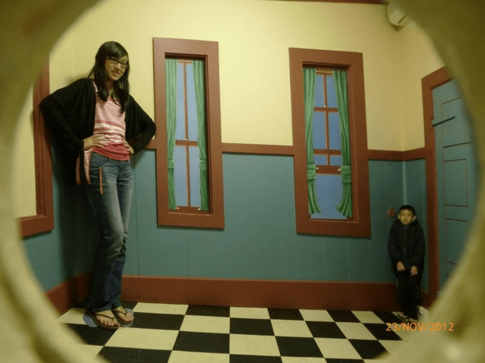
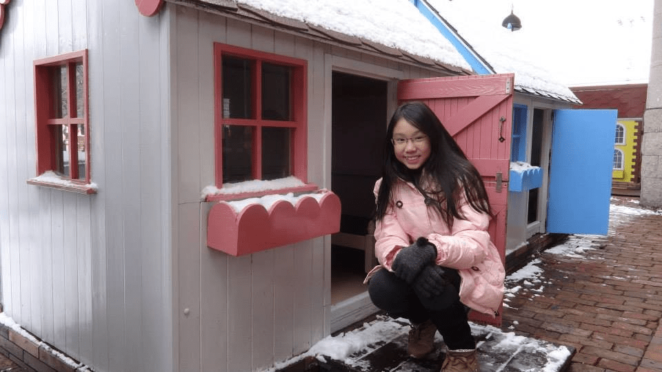
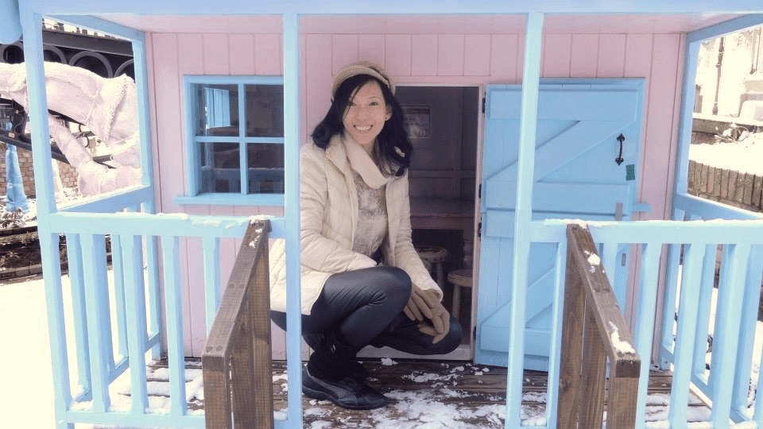

# 【代发】【LKW】不务正业系列

作者：快看

TID：15822

<title>1</title> <link href="../Styles/Style.css" type="text/css" rel="stylesheet">

# 1

*本帖最後由 shendanxiaogui 於 2014-4-11 02:21 編輯*

LKW(查看请付费)  19:07:54
我什麽時候說是合成的了。。。
LKW(给我红利点)  19:08:07
不過是我拍的
(╯‵□′)╯︵┻━┻

(￣y▽￣)不务正业的文章作者系列。。。要弄也给文章顺便配点图啊。。。算了，发上来(给我)赚红利也行。。。
<ignore_js_op>

**QQ图片20131223212624.jpg** *(83.3 KB, 下載次數: 9)*

[下載附件](forum.php?mod=attachment&aid=Mzg4MjJ8NmNiMjY4MWV8MTY3NDA3MjI1N3wxODIzMHwxNTgyMg%3D%3D&nothumb=yes)

2013-12-23 21:31 上傳

----
<ignore_js_op>

**QQ图片20131223212630.jpg** *(86.14 KB, 下載次數: 3)*

[下載附件](forum.php?mod=attachment&aid=Mzg4MjN8NjhiNGI1NmR8MTY3NDA3MjI1N3wxODIzMHwxNTgyMg%3D%3D&nothumb=yes)

2013-12-23 21:31 上傳

----
<ignore_js_op>

**QQ图片20131223212633.jpg** *(95.89 KB, 下載次數: 3)*

[下載附件](forum.php?mod=attachment&aid=Mzg4MjF8ZjBlZDRiZDJ8MTY3NDA3MjI1N3wxODIzMHwxNTgyMg%3D%3D&nothumb=yes)

2013-12-23 21:27 上傳

<title>2</title> <link href="../Styles/Style.css" type="text/css" rel="stylesheet">

# 2

你才不务正业。
第三张呢? <title>3</title> <link href="../Styles/Style.css" type="text/css" rel="stylesheet">

# 3

.
等一下，這些顯然都不是合成吧？只是視覺錯覺與縮小比例的木屋而已。

可能放在最底下的真實生活體驗版會更加妥當哦！ <title>4</title> <link href="../Styles/Style.css" type="text/css" rel="stylesheet">

# 4

看着好有感觉，真像个女巨人了。能问下这是什么地方么？ <title>5</title> <link href="../Styles/Style.css" type="text/css" rel="stylesheet">

# 5

> hy5164180 發表於 2013-12-24 16:50 
> 看着好有感觉，真像个女巨人了。能问下这是什么地方么？

第一张是澳大利亚黄金海岸的一处景点，具体叫什么我已经不记得了
第二和第三张是在日本北海道Sapporro的小人城
<title>6</title> <link href="../Styles/Style.css" type="text/css" rel="stylesheet">

# 6

喜欢第一张的感觉 <title>7</title> <link href="../Styles/Style.css" type="text/css" rel="stylesheet">

# 7

比较喜欢第二张~ <title>8</title> <link href="../Styles/Style.css" type="text/css" rel="stylesheet">

# 8

哈，顶！ <title>9</title> <link href="../Styles/Style.css" type="text/css" rel="stylesheet">

# 9

这是什么地方 <title>10</title> <link href="../Styles/Style.css" type="text/css" rel="stylesheet">

# 10

请问使用什么电脑技术处理的 <title>11</title> <link href="../Styles/Style.css" type="text/css" rel="stylesheet">

# 11

比较喜欢第1张
<title>12</title> <link href="../Styles/Style.css" type="text/css" rel="stylesheet">

# 12

这全是模型吧！那个小孩也是模型吧。 <title>13</title> <link href="../Styles/Style.css" type="text/css" rel="stylesheet">

# 13

22 <title>14</title> <link href="../Styles/Style.css" type="text/css" rel="stylesheet">

# 14

> [s-man 發表於 2014-3-20 22:15](https://giantessnight.cf/gnforum2012/forum.php?mod=redirect&goto=findpost&pid=218484&ptid=15822)
> 这全是模型吧！那个小孩也是模型吧。

小孩那个还真不是模型。。。(´・ω・｀)虽然不知道它是怎么弄的，但不外乎两种办法。
1、玻璃弄成左小右大，然后建筑稍微配合着造下
2、建筑弄成左小右大，而且左近右远，然后在适当的位置弄个玻璃限制下视野。
<title>15</title> <link href="../Styles/Style.css" type="text/css" rel="stylesheet">

# 15

小孩的玩具？ <title>16</title> <link href="../Styles/Style.css" type="text/css" rel="stylesheet">

# 16

长知识了。。。。 <title>17</title> <link href="../Styles/Style.css" type="text/css" rel="stylesheet">

# 17

有意思，我曾经也在某个大型游乐场玩过 <title>18</title> <link href="../Styles/Style.css" type="text/css" rel="stylesheet">

# 18

房子是模型，小孩那个应该是那个洞的镜面问题 <title>19</title> <link href="../Styles/Style.css" type="text/css" rel="stylesheet">

# 19

毫无PS痕迹 <title>20</title> <link href="../Styles/Style.css" type="text/css" rel="stylesheet">

# 20

trick and mini <title>21</title> <link href="../Styles/Style.css" type="text/css" rel="stylesheet">

# 21

呃呃呃呃呃呃呃呃呃呃呃呃呃呃呃呃呃呃呃呃呃呃呃呃呃呃呃呃呃呃呃呃呃呃呃呃
<title>22</title> <link href="../Styles/Style.css" type="text/css" rel="stylesheet">

# 22

顶一个！ <title>23</title> <link href="../Styles/Style.css" type="text/css" rel="stylesheet">

# 23

求解   这是什么地方 <title>24</title> <link href="../Styles/Style.css" type="text/css" rel="stylesheet">

# 24

不错不错  就是女人长得不够漂亮 <title>25</title> <link href="../Styles/Style.css" type="text/css" rel="stylesheet">

# 25

大神，这你都能认出来在那里，膜拜，请收下我的膝盖把。 <title>26</title> <link href="../Styles/Style.css" type="text/css" rel="stylesheet">

# 26

这三张都很喜欢啊，同时这个地方也挺喜欢的 <title>27</title> <link href="../Styles/Style.css" type="text/css" rel="stylesheet">

# 27

眼睛看会有错觉但相机为什么会有？ <title>28</title> <link href="../Styles/Style.css" type="text/css" rel="stylesheet">

# 28

见过第一张的原型，不过记不清楚了 <title>29</title> <link href="../Styles/Style.css" type="text/css" rel="stylesheet">

# 29

很棒啊！这里是什么地方？ <title>30</title> <link href="../Styles/Style.css" type="text/css" rel="stylesheet">

# 30

感觉房子好迷你啊……的确有点感觉…… <title>31</title> <link href="../Styles/Style.css" type="text/css" rel="stylesheet">

# 31

不过这是哪里啊……给小孩子玩的地方吗…… <title>32</title> <link href="../Styles/Style.css" type="text/css" rel="stylesheet">

# 32

这种地方……感觉还可以啊，太远 <title>33</title> <link href="../Styles/Style.css" type="text/css" rel="stylesheet">

# 33

不错不错的美女啊啊啊啊 <title>34</title> <link href="../Styles/Style.css" type="text/css" rel="stylesheet">

# 34

看起来不错的哈.......... <title>35</title> <link href="../Styles/Style.css" type="text/css" rel="stylesheet">

# 35

喜欢第二张。。。？？？ <title>36</title> <link href="../Styles/Style.css" type="text/css" rel="stylesheet">

# 36

第三张把人拍的很好！ <title>37</title> <link href="../Styles/Style.css" type="text/css" rel="stylesheet">

# 37

好像很好玩 这是什么地方啊? <title>38</title> <link href="../Styles/Style.css" type="text/css" rel="stylesheet">

# 38

今天再顶一顶 <title>39</title> <link href="../Styles/Style.css" type="text/css" rel="stylesheet">

# 39

我好像也去过第一张的地方 <title>40</title> <link href="../Styles/Style.css" type="text/css" rel="stylesheet">

# 40

第三张图的女主角好美呀 <title>41</title> <link href="../Styles/Style.css" type="text/css" rel="stylesheet">

# 41

第二章不错啊~~~~~~~~~~~~ <title>42</title> <link href="../Styles/Style.css" type="text/css" rel="stylesheet">

# 42

挺有感觉的，感觉像科技馆 <title>43</title> <link href="../Styles/Style.css" type="text/css" rel="stylesheet">

# 43

我觉得在现实中建一座小人城让人们拍照参观什么的还是挺残忍的 <title>44</title> <link href="../Styles/Style.css" type="text/css" rel="stylesheet">

# 44

感觉很不错的样子，顶楼主哈哈哈
<title>45</title> <link href="../Styles/Style.css" type="text/css" rel="stylesheet">

# 45

这个不错啊，好真实，，， <title>46</title> <link href="../Styles/Style.css" type="text/css" rel="stylesheet">

# 46

长知识了，太赞了。。。。 <title>47</title> <link href="../Styles/Style.css" type="text/css" rel="stylesheet">

# 47

还有这等技术，我想学习，楼主可否教导 <title>48</title> <link href="../Styles/Style.css" type="text/css" rel="stylesheet">

# 48

喜欢第一张！挺有意思的 <title>49</title> <link href="../Styles/Style.css" type="text/css" rel="stylesheet">

# 49

有意思 <title>50</title> <link href="../Styles/Style.css" type="text/css" rel="stylesheet">

# 50

3D体验馆吗？我也好想去的 <title>51</title> <link href="../Styles/Style.css" type="text/css" rel="stylesheet">

# 51

第一张看起来好别扭（其他看起来都挺好的，虽然巨大化不是我的肉） <title>52</title> <link href="../Styles/Style.css" type="text/css" rel="stylesheet">

# 52

第一个记得好像央视有个节目有过解说，有些地方也有玩的...总之有了女朋友一定要拍一组照片，一定 <title>53</title> <link href="../Styles/Style.css" type="text/css" rel="stylesheet">

# 53

厉害了我的天，，，不过，很多儿童区的一些建筑真的只有大腿的高度，哈哈哈 <title>54</title> <link href="../Styles/Style.css" type="text/css" rel="stylesheet">

# 54

这种设施我只在科技馆见过，不过脑补力足够强大，一切都不是问题。 <title>55</title> <link href="../Styles/Style.css" type="text/css" rel="stylesheet">

# 55

一直都搞不明白第一张那种视角是怎么拍摄的 <title>56</title> <link href="../Styles/Style.css" type="text/css" rel="stylesheet">

# 56

好喜欢这种风格~我也想这么拍 <title>57</title> <link href="../Styles/Style.css" type="text/css" rel="stylesheet">

# 57

第一张应该叫“ames房间”
度娘百科有“艾姆斯房间” <title>58</title> <link href="../Styles/Style.css" type="text/css" rel="stylesheet">

# 58

喜欢这样的，楼主继续啊
<title>59</title> <link href="../Styles/Style.css" type="text/css" rel="stylesheet">

# 59

顶下，还有不务正业啊 <title>60</title> <link href="../Styles/Style.css" type="text/css" rel="stylesheet">

# 60

是错觉还是....?总之不务正业! <title>61</title> <link href="../Styles/Style.css" type="text/css" rel="stylesheet">

# 61

不务正业系列是什么意思 <title>62</title> <link href="../Styles/Style.css" type="text/css" rel="stylesheet">

# 62

喜欢第一张，给人的感觉特别真实 <title>63</title> <link href="../Styles/Style.css" type="text/css" rel="stylesheet">

# 63

不是处理的吧，拍的很棒。。。 <title>64</title> <link href="../Styles/Style.css" type="text/css" rel="stylesheet">

# 64

看着还有那么回事啊，哈哈 <title>65</title> <link href="../Styles/Style.css" type="text/css" rel="stylesheet">

# 65

长得都不错，很有代入感
<title>66</title> <link href="../Styles/Style.css" type="text/css" rel="stylesheet">

# 66

这是视错觉还是电脑做的还是做的小房子...</ignore_js_op></ignore_js_op></ignore_js_op>