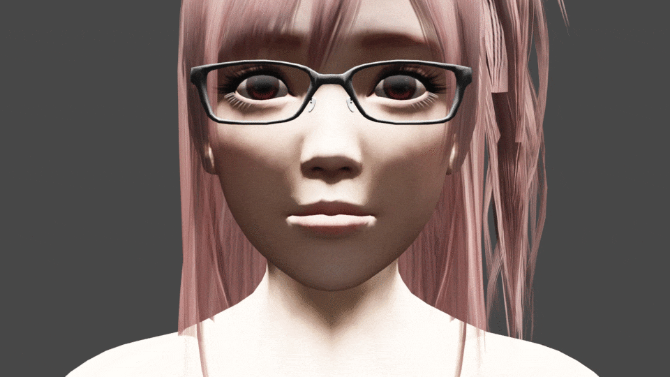
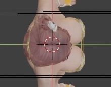
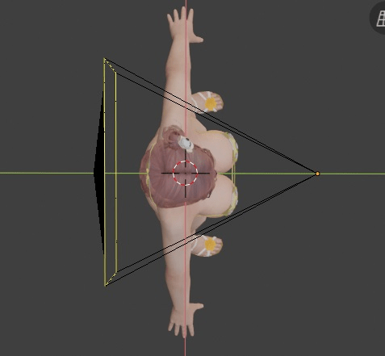
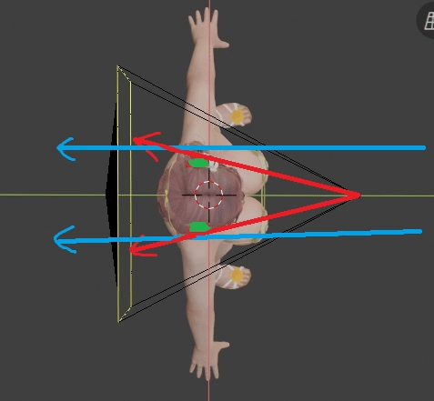
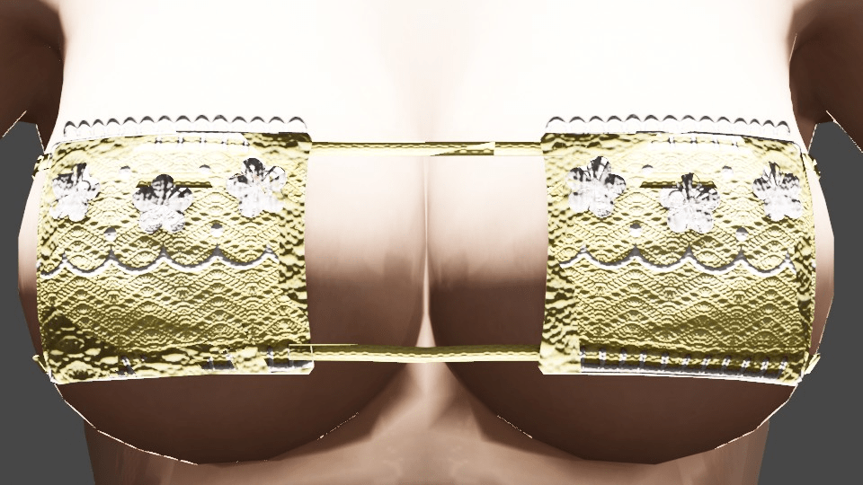
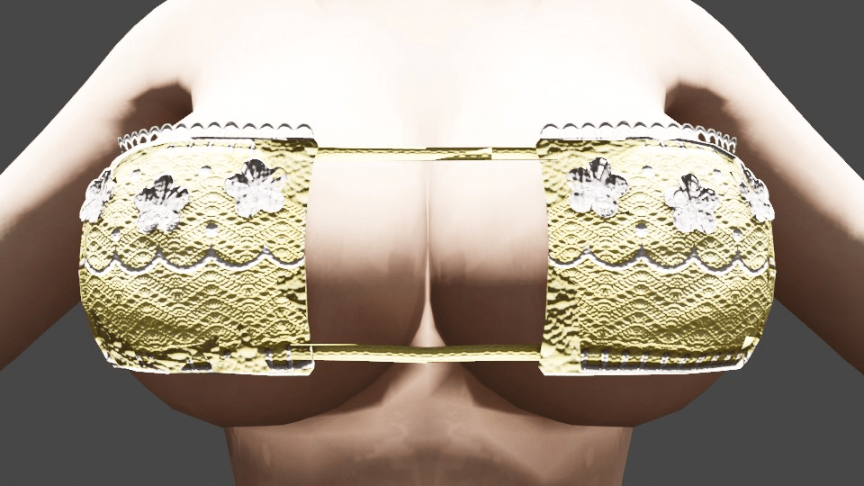
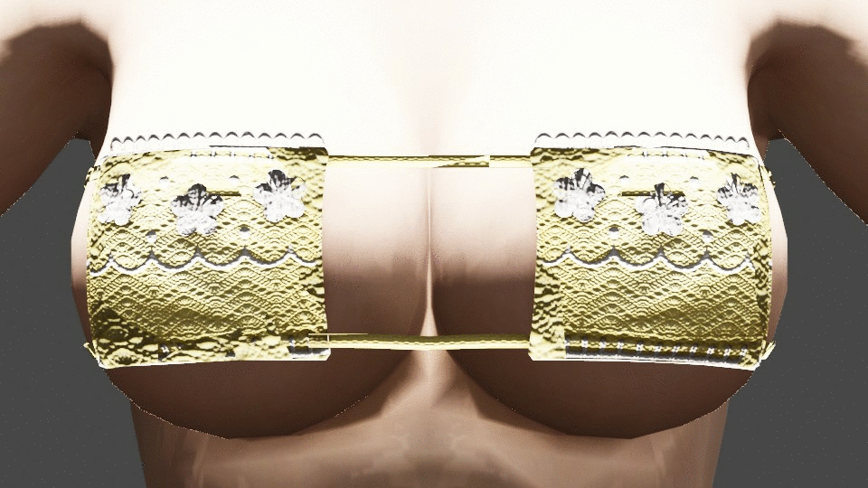

# [作圖] 構圖時容易忽略的：攝影機位置的影響

作者：3213213210

TID：26666

<title>1</title> <link href="../Styles/Style.css" type="text/css" rel="stylesheet">

# 1

*本帖最後由 3213213210 於 2019-4-4 09:23 編輯*

今天來講點透視法的細節
這個問題，**做3D的人常常忘記，畫2D的人則完全不知道這件事**
這很難用文字說明，所以我直接用圖講解比較快

現在，請先閉上眼睛想像：
我跟一個女生處在一個大空地裡，我拿著一個相機
我先到離她**100公尺**遠的地方，把她的頭放在畫面正中央，拍了一張照
然後我再走到離她**50公分**的地方，在**頭的位置和畫面占比不變**的情況下，重新拍了一張照

請問這兩張照片會有**差別**嗎?

答案很明顯，有，不然我發文幹嘛
而差在哪呢，我用Blender做了個Gif*來說明
<ignore_js_op>

**0098 (1) (2) (1).gif** *(5.48 MB, 下載次數: 0)*

[下載附件](forum.php?mod=attachment&aid=Nzc2MzN8ZDJiZGIyZmF8MTY3NDA2OTY0M3wxODIzMHwyNjY2Ng%3D%3D&nothumb=yes)

2019-4-3 17:44 上傳

如圖所見，她的耳朵、脖子和頭髮都變得比本來**窄**
而眼睛與眉毛變得更開、鼻子與嘴巴變得更**凸**了，這是為什麼?

這就要從人物的空拍圖來講解
這是第一幀時的攝影機視線：
<ignore_js_op>

**1.jpg** *(9.99 KB, 下載次數: 0)*

[下載附件](forum.php?mod=attachment&aid=Nzc2MzR8NjE0ZTM2OGF8MTY3NDA2OTY0M3wxODIzMHwyNjY2Ng%3D%3D&nothumb=yes)

2019-4-3 17:52 上傳

由於攝影機擺放在相當遙遠的位置，因此必須用非常長的鏡頭，用**近乎平行的方式**捕捉**正面所有細節**
而在最後一幀時，攝影機擺近看起來則像這樣：
<ignore_js_op>

**2.jpg** *(25.55 KB, 下載次數: 0)*

[下載附件](forum.php?mod=attachment&aid=Nzc2MzV8N2ZmZTkzOTF8MTY3NDA2OTY0M3wxODIzMHwyNjY2Ng%3D%3D&nothumb=yes)

2019-4-3 17:52 上傳

如果看到這個視線圖還無法理解差別，請再看一遍Gif，並且試著思考：

**為什麼一開始能清楚看到的耳朵，在最後會被臉遮住?**

這就是為什麼：
<ignore_js_op>

**3.jpg** *(31.2 KB, 下載次數: 0)*

[下載附件](forum.php?mod=attachment&aid=Nzc2MzZ8YjcxNmY2ZTJ8MTY3NDA2OTY0M3wxODIzMHwyNjY2Ng%3D%3D&nothumb=yes)

2019-4-3 18:00 上傳

**綠色**代表耳朵，大家可以看到，**藍色**的平行線可以很輕易的將雙耳**容納**進來
但**紅色**的夾角越大，越容易被臉頰**遮蔽**到後面的物件

這種擺放方法最重要的是對背景的影響，因為**「攝影機能看到多少背景」**就取決在這邊
這也就是為什麼很多圖明明有**不協調感**，可是哪裡都**看不出問題**
常常就是因為作者把**不同距離、不同方法拍出來****的東西**給**塞在同一個畫面**裡
當然，拿不同透視放到同一張圖裡也是很常見的表現手法，不過大部分的情況是根本不知道自己在幹什麼
(我可以抓出很確切的圖當例子......不過給人留點面子吧)

總之我要說的是，3D製作時要**留意攝影機擺放位置**，擺太遠會**壓縮空間**感，擺太近畫面會**扭曲**，全部中庸又會很無聊
而2D製作呢，如果要玩花俏手法，真的不要太信任自己的透視技能，去學點3D自己做參考圖吧

最後附上一個貼近的奶子：
**遠**：
<ignore_js_op>

**0001.jpg** *(127.44 KB, 下載次數: 0)*

[下載附件](forum.php?mod=attachment&aid=Nzc2Mzd8ZjZiOGRlOTl8MTY3NDA2OTY0M3wxODIzMHwyNjY2Ng%3D%3D&nothumb=yes)

2019-4-3 18:24 上傳

**近**：
<ignore_js_op>

**0100.jpg** *(109.07 KB, 下載次數: 0)*

[下載附件](forum.php?mod=attachment&aid=Nzc2Mzh8OTQwNDUzY2F8MTY3NDA2OTY0M3wxODIzMHwyNjY2Ng%3D%3D&nothumb=yes)

2019-4-3 18:24 上傳

**動畫**：
<ignore_js_op>

**0046 (1).gif** *(3.98 MB, 下載次數: 0)*

[下載附件](forum.php?mod=attachment&aid=Nzc2Mzl8NDM4NGY4YWF8MTY3NDA2OTY0M3wxODIzMHwyNjY2Ng%3D%3D&nothumb=yes)

2019-4-3 18:25 上傳

她的胸部實際上沒有變大喔，而且她本人動都沒動，還是有種撞上來的感覺對吧
這樣有對攝影機擺放有興趣了嗎?

*註：這種前後移動攝影機位置、同時變焦的手法叫Dolly Zoom(滑動變焦)
動態性並不是我的重點，這只是代出我的重點的有效手法而已，
不過如果對這個手法有興趣的話，可以參考看看Now You See It的講解：
[https://youtu.be/u5JBlwlnJX0](https://youtu.be/u5JBlwlnJX0)

<title>2</title> <link href="../Styles/Style.css" type="text/css" rel="stylesheet">

# 2

*本帖最後由 tony12345678 於 2019-4-4 03:06 編輯*

這個主要應該是焦距以及視角的問題，
而且正常來講，一台普通的攝影機應該是沒辦法把 100 公尺遠的人臉細節拍這麼清楚。

假設要讓一個物體與攝影機在各個間距下，在拍出來的畫面中所佔的比例差不多的話。
當攝影機與物體逐漸拉遠時，必須要將焦距拉遠並把視角變窄；
反之，當攝影機與物體逐漸變近時，則是要把焦距拉近並把視角變寬。

另外，除非是希望觀眾能感受到強烈壓迫感或開放感，
不然畫一張圖建議直接使用正常視角下的透視就行了，
畢竟大多數圖片不是不管焦距，讓所有物體都很清晰；就是前景背景所有物體景深效果都一樣。
這時人類視覺只能透過經驗法則，加減判斷攝影機以及各個物體彼此間的大略間距。

畢竟如果對特效理論這塊不熟，看到一個新特效感覺很炫炮就直接用下去，
不僅觀眾跟創作者的感知可能天差地遠，更可能會弄出一個很反人類視覺的成果出來。

<title>3</title> <link href="../Styles/Style.css" type="text/css" rel="stylesheet">

# 3

> [tony12345678 發表於 2019-4-4 03:02](https://giantessnight.cf/gnforum2012/forum.php?mod=redirect&goto=findpost&pid=401803&ptid=26666)
> 這個主要應該是焦距以及視角的問題，
> 而且正常來講，一台普通的攝影機應該是沒辦法把 100 公尺遠的人臉細節 ...

沒錯，所以我才強調「動態感不是我的重點」，這張圖花最多時間的地方就是把鏡頭長度調成可以剛好「動態」容納頭部

實際算動畫出來我也發現「100公尺」其實超沒意義的，我應該放30公尺然後放慢推進速度就好……
不過推進感不是重點，我的重點在於，「其實人體的結構感在不同距離下有很大的差距」
而下個影響最大的，我沒做出圖來的，「背景」，則非常容易被忽略
因為很多人用非常貼近的手法繪製人體，卻用長鏡頭來繪製背景
或者明明整張圖都想表現貼近感，雙耳還是同時被畫了進來……

這不是特效，這是基本構圖的認知，我相信對想強調存在感的尺寸癖來講特別重要
然後，基本上我想說的是，大家快去下載Blender吧
<title>4</title> <link href="../Styles/Style.css" type="text/css" rel="stylesheet">

# 4

......我應該沒有講得太容易誤會吧 我的標題應該很清楚啊
保險起見 我還是把重點重標一次好了 <title>5</title> <link href="../Styles/Style.css" type="text/css" rel="stylesheet">

# 5

雖然我不會作圖，但曾經也看過其他前輩發過文提點。

其實一些POV低視角的巨大娘全身3D模型照，也不是拍一張就搞定，而是在不同位置排好幾張合成起來才搞定。
日本的Jukeman曾經有發過圖文，解釋他怎樣讓巨大娘從腳底板到臉蛋都渲染、擷取的好看，而且呈現在一張圖中。

此外，除了對焦，鏡頭廣角或變形程度，打光也是要考慮的 <title>6</title> <link href="../Styles/Style.css" type="text/css" rel="stylesheet">

# 6

> [Lastato 發表於 2019-4-4 09:58](https://giantessnight.cf/gnforum2012/forum.php?mod=redirect&goto=findpost&pid=401812&ptid=26666)
> 雖然我不會作圖，但曾經也看過其他前輩發過文提點。
> 
> 其實一些POV低視角的巨大娘全身3D模型照，也不是拍一 ...

是啊，攝影有太多能玩的東西了，我只用了「距離」和「鏡長」兩個要素而已

而燈光，我還沒找到有什麼尺寸癖好特別該學的東西，如果有那天再發文吧
<title>7</title> <link href="../Styles/Style.css" type="text/css" rel="stylesheet">

# 7

*本帖最後由 tony12345678 於 2019-4-4 16:12 編輯*

只用過 unity 沒碰過 blender，
不過照你描述調整鏡長可以改變視野，那麼這一項應該也會一併動到視角。

如果在固定鏡長下，只調整物體與攝影機距離，
則物體成像除了變大變小外，並不會產生壓迫感或是奇怪的扭曲，
而當物體與攝影機距離夠近下，在距離不變鏡長改變時，
其實也可以產生出壓迫感出來（不過要先有個背景）。

剛剛才發現論壇會自動轉繁體，難怪「只要」的「只」不管怎麼改，在繁體下都是錯字…… <title>8</title> <link href="../Styles/Style.css" type="text/css" rel="stylesheet">

# 8

要光影特效的話可以找找 photographic lighting 的相關概論，
這對全彩單張圖片的影響還挺大的。</ignore_js_op></ignore_js_op></ignore_js_op></ignore_js_op></ignore_js_op></ignore_js_op></ignore_js_op>