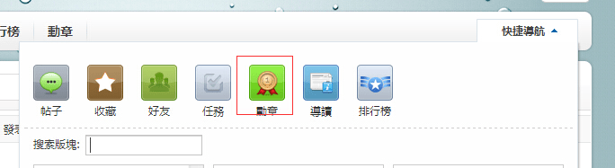
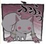

# 【公告】漫画区徽章可以用Ducat购买了！

作者：帝寰宇

TID：18156

<title>1</title> <link href="../Styles/Style.css" type="text/css" rel="stylesheet">

# 1

    繁体用户请点击上面简转繁功能以便查看。
**不要老问我为什么买徽章后进不了漫画区这种日经问题了，请各位看官们瞪大你的眼睛看看帖子最下方几行大字！难道不把字体大小设置为Max你们就会选择性忽视了吗？**

**从现在开始（2014/11/25 0:00），漫画区徽章将不再需要奖励点购买，回归常态使用论坛积分**。

    普通会员以上可购买，价格为 1000Ducat/30天；
    奖励点制度将继续存在，虽然奖励点不再用于购买漫画区徽章，但现在可以直接用于兑换Ducat、提升总积等用途

    奖励点兑换Ducat比例为1：40；

    **允许漫画区主题收费，但必须严格按照以下规则发帖，违者取消收费并登记违规记录**：
    1.收费＜＝10；
    2.标题必须包含漫画名称，资源必须附带公开的预览图（可以用free代码，也可以在2楼发预览）。

    虽然允许收费，但原则上还是鼓励大家不收，收费的资源管理人员不会给予奖励点；
    最大收益为5000Ducat，收费期限默认为30天，到期自动解除。

    大致上就这些，希望大家玩（撸）的愉快！

    P.S:
    1.徽章购买办法，看下图，点进去找到漫画区徽章购买就可以了；
<ignore_js_op></ignore_js_op> **20141124235534.jpg** *(85.89 KB, 下載次數: 0)*

[下載附件](forum.php?mod=attachment&aid=NDg2MDl8MGZhNmE1Njl8MTY3NDA2NjQ3MHwxODIzMHwxODE1Ng%3D%3D&nothumb=yes)

2014-11-24 23:57 上傳 
    2.**漫画区需要普通会员以上才能进入**，而普通会员的积分等级是2000，徽章价格是1000，所以假如你的帐号在没有奖励点、也没有精华的情况下，**建议你的总积分要在3000以上**，如果不足3000那么你在买徽章的一瞬间就会降回初级会员，无法进入漫画区，白白浪费天数了；
    3.奖励点兑换积分办法：论坛右上角点击自己的积分，里面就有兑换功能；
4.**请尊重发帖人的意愿**，比如漫画区内的老朋友小蚱蜢，他所有自行扫描的资源都标明**禁止转载**，本论坛立场上完全保护他这一要求，如发现有本论坛会员未经同意擅自转载，经查证直接封IP处理。 

<title>2</title> <link href="../Styles/Style.css" type="text/css" rel="stylesheet">

# 2

如果在晚10天買漫畫狂勳章就能收價差了
話說之前就買的漫畫狂勳章時效依然維持180天嗎? <title>3</title> <link href="../Styles/Style.css" type="text/css" rel="stylesheet">

# 3

何等超值！⊙_⊙对吾人简直天大喜讯！感谢领导！ <title>4</title> <link href="../Styles/Style.css" type="text/css" rel="stylesheet">

# 4

这样子的话进入漫画区就容易多了 <title>5</title> <link href="../Styles/Style.css" type="text/css" rel="stylesheet">

# 5

这样子就好了很多。。。 <title>6</title> <link href="../Styles/Style.css" type="text/css" rel="stylesheet">

# 6

比較希望能維持之前的收費制度，
雖然目前看來成效不彰.. <title>7</title> <link href="../Styles/Style.css" type="text/css" rel="stylesheet">

# 7

好福利，点赞！（其实我更希望能免费进区 但是想下载则需要购买勋章 <title>8</title> <link href="../Styles/Style.css" type="text/css" rel="stylesheet">

# 8

终于能用Ducat了。。换点试试~ <title>9</title> <link href="../Styles/Style.css" type="text/css" rel="stylesheet">

# 9

太棒了..獎勵點真是夠難湊的說
開放可以用ducat進漫畫區真好>.< <title>10</title> <link href="../Styles/Style.css" type="text/css" rel="stylesheet">

# 10

可用ducat替代獎勵點壓力著實小了些.
對於銀河價格下修多少感到有點違和(雖說差半個月)
私心想說一句...能不能買貴退兩倍差價呢

<title>11</title> <link href="../Styles/Style.css" type="text/css" rel="stylesheet">

# 11

话说银河区到底有什么阿 <title>12</title> <link href="../Styles/Style.css" type="text/css" rel="stylesheet">

# 12

卧槽，，，这政策。。怎么来的这么突然=。= <title>13</title> <link href="../Styles/Style.css" type="text/css" rel="stylesheet">

# 13

我还是比较喜欢之前的奖励点，毕竟虽然效用不多，但毕竟还是有吧？ <title>14</title> <link href="../Styles/Style.css" type="text/css" rel="stylesheet">

# 14

这个措施真不错啊，还有，我刚买了漫画狂勋章不到半个月？我再去看下 <title>15</title> <link href="../Styles/Style.css" type="text/css" rel="stylesheet">

# 15

終於能進去了
實在為德政 <title>16</title> <link href="../Styles/Style.css" type="text/css" rel="stylesheet">

# 16

1000点对高级会员是没有什么影响的，对低级会员比较艰难。不过这总比以前更好了。 <title>17</title> <link href="../Styles/Style.css" type="text/css" rel="stylesheet">

# 17

一看到这个好消息我就果断买了 <title>18</title> <link href="../Styles/Style.css" type="text/css" rel="stylesheet">

# 18

这个政策的话对我这种习惯潜水的人还是比较好的.
本来打算把漫画区养个一年多把自己的30奖励点扔出去的,现在nice啊 <title>19</title> <link href="../Styles/Style.css" type="text/css" rel="stylesheet">

# 19

从今以后好好发帖，努力做人，感谢新的制度～谢谢～ <title>20</title> <link href="../Styles/Style.css" type="text/css" rel="stylesheet">

# 20

*本帖最後由 克里亞 於 2014-11-25 15:50 編輯*

銀河証的話是11月初買的(也是先進漫畫區發資源才有獎勵點能買銀河)
如果是倒過來先買銀河再買漫畫我就沒辦法了 <ignore_js_op>

**2.JPG** *(2.62 KB, 下載次數: 0)*

[下載附件](forum.php?mod=attachment&aid=NDg2MTZ8ZmM5NjdlYmF8MTY3NDA2NjQ4NnwxODIzMHwxODE1Ng%3D%3D&nothumb=yes)

2014-11-25 15:28 上傳

退的話退50就好.畢竟銀河是獎勵點100變50而不是變Ducat <ignore_js_op>

**1.JPG** *(2.72 KB, 下載次數: 0)*

[下載附件](forum.php?mod=attachment&aid=NDg2MTd8MzdjMTcwMjZ8MTY3NDA2NjQ4NnwxODIzMHwxODE1Ng%3D%3D&nothumb=yes)

2014-11-25 15:28 上傳

退100才是真的2倍差價 <ignore_js_op>

**1.JPG** *(2.71 KB, 下載次數: 0)*

[下載附件](forum.php?mod=attachment&aid=NDg2MTh8ODY1MTRkZDd8MTY3NDA2NjQ4NnwxODIzMHwxODE1Ng%3D%3D&nothumb=yes)

2014-11-25 15:49 上傳

感謝十八大摟～

<title>21</title> <link href="../Styles/Style.css" type="text/css" rel="stylesheet">

# 21

改的好，正好有50点，够乘车的 <title>22</title> <link href="../Styles/Style.css" type="text/css" rel="stylesheet">

# 22

1000
30天
很好
一點也不貴啊 <title>23</title> <link href="../Styles/Style.css" type="text/css" rel="stylesheet">

# 23

換換看 終於能用了

馬上來試試 <title>24</title> <link href="../Styles/Style.css" type="text/css" rel="stylesheet">

# 24

漫画狂徽章缩水了，变30天
大概砍了我两个月。。。。。。 <title>25</title> <link href="../Styles/Style.css" type="text/css" rel="stylesheet">

# 25

这算是对大家的巨大的福利了。。。简直是个巨大的喜讯啊 <title>26</title> <link href="../Styles/Style.css" type="text/css" rel="stylesheet">

# 26

這是一大福利阿...感恩 感恩 <title>27</title> <link href="../Styles/Style.css" type="text/css" rel="stylesheet">

# 27

Ducat1000點還是很多啊...潛水黨無人權...
<title>28</title> <link href="../Styles/Style.css" type="text/css" rel="stylesheet">

# 28

引发灌水热潮咋办 <title>29</title> <link href="../Styles/Style.css" type="text/css" rel="stylesheet">

# 29

看到这消息感觉真是太好了            <title>30</title> <link href="../Styles/Style.css" type="text/css" rel="stylesheet">

# 30

我去   这改动略狠啊 <title>31</title> <link href="../Styles/Style.css" type="text/css" rel="stylesheet">

# 31

就77个奖励点了！看来还能在买个银河勋章。 <title>32</title> <link href="../Styles/Style.css" type="text/css" rel="stylesheet">

# 32

积分终于派上用场了~漫画区又可以进了 <title>33</title> <link href="../Styles/Style.css" type="text/css" rel="stylesheet">

# 33

感謝管理群的新政策
雖然自己的Ducat沒有很多... <title>34</title> <link href="../Styles/Style.css" type="text/css" rel="stylesheet">

# 34

老實說...其實比較希望能維持原來的方式
不過讓大家能進漫畫區多交流也是好事拉 <title>35</title> <link href="../Styles/Style.css" type="text/css" rel="stylesheet">

# 35

这样子就好了很多。。。 <title>36</title> <link href="../Styles/Style.css" type="text/css" rel="stylesheet">

# 36

对我刚刚买漫画勋章的20点奖励点感到可惜，也对收费制度效果不彰感到惋惜。大家若是感到自己写不出来文章，可以用机翻加手动校正的方式来翻译文章，多做贡献，奖励点还是很容易拿到的，银河铁道也是值得一去的。 <title>37</title> <link href="../Styles/Style.css" type="text/css" rel="stylesheet">

# 37

对于政策的改变表示欢迎，之前为了得到奖励点认真回复过，发过一些情报，不过脑子里的想象能力实在有限，就算是最简单的文章也总是无法将支离破碎的想象构成起来，其实有想过一些不错的创作题材，之后一定会努力的。 <title>38</title> <link href="../Styles/Style.css" type="text/css" rel="stylesheet">

# 38

我好像刚刚买了漫画区的。。 <title>39</title> <link href="../Styles/Style.css" type="text/css" rel="stylesheet">

# 39

一直没关注这些东西，就连现在用得这个表情也不知道是啥时候给安上去的，还有不知道奖励点到底怎么来的，所以很少敢买那些勋章 <title>40</title> <link href="../Styles/Style.css" type="text/css" rel="stylesheet">

# 40

獎勵點一直都比較難賺到. 現在這方案應該可以增加人氣 <title>41</title> <link href="../Styles/Style.css" type="text/css" rel="stylesheet">

# 41

买完发现直接变成普通会员了。。。吓了一跳 <title>42</title> <link href="../Styles/Style.css" type="text/css" rel="stylesheet">

# 42

勋章對於新手來說十分難賺到
而且一直不知道勋章的用法 <title>43</title> <link href="../Styles/Style.css" type="text/css" rel="stylesheet">

# 43

改成這樣不錯
獎勵點真的不好賺啊... <title>44</title> <link href="../Styles/Style.css" type="text/css" rel="stylesheet">

# 44

简直天大喜讯,终于可以进了
<title>45</title> <link href="../Styles/Style.css" type="text/css" rel="stylesheet">

# 45

我去。。这得赶紧去看看 <title>46</title> <link href="../Styles/Style.css" type="text/css" rel="stylesheet">

# 46

这。。。果然买完就变普通会员了 <title>47</title> <link href="../Styles/Style.css" type="text/css" rel="stylesheet">

# 47

终于可以用ducat了，努力攒点数去银河 <title>48</title> <link href="../Styles/Style.css" type="text/css" rel="stylesheet">

# 48

话说终于可以进漫画区了呢~而且积分不是用来累计升级用的么~ <title>49</title> <link href="../Styles/Style.css" type="text/css" rel="stylesheet">

# 49

竟然神奇的改了...我以为我这辈子都进不去漫区了来着.. <title>50</title> <link href="../Styles/Style.css" type="text/css" rel="stylesheet">

# 50

开心ING  感谢大大们 <title>51</title> <link href="../Styles/Style.css" type="text/css" rel="stylesheet">

# 51

可喜可贺啊
永远支持GN站 <title>52</title> <link href="../Styles/Style.css" type="text/css" rel="stylesheet">

# 52

好赞，看来不久就可以去漫画区咯 <title>53</title> <link href="../Styles/Style.css" type="text/css" rel="stylesheet">

# 53

唉，买了就成普通会员了。。。。。。 <title>54</title> <link href="../Styles/Style.css" type="text/css" rel="stylesheet">

# 54

用ducat買的話~確實方便了好多呀~畢竟大家就是來資源共享的往往呵~雖然想說積分也不是很好拿呢~如果沒時間貢獻的話:) <title>55</title> <link href="../Styles/Style.css" type="text/css" rel="stylesheet">

# 55

终于可以把积分用掉了 <title>56</title> <link href="../Styles/Style.css" type="text/css" rel="stylesheet">

# 56

看来可以开始攒攒积分了 <title>57</title> <link href="../Styles/Style.css" type="text/css" rel="stylesheet">

# 57

這樣就可以去漫畫區了... <title>58</title> <link href="../Styles/Style.css" type="text/css" rel="stylesheet">

# 58

真是天大的好消息
由衷的感謝阿～ <title>59</title> <link href="../Styles/Style.css" type="text/css" rel="stylesheet">

# 59

等了那么久终于可以进漫画区了 <title>60</title> <link href="../Styles/Style.css" type="text/css" rel="stylesheet">

# 60

我擦 终于不用心疼奖励点儿了 <title>61</title> <link href="../Styles/Style.css" type="text/css" rel="stylesheet">

# 61

攒了好久的积分终于要发挥作用了~ <title>62</title> <link href="../Styles/Style.css" type="text/css" rel="stylesheet">

# 62

奖励点再次通货膨胀了= =？ <title>63</title> <link href="../Styles/Style.css" type="text/css" rel="stylesheet">

# 63

这个改革真是大快人心呀 <title>64</title> <link href="../Styles/Style.css" type="text/css" rel="stylesheet">

# 64

這樣的更改感覺比較合理..
1000點換取30天,雖然降低了門檻,不過為了下一個30天會更加努力去賺取點數吧.XD <title>65</title> <link href="../Styles/Style.css" type="text/css" rel="stylesheet">

# 65

我想问个问题，不想再开一帖。请问阅读权限20是要多少点才能看啊 <title>66</title> <link href="../Styles/Style.css" type="text/css" rel="stylesheet">

# 66

我想问个问题，不想再开一帖。请问阅读权限20是要多少点啊 <title>67</title> <link href="../Styles/Style.css" type="text/css" rel="stylesheet">

# 67

这制度改革的好，总算不用拼命找资源和写文章来赚奖励点了 <title>68</title> <link href="../Styles/Style.css" type="text/css" rel="stylesheet">

# 68

那请问怎样才能成为普通会员 <title>69</title> <link href="../Styles/Style.css" type="text/css" rel="stylesheet">

# 69

2000点有点小多，不过会努力赚的 <title>70</title> <link href="../Styles/Style.css" type="text/css" rel="stylesheet">

# 70

這個調整大大們一定考慮很久
謝謝大大們
要好好珍惜
 <title>71</title> <link href="../Styles/Style.css" type="text/css" rel="stylesheet">

# 71

完了，我也忘记我是什么时候买的徽章了，似乎也不太晚 <title>72</title> <link href="../Styles/Style.css" type="text/css" rel="stylesheet">

# 72

话说一只愁怎么拿奖励点进漫画区呢  潜水这么久了 都没进过漫区 现在就剩一个梦想的银河铁道这一梦想了啊！ <title>73</title> <link href="../Styles/Style.css" type="text/css" rel="stylesheet">

# 73

已经去买了一个 十分赞~ <title>74</title> <link href="../Styles/Style.css" type="text/css" rel="stylesheet">

# 74

是个福利～谢谢啊！一定会珍惜的！ <title>75</title> <link href="../Styles/Style.css" type="text/css" rel="stylesheet">

# 75

ducat能直接换奖利点吗？ <title>76</title> <link href="../Styles/Style.css" type="text/css" rel="stylesheet">

# 76

感激不尽~（买完又升级成了初级会员23333） <title>77</title> <link href="../Styles/Style.css" type="text/css" rel="stylesheet">

# 77

奖励点1:40积分..
我更舍不得花了 <title>78</title> <link href="../Styles/Style.css" type="text/css" rel="stylesheet">

# 78

太好了。。。。。。马上兑换 <title>79</title> <link href="../Styles/Style.css" type="text/css" rel="stylesheet">

# 79

那个。。。。漫画区在哪里啊 <title>80</title> <link href="../Styles/Style.css" type="text/css" rel="stylesheet">

# 80

哈哈哈，不错哟，不过兑换完一下子等级就没了。。。。 <title>81</title> <link href="../Styles/Style.css" type="text/css" rel="stylesheet">

# 81

买完后才发现自己等级降了。。。。后悔没看解释。。。。。。。 <title>82</title> <link href="../Styles/Style.css" type="text/css" rel="stylesheet">

# 82

简直无才档的福音 <title>83</title> <link href="../Styles/Style.css" type="text/css" rel="stylesheet">

# 83

天大的好消息，支持~~~~ <title>84</title> <link href="../Styles/Style.css" type="text/css" rel="stylesheet">

# 84

擦，为什么没早发现这个公告，擦擦擦 <title>85</title> <link href="../Styles/Style.css" type="text/css" rel="stylesheet">

# 85

哎，我都进不去啊，买了积分降低了1000 <title>86</title> <link href="../Styles/Style.css" type="text/css" rel="stylesheet">

# 86

啊，没看清3000点界限说明。。这下白白浪费天数了。。。 <title>87</title> <link href="../Styles/Style.css" type="text/css" rel="stylesheet">

# 87

才發現有這個勳章系統呢，正好可以保持普通會員 <title>88</title> <link href="../Styles/Style.css" type="text/css" rel="stylesheet">

# 88

奖励点好难弄（我还不懂怎么弄） 感谢 ：） <title>89</title> <link href="../Styles/Style.css" type="text/css" rel="stylesheet">

# 89

终于等到这一天了！！！
<title>90</title> <link href="../Styles/Style.css" type="text/css" rel="stylesheet">

# 90

才发现没有100奖励点都不能兑换……我就差100多Ducat <title>91</title> <link href="../Styles/Style.css" type="text/css" rel="stylesheet">

# 91

好评如潮！这样子太好了 <title>92</title> <link href="../Styles/Style.css" type="text/css" rel="stylesheet">

# 92

福利政策大好！！有动力攒D点了 <title>93</title> <link href="../Styles/Style.css" type="text/css" rel="stylesheet">

# 93

给赞 潜水党也能进漫画区了 <title>94</title> <link href="../Styles/Style.css" type="text/css" rel="stylesheet">

# 94

我早猜到有這一天了..           

     毆 被拖走 <title>95</title> <link href="../Styles/Style.css" type="text/css" rel="stylesheet">

# 95

提前了一个多月买 就不能了吗。。只有一个月了啊。。。 那还是有点伤啊！ <title>96</title> <link href="../Styles/Style.css" type="text/css" rel="stylesheet">

# 96

万岁\(≧▽≦)/终于可以今漫画区了 <title>97</title> <link href="../Styles/Style.css" type="text/css" rel="stylesheet">

# 97

点赞好哦哦哦哦哦哦哦哦哦
 <title>98</title> <link href="../Styles/Style.css" type="text/css" rel="stylesheet">

# 98

心情超激动好久没进漫区了 <title>99</title> <link href="../Styles/Style.css" type="text/css" rel="stylesheet">

# 99

没仔细看权限...买完才发现降级了进不去了……..不过终于可以进漫区了... <title>100</title> <link href="../Styles/Style.css" type="text/css" rel="stylesheet">

# 100

哇哦，这个改动很棒啊，可以买了 <title>101</title> <link href="../Styles/Style.css" type="text/css" rel="stylesheet">

# 101

真假的 真实太棒了
终于可以进漫画区了！！！ <title>102</title> <link href="../Styles/Style.css" type="text/css" rel="stylesheet">

# 102

大讚一個 趕緊努力存D點去 <title>103</title> <link href="../Styles/Style.css" type="text/css" rel="stylesheet">

# 103

早知道这样就晚几天再买了…… <title>104</title> <link href="../Styles/Style.css" type="text/css" rel="stylesheet">

# 104

终于可以用积分换了，奖励点太难弄了 <title>105</title> <link href="../Styles/Style.css" type="text/css" rel="stylesheet">

# 105

1000对现在积分来说还是心疼啊   赶紧回复赚一点 <title>106</title> <link href="../Styles/Style.css" type="text/css" rel="stylesheet">

# 106

喔喔 居然又改了 該努力賺積分拉=w= <title>107</title> <link href="../Styles/Style.css" type="text/css" rel="stylesheet">

# 107

好难，新人看着着急没用啊 <title>108</title> <link href="../Styles/Style.css" type="text/css" rel="stylesheet">

# 108

买完我又成初级会员了 <title>109</title> <link href="../Styles/Style.css" type="text/css" rel="stylesheet">

# 109

普大喜奔                                    <title>110</title> <link href="../Styles/Style.css" type="text/css" rel="stylesheet">

# 110

> [蝎子 發表於 2014-11-25 10:07](https://giantessnight.cf/gnforum2012/forum.php?mod=redirect&goto=findpost&pid=239636&ptid=18156)
> 话说银河区到底有什么阿

对啊 好好奇的说               
<title>111</title> <link href="../Styles/Style.css" type="text/css" rel="stylesheet">

# 111

对于我等懒人来说，的确是福音。 <title>112</title> <link href="../Styles/Style.css" type="text/css" rel="stylesheet">

# 112

等了很久 終於能進入漫畫區了 <title>113</title> <link href="../Styles/Style.css" type="text/css" rel="stylesheet">

# 113

沒有看說明結果浪費ducat 希望能在天數內賺回..... <title>114</title> <link href="../Styles/Style.css" type="text/css" rel="stylesheet">

# 114

可是买了为什么就看不见漫画区了 <title>115</title> <link href="../Styles/Style.css" type="text/css" rel="stylesheet">

# 115

終於又能進去漫畫區了
太謝謝版主了!! <title>116</title> <link href="../Styles/Style.css" type="text/css" rel="stylesheet">

# 116

感觉漫画才是我的最爱啊。 <title>117</title> <link href="../Styles/Style.css" type="text/css" rel="stylesheet">

# 117

突然发现可以买勋章了，兴奋的买了之后发现要3000积分才能进。。。哭了 <title>118</title> <link href="../Styles/Style.css" type="text/css" rel="stylesheet">

# 118

買完才看說明,結果才發現入不到漫畫區......失察 <title>119</title> <link href="../Styles/Style.css" type="text/css" rel="stylesheet">

# 119

啊差点忘了。我在 2014-10-25 08:31 被授予了 漫畫狂勳章（30天） 勳章,有效期: 2015-4-23 08:31 <title>120</title> <link href="../Styles/Style.css" type="text/css" rel="stylesheet">

# 120

以后去漫画区就方便多了 <title>121</title> <link href="../Styles/Style.css" type="text/css" rel="stylesheet">

# 121

终于不用再为没奖励点而发愁了，终于可以进漫画区了，喜大普奔 <title>122</title> <link href="../Styles/Style.css" type="text/css" rel="stylesheet">

# 122

终于能进漫画区了…… <title>123</title> <link href="../Styles/Style.css" type="text/css" rel="stylesheet">

# 123

唔 积分终于有用了，之前只有2000积分还觉得用不完，现在看比例似乎不够用啊 <title>124</title> <link href="../Styles/Style.css" type="text/css" rel="stylesheet">

# 124

wow，好厉害。。。。。。。。 <title>125</title> <link href="../Styles/Style.css" type="text/css" rel="stylesheet">

# 125

买买买，就是分多，就是任性 <title>126</title> <link href="../Styles/Style.css" type="text/css" rel="stylesheet">

# 126

太棒了  以前用奖励点买的过期了很久了    <title>127</title> <link href="../Styles/Style.css" type="text/css" rel="stylesheet">

# 127

好厉害。。。可是还是没积分（哭）。。。 <title>128</title> <link href="../Styles/Style.css" type="text/css" rel="stylesheet">

# 128

哈哈哈哈积分终于有用了，买买买！             <title>129</title> <link href="../Styles/Style.css" type="text/css" rel="stylesheet">

# 129

我居然现在才看到！orz
新政策好顶赞 <title>130</title> <link href="../Styles/Style.css" type="text/css" rel="stylesheet">

# 130

对于我等来说真是天大的好消息啊~嘻嘻嘻 <title>131</title> <link href="../Styles/Style.css" type="text/css" rel="stylesheet">

# 131

感谢福利啊这样真好 <title>132</title> <link href="../Styles/Style.css" type="text/css" rel="stylesheet">

# 132

感觉用不了的Ducat终于有用了。 <title>133</title> <link href="../Styles/Style.css" type="text/css" rel="stylesheet">

# 133

支持，造福群众啊          ：） <title>134</title> <link href="../Styles/Style.css" type="text/css" rel="stylesheet">

# 134

真是好人啊，谢谢啊          <title>135</title> <link href="../Styles/Style.css" type="text/css" rel="stylesheet">

# 135

才看到 还在奇怪为什么漫画区的人数陡然增多、 <title>136</title> <link href="../Styles/Style.css" type="text/css" rel="stylesheet">

# 136

没仔细看浪费天数了QAQ <title>137</title> <link href="../Styles/Style.css" type="text/css" rel="stylesheet">

# 137

orz买不起啊啊。。。 <title>138</title> <link href="../Styles/Style.css" type="text/css" rel="stylesheet">

# 138

终于可以用ducat了，等到有时间时再买~ <title>139</title> <link href="../Styles/Style.css" type="text/css" rel="stylesheet">

# 139

到現在才看到0.0  哈哈真是虧大了 <title>140</title> <link href="../Styles/Style.css" type="text/css" rel="stylesheet">

# 140

Ducat和奖励点的兑换还是有点不明白 <title>141</title> <link href="../Styles/Style.css" type="text/css" rel="stylesheet">

# 141

这样就可以进漫画区了。。说实在的关注GN差不多5年了一个像样的帖子都没发真是 。。。 <title>142</title> <link href="../Styles/Style.css" type="text/css" rel="stylesheet">

# 142

好高兴哦，一定要买一次试试～ <title>143</title> <link href="../Styles/Style.css" type="text/css" rel="stylesheet">

# 143

终于可以上漫画区了...顶一个 <title>144</title> <link href="../Styles/Style.css" type="text/css" rel="stylesheet">

# 144

太棒了！希望这样论坛里会更加热闹~终于有机会进去一会了 <title>145</title> <link href="../Styles/Style.css" type="text/css" rel="stylesheet">

# 145

三十天的。。。。。。要攒够3000积分 <title>146</title> <link href="../Styles/Style.css" type="text/css" rel="stylesheet">

# 146

终于可以不用奖励点了，积分什么的今天才发现能买徽章 <title>147</title> <link href="../Styles/Style.css" type="text/css" rel="stylesheet">

# 147

一直都为点数发愁…… <title>148</title> <link href="../Styles/Style.css" type="text/css" rel="stylesheet">

# 148

奖励点好难弄，这样也好 <title>149</title> <link href="../Styles/Style.css" type="text/css" rel="stylesheet">

# 149

太棒了，终于有机会进漫画区了。。么么哒么么哒 <title>150</title> <link href="../Styles/Style.css" type="text/css" rel="stylesheet">

# 150

福利悄然而至~~~　　　　　　　　　　 <title>151</title> <link href="../Styles/Style.css" type="text/css" rel="stylesheet">

# 151

为什么我买了漫画章后找不到漫画区了…… <title>152</title> <link href="../Styles/Style.css" type="text/css" rel="stylesheet">

# 152

晕，没看到是普通会员，这限制有点坑了。 <title>153</title> <link href="../Styles/Style.css" type="text/css" rel="stylesheet">

# 153

回来看看这个帖子，为什么这么多回复 <title>154</title> <link href="../Styles/Style.css" type="text/css" rel="stylesheet">

# 154

太好了。能进了。努力积攒积分中。。 <title>155</title> <link href="../Styles/Style.css" type="text/css" rel="stylesheet">

# 155

为了升回普通会员进去，真是不容易…… <title>156</title> <link href="../Styles/Style.css" type="text/css" rel="stylesheet">

# 156

好福利呀，可算能进漫画区了 <title>157</title> <link href="../Styles/Style.css" type="text/css" rel="stylesheet">

# 157

对于我这种发帖不多的人是好消息 <title>158</title> <link href="../Styles/Style.css" type="text/css" rel="stylesheet">

# 158

原來要普通會員才可以進入，還以爲我做漏了甚麼... <title>159</title> <link href="../Styles/Style.css" type="text/css" rel="stylesheet">

# 159

看到回复我还以为是什么情况=。=      原来是活动  谢谢了~ <title>160</title> <link href="../Styles/Style.css" type="text/css" rel="stylesheet">

# 160

对于不做贡献的群众的福利 <title>161</title> <link href="../Styles/Style.css" type="text/css" rel="stylesheet">

# 161

忘了有没有回复过了，感谢福利 <title>162</title> <link href="../Styles/Style.css" type="text/css" rel="stylesheet">

# 162

一直没进漫画区的我终于可以去看看了，感谢GN政府放宽条件(°∀°)ﾉ <title>163</title> <link href="../Styles/Style.css" type="text/css" rel="stylesheet">

# 163

潜水多年终于熬到了能进漫画区的一天了 <title>164</title> <link href="../Styles/Style.css" type="text/css" rel="stylesheet">

# 164

对于木有什么奖励点的人来讲
大！杀！必！死！
噢噢噢噢噢QwQ绝赞！！ <title>165</title> <link href="../Styles/Style.css" type="text/css" rel="stylesheet">

# 165

还要努力回复啊         <title>166</title> <link href="../Styles/Style.css" type="text/css" rel="stylesheet">

# 166

每天回复一次都得20天，真难熬。 <title>167</title> <link href="../Styles/Style.css" type="text/css" rel="stylesheet">

# 167

日后路途遥远，福利虽好，无缘享受，还需努力奋斗 <title>168</title> <link href="../Styles/Style.css" type="text/css" rel="stylesheet">

# 168

对于老油条来说，其实漫画部和客车道的资源很多时候都能自给自足了。
之前以奖励点换的话确实是对不起劳动力
ducat定1000价格略高了点，毕竟回20贴一个月，一天半要水一贴，对于一些人来说估计就是混回复吧（本人自己都会混）。

其次还有奖励点部分的铁道部，50点换票，实际上要创作2-3回作品才能换到门票，
不过大部分人能创作一次就不错了，起码我看这个就懒得去弄。

以上是我注水捞100分的看法（逃） <title>169</title> <link href="../Styles/Style.css" type="text/css" rel="stylesheet">

# 169

再攒攒到3000就可以买了~~~~~~~~~~ <title>170</title> <link href="../Styles/Style.css" type="text/css" rel="stylesheet">

# 170

大家的币都好多，潜水党果然不好混 <title>171</title> <link href="../Styles/Style.css" type="text/css" rel="stylesheet">

# 171

太赞了，以前总想进漫画区但是可惜奖励点问题进不去，现在终于可以进去了 <title>172</title> <link href="../Styles/Style.css" type="text/css" rel="stylesheet">

# 172

太好了 因为文笔不好 不知道怎么拿奖励点 <title>173</title> <link href="../Styles/Style.css" type="text/css" rel="stylesheet">

# 173

看样子不错的也                <title>174</title> <link href="../Styles/Style.css" type="text/css" rel="stylesheet">

# 174

汗，根本不够1000离我好遥远
<title>175</title> <link href="../Styles/Style.css" type="text/css" rel="stylesheet">

# 175

继续攒点数吧，还早着呢 <title>176</title> <link href="../Styles/Style.css" type="text/css" rel="stylesheet">

# 176

 啊啊啊啊！
我水了一下竟然中奖了！。。。。。。。。
我只是想要一点分数啊，3000离我好远的呢，，，，，，

 <title>177</title> <link href="../Styles/Style.css" type="text/css" rel="stylesheet">

# 177

还是感觉好贵的。辛辛苦苦攒的奖励一下就没了。怎么才能更快的赚奖励呢？ <title>178</title> <link href="../Styles/Style.css" type="text/css" rel="stylesheet">

# 178

感觉好贵啊  这样又有一大堆混回复的 <title>179</title> <link href="../Styles/Style.css" type="text/css" rel="stylesheet">

# 179

其实真正用到漫画区的一个月也就只有几天而已吧，如果可以的话真希望改成按进去的次数来购买，毕竟真心太贵了。 <title>180</title> <link href="../Styles/Style.css" type="text/css" rel="stylesheet">

# 180

我想问下为何我买完徽章，那个板块我就找不到了 <title>181</title> <link href="../Styles/Style.css" type="text/css" rel="stylesheet">

# 181

求降价。虽然不是氪软妹币，但还是真心有点贵。 <title>182</title> <link href="../Styles/Style.css" type="text/css" rel="stylesheet">

# 182

银河那个到底有什么用呢。。。好奇加好奇诶。。能说明下吗QAQ <title>183</title> <link href="../Styles/Style.css" type="text/css" rel="stylesheet">

# 183

真盼望进入漫画区 <title>184</title> <link href="../Styles/Style.css" type="text/css" rel="stylesheet">

# 184

一不小心买了漫画勋章后掉到初级会员了。。要多回复才行= = <title>185</title> <link href="../Styles/Style.css" type="text/css" rel="stylesheet">

# 185

不过不得不说。。这样进漫画版就容易多了>__< <title>186</title> <link href="../Styles/Style.css" type="text/css" rel="stylesheet">

# 186

奖励贴是一定要回复的，不然哪里有那么多Ducat来解锁权限撒 <title>187</title> <link href="../Styles/Style.css" type="text/css" rel="stylesheet">

# 187

最喜欢看漫画了，这么给力的政策给予一大波支持 <title>188</title> <link href="../Styles/Style.css" type="text/css" rel="stylesheet">

# 188

好难啊····表示新人没资源的说··· <title>189</title> <link href="../Styles/Style.css" type="text/css" rel="stylesheet">

# 189

到现在还没挣够，太不容易了 <title>190</title> <link href="../Styles/Style.css" type="text/css" rel="stylesheet">

# 190

还差一千多，要加油了！！！ <title>191</title> <link href="../Styles/Style.css" type="text/css" rel="stylesheet">

# 191

尊重原创才能有创作激情呐。
<title>192</title> <link href="../Styles/Style.css" type="text/css" rel="stylesheet">

# 192

Oh.  My. God.  
Wozhi. Sheng. Xia.  1500ducatle <title>193</title> <link href="../Styles/Style.css" type="text/css" rel="stylesheet">

# 193

噗。。。。。我可木有购买啊。。。总感觉来得好晚。 <title>194</title> <link href="../Styles/Style.css" type="text/css" rel="stylesheet">

# 194

我总是不敢买 积分不够 买了就跌了啊 <title>195</title> <link href="../Styles/Style.css" type="text/css" rel="stylesheet">

# 195

感谢新人的福利～                                                                        
<title>196</title> <link href="../Styles/Style.css" type="text/css" rel="stylesheet">

# 196

这个奖励点通过什么方法得啊。必须原创才能得？ <title>197</title> <link href="../Styles/Style.css" type="text/css" rel="stylesheet">

# 197

> [chentao 發表於 2015-3-29 03:46](https://giantessnight.cf/gnforum2012/forum.php?mod=redirect&goto=findpost&pid=250062&ptid=18156)
> 这个奖励点通过什么方法得啊。必须原创才能得？

獎勵點的話~嗯嗯只要是貢獻比如分享GTS情節的漫畫、圖片、電影等等爽爽的東東就：D~還有就是若有畫畫P圖技術、寫文技術還有長篇評論技術（這個真的也行哦：））就噢耶~詳細的可以去看一下那些公告的置頂帖哦：）
<title>198</title> <link href="../Styles/Style.css" type="text/css" rel="stylesheet">

# 198

好久不来改革了。哈哈挺不错的。 <title>199</title> <link href="../Styles/Style.css" type="text/css" rel="stylesheet">

# 199

最近上得不多,出了这样的福利了啊,赞 <title>200</title> <link href="../Styles/Style.css" type="text/css" rel="stylesheet">

# 200

不得不说。。终于有机会进漫画区了 <title>201</title> <link href="../Styles/Style.css" type="text/css" rel="stylesheet">

# 201

不得不说。。终于有机会进漫画区了 <title>202</title> <link href="../Styles/Style.css" type="text/css" rel="stylesheet">

# 202

买完一次发现权限不够看某些帖子了...看来要多多shui才行（跑

银河的梦想通道？不知道有生之年有没有机会进去看一眼...(话说我之前是不是已经回复过了..? <title>203</title> <link href="../Styles/Style.css" type="text/css" rel="stylesheet">

# 203

> [bikaqiu8 發表於 2015-4-6 23:55](https://giantessnight.cf/gnforum2012/forum.php?mod=redirect&goto=findpost&pid=250829&ptid=18156)
> 买完一次发现权限不够看某些帖子了...看来要多多shui才行（跑
> 
> 银河的梦想通道？不知道有生之年有没 ...

哈哈層主請不用太過緊張查水問題哈～查水只是為了避免不勞而獲而造成的分享者的熱情下降這種問題哦（而且這只是之一）～所以呵～銀河鐵道的話～主要就是防止商業創作的東東亂傳，GN從而變成盜版批發地了也許～所以這樣想想也許是要設置權限防止版權糾紛～而貢獻多了，也算是一種回饋吧～哈哈相信層主有愛多多貢獻（不單純為了刷分而發貼來參與討論也可以說是貢獻哦）就能夠進入銀河區哦:)嗯嗯～
<title>204</title> <link href="../Styles/Style.css" type="text/css" rel="stylesheet">

# 204

> [clivic 發表於 2015-4-7 00:18](https://giantessnight.cf/gnforum2012/forum.php?mod=redirect&goto=findpost&pid=250832&ptid=18156)
> 哈哈層主請不用太過緊張查水問題哈～查水只是為了避免不勞而獲而造成的分享者的熱情下降這種問題哦（而且 ...

好好我会努力的~
<title>205</title> <link href="../Styles/Style.css" type="text/css" rel="stylesheet">

# 205

希望越多越好 我已进漫画区了 很高兴~ <title>206</title> <link href="../Styles/Style.css" type="text/css" rel="stylesheet">

# 206

呵呵，像我这种买完就快跌成普通会员了，ducat还是少啊 <title>207</title> <link href="../Styles/Style.css" type="text/css" rel="stylesheet">

# 207

新人路过，顺便问一下漫画区在哪？ <title>208</title> <link href="../Styles/Style.css" type="text/css" rel="stylesheet">

# 208

这个相当不错啊...至少那些ducat的用户可以很轻松拿到各种徽章... <title>209</title> <link href="../Styles/Style.css" type="text/css" rel="stylesheet">

# 209

厉害呀。。。。。。。。。。 <title>210</title> <link href="../Styles/Style.css" type="text/css" rel="stylesheet">

# 210

THANK謝謝囉～～                                                                                         
<title>211</title> <link href="../Styles/Style.css" type="text/css" rel="stylesheet">

# 211

高兴的要死~~~~~~~~~~~~~~~~~~~~~~~~~~~~~~~~~~~~~~~~~ <title>212</title> <link href="../Styles/Style.css" type="text/css" rel="stylesheet">

# 212

高兴啊，终于能用DUCAT买了 <title>213</title> <link href="../Styles/Style.css" type="text/css" rel="stylesheet">

# 213

上次买的莫名其妙又用不了了QAQ已经买了两个了 <title>214</title> <link href="../Styles/Style.css" type="text/css" rel="stylesheet">

# 214

终于可以买到了，赞！ <title>215</title> <link href="../Styles/Style.css" type="text/css" rel="stylesheet">

# 215

> [zeyubaby446 發表於 2015-4-17 14:48](https://giantessnight.cf/gnforum2012/forum.php?mod=redirect&goto=findpost&pid=251679&ptid=18156)
> ..................

同好對於這樣的隨便按鍵回復，可能是剛入GN吧，不了解這裡，所以先將之前解釋過的原因解釋一遍，請看下文：

關於這樣的回帖方式~嗯~大家往往是不太讚同的，甚至有老會員極力反對。
原因大致有這些：
1.伺服器記錄了每一條帖子的內容及雜項（時間、發帖者等等）。而我們這個伺服器和百度不同，是專門租在美國的（據個人了解應該是這樣的），所以承載量不如百度，相信不用多說，所以~大量的挽尊車灌水車GN往往是承受不起的~
2.這裡是可說無償分享的非商業化的平台（主頁公告有顯示哦）~所以大家會分享自己得到的資源，也同時獲取他人分享的資源。但是這裡就可能會出現一些不平衡的問題。當一個人分享的很多之後發現其他人有很多並沒有拿出類似等價的回饋，或說，一個人分享很多，其他人只管拿，然後一句話都不說，連謝謝也沒有，那這樣的話，分享熱情就淡下去了，接下來，東西沒有了，只管拿的人也見這裡沒什麼好玩，也就紛紛離去了，或者做一個“幽靈會員”。這樣論壇活力就會漸漸喪失。
於是，一個稱為積分權限的東東就出現了。積分提高，就能提高用戶組權限，分享者只需把權限提高，這樣就能杜絕一些純伸手的人，從而滿足心理平衡。而積分的增長，就可通過積極回帖比如謝謝樓主分享、貢獻資源、被評分而得到。這樣一開始也是挺好的。
可是，寫出認真的回復和發自于內心的讚賞，相比于隨便敲鍵盤的鍵，麻煩了許多。既然軟體設定就是發一貼就能加積分，那麼無論我的內容是啥，都能加咯？那麼我隨便打字，豈不是能快速在短時間內回復一堆帖子弄到一堆分？於是，伸手者們使出了神器~所謂“無腦回復”~
管理員的工作應運而生~對於兩個同樣權限高的會員，一個是實打實分享了、讚揚了很多，一個是各種灌水亂回復刷上來的沒做過什麼分享（極端點說類似於主題數0發帖數1000這種），他們都有資格查看權限高的資源來獲得快樂，可是做出的努力呢？後者明顯方便很多。於是一是不公平，二是不公平所帶來的~本來願意分享的也漸漸轉變為灌水，因為那樣得分容易。這樣一來，如果管理員不及時查，水貼越來越多，論壇有價值的東東越來越少，伺服器也會越來越擁塞，最終論壇也會越來越沒有活力的。
3.論壇免費分享商業化作品的複雜性。人家是要賣錢的，可說是一種生計。我們專門是有一些超熱心的同好自己掏錢買了就分享給大家一下，然後，伸手黨們好話都沒有直接無腦打字回復拿分就先不說了，更那個的是，假設一本300多岡的本子分享，然後，伸手黨們蜂擁而至，大家都有了。免費的獲取了，才不管你是誰分享的呢是版權物呢我目的達到就行了，像是撿便宜一樣。然後消息會走漏~“嘿，GN有免費下載本子哦”~其他站點可能會流出消息，我們的免費分享倒成為了一些人在其他站點“做貢獻”的工具。最後一堆人聞風而來，註冊，水，拿一票，從此潛（當然也許感興趣的資源被發現後又重新出動）。這樣，人家本來想買本子的人，聽到有免費，而且得的可說很容易，就衝過來~作者的東東賣不出去了~最後出版團隊調查到GN，說GN侵權盜版~~~論壇的命運又~~~（大家相信瞭解MEGA被美國政府關掉的例子吧）而論壇若是講不好聽些因為這種原因低落了倒了，伸手黨們會關心嗎？他們往往會說：“算了，這家廢了，我們換一家。”GN只是一個赤裸裸被利用的工具。
於是~獎勵點伴隨著內部分享區出現了。商業作品被分隔在銀河鐵道里，獎勵點則是比積分更為強大的東東，只能人工授予（雖然有段時間好像是登錄一天1獎勵點但很快就沒了）。這樣會員想要拿資源就往往要多貢獻了（包括分享，製作藝術品，認真評論，讚揚，整理收藏等等）當然也有一些小缺憾比如多和少的問題，同樣一篇文，可能有的同好就要抱怨了為什麼人家的被加了200我只有10？可能會根據評分者的喜好而定所以也不用太在意理解就行呵：） 漫畫區本來也是這樣玩的，但是有不少同好反應太嚴苛了所以調整了一下呵~

綜上~GN是一個愛好者團隊哈~希望大家是用真心來對待的而不是抱著“撈一票走人”的心態~或說只貢獻一點點就撈一堆的投機取巧心理~希望層主和大家一樣瞭解這些，並且不抱著這種心態回復帖子~這樣相信GN同好們大家都會相處的很愉快~GN也能像創始者但丁的願景那樣~慢慢衝出華人GTS圈成為世界GTS圈巨頭哈：D 最後插一句，可能一些扣分工作有點難以接受，但是，也請互相體諒~
有什麼疑問歡迎和咱們討論哦~
<title>216</title> <link href="../Styles/Style.css" type="text/css" rel="stylesheet">

# 216

嗯。朕知道了。哈哈。其实不是我不想原创。只是写起来比玛丽苏还厉害 <title>217</title> <link href="../Styles/Style.css" type="text/css" rel="stylesheet">

# 217

这样好多了。。。可是买了发现不够2000了。。看不到板块了 好悲催 <title>218</title> <link href="../Styles/Style.css" type="text/css" rel="stylesheet">

# 218

用Ducat的話我就能買了，不過所剩不多啊 <title>219</title> <link href="../Styles/Style.css" type="text/css" rel="stylesheet">

# 219

总共两千这回买完漫画分享区 又降回去了 <title>220</title> <link href="../Styles/Style.css" type="text/css" rel="stylesheet">

# 220

这都过去这么久了，还能用吗 <title>221</title> <link href="../Styles/Style.css" type="text/css" rel="stylesheet">

# 221

Ducat说实话我还不知道怎么拿 <title>222</title> <link href="../Styles/Style.css" type="text/css" rel="stylesheet">

# 222

属于有了徽章就会降权限组的(;_;) <title>223</title> <link href="../Styles/Style.css" type="text/css" rel="stylesheet">

# 223

真是万分的感谢 3000的界限啊。 <title>224</title> <link href="../Styles/Style.css" type="text/css" rel="stylesheet">

# 224

QAQ刚买的……发现买完就掉级了……又没有用了…… <title>225</title> <link href="../Styles/Style.css" type="text/css" rel="stylesheet">

# 225

何等超值！等于就是发福利啊
<title>226</title> <link href="../Styles/Style.css" type="text/css" rel="stylesheet">

# 226

所以等于还是要有3000点才能购买徽章。。。。 <title>227</title> <link href="../Styles/Style.css" type="text/css" rel="stylesheet">

# 227

其实这样还是不错的嘛 <title>228</title> <link href="../Styles/Style.css" type="text/css" rel="stylesheet">

# 228

勋章的bug啥时候解决一下啊...快受不了了...
已经四五次了，都是一两周过去就直接勋章不见了，每次都要重买...
虽然积分够但是承受不起这么多次的买啊... <title>229</title> <link href="../Styles/Style.css" type="text/css" rel="stylesheet">

# 229

> [wxy112300 發表於 2015-5-13 18:02](https://giantessnight.cf/gnforum2012/forum.php?mod=redirect&goto=findpost&pid=254512&ptid=18156)
> 勋章的bug啥时候解决一下啊...快受不了了...
> 已经四五次了，都是一两周过去就直接勋章不见了，每次都要重买 ...

我查了好久也没有查出什么异常，你最近一次买漫画徽章大概是什么时候呢？
<title>230</title> <link href="../Styles/Style.css" type="text/css" rel="stylesheet">

# 230

> [Eighteen 發表於 2015-5-14 00:23](https://giantessnight.cf/gnforum2012/forum.php?mod=redirect&goto=findpost&pid=254572&ptid=18156)
> 我查了好久也没有查出什么异常，你最近一次买漫画徽章大概是什么时候呢？
> ...

漫画勋章：4月29日一次，4月6日一次，3月27日一次，3月5日一次，2月24日一次...
没有一次够30天...
还有银河勋章，2月21日一次，3月20日一次...
貌似bug停不下来了呢...
<title>231</title> <link href="../Styles/Style.css" type="text/css" rel="stylesheet">

# 231

要3000积分啊QAQ我还是慢慢的在签到之旅奔走吧 <title>232</title> <link href="../Styles/Style.css" type="text/css" rel="stylesheet">

# 232

哎呀 - - 积分 忘了 还是支持吧 <title>233</title> <link href="../Styles/Style.css" type="text/css" rel="stylesheet">

# 233

喜欢啊终于能用Ducat了。。换点试试~ <title>234</title> <link href="../Styles/Style.css" type="text/css" rel="stylesheet">

# 234

终于能看漫画了！！！！！！！！！！！！！！！！！！！3q <title>235</title> <link href="../Styles/Style.css" type="text/css" rel="stylesheet">

# 235

Ducat省着用，我还是忍不住！ <title>236</title> <link href="../Styles/Style.css" type="text/css" rel="stylesheet">

# 236

我只是来看看，支持一下 <title>237</title> <link href="../Styles/Style.css" type="text/css" rel="stylesheet">

# 237

没有注意分数呢………………
<title>238</title> <link href="../Styles/Style.css" type="text/css" rel="stylesheet">

# 238

问一下。我买了这么看不到漫画哦？我以前还可以看到漫画区。现在我去看就木有了？这是怎么回事？ <title>239</title> <link href="../Styles/Style.css" type="text/css" rel="stylesheet">

# 239

这个积分怎么搞？发帖子就好？ <title>240</title> <link href="../Styles/Style.css" type="text/css" rel="stylesheet">

# 240

等我攒足了积分就去换。 <title>241</title> <link href="../Styles/Style.css" type="text/css" rel="stylesheet">

# 241

俺还在加油中，争取早日看到漫画 <title>242</title> <link href="../Styles/Style.css" type="text/css" rel="stylesheet">

# 242

有徽章之后进就有权限进漫画区了么。   <title>243</title> <link href="../Styles/Style.css" type="text/css" rel="stylesheet">

# 243

积分的获得方式我知道，但想问下奖励点的话怎么获得，只有发精华帖才有吗=。= <title>244</title> <link href="../Styles/Style.css" type="text/css" rel="stylesheet">

# 244

然而我之前一次2500DUCAT买了徽章，简直亏大了 <title>245</title> <link href="../Styles/Style.css" type="text/css" rel="stylesheet">

# 245

这种长见识的帖子我也是今天才知道 <title>246</title> <link href="../Styles/Style.css" type="text/css" rel="stylesheet">

# 246

早知道攒到3000Ducat再买 <title>247</title> <link href="../Styles/Style.css" type="text/css" rel="stylesheet">

# 247

超级晕菜啊，没注意看积分没超3000就买了，发现看不了漫画版块。。。各种哭！！ <title>248</title> <link href="../Styles/Style.css" type="text/css" rel="stylesheet">

# 248

看了这么多，我只想问下权限跟积分的关系到底是啥啊 <title>249</title> <link href="../Styles/Style.css" type="text/css" rel="stylesheet">

# 249

原来如此，我定要早日进入漫画区看看
<title>250</title> <link href="../Styles/Style.css" type="text/css" rel="stylesheet">

# 250

原来如此~我一直都不知道漫画区在哪 <title>251</title> <link href="../Styles/Style.css" type="text/css" rel="stylesheet">

# 251

好吧，表示没看提醒 现在买了后又进不去了 <title>252</title> <link href="../Styles/Style.css" type="text/css" rel="stylesheet">

# 252

没看见那个3000分，真是日了狗。能不能下次在后台设置上，不够3000分就不能买呀。。 <title>253</title> <link href="../Styles/Style.css" type="text/css" rel="stylesheet">

# 253

额，花了1000买个东西，结果没用
                            <title>254</title> <link href="../Styles/Style.css" type="text/css" rel="stylesheet">

# 254

我确实用的是ducat购买的啊，可还是进不去啊怎么办 <title>255</title> <link href="../Styles/Style.css" type="text/css" rel="stylesheet">

# 255

原来是这样,看来还是多看看通知 <title>256</title> <link href="../Styles/Style.css" type="text/css" rel="stylesheet">

# 256

悲剧了，买完后才看这个帖子，变为初级会员了
注册N年一直潜水，没积分 <title>257</title> <link href="../Styles/Style.css" type="text/css" rel="stylesheet">

# 257

  作为一个没有见过漫画区的新人，我表示看到了希望。对于这项政策，我表示赞同和支持。同时个人建议是否可以给刚注册的新人稍微展示一下漫画区和银河铁道的资源，例如新人参观1小时（敏感资源的就请审慎而行），这样适度的让他们了解或者说给点福利，说不定会好一些。
  以上纯属个人意见，如有冒犯请各位大大指正和谅解。 <title>258</title> <link href="../Styles/Style.css" type="text/css" rel="stylesheet">

# 258

原来是这样子。。。。。 <title>259</title> <link href="../Styles/Style.css" type="text/css" rel="stylesheet">

# 259

我就想问问如何看自己的等级权限 <title>260</title> <link href="../Styles/Style.css" type="text/css" rel="stylesheet">

# 260

感谢楼主分享这则消息，我感激不尽！ <title>261</title> <link href="../Styles/Style.css" type="text/css" rel="stylesheet">

# 261

多謝多謝,終於明白了
<title>262</title> <link href="../Styles/Style.css" type="text/css" rel="stylesheet">

# 262

哦哦，知道了，这样更好。 <title>263</title> <link href="../Styles/Style.css" type="text/css" rel="stylesheet">

# 263

我居然刚知道可以积分换徽章。。。。 <title>264</title> <link href="../Styles/Style.css" type="text/css" rel="stylesheet">

# 264

以前是累死累活的赚奖励点，现在好多了，可以用最普通的积分来买了。这应该是一种把漫画区隐藏的一种补偿吧。 <title>265</title> <link href="../Styles/Style.css" type="text/css" rel="stylesheet">

# 265

嗷嗷  漫画区在哪里................. <title>266</title> <link href="../Styles/Style.css" type="text/css" rel="stylesheet">

# 266

多谢楼主谢谢谢谢谢鞋 <title>267</title> <link href="../Styles/Style.css" type="text/css" rel="stylesheet">

# 267

不错的方法，点赞！可惜我赚积分太慢了 <title>268</title> <link href="../Styles/Style.css" type="text/css" rel="stylesheet">

# 268

萌新表示不知道漫画区有哪些好看的，有没有一些奇怪的漫画啊，似乎很有意思的样子 <title>269</title> <link href="../Styles/Style.css" type="text/css" rel="stylesheet">

# 269

刚刚知道漫画区权限需要购买。。。
新人勿喷 <title>270</title> <link href="../Styles/Style.css" type="text/css" rel="stylesheet">

# 270

現在只好慢慢爬囉 積分還不夠用.... <title>271</title> <link href="../Styles/Style.css" type="text/css" rel="stylesheet">

# 271

总看你们说漫画区漫画区的，我就是想知道漫画区到底在哪？为什么我找不到啊 <title>272</title> <link href="../Styles/Style.css" type="text/css" rel="stylesheet">

# 272

悲剧啊，我就手一抖买了三十天，现在打回初级会员了。。。可怜啊 <title>273</title> <link href="../Styles/Style.css" type="text/css" rel="stylesheet">

# 273

新人，同样找不到漫画区 <title>274</title> <link href="../Styles/Style.css" type="text/css" rel="stylesheet">

# 274

还是没找到怎么进漫画区的！买了就找不到了。。 <title>275</title> <link href="../Styles/Style.css" type="text/css" rel="stylesheet">

# 275

还好看下公告不然要被坑死 <title>276</title> <link href="../Styles/Style.css" type="text/css" rel="stylesheet">

# 276

原来如此,幸好看到此文 <title>277</title> <link href="../Styles/Style.css" type="text/css" rel="stylesheet">

# 277

问下漫画区内有没有限制权限浏览的贴？我在考虑是先把权限提高再进还是现在就买 <title>278</title> <link href="../Styles/Style.css" type="text/css" rel="stylesheet">

# 278

好多了，可以去漫画区了，赞！ <title>279</title> <link href="../Styles/Style.css" type="text/css" rel="stylesheet">

# 279

我遲早都要進去那裡面 <title>280</title> <link href="../Styles/Style.css" type="text/css" rel="stylesheet">

# 280

原来是这样啊，差点没看就买 <title>281</title> <link href="../Styles/Style.css" type="text/css" rel="stylesheet">

# 281

好。。幸好看到了。。 <title>282</title> <link href="../Styles/Style.css" type="text/css" rel="stylesheet">

# 282

感谢。。。幸好先看了这个帖子{:8_366:} <title>283</title> <link href="../Styles/Style.css" type="text/css" rel="stylesheet">

# 283

给个赞                                                 <title>284</title> <link href="../Styles/Style.css" type="text/css" rel="stylesheet">

# 284

差点就手抖买了。。还好没有 <title>285</title> <link href="../Styles/Style.css" type="text/css" rel="stylesheet">

# 285

非常感谢！！！！！！！！！！！ <title>286</title> <link href="../Styles/Style.css" type="text/css" rel="stylesheet">

# 286

3000积分，路漫漫其修远兮 <title>287</title> <link href="../Styles/Style.css" type="text/css" rel="stylesheet">

# 287

新人表示支持，这是坠吼得 <title>288</title> <link href="../Styles/Style.css" type="text/css" rel="stylesheet">

# 288

萌新表示资瓷                   <title>289</title> <link href="../Styles/Style.css" type="text/css" rel="stylesheet">

# 289

非常好很喜欢··太适合我了·棒棒哒
<title>290</title> <link href="../Styles/Style.css" type="text/css" rel="stylesheet">

# 290

新人积分不够 只能慢慢回帖赚了。 。 <title>291</title> <link href="../Styles/Style.css" type="text/css" rel="stylesheet">

# 291

多亏看了这个帖子，差点就买了，好险 <title>292</title> <link href="../Styles/Style.css" type="text/css" rel="stylesheet">

# 292

太棒了，这样既可以促进人气也可以让更多人看到漫画 <title>293</title> <link href="../Styles/Style.css" type="text/css" rel="stylesheet">

# 293

额，这样看还有好长的路要走啊 <title>294</title> <link href="../Styles/Style.css" type="text/css" rel="stylesheet">

# 294

手头实在是紧啊.......... <title>295</title> <link href="../Styles/Style.css" type="text/css" rel="stylesheet">

# 295

还有好长的路要走呀。 <title>296</title> <link href="../Styles/Style.css" type="text/css" rel="stylesheet">

# 296

还好看了帖子。不然真打算攒积分买了 <title>297</title> <link href="../Styles/Style.css" type="text/css" rel="stylesheet">

# 297

多亏看了这个帖子，差点就买了，好险，否则又要重新攒了 <title>298</title> <link href="../Styles/Style.css" type="text/css" rel="stylesheet">

# 298

简直天大喜讯 <title>299</title> <link href="../Styles/Style.css" type="text/css" rel="stylesheet">

# 299

现在就等着上3000了……
<title>300</title> <link href="../Styles/Style.css" type="text/css" rel="stylesheet">

# 300

唉，以前一直续，现在居然都180天了(づ ●─● )づ <title>301</title> <link href="../Styles/Style.css" type="text/css" rel="stylesheet">

# 301

漫画区。。。。梦寐以求的地方已经近在咫尺了
<title>302</title> <link href="../Styles/Style.css" type="text/css" rel="stylesheet">

# 302

为什么不开放rmb购买呢= -=
感觉没资源的路人只能靠无限回复赚积分
<title>303</title> <link href="../Styles/Style.css" type="text/css" rel="stylesheet">

# 303

貌似很快就可以了呢 <title>304</title> <link href="../Styles/Style.css" type="text/css" rel="stylesheet">

# 304

感谢大大，感谢各位大腿 <title>305</title> <link href="../Styles/Style.css" type="text/css" rel="stylesheet">

# 305

> DJDUKE 發表於 2017-3-17 21:57
> 为什么不开放rmb购买呢= -=
> 感觉没资源的路人只能靠无限回复赚积分

开放rmb购买会不会有商业用途的感觉，毕竟是大量的资源，有点对不起原作者和搬运工们 <title>306</title> <link href="../Styles/Style.css" type="text/css" rel="stylesheet">

# 306

3000....该怎么获得.....资源好像也没地方发...漫画区进不去... <title>307</title> <link href="../Styles/Style.css" type="text/css" rel="stylesheet">

# 307

这种设置感觉不错，ducat交易 <title>308</title> <link href="../Styles/Style.css" type="text/css" rel="stylesheet">

# 308

太棒了。。。。。。。。。 <title>309</title> <link href="../Styles/Style.css" type="text/css" rel="stylesheet">

# 309

上回没到3000分就买了，血的教训。。。 <title>310</title> <link href="../Styles/Style.css" type="text/css" rel="stylesheet">

# 310

这种福利真的不容错过
<title>311</title> <link href="../Styles/Style.css" type="text/css" rel="stylesheet">

# 311

太棒了。。。。。。。。。 <title>312</title> <link href="../Styles/Style.css" type="text/css" rel="stylesheet">

# 312

为啥不能买了就不限制积分
两次买了都发现没分了 <title>313</title> <link href="../Styles/Style.css" type="text/css" rel="stylesheet">

# 313

花时间做点东西出来比水几年都管用， <title>314</title> <link href="../Styles/Style.css" type="text/css" rel="stylesheet">

# 314

改成180天了好啊，之前每个月都要买，一共花了两万多……心疼自己…… <title>315</title> <link href="../Styles/Style.css" type="text/css" rel="stylesheet">

# 315

刷分痛苦呀。也不能直接买 <title>316</title> <link href="../Styles/Style.css" type="text/css" rel="stylesheet">

# 316

新人表示刷分刷分，不过要按基本法刷噗噗 <title>317</title> <link href="../Styles/Style.css" type="text/css" rel="stylesheet">

# 317

原来如此，看来我还有段时间才可以 <title>318</title> <link href="../Styles/Style.css" type="text/css" rel="stylesheet">

# 318

这意味着我们要开始刷积分了（按基本法按基本法） <title>319</title> <link href="../Styles/Style.css" type="text/css" rel="stylesheet">

# 319

新人不知道怎么刷分，就是回复刷吗 <title>320</title> <link href="../Styles/Style.css" type="text/css" rel="stylesheet">

# 320

新人表示要开始刷分了 <title>321</title> <link href="../Styles/Style.css" type="text/css" rel="stylesheet">

# 321

那再攒攒好了，刚进gn。 <title>322</title> <link href="../Styles/Style.css" type="text/css" rel="stylesheet">

# 322

> undeaddragon 發表於 2017-8-14 20:57
> 新人不知道怎么刷分，就是回复刷吗

一个回复50ducat，多参与讨论就好了 <title>323</title> <link href="../Styles/Style.css" type="text/css" rel="stylesheet">

# 323

太棒拉~~~~這不得不推 太好了~~~~
<title>324</title> <link href="../Styles/Style.css" type="text/css" rel="stylesheet">

# 324

原来是这样，要到3000才能换徽章…感觉要攒好久 <title>325</title> <link href="../Styles/Style.css" type="text/css" rel="stylesheet">

# 325

我也默默的刷一下毕竟1000对于我有点多虽然少了 <title>326</title> <link href="../Styles/Style.css" type="text/css" rel="stylesheet">

# 326

那还是慢慢攒到3000吧
。 <title>327</title> <link href="../Styles/Style.css" type="text/css" rel="stylesheet">

# 327

的确，差好多分，不然买了也看不了 <title>328</title> <link href="../Styles/Style.css" type="text/css" rel="stylesheet">

# 328

新人表示要开始刷分了 <title>329</title> <link href="../Styles/Style.css" type="text/css" rel="stylesheet">

# 329

努力，争取一天进入漫画区 <title>330</title> <link href="../Styles/Style.css" type="text/css" rel="stylesheet">

# 330

太棒了这样漫画区就好记了 <title>331</title> <link href="../Styles/Style.css" type="text/css" rel="stylesheet">

# 331

这样子终于能去漫画区了 <title>332</title> <link href="../Styles/Style.css" type="text/css" rel="stylesheet">

# 332

太棒了终于能看漫画了。 <title>333</title> <link href="../Styles/Style.css" type="text/css" rel="stylesheet">

# 333

   终于能够  看漫画 区里面的 东西了   <title>334</title> <link href="../Styles/Style.css" type="text/css" rel="stylesheet">

# 334

积分还差很多.............. <title>335</title> <link href="../Styles/Style.css" type="text/css" rel="stylesheet">

# 335

噗 幸好来看了下公告 不然买了得哭死 <title>336</title> <link href="../Styles/Style.css" type="text/css" rel="stylesheet">

# 336

差一点ducat，谢谢福利啊 <title>337</title> <link href="../Styles/Style.css" type="text/css" rel="stylesheet">

# 337

3000都不够吧。。。进去还要买漫画 <title>338</title> <link href="../Styles/Style.css" type="text/css" rel="stylesheet">

# 338

唉，一定要注意，白买过一次，心酸 <title>339</title> <link href="../Styles/Style.css" type="text/css" rel="stylesheet">

# 339

为了漫画区，拼命的攒积分？ <title>340</title> <link href="../Styles/Style.css" type="text/css" rel="stylesheet">

# 340

3000积分进漫画区= =,看来现在门槛降低了 <title>341</title> <link href="../Styles/Style.css" type="text/css" rel="stylesheet">

# 341

好像还很漫长  慢慢来好了 <title>342</title> <link href="../Styles/Style.css" type="text/css" rel="stylesheet">

# 342

请问ducat与积分有什么不同？？？？？？ <title>343</title> <link href="../Styles/Style.css" type="text/css" rel="stylesheet">

# 343

上面灌水灌的好厉害 <title>344</title> <link href="../Styles/Style.css" type="text/css" rel="stylesheet">

# 344

我才2000不到，这要是买的那以后能干什么呀，唉，拼命赞积分吧。。。。。。 <title>345</title> <link href="../Styles/Style.css" type="text/css" rel="stylesheet">

# 345

没注意自己积分，买完徽章以后直接冻结状态，囧  怨念~ <title>346</title> <link href="../Styles/Style.css" type="text/css" rel="stylesheet">

# 346

我说怎么进不去漫画区 <title>347</title> <link href="../Styles/Style.css" type="text/css" rel="stylesheet">

# 347

奖励点不好得啊，我才1000不到

<title>348</title> <link href="../Styles/Style.css" type="text/css" rel="stylesheet">

# 348

有没有专门的帖子用来水积分啊 <title>349</title> <link href="../Styles/Style.css" type="text/css" rel="stylesheet">

# 349

感觉多回帖买勋章进度还是很快的嘛，一次有50ducat，论坛真的很良心哈 <title>350</title> <link href="../Styles/Style.css" type="text/css" rel="stylesheet">

# 350

这样方便很多,进入漫画区 <title>351</title> <link href="../Styles/Style.css" type="text/css" rel="stylesheet">

# 351

了解了  积分果然是要3000 不过以前充值的记录似乎在停站过后没有了？ <title>352</title> <link href="../Styles/Style.css" type="text/css" rel="stylesheet">

# 352

已阅，非常感谢这篇公告！ <title>353</title> <link href="../Styles/Style.css" type="text/css" rel="stylesheet">

# 353

这样方便很多,进入漫画区
<title>354</title> <link href="../Styles/Style.css" type="text/css" rel="stylesheet">

# 354

果然是會降level呀～
但也沒事，反正都是些普通的 <title>355</title> <link href="../Styles/Style.css" type="text/css" rel="stylesheet">

# 355

3000分有点远啊可以的话我选择金 <title>356</title> <link href="../Styles/Style.css" type="text/css" rel="stylesheet">

# 356

幸亏我机智看了一眼这个帖子 <title>357</title> <link href="../Styles/Style.css" type="text/css" rel="stylesheet">

# 357

不知道什么时候才能到那么多分，虽然很方便就是了... <title>358</title> <link href="../Styles/Style.css" type="text/css" rel="stylesheet">

# 358

66666666666666 <title>359</title> <link href="../Styles/Style.css" type="text/css" rel="stylesheet">

# 359

emmmmmmmmmmmmmmmmmmmmmmmmmmmmmmmmm <title>360</title> <link href="../Styles/Style.css" type="text/css" rel="stylesheet">

# 360

ducat怎么获得快
话说我刚来 还不知道有动漫区这回事 <title>361</title> <link href="../Styles/Style.css" type="text/css" rel="stylesheet">

# 361

还好看到了公告。。。虽然是几年前的 <title>362</title> <link href="../Styles/Style.css" type="text/css" rel="stylesheet">

# 362

嗯嗯嗯。加油了。买下勋章。 <title>363</title> <link href="../Styles/Style.css" type="text/css" rel="stylesheet">

# 363

回帖奖励？啥东西
。。。。。。。。。。。。 <title>364</title> <link href="../Styles/Style.css" type="text/css" rel="stylesheet">

# 364

现在还需要3000积分吗...是不是不需要了 <title>365</title> <link href="../Styles/Style.css" type="text/css" rel="stylesheet">

# 365

3千才可以。。好坑爹。。。。。 <title>366</title> <link href="../Styles/Style.css" type="text/css" rel="stylesheet">

# 366

原来是因为这样的( *・ω・)✄╰ひ╯ <title>367</title> <link href="../Styles/Style.css" type="text/css" rel="stylesheet">

# 367

快要3000积分了，好高兴。很快就能买了 <title>368</title> <link href="../Styles/Style.css" type="text/css" rel="stylesheet">

# 368

马上3000了，小水一下下 <title>369</title> <link href="../Styles/Style.css" type="text/css" rel="stylesheet">

# 369

加油、我。
加油、我。 <title>370</title> <link href="../Styles/Style.css" type="text/css" rel="stylesheet">

# 370

非常的开心................................................................ <title>371</title> <link href="../Styles/Style.css" type="text/css" rel="stylesheet">

# 371

終於能入漫畫區了QQ感動 <title>372</title> <link href="../Styles/Style.css" type="text/css" rel="stylesheet">

# 372

> [靜靜的 發表於 2014-11-25 02:41](https://giantessnight.cf/gnforum2012/forum.php?mod=redirect&goto=findpost&pid=239618&ptid=18156)
> 比較希望能維持之前的收費制度，
> 雖然目前看來成效不彰..

免費跟收費各有各的好處啦XD 我是支持免費就是了~因為收費的話資源交流機會會減少許多

<title>373</title> <link href="../Styles/Style.css" type="text/css" rel="stylesheet">

# 373

终于，很久以后我终于可以进来漫画区了，哈哈哈，不知道里面是什么样的 <title>374</title> <link href="../Styles/Style.css" type="text/css" rel="stylesheet">

# 374

..........................
................. <title>375</title> <link href="../Styles/Style.css" type="text/css" rel="stylesheet">

# 375

> [rayhh 發表於 2018-7-12 17:59](https://giantessnight.cf/gnforum2012/forum.php?mod=redirect&goto=findpost&pid=381981&ptid=18156)
> 免費跟收費各有各的好處啦XD 我是支持免費就是了~因為收費的話資源交流機會會減少許多

个人还是认为收费可以提高漫画质量的呢……
<title>376</title> <link href="../Styles/Style.css" type="text/css" rel="stylesheet">

# 376

这下进漫画区容易多了 <title>377</title> <link href="../Styles/Style.css" type="text/css" rel="stylesheet">

# 377

请问下能使用现实的货币购买勋章吗？ <title>378</title> <link href="../Styles/Style.css" type="text/css" rel="stylesheet">

# 378

肯定不可以啊，不然也太轻松了 <title>379</title> <link href="../Styles/Style.css" type="text/css" rel="stylesheet">

# 379

想知道咋能快速升级会员呢- -。我一直都在登陆啊。靠每天登陆才500多刻ducat <title>380</title> <link href="../Styles/Style.css" type="text/css" rel="stylesheet">

# 380

积分好像还不够嘞.......
<title>381</title> <link href="../Styles/Style.css" type="text/css" rel="stylesheet">

# 381

有·东西，积分不够慢慢攒把 <title>382</title> <link href="../Styles/Style.css" type="text/css" rel="stylesheet">

# 382

开心终于有盼头了，赶紧换了看 <title>383</title> <link href="../Styles/Style.css" type="text/css" rel="stylesheet">

# 383

努力攒钱，光谱买徽章
<title>384</title> <link href="../Styles/Style.css" type="text/css" rel="stylesheet">

# 384

这算是对大家的巨大的福利了。。。简直是个巨大的喜讯啊 <title>385</title> <link href="../Styles/Style.css" type="text/css" rel="stylesheet">

# 385

多亏我看了一眼，不然以我现在的积分岂不是干着急
<title>386</title> <link href="../Styles/Style.css" type="text/css" rel="stylesheet">

# 386

实在是太好了，早就想进去看看了 <title>387</title> <link href="../Styles/Style.css" type="text/css" rel="stylesheet">

# 387

努力积攒积分中... <title>388</title> <link href="../Styles/Style.css" type="text/css" rel="stylesheet">

# 388

很棒！还差一点到3000分！！！ <title>389</title> <link href="../Styles/Style.css" type="text/css" rel="stylesheet">

# 389

幸亏看了一下，差点刚1000分就换了 <title>390</title> <link href="../Styles/Style.css" type="text/css" rel="stylesheet">

# 390

能不能直接花钱买，顺便给论坛续续命？？？？
<title>391</title> <link href="../Styles/Style.css" type="text/css" rel="stylesheet">

# 391

这改动很人性化，顶一个 <title>392</title> <link href="../Styles/Style.css" type="text/css" rel="stylesheet">

# 392

这样近漫画区就方便多了
<title>393</title> <link href="../Styles/Style.css" type="text/css" rel="stylesheet">

# 393

积分攒不够啊……枯了，，，3000的路还很漫长。 <title>394</title> <link href="../Styles/Style.css" type="text/css" rel="stylesheet">

# 394

tql,xxdl努力一下看看orz
<title>395</title> <link href="../Styles/Style.css" type="text/css" rel="stylesheet">

# 395

对于我这种手机看的难受╯﹏╰没有app难打字
<title>396</title> <link href="../Styles/Style.css" type="text/css" rel="stylesheet">

# 396

满了1000还小小的激动了一下。。。谁知道路还很漫长 <title>397</title> <link href="../Styles/Style.css" type="text/css" rel="stylesheet">

# 397

一直觉得可以往这个方向改，太棒了！支持支持！ <title>398</title> <link href="../Styles/Style.css" type="text/css" rel="stylesheet">

# 398

刚刚满了1000还好看到。。 <title>399</title> <link href="../Styles/Style.css" type="text/css" rel="stylesheet">

# 399

我去还好要去买之前查看了一下 <title>400</title> <link href="../Styles/Style.css" type="text/css" rel="stylesheet">

# 400

以前1000多就买了，结果，，，如果早看见就好了。现在终于快3000了。 <title>401</title> <link href="../Styles/Style.css" type="text/css" rel="stylesheet">

# 401

继续努力攒吧                   <title>402</title> <link href="../Styles/Style.css" type="text/css" rel="stylesheet">

# 402

以前买过 还没看几天 就被墙了 <title>403</title> <link href="../Styles/Style.css" type="text/css" rel="stylesheet">

# 403

。。有3000积分去换才能有效吗，还差的多啊 <title>404</title> <link href="../Styles/Style.css" type="text/css" rel="stylesheet">

# 404

已经一半了，在努力点就到了
<title>405</title> <link href="../Styles/Style.css" type="text/css" rel="stylesheet">

# 405

压力着实小了很多，感谢管理员，简直太棒了 <title>406</title> <link href="../Styles/Style.css" type="text/css" rel="stylesheet">

# 406

ducat要慢慢来。。。已经600了，要努力到1000呀~
qwq <title>407</title> <link href="../Styles/Style.css" type="text/css" rel="stylesheet">

# 407

新人刚来，第一条评论 <title>408</title> <link href="../Styles/Style.css" type="text/css" rel="stylesheet">

# 408

我的才200，任重而道远啊 <title>409</title> <link href="../Styles/Style.css" type="text/css" rel="stylesheet">

# 409

3000,感觉好遥远啊，怎么获取Ducat最快呢，有哪位大神指导指导吗 <title>410</title> <link href="../Styles/Style.css" type="text/css" rel="stylesheet">

# 410

> Lycorisj 發表於 2020-2-28 11:20
> 3000,感觉好遥远啊，怎么获取Ducat最快呢，有哪位大神指导指导吗

最好的方法就是写文章呀，像我这种才疏学浅的就只能慢慢攒了（摊手 <title>411</title> <link href="../Styles/Style.css" type="text/css" rel="stylesheet">

# 411

原来要3000啊，又远了好多。。。。
<title>412</title> <link href="../Styles/Style.css" type="text/css" rel="stylesheet">

# 412

3k。。。愿意氪金但是没地方可以用，只能慢慢攒啦哈哈 <title>413</title> <link href="../Styles/Style.css" type="text/css" rel="stylesheet">

# 413

> [怕你不头铁 發表於 2020-3-11 21:34](https://giantessnight.cf/gnforum2012/forum.php?mod=redirect&goto=findpost&pid=429621&ptid=18156)
> 原来要3000啊，又远了好多。。。。

3000ducat總比獎勵點要好吧，我感覺已經很仁慈了（雖然我也是兩樣都沒有）
<title>414</title> <link href="../Styles/Style.css" type="text/css" rel="stylesheet">

# 414

新人刚来，第一条评论 <title>415</title> <link href="../Styles/Style.css" type="text/css" rel="stylesheet">

# 415

我的才200，任重而道远啊 <title>416</title> <link href="../Styles/Style.css" type="text/css" rel="stylesheet">

# 416

3000,感觉好遥远啊，怎么获取Ducat最快呢，有哪位大神指导指导吗 <title>417</title> <link href="../Styles/Style.css" type="text/css" rel="stylesheet">

# 417

> Lycorisj 發表於 2020-2-28 11:20
> 3000,感觉好遥远啊，怎么获取Ducat最快呢，有哪位大神指导指导吗

最好的方法就是写文章呀，像我这种才疏学浅的就只能慢慢攒了（摊手 <title>418</title> <link href="../Styles/Style.css" type="text/css" rel="stylesheet">

# 418

原来要3000啊，又远了好多。。。。
<title>419</title> <link href="../Styles/Style.css" type="text/css" rel="stylesheet">

# 419

3k。。。愿意氪金但是没地方可以用，只能慢慢攒啦哈哈 <title>420</title> <link href="../Styles/Style.css" type="text/css" rel="stylesheet">

# 420

> [怕你不头铁 發表於 2020-3-11 21:34](https://giantessnight.cf/gnforum2012/forum.php?mod=redirect&goto=findpost&pid=429621&ptid=18156)
> 原来要3000啊，又远了好多。。。。

3000ducat總比獎勵點要好吧，我感覺已經很仁慈了（雖然我也是兩樣都沒有）
<title>421</title> <link href="../Styles/Style.css" type="text/css" rel="stylesheet">

# 421

新人刚来，第一条评论 <title>422</title> <link href="../Styles/Style.css" type="text/css" rel="stylesheet">

# 422

我的才200，任重而道远啊 <title>423</title> <link href="../Styles/Style.css" type="text/css" rel="stylesheet">

# 423

3000,感觉好遥远啊，怎么获取Ducat最快呢，有哪位大神指导指导吗 <title>424</title> <link href="../Styles/Style.css" type="text/css" rel="stylesheet">

# 424

> Lycorisj 發表於 2020-2-28 11:20
> 3000,感觉好遥远啊，怎么获取Ducat最快呢，有哪位大神指导指导吗

最好的方法就是写文章呀，像我这种才疏学浅的就只能慢慢攒了（摊手 <title>425</title> <link href="../Styles/Style.css" type="text/css" rel="stylesheet">

# 425

原来要3000啊，又远了好多。。。。
<title>426</title> <link href="../Styles/Style.css" type="text/css" rel="stylesheet">

# 426

3k。。。愿意氪金但是没地方可以用，只能慢慢攒啦哈哈 <title>427</title> <link href="../Styles/Style.css" type="text/css" rel="stylesheet">

# 427

> [怕你不头铁 發表於 2020-3-11 21:34](https://giantessnight.cf/gnforum2012/forum.php?mod=redirect&goto=findpost&pid=429621&ptid=18156)
> 原来要3000啊，又远了好多。。。。

3000ducat總比獎勵點要好吧，我感覺已經很仁慈了（雖然我也是兩樣都沒有）
<title>428</title> <link href="../Styles/Style.css" type="text/css" rel="stylesheet">

# 428

新人刚来，第一条评论 <title>429</title> <link href="../Styles/Style.css" type="text/css" rel="stylesheet">

# 429

我的才200，任重而道远啊 <title>430</title> <link href="../Styles/Style.css" type="text/css" rel="stylesheet">

# 430

3000,感觉好遥远啊，怎么获取Ducat最快呢，有哪位大神指导指导吗 <title>431</title> <link href="../Styles/Style.css" type="text/css" rel="stylesheet">

# 431

> Lycorisj 發表於 2020-2-28 11:20
> 3000,感觉好遥远啊，怎么获取Ducat最快呢，有哪位大神指导指导吗

最好的方法就是写文章呀，像我这种才疏学浅的就只能慢慢攒了（摊手 <title>432</title> <link href="../Styles/Style.css" type="text/css" rel="stylesheet">

# 432

原来要3000啊，又远了好多。。。。
<title>433</title> <link href="../Styles/Style.css" type="text/css" rel="stylesheet">

# 433

3k。。。愿意氪金但是没地方可以用，只能慢慢攒啦哈哈 <title>434</title> <link href="../Styles/Style.css" type="text/css" rel="stylesheet">

# 434

> [怕你不头铁 發表於 2020-3-11 21:34](https://giantessnight.cf/gnforum2012/forum.php?mod=redirect&goto=findpost&pid=429621&ptid=18156)
> 原来要3000啊，又远了好多。。。。

3000ducat總比獎勵點要好吧，我感覺已經很仁慈了（雖然我也是兩樣都沒有）</ignore_js_op></ignore_js_op></ignore_js_op>