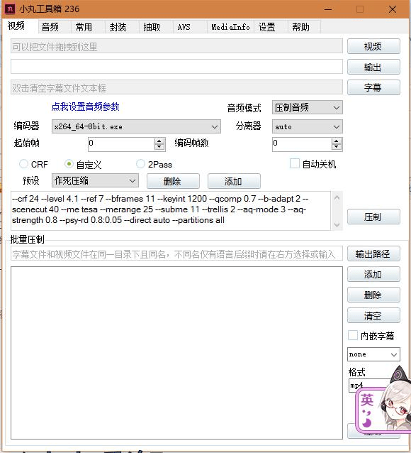
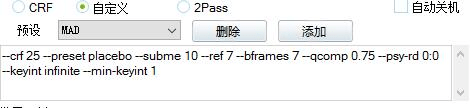

# [分享]视频压制小技巧以及软件

作者：C-aki

TID：23461

<title>1</title> <link href="../Styles/Style.css" type="text/css" rel="stylesheet">

# 1

沉浸MMD数月有余，每次都是因为各种原因断断续续，所以视频也是迟迟没有做出来（敲黑板，你能不能先把你的模型建完？还有文章拖了两个月还更不更了！） 不过自认为还是非常地系统地了解学习了MMD的制作和相关的各种软件。关于水杉建模，PE权重绑骨这些相信看视频，后期渲染和mme的使用实践起来用处更加大，这里就不一一叙述。这次仅仅是来给大家介绍一个压制视频的小软件。

相信玩MMD的大佬们都明白，由于MMD最后录制视频是等于一张又一张的高质量图片叠加的avi，造成没有压制过的原mmd作品那叫一个宏大。3分钟的时长可以上升到几十个G。于是就有了分享这个的想法...

进入正题。本次分享的软件是一个一个叫做【小丸工具箱】的视频压制软件.
<ignore_js_op>

**QQ截图20170715122103.jpg** *(52.13 KB, 下載次數: 0)*

[下載附件](forum.php?mod=attachment&aid=Njg3ODB8NjcyMGIwNDh8MTY3NDA2OTY3NHwxODIzMHwyMzQ2MQ%3D%3D&nothumb=yes)

2017-7-15 11:21 上傳

软件的压制页面就是这个样子的。（傲，输入法怎么进去了，不要在意）压制代码就是途中上面小框框一堆乱七八糟的各种数值设定。我用的是从网上找的中等偏高的代码（但是压制效果还是很满意的说）。具体是在哪里找的.....诶嘿，忘记了，毕竟很久了....

以下是代码，大家直接拉过去就可以用哦。

--crf 24 --level 4.1 --ref 7 --bframes 11 --keyint 1200 --qcomp 0.7 --b-adapt 2 --scenecut 40 --me tesa --merange 25 --subme 11 --trellis 2 --aq-mode 3 --aq-strength 0.8 --psy-rd 0.8:0.05 --direct auto --partitions all

<ignore_js_op>

**QQ截图20170715122614.jpg** *(10.2 KB, 下載次數: 0)*

[下載附件](forum.php?mod=attachment&aid=Njg3ODF8ODgzNDRmYmF8MTY3NDA2OTY3NHwxODIzMHwyMzQ2MQ%3D%3D&nothumb=yes)

2017-7-15 11:26 上傳

也有自带的压制。

最后就是下载地址了[点击这里就可以签订契约了哦~~哦不，转移到下载见面了哦。](http://www.maruko.in)

那么，祝大家周末愉快。
<title>2</title> <link href="../Styles/Style.css" type="text/css" rel="stylesheet">

# 2

4年前我自从做了个视频以后不会压制，就再也不做视频了 <title>3</title> <link href="../Styles/Style.css" type="text/css" rel="stylesheet">

# 3

> [冰西瓜 發表於 2017-7-15 11:45](https://giantessnight.cf/gnforum2012/forum.php?mod=redirect&goto=findpost&pid=339576&ptid=23461)
> 4年前我自从做了个视频以后不会压制，就再也不做视频了

啊  真可怜啊~  下次请稍微百度一下吧~  其实压制和转格式一样 挺简单的ww <title>4</title> <link href="../Styles/Style.css" type="text/css" rel="stylesheet">

# 4

> [C-aki 發表於 2017-7-15 11:52](https://giantessnight.cf/gnforum2012/forum.php?mod=redirect&goto=findpost&pid=339581&ptid=23461)
> 啊  真可怜啊~  下次请稍微百度一下吧~  其实压制和转格式一样 挺简单的ww

困難的在要先把MMD做出來
<title>5</title> <link href="../Styles/Style.css" type="text/css" rel="stylesheet">

# 5

> [ckw 發表於 2017-7-15 14:04](https://giantessnight.cf/gnforum2012/forum.php?mod=redirect&goto=findpost&pid=339605&ptid=23461)
> 困難的在要先把MMD做出來

但是，MMD这个就不是我考虑的问题了吧。而且现在这方面的教程也不是没有，就看自己想不想学 和想学到哪种程度。</ignore_js_op></ignore_js_op>