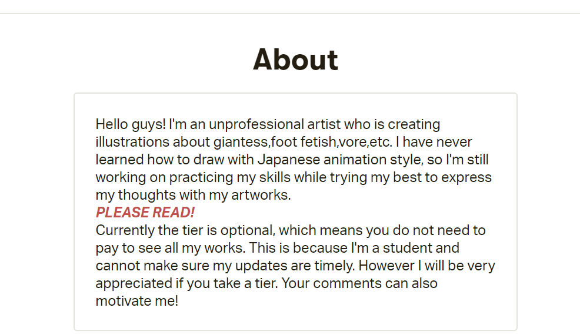
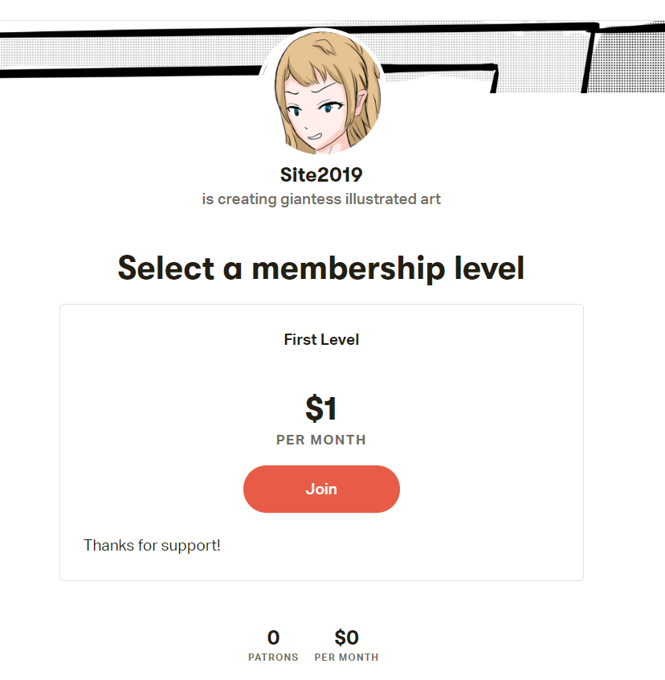

# 【厚着脸皮地自我宣传一番】我开patreon啦！

作者：St2019

TID：28089

<title>1</title> <link href="../Styles/Style.css" type="text/css" rel="stylesheet">

# 1

*本帖最後由 St2019 於 2020-2-18 11:41 編輯*

今天刚开了个patreon的creator界面！
[https://www.patreon.com/site2019](https://www.patreon.com/site2019) 此为URL。
唯一的tier也是可选的，本着自愿支持的想法。目前我的post都是免费开放，留个评论也好啊， 只为多一个渠道！
目前作品还不是很多，有空的小伙伴可以去瞅一眼！
当然有大佬能付个一刀支持那就太好啦。。。
建议先读下About部分了解一下啦。 <title>2</title> <link href="../Styles/Style.css" type="text/css" rel="stylesheet">

# 2

 <ignore_js_op>[捕获1.PNG](forum.php?mod=attachment&aid=ODE0OTB8YjliNTY0M2R8MTY3NDA2ODYyMnwxODIzMHwyODA4OQ%3D%3D&nothumb=yes) *(58.84 KB, 下載次數: 0)*

[下載附件](forum.php?mod=attachment&aid=ODE0OTB8YjliNTY0M2R8MTY3NDA2ODYyMnwxODIzMHwyODA4OQ%3D%3D&nothumb=yes)

2020-2-18 11:33 上傳  

</ignore_js_op> <ignore_js_op>[捕获.PNG](forum.php?mod=attachment&aid=ODE0ODl8NWYzNTBjYjl8MTY3NDA2ODYyMnwxODIzMHwyODA4OQ%3D%3D&nothumb=yes) *(103.39 KB, 下載次數: 0)*

[下載附件](forum.php?mod=attachment&aid=ODE0ODl8NWYzNTBjYjl8MTY3NDA2ODYyMnwxODIzMHwyODA4OQ%3D%3D&nothumb=yes)

2020-2-18 11:29 上傳  

</ignore_js_op> <title>3</title> <link href="../Styles/Style.css" type="text/css" rel="stylesheet">

# 3

已经加了Patreon，加油！ <title>4</title> <link href="../Styles/Style.css" type="text/css" rel="stylesheet">

# 4

個人建議，給你改了下簡介的部份
-------------------------------------------------------
PLEASE READ!
Currently the tier is optional, which means you do not need to pay to see all my works. This is because I'm a student and cannot make sure my updates are timely. However I will be very appreciated if you take a tier. Your comments can also motivate me!

------------------------------------------------------
PLEASE NOTE
The tier section is currently optioanl , which means you don't need to pay for the tier to see my art works. The reason for this is I'm still have other works need to be done, and I can't guarantee I can update my works on time. However, I'll be appreciated if you choose a tier to support my work. Your comments and suggestions are huge motivations for me!
Regard & Thank you！

其他的建議如下：
儘量不要在網路上暴露你的真實的工作，這個也是對自己的一種保護。
另外，儘量設計一個簽名或者水印，放在每幅作品的角落或者什麽地方。

<title>5</title> <link href="../Styles/Style.css" type="text/css" rel="stylesheet">

# 5

*本帖最後由 St2019 於 2020-2-18 23:39 編輯*

> [freelycat 發表於 2020-2-18 17:36](https://giantessnight.cf/gnforum2012/forum.php?mod=redirect&goto=findpost&pid=426977&ptid=28089)
> 個人建議，給你改了下簡介的部份
> -------------------------------------------------------
> PLEASE READ!

Thanks a lot!  多谢指教！
昨天写的时候忙着了解patreon的各种功能所以没有细琢磨措辞。
<title>6</title> <link href="../Styles/Style.css" type="text/css" rel="stylesheet">

# 6

> [Malph 發表於 2020-2-18 17:30](https://giantessnight.cf/gnforum2012/forum.php?mod=redirect&goto=findpost&pid=426975&ptid=28089)
> 已经加了Patreon，加油！

哇原来是你呀！十分感谢你的支持哦！希望能经常看到你！ <title>7</title> <link href="../Styles/Style.css" type="text/css" rel="stylesheet">

# 7

> [红茶 發表於 2020-2-18 14:16](https://giantessnight.cf/gnforum2012/forum.php?mod=redirect&goto=findpost&pid=426949&ptid=28089)
> 前排支持一波，site今后也要转正啦

hoho多谢来自前排的迅速支持！ <title>8</title> <link href="../Styles/Style.css" type="text/css" rel="stylesheet">

# 8

支持一下，毕竟圈子画师不多，能多出许多新鲜血液的很是不错。希望你能有更多优秀的作品！
<title>9</title> <link href="../Styles/Style.css" type="text/css" rel="stylesheet">

# 9

> [焦冥小虫xxx 發表於 2020-2-19 01:56](https://giantessnight.cf/gnforum2012/forum.php?mod=redirect&goto=findpost&pid=427096&ptid=28089)
> 支持一下，毕竟圈子画师不多，能多出许多新鲜血液的很是不错。希望你能有更多优秀的作品！
> ...

十分感谢您的支持！！！