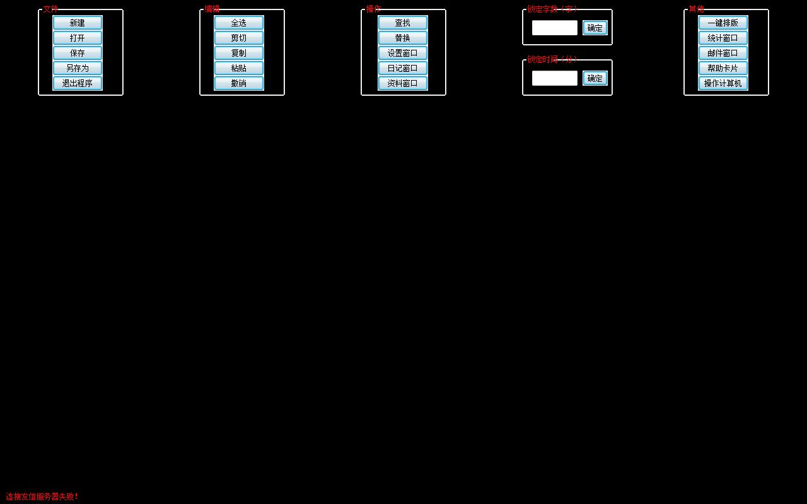

# 【反人类の剑】小黑屋码子软件

作者：447825856

TID：15777

<title>1</title> <link href="../Styles/Style.css" type="text/css" rel="stylesheet">

# 1

晚上的QQ群里……**剑爷突然决定要填坑了**（吓！）
然后他介绍了一个软件……
【小黑屋码字软件】

> “给我这种自制力差的弱逼”

以上为剑爷原话。
那么介绍一下吧。
这个软件使用之后，屏幕就会变黑，此时除了TXT，其他**任何软件**都打不开，包括任务管理器。
怎么关闭它，只要码够字数就好了。
<ignore_js_op>

**peeled.jpg** *(63.28 KB, 下載次數: 0)*

[下載附件](forum.php?mod=attachment&aid=Mzg3NDF8ZTdkM2EzZDV8MTY3NDA2ODk0NnwxODIzMHwxNTc3Nw%3D%3D&nothumb=yes)

2013-12-15 22:10 上傳

将鼠标放在屏幕最上方这个栏目就会出现了。
比如想码500字，就输入500，或者想工作30分钟，就输入30。
导入输出什么的就不说了。
用了一下果然神器，而且复制粘贴是不行的，设置时间之后不码字也是不行的。
而且亲测，如果设定了字数，之后再改也是不行的！还是要输入原来的字数量才够。
最后要提醒各位，使用一定要谨慎，否则输入1W字写不出来，我们就笑了。
<ignore_js_op> [4.1.1.5.zip](forum.php?mod=attachment&aid=Mzg3NDJ8OWVlYWM1Mzh8MTY3NDA2ODk0NnwxODIzMHwxNTc3Nw%3D%3D) *(853.7 KB, 下載次數: 50)* 2013-12-15 22:14 上傳點擊文件名下載附件<title>2</title> <link href="../Styles/Style.css" type="text/css" rel="stylesheet">

# 2

这个略残忍啊....谁开发的这东西 <title>3</title> <link href="../Styles/Style.css" type="text/css" rel="stylesheet">

# 3

.
別鬧了，我都用WORD的。 <title>4</title> <link href="../Styles/Style.css" type="text/css" rel="stylesheet">

# 4

我会说我用的是iPod的备忘录写文的么…… <title>5</title> <link href="../Styles/Style.css" type="text/css" rel="stylesheet">

# 5

> Dante 發表於 2013-12-16 00:41 
> .
> 別鬧了，我都用WORD的。

WORD好用啊

有放大，排版，搜字……搜字更把字高亮，’但是’’但是’之類的連接詞使用次數一瀏無畏，防止了前一句但是，後一句也用但是……（詞窮之人）

<title>6</title> <link href="../Styles/Style.css" type="text/css" rel="stylesheet">

# 6

此程式掃描後發現具有潛在性風險，將移往沙盒環境下進行相關程序。

超級變態模式也表示不管用 ╮(´∀`)╭ <title>7</title> <link href="../Styles/Style.css" type="text/css" rel="stylesheet">

# 7

弱弱的问一句，到达精神崩溃的边缘时强制重启神马的不行么？ <title>8</title> <link href="../Styles/Style.css" type="text/css" rel="stylesheet">

# 8

> Girmreaper 發表於 2013-12-17 21:32 
> 弱弱的问一句，到达精神崩溃的边缘时强制重启神马的不行么？

不行，解决方法是随便打乱码打够字数
发粉色的飞洒发诉讼法——这样

<title>9</title> <link href="../Styles/Style.css" type="text/css" rel="stylesheet">

# 9

> 小劍 發表於 2013-12-17 22:12 
> 不行，解决方法是随便打乱码打够字数
> 发粉色的飞洒发诉讼法——这样

其實可以進安全模式後，更改開機載入程序的內容（沒有相關知識請不要嘗試，安全模式下改錯很容易把作業系統搞炸），就可以在再次開機後免掉他又自動幫你打開的困擾。
<title>10</title> <link href="../Styles/Style.css" type="text/css" rel="stylesheet">

# 10

额，这也太残忍了吧，真不是自残吗，什么都打不开毁电脑吗？ <title>11</title> <link href="../Styles/Style.css" type="text/css" rel="stylesheet">

# 11

我表示开发这个软件的肯定是个神经病外加报复社会的心理扭曲！这尼玛就是为了消灭我等坑神而出现的啊！！！！！ <title>12</title> <link href="../Styles/Style.css" type="text/css" rel="stylesheet">

# 12

很有趣的东西啊，虽然用不上 不过好像看看用过的人有什么感想，哈哈。 <title>13</title> <link href="../Styles/Style.css" type="text/css" rel="stylesheet">

# 13

这呢吗太残忍了把，楼主 <title>14</title> <link href="../Styles/Style.css" type="text/css" rel="stylesheet">

# 14

挺好的东西  还可以用作其他用途 <title>15</title> <link href="../Styles/Style.css" type="text/css" rel="stylesheet">

# 15

这个东西。。。。。。。 <title>16</title> <link href="../Styles/Style.css" type="text/css" rel="stylesheet">

# 16

这种跟自己过不去的精神真是值得钦佩 <title>17</title> <link href="../Styles/Style.css" type="text/css" rel="stylesheet">

# 17

DosDos快捷键表示不服（这世界没人能阻止我！ <title>18</title> <link href="../Styles/Style.css" type="text/css" rel="stylesheet">

# 18

不过如果是为了自制...我会挂了快捷键<:/></ignore_js_op></ignore_js_op>