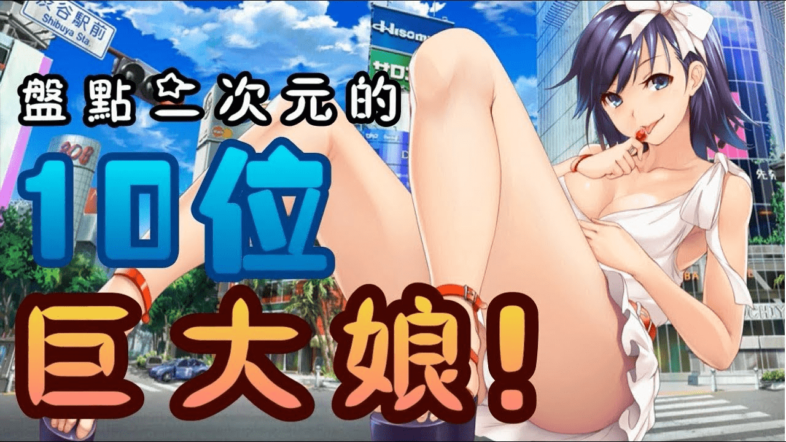

# 【女巨人也可以麼麼噠~】盤點二次元中的 10 位巨大少女！

作者：Solexight

TID：25128

<title>1</title> <link href="../Styles/Style.css" type="text/css" rel="stylesheet">

# 1

<ignore_js_op>

**maxresdefault.jpg** *(185.92 KB, 下載次數: 0)*

[下載附件](forum.php?mod=attachment&aid=NzIzMzR8MDY4ZTQzMzF8MTY3NDA2NzEzNXwxODIzMHwyNTEyOA%3D%3D&nothumb=yes)

2018-5-17 03:51 上傳

原文網址 [https://www.youtube.com/watch?v=mLj7xLjcwRY](https://www.youtube.com/watch?v=mLj7xLjcwRY)
我這百度雲很慢暫時不幫分流了sorry

看到標題還是不要想歪啦！所謂巨大娘其實也就是我們所說的女巨人了，這類萌娘絕對不是什麼比平常人高大一點，她們和平常人一般都有著數量級的差距，真正意義上的女巨人。幾倍，幾十倍，幾百倍都是可能的。那麼說到巨大娘，ACG作品里又有那些呢，今天就帶各位來看看吧！ 
1\. 伊吹萃香2\. 格蘭·葛蘭3\. 大牌4\. 黛安5\. 阿妮6\. 諾諾7\. 白星8\. 綾波麗9\. 初音未來10\. 山嶺女俠
<title>2</title> <link href="../Styles/Style.css" type="text/css" rel="stylesheet">

# 2

盘点时每一个人物配上一张图如何？ <title>3</title> <link href="../Styles/Style.css" type="text/css" rel="stylesheet">

# 3

支持楼上。
尤其是配巨大化后的图 <title>4</title> <link href="../Styles/Style.css" type="text/css" rel="stylesheet">

# 4

影片封面那張圖怎麼好像某DMM遊戲的圖啊
<title>5</title> <link href="../Styles/Style.css" type="text/css" rel="stylesheet">

# 5

楼主可以 发个 截图 看看嘛？？？ <title>6</title> <link href="../Styles/Style.css" type="text/css" rel="stylesheet">

# 6

感谢分享，这位up主是圈内人士吗 <title>7</title> <link href="../Styles/Style.css" type="text/css" rel="stylesheet">

# 7

一看见这个就知道有戴安emmmm不过翻不了墙真是可惜了QWQ</ignore_js_op>