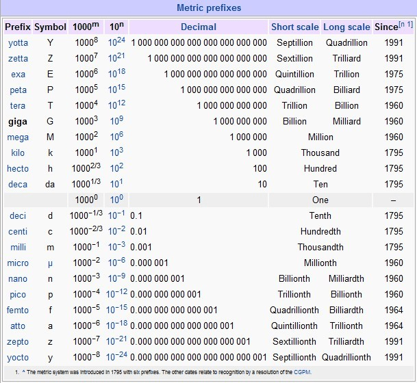

# 【學理派】關於GTS類別的初步劃分

作者：eventually

TID：12532

<title>1</title> <link href="../Styles/Style.css" type="text/css" rel="stylesheet">

# 1

恩。。某貓貌似很久都沒出來開講座了……今天開堂授課一下吧
（嘛，其實也是因為某蛋丁在群里的一句閒聊引起的……
另外：該界定轉載時麻煩請注明出處，謝謝合作。

先列一下我心中的劃分吧，總體來講，其實GTS各個階級的界定應該算是互有交叉的樣子。
讓我們從小往大來排列：（當然，這個界定是本貓規定的，僅供參考）
**Level 01：150cm —— 190cm | Tall Woman**
這個應該算是正常女性的身高範圍，低於150cm的我個人就認為可以算是Mini Woman了……基本身高超過175以上的女性就已經可以使用Tall Woman，也就是高大女來形容了。至於比190cm還高的，請參考第二級

**Level 02：191cm —— 250cm | Real GTS**
跟上一個等級一樣，這個還是在目前現實生活中偶爾可以看到的。當然了，236cm是現存人類中，吉尼斯世界紀錄里紀錄的女性身高；而且，到了這個身高，基本已經可以稱之為Mini GTS了，但是我個人傾向於稱之為Real GTS，即現實的女巨人。雖然暫時還沒出現過超過236cm的女性……但是我們不排除在不遠的將來，會有這種身高的女性出現的可能性……另外：高於190cm有些可以用Amazon來形容。比如那個之前很著名的203.2cm 的[Amazon Eva](http://amazoneve.com)。她給自己的頭銜就是Amazon。一般Amazon在英文里也指代很高大的女性的樣子。

**Level 03：251cm —— 800cm | Mini GTS**
這個範圍段基本正常的女性目前是沒機會涉足了，除非採用極端殘酷的手段進行特殊強化才有可能出現。所以，一般我的定義為是Mini GTS。在我們經常見到的作品中，比如名為《芙蕾》那套蛇女系列，就可以算做是Mini GTS的。不過，目前也有人提出，實際上沒超過50m的都可以算是Mini GTS的……個人對這點目前仍舊持一種中立的態度。但是在這個貼里，我暫且把超過8m級別的的歸到下一類。

**Level 04: 801cm —— 200m | Gigantic GTS I**
注意：這個級別和下面的幾個Gigantic GTS等級跟Giga GTS是有所區別的。這個級別，基本已經是可以開始破壞一座城市了。舉一個例子，之前Joyysososo同好翻譯的[幻山龍天女](http://giantessnight.com/gnforum/viewthread.php?tid=164)里出現的龍姬就可以算是這個級別的了。至於這個200m是怎麼界定的，我會告訴你是我隨意寫下的數字咩？

**Level 05: 200m+ | Gigantic GTS II**
這個只是爲了細分一下才從Gigantic GTS里分出來的。GG II這個級別的GTS基本從大家默認的情況下來看，已經可以初步/完全抵禦正常人類的常規武器攻擊了。或許部份炮彈之類的還可以勉強傷害到部份肌體，但是總體來講，核彈以下，已經可以近似的看做是免疫了。另外，該級別是我寫的分類里第一個沒有上限的級別。因為基本從這個級別開始，大家都很少會給一個很準確的數值界定，只會模糊的界定一下大概的比例而已。

**Level 06：1,000m+ | Gigantic GTS III**
這個級別的GTS們的體型基本已經比截止目前為止的人類最高建築；Dubai（迪拜 in 阿拉伯聯合酋長國|UAE）的“**Burj Khalifa**”（828 m | 2,717 ft）還要高出200m以上。如果有幸去過Dubai，並且參觀過Burj Khalifa的話，你應該會理解爲什麽說這個級別的GTS已經開始具備了摧毀國家的能力了。從幾公里以外就可以看到的高聳入雲的建築，用妄想模式替換成GTS的話，當你站在附近的時候會產生出很強的被壓迫感的。我估計，很少會有人能在那時候還異常鎮定的站在邊上而不陷入恐慌模式。附WikiPedia的[摩天大樓列表供參考](http://zh.wikipedia.org/wiki/%E6%91%A9%E5%A4%A9%E5%A4%A7%E6%A8%93%E5%88%97%E8%A1%A8)

**Level 07：1,000,000m+ (1000KM） | Mega GTS**
貌似這個級別已經是蛋丁筆下的芙蕾殿下當年的身高了好像……基本到了這個級別，大小跟一個星球也沒啥區別了。地球的平均直徑是12742.02KM，注意我使用的單位，是KM，也就是千米/公里也就是說，如果真有GTS是這個高度，她已經差不多要相當於十分之一個地球大了，雖然從體積上講可能會是排球對大號彈珠這樣子的感覺。所以，這個時候的GTS已經完全具備了摧毀一個洲的能力了，另外，地球的大氣層中最低的對流層平均高度為10KM，最低的極地是8KM，赤道地區為15KM，所以也就是說，如果這個GTS站在極地的話，她的頭大概會有2000m的部份是在上面的平流層里，在赤道的話也不過就是稍微抬抬手就可以伸到平流層里了。如果還是沒有概念，大概你平時出行乘坐飛機是會在對流層中飛行的，長途航班可能會選擇在對流層和平流層之間飛行。所以，你可以想像一下，你坐飛機的時候突然發現旁邊出現一雙瞳孔都比一架波音787還大的眼睛看著你的時候，你是神馬感覺？另外，如果是10，000KM的GTS，有個最佳的參照物，就是當年黑錢社Gainax做的《飛躍巔峰2》里的“Die Buster”的大小差不多相當於一個地球大小。。。恩……
附帶[大氣層](http://zh.wikipedia.org/wiki/%E5%9C%B0%E7%90%83%E5%A4%A7%E6%B0%94%E5%B1%82)介紹，照例來自WikiPedia。

**Level 08：1,000,000,000m+ (1,000,000KM) | Giga GTS**
到了這個級別，基本上，大小跟太陽也差不多大了。。太陽的直徑為1,392,000km，是地球直徑的109倍。所以，我想你大概可以推測一下這個級別的GTS的大小了。如果還是沒感覺，我建議你可以找個你身高的百分之一大小的物品來對比下……這樣應該更有體會吧。至於這個體積的重量，如果在太陽系里的話，影響類地行星的運行軌道是完全沒有問題的了。這個時候的GTS想毀滅任何太陽系的行星都沒有什麽問題了……如果胃口大甚至可以直接吃掉某些星球了……

附帶一張表格吧，從數學方面的各個數級的列表。可以自行對照一下。
<ignore_js_op>

**未命名.jpg** *(113.34 KB, 下載次數: 0)*

[下載附件](forum.php?mod=attachment&aid=Mjg5NzB8MWJhNTZkZDR8MTY3NDA2ODY3OHwxODIzMHwxMjUzMg%3D%3D&nothumb=yes)

2012-6-23 05:05 上傳

最末の真國際慣例：
References：
本喵這篇文章的全部引用數據及內容均來自以下兩個網站的搜索結果：
WikiPedia：[http://www.wikipedia.org](http://www.wikipedia.org)   (爲了照顧英文不好的同好特意使用了中文版的譯文做link）
Google： [http://www.google.com](http://www.google.com)
部份內容信息參考自以下網站：
GiantessNight：[http://giantessnight.com](http://giantessnight.com) (自己寫自家論壇真的感覺很怪）
Giantess City：[http://giantesscity.com](http://giantesscity.com)

作者：freelycat@Giantess Night
-------------------------------------------------------------------

總算寫完了……恩，以上僅限GTS部份，因為個人對SW系列無愛，兼本論壇主體討論串均為GTS。故不在對其他方向進行任何討論。另外，其中的各個界定均為個人喜好的界定模式，除了目前為止Mega/Giga兩個級別是有界內公認的叫法以及很模糊的大小界定以外，其它各個級別均沒有明確的大小界定和叫法，而Mini GTS也只是有個初步的定義而已。
還是那句話，歡迎討論，請勿爭吵。

*另：該帖我加上了5點的閱讀權限限制，只是希望這篇文章僅僅留在咱們論壇而已。如果需要轉載至其他論壇/貼吧等地，請與我取得聯繫。

[ *本帖最後由 freelycat 於 2012-6-23 12:06 編輯* ] <title>2</title> <link href="../Styles/Style.css" type="text/css" rel="stylesheet">

# 2

目前文章版本V1.1
已對壇友**nijack89**提出的Mega級體型對比方面的缺陷進行了細微修改。

計劃升級V1.2版
目前正在思考如何將XNR大的內容整合進帖子里。

在此對提出任何改進建議的壇友表示衷心的感謝。
----------------------------------
*備註：這個高度分割系統純粹是我個人的喜好分割模式，如果引發你的不適，本貓在此賠罪……
另外，如果來這裡玩無意義灌水的，直接停封ID。
以上。

[ *本帖最後由 freelycat 於 2012-6-23 19:45 編輯* ] <title>3</title> <link href="../Styles/Style.css" type="text/css" rel="stylesheet">

# 3

LV8是恒星的大小哦
那么其实DGU文章里面Giga漫天飞啊
更大的星魂那种果然是LV10之类？
总觉得以前似乎但丁有过介绍大小等级划分的吧
话说深夜2点码这么多字还真是辛苦了

[ *本帖最後由 archer 於 2012-6-23 08:06 編輯* ] <title>4</title> <link href="../Styles/Style.css" type="text/css" rel="stylesheet">

# 4

稍微糾正一下第七級GTS的分類
雖然貓大的MEGA GTS 身高有將近地球直徑的十分之一
不過跟地球的體積比較後
兩者的大小差距就像彈珠跟排球這樣的比例吧

我在這種事上有些認真
請貓大不要見怪 <title>5</title> <link href="../Styles/Style.css" type="text/css" rel="stylesheet">

# 5

> 原帖由 *nijack89* 於 2012-6-23 10:30 發表 
> 稍微糾正一下第七級GTS的分類
> 雖然貓大的MEGA GTS 身高有將近地球直徑的十分之一
> 不過跟地球的體積比較後
> 兩者的大小差距就像彈珠跟排球這樣的比例吧
> 
> 我在這種事上有些認真
> 請貓大不要見怪

完全不會，謝謝你指出我文章的缺陷……寫的時候有些迷迷糊糊的，所以對於長度和體積問題就忘記考慮了……

> 原帖由 *archer* 於 2012-6-23 08:05 發表 
> LV8是恒星的大小哦
> 那么其实DGU文章里面Giga漫天飞啊
> 更大的星魂那种果然是LV10之类？
> 总觉得以前似乎但丁有过介绍大小等级划分的吧
> 话 ...

但丁以前似乎有提到過一點點，但是貌似是在遠古版本的論壇那裡了。所以早已化作不知何處的數據碎片了……

[ *本帖最後由 freelycat 於 2012-6-23 12:10 編輯* ] <title>6</title> <link href="../Styles/Style.css" type="text/css" rel="stylesheet">

# 6

Amazon是高大女人 长知识了 是因为古希腊神话里 亚马逊的女人 都很高大么~

[ *本帖最後由 390004989 於 2012-6-23 18:03 編輯* ] <title>7</title> <link href="../Styles/Style.css" type="text/css" rel="stylesheet">

# 7

> 原帖由 *390004989* 於 2012-6-23 18:01 發表 
> Amazon是高大女人 长知识了 是因为古希腊神话里 亚马逊的女人 都很高大么~

可以這樣理解……
因為，Amazon一般都是理解為那個女性部落，她們部落的特點就是強壯，勇猛。
所以在很多的作品中，Amazon都會被描繪成高大，強壯的女性。例如，美漫里的Wonder Woman，她就是典型的Amazon的代表。
但是她從文學定義上又不算Amazon，因為，Amazon必備的技能是弓箭，而在超級英雄聯盟和Wonder Woman系列里，她很少會使用弓箭。而且，很多古典的作品中，Amazon都會割掉自己的左乳，以方便她們射箭，而恰恰WW她沒有缺失任何一邊，且她的那對可以稱為是肉彈級了……
 <title>8</title> <link href="../Styles/Style.css" type="text/css" rel="stylesheet">

# 8

非常欣赏这种严谨的作风和探求的精神！

不过这么做有几个小缺点：
1\. 容易引发钻牛角尖的争论。
2\. 忽略了GTS同好对属性的偏好，有些分类同质性太强，强行分开意义不大。
mini-gts控对20米以上的GTS就毫无兴趣了，超巨大GTS控对200米以上的基本通吃。
3\. 对大部分同好来说不易理解、懒得看，从而导致此标准不宜推广。

以下是我的划分，附有相关介绍，仅供参考：
[http://giantessnight.com/gnforum ... 2668&highlight=](http://giantessnight.com/gnforum/viewthread.php?tid=2668&highlight=)

[ *本帖最後由 xnr 於 2012-6-23 19:08 編輯* ] <title>9</title> <link href="../Styles/Style.css" type="text/css" rel="stylesheet">

# 9

.
這種標準最大的一個問題就是「沒有標準」。
從來沒有出現什麼「誰說了就算」這種事，導致幾乎每個人都有自己的一套衡量標準。
所以最好還是在名詞後方加註身高體型的範圍，雖然感覺挺多此一舉的…

但是 f貓 的見解看上去是頗令人滿意的，除了 Mega GTS 的體型似乎跟我在大多數地方看到的都不同以外。
從LV4到LV6都有人認為是Mega呢。
所以這個Mega的單位會不會是指mm而不是m呢？
又或者其實圈子的前輩是依照英制度量衡來設定的？

我的想法是，當初使用 Mega 的用意是在「巨大」、「龐大」的字義上。
換句話說，是採取抽象層面而非實際數值的解釋，所以跟數字不是很有關系吧。

我是認為 Mega 級要到1000公里高才算，有點兒說不過去啦。 <title>10</title> <link href="../Styles/Style.css" type="text/css" rel="stylesheet">

# 10

> 原帖由 *Dante* 於 2012-6-23 19:37 發表 
> .
> 這種標準最大的一個問題就是「沒有標準」。
> 從來沒有出現什麼「誰說了就算」這種事，導致幾乎每個人都有自己的一套衡量標準。
> 所以最好還是在名詞後方加註身高體型的範圍，雖然感覺挺多此一舉的…
> 
> 但是 f貓  ...

一般正常的上數學課的孩子都會將mm理解為毫米的吧……
這套分割系統只是我個人的喜好而已。
所以，也還是希望大家能多提出自己的看法。
權當是抛磚引玉的樣子吧……

另外，使用英/美製單位的可能性我考慮過，但是換算還是比較麻煩的。所以暫時不做考量。

[ *本帖最後由 freelycat 於 2012-6-23 19:47 編輯* ] <title>11</title> <link href="../Styles/Style.css" type="text/css" rel="stylesheet">

# 11

感覺mega這個級別好像尺度非常廣的說……說法也各種不一

印象中giantessworld把500ft以上就叫mega了呢……|||

比起那個，芙蕾殿下是指誰
芙蕾雅的話好像沒有這個高度……

TO 3L：其實沒有啦，除去星魂和少數幾人外貌似基本都是在1000KM以下…… <title>12</title> <link href="../Styles/Style.css" type="text/css" rel="stylesheet">

# 12

猫大好专业，看得我眼花</ignore_js_op>