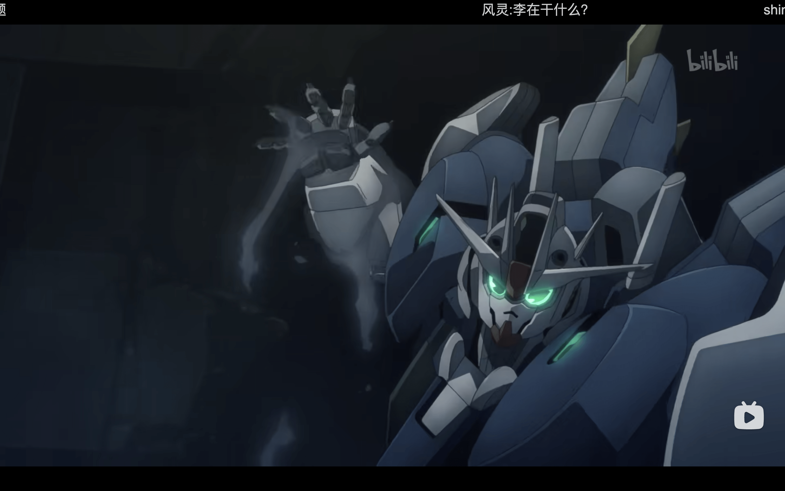
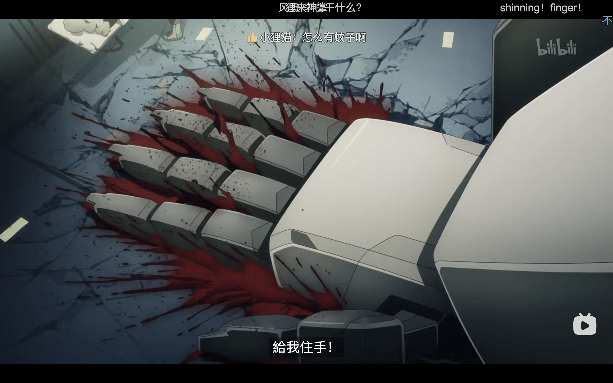
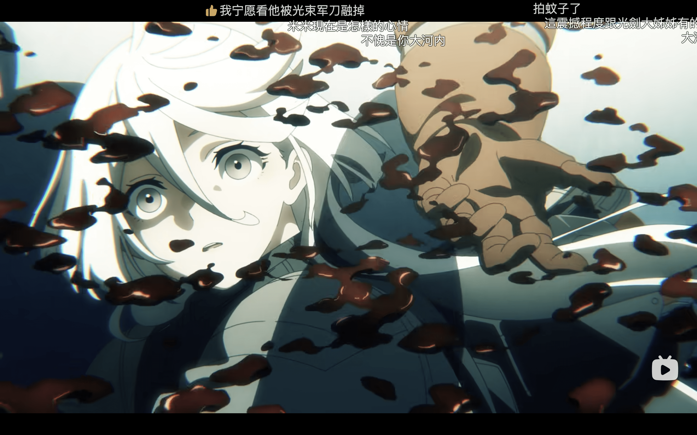
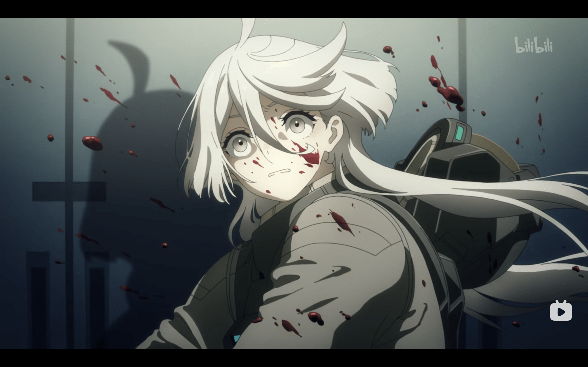
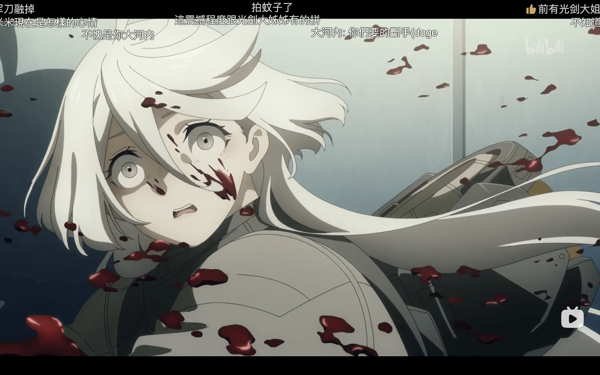
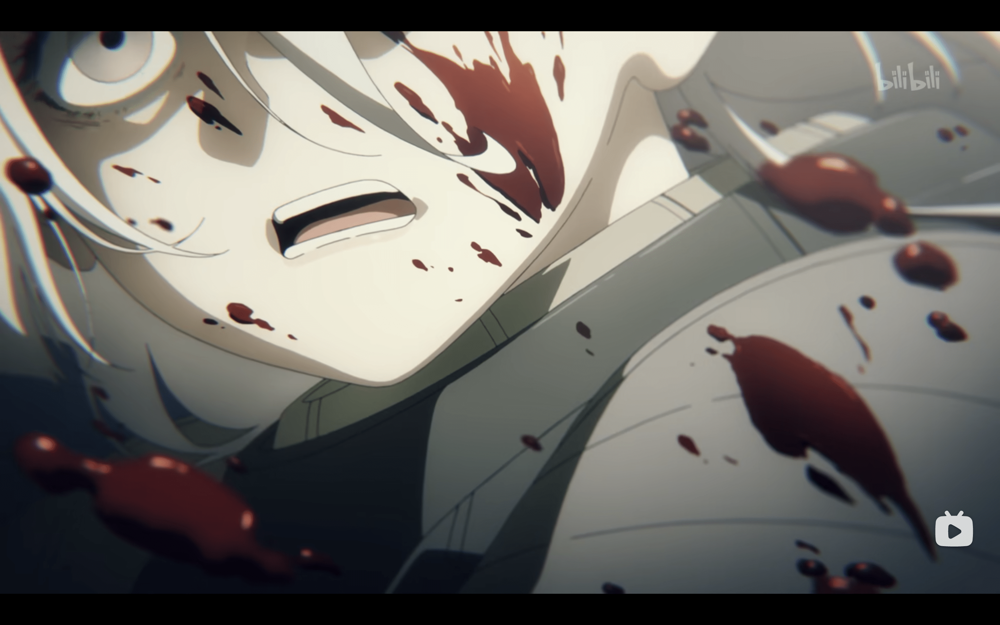
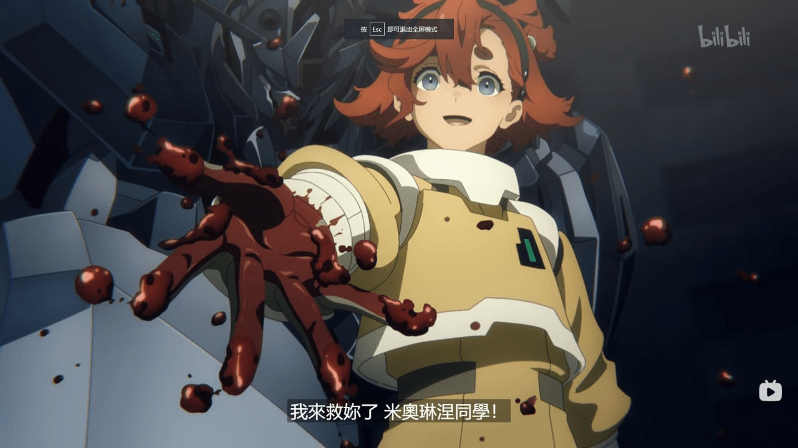
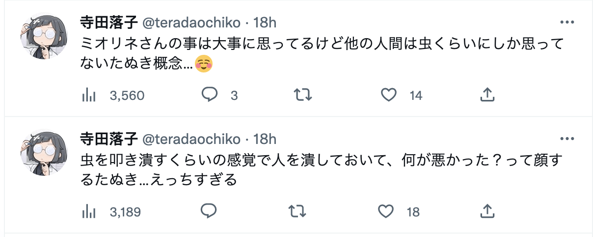

# 【巨大娘擦边？】水星的魔女

作者：anhonghai

TID：34743

<title>1</title> <link href="../Styles/Style.css" type="text/css" rel="stylesheet">

# 1

不知道论坛有没有追10月新番水星的魔女的，刚更新的最新话里女主驾驶的高达一掌把敌方士兵拍死了，血溅了女二一脸；但女主杀完人却还是一脸天真的笑容，吓得女二很害怕
本来应该是相当震撼的场景，但作为巨大娘作品里相当常见的剧情，我还是不厚道地走神了

这种巨大娘轻描淡写地抹杀小人，把旁边的小人吓得半死，但女巨人脸上还带着灿烂的笑容的这种桥段相当戳我

最后小小地推荐一下这部水星的魔女，一共13集，后半段会在4月放送。虽然是高达系列作品，但剧情相当有趣，毫不晦涩，即使是完全没接触过高达的观众而言也没有任何门槛，可以放心观看

~~高达往日荣光跌向大河内老师！~~

<ignore_js_op>

**截屏2023-01-08 下午8.30.58.png** *(2.42 MB, 下載次數: 0)*

[下載附件](forum.php?mod=attachment&aid=MTAxNDcyfDAxNDA1YWE5fDE2NzQwNjUwNTB8MTgyMzB8MzQ3NDM%3D&nothumb=yes)

2023-1-8 20:36 上傳

<ignore_js_op>

**截屏2023-01-08 下午8.31.11.png** *(3.46 MB, 下載次數: 0)*

[下載附件](forum.php?mod=attachment&aid=MTAxNDczfDA2NGNkN2JmfDE2NzQwNjUwNTB8MTgyMzB8MzQ3NDM%3D&nothumb=yes)

2023-1-8 20:37 上傳

<ignore_js_op>

**截屏2023-01-08 下午8.31.35.png** *(4.34 MB, 下載次數: 0)*

[下載附件](forum.php?mod=attachment&aid=MTAxNDc0fGJmOGVlZGVlfDE2NzQwNjUwNTB8MTgyMzB8MzQ3NDM%3D&nothumb=yes)

2023-1-8 20:37 上傳

<ignore_js_op>

**截屏2023-01-08 下午8.32.38.png** *(3.19 MB, 下載次數: 0)*

[下載附件](forum.php?mod=attachment&aid=MTAxNDc1fDkzNGU2OWNmfDE2NzQwNjUwNTB8MTgyMzB8MzQ3NDM%3D&nothumb=yes)

2023-1-8 20:38 上傳

<ignore_js_op>

**截屏2023-01-08 下午8.31.51.png** *(3.16 MB, 下載次數: 0)*

[下載附件](forum.php?mod=attachment&aid=MTAxNDc2fDM0MzQ0ZTU1fDE2NzQwNjUwNTB8MTgyMzB8MzQ3NDM%3D&nothumb=yes)

2023-1-8 20:38 上傳

<ignore_js_op>

**截屏2023-01-08 下午8.32.16.png** *(3.4 MB, 下載次數: 0)*

[下載附件](forum.php?mod=attachment&aid=MTAxNDc3fGNhMWFhYTFhfDE2NzQwNjUwNTB8MTgyMzB8MzQ3NDM%3D&nothumb=yes)

2023-1-8 20:39 上傳

<title>2</title> <link href="../Styles/Style.css" type="text/css" rel="stylesheet">

# 2

牛B，现在高达也算巨大娘了吗？我还以为是田棒棒发的 <title>3</title> <link href="../Styles/Style.css" type="text/css" rel="stylesheet">

# 3

虽然高达作为反战题材的片子，有出现死人这种场景在正常不过，但我还是想说你这都能联想到一切确实厉害，佩服佩服（反正我是不行，也不想） <title>4</title> <link href="../Styles/Style.css" type="text/css" rel="stylesheet">

# 4

卧槽，这是什么发展12集的莱塔发生什么了？？？？ <title>5</title> <link href="../Styles/Style.css" type="text/css" rel="stylesheet">

# 5

那某種程度上eva也算是巨娘了吧···· <title>6</title> <link href="../Styles/Style.css" type="text/css" rel="stylesheet">

# 6

這個血量......實在是太誇張的多了！
<title>7</title> <link href="../Styles/Style.css" type="text/css" rel="stylesheet">

# 7

风灵里面貌似塞了个女孩（当然也有可能是AI）……所以说勉强也算巨大娘？
这样的话……嘿嘿……风灵快踩死我吧……嘿嘿…… <title>8</title> <link href="../Styles/Style.css" type="text/css" rel="stylesheet">

# 8

[https://zh.moegirl.org.cn/zh-hant/%E6%96%AF%E8%8E%B1%E5%A1%94%C2%B7%E5%A2%A8%E4%B8%98%E5%88%A9](https://zh.moegirl.org.cn/zh-hant/%E6%96%AF%E8%8E%B1%E5%A1%94%C2%B7%E5%A2%A8%E4%B8%98%E5%88%A9)

驾驶员是这个妹子，那会不会好一点。有哦，有画师觉得这个是
[https://twitter.com/Seo_t/status/1612063016245428226](https://twitter.com/Seo_t/status/1612063016245428226)

<title>9</title> <link href="../Styles/Style.css" type="text/css" rel="stylesheet">

# 9

 <ignore_js_op>[photo_2023-01-08_09-31-25.jpg](forum.php?mod=attachment&aid=MTAxNDgyfDZhM2NjMmNmfDE2NzQwNjUwNTB8MTgyMzB8MzQ3NDM%3D&nothumb=yes) *(90.54 KB, 下載次數: 0)*

[下載附件](forum.php?mod=attachment&aid=MTAxNDgyfDZhM2NjMmNmfDE2NzQwNjUwNTB8MTgyMzB8MzQ3NDM%3D&nothumb=yes)

2023-1-9 05:06 上傳  

</ignore_js_op> <title>10</title> <link href="../Styles/Style.css" type="text/css" rel="stylesheet">

# 10

不能说楼主联想太广了吧，毕竟看寺田落子的推特在看了昨天的魔女后都连发好几条来表达自己的联想。 <title>11</title> <link href="../Styles/Style.css" type="text/css" rel="stylesheet">

# 11

> [realGNfans11 發表於 2023-1-8 23:59](https://giantessnight.cf/gnforum2012/forum.php?mod=redirect&goto=findpost&pid=524230&ptid=34743)
> 那某種程度上eva也算是巨娘了吧····

eva还真算巨娘，毕竟凌波丽确实有巨大化的剧情
<title>12</title> <link href="../Styles/Style.css" type="text/css" rel="stylesheet">

# 12

> [aassddff 發表於 2023-1-9 09:09](https://giantessnight.cf/gnforum2012/forum.php?mod=redirect&goto=findpost&pid=524272&ptid=34743)
> 不能说楼主联想太广了吧，毕竟看寺田落子的推特在看了昨天的魔女后都连发好几条来表达自己的联想。 ...

<ignore_js_op>

**截屏2023-01-09 上午11.25.46.png** *(146.09 KB, 下載次數: 0)*

[下載附件](forum.php?mod=attachment&aid=MTAxNDg5fDZjZWIyZWVmfDE2NzQwNjUxOTd8MTgyMzB8MzQ3NDM%3D&nothumb=yes)

2023-1-9 11:26 上傳

我懂的，虽然那种以虐杀小人为乐的巨大娘也很不错，但这种明明杀了人却跟拍死一只虫子一样丝毫没有负罪感的巨大娘反而更有一种反差萌
<title>13</title> <link href="../Styles/Style.css" type="text/css" rel="stylesheet">

# 13

你那时候脑子里的画面怕不是这个233 <title>14</title> <link href="../Styles/Style.css" type="text/css" rel="stylesheet">

# 14

 <ignore_js_op>[Fl9bgS6aYAcHGjF (1).png](forum.php?mod=attachment&aid=MTAxNDkwfDZjM2IxODhhfDE2NzQwNjUxOTd8MTgyMzB8MzQ3NDM%3D&nothumb=yes) *(40.59 KB, 下載次數: 0)*

[下載附件](forum.php?mod=attachment&aid=MTAxNDkwfDZjM2IxODhhfDE2NzQwNjUxOTd8MTgyMzB8MzQ3NDM%3D&nothumb=yes)

2023-1-9 12:58 上傳  

[.png")](javascript:;)</ignore_js_op> <title>15</title> <link href="../Styles/Style.css" type="text/css" rel="stylesheet">

# 15

> [maker13 發表於 2023-1-9 12:59](https://giantessnight.cf/gnforum2012/forum.php?mod=redirect&goto=findpost&pid=524285&ptid=34743)
> 你那时候脑子里的画面怕不是这个233

<ignore_js_op>

**IMG_9604.GIF** *(53.12 KB, 下載次數: 0)*

[下載附件](forum.php?mod=attachment&aid=MTAxNDkxfDZhMDk2NmFjfDE2NzQwNjUxOTd8MTgyMzB8MzQ3NDM%3D&nothumb=yes)

2023-1-9 14:07 上傳

差不多是这样
<title>16</title> <link href="../Styles/Style.css" type="text/css" rel="stylesheet">

# 16

有一说一，昨天看到贴吧里讨论巨狸天王发颠的时候，我第一反应也是联想到了这个（） <title>17</title> <link href="../Styles/Style.css" type="text/css" rel="stylesheet">

# 17

小狸猫拍人时那句呀买那塞确实很有巨娘虐小人时的感觉，否定带着轻快还夹杂着一丝愉悦 <title>18</title> <link href="../Styles/Style.css" type="text/css" rel="stylesheet">

# 18

看的时候也联想到了(^し^)
狸猫拍死了人毫不在意，满脸笑容的要扶米米起来
这种力量对比和区别对待，放到巨大娘作品里也是极好的情节
（想看米米第一视角） <title>19</title> <link href="../Styles/Style.css" type="text/css" rel="stylesheet">

# 19

其实推上也看到一些（很少）类似的二创了 <title>20</title> <link href="../Styles/Style.css" type="text/css" rel="stylesheet">

# 20

按照剧情推测，高达风灵可能具有有自我意识，而且就是主角的姐妹，这样想是不是感觉更有gts的意味了（顺便催更楼主第一篇文） <title>21</title> <link href="../Styles/Style.css" type="text/css" rel="stylesheet">

# 21

*本帖最後由 Star 於 2023-1-10 00:40 編輯*

> [anhonghai 發表於 2023-1-10 00:08](https://giantessnight.cf/gnforum2012/forum.php?mod=redirect&goto=findpost&pid=524353&ptid=34743)
> 按照剧情推测，高达风灵可能具有有自我意识，而且就是主角的姐妹，这样想是不是感觉更有gts的意味了（顺便 ...

竟然是写那篇高中随笔的大大，那篇我真的很喜欢，快三年没更了吧，催更催更  ~~反客为主~~

不过回头看一两年前写的东西感觉真的很陌生，完全就像是别人写的一样
<title>22</title> <link href="../Styles/Style.css" type="text/css" rel="stylesheet">

# 22

> [Star 發表於 2023-1-10 00:34](https://giantessnight.cf/gnforum2012/forum.php?mod=redirect&goto=findpost&pid=524357&ptid=34743)
> 竟然是写那篇高中随笔的大大，那篇我真的很喜欢，快三年没更了吧，催更催更  ~~反客为主~~
> 
> ...

你写的两篇文章我也都很喜欢，主要是想看第一篇文章标题中提到的几个身份转换的过程。我的那篇文章也就差个结局了，按照构思到最后了。</ignore_js_op></ignore_js_op></ignore_js_op></ignore_js_op></ignore_js_op></ignore_js_op></ignore_js_op></ignore_js_op>