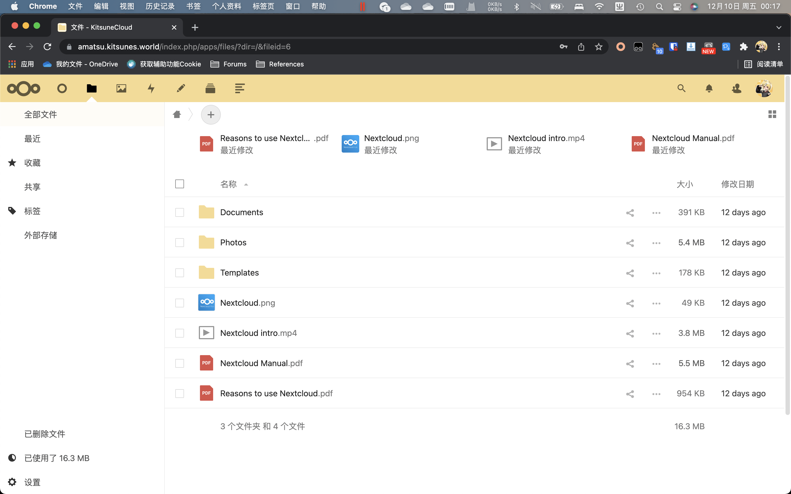
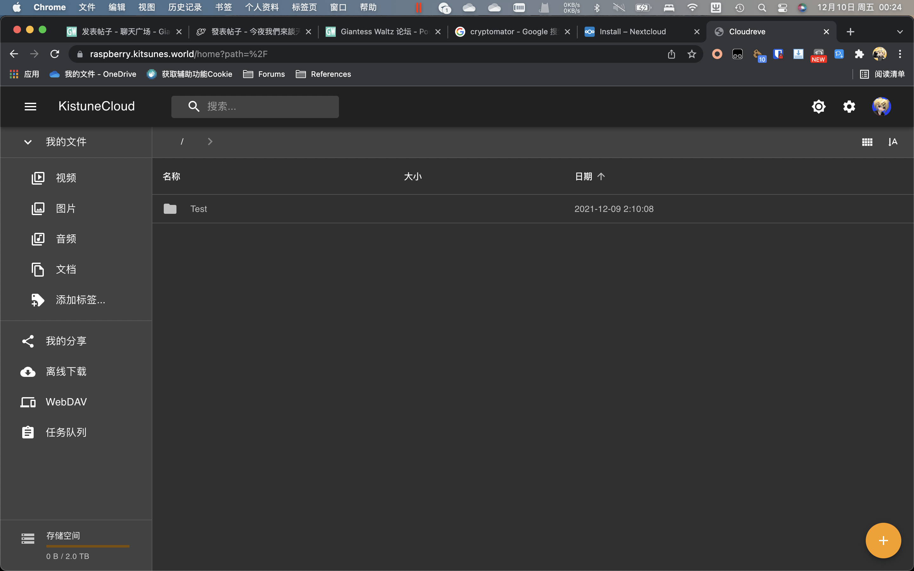

# 【弃而不舍】 KitsuneCloud （暂定）公开预览 Part 1

作者：Foobarz

TID：32210

<title>1</title> <link href="../Styles/Style.css" type="text/css" rel="stylesheet">

# 1

虽然这本来和我没什么关系，我大可以继续舒舒服服的自己用 OneDrive for Business ，然后嘲笑各位天天埋怨百度网盘和谐不得不用黑科技加密压缩文件夹导致频繁被问解压密码这种情况。（来打我啊.jog）但还是一厢情愿的想做点什么。于是就想到来模仿 General Sizefetish uploader ( [https://gs-uploader.jinja-modoki.com/upld-index.php](https://gs-uploader.jinja-modoki.com/upld-index.php)，对就是那个圈内家喻户晓的神社搞的) 或者 wp.sidedon.com 搭一个给创作者同好使用的网盘了。

> 其实本来有打算扩展到转载收集其它公开发表的圈内作品的，但是因为难以避免因为有成本要收费会被当作隔壁那样的奸商搬运工挨骂，所以先搁置了。

> （给你们培训 Microsoft 365 那堆怎么用成本更大还不一定有人愿意用，反正只要为了本来免费的东西掏钱肯定会被骂的狗血淋头，更算了。）

首先要打好预防针：

*   目前没有计划给所有人用（特别是那种只会到处按转存的家伙）。因为 Nextcloud 和 Cloudreve （我用的两个服务端软件）都没有类似的转存功能。（Nextcloud 保存的是链接， Cloudreve 只有付费版有转存功能，但我没买）
*   初始容量不会很大（大概 1GB），虽然如果你真的作品丰富以及还相信我的话可以找我扩容就是。
*   最后，我、服务器提供商和微软（ Cloudreve 用的是 SharePoint 做存储）都能看到用户存了什么，所以不要放你自己的敏感信息在里面。（当然你真的想作死的话可以用 Cryptmator 之类的软件本地加密一下。）

至于为什么用两个服务端，大概是因为我有选择恐惧症吧。（？）

然后是展示（虽然只能看个界面）：

[https://amatsu.kitsunes.world](https://amatsu.kitsunes.world/) 用的是 Nextcloud ，大概像这个样子：
<ignore_js_op>

**截屏2021-12-10 00.17.21.png** *(593.59 KB, 下載次數: 0)*

[下載附件](forum.php?mod=attachment&aid=OTI3OTN8NDE1NDgwNGR8MTY3NDA2NTc0NXwxODIzMHwzMjIxMA%3D%3D&nothumb=yes)

2021-12-10 00:31 上傳

按 Nextcloud 的说法， Nextcloud 更像一个不止云盘的云端协作方案，还支持像是邮件、日历和看板之类的协作功能。（虽然这里肯定没人看得上就是了）

[https://raspberry.kitsunes.world](https://raspberry.kitsunes.world/) 用的是 Cloudreve，这个软件貌似是国人开发的，支持包括 SharePoint / OneDrive 之类的其它云存储做后端。（那为什么给大家不直接用 SharePoint/OneDrive for Business ？“好麻烦啊”“好贵啊”……）
<ignore_js_op>

**截屏2021-12-10 00.24.07.png** *(994.02 KB, 下載次數: 0)*

[下載附件](forum.php?mod=attachment&aid=OTI3OTR8NzRhOGM3NGJ8MTY3NDA2NTc0NXwxODIzMHwzMjIxMA%3D%3D&nothumb=yes)

2021-12-10 00:33 上傳

因为我比较喜欢 Material Design 所以才会在这个和 Nextcloud 里纠结的。（别看了，我没设置离线下载需要的 aria2，所以那个没法用。）

公开预览阶段暂时不收费，也没有广告。 下载速度嘛……至少会比没充会员的百度网盘快。 （毕竟商业盈利是个筐（x））反正最坏就是没人用或者我入不敷出先自己凉了。各位再回到老样子天天埋怨百度网盘和谐不得不用黑科技加密压缩文件夹导致频繁被问解压密码或者担心被举报而已嘛。（再来打我啊.jpg）
以后再看是收费还是接受捐助了。（作者掏钱给读者买比较好的体验是为了什么呢……所以迟早会凉？）

* * *

两个目前都暂时开放注册，但是你注册完要记得用（我保留清除一段时间没有任何动作也没有文件的帐号的权力。）
关于这两个网盘有什么问题也可以来问我，只要我会的我就会告诉你。以及后续如果有其他的问题的话可以来我自己的根本没人看的地方（ [https://flame.barz.link/](https://flame.barz.link/) ）来问我，目前暂时也不需要邀请码了。
（反正和凉透了没啥区别，毕竟轻快的体验不如资源丰富吸引人。更别说肯定有一大把人连 Markdown 都不知道是什么）

最后，和曾经和我在一个 QQ 群的朋友们说声抱歉，告辞。（反正肯定没人会舍身来 Discord Telegram 或者 Microsoft Teams 找我，我就接着自己当自闭废物算了。）

以上。

<title>2</title> <link href="../Styles/Style.css" type="text/css" rel="stylesheet">

# 2

*本帖最後由 知らない 於 2021-12-10 01:11 編輯*

虽然数码作画相比纸上作画有很多方便之处，但日本动画业界还是有很多守旧的老人坚持有纸，哪怕会在各种中间流程上损耗效率。网盘这件事其实也差不多。这大概就是产业升级的阵痛吧(笑)
不过说真的，论坛这方面还好，至少mega还算普及，贴吧和b站这些公共平台才是度盘挂链重灾区

<title>3</title> <link href="../Styles/Style.css" type="text/css" rel="stylesheet">

# 3

> [知らない 發表於 2021-12-10 01:09](https://giantessnight.cf/gnforum2012/forum.php?mod=redirect&goto=findpost&pid=487488&ptid=32210)
> 虽然数码作画相比纸上作画有很多方便之处，但日本动画业界还是有很多守旧的老人坚持有纸，哪怕会在各种中间 ...

但是Mega为了卖会员限制传输流量…一天大概只有四五个G的样子 
<title>4</title> <link href="../Styles/Style.css" type="text/css" rel="stylesheet">

# 4

能有个不被和谐的网盘是好事，感谢楼主辛劳。希望能帮到有需要的人吧 <title>5</title> <link href="../Styles/Style.css" type="text/css" rel="stylesheet">

# 5

度盘啥的先等等，我先夸夸你，你这种说话方式是真有趣，很可爱，让我想起一个很久没联系过了的朋友， <title>6</title> <link href="../Styles/Style.css" type="text/css" rel="stylesheet">

# 6

> [huhuhu 發表於 2021-12-10 04:42](https://giantessnight.cf/gnforum2012/forum.php?mod=redirect&goto=findpost&pid=487497&ptid=32210)
> 度盘啥的先等等，我先夸夸你，你这种说话方式是真有趣，很可爱，让我想起一个很久没联系过了的朋友， ...

啊这…… 

以及还是留个 QQ 群好了： 962553076
<ignore_js_op>

**D7F576E5-B778-4D4A-94B3-795C22EC6329.png** *(287.47 KB, 下載次數: 0)*

[下載附件](forum.php?mod=attachment&aid=OTI4MDF8ZDBjOGFhNDF8MTY3NDA2NTc0NXwxODIzMHwzMjIxMA%3D%3D&nothumb=yes)

2021-12-10 15:02 上傳

<title>7</title> <link href="../Styles/Style.css" type="text/css" rel="stylesheet">

# 7

那个cloudreve的付费版我买了 目前也是用来存一些作者的订阅之类的..体验还不错~
就是撸的一个羊毛翻车了 结果目录删不掉了 <title>8</title> <link href="../Styles/Style.css" type="text/css" rel="stylesheet">

# 8

> [AlexYuan 發表於 2021-12-10 15:11](https://giantessnight.cf/gnforum2012/forum.php?mod=redirect&goto=findpost&pid=487518&ptid=32210)
> 那个cloudreve的付费版我买了 目前也是用来存一些作者的订阅之类的..体验还不错~
> 就是撸的一个羊毛翻车了  ...

啊这  虽然咱是自己买的可能没那么容易翻（自我安慰）</ignore_js_op></ignore_js_op></ignore_js_op>