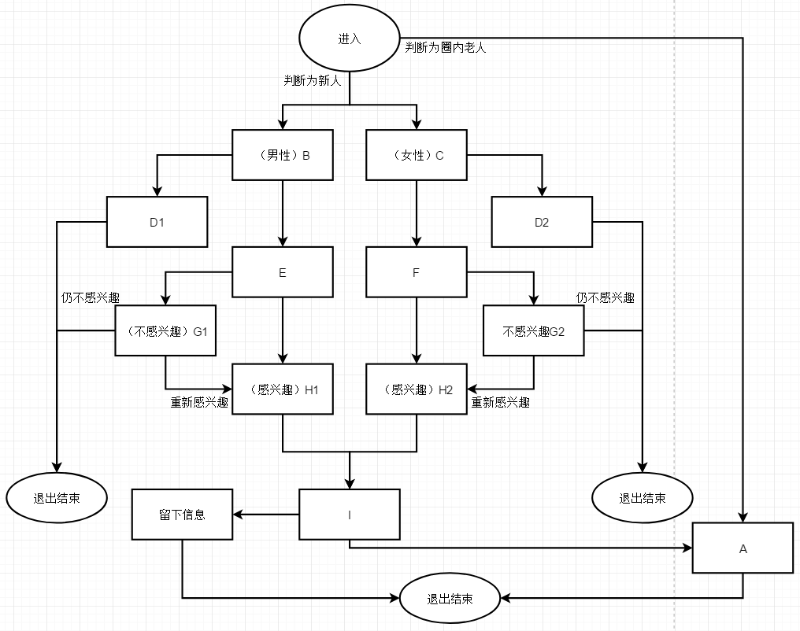

# “招新人”的问卷已提上日程，欢迎大家来提意见建议

作者：scale君

TID：31475

<title>1</title> <link href="../Styles/Style.css" type="text/css" rel="stylesheet">

# 1

*本帖最後由 scale君 於 2021-8-14 07:26 編輯*

主题为“拉新人入圈”的调查问卷正在筹划中，预期设计如下：第一部分：判断参与该调查问卷的人是否认识我或者已经在圈内。认识我或者圈内人导流至A第二部分：判断参与该调查问卷的性别，男导流至B，女导流至C。第三部分：判断参与调查问卷的生理年龄与心理年龄，生理年龄低于12岁或心理对性认知不足的人将导流至D1与D2，后续将提前结束问卷，不深入接触本次问卷内容。第四部分：年龄合适且对性有一定认知（至少知道什么是XP，自己有什么XP）的人将分别从B，C部分导流至E与F（本问卷目标用户）。第五部分：步步深入并引导E，F的人往gts相关方向联想，并列出各种gts互动片段任其欣赏，并在最后，判断是否对gts爱好感兴趣，不感兴趣者导流至G1，G2，此处为“为什么会产生gts幻想的介绍”，同时根据参与者选择将进一步看到相比前面更能挑起性欲的gts内容，在G1，G2最后，如果仍不感兴趣，将提前结束问卷；如果感兴趣，将与前面能够自然产生兴趣的人（或者说LSP）合流至H1，H2。第六部分：介绍圈子概况，作品与作者，圈子里的同好等（同时附带上足够有冲击力的gts图片或文字），并于最后合流为I，尝试让其添加我，或者留下联系方式。第七部分：走到I部分的人在最后会有“直接结束”，“进一步深入”，“添加好友”等选项。如果在阅读重口味警告后选择“进一步深入”，将导流至A，也就是圈内人看到的部分，该部分将不单纯讨论gts内容，而是gts的细化分支与情景详述，例如：巨大扶她，巨大furry，微观世界，超giga，寄生，无意识等，满足这些lsp的猎奇欲。顺带一提，这个A部分也是对[上一次问卷](https://giantessnight.com/gnforum2012/forum.php?mod=viewthread&tid=31306)的补完（上一次问卷中这些细化的内容相对较少）。
<title>2</title> <link href="../Styles/Style.css" type="text/css" rel="stylesheet">

# 2

 <ignore_js_op>[QQ图片20210814072521.png](forum.php?mod=attachment&aid=OTAzMTV8OGNjNjU3MDR8MTY3NDA2NTkwNHwxODIzMHwzMTQ3NQ%3D%3D&nothumb=yes) *(64.61 KB, 下載次數: 0)*

[下載附件](forum.php?mod=attachment&aid=OTAzMTV8OGNjNjU3MDR8MTY3NDA2NTkwNHwxODIzMHwzMTQ3NQ%3D%3D&nothumb=yes)

2021-8-14 07:26 上傳  

</ignore_js_op> <title>3</title> <link href="../Styles/Style.css" type="text/css" rel="stylesheet">

# 3

*本帖最後由 scale君 於 2021-8-14 06:56 編輯*

这次前来水这么一贴，原因有二其一，便是标题所写，希望大家在阅读一楼内容后，对该招新问卷提意见建议，什么样的都可以提，我会回复并视情况采纳。
如：
我希望问卷里能出现罩杯选项，记录参与问卷的妹子胸部大小。（当然，这种不太合适的建议不会采纳）
我希望问卷出来后发到贴吧，B站等公共平台。（需要考虑的建议，可能会添加限制后采纳）
我希望问卷里有sw相关内容（采纳，但占比不会多，这里毕竟是gts招新）
我希望XXX的作品/形象能够出现在问卷中（需要考虑的建议，建议先找到本人授权）
我希望问卷里有屎尿屁内容（需要考虑的建议，即使采纳也只可能是提上一嘴而已，不可能细谈，把新人吓到可不好）
……

原因之二则与上一次问卷有关：
截至8月14日早6点，公布该问卷前前后后也差不多有四周了，共有接近190份数据，尾部的30多份数据我没有再去筛选处理，往后也大概不怎么维护了，前面的数据已经形成了相对稳固的占比，个人觉得偶尔有一个两个捣乱的问题也不会很大。上个月月底，我曾说过要把8月1日前参与回答的个人答卷与总体数据报表通过QQ私发（因为包含QQ号与论坛名等隐私信息，避免骚扰）给大家，但最后因为技术原因没有实现（具体见[问卷原帖](https://giantessnight.com/gnforum2012/forum.php?mod=viewthread&tid=31306)），改为去除了含隐私的问题后公开展示。但事实上，我在告知大家无法实现之前把这件麻烦事在公司里吐槽了下，本来是想找一个合适的信息分发平台，但某位好心的前端妹子把这活揽了下来，这个月，她是白班我是夜班，就一两天交流一次的奇怪状态，慢慢把我想要的东西捣鼓出来了。（不过还是因为技术受限可能不太美观？）总之，这里是[链接](http://rat.h5.content.cc/)，请8月1日前参与过问卷的人（前100号问卷肯定可以登录）进来看看瞧瞧（填写QQ号进入，QQ号不对是进不去的，一人一份，后面是总结的数据报表）。我知道，这么多天过去了，大家对之前的问卷兴致可能没有那么高了，但还是请帮帮忙，我麻烦了人家，人家后台查看几天都没动静会很伤心的。<title>4</title> <link href="../Styles/Style.css" type="text/css" rel="stylesheet">

# 4

看着好复杂啊，但是你的作品酒后尿道监禁的我十分喜欢，如果还有后续内容就好了。 <title>5</title> <link href="../Styles/Style.css" type="text/css" rel="stylesheet">

# 5

> [scale君 發表於 2021-8-14 06:36](https://giantessnight.cf/gnforum2012/forum.php?mod=redirect&goto=findpost&pid=476480&ptid=31475)
> 这次前来水这么一贴，原因有二其一，便是标题所写，希望大家在阅读一楼内容后，对该招新问卷提意见建议，什 ...

关于原因二，我预计于24日关闭该通道，前期能力不足，后期宣传不足，也不知道有几位进去查看过该，唉，纯属破罐子破摔了，实在是非常抱歉。 <title>6</title> <link href="../Styles/Style.css" type="text/css" rel="stylesheet">

# 6

喔哦，刚看到这篇帖子。
我也做过类似的事。
去年朋友做一个校园app项目，我有点东西能帮上忙就被叫了。
跟他们说了想法，最后做出了有目的地对妹子用户（当时男的我不想管）推荐浏览一些不沾边但有点意思的内容，根据其行为和回复关键词等进行粗筛，有正反馈的不断深化推荐gts相关内容，中间包括图画版现实sm、crush体验、插画网站大佬制图、科普等（内容不断改进），最后进入有偿问卷调查（不能贵，0.5-3元，偶尔6元，钱多起疑非奸即盗），引导对gts相关的兴趣，但完全不涉及过分和莫名其妙无法自然联系的内容。
同时gts有偿问卷调查混杂在其他一堆调查里一起推给用户。
最后因为内容制作花费时间太长，前期内容链不完善，项目推进艰难等各种原因导致结果不理想。
有十几个妹子最后加到qq，但各种原因现在基本没再联系。
去年相关活动我们就已经停了。
当时在山东、河北、江苏地区五所高校和一个初中进行的，初中生对此更感兴趣，但参与太少。
结论是，建议先筛查可以接受偏S内容（注意是，可以接受，偏S内容）的女生更好，不要和性欲挂钩，那是培训成熟之后的最后一步。但初中生可以有小人进入阴道蹂躏的内容，她们有的会单纯对这种欺负惩罚小人的方式感兴趣，加上刚进入青春期。
gts毕竟是和性欲挂钩的东西，论坛自封，活力降低，我认为拉年轻人入伙刻不容缓。否则再过几年谁还有动力精力搞这些，到时候想找个地方玩论坛都已经凉了。 <title>7</title> <link href="../Styles/Style.css" type="text/css" rel="stylesheet">

# 7

> bottle 發表於 2021-8-22 13:06
> 喔哦，刚看到这篇帖子。
> 我也做过类似的事。
> 去年朋友做一个校园app项目，我有点东西能帮上忙就被叫了。

说实话就算论坛凉了除了少了些优质文章来源也不影响啥吧，外国人才是产出主力 <title>8</title> <link href="../Styles/Style.css" type="text/css" rel="stylesheet">

# 8

说真的，虽然很欣赏楼主的工作热情，不过我是感觉没啥必要搞这种问卷。现在网络这么发达，真正有兴趣的怎么都会找到组织的，就跟当年作为小学生的我一样，硬是凭借对央视西游记中的gts感兴趣学会了翻墙，然后加入gn <title>9</title> <link href="../Styles/Style.css" type="text/css" rel="stylesheet">

# 9

> [shenmegui 發表於 2021-8-22 21:55](https://giantessnight.cf/gnforum2012/forum.php?mod=redirect&goto=findpost&pid=477263&ptid=31475)
> 说真的，虽然很欣赏楼主的工作热情，不过我是感觉没啥必要搞这种问卷。现在网络这么发达，真正有兴趣的怎么 ...

但是，对妹子的向往是无法绕开的啊，很多时候能跟感兴趣或者完全不懂的妹子聊几句有关话题，甚至听她说出一些想听的话，这感觉比在网上找到什么资源强一百倍，哪怕根本没有以后。想和妹子说些什么，就只能主动出击啊，难道妹子会上门来问性癖嘛