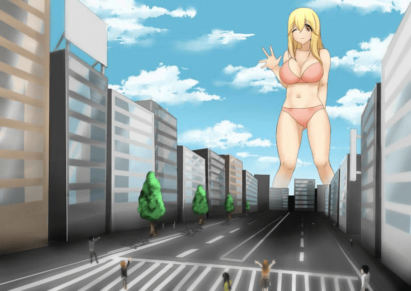
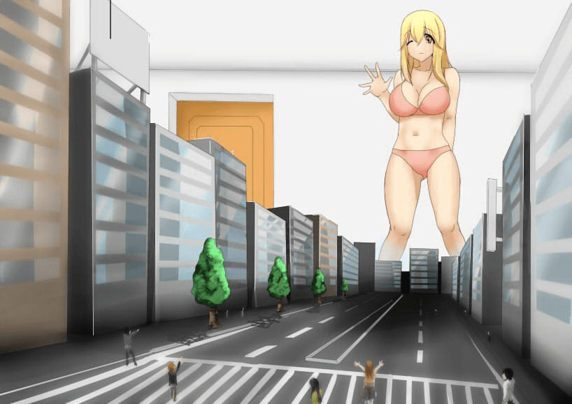

# 【提问交流】对成长变大和正常缩小的看法

作者：从此君王不早朝

TID：20505

<title>1</title> <link href="../Styles/Style.css" type="text/css" rel="stylesheet">

# 1

其实一直都有这个疑问
giantness  顾名思义是女巨人啦 但是这个女巨人 对于什么来说算是巨呢？
我一直都认为growth以后的巨大妹纸才算是女巨人 不过进GN以后 缩小的信息和作品也接触了不少
又有个新想法 对于缩小男/女来说 正常妹纸也算是女巨人啊
各有各爱好的感觉 于是在此问下各位 喜欢变大和缩小的原因 【主要是想交流啦！真的！】
P.S.我不是想挖谁的秘密 只是觉得交流有必要 保持论坛的活力是不~【希望不会给服务器添加太多压力
<title>2</title> <link href="../Styles/Style.css" type="text/css" rel="stylesheet">

# 2

我认识的女性大多喜欢变大系
而我认识的男性大多喜欢缩小系
其实很简单，就是人的自我中心思想在作怪
当女性变大的时候，她是唯一一个巨人，作为中心和主角，所以会享受这种感觉，而如果男性缩小，看谁都是巨人，女性并没有“突出”的心理
同样的，在男性来看，被缩小之后，他是唯一一个小人，作为中心和主角，所以会享受这种感觉，而如果女性变大，看谁都是小人，男性并没有“突出”的心理 <title>3</title> <link href="../Styles/Style.css" type="text/css" rel="stylesheet">

# 3

> [静儿_ 發表於 2016-1-31 14:18](https://giantessnight.cf/gnforum2012/forum.php?mod=redirect&goto=findpost&pid=281943&ptid=20505)
> 我认识的女性大多喜欢变大系
> 而我认识的男性大多喜欢缩小系
> 其实很简单，就是人的自我中心思想在作怪

这么说来的确是呢 那么喜欢futa那些同好们又是怀着一个念头来喜欢着这个爱好的呢
<title>4</title> <link href="../Styles/Style.css" type="text/css" rel="stylesheet">

# 4

> [米莉恩 發表於 2016-1-31 14:24](https://giantessnight.cf/gnforum2012/forum.php?mod=redirect&goto=findpost&pid=281944&ptid=20505)
> 这么说来的确是呢 那么喜欢futa那些同好们又是怀着一个念头来喜欢着这个爱好的呢
> ...

-因为自己没有，所以想要-
扶她的侵略感比较足吧，相对于塞进来，不如插进去更有侵犯和凌辱感
<title>5</title> <link href="../Styles/Style.css" type="text/css" rel="stylesheet">

# 5

是这个感觉吗 我到是认为 因为自身是男性但是向往巨女然后性转再然后@#$%^%%$....【我脑洞请见谅【够 <title>6</title> <link href="../Styles/Style.css" type="text/css" rel="stylesheet">

# 6

> [米莉恩 發表於 2016-1-31 14:32](https://giantessnight.cf/gnforum2012/forum.php?mod=redirect&goto=findpost&pid=281948&ptid=20505)
> 是这个感觉吗 我到是认为 因为自身是男性但是向往巨女然后性转再然后@#$%^%%$....【我脑洞请见谅 ...

也没吧，根据我这边喜欢扶她的两三个妹(bian)子(tai)来看，都是非常有侵略性的那种，所以大概是这样
<title>7</title> <link href="../Styles/Style.css" type="text/css" rel="stylesheet">

# 7

> 那么喜欢futa那些同好们又是怀着一个念头来喜欢着这个爱好的呢

我并不排斥futa···因为我很久以前一直以为女人是有小丁丁的···
···我很小的时候就一直是futa的世界观···
直到在女神上看见图之后我的世界观崩塌了···崩塌了···
适应了好几天呢···可是到现在依然觉得futa没什么呀 <title>8</title> <link href="../Styles/Style.css" type="text/css" rel="stylesheet">

# 8

我对于Giantess的看点是
growth型赛高！！！！！
缩小型太局限了，还是体型巨大到一个城市都能看见，这才算是giantess吧
缩小型再怎么样，它给人的绝望感与征服感太弱，还是growth适合我
额......缩小控的同好可别来打我啊，只是仅仅说一下观点，
萝卜青菜各有所爱，求别打 <title>9</title> <link href="../Styles/Style.css" type="text/css" rel="stylesheet">

# 9

表示喜欢多重 变大跟缩小一起来 就不用纠结了 <title>10</title> <link href="../Styles/Style.css" type="text/css" rel="stylesheet">

# 10

我喜欢巨大化的妹纸呢。。缩小男的话。。感觉没法展现那种强势感，越大越有感觉啊~~ <title>11</title> <link href="../Styles/Style.css" type="text/css" rel="stylesheet">

# 11

吞食控吞食控吞食控吞食控吞食控吞食控吞食控吞食控吞食控吞食控吞食控吞食控，让这个世界来感受我强烈而又可怕的怨念吧！ <title>12</title> <link href="../Styles/Style.css" type="text/css" rel="stylesheet">

# 12

> [Luffy 發表於 2016-1-31 17:03](https://giantessnight.cf/gnforum2012/forum.php?mod=redirect&goto=findpost&pid=281982&ptid=20505)
> 吞食控吞食控吞食控吞食控吞食控吞食控吞食控吞食控吞食控吞食控吞食控吞食控，让这个世界来感受我强烈而又 ...

吞食控没有互动？那不过是无聊的偏见，妹子腹内的每一秒都是互动，最好的身体接触，你啊，图样图森破

<title>13</title> <link href="../Styles/Style.css" type="text/css" rel="stylesheet">

# 13

> [静儿_ 發表於 2016-1-31 14:18](https://giantessnight.cf/gnforum2012/forum.php?mod=redirect&goto=findpost&pid=281943&ptid=20505)
> 我认识的女性大多喜欢变大系
> 而我认识的男性大多喜欢缩小系
> 其实很简单，就是人的自我中心思想在作怪

并不赞同……

就我而言，我的关注点在于女性，所以更倾向前者……
<title>14</title> <link href="../Styles/Style.css" type="text/css" rel="stylesheet">

# 14

> [静儿_ 發表於 2016-1-31 14:18](https://giantessnight.cf/gnforum2012/forum.php?mod=redirect&goto=findpost&pid=281943&ptid=20505)
> 我认识的女性大多喜欢变大系
> 而我认识的男性大多喜欢缩小系
> 其实很简单，就是人的自我中心思想在作怪

我插一句感想好了，原来静儿的同好朋友圈里，男性喜欢缩小系的比较多吗？那看来我算是不太随大流的那种？GTS相关我是压倒性的喜欢巨大女性派的，我的心理则是GTS只和一个或几个缩小人相比时，压迫感、统治感不足，就是缩小系中GTS可以享受的世界只有那么一点，跟大部分其他人相比还只是个普通女生。那还是一下统治很多人更有感觉些，所以自己变大，整个世界她都可以随便玩弄，而且，我觉得跟巨大女生作为对比，脚边除了小人，有建筑物和山作对比更让我觉得兴奋。
<title>15</title> <link href="../Styles/Style.css" type="text/css" rel="stylesheet">

# 15

屈辱感的强烈程度不同而已。
参考如下图所示，哪张里的小人更恐惧更无助呢？
哪张里的GTS更可以为所欲为呢？

<ignore_js_op>

**46147164_p0.jpg** *(122.27 KB, 下載次數: 0)*

[下載附件](forum.php?mod=attachment&aid=NTg5NDB8YjQ0NzJhODV8MTY3NDA2ODA2MnwxODIzMHwyMDUwNQ%3D%3D&nothumb=yes)

2016-1-31 19:21 上傳

<ignore_js_op>

**46147164_p1.jpg** *(101.67 KB, 下載次數: 0)*

[下載附件](forum.php?mod=attachment&aid=NTg5NDF8ZjM3MmM4ZjR8MTY3NDA2ODA2MnwxODIzMHwyMDUwNQ%3D%3D&nothumb=yes)

2016-1-31 19:21 上傳

<title>16</title> <link href="../Styles/Style.css" type="text/css" rel="stylesheet">

# 16

我也算是喜欢变大系呢 缩小什么的不太感冒 <title>17</title> <link href="../Styles/Style.css" type="text/css" rel="stylesheet">

# 17

縮小系+1..畢竟是從"親愛的我把孩子縮小了"啟蒙的
而且縮小有個好處就是主角獨佔女性的可能較大(巨大化後不弄一堆小人就沒感覺了)
更別說還可以換個女性體驗
壞處就是有機會碰到巨大男性
不過作者應該不大會故事放男性入場(頂多一進來就被縮小了) <title>18</title> <link href="../Styles/Style.css" type="text/css" rel="stylesheet">

# 18

> [暗影使者 發表於 2016-1-31 14:47](https://giantessnight.cf/gnforum2012/forum.php?mod=redirect&goto=findpost&pid=281955&ptid=20505)
> 我并不排斥futa···因为我很久以前一直以为女人是有小丁丁的···
> ···我很小的时候就一直是futa的世 ...

论性教育普及的重要性
<title>19</title> <link href="../Styles/Style.css" type="text/css" rel="stylesheet">

# 19

縮小跟變大都可以
只是縮小的話最好是整個世界的男性都縮小
不然會讓我意識到還有正常大小的男性在 <title>20</title> <link href="../Styles/Style.css" type="text/css" rel="stylesheet">

# 20

看了这么多评论好像大多数的人都喜欢巨大阿 然而我喜欢缩小多一点 喜欢变成小熊被妹子抱着那种感觉 是因为我少女心发作么。。   <title>21</title> <link href="../Styles/Style.css" type="text/css" rel="stylesheet">

# 21

以前的话的确是喜欢变大的属性，那样感觉对比冲击比较强力，但是后来就发现缩小也一样可以玩得很high嘛，都是各种文章以及MMD耳熏目染的关系……唉，总之，只要能刺激到点上就好了嘛 <title>22</title> <link href="../Styles/Style.css" type="text/css" rel="stylesheet">

# 22

*本帖最後由 861861861 於 2016-2-1 03:14 編輯*

我是只喜欢相对体积差、巨大和缩小对我个人来说都没有太大区别、不过看了楼上几个缩小不如巨大的理由、我忍不住要出来替缩小控说两句了、、
**就互动而言、巨大女性可以办到的事情、拥有缩小能力的女性全部都可以办到、**

巨大女性可以毁灭城市、毁灭国家、毁灭星球、这不需要解释。

但是缩小系的作品里、妹子同样可以把、缩小城市、缩小大陆、缩小星球带回家玩弄、如果可以的话、将整个宇宙缩小带回家捏碎也是可以做到的、

巨大女性无限巨大化所换来的压迫感、正常大小的少女同样也可以把世界任何一个角落无限缩小化、从而换取同样的压迫感。

所以你们所说的缩小系的的局限性：压迫感不足、可以享受的世界小、这些理由、没有说服力啊= =

另外[缩小系文章]不等于[缩小男文章]、这里请自行屏蔽[被妹妹调教的日记]等一系列以男主角为中心的文章、缩小系文章完全可以没有男主角、少女和缩小的城市就是互动的双方、少女的房间或者教室等封闭的空间就是世界的整体、在这个世界中少女（或少女们）就是等同于女巨人的存在、

**这里并不是说巨大=缩小、**只是想单纯的反驳一下不了解缩小系作品的同好对缩小作品的一些误解性言论、

硬要说缩小和巨大的不同之处：1.缩小系的作品、少女往往都会偷偷将城市什么的缩小带回家慢慢玩弄、破坏和杀戮也都是在少女的房间里悄悄进行、这样的环境对小人来说会有一种囚禁感、我个人还挺喜欢这种感觉的、

2.巨大化的女性不一定会对小人们产生敌意、可是只是因为意外而巨大化、而把特意把城市缩小带回家的女生..这个目的就不怎么单纯了、所以站在小人的角度来看、后者更让人感到恐惧、

<title>23</title> <link href="../Styles/Style.css" type="text/css" rel="stylesheet">

# 23

缩小系，而且不喜欢多角色play ,就是女主缩小一堆人带回住所。
看gn的好多问就能看出来，一开始是一对一一对二...知道女神开始信仰自己的能力以后就出去狩猎，结果文章的质量开始大大下降（也许这只是我的一家之辞，不要喷不要喷）。
一对一的paly更能体现出细节性，给人更大的的性快感，同时更加生动。
要是笼统起来就靠脑补了.... <title>24</title> <link href="../Styles/Style.css" type="text/css" rel="stylesheet">

# 24

巨大系有几个缩小系没有的硬伤：
1\. 巨大化后何去何从？GTS作为女性的本体，生活和生存都成问题了。
2\. 毁坏和杀戮的目的是？万一又变回原样了怎么办？
3\. 与整个世界为敌，肯定要考虑到理由和后果的，除非她来自另一个世界。

以上几点问题，缩小系都不存在，所以相对来讲，缩小系的实用性和故事展开更容易。 <title>25</title> <link href="../Styles/Style.css" type="text/css" rel="stylesheet">

# 25

> [861861861 發表於 2016-2-1 01:09](https://giantessnight.cf/gnforum2012/forum.php?mod=redirect&goto=findpost&pid=282065&ptid=20505)
> 我是只喜欢相对体积差、巨大和缩小对我个人来说都没有太大区别、不过看了楼上几个缩小不如巨大的理由、我忍 ...

是的，论小人的屈辱感，和GTS的支配感，缩小系比巨大系更强烈，更符合逻辑，更有真实性和可操作性。

上面那个帖子是我的一点补充。
<title>26</title> <link href="../Styles/Style.css" type="text/css" rel="stylesheet">

# 26

縮小屬性對我來說直接OUT
只有Growth能贏得我的青睞
我喜歡那個得到力量後發狂的感覺 <title>27</title> <link href="../Styles/Style.css" type="text/css" rel="stylesheet">

# 27

两边都好吧，两者的优缺点在上面都说完了，要我选的话……两者合一最好；只能选一个的话……growing那边吧 <title>28</title> <link href="../Styles/Style.css" type="text/css" rel="stylesheet">

# 28

缩小  不满足我的欣赏观  我喜欢mini   growth  就是身高不超过10倍的  最好1.5~3倍之间  个人认为  那样最带感 <title>29</title> <link href="../Styles/Style.css" type="text/css" rel="stylesheet">

# 29

这个不是首先应该是巨大化的妹子够萌吗。虽然个人更偏好变大系的 <title>30</title> <link href="../Styles/Style.css" type="text/css" rel="stylesheet">

# 30

就感觉变得越大越好，没什么理由 <title>31</title> <link href="../Styles/Style.css" type="text/css" rel="stylesheet">

# 31

以前挺喜欢巨大化的文章和图片啊什么的~
      后来觉得缩小系的更合我的胃口一点啊……
  怎么说呢……抛开一些很实际的问题  感觉缩小其实是单方面被动  巨大化是单方面主动一些……
     估计是作为被动的一方很难会发生一对一的互动吧……  巨大化吸引我的就是破坏的过程
  所以觉得缩小更合胃口些 <title>32</title> <link href="../Styles/Style.css" type="text/css" rel="stylesheet">

# 32

其实爱都是自私的！所以我还是喜欢缩小 <title>33</title> <link href="../Styles/Style.css" type="text/css" rel="stylesheet">

# 33

因为崇拜女性啊。。。
同时当女生给人的安全感在身体上也具现出来不是太赞了么。。。 <title>34</title> <link href="../Styles/Style.css" type="text/css" rel="stylesheet">

# 34

> [861861861 發表於 2016-2-1 01:09](https://giantessnight.cf/gnforum2012/forum.php?mod=redirect&goto=findpost&pid=282065&ptid=20505)
> 我是只喜欢相对体积差、巨大和缩小对我个人来说都没有太大区别、不过看了楼上几个缩小不如巨大的理由、我忍 ...

        非常赞同，一直觉得缩小系列给人的屈辱无助感更强烈。。。
巨大化的妹子温柔系，天然系的成分比较多，不排除暴虐，重点突出女性个体与城市关系，关键在于处理事后的发展比较麻烦，很难有续作，个体只能通过再变大来衬托，需要脑补来进行。比较空洞化。。。

而缩小系作品的妹子，大都处理自己的欲望，腹黑，虐待，监禁。可以给与更多的无助感，而且对于只选择男性更方便理解。会有更多的属性剧情在里面，例如妹子在不知情的情况下互动等等。而且贴近生活，更具真实感。角色代入感会更强烈。作者写作也比较轻松，容易润色。

如果说巨大妹子能给予的是衣物：鞋子，罩子，内内。还有身体，性器的互动感的话。一个个体的神圣感，更类似神一般的庞大存在。。（更倾向于怪兽侵略的感觉）

缩小系便在此基础上增加了现实卑微感，与妹子周边原本你认为的微不存在的事物，突然冲击你的五感，加剧认识到自己的渺小，妹子越是平凡，凸显自己越是卑微，想向周围求助，却无法办到。例如妹子常用的便器，厕纸篓之类的。。

所以，巨大侧重内心烘托出一个神。缩小侧重内心卑微的情感。
<title>35</title> <link href="../Styles/Style.css" type="text/css" rel="stylesheet">

# 35

感觉还是高大的女孩有更大的诱惑力~~ <title>36</title> <link href="../Styles/Style.css" type="text/css" rel="stylesheet">

# 36

我比較喜歡縮小，在女人身上探索，在女生不經意或是無意識的動作中掙扎的感覺</ignore_js_op></ignore_js_op>