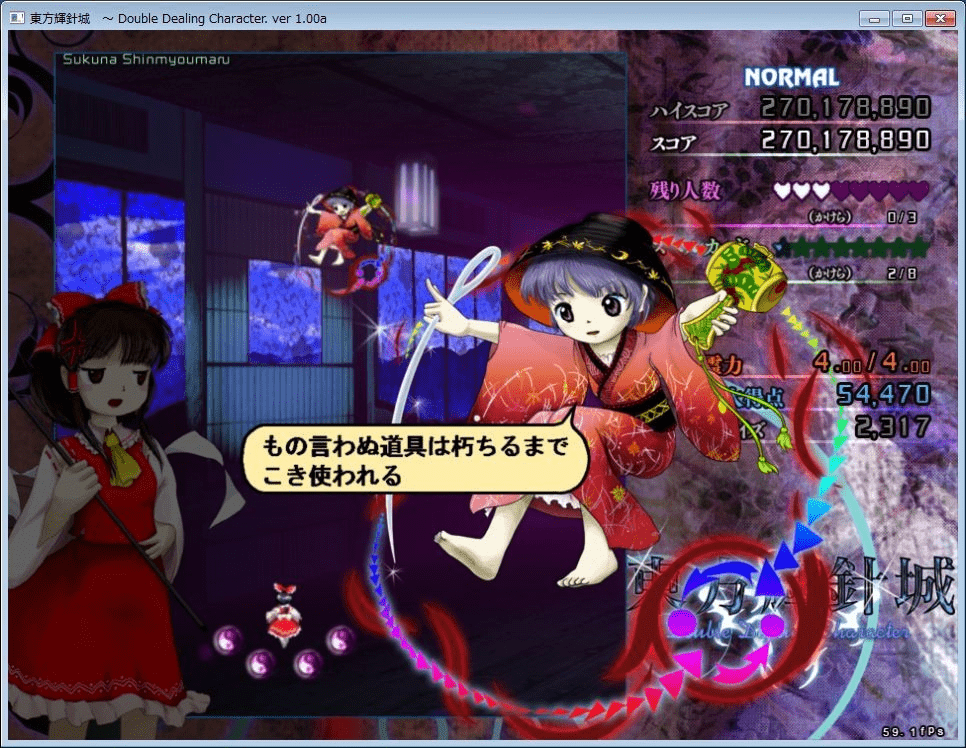

# [東方]輝針城六面boss 確認原型是一寸法師

作者：colouur

TID：14979

<title>1</title> <link href="../Styles/Style.css" type="text/css" rel="stylesheet">

# 1

*本文章最後由 killer9999 於 2013-8-12 20:04 編輯*

<ignore_js_op>

**remy26748.jpg** *(191.48 KB, 下載次數: 0)*

[下載附件](forum.php?mod=attachment&aid=MzU4MjV8MzY0NjBhNTJ8MTY3NDA2ODQ3N3wxODIzMHwxNDk3OQ%3D%3D&nothumb=yes)

2013-8-12 12:12 上傳

稱號: 小人的末裔
姓名: 少名針妙丸
種族: 小人
能力: 使用萬寶槌程度的能力

手上拿的正是傳說中的前鬼族寶具 萬寶槌
只要拿著許個願然後搖搖 你的一切願望便都會實現(

她制造異變的目的是為小人族報復 又稱下克上(她們自己說的

符卡名
小槌"給我變大吧"
妖劍"輝針劍"
小槌"把你變大吧"
進擊的小人

終符名字暫時不明

簡單來說就是 現在可以光明正大的來巨大化梗了(夠
再配合五面天邪鬼的設定 媽媽再也不用擔心OOC(天邪鬼原型便是偽裝本人 然後去害人
<title>2</title> <link href="../Styles/Style.css" type="text/css" rel="stylesheet">

# 2

巨大化梗不是有蘑菇和某只鬼吗 <title>3</title> <link href="../Styles/Style.css" type="text/css" rel="stylesheet">

# 3

> archer 發表於 2013-8-12 12:49 
> 巨大化梗不是有蘑菇和某只鬼吗

西瓜只能給自己上縮小和巨大化啦
<title>4</title> <link href="../Styles/Style.css" type="text/css" rel="stylesheet">

# 4

这次是万能向巨大/缩小梗,不要更赞( <title>5</title> <link href="../Styles/Style.css" type="text/css" rel="stylesheet">

# 5

だ…駄目だ　まだ笑うな…こらえるんだ…し…しかし…

話說，看到日本生放送上，有人打

"女孩子版的一寸法師，不就是親指姬(姆指姑娘)嗎"
<title>6</title> <link href="../Styles/Style.css" type="text/css" rel="stylesheet">

# 6

这回真是可以名正言顺的缩小和巨大化了（笑），东方控表示一本满足啊 <title>7</title> <link href="../Styles/Style.css" type="text/css" rel="stylesheet">

# 7

坐等正作发布之后开打... <title>8</title> <link href="../Styles/Style.css" type="text/css" rel="stylesheet">

# 8

貌似很给力的样子 <title>9</title> <link href="../Styles/Style.css" type="text/css" rel="stylesheet">

# 9

祈祷本子能多出点..同人大神们,向她开炮吧. <title>10</title> <link href="../Styles/Style.css" type="text/css" rel="stylesheet">

# 10

其实有个剧情基本可以预料到.
一寸的锤子和鬼有关,而西瓜可以变大变小...那么这本gts本是跑不了了? <title>11</title> <link href="../Styles/Style.css" type="text/css" rel="stylesheet">

# 11

瀨尾可以有更大空間發揮了 <title>12</title> <link href="../Styles/Style.css" type="text/css" rel="stylesheet">

# 12

[http://giantessnight.com/gnforum ... hread&tid=14517](http://giantessnight.com/gnforum2012/forum.php?mod=viewthread&tid=14517)
不知如何，突然想到这篇了。。。 <title>13</title> <link href="../Styles/Style.css" type="text/css" rel="stylesheet">

# 13

> shendanxiaogui 發表於 2013-8-13 02:00 
> http://giantessnight.com/gnforum2012/forum.php?mod=viewthread&tid=14517
> 不知如何，突然想到这篇了。。 ...

萬寶槌本來就是常見的縮小用neta,只不過現在變一設了而已(

<title>14</title> <link href="../Styles/Style.css" type="text/css" rel="stylesheet">

# 14

哎呦喂，看来我在某东方论坛看到的预测居然成真了吗？目前只有三面很不爽……
可以开始期待同人了，虽然感觉西瓜的同人不是很多~
一寸法师在日本真是衍生了好多gts 啊 <title>15</title> <link href="../Styles/Style.css" type="text/css" rel="stylesheet">

# 15

看來可以期待將來更多的同人作了www <title>16</title> <link href="../Styles/Style.css" type="text/css" rel="stylesheet">

# 16

问何时发布？极其期待啊！ <title>17</title> <link href="../Styles/Style.css" type="text/css" rel="stylesheet">

# 17

*本文章最後由 sidefx 於 2013-8-23 08:05 編輯*

C85サイズ本予定（好快）
[http://gs-uploader.jpn.org/documents/tapioka/C85cut.png](http://gs-uploader.jpn.org/documents/tapioka/C85cut.png)
[http://gs-uploader.jpn.org/bbs_html/1337101342.htm?range=l20](http://gs-uploader.jpn.org/bbs_html/1337101342.htm?range=l20)

一上來就是針妙丸巨大化啊

到時針妙丸X正邪的本子應該也會有的，像這种感覺的:
[http://www.pixiv.net/member_illust.php?mode=medium&illust_id=37896796](http://www.pixiv.net/member_illust.php?mode=medium&illust_id=37896796)

這一作生足真多

形勢一片大好

另外，目測丰胸這個梗会被玩坏  (-_-;)
[http://www.pixiv.net/member_illust.php?mode=medium&illust_id=37829650](http://www.pixiv.net/member_illust.php?mode=medium&illust_id=37829650)

<title>18</title> <link href="../Styles/Style.css" type="text/css" rel="stylesheet">

# 18

这是什么？永夜抄么？ <title>19</title> <link href="../Styles/Style.css" type="text/css" rel="stylesheet">

# 19

东方又有个新的GTS素材了= =。 以前只有某只鬼原设有GTS因素 <title>20</title> <link href="../Styles/Style.css" type="text/css" rel="stylesheet">

# 20

为什么这么久了还是没出多少这类的，我一直很期待的 <title>21</title> <link href="../Styles/Style.css" type="text/css" rel="stylesheet">

# 21

很喜欢东方系列的 <title>22</title> <link href="../Styles/Style.css" type="text/css" rel="stylesheet">

# 22

A... 東方輝針珹... very... hahaha...
she so....

ha....</ignore_js_op>