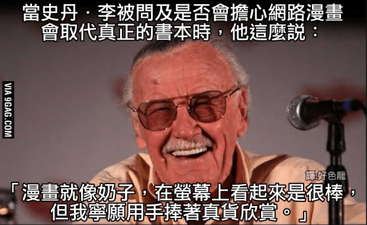

# 【某熬夜党的无能狂怒】在推特上貌似被濑尾讨厌了。

作者：神奈川

TID：26359

<title>1</title> <link href="../Styles/Style.css" type="text/css" rel="stylesheet">

# 1

*本帖最後由 spacewolves 於 2019-1-31 03:13 編輯*

rt，虽然我嘴上说着不在乎，以后也不回复，但是今天看到他发了我感兴趣的内容还是想说点什么。不知道是我不会说日语用英语回复还是怎么回事，他对我的回复是一概不理的，前几天有人赞了我的回复后我回去一看，发现那条帖子里所有人他都回了，包括只打了几个字的。当时也是因为找工作的事气头上，决定以后就只搬他的图，不说什么了。
今天想了想，还是觉得应该做点什么，于是在他的下面道了个歉，用英语和机翻日语都发了，其实以前用英语和他说话他也回的，而且我不觉得他看不懂英语。要真是我做错了什么，我会改，如果是嫌我烦，我会做个安静的观众。
我已经做好被骂或是被他屏蔽的准备了，如果事情真这样发展，我想我也没必要再去一天到晚在推特上看@Seo_t发表了什么图片了，也不会再去搬图了（交给妮群dalao来吧）。大概就这样。 <title>2</title> <link href="../Styles/Style.css" type="text/css" rel="stylesheet">

# 2

然后事情如果往坏的方面发展，我恐怕还得算算会得罪多少日本的圈内人，不知道会不会顺带影响到会搭理我的uru、黑乌龙和@ABzome（3倍舰娘那位）的关系。要真是这样，恐怕我在推特上的gts圈也混不下去了吧.......但摩耶那本还是要买的，就当退圈纪念吧。 <title>3</title> <link href="../Styles/Style.css" type="text/css" rel="stylesheet">

# 3

這件事告訴我們
「潛水就潛水，不要沒事出來露臉裝熟」

這麼講似乎有點過份了
不過依照我現實中的經驗
「話太多會出事」
<title>4</title> <link href="../Styles/Style.css" type="text/css" rel="stylesheet">

# 4

一般来说如果实在不会日语的话用英语回复没什么问题吧，除非作者明确说禁止英语，毕竟是国际化语言。Twitter上不成文规定其实蛮多的，比如说不要随便at或者私信别人之类的，当然也有很多人不在乎就是了。我觉得推主不回复下面留言倒是蛮正常的行为，有的时候也就赞一下，或者干脆看一下就算，还有Twitter上是有拉黑功能的。虽然很多人可能不用。所以个人觉得不回留言并不算是被讨厌了吧。相反如果因为这种事情去质问对方反而会被讨厌。 <title>5</title> <link href="../Styles/Style.css" type="text/css" rel="stylesheet">

# 5

看来你是对日圈还不够了解的小白而已……很排外的，除非你也是画师，没事就别去舔人家了，根本就不理你，除非你是画师（再次） <title>6</title> <link href="../Styles/Style.css" type="text/css" rel="stylesheet">

# 6

> [weiwenjiao 發表於 2019-1-31 07:09](https://giantessnight.cf/gnforum2012/forum.php?mod=redirect&goto=findpost&pid=395852&ptid=26359)
> 看来你是对日圈还不够了解的小白而已……很排外的，除非你也是画师，没事就别去舔人家了，根本就不理你，除 ...

看来一直很热情的uru和另外一位莫非是盯上了我的钱包？
<title>7</title> <link href="../Styles/Style.css" type="text/css" rel="stylesheet">

# 7

> [spacewolves 發表於 2019-1-31 07:51](https://giantessnight.cf/gnforum2012/forum.php?mod=redirect&goto=findpost&pid=395855&ptid=26359)
> 看来一直很热情的uru和另外一位莫非是盯上了我的钱包？

啊对……还有金主爸爸…人家只是看中你的钱呀…请继续支持我！很真实的
<title>8</title> <link href="../Styles/Style.css" type="text/css" rel="stylesheet">

# 8

> [weiwenjiao 發表於 2019-1-31 07:56](https://giantessnight.cf/gnforum2012/forum.php?mod=redirect&goto=findpost&pid=395856&ptid=26359)
> 啊对……还有金主爸爸…人家只是看中你的钱呀…请继续支持我！很真实的
> ...

那看来以后我该去支持谁已经显而易见了。
<title>9</title> <link href="../Styles/Style.css" type="text/css" rel="stylesheet">

# 9

  没有推特账号也没用过推特的路过。。。这东西必须翻墙才能用啊。。。还挺卡的 还是P站好 <title>10</title> <link href="../Styles/Style.css" type="text/css" rel="stylesheet">

# 10

> [spacewolves 發表於 2019-1-31 07:51](https://giantessnight.cf/gnforum2012/forum.php?mod=redirect&goto=findpost&pid=395855&ptid=26359)
> 看来一直很热情的uru和另外一位莫非是盯上了我的钱包？

你有追URU的Patreon就知道他英文程度很不錯，互動難度低當然比較熱情 (而且他有過憂鬱症，被社會拋棄的恐懼比較深吧)

而獺尾……我不知道欸，可能是有大和民族情節或者是你真的講了什麼正常人不會想鳥的話吧，不是靠這行吃飯的人懶得恭維很稀鬆平常啊

<title>11</title> <link href="../Styles/Style.css" type="text/css" rel="stylesheet">

# 11

> [3213213210 發表於 2019-1-31 13:21](https://giantessnight.cf/gnforum2012/forum.php?mod=redirect&goto=findpost&pid=395871&ptid=26359)
> 你有追URU的Patreon就知道他英文程度很不錯，互動難度低當然比較熱情 (而且他有過憂鬱症，被社會拋棄的恐 ...

因为我喜欢做最坏打算，所以这件事情我就把责任归咎于我吧。反正通过这件事情也让我知道了以后该和什么人说话，重点是也让我弄明白了以后该赞助谁，买谁的DL。
<title>12</title> <link href="../Styles/Style.css" type="text/css" rel="stylesheet">

# 12

> [allocen 發表於 2019-1-31 14:44](https://giantessnight.cf/gnforum2012/forum.php?mod=redirect&goto=findpost&pid=395877&ptid=26359)
> 理不理你是人家的自由，买谁的DL支持谁也是你的自由。但是不要试图把这无关的两者用所谓的逻辑链接起来。做 ...

怎么没关系了？你讲的没错，一件是他的事，一件是我的事，但是两者一起看对于我来说我更愿意去和愿意和我交流的人交流，更愿意去支持他们。再说了，这也能扯上心术不正，光明正大是不是有点远？ <title>13</title> <link href="../Styles/Style.css" type="text/css" rel="stylesheet">

# 13

> [allocen 發表於 2019-1-31 14:44](https://giantessnight.cf/gnforum2012/forum.php?mod=redirect&goto=findpost&pid=395877&ptid=26359)
> 理不理你是人家的自由，买谁的DL支持谁也是你的自由。但是不要试图把这无关的两者用所谓的逻辑链接起来。做 ...

或者说直白点，因为这件事情我没那么喜欢他了，当然他对我咋样是他的自由，反正他也不缺我一个。那我自然会去选择去赞助其他对我热情点的作者，乃至向我打广告的，这个想法真到了阴阳怪气心术不正的地步？
<title>14</title> <link href="../Styles/Style.css" type="text/css" rel="stylesheet">

# 14

> [marinefordet 發表於 2019-1-31 18:14](https://giantessnight.cf/gnforum2012/forum.php?mod=redirect&goto=findpost&pid=395893&ptid=26359)
> 該不會是你太敏感了吧。。。

希望是我太敏感了，嘛，毕竟某条图片贴里7条回复他回复了6条其中比我早和晚的都有，回复内容比我短，就个形容词的也有，唯独没动静的是我的。现在我已经接受了我不是他们圈里人的事实了。
<title>15</title> <link href="../Styles/Style.css" type="text/css" rel="stylesheet">

# 15

放宽点心
如果作者本人互动8是很行的话就单看作品呗
毕竟作品本身还是很棒的嘛 <title>16</title> <link href="../Styles/Style.css" type="text/css" rel="stylesheet">

# 16

热脸贴冷屁股是很常见的事，无论什么时候都不要当舔狗，总是反思自己，不一定是你的问题。画师除了作画也不过就是个普通人，可能人品一般或者人格有缺陷很正常。 <title>17</title> <link href="../Styles/Style.css" type="text/css" rel="stylesheet">

# 17

咱们看的是作品又不是作者 <title>18</title> <link href="../Styles/Style.css" type="text/css" rel="stylesheet">

# 18

就一個局外人.我覺得我不應該在這邊留言.而且我下面說的八成也不是樓主你"**想聽**"的內容.但看到你的敘述又讓我癢癢得想打些字來抒發一下(大概是也發生過類似的事情在身上的關係←儘管實際上差很多
首先因為晚來的關係.原文已經修改過了(吧?).所以老實說樓主你敘述的內容.我感覺不到整件事情的因果關係.所以大概猜測是
樓主有贊助瀨尾老師.並在其推特上發言的習慣→但瀨尾老師對你的回覆似乎不以為意（這兒不清楚的是你做了什麼讓瀨尾老師"**最近**"不理你.還是打"**一開始**"他就不鳥你）→因為其他回覆者都有得到回應.唯獨自己沒有的樣子.感覺到受傷與不被尊重(認為被單方面討厭了?)→現在在這裡:上論壇抒發不滿情緒(不太尊重的用語:就是討拍)

有誤請指出.因為整件事情敘述個人覺得沒頭沒尾.但不管怎樣都不影響以下自己個人見解而已.再一次重複.**"個人見解**.我說得不完全是正確的.因為情緒與待人處事每個人標準不同.只是單純我覺得這件事情怎樣怎樣而已.不需要放大解釋.打字抒發情緒的成分居多

首先從標題的討厭說起.我個人覺得用**討厭**這兩個字有點太嚴重了些.因為討厭的情緒反應比較大.所以回饋出來的反應也會更明顯與激烈.如果瀨尾老師真的打從心底討厭你.大可封鎖或移除你的粉絲關注.當然會討厭到這種程度也代表你應該是做了些非常讓人反感的事情才會做得這麼絕就是.單純被無視我覺得離討厭是有段距離的.畢竟無視的理由可以很多.而且有時候真的不是故意或特別針對人的

另一個關鍵就是
>不知道是我不会说日语用英语回复还是怎么回事
樓主用英語回覆這當中就可以牽扯出很多的假想來假定為什麼瀨尾老師不理你
1.也許瀨尾老師英文很爛或程度很低.太複雜的英文他看不懂或懶得看.就無視了(純粹嫌麻煩.當然禮貌上給個"Thank you"是比較妥當的.
2.也許樓主回覆的內容有打到瀨尾雷點.讓他不想回覆(也許你覺得不是問題.但瀨尾老師很討厭.
3.跟上面有人提到的一樣.純粹瀨尾老師對外國人的回覆比較冷淡或不知道該說啥才好.但日本人排外這也不太算是問題就是.畢竟華人自己都有點排日了.所以...(噓wwwwww再說下去不好不好
4.瀨尾老師個性內向不喜歡跟陌生人聊天.所以無視你的回覆也是情有可原的

假設真相是上述其中一點.那我覺得這無視很正常.理由很充分也不是多過分的理由.頂多就是有點不太"厚道".對人處事不成熟而已

(本來同人繪師就百百種.有人是當職業.也有人只是業餘的.如果是後者的情況.對粉絲不太熱情也不奇怪了.畢竟對當事人而言可能只是興趣.不想花太多心力去管理
但假設瀨尾老師是在你留日文(機翻日文除外.因為有時候讀起來不通順.反而人家看不懂)或你認識他本人(私下聊過天)的情況下.卻有這樣的回應.那就真的挺無情或有特別針對性了.但再怎麼樣要發展成

>事情如果往坏的方面发展，我恐怕还得算算会得罪多少日本的圈内人，不知道会不会顺带影响到会搭理我的uru、黑乌龙和@ABzome（3倍舰娘那位）的关系。要真是这样，恐怕我在推特上的gts圈也混不下去了吧

我是覺得想太多了.姑且不論樓主對日本GTS圈有多麼了解(只是單純在推特上跟繪師互動不算喔.除非你跟她們都是能私下聊天的好朋友).就算瀨尾真討厭你.真要做得這麼絕也太小家子氣了...說不准人家只是覺得你是有點煩人的粉絲而已.

上述是瀨尾老師的假設觀點.要說客觀是完全沒有.畢竟論壇沒半個人真正認識瀨尾老師.所以我們頂多只能用猜測來推判.不過就假設是最糟糕的情況.我"個人"也不覺得瀨尾老師做了什麼失禮的事情.當然這個大前提是樓主僅僅只是支助者與粉絲之一.而非親密友人的關係.

總結上述一堆廢話.基本上我只是要表達一件事就是"瀨尾老師不理人樓主的推特回覆".不是啥特別嚴重的事情(至少我覺得攤出來討論是有點太過頭了點).甚至他不理你可能只是無心而非故意的舉動

再來說說整件事的第二個主事者.也就是樓主本身.而主要戳到我的其實就是這句回覆
>重点是也让我弄明白了以后该赞助谁，买谁的DL
這句話應該是氣話居多啦.但我還是要說一下.贊助=/=你可以藉此從作者身上得到任何東西(無論有形無形)

首先贊助(這裡純指支援繪師就好)主要就是一種互利交換.例如fantia的月費贊助.我給錢然後可以獲得一些不公開的圖片作為福利.一手交錢一手交貨.很正常的商業行為.但除此之外.贊助真正的價值是能明確交粉絲的心意傳達給作者.畢竟要表現你對一個作品的愛.最簡單也是最直接的方法就是...錢.沒錯.錢.很膚淺又很現實的東西.但用錢買來的本子與網路白嫖來的資源.給予的精神回饋就是有差.因為你花了錢買你能切確且真實的給予作者力量與再創作的動力.說得誇張一點就是."因為我的錢化為作者的力量.才有了之後的創作喔".即自己也成為了作者的一部分似的.除了明確的付ˋ出外.也能凸顯出與其他白嫖眾的身分差別(有錢的大佬給跪啦...).從中獲得自我認同與...一點點的虛榮心?
<ignore_js_op>

**57spGx8.png** *(417.95 KB, 下載次數: 0)*

[下載附件](forum.php?mod=attachment&aid=NzYzNjd8ZWNlNmJjODF8MTY3NDA2ODY3OXwxODIzMHwyNjM1OQ%3D%3D&nothumb=yes)

2019-1-31 23:46 上傳

*當然這邊不是說白嫖眾罪該萬死之類的.畢竟每個人標準不一定.口袋深度也不一樣.像我也是捨不得花錢甘願老等E變態奇蹟本的白嫖之一.題外話C95寺田老師的人類衰退後小本本真香~~~~

但也因為有部分人會延伸覺得.我既然有花錢那麼作者對我好一點/特別一點也是理所當然的啊.再加上GTS圈本來就是小眾.很容易就會有同好=朋友的聯想.但事實上就算你花了錢贊助作者.但作者與讀者間還是存在的一條界線.的確作者拿了錢自然對底下粉絲們要有一定的尊重與禮貌的對應.但也不代表作者一定得對每個粉絲負責.因為那是不可能的事情.即便是性癖(GTS)相同的同好.但隔著網路終究是陌生人.你也不能完全確定你跟對方能聊開當好朋友.即便看似聊得很開心.但也要有對方其實在說客套話敷衍你的心理準備.我能理解得到喜歡作者回應是件多麼高興的事情.因為我自己也有用機翻日文去JUNKMAN老師的G/S討論區留言過.當下得到回覆是真的很開心的.但說真的就算沒有.我也不會覺得意外就是.畢竟那機翻日文實在太拉G了.他跳過不看才是正常的舉動啊.所以不要有任何前提假設性的認知.否則可能是在給對方造成麻煩.自己最後也會鬧得不開心喔

拉拉雜雜說了一堆.其實只是單純告訴樓主別對整件事情別想太多.用不著因為這樣就瀨尾老師有什麼偏見或怨恨(粉轉黑是最恐怖的).如果真的不高興大不了就別贊助了.挑出來說也沒啥意思.心胸放開闊一點.就當學個教訓.別放在心上吧.

*如果有什麼誤會或不高興請見諒

<title>19</title> <link href="../Styles/Style.css" type="text/css" rel="stylesheet">

# 19

*本帖最後由 spacewolves 於 2019-2-1 02:01 編輯*

> [葬儀社 發表於 2019-1-31 23:48](https://giantessnight.cf/gnforum2012/forum.php?mod=redirect&goto=findpost&pid=395927&ptid=26359)
> 就一個局外人.我覺得我不應該在這邊留言.而且我下面說的八成也不是樓主你"想聽"的內容.但看到你的敘述又讓 ...

感谢你这么用心的回复，本来打算写些东西感谢你的或是找出一些你对我说的话里有些与事实不符的，不过看到你的最后一句话，一下子觉得什么也没必要说了，因为这句话太正确了，再多的言语，也不如不去回想这件事情来的正确，所以就这样吧。不过唯独有件事情还是想说一下，濑尾的英语其实恐怕比我们两个加起来都好。
<title>20</title> <link href="../Styles/Style.css" type="text/css" rel="stylesheet">

# 20

你是不是问的话让人不知道怎么回复，话题终结者？所以就放着不管了 <title>21</title> <link href="../Styles/Style.css" type="text/css" rel="stylesheet">

# 21

好大个事，不理就不理呗，一个画画的而已，拽什么拽 <title>22</title> <link href="../Styles/Style.css" type="text/css" rel="stylesheet">

# 22

我就记得最骚气的是现在改名（或许可能）的某个做MMD的GTS作者之前和GTS圈的人拌过嘴，导致被拉出来骂黑名单
不过推特圈尤其日圈确实很莫名其妙的，比如在舰娘深夜一小时竞赛里画咸鱼交稿理直气壮最后导致官方取消比赛那种。。。以及INM圈子。。。感情霓虹的网络暴力比起来粗暴的多。
个人无聊的推测（濑尾经常有画一些欧美风景画作，而且几个舰娘本和东方本出现欧美文化（大正风格的人里，某集捉鬼敢死队甚至有提到圣地巡礼，还有被欧根当玩具的克利夫兰巡洋舰（非舰娘）。感觉看不懂英语这个属性应该是不存在的）估计就是人单纯懒得回复，这可能跟欧美那边不太相同。（参考GC上一个游戏讨论帖可以成段成段的码字） <title>23</title> <link href="../Styles/Style.css" type="text/css" rel="stylesheet">

# 23

他本人也偏內向話少吧 不熟的不太好聊的可能就不會去尬聊的感覺
去年年底在c95到他的攤位上聊了幾句，也有人狠話不多的感覺。

<title>24</title> <link href="../Styles/Style.css" type="text/css" rel="stylesheet">

# 24

想起了多年前的临摹事件然后P站删号的事儿…… <title>25</title> <link href="../Styles/Style.css" type="text/css" rel="stylesheet">

# 25

画师应该很讨厌别人搬运他的东西吧。。。</ignore_js_op>