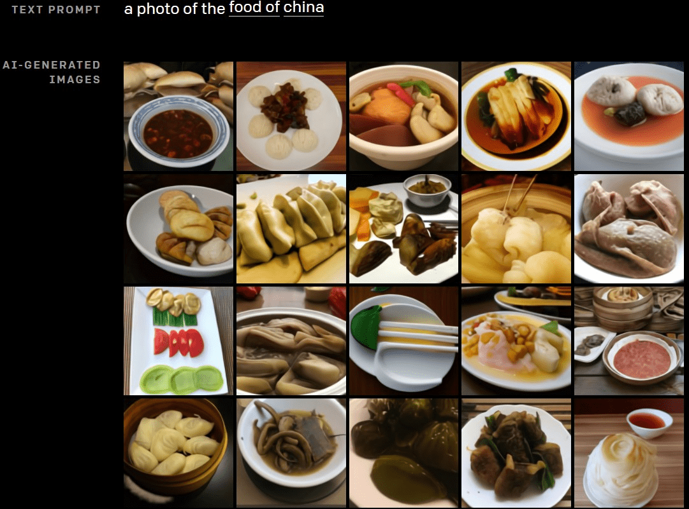

# [水] 人工智能生成色图？

作者：妈的智障

TID：30087

<title>1</title> <link href="../Styles/Style.css" type="text/css" rel="stylesheet">

# 1

前两天看了一篇文章，大意是有个团队(OpenAI) 开发了输入文本就可以生成图片的AI
然后第一时间想到了用它来生成色图  草 无知的人类
原文：[https://openai.com/blog/dall-e/](https://openai.com/blog/dall-e/)
一个例子：
<ignore_js_op>

**2021-01-08 020653.jpg** *(177.73 KB, 下載次數: 0)*

[下載附件](forum.php?mod=attachment&aid=ODY3MzZ8MjJmZWYyNWN8MTY3NDA2ODUxN3wxODIzMHwzMDA4Nw%3D%3D&nothumb=yes)

2021-1-8 02:12 上傳

虽然大概率只能生成一些生草图片，不过什么时候AI也能产粮呢

<title>2</title> <link href="../Styles/Style.css" type="text/css" rel="stylesheet">

# 2

巧了，这种东西我也想过，但是查了一下好像目前最多也就是有那种拼脸网站。不知道将来配合AI和ML会不会有相关的工具。 <title>3</title> <link href="../Styles/Style.css" type="text/css" rel="stylesheet">

# 3

这个主要是需要更加的泛用化。

我是说，因为虽然技术有了，但是想培养出一个好用的智能意外的难，而且花很多的人的时间和机器的运算力。

而且主要是需要有足够多的参考文献。

因为虚构的二次元作品，或者是合成图片的作品，或者说“作品”这种东西本身，跟自然界中用照相机乱射的产货量实在是差太多了。

不过如果只是要写文，我们可能已经有足够多的资源了。中文大概很难，但是日文或英文应该可以。

把GS uploader上所有的文都拔下来，然后学习，说不定可以写出不错的大纲。</ignore_js_op>