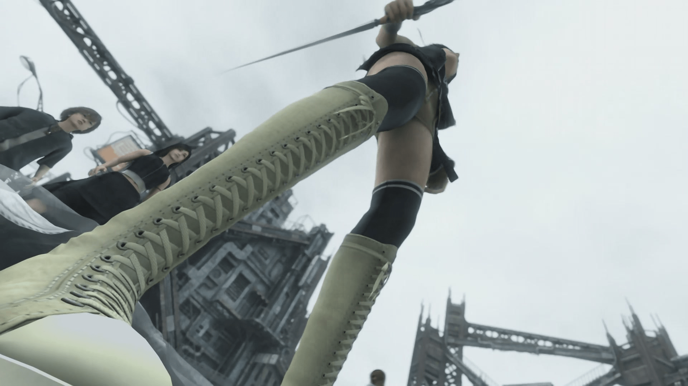
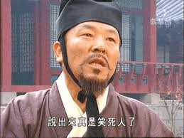

# 【水？】每次發球都擦邊你都接得住嗎！

作者：eventually

TID：10142

<title>1</title> <link href="../Styles/Style.css" type="text/css" rel="stylesheet">

# 1

當然不是抱怨帖……不如說要是能打死在下在下也心甘情願呢-_,-

發帖子的衝動源於今天早上英語課。坐在我右邊的女生回過頭去對後面男生用得意的，戲謔的，挑逗的，總之極盡樓主想像之能事的——好吧，其實不過是戲言——語調說道：“大女人，小男人~”

不，乃們要相信樓主當時心如止水，因為那個女生長得並不……我是說，樓主在下我對三次元的女生是沒有興趣的，嗯嗯！

所以不禁令在下產生了要發這個帖子的念頭……本來只是在下自爽的想法吧，但是想要和別人分享，或者是不和別人分享（這種東西畢竟分享了沒什麽人要吧~），只需要一個契機……不，只需要一個念想罷了吧。

是的，前面都是廢話，下面才是正文……

在下最近跑去補完了FF7ACC。（這麼晚才補，我自重）

因為本篇並沒有玩過，所以實際上只是沖著Tifa Lockhart的大名而去的（再次自重）

不知道Seven Heaven缺不缺人手打工？如果缺的話教練我想去幫忙……咳咳。但是意外總是意外發生的。正如在下萌的角色里多半都不是主角——其中應該也包括了克勞蒂雅——這次也不例外。Tifa很美，但結果，我卻被一個出場時間加起來或許不到五分鐘的少女所徹底折服。

尤菲醬那麼萌再巨大化實在是犯規啊啊！（視角造成的腦補……其實影片本意只是表現尤菲暈眩的情節~）

（話說這帖子是不是太水了……|||先鞠個躬道歉吧，版大要下手還請給個痛快，別把在下淩遲處死……XD） <title>2</title> <link href="../Styles/Style.css" type="text/css" rel="stylesheet">

# 2

 <ignore_js_op>[abbr_cfd42e637e89b6816b093bac4b93e0ce.jpg](forum.php?mod=attachment&aid=MjQ0OTB8ZDI1NTRjZTd8MTY3NDA2ODc5M3wxODIzMHwxMDE0Mg%3D%3D&nothumb=yes) *(136.96 KB, 下載次數: 8)*

[下載附件](forum.php?mod=attachment&aid=MjQ0OTB8ZDI1NTRjZTd8MTY3NDA2ODc5M3wxODIzMHwxMDE0Mg%3D%3D&nothumb=yes)

2011-5-12 13:44 上傳  

</ignore_js_op> <title>3</title> <link href="../Styles/Style.css" type="text/css" rel="stylesheet">

# 3

擦边神马的毫无压力
三次元不过是渣画质而已，阳光宅表示淡定 <title>4</title> <link href="../Styles/Style.css" type="text/css" rel="stylesheet">

# 4

吐嘈一、
閣。。。閣下就是**「水中斬月」**尹英川?
[http://book.douban.com/subject/4725703/](http://book.douban.com/subject/4725703/)
『**「水中斬月」尹英川**窄巷單挑**桂丹雷「太極拳」**，八卦刀名宿硬碰最強**接刀手**，勝負只在分毫之間！』
喂，
有太極頭像的人兄，出山來啊，來接刀啊，是你啊，你身上有太極圖案，不要害羞啊。

吐嘈二、
『我是說，樓主在下我對三次元的女生是沒有興趣的，嗯嗯！』
三次元人乃是侵略者!

她們裝扮成二次元生物，引誘二次元雄性自宮!
【我投降】

我沒有玩過P.S.之後的所有遊戲，所以我不理解FF7ACC是神馬。
我感到背後有人用鎗指著我，在背後破我處。。。。
話說那張「低炒」圖很有風格，很性感，我很喜歡。

[ *本帖最後由 wtman 於 2011-5-12 17:46 編輯* ] <title>5</title> <link href="../Styles/Style.css" type="text/css" rel="stylesheet">

# 5

 <ignore_js_op>[images.jpg](forum.php?mod=attachment&aid=MjQ0OTF8OTEwNTU0NDR8MTY3NDA2ODc5M3wxODIzMHwxMDE0Mg%3D%3D&nothumb=yes) *(9.67 KB, 下載次數: 0)*

[下載附件](forum.php?mod=attachment&aid=MjQ0OTF8OTEwNTU0NDR8MTY3NDA2ODc5M3wxODIzMHwxMDE0Mg%3D%3D&nothumb=yes)

2011-5-12 17:37 上傳  

</ignore_js_op> <title>6</title> <link href="../Styles/Style.css" type="text/css" rel="stylesheet">

# 6

啧……看了此贴咱的心久久不能平静，
最近擦边球都这么流行吗……
仰视就是擦边球的话。。。站大厅里面随便抬头望岂不是每天都能很幸福？
其实只是想看足部特写吧？是的吧？就算不承认也没用的！
另外啊……尤菲是你吗！？
谁说蒂法比尤菲萌的？谁说的！！？？？
ff系列第一萌萝莉的，有木有！？
啊，
顺带一提，我不是萝莉控，我是女权主义者，只是比较喜欢小孩而已
……于是限于血糖（低）关系
咱是不能向楼上图文并茂基情（雾）热血回帖啊……
虽然咱每天自称热血党…………就算如此。。大家也能理解⑨最强的吧。。就当这样好了
精品擦边球+精品回帖，
其实也算看得赏心悦目了啦。
希望图文并茂文化能继续发扬，
在此重申：是真心没那基情（大雾）去搜集各种吐槽图啊！！！所以才会羡慕嫉妒啊！！

[ *本帖最後由 毒蛋白 於 2011-5-12 22:35 編輯* ] <title>7</title> <link href="../Styles/Style.css" type="text/css" rel="stylesheet">

# 7

2L神看破，膜拜之……果然陽光宅傷不起么

3L：乃的吐槽太高端了在下看不懂是也……不過FF7ACC是電影啊哈哈~

4L：握了個手！無論是作為尤菲同萌會還是作為女權主義者！ <title>8</title> <link href="../Styles/Style.css" type="text/css" rel="stylesheet">

# 8

其实我很早就发现了，这毕竟是2005年电影吧。哎，她可不萌，哈哈 。 <title>9</title> <link href="../Styles/Style.css" type="text/css" rel="stylesheet">

# 9

> 原帖由 *eventually* 於 2011-5-13 14:07 發表 
> 3L：乃的吐槽太高端了在下看不懂是也……不過FF7ACC是電影啊哈哈~

「尤菲醬那麼萌再巨大化實在是犯規啊啊！（視角造成的腦補……其實影片本意只是表現尤菲暈眩的情節~）」

[http://giantess-fan-comics.devia ... ss-Yuffie-192822194](http://giantess-fan-comics.deviantart.com/art/Giantess-Yuffie-192822194)

這就是LZ夢寐以求的東西。
「你從什麼時候開始產生了尤菲醬沒有被巨大化的錯覺？」

[ *本帖最後由 wtman 於 2011-5-13 18:06 編輯* ] <title>10</title> <link href="../Styles/Style.css" type="text/css" rel="stylesheet">

# 10

LS如神一般！我错了！尤菲酱果然是巨大化了啊啊！！！！ 

（华丽地54掉6L最后一句，嗯！） <title>11</title> <link href="../Styles/Style.css" type="text/css" rel="stylesheet">

# 11

这个角度不错啊
赞 <title>12</title> <link href="../Styles/Style.css" type="text/css" rel="stylesheet">

# 12

看成了巡音……………