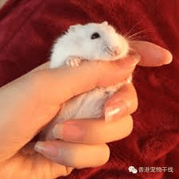

# 【求姿势】如何才能无伤大雅地说出自己喜欢GTS

作者：静儿_

TID：21722

<title>1</title> <link href="../Styles/Style.css" type="text/css" rel="stylesheet">

# 1

*本帖最後由 jack369605 於 2016-8-31 23:12 編輯*

如何才能无伤大雅（不变态）地向女生表达自己喜欢巨大少女？（介绍特殊癖好，撩妹技能之一）
具体关系应该是朋友一类的
1.其实，我对女生巨大化有兴趣.......
2.很想看看你10层楼高的样子呢
3.果你变成10层楼高会怎么样呢
............如何才能优雅地表达这种癖好，又不被女生反感呢..........
作为工科狗语言能力实在有限，还望各位能支招 <title>2</title> <link href="../Styles/Style.css" type="text/css" rel="stylesheet">

# 2

嗯，说自己喜欢缩小好了，一般女孩子是蛮喜欢可爱的东西的，所以如果说缩小的话，应该是不会被讨厌的，反而人家大概会蛮有兴趣的和你聊的 <title>3</title> <link href="../Styles/Style.css" type="text/css" rel="stylesheet">

# 3

縮小了就跟小動物一樣,不用理你的樣貌與身材,可愛就好,弱小一點,願意聽話就好了, <title>4</title> <link href="../Styles/Style.css" type="text/css" rel="stylesheet">

# 4

呵呵，不建议用GTS撩妹。手机里下载一套东京巨女，观看时故意被她看见，对方如果有意询问就有上路的潜质，如果对话中有反感之意果断放弃吧，不是所有人都接受GTS文化的。
<title>5</title> <link href="../Styles/Style.css" type="text/css" rel="stylesheet">

# 5

> [yuxiaoqiu 發表於 2016-8-31 21:52](https://giantessnight.cf/gnforum2012/forum.php?mod=redirect&goto=findpost&pid=306856&ptid=21722)
> 嗯，说自己喜欢缩小好了，一般女孩子是蛮喜欢可爱的东西的，所以如果说缩小的话，应该是不会被讨厌的，反而 ...

这是个好主意
假如有一天我变小的你会帮助我吗？
这样就容易套话了
<title>6</title> <link href="../Styles/Style.css" type="text/css" rel="stylesheet">

# 6

> [A27452682 發表於 2016-8-31 21:55](https://giantessnight.cf/gnforum2012/forum.php?mod=redirect&goto=findpost&pid=306858&ptid=21722)
> 縮小了就跟小動物一樣,不用理你的樣貌與身材,可愛就好,弱小一點,願意聽話就好了, ...

一般女生还是有同情心的，用自己缩小套话会容易很多
我不小心缩小了，你能保养我吗，我很听话的~~
<title>7</title> <link href="../Styles/Style.css" type="text/css" rel="stylesheet">

# 7

> [jy24310350 發表於 2016-8-31 22:35](https://giantessnight.cf/gnforum2012/forum.php?mod=redirect&goto=findpost&pid=306864&ptid=21722)
> 呵呵，不建议用GTS撩妹。手机里下载一套东京巨女，观看时故意被她看见，对方如果有意询问就有上路的潜质， ...

有了上面的回答，似乎从缩小方面入手会容易很多，然后延伸一下
“那如果说你身边的人都缩小了，或者说你变大了，会怎么样呢？”
<title>8</title> <link href="../Styles/Style.css" type="text/css" rel="stylesheet">

# 8

*本帖最後由 861861861 於 2016-9-1 03:39 編輯*

我觉得你说你想变成仓鼠之类的小动物、比较容易让人接受、
话说我现在超羡慕这只仓鼠→_→
<title>9</title> <link href="../Styles/Style.css" type="text/css" rel="stylesheet">

# 9

 <ignore_js_op>[仓鼠.jpg](forum.php?mod=attachment&aid=NjM2OTF8ZDZkMDg4YTl8MTY3NDA2NzkyMnwxODIzMHwyMTcyMg%3D%3D&nothumb=yes) *(5.94 KB, 下載次數: 0)*

[下載附件](forum.php?mod=attachment&aid=NjM2OTF8ZDZkMDg4YTl8MTY3NDA2NzkyMnwxODIzMHwyMTcyMg%3D%3D&nothumb=yes)

2016-9-1 01:36 上傳  

</ignore_js_op> <title>10</title> <link href="../Styles/Style.css" type="text/css" rel="stylesheet">

# 10

> [jack369605 發表於 2016-8-31 23:20](https://giantessnight.cf/gnforum2012/forum.php?mod=redirect&goto=findpost&pid=306873&ptid=21722)
> 有了上面的回答，似乎从缩小方面入手会容易很多，然后延伸一下
> “那如果说你身边的人都缩小了，或者说你 ...

楼主这么疯狂的想要表达自己的情感不行呀，会被你吓跑的。
我觉得还是应该先建立感情，女生对你有好感就会愿意听你诉说，即便她不接受也还有回旋的余地。
<title>11</title> <link href="../Styles/Style.css" type="text/css" rel="stylesheet">

# 11

> [861861861 發表於 2016-9-1 01:38](https://giantessnight.cf/gnforum2012/forum.php?mod=redirect&goto=findpost&pid=306882&ptid=21722)
> 我觉得你说你想变成仓鼠之类的小动物、比较容易让人接受、
> 话说我现在超羡慕这只仓鼠→_→
> ...

同感。。。。。。
“假如我变成仓鼠一样的小动物该怎么办呢，你会包养我吗？”
<title>12</title> <link href="../Styles/Style.css" type="text/css" rel="stylesheet">

# 12

> [jy24310350 發表於 2016-9-1 06:06](https://giantessnight.cf/gnforum2012/forum.php?mod=redirect&goto=findpost&pid=306887&ptid=21722)
> 楼主这么疯狂的想要表达自己的情感不行呀，会被你吓跑的。
> 我觉得还是应该先建立感情，女生对你有好感就 ...

一般朋友关系应该就行了。这个话题还是寻找恰当时机装成偶然想到的提出，一旦对方表现出拒绝立刻改变话题。总之还是要谨慎，毕竟这话题太容易被当成变态了……
<title>13</title> <link href="../Styles/Style.css" type="text/css" rel="stylesheet">

# 13

当女生很喜欢你的时候就相对是比较容易说的 <title>14</title> <link href="../Styles/Style.css" type="text/css" rel="stylesheet">

# 14

简单啊。。我就对我老婆说我有缩小癖，喜欢缩小了被女生XXOO。。。哈哈哈 <title>15</title> <link href="../Styles/Style.css" type="text/css" rel="stylesheet">

# 15

「我想成為你的紅蘿蔔」
「我想將全身放到老二裡再跟你上床」
不然就把MM打包好送她
怎麼樣，超級無傷大雅 <title>16</title> <link href="../Styles/Style.css" type="text/css" rel="stylesheet">

# 16

不过如果真的缩小到8楼所说的小仓鼠，这还真不好说啊，毕竟咱们没有仓鼠的那种呆萌属性，搞不好就被轻松处理了 <title>17</title> <link href="../Styles/Style.css" type="text/css" rel="stylesheet">

# 17

其实我是女权主义者，不如说是女尊主义者，可爱的少女即为正义！
这么说估计会被打… <title>18</title> <link href="../Styles/Style.css" type="text/css" rel="stylesheet">

# 18

> [jack369605 發表於 2016-9-1 10:36](https://giantessnight.cf/gnforum2012/forum.php?mod=redirect&goto=findpost&pid=306900&ptid=21722)
> 一般朋友关系应该就行了。这个话题还是寻找恰当时机装成偶然想到的提出，一旦对方表现出拒绝立刻改变话题 ...

没错，据我个人经验而言。要女生接受GTS设定有两个办法。
一个是她喜欢你就会喜欢你的一切，另一种就是潜移默化，让她在不排斥的条件下多接触，最后让妹子自己说出喜欢。
<title>19</title> <link href="../Styles/Style.css" type="text/css" rel="stylesheet">

# 19

> [jy24310350 發表於 2016-9-1 17:06](https://giantessnight.cf/gnforum2012/forum.php?mod=redirect&goto=findpost&pid=306936&ptid=21722)
> 没错，据我个人经验而言。要女生接受GTS设定有两个办法。
> 一个是她喜欢你就会喜欢你的一切，另一种就是潜 ...

有s倾向的妹子会容易很多，一般妹子就难以接受这些
其实有了女票，想怎么调教都容易
<title>20</title> <link href="../Styles/Style.css" type="text/css" rel="stylesheet">

# 20

(⊙_⊙)额。。。为何要在撩妹阶段透露性癖，总觉得，会蛮尴尬的？ <title>21</title> <link href="../Styles/Style.css" type="text/css" rel="stylesheet">

# 21

我目前还木有女朋友，以后有的话我想会从缩小方面入手吧，可以和她一起看恐怖童话拇指公主啊这方面的，逐渐透露出自己也想缩小的欲望。 <title>22</title> <link href="../Styles/Style.css" type="text/css" rel="stylesheet">

# 22

会很难说吗……
我和朋友说的时候都没什么压力啊，就拿个图片给他们看，“啊看这个图片，我好想变成这个巨人的样子”
然后大家互相开了玩笑就过去了
和说“我觉得我先定个小目标，比如赚他个一个亿”的节目效果差不多 <title>23</title> <link href="../Styles/Style.css" type="text/css" rel="stylesheet">

# 23

> [dragon1230 發表於 2016-9-1 12:53](https://giantessnight.cf/gnforum2012/forum.php?mod=redirect&goto=findpost&pid=306916&ptid=21722)
> 不过如果真的缩小到8楼所说的小仓鼠，这还真不好说啊，毕竟咱们没有仓鼠的那种呆萌属性，搞不好就被轻松处 ...

一般女生也不会随便处理小动物的，特别是人类
但是如果她不把咱当人看，而且对咱自身表现也不满意，多半会送人，少数可能就直接处死了
所以说，即使缩小也应该保持绅士风度（认真），卖萌………就需要技巧了
<title>24</title> <link href="../Styles/Style.css" type="text/css" rel="stylesheet">

# 24

> [餃子 發表於 2016-9-1 21:36](https://giantessnight.cf/gnforum2012/forum.php?mod=redirect&goto=findpost&pid=306969&ptid=21722)
> (⊙_⊙)额。。。为何要在撩妹阶段透露性癖，总觉得，会蛮尴尬的？

因为适时告诉对方自己的癖好是重要的撩妹技法之一，比如你告诉她自己喜欢巨大娘，她以后再见到巨大娘就会想到你，说法得当还会给她一种“你就是我的巨大娘”的感觉，她对你的印象也会加深
<title>25</title> <link href="../Styles/Style.css" type="text/css" rel="stylesheet">

# 25

> [静儿_ 發表於 2016-9-2 08:31](https://giantessnight.cf/gnforum2012/forum.php?mod=redirect&goto=findpost&pid=307001&ptid=21722)
> 会很难说吗……
> 我和朋友说的时候都没什么压力啊，就拿个图片给他们看，“啊看这个图片，我好想变成这个巨 ...

朋友的表现就是这样啦，大多数人对这种说法还是一笑而过你要是和女性朋友说的，估计和我跟基友说一样，完全没影响
但是你和关系一般的男性朋友说估计他们内心的反应就比较剧烈了

而且作为一名很容易被误解为hentai的工科宅男，随便对女生说出来就可能被当hentai，或许会降低好感
所以说，表达方式和技巧is very important