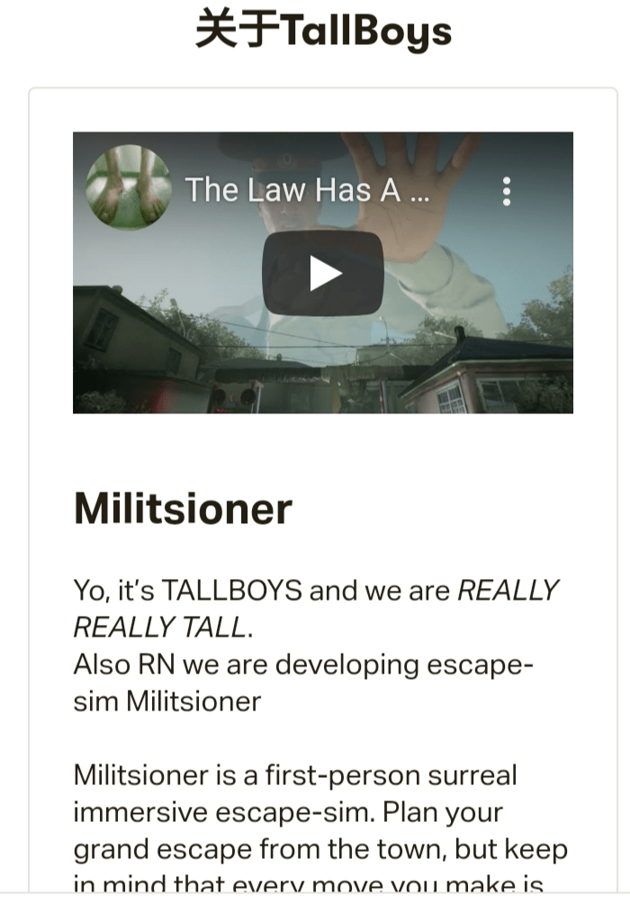

# 【游戏情报】关于俄罗斯游戏militsioner有了突破性的进展

作者：NPC23336666

TID：33299

<title>1</title> <link href="../Styles/Style.css" type="text/css" rel="stylesheet">

# 1

前接帖子：https://giantessnight.com/gnforum2012/forum.php?mod=viewthread&tid=32272
之前就有坛友们介绍过这个游戏和发过相关同人图，我那时在被坛友们安利后，就开始对这个游戏开发进度关注了。
这个游戏名为militsioner，开发者是TallBoys，原开发者是位来自俄罗斯的巨大爱好者，也算是半个圈内人，不过因为他是gt爱好者，所以对我们来说只算半个圈内人，大家可以关注和支援TallBoys的推特和patreon，据开发者原话，后续巨人警察还除了用手抓，会有臀压，足控crush，警察服装也可以解锁更换，皮鞋可以换成靴子crush，还有踩踏时候的打击感也肯定会很宏大的。
TallBoys：“我们的目标不是要制造出邪恶的警察形象”。就像是《旺达与巨像》里玩家才是反派一样，在游戏设定中玩家扮演的也是一名犯罪者，而游戏中的那位巨大的警察扮演的则是城市的守护者，他有自己的情绪和思想，甚至需要吃饭和睡觉；他有能力将城市及所有居民一起磨成尘土，但是道德准则却不允许他这样做。

这游戏目前已经是处于研发的最后阶段了，预计2023年就能成功上架steam！（小激动）
如果这游戏顺利发行了，我们也会受益的，到时候我们可以改改mod模型，换成女警察的就行了。

该作者TallBoys的私人推特：https://mobile.twitter.com/mytallboys
<ignore_js_op>

**IMG_20220523_111649.jpg** *(253.38 KB, 下載次數: 0)*

[下載附件](forum.php?mod=attachment&aid=OTYzNzB8MDc1MWJiMTd8MTY3NDA2NTUzNXwxODIzMHwzMzI5OQ%3D%3D&nothumb=yes)

2022-5-23 11:27 上傳

TallBoys的patreon，大家可以去给予作者经济支援，让他加快进度。https://www.patreon.com/tallboys
<ignore_js_op>

**IMG_20220523_111708.jpg** *(236.96 KB, 下載次數: 0)*

[下載附件](forum.php?mod=attachment&aid=OTYzNzF8ODhmMjU1NDZ8MTY3NDA2NTUzNXwxODIzMHwzMzI5OQ%3D%3D&nothumb=yes)

2022-5-23 11:27 上傳

<ignore_js_op>

**IMG_20220523_111719.jpg** *(115.16 KB, 下載次數: 0)*

[下載附件](forum.php?mod=attachment&aid=OTYzNzJ8ZmY1YTczNmN8MTY3NDA2NTUzNXwxODIzMHwzMzI5OQ%3D%3D&nothumb=yes)

2022-5-23 11:27 上傳

<ignore_js_op>

**IMG_20220523_111731.jpg** *(104.08 KB, 下載次數: 0)*

[下載附件](forum.php?mod=attachment&aid=OTYzNzN8YTg4MGFiNjZ8MTY3NDA2NTUzNXwxODIzMHwzMzI5OQ%3D%3D&nothumb=yes)

2022-5-23 11:27 上傳

b站消息渠道：
【【IGN】《Militsioner》预告：我们见过最酷的逃脱警察追捕游戏-哔哩哔哩】 https://b23.tv/LcuhM0i

<ignore_js_op>

**IMG_20220523_112611.jpg** *(254.36 KB, 下載次數: 0)*

[下載附件](forum.php?mod=attachment&aid=OTYzNzR8M2FiOWU2NDN8MTY3NDA2NTUzNXwxODIzMHwzMzI5OQ%3D%3D&nothumb=yes)

2022-5-23 11:28 上傳

<title>2</title> <link href="../Styles/Style.css" type="text/css" rel="stylesheet">

# 2

蒂法换模型+配音安排上，快点的 <title>3</title> <link href="../Styles/Style.css" type="text/css" rel="stylesheet">

# 3

> [斯巴达 發表於 2022-5-23 13:01](https://giantessnight.cf/gnforum2012/forum.php?mod=redirect&goto=findpost&pid=504050&ptid=33299)
> 蒂法换模型+配音安排上，快点的

一眼看到是gt是没兴趣的，但看到到换模型语音，瞬间期待拉满，到时一定会有人会做这个mod的
<title>4</title> <link href="../Styles/Style.css" type="text/css" rel="stylesheet">

# 4

> [ZYZ啦啦啦 發表於 2022-5-23 15:06](https://giantessnight.cf/gnforum2012/forum.php?mod=redirect&goto=findpost&pid=504055&ptid=33299)
> 一眼看到是gt是没兴趣的，但看到到换模型语音，瞬间期待拉满，到时一定会有人会做这个mod的
> ...

没办法，原开发者就是gt爱好者，但是后期我们可以自己拿来改个mod模型，嘿嘿嘿
<title>5</title> <link href="../Styles/Style.css" type="text/css" rel="stylesheet">

# 5

> [斯巴达 發表於 2022-5-23 13:01](https://giantessnight.cf/gnforum2012/forum.php?mod=redirect&goto=findpost&pid=504050&ptid=33299)
> 蒂法换模型+配音安排上，快点的

安排！估计这游戏也快出来了，原开发者说开发已经到最后阶段了，还会有更多关于巨大化警察的互动的。见评论区好多人在那猜测游戏开发者背后隐喻的政治意图，都扯到冷战去了……
其实开发者TallBoys根本没考虑这么多，这游戏只是满足他们的巨大男XP系统而已233333

<title>6</title> <link href="../Styles/Style.css" type="text/css" rel="stylesheet">

# 6

估计还要到2023年下半年，虽说目前是最后阶段，还仍然有很多的工作量，patreon上有人问的</ignore_js_op></ignore_js_op></ignore_js_op></ignore_js_op></ignore_js_op>