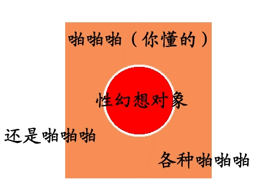

# [理论]GTS属性研究报告(1.0版本)

作者：maker13

TID：14643

<title>1</title> <link href="../Styles/Style.css" type="text/css" rel="stylesheet">

# 1

*本文章最後由 xnr 於 2013-6-29 19:21 編輯*

本文目的有三点:1.   试图去解释作为GTS圈内人对自己特殊喜好的各种困惑。2.   试图从一个客观和科学的角度阐述我们的GTS属性。3.   在未来，有可能作为一篇让外界广泛理解并接受的GTS属性系统全面的介绍。
说在前面的话：本文是我XNR个人在GTS圈内数年来的经验总结和研究成果，只代表我个人，不代表任何其他人。我尽量以客观的角度进行论述，但难免会有主观臆断，请大家多多谅解。
欢迎善意和理性的讨论、指导和修正，但请不要恶意曲解、苛刻指责、对喷或进行人身攻击，希望大家能彼此理解和尊重。对于本文，我会尽量以精简和明了的方式进行阐述，以保证通俗易懂，深入浅出、阅读轻松。
目录（今后会继续补充、扩展和完善）第一部分 介绍什么是GTS属性，什么是GTS同好第二部分 深入剖析GTS属性的构成，发掘其根本第三部分 详细完整的阐述GTS属性的每一个部分或分支第四部分 介绍下跟GTS属性擦边类的次文化或特殊属性第五部分 GTS属性的发展和未来
一．什么是GTS属性？GTS 来自英文Giantess的缩写，中文叫女巨人，日文叫巨大娘。SM 来自英文Shrink Man 的缩写，缩小男的意思。
GTS属性本质上是一种特殊的男性对女性的性幻想。正如GN首页所述：內容為女性巨大化或男性縮小化之幻想創作與討論。
因为其特殊性（前提要求太高），在世界上群体非常稀少，并因此通过网络平台形成了一个独特的带有封闭性质的群体，其至今都不为外界广泛所知。
而又因为其本质属于性幻想，更不宜公开告知天下，很多GTS同好连身边最亲密的人都不敢说出口，怕得不到对方的理解而被扣上“变态”的帽子。
二．GTS属性的构成：既然本质上是性幻想，让我用图片来更直观的展现性幻想的构成：
★首先是我们传统意义上“正常的”性幻想：简单而直接；任何人都有的性幻想。<ignore_js_op></ignore_js_op> **GTS属性-2.jpg** *(47.3 KB, 下載次數: 2)*

[下載附件](forum.php?mod=attachment&aid=MzQ5NTd8NTk1YmIxYWR8MTY3NDA2NjY4OHwxODIzMHwxNDY0Mw%3D%3D&nothumb=yes)

2013-6-29 17:18 上傳 ======================================================================
★   然后，这是我们作为GTS同好的性幻想，复杂吧！
GTS属性的基本模型：<ignore_js_op></ignore_js_op> **GTS属性2副本.jpg** *(124.9 KB, 下載次數: 2)*

[下載附件](forum.php?mod=attachment&aid=MzQ5NTV8ZjA0YTZiNTN8MTY3NDA2NjY4OHwxODIzMHwxNDY0Mw%3D%3D&nothumb=yes)

2013-6-29 17:18 上傳 
三大基本要素，一个核心要素，构成了GTS性幻想的基本形态。
★   我们再进一步细化，以下GTS属性的详细分析模型（金字塔状）：
<ignore_js_op></ignore_js_op> **GTS属性-1.jpg** *(225.22 KB, 下載次數: 2)*

[下載附件](forum.php?mod=attachment&aid=MzQ5NTZ8NDEwNWFhNmZ8MTY3NDA2NjY4OHwxODIzMHwxNDY0Mw%3D%3D&nothumb=yes)

2013-6-29 17:18 上傳 
以上金字塔模型是GTS属性(性幻想)的一个完整的概括，其中任何构成要素紧密相连，缺一不可。
所以，GTS属性用书面形式可以表述为：建立在强大的幻想力的基础上的，以恋物情结为核心的，追求（性幻想对象、女性）力量的支配（精神的屈辱）和（性幻想对象、女性）肉体的包容（情感的归属），最终通过用以(男和女)尺寸差异的形式表现出来的性幻想。
这就是为什么GTS同好如此稀少的原因！这就是为什么我们是小众群体的根本原因！前提条件太高了有木有！追求的属性太复杂了有木有！
第一，   必须要有强大的幻想力，GTS本来就不是真实的，对“正常人”来讲怎么可能对虚无缥缈的东西产生性冲动？这是一切GTS爱好者所必须具备的第一条件！
第二，   必须要有恋物情结，这是核心条件，各种属性都依附在此核心基础上。通过恋物+尺寸差异的表现形式，就构成了GTS属性的基本要素，国外对于此GTS属性的统称为：“Size-Fetish”，日本叫“尺寸恋物癖”，非常简单明了的指出了GTS的本质。
第三，   光有尺寸差异和可恋之物就可以了吗？不，必须要有充分的互动情节，才能满足根植于我们心底的性幻想情节。这就是大家常常挂在嘴边的“残酷系”和“温柔系”了，GTS之所以吸引我们，其美妙之处就在于这两种性癖好通过GTS（尺寸差异的可恋之物）可以同时实现！
至于是如何同时实现的，我相信各位心中早就有明确的想法(幻想)了。所以我把模型图交织在了一起。而通过力量的支配和肉体的包容，更可以升华为精神上的屈辱和情感上的归属，这就是GTS同好所追求的终极的性幻想。也正是因为如此高的门槛，才使得大多数人无法理解GTS同好的孜孜追求。
三．对于GTS属性成分的一些分析：
1.     幻想力这里的幻想力，也就是脑补能力，YY（意淫）能力。并不是任何有性幻想的人都会有这种幻想力的。因为GTS文化本身就是虚幻的产物，不具备幻想力的人是不可能产生这种特殊癖好的。
其中的一个标准就是：是否接受二次元的文化（ACG动漫界的）。GTS同好基本上都能接受二次元物，而“正常”世界里的人只吃三次元，对二次元没有感觉。所以，大多数GTS同好，都比较“宅”。
另外，因为需要幻想力的缘故，这就要求任何优秀的GTS作品，都必须要有足够的“真实感”，至少是感官上的真实体验和感受。真正极品的GTS资源，往往是不需要再脑补，不需要再“幻想”的，一切都真真切切的摆在同好的面前，而这也是我们的极致追求。
2.     恋物情结插入百度百科：恋物情结[http://baike.baidu.com/view/186400.htm](http://baike.baidu.com/view/186400.htm)
之所以把“恋物情结”作为GTS的核心属性，是因为：“只有可恋之物，才有将之巨大化的价值”如果把恋物属性抽去，GTS各种附加属性就会荡然无存。
刚才模型亦可解读为：通过自己的强大幻想力将“可恋之物”巨大化（或自己相对缩小化）来达到性幻想的目的。而自己性幻想的任何内容，都是离不开“可恋之物”的，或者说都必须让所恋之物来完成或实现。总结就是：恋物情结贯穿GTS性幻想的始终，需要着重去描写和刻画。
3.     力量的支配→精神的屈辱（残酷系）/ 肉体的包容→情感的归属（温柔系）这两种属性，我打算放到一起说，因为GTS属性本身就把这两种偏好完美的融合了起来，带给了我们更多的感官体验和精神享受，这一要点也是圈外人所不具备的，甚至是忽略的。
具体的表现形式是多种多样的，可以说任何一个大家喜欢的互动情节，都贯穿了这两点属性，大家可以把自己喜欢的作品套用进去看看我说的对不对，任何大家觉得不给力不喜欢的作品，往往也是这两点属性刻画的不够好不到位导致的。
在GTS文化作品里，最主要最直接的表现方式就是“互动性”，这是圈外人所无法理解、无法创造的，因为他们没有这方面的追求。所以为什么我们看圈外人的擦边类GTS作品，都会很怨念其没有互动，就是这个道理。互动必须建立在“恋物”和“真实性”的基础上，才能让我们产生感官上的享受。
以上三点，刚好对应了我以前的一篇文章：《[理论帖]GTS作品三大要素》[http://giantessnight.com/gnforum2012/forum.php?mod=viewthread&tid=8040](http://giantessnight.com/gnforum2012/forum.php?mod=viewthread&tid=8040)
4.     尺寸差异（GTS女巨人或SM缩小男）同样是喜欢GTS，但是在尺寸差异上，每个人的偏好却完全不一样。这里有一条很明显的分割线，我把他称之为“十分之一”分割线或者“20厘米”分割线。
即：有人能接受的尺寸差异为“不能超过10:1的落差”，落差太大就没感觉了，他们偏好尺寸对比感。但是另一部分人却要求“必须超过10:1的落差”，落差太小就没感觉了，他们偏好尺寸落差感。
这是圈内唯一不可调和的矛盾，跟每个人的幻想力、对恋物的态度都有很大关系。目前给我们的启示是：如果你的作品想尽可能满足更多的人，10：1的尺寸落差是个不错的选择。
为什么会有这种差异，我觉得关键点在于：是否接受“无意识互动”这个属性：
《关于是否喜欢并接受“无意识”互动的投票》：
[http://giantessnight.com/gnforum2012/forum.php?mod=viewthread&tid=13258&extra=page%3D1](http://giantessnight.com/gnforum2012/forum.php?mod=viewthread&tid=13258&extra=page%3D1)
这里我阐述的比较详细，大家可以投票看看。
四．跟GTS属性擦边类的次文化或特殊属性：为了不引起公众误解，所以只发模型图，不做过多评论。
<ignore_js_op></ignore_js_op> **GTS属性-6.jpg** *(216.98 KB, 下載次數: 2)*

[下載附件](forum.php?mod=attachment&aid=MzQ5NTR8YWZkNTliYTN8MTY3NDA2NjY4OHwxODIzMHwxNDY0Mw%3D%3D&nothumb=yes)

2013-6-29 17:18 上傳 
<ignore_js_op></ignore_js_op> **GTS属性-3.jpg** *(194.15 KB, 下載次數: 2)*

[下載附件](forum.php?mod=attachment&aid=MzQ5NTh8ODRkNmUzMmR8MTY3NDA2NjY4OHwxODIzMHwxNDY0Mw%3D%3D&nothumb=yes)

2013-6-29 17:18 上傳 
<ignore_js_op></ignore_js_op> **GTS属性-4.jpg** *(217.48 KB, 下載次數: 2)*

[下載附件](forum.php?mod=attachment&aid=MzQ5NTl8NGY4NGI3ODN8MTY3NDA2NjY4OHwxODIzMHwxNDY0Mw%3D%3D&nothumb=yes)

2013-6-29 17:18 上傳 
<ignore_js_op></ignore_js_op> **GTS属性-5.jpg** *(198.03 KB, 下載次數: 0)*

[下載附件](forum.php?mod=attachment&aid=MzQ5NjB8NTY5OGNjN2V8MTY3NDA2NjY4OHwxODIzMHwxNDY0Mw%3D%3D&nothumb=yes)

2013-6-29 17:18 上傳 
五．GTS属性的发展和未来目前全世界GTS同好的总数大概是多少，比较靠谱的说法是不过10万，当然其中相当一部分都是看看就走的路人，非本命或死忠。（貌似日本同好有做过统计）按全球总人口70亿人来看，就算十万个人当中有一个GTS同好，那也是很不得了的事情了，可能会更少。
这一点参考了各大论坛的人口数据，比如全球最大的GTS论坛美国的giantesscity.com总注册会员才5万多人（除去各种马甲和路人），华人的GN论坛也才4000人左右。
而且GTS同好大多分布于发达国家（尤其是社会经济文化发达地区），同好的数量与当地经济文化发展的水平是成正比的。因为只有发达的经济才能保障人对性的追求，只有发达的文化（比如欧美日本的动漫和电影产业），才能启发人的幻想。
所以，随着世界经济文化的缓慢发展，这一数字应该是缓慢增加的。可以参考本论坛某投票，90后的数量已经缓慢超过80后了：[http://giantessnight.com/gnforum2012/forum.php?mod=viewthread&tid=7098&extra=page%3D1](http://giantessnight.com/gnforum2012/forum.php?mod=viewthread&tid=7098&extra=page%3D1)
GTS文化今后的大发展，不止取决于各国经济和文化水平的发展，更取决于科技的进步和普及，因为科技的发展弥补了幻想和现实的鸿沟，当科技能带来更真实的幻想体验的时候，消除了“虚无缥缈”这一障碍的时候，我相信会有更多人接受GTS这一“特殊的性幻想”属性。
今后还会继续补充完善本篇论文，希望大家多多支持认真研究和探索的精神！
======================================================================附上其他参考资料，欢迎大家投票：
GTS同好出生年调查[http://giantessnight.com/gnforum2012/forum.php?mod=viewthread&tid=7098&extra=page%3D1](http://giantessnight.com/gnforum2012/forum.php?mod=viewthread&tid=7098&extra=page%3D1)
GTS同好对普通A片H漫的看法调查[http://giantessnight.com/gnforum2012/forum.php?mod=viewthread&tid=8126&extra=page%3D1](http://giantessnight.com/gnforum2012/forum.php?mod=viewthread&tid=8126&extra=page%3D1)
GTS同好口味大调查[http://giantessnight.com/gnforum2012/forum.php?mod=viewthread&tid=2401&extra=page%3D2](http://giantessnight.com/gnforum2012/forum.php?mod=viewthread&tid=2401&extra=page%3D2)
GTS体形大小喜好大调查[http://giantessnight.com/gnforum2012/forum.php?mod=viewthread&tid=2668&extra=page%3D3](http://giantessnight.com/gnforum2012/forum.php?mod=viewthread&tid=2668&extra=page%3D3)
关于对GTS爱好看法的投票
[http://giantessnight.com/gnforum2012/forum.php?mod=viewthread&tid=14446](http://giantessnight.com/gnforum2012/forum.php?mod=viewthread&tid=14446)

<title>2</title> <link href="../Styles/Style.css" type="text/css" rel="stylesheet">

# 2

。。。X大辛苦了，科普这些东西。。。应该会减少点新人的认知困难。。。
把朦胧的情感转化为现实的文字还真是一件困难的事啊。。。 <title>3</title> <link href="../Styles/Style.css" type="text/css" rel="stylesheet">

# 3

*本文章最後由 LKW 於 2013-6-29 18:18 編輯*

留名，看了再评
------------------
果然类似我这种通吃比较少吗。
我倒是认为，其他口味，比如吞食，Furry是培养出来的
拿自己的例子来说，我刚刚入这个圈的时候认为吞食神马的最恶心了
大概1年前开始接受吞食，然后现在也慢慢地开始理解furry了。
而大小差距更多是先天性吧，启蒙作品会承担很大的一部分。
比如看4946启蒙的人，和看EVA启蒙的人，一定会有些不同吧
其实还想了很多，先写这些 <title>4</title> <link href="../Styles/Style.css" type="text/css" rel="stylesheet">

# 4

*本文章最後由 ADSL 於 2013-6-29 18:57 編輯*

此前从未见过GTS的科普理论向文章，更别说还有图片加以辅述，很新鲜，也非常棒。

确实，相较于广大恋足、SM同好来说，GTS的爱好者确实非常少见，可能真的是和文中所提到的想象力有很大关系。

嗯......忽然想了想，从某种意义上来说，除了一些极其特殊的口味不能接受以外，我发现我貌似也是全部通吃呢。

<title>5</title> <link href="../Styles/Style.css" type="text/css" rel="stylesheet">

# 5

目测楼主写过的论文至少在10篇以上 <title>6</title> <link href="../Styles/Style.css" type="text/css" rel="stylesheet">

# 6

Shrink Man的缩写真是蛋疼呢->SM。。。
对LZ的“GTS属性分析模型”中心的“恋物情结”感同身受，个人就是从足控开始慢慢接触SM和性幻想GTS神马的 <title>7</title> <link href="../Styles/Style.css" type="text/css" rel="stylesheet">

# 7

*本文章最後由 killer9999 於 2013-6-29 20:47 編輯*

據說這是個歡迎理性和善意討論的論文,那我就不客氣了:

> 因为其特殊性（前提要求太高），在世界上群体非常稀少，并因此通过网络平台形成了一个独特的带有封闭性质的群体，其至今都不为外界广泛所知。
> 
> 而又因为其本质属于性幻想，更不宜公开告知天下，很多GTS同好连身边最亲密的人都不敢说出口，怕得不到对方的理解而被扣上“变态”的帽子。

請問這和主題有甚麼關係?
外界指的是甚麼?以甚麼當標準?
這樣一開始就營造一種"我們正受社會主流迫害,我們要起義,我們要change!"的論調,真的沒問題嗎?

而且為甚麼要故意貼近主流,被主流所接受?
請交待背後的動機,謝謝

> 所以，GTS属性用书面形式可以表述为：
建立在强大的幻想力的基础上的，以恋物情结为核心的，追求（性幻想对象、女性）力量的支配（精神的屈辱）和（性幻想对象、女性）肉体的包容（情感的归属），最终通过用以(男和女)尺寸差异的形式表现出来的性幻想。
> 

請問你對V這種總幻想著GTS被小人推倒XXOO的現象,有甚麼解釋呢?

> 这就是为什么GTS同好如此稀少的原因！这就是为什么我们是小众群体的根本原因！
> 前提条件太高了有木有！追求的属性太复杂了有木有！

GTS同好稀少,群體小,有問題?
那些大學物理專業化學專業etc的也是這樣 那麼他們也有問題咯?
他們也要"我們正受迫害,我們要起義,我們要change!"咯?

請解釋你那段話背後的動機,謝

> 至于是如何同时实现的，我相信各位心中早就有明确的想法(幻想)了。所以我把模型图交织在了一起。
> 而通过力量的支配和肉体的包容，更可以升华为精神上的屈辱和情感上的归属，这就是GTS同好所追求的终极的性幻想。也正是因为如此高的门槛，才使得大多数人无法理解GTS同好的孜孜追求。

性幻想的終極目的就是取得愉悅,別想多了
除非你想說GTS本質上不是性幻想,性幻想是污穢和低等的東西
不過這樣的話,你說的很多東西就自相矛盾了

> 这里的幻想力，也就是脑补能力，YY（意淫）能力。并不是任何有性幻想的人都会有这种幻想力的。
> 因为GTS文化本身就是虚幻的产物，不具备幻想力的人是不可能产生这种特殊癖好的。

你把mini系和真實系一棒子打死了

> 其中的一个标准就是：是否接受二次元的文化（ACG动漫界的）。
GTS同好基本上都能接受二次元物，而“正常”世界里的人只吃三次元，对二次元没有感觉。

所以，大多数GTS同好，都比较“宅”。

明明在說著GTS,怎麼突然就扯上了ACG和三次元?
這兩個有關係嗎?
整篇文章完全沒有說過原因,這是要把原因腦補出來嗎?
gtss貼吧那群人按你的說法,就不符合這標準了咯?

請再次解釋,謝

> 另外，因为需要幻想力的缘故，这就要求任何优秀的GTS作品，都必须要有足够的“真实感”，至少是感官上的真实体验和感受。
> 真正极品的GTS资源，往往是不需要再脑补，不需要再“幻想”的，一切都真真切切的摆在同好的面前，而这也是我们的极致追求。

自相矛盾
前面才說觀眾需要幻想力,後面又說極品資源不需要觀眾再幻想
那麼要幻想力幹啥?

而且實話說,把男主心裡的想法全部直白地寫出來,效果只會更糟(這我已經實驗過了

> 之所以把“恋物情结”作为GTS的核心属性，是因为：
> “只有可恋之物，才有将之巨大化的价值”
> 如果把恋物属性抽去，GTS各种附加属性就会荡然无存。
> 
> 刚才模型亦可解读为：通过自己的强大幻想力将“可恋之物”巨大化（或自己相对缩小化）来达到性幻想的目的。
> 而自己性幻想的任何内容，都是离不开“可恋之物”的，或者说都必须让所恋之物来完成或实现。
> 总结就是：恋物情结贯穿GTS性幻想的始终，需要着重去描写和刻画。

這個你確定不是性幻想的核心?
這論點換句話來說就是,你要控一件東西,你先得愛它
這個不用說也知道啊(

> 这两种属性，我打算放到一起说，因为GTS属性本身就把这两种偏好完美的融合了起来，带给了我们更多的感官体验和精神享受，这一要点也是圈外人所不具备的，甚至是忽略的。
> 
> 具体的表现形式是多种多样的，可以说任何一个大家喜欢的互动情节，都贯穿了这两点属性，大家可以把自己喜欢的作品套用进去看看我说的对不对，任何大家觉得不给力不喜欢的作品，往往也是这两点属性刻画的不够好不到位导致的。
> 
> 在GTS文化作品里，最主要最直接的表现方式就是“互动性”，这是圈外人所无法理解、无法创造的，因为他们没有这方面的追求。所以为什么我们看圈外人的擦边类GTS作品，都会很怨念其没有互动，就是这个道理。
> 互动必须建立在“恋物”和“真实性”的基础上，才能让我们产生感官上的享受。

GTS這是一個群體不是一個legion,大家喜歡的東西必然差天共地
套進你的理論就是戀的物根本不一樣
你這裡甚麼理由都沒給出來,倒是假設了大家都是這樣想
這假設根本一點都不靠譜啊

> 同样是喜欢GTS，但是在尺寸差异上，每个人的偏好却完全不一样。
> 这里有一条很明显的分割线，我把他称之为“十分之一”分割线或者“20厘米”分割线。
> 
> 即：有人能接受的尺寸差异为“不能超过10:1的落差”，落差太大就没感觉了，他们偏好尺寸对比感。
> 但是另一部分人却要求“必须超过10:1的落差”，落差太小就没感觉了，他们偏好尺寸落差感。
> 
> 这是圈内唯一不可调和的矛盾，跟每个人的幻想力、对恋物的态度都有很大关系。
> 目前给我们的启示是：如果你的作品想尽可能满足更多的人，10：1的尺寸落差是个不错的选择。

十分之一的假設又是哪裡來的?[來源要求]

你這個論點直接把尺寸和無意識兩個概念混在了一起了
然後你那無意識的帖子還把對等關係,日常系/劇情系,有否男角這些也混為一談了
在故事的

哦還有,哪裡來的矛盾?
不是說要包容的嗎,怎麼又一般SW的節奏?

> 四．跟GTS属性擦边类的次文化或特殊属性：
> 为了不引起公众误解，所以只发模型图，不做过多评论。

你這樣不寫原因,還想不引起公眾誤解?
發理論得有理據支持,沒有理據就等於廢話,想得出甚麼結論都沒問題

> GTS文化今后的大发展，不止取决于各国经济和文化水平的发展，更取决于科技的进步和普及，因为科技的发展弥补了幻想和现实的鸿沟，当科技能带来更真实的幻想体验的时候，消除了“虚无缥缈”这一障碍的时候，我相信会有更多人接受GTS这一“特殊的性幻想”属性。

這個是結論?還是抒發個人感情時間?
至少我完全沒看出和前文有甚麼毛線的關係

總結來說:
1.內定假設很多
2.經常一棒子打死幾船人
3.理據經常沒給足,有些地方甚至根本沒理據,突然就蹦出個意味不明的句子,然後又神奇地消失了
我會偏向認為這是一篇說明抒情文嗯

<title>8</title> <link href="../Styles/Style.css" type="text/css" rel="stylesheet">

# 8

太厉害了。。。 <title>9</title> <link href="../Styles/Style.css" type="text/css" rel="stylesheet">

# 9

有点太专业了吧。。要慢慢消化 嗯。。
反正 怎么样子都行吧~ <title>10</title> <link href="../Styles/Style.css" type="text/css" rel="stylesheet">

# 10

> killer9999 發表於 2013-6-29 20:42 
> 據說這是個歡迎理性和善意討論的論文,那我就不客氣了:
> 請問這和主題有甚麼關係?
> 外界指的是甚麼?以甚麼當標 ...

“本文是我个人在GTS圈内数年来的经验总结和研究成果，只代表我个人，不代表任何其他人。 我尽量以客观的角度进行论述，但难免会有主观臆断，请大家多多谅解。”
 總結來說:
1.內定假設很多
如果没有“充分的理由和证据”就等于“假设”，我同意，因为这些都是我个人的观点，用我自己的判断标准，采用我个人的观察经验所得。
就好比爱因斯坦提出一个理论假设，过了几十年人类科技才能去证明是否正确，但是当时提出了假设和猜想不等于就能全盘否定其价值。我希望这些文字在今后的某些事情上还能发挥一定的作用。

当然，我更希望有人能拿出“充分的理由和证据”来证明我的错误，这是版本1.0，我欢迎任何人帮助我补充、修改和完善，做到更客观更全面，谢谢。

2.經常一棒子打死幾船人 比如，以我的标准，我认为“真实系高大女”不属于“GTS文化的范畴”，你说我把他们都打死了，那就是了。
日本的《巨大娘文化研究》那本书一开始列出了十几个“排除在外的属性”，打死的人更多呢。

如果我要想不得罪任何人，可以说得更模糊、更模棱两可，甚至不写这样的总结。
当然那也就没有任何意义了，说到底我也是为了自己的爱才想方设法推动这份“文化”进一步发展。第一个敢吃螃蟹的人，总是要多多支持吧。

3.理據經常沒給足,有些地方甚至根本沒理據,突然就蹦出個意味不明的句子,然後又神奇地消失了
确实很多观点挺难给出足够的论据的，因为证据太多太零散，大多是个人的观察经验总结。也就是说，肯定很多方面不符合很多人“他自己的观点”。
所以我干脆先给出我的结论，再通过大家的讨论，进一步的修正和完善。如果这篇文章还是有一定存在价值的，那就足够了。
如果你觉得这篇文章毫无意义，就像要去证明“为什么男人会有性幻想”之类的，那就当我写了一篇废话罢了。

我會偏向認為這是一篇說明抒情文嗯
《充满个人观点的GTS属性说明文和个人抒情文》，同意。

先回答以上这些，如果还有特别想让我回答的问题，请告诉我，我会再写回复的，谢谢。

<title>11</title> <link href="../Styles/Style.css" type="text/css" rel="stylesheet">

# 11

*本文章最後由 killer9999 於 2013-6-29 23:42 編輯*

> xnr 發表於 2013-6-29 22:46 
> “本文是我个人在GTS圈内数年来的经验总结和研究成果，只代表我个人，不代表任何其他人。
> 我尽量以客观的 ...

你把免責聲明引用出來,說明不了甚麼啊(

> 就好比爱因斯坦提出一个理论假设，过了几十年人类科技才能去证明是否正确，但是当时提出了假设和猜想不等于就能全盘否定其价值。我希望这些文字在今后的某些事情上还能发挥一定的作用。
> 
> 当然，我更希望有人能拿出“充分的理由和证据”来证明我的错误，这是版本1.0，我欢迎任何人帮助我补充、修改和完善，做到更客观更全面，谢谢。

愛因斯坦提出的理論都有前人幹過了,他只是整合然後提出新的物理見解而已

不過重點在於,既然你都標明了是理論,那麼你不解釋你的見解怎麼來的,不把理據說清楚,這叫理論?
把沒有論據的論點放出來,這不是故意招人質疑嗎?

哦對,那些假設你還沒有回答我,那些定義也是沒理清
請回答,謝

> 如果我要想不得罪任何人，可以说得更模糊、更模棱两可，甚至不写这样的总结。
> 当然那也就没有任何意义了，说到底我也是为了自己的爱才想方设法推动这份“文化”进一步发展。第一个敢吃螃蟹的人，总是要多多支持吧。

這世界哪有不得罪人的理論?
連發故事發圖都不一定全人類喜歡了,更何況理論?
你這論調聽著就是又要發表見解又想不被質疑 覺得動機好就能凌駕一切
這能成?(

> 确实很多观点挺难给出足够的论据的，因为证据太多太零散，大多是个人的观察经验总结。也就是说，肯定很多方面不符合很多人“他自己的观点”。
> 所以我干脆先给出我的结论，再通过大家的讨论，进一步的修正和完善。如果这篇文章还是有一定存在价值的，那就足够了。
> 如果你觉得这篇文章毫无意义，就像要去证明“为什么男人会有性幻想”之类的，那就当我写了一篇废话罢了。

這些引號愈看愈噁心了...
引號是用來標誌特殊的東西的
其他人的個人觀點你用引號標誌,是表示它們很特別,與自己的見解不是同一個水平?

還有,不是說要討論的嗎?
怎麼放棄和我討論了?(

> 《充满个人观点的GTS属性说明文和个人抒情文》，同意。

標題黨可恥(咦

<title>12</title> <link href="../Styles/Style.css" type="text/css" rel="stylesheet">

# 12

论坛又开始思想的碰撞了，很高兴啊，特地用个表情
希望这一楼能堆得比较高，也希望各大写手能来发表自己的观点
我相信这样能更加牢固自己的思想，写出更好的文章 <title>13</title> <link href="../Styles/Style.css" type="text/css" rel="stylesheet">

# 13

> killer9999 發表於 2013-6-29 23:36 
> 你把免責聲明引用出來,說明不了甚麼啊(
> 
> 愛因斯坦提出的理論都有前人幹過了,他只是整合然後提出新的物理見 ...

如果我的文字让你感到恶心，我看就先到此为止吧。

如果你觉得我从一开始就是错误的，那也没有再讨论的意义了。

不过我欢迎你再开一个帖子阐述下你的观点，我相信你会做得比我更好，更严谨。

为了我这篇文章你也打了很多字，辛苦你了，谢谢。

<title>14</title> <link href="../Styles/Style.css" type="text/css" rel="stylesheet">

# 14

其实我觉着这还不足成为假说，而是猜测阶段，科学最忌讳的就是不可证伪，主管意识太强和取证太少都是硬伤。

外界对GTS的研究可以说是隔靴止痒，虽然是心理学家，几篇论文下来基本上和弗洛伊德老爷当年的那一套大胆猜测并无太大进步。可以说如果不是出个有GTS控的心理学家那么那些研究并无太大意义，而一个心理学家又会陷入主观意识太强的怪圈。

首先一点，人的性癖本来就不是单纯的，就拿SM虐恋来说，这个算是变态心理学中很大的一个分类了，虽然归纳出少数可以依循的，但是不可寻的更多。最重要一点，一个所谓的抖M不一定是纯M，他也有S的一面，这种即可是S又可是M的人在SM圈随处可见，包括我，我自身还包括了极端S的猎奇，这种多种倾向的人也很常见，用你的金字塔的图就不好解释。

你从一开始就决定：强大的幻想是基础，需要依托幻想存在的性癖何止SM？
各路猎奇控比比皆是，从人体蜈蚣那种勉强可以在实现的到魔物娘那种没有未来科技就实现不能的。用这个模式来套这张图，几乎哪个变态性癖都可以成为金字塔的顶端。

而且.. 为何GTS一定要在金字塔顶端？ 你从之前开始就认为“GTS是一种高雅？有幻想，有能力的人才能拥有的性癖，没有GTS性癖的反而是野蛮人。”
虽然我个人不以“SM”为变态，但是还没有产生“SM是高贵的性癖”的那种 “不以为丑反以为美”的想法，但是我认为XNR你已经偏离了正常的研究太多，心理学里面有一个现象，当一个人产生一个想法后：比如登月是假的，那么他之后得到的所有的信息大多会被反而加强成支持自己观点的信息，比如流言终结者的破解那是为了政府服务，那些照片都是后人加工的，世界各国政府都收了美国的钱而替他隐瞒真相等等..... 主观意识太强所诞生的只是很极端的结论。
<title>15</title> <link href="../Styles/Style.css" type="text/css" rel="stylesheet">

# 15

*本文章最後由 killer9999 於 2013-6-30 01:21 編輯*

> xnr 發表於 2013-6-29 23:50 
> 如果我的文字让你感到恶心，我看就先到此为止吧。
> 
> 如果你觉得我从一开始就是错误的，那也没有再讨论的 ...

別轉移話題,當初是誰說歡迎討論的?
真和你辯起來,你就這個樣子?
不就讓你說一下你是得出這些假設的原因嘛,有這麼難以啟齒嗎?(
<title>16</title> <link href="../Styles/Style.css" type="text/css" rel="stylesheet">

# 16

> GTS文化今后的大发展，不止取决于各国经济和文化水平的发展，更取决于科技的进步和普及，因为科技的发展弥补了幻想和现实的鸿沟，当科技能带来更真实的幻想体验的时候，消除了“虚无缥缈”这一障碍的时候，我相信会有更多人接受GTS这一“特殊的性幻想”属性。

微軟還是蘋果啥的你他媽快把虛擬頭盔給弄出來啊啊啊啊啊啊啊啊啊啊啊啊啊啊啊啊啊啊啊啊啊啊啊啊~~~~~~~~~~~~~~~~~~~~~~~~~~~~~~~~~~~~~~~~~~~~ <title>17</title> <link href="../Styles/Style.css" type="text/css" rel="stylesheet">

# 17

某人火氣真大 <title>18</title> <link href="../Styles/Style.css" type="text/css" rel="stylesheet">

# 18

很好，圈外人总是觉得我们是变态。总来说我们也只是个别DNA不一样罢了就像有些小孩不吃葱，只是因为他们真的吃出我们吃不出的葱腥味（顺带带一句，我是纯VORE消化的。） <title>19</title> <link href="../Styles/Style.css" type="text/css" rel="stylesheet">

# 19

4000人啊，感角好少 <title>20</title> <link href="../Styles/Style.css" type="text/css" rel="stylesheet">

# 20

> 小虎 發表於 2013-6-30 01:49 
> 微軟還是蘋果啥的你他媽快把虛擬頭盔給弄出來啊啊啊啊啊啊啊啊啊啊啊啊啊啊啊啊啊啊啊啊啊啊啊啊~~~~~~~~~ ...

我个人倒是觉得虚拟头盔晚点出来比较好。。。从社会情况来看。。。
还有第一代的虚拟头盔不可能像SAO那样好。。。的吧。。。如果只能玩真人版扫雷你会买么？(非嘲讽
<title>21</title> <link href="../Styles/Style.css" type="text/css" rel="stylesheet">

# 21

> shendanxiaogui 發表於 2013-6-30 10:43 
> 我个人倒是觉得虚拟头盔晚点出来比较好。。。从社会情况来看。。。
> 还有第一代的虚拟头盔不可能像SAO那样 ...

那種東西早就有了啊
就是沒量產化所以你用不上而已(

而且也別指望真實度也高得去哪,那個需要運算速度再翻上無數倍加上解決uncanny valley的問題(

<title>22</title> <link href="../Styles/Style.css" type="text/css" rel="stylesheet">

# 22

> 無間道 發表於 2013-6-30 00:43 
> 其实我觉着这还不足成为假说，而是猜测阶段，科学最忌讳的就是不可证伪，主管意识太强和取证太少都是硬伤。 ...

是的，确实主观意识略强，但这是作为一个GTS同好的观点去看的，得出的如此的结论。
现在圈外也有很多人去尝试描述和解释GTS这种性癖，但是在我看来都没有说到点子上，往往会带给其他人更多的误解。

我相信我的这番解释会让更多人易于接受，从同好的角度出发去了解这种属性，而不是随随便便就给我们扣上变态的帽子。
当然，如果你觉得我的解释完全无法让人接受，从一开始就是错误的，我也欢迎你从头开始修正，谢谢。
<title>23</title> <link href="../Styles/Style.css" type="text/css" rel="stylesheet">

# 23

> harlanfred 發表於 2013-6-30 02:13 
> 很好，圈外人总是觉得我们是变态。总来说我们也只是个别DNA不一样罢了就像有些小孩不吃葱，只是因为他们真 ...

是的，也许真的就是DNA的变异问题。
GTS吞食控和纯吞食控是完全不一样的，虽然二者有相通之处：

GTS吞食控：必须要有缩小化或巨大化，有尺寸差异。
纯吞食控：不需要尺寸差异，同比例等身吞食也喜欢（强吞胀肚子那种）。

GTS吞食控：主体必须是女性，这是作为男性的性幻想内容。
纯吞食控：只要是动物就行，被蛇、怪物、禽兽吞食都能产生快感（这还是性快感吗？）
<title>24</title> <link href="../Styles/Style.css" type="text/css" rel="stylesheet">

# 24

突然觉得俺好伟大。。。 <title>25</title> <link href="../Styles/Style.css" type="text/css" rel="stylesheet">

# 25

楼主总结得是，辛苦了 <title>26</title> <link href="../Styles/Style.css" type="text/css" rel="stylesheet">

# 26

根据此理论，我们的癖好基于强大的想象力，看来接受应试教育的孩子...... <title>27</title> <link href="../Styles/Style.css" type="text/css" rel="stylesheet">

# 27

你提的理論，讓我想到奇幻文學圈三百年來對奇幻文學的論辯；他們一樣面臨到主流文學的質疑，與科幻小說的侵蝕。

因此我想引述[The Cambridge Companion to Fantasy Literature](http://universitypublishingonline.org/cambridge/companions/ebook.jsf?bid=CBO9781139014625) 在 Introduction中使用的對奇幻文學分類的建議，作為GTS作品的分類的參照：

> Two people’s understanding of the fantastic can be sufficiently different as to generate a list of texts with little overlap apart from Tolkien (and sometimes not even him). This is enormously liberating.
> 兩個人對奇幻的理解可能歧異到足夠生出一串在托爾金之外的作品只有一點重疊的文字（而且有時候在托爾金都沒有重疊的部分）。這是極端的解放。
> 
> There are no texts that one feels one must include. However, it does make a book of this type rather problematic.
> 你找不到一串文字認為另一串一定要被包含。然而，這使這類書籍相當麻煩。
> 
> Rather than end this book with a series of author studies, we have chosen instead to offer studies of author-clusters that are intended to serve as discussion-openers.
> 與其讓這些書結束在系列的作者研究中，我們選擇用作者群（叢集）去取代，這是意圖讓我們做為一個在討論上開放的人。
> 
> We hesitate to call these clusters ‘subgenres’ (although some will).
> 我們猶豫去稱這些叢集為子分類（雖然有些人會這樣）
> 
> Rather, the clusters selected have been chosen because between them they allow for a very broad coverage of recent authors worthy of discussion and demonstrate at the same time the way an individual author’s works can be reconfigured to answer different questions.
> 這些叢集被挑選是因為他們之間有很廣的交集讓近來的作家覺得值得將他們討論和展示在同一個時間，以至於這些個別作家的方式可以被重新思考用來回應不同問題。

簡而言之：劍橋，試圖以cluster（叢集）去取代subgenre（子分類）；
在概念上從樹狀圖 變為 。

樹狀圖的呈現，就會有所謂的根本跟枝節；但cluster的呈現則有種化學長鏈分子的感覺。這隱含了去中心化的效果。

而劍橋認為這樣分成不同叢集的目的基本上是服侍去介紹跟討論不同作者的作品它們究竟可以回應了什麼問題，或是說述了什麼，又或是可以提供讀者在閱讀不同文類時有什麼樣的指南可索尋；同樣地，因為是叢集，如果我們置換部分作品形成不同叢集，那又會呈現出不同的風貌、面向，並回應不同的問題。

我認為你這理論中缺乏了作品的舉例，你的理論也許可以在你的思想中操弄得很好，但是無法適應現實的作品狀況。不論是什麼樣寫作論的都該以作品作為本位，只要有任何一個作品不符合你的理論架構，你的理論假說就被立即證偽。

我甚至覺得用性幻想和力量的支配放在與溫柔系的對立面，去分類溫柔系和非溫柔系是不公平的；如果這樣做的話，我們該如何去看到hachimitsu的圖和小劍的文章有何異同？

GTS是否根基於性幻想也有待質疑，如果我們認為是的話，怎麼去看待0128的〈灰燼之榖〉？

不過我想如果我們說：但大是我們的托爾金，用但大的文章去定義High GTS（模仿High Fantasy造的辭），這點應該是沒有人會反對的（就如同劍橋所說：在托爾金的地方大家的定義重疊比較多）。

順帶一提，但大（或論壇上的諸位）有沒有興趣去投一篇[2013金車奇幻小說獎](http://arts.kingcar.org.tw/newspage.php?id=266) 。w。
<title>28</title> <link href="../Styles/Style.css" type="text/css" rel="stylesheet">

# 28

*本文章最後由 xnr 於 2013-7-10 22:37 編輯*

> Lastato 發表於 2013-7-10 17:18 
> 你提的理論，讓我想到奇幻文學圈三百年來對奇幻文學的論辯；他們一樣面臨到主流文學的質疑，與科幻小說的侵 ...

非常感谢您认真而细致的回复，这也是我希望听到的质疑声音，这种认真负责的态度非常值得赞赏。
第二张图片大陆看不见，希望您能以附件形式上传。

关于你提出的丛集的结构图和阐述模式，我觉得是很有意义的，从某种角度上来讲我认为是可以用来阐述GTS同好的属性和需求的。我相信正是因为每一个同好都具备了较多较杂的属性和需求，才最终融合在”不切实际的"GTS身上体现出来。
不过我仍然坚持我的模型图是比较简练而有代表性的，我坚持GTS属性是有核心要素和金字塔型发展基础的。

对于您的质疑，以下是我的回答：

1\. 我認為你這理論中缺乏了作品的舉例，你的理論也許可以在你的思想中操弄得很好，但是無法適應現實的作品狀況。不論是什麼樣寫作論的都該以作品作為本位，只要有任何一個作品不符合你的理論架構，你的理論假說就被立即證偽。

我的理论是对大量GTS作品的最精炼的概括，基本上可以套用在任何“传统而主流”的GTS作品当中。
当然理论的最终目的不是去迎合每一部“GTS类别的作品”，而是去试图用最精炼的方式概括和阐述大多数同好们所共同持有的“GTS属性“，尽可能的做到全面细致、没有偏袒。对于一个局外人（或圈外人）来讲，也更容易理解和接受。

比如：有些同好偏好残酷，作品只有残酷没有温柔；有些同好则反之；这些同好的作品都是“传统而主流”的，不存在谁更能代表"GTS应该有的属性"。
而我相信大部分主流同好对残酷和温柔的属性都是喜欢的，甚至可以说GTS本身就是残酷和温柔的某种“追求极致”的体现，所以我用“残酷+温柔”作为概括GTS属性的主要组成部分，是比较合情合理的。

再有，每个人都是独立的个体，他们对于GTS的追求和偏好都不是完全一样的，我所做的就是尽可能把大多数“GTS同好”的共同点集合起来，建立一个较为有概括性的模型图来阐述基本的“GTS属性及其主要组成部分”。

2\. 我甚至覺得用性幻想和力量的支配放在與溫柔系的對立面，去分類溫柔系和非溫柔系是不公平的；如果這樣做的話，我們該如何去看到hachimitsu的圖和小劍的文章有何異同？

GTS属性内部，纷繁复杂，派系和支系众多，充满了各种对立和统一。
就算同为GTS同好，口味也会不相投，他们对彼此的偏好也是有很多矛盾的，这一点是客观事实，我在投票区发起的几个投票活动就能看出很多“圈内的”差异。
但是作为一个小众群体，这并不阻碍我们同为“圈内人”这一事实，我们仍然具备较大的共同点，而我本篇理论就是去找出并阐述这个小众群体里“传统而主流”的共同点。

3\. GTS是否根基於性幻想也有待質疑，如果我們認為是的話，怎麼去看待0128的〈灰燼之榖〉？
不過我想如果我們說：但大是我們的托爾金，用但大的文章去定義High GTS（模仿High Fantasy造的辭），這點應該是沒有人會
反對的（就如同劍橋所說：在托爾金的地方大家的定義重疊比較多）。

恕我直言，虽然但丁是华人首批创作者和GN的创始人，但我并不认为但丁的文章在圈内具备“代表性”，只是很多人是通过但丁的文章找到华人的GTS圈子罢了。但丁的文章有太多的个人色彩，而且很多属性不曾涉猎。其作品首先是但丁的文章，其次才是GTS文章。

事实上也很难找到一个集大成者的大师级人物可以来代表“GTS属性”（日本的笛地静恵我觉得可以算一个），因为大家都是从自己的“性幻想需求”出发，满足自己第一，服务大众第二。
如果让我来讲，我觉得有两部GTS游戏可以代表GTS属性和文化，一部是《缩小学园》，一部是IRY的《魔女》。
这两部游戏对GTS属性涉及的非常全面，而且对属性和同好的需求掌握的非常透彻，做工精良，原作者也有借此“传教”的意图。

4\. 順帶一提，但大（或論壇上的諸位）有沒有興趣去投一篇[2013金車奇幻小說獎](http://arts.kingcar.org.tw/newspage.php?id=266) 。w。

当然可以去投，但我认为既然GTS文化本质上是性幻想，其中必然会有部分让外人感到“猥琐和淫秽”的内容，弄不好会产生较大的负面影响，所以还应慎重选择和考虑。

以上，不知道有没有完全而彻底的回复你的质疑，如果你有其他问题或新的质疑，欢迎再次留言，我还会认真回复的，谢谢！

<title>29</title> <link href="../Styles/Style.css" type="text/css" rel="stylesheet">

# 29

*本文章最後由 Lastato 於 2013-7-11 04:01 編輯*

> xnr 發表於 2013-7-10 21:53 
> 非常感谢您认真而细致的回复，这也是我希望听到的质疑声音，这种认真负责的态度非常值得赞赏。
> 第二张图片 ...

對於這些題目，我想可以一項項來；

我們先針對：【GTS文化本质上是性幻想】這件事做討論吧，首先我們得考慮，你所說的本質是什麼，我們才能考慮如何證偽它。

我猜想，你所說的本質，是類似於「核心」的意思，或是「基礎」的意思，所以同義的概念是：【GTS文化的核心是性幻想】、【GTS文化是根基於性幻想上的】。

如果你說述的命題和我所理解的相同的話，那麼證偽的方式，就是：如果找到一個作品符合「GTS文化」，但核心並不是性幻想，又或是並不是基於性幻想的，那麼此命題就被證明是False。

故請試用下圖（都是giantess booru的圖）去支持【GTS文化本质上是性幻想】，以增加此命題的信度；如果不可支持那命題就被證偽，如果可支持那該命題的信度就被提升。

在語言脈絡上，我想使用【福利】、【擦邊】這個詞語對於命題提出批評觀點：前二所述詞是用來預示讀者，此文章中是否內含性描寫或是性暗示（使期望看到的讀者能夠符合預期，或不願看到的讀者得以迴避）；所以可以知道如果有一篇文章沒有性描寫也沒有性暗示也可以是GTS文化圈內的作品（因為我們會對讀者表明一篇文章中是否有性描寫和性暗示。），而沒有性描寫也沒有性暗示的文章，如何作為性幻想的媒材呢？如果沒有性描寫也沒有性暗示的文章，無法作為性幻想的題材。那麼命題便不成立。

<title>30</title> <link href="../Styles/Style.css" type="text/css" rel="stylesheet">

# 30

*本文章最後由 xnr 於 2013-7-11 12:26 編輯*

> Lastato 發表於 2013-7-11 03:59 
> 對於這些題目，我想可以一項項來；
> 
> 我們先針對：【GTS文化本质上是性幻想】這件事做討論吧，首先我們得考 ...

非常感谢你认真的回复，我很喜欢这种钻研的精神。

好的，首先我们要明确一个问题：什么才叫做“性幻想” ？
百度百科：[http://baike.baidu.com/view/71008.htm](http://baike.baidu.com/view/71008.htm)

性幻想内涵众多、包罗万象，不等于一定要有赤裸裸的性描写或性暗示，不等于一定要有性行为或对性器官的描写。
大哥似乎一直拿“普通人眼中的性幻想题材”套用在GTS同好身上。

事实上，作为GTS同好，我们对“性幻想”的追求也是非常特殊的，是建立在幻想力的基础上的。
而这就是GTS同好区别于普通人的地方，我们对性幻想的兴奋点的追求是不一样的，我一楼放的前两张图就已经很清楚的表明了普通人和GTS同好对于“性幻想追求“的区别。

拿你提供的两张图举例：
这两张图明显都是圈外人的擦边球作品，并非同好创作，出发点没有任何”对性的追求“，没有任何对性的描写和暗示。
但是其内容却恰巧满足了“GTS同好的属性需求”，满足了其性幻想的基本条件，让GTS同好受用。

为什么一个在外人看来没有任何”性幻想内容“的作品，却让GTS同好产生了性幻想？
为什么会有如此奇怪的属性和人与人的区别？
而我这篇文章就是去试图解释这个问题，这也是本文存在的价值和意义。

希望我回答了你的质疑，谢谢。

<title>31</title> <link href="../Styles/Style.css" type="text/css" rel="stylesheet">

# 31

*本文章最後由 Lastato 於 2013-7-13 15:08 編輯*

> xnr 發表於 2013-7-11 12:21 
> 非常感谢你认真的回复，我很喜欢这种钻研的精神。
> 
> 好的，首先我们要明确一个问题：什么才叫做“性幻想” ...

所以你是要把「GTS的本質是性幻想」當作是基礎公理，並且否認對GTS不代性幻想進行欣賞的可能性？

你對GTS文化的定義是：

> 建立在强大的幻想力的基础上的，以恋物情结为核心的，追求（性幻想对象、女性）力量的支配（精神的屈辱）和（性幻想对象、女性）肉体的包容（情感的归属），最终通过用以（男和女）尺寸差异的形式表现出来的性幻想。

你想使用的性幻想定義是：

> **性幻想是種對既定性愛的「轉移興奮點」，也是一種培養嶄新性經驗的方法。**性幻想的內容包羅萬象，幻想做愛的對象，讓現實的性愛生活與性別角色出現彈性的開發潛力，給人更多的想像空間。想像和熟識的朋友、嚮往的明星或渴望的特定職業人士做愛，這是最為普遍的性幻想；而性幻想的場景，無論是戶外野合或是辦公室裡的激情，往往能給予性愛更多的創造力和愉悅性。將實際生活中難以實現的性愛，在腦中私密地進行，營造出自己才能心領神會的虛擬實境，帶給人現實生活中難能可貴的絕妙快感！
> 
> 女性
> 女人常會幻想以自己為主導的做愛方式，或是幻想和自己崇拜、欣賞的對象做愛，甚至幻想和舊情人或現實生活中原本有機會在一起卻擦肩而過的對象交歡，這些都是女性的熱門性幻想。根據統計，女人幻想和同性做愛的比例遠遠高於男人。而幾乎所有女人的性幻想都有著浪漫的劇情，在性幻想的世界裡，每個女人可都是羅曼史的暢銷大作家！
> 
> 男性
> 根據統計，男人的性幻想對象，通常是身邊最可以勾動他情慾的對象，或是自己認為最有魅力的人。與兩個或眾多女人同時做愛，是許多男人共同有過的性幻想；或者幻想偷窺別人在做愛，或是幻想自己在眾人面前做愛，甚至幻想另一個男人當著自己面前與自己的女人做愛。這些性幻想的共同點是：滿足了「窺伺」的慾望。此外，幻想女人當著自己面前自慰，也是許多男人的熱門性幻想內容。

以上兩個是你給予的「GTS文化」和「性幻想」的定義，我沒理解錯吧？

後者對於女性性幻想的定義，我得先否定其可信度，因為那其中可證實所述為真的論述有著：「根據統計」、「幾乎所有」這類該被數據表述的詞語。

男性的部分，我可以接受；因為這和我經驗認識相同。

百度百科，對於性幻想的定義沒有給定標的物的性質或敘述那個**「轉移興奮點」是什麼**；這樣的標的物的限制域是「任何可被人認識的（Anything which can be sensed）」。

因此就性幻想的定義，敘述下列句子都是不違反性幻想的定義：「我對狗有性幻想」、「我對桌子有性幻想」、「我對歐巴馬有性幻想。」這些敘述句都是，可能的。並沒有被定義的限制性駁斥的。

而A是否對B有性幻想，是由A去定義的。因此使主觀的。可以知道性幻想，的證偽性只在於該人自身：即是唯有該人可證偽該人。操作上如以下示例：C認為「A對B有性幻想」，A如果表述：「我對B沒有性幻想」，那「A對B有性幻想」即證偽。

性幻想這個詞語所具備的單一性，是否可以被作為普遍性的句式中的標的物呢？如：「A的本質是性幻想」或「世界是由性幻想構成的。」

我想是不可的。因為性幻想的證偽，是每個個人都有他的（性幻想）天堂。

那麼「GTS的本質是性幻想」便是一個教條式定義，即和「耶穌是神子」一樣有信不信由你的性質。

當然，基於「耶穌是神子」可以操作出神學理論和教條，基於「GTS的本質是性幻想」也可以操作出許多理論和教條。不過，那就是隨人相信了。如果看在這份上，我可以不相信「GTS的本質是性幻想」就像我，可以不相信「基督是神子」一樣。你不可將這樣的「信仰」強迫別人認識；亦不可，與信仰不同的人爭執某物是否為GTS文化內的一環。看在（積極性的）宗教自由的份上。

我認為修正為一個這樣的敘述句是比較恰當的：「GTS作品中，必定包含以下要素：較其他類人生物大的類人女性、尺寸差異、支配與被支配、羞辱與被羞辱、照顧與被照顧；常見狀況，可能和其他領域疊合(overlap)：足控、戀物、病嬌、性作品、……（可盡可能列舉）。」

因為你今天用的是：「GTS文化的本質是（某）」這樣的全稱命題，所以我才會認為需要使用符合這類命題的檢驗方式做檢驗。

如果你退而使用的是：存在性（作品式）定義。如以下舉例，括弧內可以代換為其他標的物：「從（一群作品）來看GTS文化」、「（裸足控）來看GTS文化」、「從（種族滅絕）來看GTS文化」，那麼就不需要使用全稱命題的檢驗方式去檢驗基礎定義。因為前稱的三個命題，分別是：作品歸納的經驗心得、作為裸足控的存在來認識GTS文化、教義式的切入並操練(initial and practice)GTS文化。

<title>32</title> <link href="../Styles/Style.css" type="text/css" rel="stylesheet">

# 32

> Lastato 發表於 2013-7-13 15:06 
> 所以你是要把「GTS的本質是性幻想」當作是基礎公理，並且否認對GTS不代性幻想進行欣賞的可能性？
> 
> 你對GTS ...

我坚持：在GTS圈子内的同好对GTS的幻想就是“性幻想”，因为其主体是女性，是占绝大多数男性GTS同好所幻想的异性。
至于圈内的女性、男同性恋或女同性恋占极少数，本篇文章暂时没有涉及到（以后会慢慢补充的）。

当然，也并非所有的“主流GTS作品”，都能让其他GTS同好产生性幻想（比如口味不合），但是并不能否认其对部分同好具有“性幻想的价值”。
而之所以在一个叫做GTS圈子的小众群体中，有这样或那样的作品存在，其本质仍然是属于“GTS同好进行性幻想”的范畴。

正如你自己所说的：
並且否認對GTS不代性幻想進行欣賞的可能性？ （对异性的欣赏，对有异性存在的作品的收藏，难道不属于性幻想的范畴？换成同性的也可以？）

我認為修正為一個這樣的敘述句是比較恰當的：「GTS作品中，必定包含以下要素：較其他類人生物大的類人女性、尺寸差異、支配與被支配、羞辱與被羞辱、照顧與被照顧；常見狀況，可能和其他領域疊合(overlap)：足控、戀物、病嬌、性作品、……（可盡可能列舉）。」
以上你所说的每一点，“女性”、“其他辅助属性” 都和性幻想脱离不了关系，所以可以统称为“GTS作品是为了满足同好的性幻想”，进而引申为一句总结“GTS属性的本质就是性幻想”，这么讲是合情合理而且易于理解的。

以下是我的反驳：
1\. 如果其不属于性幻想这样羞于公开的内容的话，我们大可以大方的组织游行，公开发表我是GTS同好我自豪，大家都来欣赏GTS这样的言论，但事实上我们做不到也不会有人去做，因为这是埋藏心底的性幻想，羞于说出口。

2\. 如果你觉得在GTS圈子内的同好对GTS的幻想并不完全属于“性幻想”的范畴，可以不涉及“异性”和“幻想”，那么其巨大方也可以换为男性(男巨人)或者动物等其他物体，当然很明显大多数圈内人是对此排斥或者不认为这是可以拿到圈子里来的作品（比如哥斯拉、奥特曼、金刚、蓝精灵），所以”性幻想“是圈内大多数人所共同追求的目的和本质。

3\. 如果圈子内的部分作品（包括同好找来的擦边球作品），不是用来帮助性幻想的，不是用来满足同好心底里对异性的幻想和欲望的，那么所谓的GTS文化创作也就缺乏了目的性（这也是为什么我们对圈外擦边球作品感到不满足不给力的原因）。

最后还是非常感谢您认真钻研的精神，让我非常敬佩！谢谢！

<title>33</title> <link href="../Styles/Style.css" type="text/css" rel="stylesheet">

# 33

*本文章最後由 boysgts 於 2013-7-15 00:30 編輯*

我記得但丁是屬於素足控的一類，曾聽他說過類似的話，且他那部傳說中少量傳出的但丁自製GTS影片看的出來

而我比較趨向鞋控及靴控這一類

感覺GTS的族群很厲害，是種很多類型的組合，X兄所講的"性幻想"的確是主軸，巨大女就對了

其餘在於分類於類型

感謝X兄精闢的論點

<title>34</title> <link href="../Styles/Style.css" type="text/css" rel="stylesheet">

# 34

这个太官方和科学化了。。。我觉得没必要当真，yy就好 <title>35</title> <link href="../Styles/Style.css" type="text/css" rel="stylesheet">

# 35

> sqwzeyy 發表於 2013-7-16 01:19 
> 这个太官方和科学化了。。。我觉得没必要当真，yy就好

还是有存在价值的，如果你投身创作或者需要跟外界沟通，肯定会觉得很重要。
<title>36</title> <link href="../Styles/Style.css" type="text/css" rel="stylesheet">

# 36

很全面的论文 <title>37</title> <link href="../Styles/Style.css" type="text/css" rel="stylesheet">

# 37

哎妈呀，我是没看懂，不过感觉很专业~~ <title>38</title> <link href="../Styles/Style.css" type="text/css" rel="stylesheet">

# 38

果然是分析帝啊，有够透彻 <title>39</title> <link href="../Styles/Style.css" type="text/css" rel="stylesheet">

# 39

.
呃，各位的辯論都結束了嗎？這串我可以收精華了吧？
另外不要問我對這篇報告的想法…我如果有想說的東西，會私下跟樓主討論。
當然我還是覺得多多辯論絕對有助同好思考自己的興趣，所以不會阻止大家辯論的。

--
我絕對沒有找理由頂上這篇好讓戰火繼續燒的念頭 <title>40</title> <link href="../Styles/Style.css" type="text/css" rel="stylesheet">

# 40

> Dante 發表於 2013-7-24 01:23 
> .
> 呃，各位的辯論都結束了嗎？這串我可以收精華了吧？
> 另外不要問我對這篇報告的想法…我如果有想說的東西 ...

我希望能有更多人参与讨论，共同补充和完善这篇论文，谢谢。
<title>41</title> <link href="../Styles/Style.css" type="text/css" rel="stylesheet">

# 41

很有学术论文的感觉了 <title>42</title> <link href="../Styles/Style.css" type="text/css" rel="stylesheet">

# 42

（听得云里雾里，看是看懂了，总的来说都是值得肯定的，就是不知道为什么那几要素就会造成GTS属性）
我觉得在加入一点就比较好了
很多东西是没有一个分界线的
比如其中所说的强大的幻想力，个人认为不应该简单的分为有和没有，应该在有与没有间有很长一条渐进线，任何人都可以再这条线的任何一部分，而不是单纯的有或没有。
以此类推我认为GTS属性有没没有，也应该是条渐近线，比如在这条线中间的位置的人，可以说有半个GTS属性，或有一部分，但不应该是单纯的一概而论为有或没有。
（语文功底不好，可能阐述不清楚）
 <title>43</title> <link href="../Styles/Style.css" type="text/css" rel="stylesheet">

# 43

> Chaiot 發表於 2013-8-8 13:41 
> （听得云里雾里，看是看懂了，总的来说都是值得肯定的，就是不知道为什么那几要素就会造成GTS属性）
> 我觉得 ...

有一个二次元为主打的M系论坛，曾经有人发过不少GTS游戏资源，但是大多数人表示没有感觉、理解不了。
这同时也是大多数圈外人对GTS性癖好的看法，这就是幻想力的差距。

其实大多数GTS同好的启蒙往往是从小时候的童话故事中得到的，比如格列佛游记等，这类作品就属于具有高度“幻想力”的产物。
就像很多人不喜欢二次元动漫，也是因为自己大脑中的世界无法接受架空虚幻的产物。
<title>44</title> <link href="../Styles/Style.css" type="text/css" rel="stylesheet">

# 44

> xnr 發表於 2013-8-8 19:42 
> 有一个二次元为主打的M系论坛，曾经有人发过不少GTS游戏资源，但是大多数人表示没有感觉、理解不了。
> 这 ...

恩，有道理，应该是进行了了相当多的研究呢
<title>45</title> <link href="../Styles/Style.css" type="text/css" rel="stylesheet">

# 45

以我多年办案经验来看  楼主必然是理科生 <title>46</title> <link href="../Styles/Style.css" type="text/css" rel="stylesheet">

# 46

> 仅存的骄傲 發表於 2013-8-11 12:05 
> 以我多年办案经验来看  楼主必然是理科生

错，我是实实在在的文科生。（看图片区艺术创作可知

理科生的艺术天分往往不是在绘画上吧。。。
<title>47</title> <link href="../Styles/Style.css" type="text/css" rel="stylesheet">

# 47

尤其是模型圖，一目了然啊
怪不得我不管是溫柔系還是vore都硬不起來 <title>48</title> <link href="../Styles/Style.css" type="text/css" rel="stylesheet">

# 48

第一次看到这么专业的模型、太专业了点吧、

虽说我喜欢GTS，从来没有这么细致的思考过这些细节的问题。

根据这个我貌似可以思考一下这些以前都没有想过的问题了呢！ <title>49</title> <link href="../Styles/Style.css" type="text/css" rel="stylesheet">

# 49

用心看完.... 想到了一個故事....

我認識一個外表看起來就覺得他又嚴厲又難以接近的人。而他手上也常常拿着各種各樣的書，從世界名著到心理分析都有。反正怎樣也不會想到他會和GTS扯上關係，他在大學時 去了台灣 進了一所很好的學校‧

我有一次去台北，在他的宿舍待了一下。 在他出去的時候，我打開他的電腦用，然後看到了他電腦上有 GTS 的文章(各位記得定期清理最近文件紀錄)。回到飯店時，我開始查了一下那篇文章，之後自以為知道了他的癖好。

在後來再見面時，我用得意的眼神向他說到我的發現。他面色驚訝，舌頭開始打結。但接下來發生的事，令我更加驚訝。

"原來你喜歡巨大娘，"我邪惡地笑。"你不會想讓我踩吧?"

"我不是希望被踩或者被巨人當成玩具，正好相反，" 這時他講話的音量突然低了下來。"其實是我自己想... 把其他人踩死........ 你知道，這樣會令我.... 你知道，比較興奮...."

我用了很長很長時間終於聽到他的心聲。

我知道那個人小時候是被欺負的對象，可能是他覺得世界有負於他吧。可是自從那次後，我的開關卻被他打開了。GTS的文章很有趣，不論你是要想像自己在GTS腳下，還是我自己要成為GTS把其他人踩在腳下，都可以看。

p.s. 雖然跟這篇文章關係不大，但我想他不屬於任何一個分類吧? <title>50</title> <link href="../Styles/Style.css" type="text/css" rel="stylesheet">

# 50

> that123 發表於 2013-8-31 22:58 
> 用心看完.... 想到了一個故事....
> 
> 我認識一個外表看起來就覺得他又嚴厲又難以接近的人。而他手上也常常拿 ...

如果他对你所述的想法都是真实的，那么他的幻想是否可以简单概述为：

“一个男人幻想自己是巨大的女性（但丁：是自己的女儿啦），将他人踩在脚下，以此带来支配和毁灭的快感（带有报复社会的情绪）”

但丁的文章所体现的正是如此呀！

有如下几点的话，则不属于本文章的考虑范畴内：
1\. 在圈外亦有扮演女性的行为
2\. 喜欢扮演男巨人把别人踩在脚下
3\. 不恋物

以上，不知道有没有回答你的问题，谢谢。

P.S 能在现实的朋友圈中找到同好真是不容易！祝福你哦！

他也是GN会员吗？他作为有文化有知识的高材生，我希望有机会能在这里跟他交流下。

<title>51</title> <link href="../Styles/Style.css" type="text/css" rel="stylesheet">

# 51

> xnr 發表於 2013-8-31 23:33 
> 如果他对你所述的想法都是真实的，那么他的幻想是否可以简单概述为：
> 
> “一个男人幻想自己是巨大的女性（ ...

被發現是女的。那個不是我的朋友啦，其實那個是我的表哥。事實上只有跟他聊了這個話題一次，後來回到飯店後就覺得很尷尬... 我一直想，可能他有點人格分裂，明明在其他人面前是既有禮貌，又守規矩的人，但背後卻....

至於他是不是幻想成為GTS，我猜他只是壓力大，想要報復社會吧，只是剛好GTS最容易找。明明這麼多孩子當中，他成績最好，最願意幫忙，人最好(發好人卡)，但每個人都對他最差。

我知道他小時候讀男校去演話劇是反串角色(順帶一提，我有看過那張照片，小男生偽娘 >////<，差點把我另一個開關打開了)，雖然他現在穿女裝的話，我大概會吐出來(太可惜了 >/////< )。

p.s. 他應該不在這邊吧... 我猜... 如果他看到這個帖，就不會再幫我在台北買小本子了。

<title>52</title> <link href="../Styles/Style.css" type="text/css" rel="stylesheet">

# 52

> that123 發表於 2013-9-1 22:47 
> 被發現是女的。那個不是我的朋友啦，其實那個是我的表哥。事實上只有跟他聊了這個話題一次，後來回到飯店 ...

这种癖好虽然有点特殊，但是并不是人格分裂。
事实上，很多圈内朋友都是有很高学历、很有才华、人缘很好的正常人，只是因为一个小众的癖好而来到这里交流。

所以既然你都来了，他也没什么不好意思的了，幻想和现实是分开的嘛。
站主但丁就是台湾人，台湾的同好们都聚会过很多次了。

最后还是欢迎他来到GN，我相信他会有找到心灵家园的感觉。
<title>53</title> <link href="../Styles/Style.css" type="text/css" rel="stylesheet">

# 53

> xnr 發表於 2013-9-1 23:29 
> 这种癖好虽然有点特殊，但是并不是人格分裂。
> 事实上，很多圈内朋友都是有很高学历、很有才华、人缘很好 ...

不是啦，我不是說我表哥因為GTS而人格分裂(~.~我沒有資格說他吧)，而是他在人後有點暴躁，發脾氣的時候根本是另外一個人(我沒有看過他發脾氣)。至於把他抓過來，我不是怕他不接受.... 只是.... 再跟他說起的話，我會很不好意思。真的很尷尬......... 但我自己是很高興發現這個地方~~

<title>54</title> <link href="../Styles/Style.css" type="text/css" rel="stylesheet">

# 54

.
回覆 that123，在下是個男的，還是個已經過期又發霉的霉少年。

我還挺有興趣您為何會一直以為我是個女的？＠＠ <title>55</title> <link href="../Styles/Style.css" type="text/css" rel="stylesheet">

# 55

> that123 發表於 2013-9-1 23:41 
> 不是啦，我不是說我表哥因為GTS而人格分裂(~.~我沒有資格說他吧)，而是他在人後有點暴躁，發脾氣的時候根 ...

也没什么不好意思的，如果他知道你确实也产生了兴趣的话岂不是更好？

在这里喜欢GTS的女生也蛮多的（不论是从哪方面的角度来看），希望你能在这里过得愉快！ 

<title>56</title> <link href="../Styles/Style.css" type="text/css" rel="stylesheet">

# 56

> Dante 發表於 2013-9-1 23:42 
> .
> 回覆 that123，在下是個男的，還是個已經過期又發霉的霉少年。

其實看到的第一篇文章就是但丁大人的作品，那時候單純的我以為這種文章是女生寫的..... 之後看完鋼之鍊金術師第二季，回去看第一季看到但丁夫人這個名字... 這時候在我單純的腦海中把兩者聯繫起來... 然後... 就自動把但丁大人性轉了...

<title>57</title> <link href="../Styles/Style.css" type="text/css" rel="stylesheet">

# 57

好详细，只是没怎么看懂 <title>58</title> <link href="../Styles/Style.css" type="text/css" rel="stylesheet">

# 58

好多字 要是语音  视频解说就更赞 <title>59</title> <link href="../Styles/Style.css" type="text/css" rel="stylesheet">

# 59

我居然看完了。。似乎很有道理的样纸。。
<title>60</title> <link href="../Styles/Style.css" type="text/css" rel="stylesheet">

# 60

碉堡了。。。簡直教材。。。XNR大大在學校議論文都是滿分吧 <title>61</title> <link href="../Styles/Style.css" type="text/css" rel="stylesheet">

# 61

太專業了!  <title>62</title> <link href="../Styles/Style.css" type="text/css" rel="stylesheet">

# 62

呵呵，我学心理学的。楼主也是吗？XD <title>63</title> <link href="../Styles/Style.css" type="text/css" rel="stylesheet">

# 63

> [firebirdy 發表於 2014-4-19 13:21](https://giantessnight.cf/gnforum2012/forum.php?mod=redirect&goto=findpost&pid=220605&ptid=14643)
> 呵呵，我学心理学的。楼主也是吗？XD

经济学高材生，业余画家XD
<title>64</title> <link href="../Styles/Style.css" type="text/css" rel="stylesheet">

# 64

> 经济学高材生，业余画家XD

哦哦。我还以为你也是学心理的呢XD分析的很专业哈哈 <title>65</title> <link href="../Styles/Style.css" type="text/css" rel="stylesheet">

# 65

> [firebirdy 發表於 2014-4-19 22:02](https://giantessnight.cf/gnforum2012/forum.php?mod=redirect&goto=findpost&pid=220656&ptid=14643)
> 哦哦。我还以为你也是学心理的呢XD分析的很专业哈哈

你什么时候也写一篇对GTS属性的分析呢？
<title>66</title> <link href="../Styles/Style.css" type="text/css" rel="stylesheet">

# 66

> 你什么时候也写一篇对GTS属性的分析呢？

有时间的话吧～但我十二岁就出国到新加坡去了。看得懂他人写作的，但我自己中文写作不怎么样XD <title>67</title> <link href="../Styles/Style.css" type="text/css" rel="stylesheet">

# 67

我竟然看完了！
而且我想说，有道理~ <title>68</title> <link href="../Styles/Style.css" type="text/css" rel="stylesheet">

# 68

我们应该在现实中受过爱情伤，只不过放弃了，找了一个发泄的地方吧？ <title>69</title> <link href="../Styles/Style.css" type="text/css" rel="stylesheet">

# 69

> [大蚊儿蚊儿 發表於 2014-6-28 21:03](https://giantessnight.cf/gnforum2012/forum.php?mod=redirect&goto=findpost&pid=225687&ptid=14643)
> 我们应该在现实中受过爱情伤，只不过放弃了，找了一个发泄的地方吧？

不是的，这种特殊的癖好有些人从出生起就有了。
<title>70</title> <link href="../Styles/Style.css" type="text/css" rel="stylesheet">

# 70

> [xnr 發表於 2014-6-28 21:07](https://giantessnight.cf/gnforum2012/forum.php?mod=redirect&goto=findpost&pid=225688&ptid=14643)
> 不是的，这种特殊的癖好有些人从出生起就有了。

好吧，我承认，我看到葫芦娃(5岁)的时候就有了,还真是的，差点都忘了。
<title>71</title> <link href="../Styles/Style.css" type="text/css" rel="stylesheet">

# 71

楼主太强大了，顶礼膜拜啊！ <title>72</title> <link href="../Styles/Style.css" type="text/css" rel="stylesheet">

# 72

*本帖最後由 xxHxx 於 2014-12-5 22:00 編輯*

xnr兄开始的主题看懂了，而且觉得很有道理，但后面的辩论却让我看的很头疼啊>.<#

既然这是欢迎大家都来讨论的主题，多年潜水的我也来说说看法吧。

（以下纯属个人观点，如扫众兴，切腹谢罪！）

我的看法非常的简单明了，也许根本就偏离了本文讨论要素，我们这个圈子的兴趣好爱，

不管是因何原因产生，怎样分类，还是是否为圈外所理解，都逃脱不了一个决定性的结果，

那就是永远只能是幻想，原因嘛不用我多说了，大家想象一下残酷系文章里的故事如果变成现实会怎样就明白了。

当然，会存在温柔系发展也说不定，但就目前这个社会而言，只会成为《蒙德的奋斗》现实版。

因为爱的太深，经常用幻想力代入自身去欲海畅游，但偶尔也会因代入感太强而感到实现后的残忍。

也许因为本人偏爱残酷系，所以才会想这么多吧？让大家见笑了>///<

PS:  /)/)   问：为何看了xnr兄的主题文会有这种想法？
     ( 3.3) 答：因为看完后总感觉xnr兄在对GTS文化发展成为现实那一天做准备，哪怕学习爱因斯坦那样理
            论先行……

<title>73</title> <link href="../Styles/Style.css" type="text/css" rel="stylesheet">

# 73

> [xxHxx 發表於 2014-12-5 21:37](https://giantessnight.cf/gnforum2012/forum.php?mod=redirect&goto=findpost&pid=240896&ptid=14643)
> xnr兄开始的主题看懂了，而且觉得很有道理，但后面的辩论却让我看的很头疼啊>.///<
> 
> PS:  /)/)   问：为何 ...

你说的很有道理啊，观点也非常独到！
估计那些反驳我不应该花费时间精力写这篇文章的人，也大多是基于这种观点吧，反正都是幻想的，那么认真干什么，自己喜欢就好，哪来那么多为什么。

抛开幻想现实不谈，我本来的想法和初衷大概是这样的：
1\. 自问自答，自娱自乐
2\. 帮助新人更快融入圈子，同时也帮助那些口味不同的人彼此了解，不至于产生冲突
3\. 充分了解大家的属性后，在创作作品的时候更有帮助，也更有针对性，能更好的满足同好的需求
4\. 说到底都是爱吧，就好比那些喜欢影视动漫作品的观众，也很热衷探讨剧情发展，人物个性等等，说到底这些影视动漫作品也都是虚构的产物，但是大家还是乐此不疲的深入探讨，也没有什么太强的现实意义，但这就是爱的一种表现形式吧。

在我看来，GTS也许永远不能成为现实，但是随着科技和文化的发展，愿意接受GTS文化的人会越来越多，也许未来某一天，GTS同好会比同性恋这样的小众团体的知名度更高，更受欢迎，如果能帮助人们更好的进入圈子，团结起来共同创作和享受，减少内部的分歧和外界的误解，我想这也是一种重要的现实意义吧。

也许几十年后，百度词条和维基百科里的GTS文化介绍，或许就是我的这篇文章。
<title>74</title> <link href="../Styles/Style.css" type="text/css" rel="stylesheet">

# 74

参考资料来自投票的话对分类是没有意义的...
投票只能反映整体, 却理不清分类... 主观给出属性来分未必能反映事实
如果是问卷调查的话, 对分类是很好的哦
有了问卷调查, 你就能把这些投票联系起来
出生年
对普通A片H漫
口味
体形大小喜好
对GTS爱好看法

然后按照这些调查问卷的结果就能聚出几类了 <title>75</title> <link href="../Styles/Style.css" type="text/css" rel="stylesheet">

# 75

膜拜一下 我以前都沒想到這麼多 <title>76</title> <link href="../Styles/Style.css" type="text/css" rel="stylesheet">

# 76

这可真是专业   我都迷了 <title>77</title> <link href="../Styles/Style.css" type="text/css" rel="stylesheet">

# 77

不知道有沒有人跟我一樣
是幻想變成巨大娘的那方... <title>78</title> <link href="../Styles/Style.css" type="text/css" rel="stylesheet">

# 78

哇哦  看上去好厉害的样子啊("▔□▔)/ <title>79</title> <link href="../Styles/Style.css" type="text/css" rel="stylesheet">

# 79

太認真了......

己經不知如何回應..只好膜拜一下 <title>80</title> <link href="../Styles/Style.css" type="text/css" rel="stylesheet">

# 80

果真好专业，果然大神就是叼 <title>81</title> <link href="../Styles/Style.css" type="text/css" rel="stylesheet">

# 81

个人认为其实有相当数量的人是存在gts幻想的，只是属于潜意识而被各种思想所压抑没有意识到罢了。曾经看到过一些其他网站的带有gts属性的图片下面有不少关于“性”的评论，但是他们显然还不属于gts爱好者，先称其为潜在gts爱好者。他们和我们的区别是什么？下面谈下本人经历，在下在接触本站很久之前便会偶尔幻想gts属性的内容，但并没有过多想过自己有此类爱好，变化的契机是某次看到gts图片后搜索到了贴吧，从而了解到gts是一种共同的爱好后顿时萌发了gts之心。。。以上只是潜在gts爱好者与gts爱好者的区别，很多兴趣爱好都有这种群体因素，只是gts圈较为隐蔽，且受伦理思想的约束，因此只有少量潜在gts爱好者踏进了圈内。似乎有点偏离lz的主题了~~gts属性的研究还是交给楼主了，虽然不太认为能得出什么科学的结论，毕竟现代心理学对人类自身的研究尚还处在探索阶段。 <title>82</title> <link href="../Styles/Style.css" type="text/css" rel="stylesheet">

# 82

> [walterwalter 發表於 2014-12-17 21:45](https://giantessnight.cf/gnforum2012/forum.php?mod=redirect&goto=findpost&pid=241903&ptid=14643)
> 个人认为其实有相当数量的人是存在gts幻想的，只是属于潜意识而被各种思想所压抑没有意识到罢了。曾经看到 ...

你提出了一个很重要的问题：GTS同好从何而来？
这个问题我思考过，而且已经有初步答案了，我会另外开一个帖子来详细说明。

简单讲，一部分人跟你一样，属于后知后觉，误入此圈后才不可自拔的，而另一部分人则是与生俱来的。
<title>83</title> <link href="../Styles/Style.css" type="text/css" rel="stylesheet">

# 83

楼主写了一篇很专业 的评论性文章   赞 <title>84</title> <link href="../Styles/Style.css" type="text/css" rel="stylesheet">

# 84

雖然人口數據上是說gts愛好者是小眾

但是看size fetish zone上面影片的價位都在USD10~25之間

說實在不便宜阿,不曉得為什麼市場那麼小....還可以賣的那麼貴?? <title>85</title> <link href="../Styles/Style.css" type="text/css" rel="stylesheet">

# 85

有点太专业了吧。。要慢慢消化 嗯。 <title>86</title> <link href="../Styles/Style.css" type="text/css" rel="stylesheet">

# 86

> [xllincon 發表於 2015-6-1 12:42](https://giantessnight.cf/gnforum2012/forum.php?mod=redirect&goto=findpost&pid=256269&ptid=14643)
> 雖然人口數據上是說gts愛好者是小眾
> 
> 但是看size fetish zone上面影片的價位都在USD10~25之間

市场是小，但不等于没人买，更不等于只能低价贱卖，恰恰相反，需求是刚性的，也就是说购买者之所以愿意花高价，是因为其他地方根本就买不到。在某些特殊属性方面，甚至产生了垄断，只要有都能卖高价，而不论其质量如何。而制作组请模特搞特效，其实成本也不低的。
<title>87</title> <link href="../Styles/Style.css" type="text/css" rel="stylesheet">

# 87

*本帖最後由 xllincon 於 2015-6-2 01:39 編輯*

> [xnr 發表於 2013-7-27 22:45](https://giantessnight.cf/gnforum2012/forum.php?mod=redirect&goto=findpost&pid=196089&ptid=14643)
> 不是能不能接受的问题，而且其前提条件太高，以至于很多人理解不能。
> 
> 大多数“正常人”，把理解不能的 ...

我覺得會覺得尷尬的原因,可能GTS的本質是偷窺

女孩子會想說你縮的那麼小要幹嘛??想偷窺不被人發現嗎??

像我本身是從幻想班上同班同學的身體部位,肌膚,偷窺,放大好好的看個仔細(戀物癖)

然後搜尋到GTS,慢慢從中體會到互動的樂趣,就對GTS啟蒙了
<title>88</title> <link href="../Styles/Style.css" type="text/css" rel="stylesheet">

# 88

> [xllincon 發表於 2015-6-2 00:32](https://giantessnight.cf/gnforum2012/forum.php?mod=redirect&goto=findpost&pid=256356&ptid=14643)
> 我覺得會覺得尷尬的原因,可能GTS的本質是偷窺
> 
> 女孩子會想說你縮的那麼小要幹嘛??想偷窺不被人發現嗎??

GTS的本质不是偷窥，这只是外人的一种误解。我的文章已经说的很清楚了，本质是恋物，而且你的回复也承认了这一点。
缩小带来的直接后果就是脆弱，更需要温柔的呵护，当然也可以更残酷的对待。这是让GTS同好的兴奋点。

但是这对于缺乏足够幻想力的圈外人来讲，他们是无法直接感受到的。

<title>89</title> <link href="../Styles/Style.css" type="text/css" rel="stylesheet">

# 89

好深奥。。不过对我来说，只是性欲吧 <title>90</title> <link href="../Styles/Style.css" type="text/css" rel="stylesheet">

# 90

> [maker13 發表於 2015-6-17 07:16](https://giantessnight.cf/gnforum2012/forum.php?mod=redirect&goto=findpost&pid=258108&ptid=14643)
> 好深奥。。不过对我来说，只是性欲吧

普通的A片能激发你的性欲吗？如果不能，为什么呢？
<title>91</title> <link href="../Styles/Style.css" type="text/css" rel="stylesheet">

# 91

> [xnr 發表於 2015-6-17 12:12](https://giantessnight.cf/gnforum2012/forum.php?mod=redirect&goto=findpost&pid=258125&ptid=14643)
> 普通的A片能激发你的性欲吗？如果不能，为什么呢？

确实不能啊，也不知道为什么，虐待狂？
<title>92</title> <link href="../Styles/Style.css" type="text/css" rel="stylesheet">

# 92

> maker13 發表於 2015-6-17 12:24
> 确实不能啊，也不知道为什么，虐待狂？

说真的，到现在为止我也不知道自己的性欲是什么233 <title>93</title> <link href="../Styles/Style.css" type="text/css" rel="stylesheet">

# 93

> [maker13 發表於 2015-6-17 12:24](https://giantessnight.cf/gnforum2012/forum.php?mod=redirect&goto=findpost&pid=258127&ptid=14643)
> 确实不能啊，也不知道为什么，虐待狂？

我这篇文章就是在回答你的这个问题，解释这个“为什么”，有没有仔细看啦！
<title>94</title> <link href="../Styles/Style.css" type="text/css" rel="stylesheet">

# 94

> [xnr 發表於 2015-6-17 18:56](https://giantessnight.cf/gnforum2012/forum.php?mod=redirect&goto=findpost&pid=258174&ptid=14643)
> 我这篇文章就是在回答你的这个问题，解释这个“为什么”，有没有仔细看啦！
> ...

我错了，我会好好重读一次的
<title>95</title> <link href="../Styles/Style.css" type="text/css" rel="stylesheet">

# 95

楼主学识非常渊博，受小弟一拜！ <title>96</title> <link href="../Styles/Style.css" type="text/css" rel="stylesheet">

# 96

厉害了我的哥，写出了学术论文的范 <title>97</title> <link href="../Styles/Style.css" type="text/css" rel="stylesheet">

# 97

好专业！！！辛苦了！！！ <title>98</title> <link href="../Styles/Style.css" type="text/css" rel="stylesheet">

# 98

( ⊙o⊙ )哇，长知识！！ <title>99</title> <link href="../Styles/Style.css" type="text/css" rel="stylesheet">

# 99

哇，看完了真是觉得非常有道理呢，收藏了！