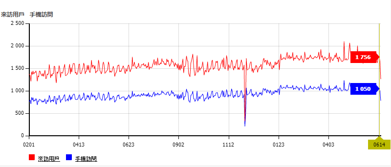
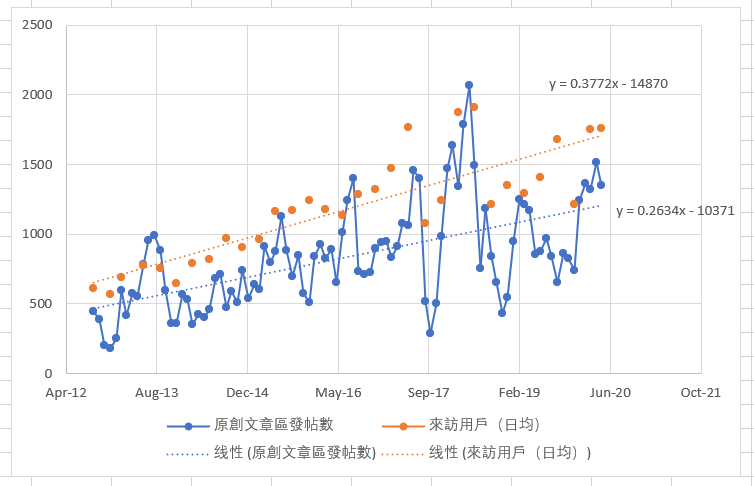

# 【神寂杯】投票數比【挑战杯】少，是不是宣傳不夠力呢？

作者：phone2345

TID：28908

<title>1</title> <link href="../Styles/Style.css" type="text/css" rel="stylesheet">

# 1

*本帖最後由 phone2345 於 2020-6-16 20:27 編輯*

[【神寂杯】文章大赛投票总决赛！](https://giantessnight.com/gnforum2012/forum.php?mod=viewthread&tid=28860)

今晚【神寂杯】就要結束了，從目前投票數來看比去年【挑战杯】284票少了，但比較論壇每日訪問人次確是比去年多了約500人，參賽人數也是歷年最多。

[https://giantessnight.com/gnforum2012/misc.php?types%5B%5D=login&types%5B%5D=mobilelogin&primarybegin=2019-01-01&primaryend=2020-06-16&type=&mod=stat&op=trend](https://giantessnight.com/gnforum2012/misc.php?types%5B%5D=login&types%5B%5D=mobilelogin&primarybegin=2019-01-01&primaryend=2020-06-16&type=&mod=stat&op=trend)

到底發生了什麼問題呢？
這兩次比賽我都參與了宣傳工作，做了票數變化統計，甚至在【挑战杯】發現了小號灌票的問題

兩次比賽中，除了上面說的參賽者與每日訪問人次差別外，還有三個不一樣的地方：

*   官方Q群沒了
*   首頁沒有熱圖了
*   貼吧不再開放宣傳GN了

或許是因為這三個最容易讓GN用戶注意到活動的地方沒有了，導致這次比賽即使有了更多的作品與活躍用戶，加入投票的人確比較少吧。

我沒有數據能說明活躍用戶來論壇都會瀏覽那些板快，或許大部分人不看文章也說不定，但依我到各平台宣傳的經驗卻發現很多人是不知道GN有辦活動的，甚至不少人是會瀏覽文章區的用戶，因此我建議管理可以對discuz系統作一些設定調整，例如：

*   增加廣告欄位，讓論壇活動可以更直接被進入論壇的用戶注意到
*   增加投票的獎勵，只要參加投票系統就+100 Ducat，每月限1次。

(這些都是discuz自帶功能)

關於拉票與灌票問題，據我所知論壇的原則是禁止分身小號投票，具體檢查方法也只有查IP，實在沒有其他辦法做的更好。或許有人會建議應該在投票結果公布前，即使投完票也不能看見票數數據，然而論壇並沒有這樣的功能，除非改代碼才可能做到。

另一種被提出的方法是用論壇外的問卷投票系統來統計，雖然設定更靈活，也能讓牆內的用戶參與，但要確認投票者是不是論壇用戶反而非常困難，更容易有假帳號或分身投票的情況。

因此，我認為對灌票拉票最好的解決方法還是擴大宣傳，讓更多的人參與活動，如此一來即使有這種情況影響也會比較少吧。希望未來辦活動時，不只有勳章與獎勵，還能有更好的宣傳措施。若有我能幫忙的部分也會繼續盡力而為的。

最後，附上這次【神寂杯】票數紀錄數據
[https://docs.google.com/spreadsheets/d/e/2PACX-1vT6yUdH2tnNgUkDsAgzy6Ulg-ROno8JB496Gr-EZI9qms75otBU92CEFYaoI2ycDEuFPjGoLgG_QRlt/pubhtml](https://docs.google.com/spreadsheets/d/e/2PACX-1vT6yUdH2tnNgUkDsAgzy6Ulg-ROno8JB496Gr-EZI9qms75otBU92CEFYaoI2ycDEuFPjGoLgG_QRlt/pubhtml)

<title>2</title> <link href="../Styles/Style.css" type="text/css" rel="stylesheet">

# 2

 <ignore_js_op>[GN每日來訪用戶.png](forum.php?mod=attachment&aid=ODM0Mzh8YjcxODZlMjV8MTY3NDA2NjQyNXwxODIzMHwyODkwOA%3D%3D&nothumb=yes) *(27.34 KB, 下載次數: 0)*

[下載附件](forum.php?mod=attachment&aid=ODM0Mzh8YjcxODZlMjV8MTY3NDA2NjQyNXwxODIzMHwyODkwOA%3D%3D&nothumb=yes)

2020-6-16 16:22 上傳  

</ignore_js_op> <title>3</title> <link href="../Styles/Style.css" type="text/css" rel="stylesheet">

# 3

感觉随着优秀的创作者涌现，各类G娘艺术表现形式百花齐放，而形式相对单一的文章会有所退步也是可以理解的...

不管怎么样，楼主对赛事方面辛勤的统计和其他各项工作的认真态度令人敬佩，辛苦了 <title>4</title> <link href="../Styles/Style.css" type="text/css" rel="stylesheet">

# 4

我甚至不知道有投票了。。。 <title>5</title> <link href="../Styles/Style.css" type="text/css" rel="stylesheet">

# 5

*本帖最後由 妈的智障 於 2020-6-17 00:24 編輯*

跟着楼上的想法，自己去稍微做了个图，取了[来访统计](https://giantessnight.com/gnforum2012/misc.php?types%5B%5D=login&primarybegin=2012-08-01&primaryend=2020-06-16&type=&mod=stat&op=trend)和[原创文章板块统计](https://giantessnight.com/gnforum2012/misc.php?mod=stat&op=forumstat&fid=7)的值，然后Exel自动算出线性回归（来访因为下载不了excel数据就每隔3个月随机取一天当平均了 懒）
然后发现好像确实有这样的倾向。
一个猜测是文章区热度下降，还有一种想法是非汉语使用者的增多（反正我上GC是不看文章区的）
这一段的逻辑是有一些问题的 但既然没人提的话那就是不存在问题）
<title>6</title> <link href="../Styles/Style.css" type="text/css" rel="stylesheet">

# 6

 <ignore_js_op>[Snipaste_1.png](forum.php?mod=attachment&aid=ODM0NTF8NGJiNjQ4ODh8MTY3NDA2NjQyNXwxODIzMHwyODkwOA%3D%3D&nothumb=yes) *(48.21 KB, 下載次數: 0)*

[下載附件](forum.php?mod=attachment&aid=ODM0NTF8NGJiNjQ4ODh8MTY3NDA2NjQyNXwxODIzMHwyODkwOA%3D%3D&nothumb=yes)

2020-6-16 22:39 上傳  

</ignore_js_op> <title>7</title> <link href="../Styles/Style.css" type="text/css" rel="stylesheet">

# 7

都太好了会犯选择困难症…索性就不投了
现在回想起来我这想法是不是有点毒瘤？