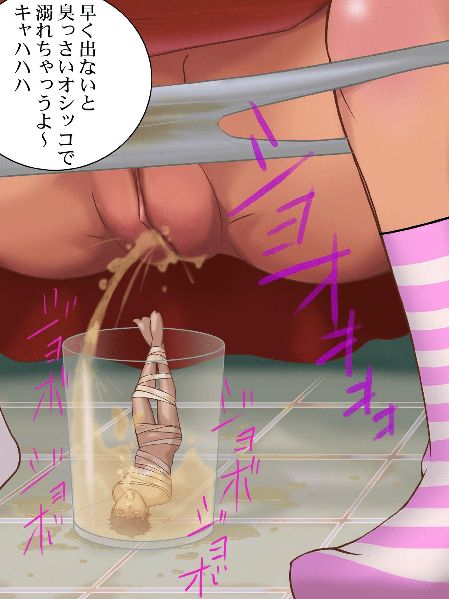

# [福利]日本在X片里面杀人，警察不会管么？

作者：jiangyangyu

TID：6433

<title>1</title> <link href="../Styles/Style.css" type="text/css" rel="stylesheet">

# 1

YAPOO 56有一个片子，讲的是一群女的，把一个奴隶捆起来，脸上做了一个塑料桶，然后尿在桶里面，最后把那个奴隶溺死了。
我开始认为这是加的，虽然镜头很长时间没有换过，但是远远不到人类的憋气极限，而且把杀了人的片子放出去，这根本就是在自寻死路。
但是后来听说，这个奴隶事先签订了生死协议，然后就真正的在片子里面杀死了他。
日本的警察真的不会管么？怎么说也是杀人了，我记着外国有个男人，想要吃人，于是在网上贴出来了，结果真的找到一个自愿者，但是那个男人最重还是被警察抓了。

“食人恶魔”量刑难 吃“自愿者”算不算谋杀
2003-12-05 16:56:45 新华网  ·发表评论　·查看评论

被过滤广告

　　法律专家指出，由于被害人的确自愿被人吃掉，因此从法学角度而言，很难判定梅韦斯犯有谋杀罪。“这是由杀人犯和被害人共同进行的杀戮，不能被认定是性质最恶劣的预谋杀人。但我也不认为这是应（被害人要求）杀人，因为它并非只有纯粹的利他性，而是具有利己性的行为，”吉森大学犯罪学学院教授阿图尔·克罗伊策说。　　

　　据报道，此案控方检察官承认，梅韦斯导演的杀人碎尸案在德国刑事犯罪史上绝无仅有。由于在德国吃人肉恶行一直都是法律盲区，因此他们将面临不少司法难题。为此，控方惟有以“为满足性欲杀人”和“损毁尸体罪”两项罪名对其提出起诉。但是这两项罪名同样也可能被驳倒，因为所有应征受害者都确实签署了所谓“自愿受死书”，不过控方强调，梅韦斯体内一直萌动着肢解某人并将其分食的变态欲望，即使受害者是自愿应征，但这无法改变食人魔为满足变态性冲动而杀人的犯罪事实。　　

　　据悉，法庭将会在2004年年初对他做出最终判决。司法专家分析，如果梅韦斯罪名成立他将被处终身监禁。但是梅韦斯的辩护律师却乐观地认为，他的罪行最坏也就是“协助杀人罪”。而按照德国法律，对“协助杀人”罪的量刑要轻得多，被告只会被判监5年。（北京晚报/麦吉尔）

[http://news.163.com/2003w12/12391/2003w12_1070614608645.html](http://news.163.com/2003w12/12391/2003w12_1070614608645.html)

就算不判那些女人的刑，警察也会解散这个组织吧？
——————————————————————————————————————

你说这和GTS没有关系？好吧，好吧，给出福利。
而且是和关键词有关系的福利哦。
<ignore_js_op>

**7470611.JPG** *(157.56 KB, 下載次數: 9)*

[下載附件](forum.php?mod=attachment&aid=MTY3Mzl8Njk4MGZhMjN8MTY3NDA2ODk1NXwxODIzMHw2NDMz&nothumb=yes)

2010-1-24 20:07 上傳

<title>2</title> <link href="../Styles/Style.css" type="text/css" rel="stylesheet">

# 2

一句話來說,只要一傳出去就高達八成會出事... <title>3</title> <link href="../Styles/Style.css" type="text/css" rel="stylesheet">

# 3

福利大好 <title>4</title> <link href="../Styles/Style.css" type="text/css" rel="stylesheet">

# 4

  放出去了，我也下到了，而且還是從歐美的論壇下的。

  應該是很多年前的了，YAPOO之後還是存在，也沒有任何新聞，但是一些玩SM的人說，這是真的。
到現在我也不知道是真假了...... <title>5</title> <link href="../Styles/Style.css" type="text/css" rel="stylesheet">

# 5

你说些啥，我听不明白啊 <title>6</title> <link href="../Styles/Style.css" type="text/css" rel="stylesheet">

# 6

不会吧 <title>7</title> <link href="../Styles/Style.css" type="text/css" rel="stylesheet">

# 7

難分真與假...

其實如果沒甚麼確實證據(還有,有人去報警)的話,警察才懶得去幹甚麼事呢... <title>8</title> <link href="../Styles/Style.css" type="text/css" rel="stylesheet">

# 8

我的观后感：99.9%是假的。 <title>9</title> <link href="../Styles/Style.css" type="text/css" rel="stylesheet">

# 9

我觉得，我们不用去评论yopoo，因为99%都不是真的。
在日本法制是应该健全吧（猜测），一个法制健全的国家这种情况应该有法律规定。
特别现在还是：人权至上。 <title>10</title> <link href="../Styles/Style.css" type="text/css" rel="stylesheet">

# 10

我正在下。。里面有几个mm还是很不错哦 <title>11</title> <link href="../Styles/Style.css" type="text/css" rel="stylesheet">

# 11

给个地址好吗？？ <title>12</title> <link href="../Styles/Style.css" type="text/css" rel="stylesheet">

# 12

那个俺也看过，不过感觉是假的……除非真正有参与过那个视频拍摄的人很负责人的说是真的……呃，也就是确凿的证据，否则，一帮同好以讹传讹，都是道听途说的~片子里面拍摄的一切都有可能是假的
---------
这几天刚看了变形金刚的特辑，呃……那帮做动画的就没有gts爱好者？太遗憾了~~~做的简直……哎

[ *本帖最後由 muzidianli 於 2010-1-25 08:50 編輯* ] <title>13</title> <link href="../Styles/Style.css" type="text/css" rel="stylesheet">

# 13

yapoo我每集都有的,所以开始看56的时候还觉得是真的,但是后来出的每集都有杀人了,而且被杀的人又在下一集出现,所以知道肯定是假的了 <title>14</title> <link href="../Styles/Style.css" type="text/css" rel="stylesheet">

# 14

不会是99％是假，而是决对是假 <title>15</title> <link href="../Styles/Style.css" type="text/css" rel="stylesheet">

# 15

好想看看是什么样的 <title>16</title> <link href="../Styles/Style.css" type="text/css" rel="stylesheet">

# 16

谁有地址发来看看。我没看过。。嘿嘿！！
看看到底是不是假的 <title>17</title> <link href="../Styles/Style.css" type="text/css" rel="stylesheet">

# 17

YAPOO是啥......可否PM个LINK
我也想来“鉴定”一下...... <title>18</title> <link href="../Styles/Style.css" type="text/css" rel="stylesheet">

# 18

哪个有56的下载????? <title>19</title> <link href="../Styles/Style.css" type="text/css" rel="stylesheet">

# 19

如果yapoo能做个gts类的就好了 <title>20</title> <link href="../Styles/Style.css" type="text/css" rel="stylesheet">

# 20

吾人就当什么也没看见吧...........中午饭不用吃了，省钱..................</ignore_js_op>