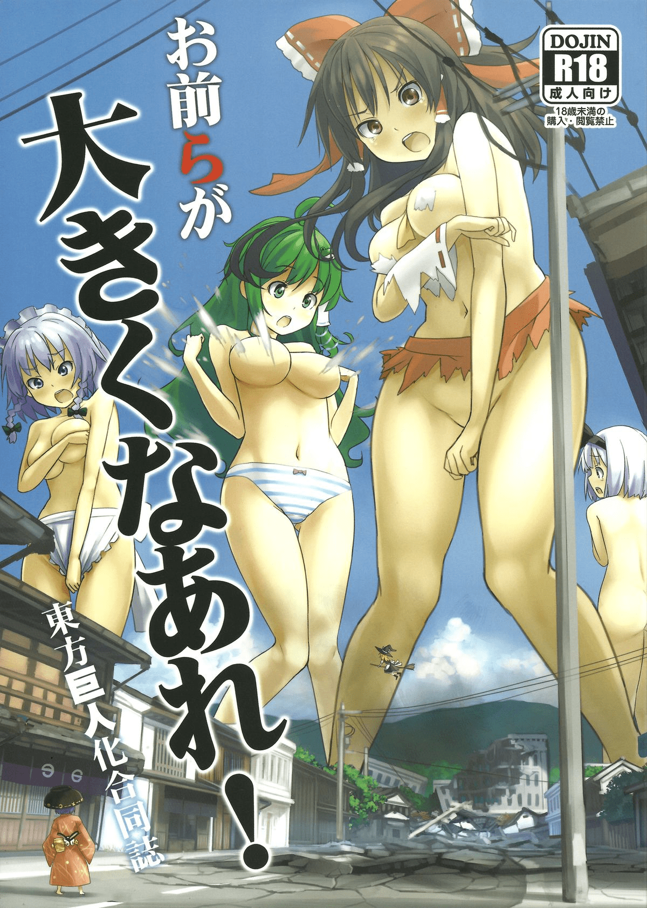
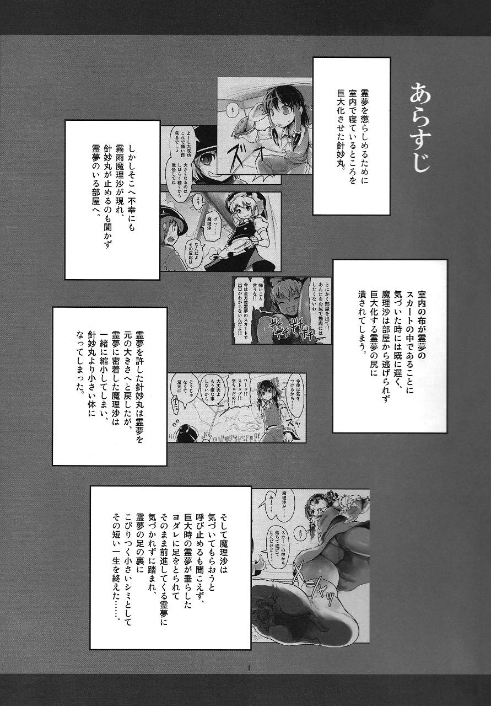
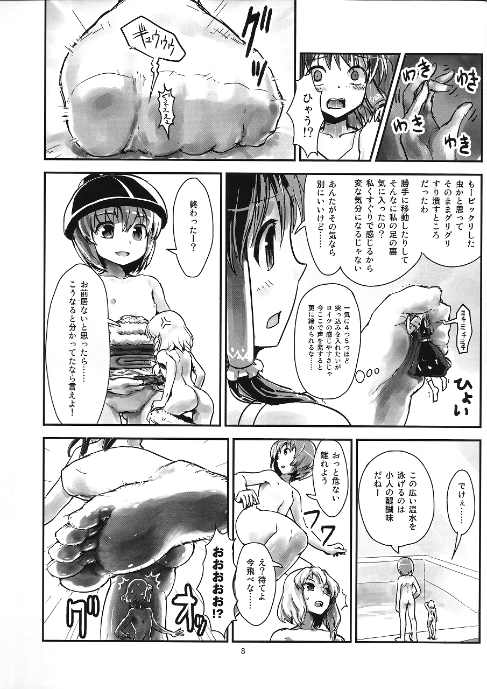
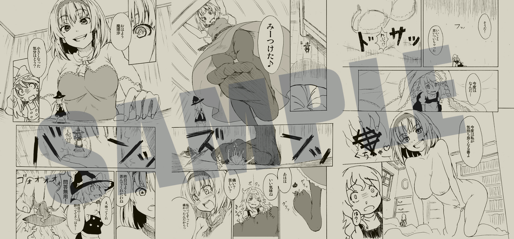

# （福利）某作品 前or后（插）作？

作者：ak47jkluio

TID：19656

<title>1</title> <link href="../Styles/Style.css" type="text/css" rel="stylesheet">

# 1

*本帖最後由 jiachufan1 於 2015-8-17 00:31 編輯*

[http://exhentai.org/g/766572/747a98b0a7/](http://exhentai.org/g/766572/747a98b0a7/)
<ignore_js_op>

**000.jpg** *(373.88 KB, 下載次數: 0)*

[下載附件](forum.php?mod=attachment&aid=NTM4NTh8ZmZlNTAwZDF8MTY3NDA2NzUzNnwxODIzMHwxOTY1Ng%3D%3D&nothumb=yes)

2015-8-17 00:12 上傳

想必这个大家都看过吧。没看过上面有链接。。。。熊猫 绕行

通过某渠道获得 这个作品前半部分的前or后？作，嗯应该可以这么说
<ignore_js_op>

**01.png** *(1.08 MB, 下載次數: 0)*

[下載附件](forum.php?mod=attachment&aid=NTM4NTl8MjVmYTcwNGR8MTY3NDA2NzUzNnwxODIzMHwxOTY1Ng%3D%3D&nothumb=yes)

2015-8-17 00:17 上傳

<ignore_js_op>

**08.png** *(775.35 KB, 下載次數: 0)*

[下載附件](forum.php?mod=attachment&aid=NTM4NjB8MzhlMDhlNDh8MTY3NDA2NzUzNnwxODIzMHwxOTY1Ng%3D%3D&nothumb=yes)

2015-8-17 00:21 上傳

别数了，一共12张，虽然短 可以旋转
经过我的画风鉴定
肯定是同一个作者
我感觉只要是我没看过的东西  绝大多数人肯定都没看过
<ignore_js_op> [新建文件夹 (2).7z](forum.php?mod=attachment&aid=NTM4NjF8NDNkYWE1Y2V8MTY3NDA2NzUzNnwxODIzMHwxOTY1Ng%3D%3D) *(9.73 MB, 下載次數: 3401)* 2015-8-17 00:24 上傳點擊文件名下載附件
为了减缓服务器运载量
特意使用了7z固定压缩算法，使得压缩后体积最小
压缩工具上就是这样写的....

额，最后插一句。求野生日语翻译帝差不多就酱紫
重要的事情不用说三遍，看见这句话就可以了。 <title>2</title> <link href="../Styles/Style.css" type="text/css" rel="stylesheet">

# 2

這就續集啊，第一部出很久了………… <title>3</title> <link href="../Styles/Style.css" type="text/css" rel="stylesheet">

# 3

[http://exhentai.org/g/842858/40b2240ff5/](http://exhentai.org/g/842858/40b2240ff5/)
就是这个吧 <title>4</title> <link href="../Styles/Style.css" type="text/css" rel="stylesheet">

# 4

感謝大大分享阿
不過跟第一部一樣看不太懂@@ <title>5</title> <link href="../Styles/Style.css" type="text/css" rel="stylesheet">

# 5

感谢LZ缩小同人志等了好久，但那个鬼做什么点进去还是熊猫 <title>6</title> <link href="../Styles/Style.css" type="text/css" rel="stylesheet">

# 6

这东西都有续篇啊...
倒是另外的合同本似乎一直没流 <title>7</title> <link href="../Styles/Style.css" type="text/css" rel="stylesheet">

# 7

附件是续作，讲的是魔理沙被灵梦带着缩小之后要洗掉味道的故事，牙刷play洗澡play什么的

好好看本子，要什么翻译 <title>8</title> <link href="../Styles/Style.css" type="text/css" rel="stylesheet">

# 8

表示后作灵梦篇拿到有一段时间了……就是其他部分依旧堵得严严实实流不出…… <title>9</title> <link href="../Styles/Style.css" type="text/css" rel="stylesheet">

# 9

为什么我打不开啊。。。他说压缩文件格式未知或数据损坏。。 <title>10</title> <link href="../Styles/Style.css" type="text/css" rel="stylesheet">

# 10

看到东方的东西必须支持一下啊 <title>11</title> <link href="../Styles/Style.css" type="text/css" rel="stylesheet">

# 11

我想直接解压，他说在选定的文件和文件夹中没有发现压缩文件怎么破 <title>12</title> <link href="../Styles/Style.css" type="text/css" rel="stylesheet">

# 12

<ignore_js_op>

**47809383_p1_master1200.jpg** *(428.84 KB, 下載次數: 0)*

[下載附件](forum.php?mod=attachment&aid=NTM4Njl8MmNhZTU0Mjd8MTY3NDA2NzU1N3wxODIzMHwxOTY1Ng%3D%3D&nothumb=yes)

2015-8-17 21:05 上傳

这是c87的東方小人化合同誌吧，一直就找不到全本的啊,转眼间都c88了...
<title>13</title> <link href="../Styles/Style.css" type="text/css" rel="stylesheet">

# 13

感谢楼主搬运过来的地址...这个系列真的蛮喜欢的耶，但是就总感觉还差一步，虽然真的非常赞 <title>14</title> <link href="../Styles/Style.css" type="text/css" rel="stylesheet">

# 14

然而我不知道我为什么会有这个漫画的全片  23333 不知道发上来好不好 <title>15</title> <link href="../Styles/Style.css" type="text/css" rel="stylesheet">

# 15

前作好久之前就看过了，好像记得还有futa来着，居然还有后？
<title>16</title> <link href="../Styles/Style.css" type="text/css" rel="stylesheet">

# 16

十分感谢楼主的分享。 <title>17</title> <link href="../Styles/Style.css" type="text/css" rel="stylesheet">

# 17

kandao qian mian loul shuo you diyi bo mo ... <title>18</title> <link href="../Styles/Style.css" type="text/css" rel="stylesheet">

# 18

C90了 还是没看到缩小合集流出QwQ <title>19</title> <link href="../Styles/Style.css" type="text/css" rel="stylesheet">

# 19

看到东方的就必须来赞一个  不过话说没有全部的还真是不过瘾 <title>20</title> <link href="../Styles/Style.css" type="text/css" rel="stylesheet">

# 20

想必这个大家都看过吧。没看过上面有链接。。。。熊猫 绕行

请问怎么绕行 <title>21</title> <link href="../Styles/Style.css" type="text/css" rel="stylesheet">

# 21

东方赛高，感谢楼主大大分享</ignore_js_op></ignore_js_op></ignore_js_op></ignore_js_op></ignore_js_op>