# [繪畫] 從零開始的繪畫練習—「線」篇

作者：3213213210

TID：26155

<title>1</title> <link href="../Styles/Style.css" type="text/css" rel="stylesheet">

# 1

*本帖最後由 3213213210 於 2018-12-14 02:44 編輯*

續篇： [https://giantessnight.com/gnforu ... hread&tid=26159](https://giantessnight.com/gnforum2012/forum.php?mod=viewthread&tid=26159)

上次我發了一個「給上色殘障的電繪練習」，
[https://giantessnight.com/gnforu ... iewthread&tid=26115](https://giantessnight.com/gnforum2012/forum.php?mod=viewthread&tid=26115)
得到最多的回饋是「對新手太不友善，練起來效率存疑」
這點我無法為自己辯護，一開始就是我用字不當又解釋不清
我應該說的是「明明畫畫練很久了，卻無論如何也搞不定顏色的調配」的人特別推薦
嗯，沒錯，我是拿自己當模板在寫那篇的，雖然不是老手但我也不該當自己新手了
臨摹最大的意義在於「用自己的方法意識到結構」，但連畫面都看不懂的真‧新手……
這樣的人練那個會有用嗎? 有，但是摸索期長到很不現實
動輒數十小時本身不是問題，怕的是摸十幾個小時還沒半點進展

所以，今天我就來寫幾篇「完全不會畫畫的人」專用的繪畫教學吧
什麼叫完全不會畫畫呢? 就是請你畫一個長髮女生，成品會長得像這樣：
<ignore_js_op>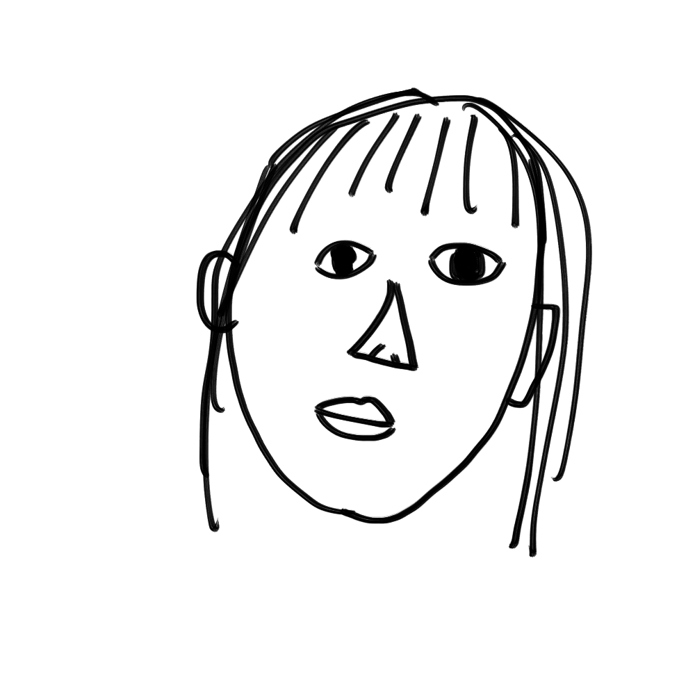

**新手.jpg** *(122.25 KB, 下載次數: 0)*

[下載附件](forum.php?mod=attachment&aid=NzU3MjR8NjA1OGEzODh8MTY3NDA2OTY0NXwxODIzMHwyNjE1NQ%3D%3D&nothumb=yes)

2018-12-12 02:44 上傳

針對這樣畫技在幼稚園畢業就沒再進化的人 提供的觀察方法指引！
(如果不信任我也可以自己去買本「三十天學會畫畫」之類的，多看點不會有損失)
已經有經驗的人，可以用我的文字敘述分析自己的經驗，再用來教導其他人
這只是第一集，等我夠閒就會再出「面」的教學

=============================**正文開始**==================================

其實要從「完全不會畫畫」變「稍微會點漫畫」很簡單，只要能意識到「該在哪裡放線條」就可以了
在畫正方體時，由於每個邊界都很清楚，要把那裡的線條強調出來一看即知
<ignore_js_op>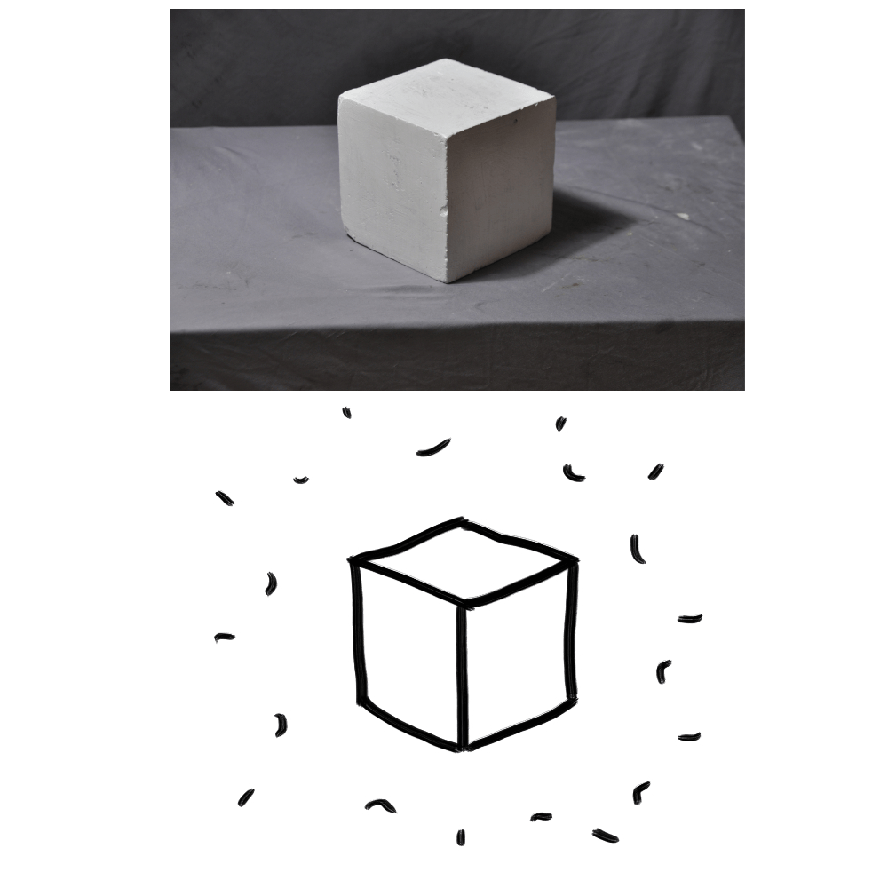

**正方體.jpg** *(267.56 KB, 下載次數: 0)*

[下載附件](forum.php?mod=attachment&aid=NzU3MjV8NzM5ZTQ1YjJ8MTY3NDA2OTY0NXwxODIzMHwyNjE1NQ%3D%3D&nothumb=yes)

2018-12-12 02:51 上傳

(上圖圖源：[http://www.sumiaowang.com/](http://www.sumiaowang.com/))
但是，面對有曲面的物體時，完全不會畫畫的人就變智障了
<ignore_js_op>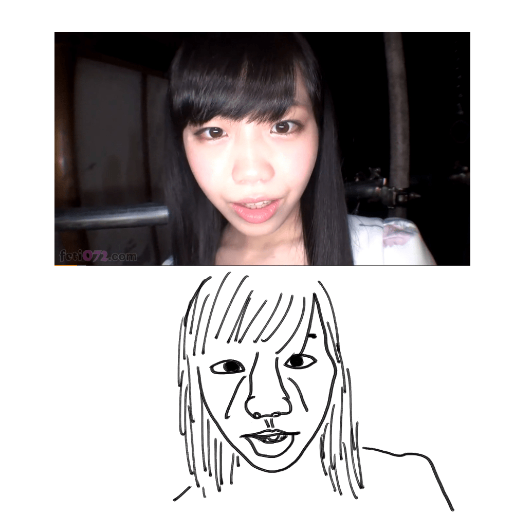

**不會畫畫.jpg** *(288.54 KB, 下載次數: 0)*

[下載附件](forum.php?mod=attachment&aid=NzU3Mjd8YTJlMjk1MGJ8MTY3NDA2OTY0NXwxODIzMHwyNjE1NQ%3D%3D&nothumb=yes)

2018-12-12 03:11 上傳

(圖：[https://www.pornhub.com/view_video.php?viewkey=ph5b3f843ebe075](https://www.pornhub.com/view_video.php?viewkey=ph5b3f843ebe075))
(尾崎ののか，Ozaki Nonoka，evis00155)
媽的勒見鬼啦幹
……咳咳，即便是將原圖墊在下面描，還是可以產生這樣的大災難呢
我相信，對於完全沒畫過畫的人，第一件得搞懂的事情就是：
「**輪廓**在哪裡?」
<ignore_js_op>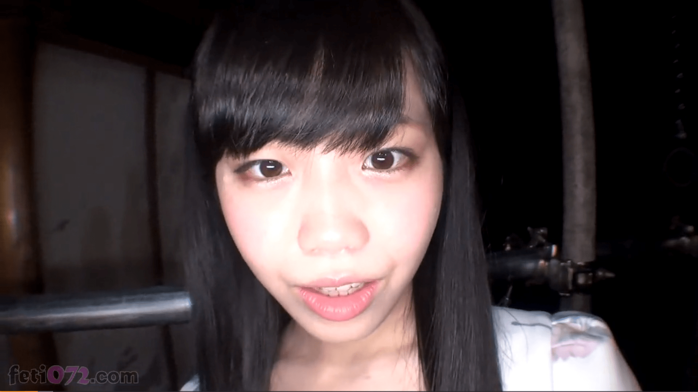

**正臉.jpg** *(192.44 KB, 下載次數: 0)*

[下載附件](forum.php?mod=attachment&aid=NzU3MzZ8ODE1MjhjYmF8MTY3NDA2OTY0NXwxODIzMHwyNjE1NQ%3D%3D&nothumb=yes)

2018-12-12 05:17 上傳

(原影片超精彩的，我允許你先尻一槍再回來)

當然，每個人的盲點不盡相同，但不管，這裡我從線條開始講起
請各位作的**最初階練習**，便是**描圖**，但只留下**必要的線條**
(有電繪板的請用圖層功能，沒有的去買**描圖紙**然後列印相片墊在下面)
(最好是用臨摹的，但……請量力而為) 
回來看例子，這張圖的不和諧感，主因是我在「曲折面」與「顏色微小變化處」畫上了粗線條，這些都不是必要的

(希望她不會看到這張圖)
(這裡重放了前面的圖，如果沒有正常顯示請自己往回拉) ……那什麼是必要的線條?

對於輪廓是否需要繪製，我個人的作法是利用兩個步驟判斷，
1.**這裡是否有一物掩蓋住另一物?** 若是，則此處有輪廓
2.**若否，此處是否是凹折的稜角?** 若是，則此處有輪廓

實際應用上還會有更多變數，但這裡我盡量精簡說明
1.所謂的「一物掩蓋一物」是指，「依照當下視角，一物懸空遮掩到另一物」
<ignore_js_op>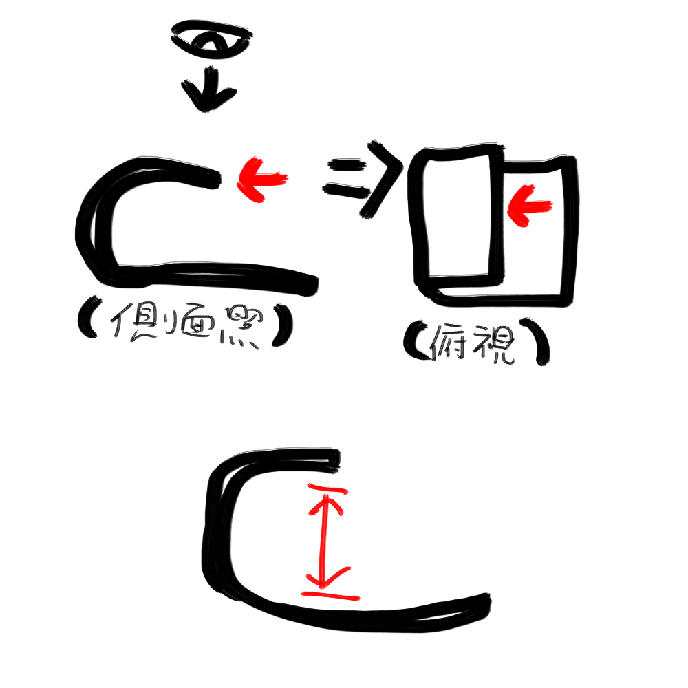

**懸空.jpg** *(134.32 KB, 下載次數: 0)*

[下載附件](forum.php?mod=attachment&aid=NzU3MzV8ZTRhMzcwYWV8MTY3NDA2OTY0NXwxODIzMHwyNjE1NQ%3D%3D&nothumb=yes)

2018-12-12 05:11 上傳

(上半的紅色箭頭意指此乃同一處，下半的紅色箭頭說明「懸空」的含意)
(遮掩者與被遮掩者可能是同一物體，如範例)
也就是說，正面看的鼻子在鼻孔此處有懸空，鼻孔因此必須繪製輪廓
而鼻中膈與臉的連接並沒有懸空，此處便(還)不需繪製輪廓
<ignore_js_op>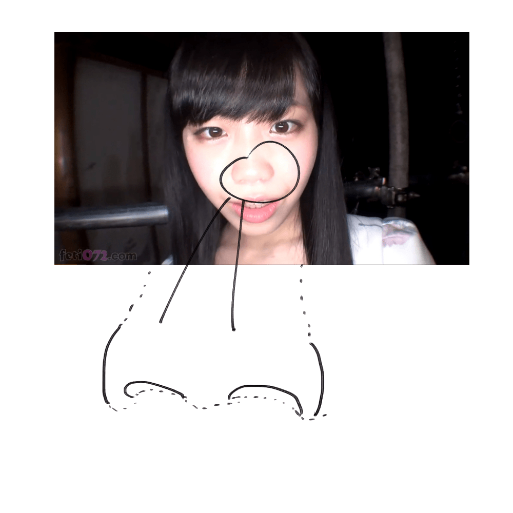

**不會畫畫-2.jpg** *(235.54 KB, 下載次數: 0)*

[下載附件](forum.php?mod=attachment&aid=NzU3Mjh8ODkwMDA2MmV8MTY3NDA2OTY0NXwxODIzMHwyNjE1NQ%3D%3D&nothumb=yes)

2018-12-12 03:28 上傳

(實線代表有懸空的實體，虛線代表此視角觀察時連接在一起的部分、此處無須繪製)
那麼，依照這個「有疊再畫」的邏輯重來，畫面變成了這樣：
<ignore_js_op>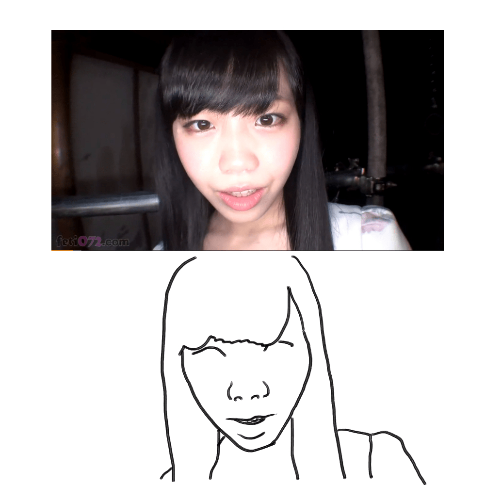

**不會畫畫-3.jpg** *(252.93 KB, 下載次數: 0)*

[下載附件](forum.php?mod=attachment&aid=NzU3Mjl8MzY3MGE1YWZ8MTY3NDA2OTY0NXwxODIzMHwyNjE1NQ%3D%3D&nothumb=yes)

2018-12-12 03:38 上傳

(那不是眉毛，是上眼瞼)
這還不能算合格，但已經比剛才的妖魔鬼怪還像人了
下一步，便是尋找稜角

2.所謂「稜角」便是方才……剛才的正方體的邊界，尖銳到必須強調的輪廓
<ignore_js_op>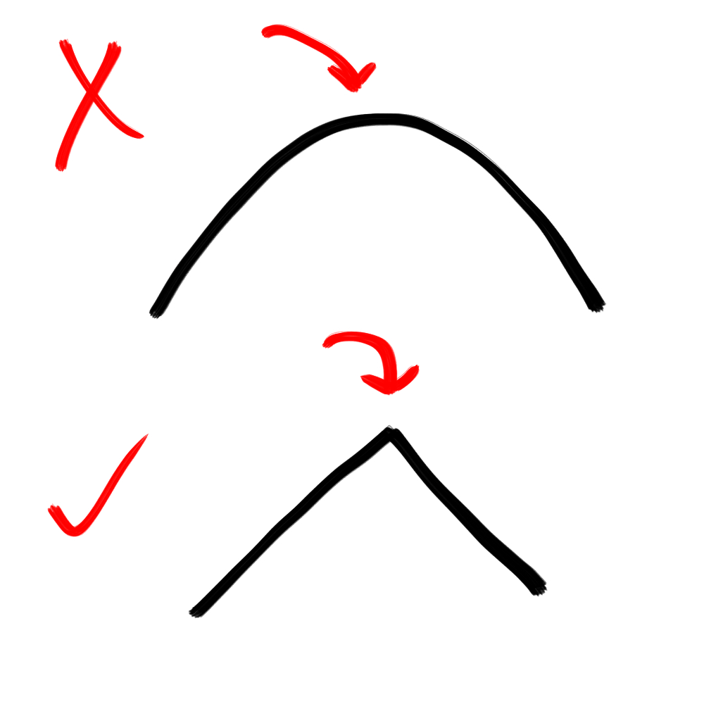

**弧度.jpg** *(110.53 KB, 下載次數: 0)*

[下載附件](forum.php?mod=attachment&aid=NzU3MzR8Yjc3NDgyMTN8MTY3NDA2OTY0NXwxODIzMHwyNjE1NQ%3D%3D&nothumb=yes)

2018-12-12 05:03 上傳

(上面那種表面不用畫，下面那種要畫)
然而，這個差別在實務上並沒有辦法作很確切的畫分，因自然界不存在絕對銳利的稜角(就算有也不在本次討論範疇)
如果無法判斷，就試試看，看怎樣畫面比較和諧
(密技：弧度越大，顏色越淡或是線條越細)
回來看看鼻子，弧度似乎足夠讓我們認為這邊不需繪製輪廓
那這張臉哪邊明顯相對銳利呢?
<ignore_js_op>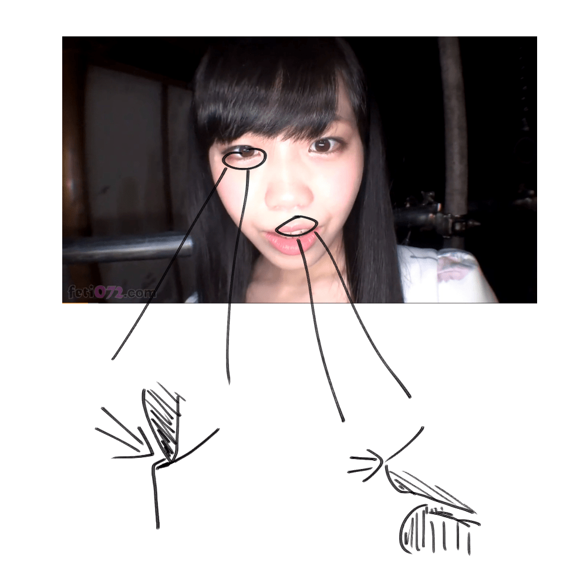

**不會畫畫-4.jpg** *(261.4 KB, 下載次數: 0)*

[下載附件](forum.php?mod=attachment&aid=NzU3MzB8YWIyY2E0Yjl8MTY3NDA2OTY0NXwxODIzMHwyNjE1NQ%3D%3D&nothumb=yes)

2018-12-12 03:47 上傳

眼球與下眼瞼因為是兩個有硬度的物體貼在一起，角度非常明顯
上嘴唇與人中的夾角並沒有這麼明顯，可以稍微將線條畫細
再將這兩個地方補上去……

<ignore_js_op>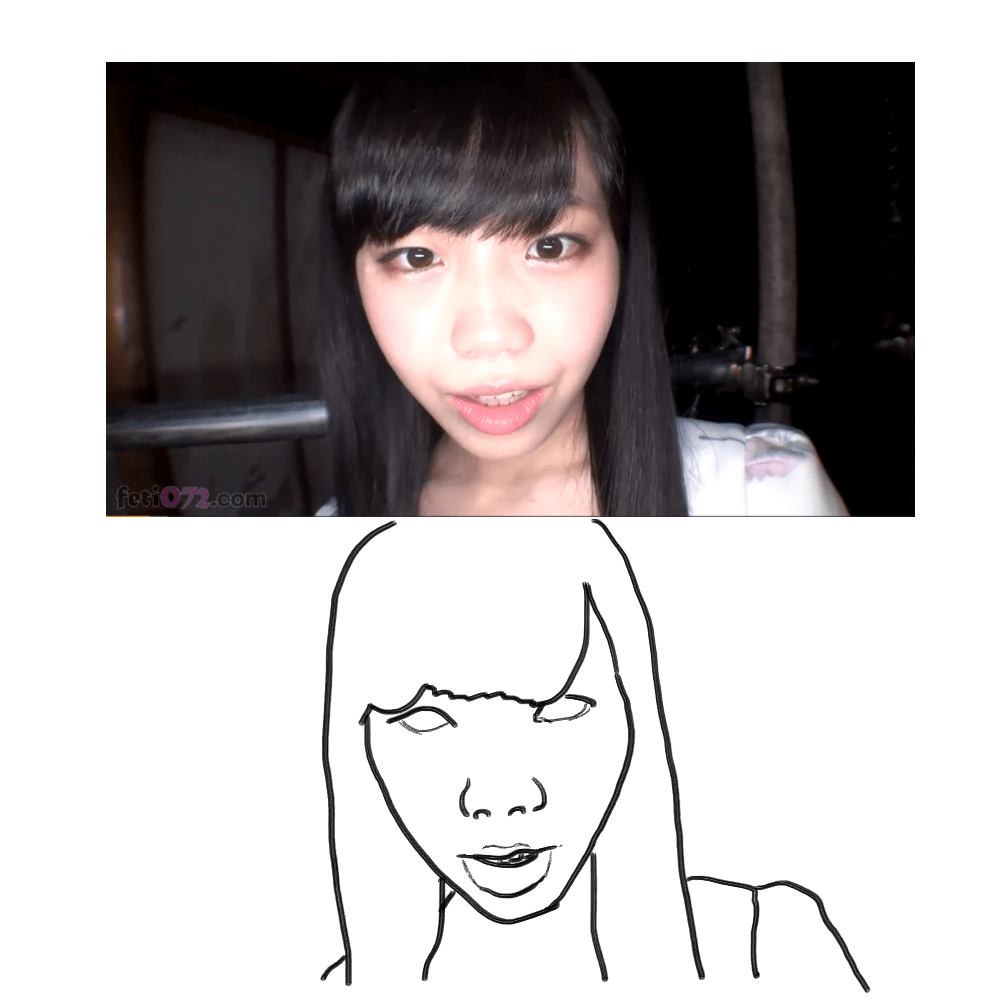

**不會畫畫-5.jpg** *(255.23 KB, 下載次數: 0)*

[下載附件](forum.php?mod=attachment&aid=NzU3MzF8ZTJlYjkzMWF8MTY3NDA2OTY0NXwxODIzMHwyNjE1NQ%3D%3D&nothumb=yes)

2018-12-12 03:53 上傳

完成了！
……個屁啦，眼球在哪啊?
這就是我剛才說的，應用上會有許多例外
上面兩條規則在處理不規則物時很有效，但人腦的視訊處理方式遠遠複雜許多
在這裡，「雖然在同一平面上卻有很劇烈的色差」，視覺上也會判斷為輪廓
雖然一般來說，照片中會出現劇烈色差是因為兩個不同的物件就擺在附近，不會每次都失靈
但畫畫嘛，**最重要的還是成品好不好看、玩得開不開心**，別被自己的規則束縛住，大膽嘗試吧
<ignore_js_op>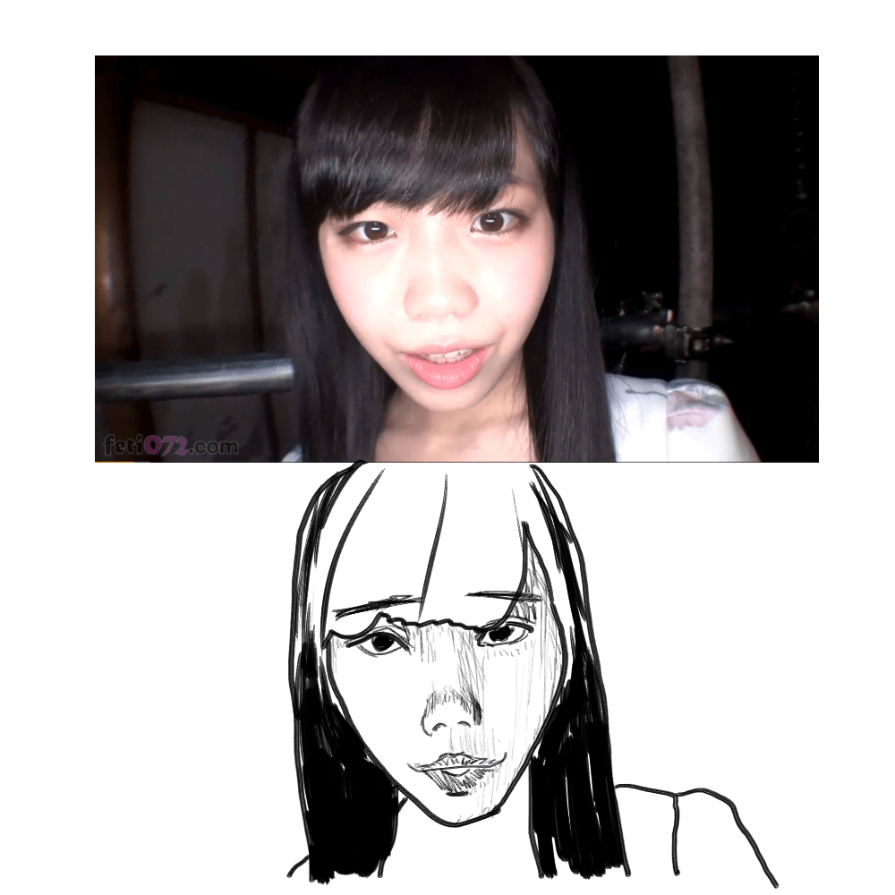

**有點會畫畫.jpg** *(294.23 KB, 下載次數: 0)*

[下載附件](forum.php?mod=attachment&aid=NzU3MzN8ZWRiM2E5YWF8MTY3NDA2OTY0NXwxODIzMHwyNjE1NQ%3D%3D&nothumb=yes)

2018-12-12 04:33 上傳

(能看到這句話代表你很閒，快滾去練習)

待續

<title>2</title> <link href="../Styles/Style.css" type="text/css" rel="stylesheet">

# 2

*本帖最後由 3213213210 於 2018-12-12 05:42 編輯*

靠，我要怎麼把多傳的圖片刪掉啊，太礙眼了
而且同一張圖沒辦法顯示兩次是怎樣，從編輯裡看一切正常啊
現在還會隨機吃我的換行，系統是中了替身攻擊嗎
算了，睡回去吧，大家加油

<title>3</title> <link href="../Styles/Style.css" type="text/css" rel="stylesheet">

# 3

虽然一时半会儿还没能明白_(:з」∠)_不过这样的实用帖真的是很棒，支持一下！马住慢慢学 <title>4</title> <link href="../Styles/Style.css" type="text/css" rel="stylesheet">

# 4

非常细致入微的教学，可惜我这种手残党就。。。 <title>5</title> <link href="../Styles/Style.css" type="text/css" rel="stylesheet">

# 5

*本帖最後由 3213213210 於 2018-12-12 22:10 編輯*

> [chuilaba1122 發表於 2018-12-12 17:34](https://giantessnight.cf/gnforum2012/forum.php?mod=redirect&goto=findpost&pid=392192&ptid=26155)
> 非常细致入微的教学，可惜我这种手残党就。。。

連描都懶得練就不是天分問題了
不想努力沒關係 請承認自己只是懶

編輯：抱歉有點兇 剛沒吃飯血糖低
<title>6</title> <link href="../Styles/Style.css" type="text/css" rel="stylesheet">

# 6

看完第一段就知道我是办不到的。。。。 <title>7</title> <link href="../Styles/Style.css" type="text/css" rel="stylesheet">

# 7

教程就算了，这个女的长得哪里精彩了？？？？？？？？？？？？ <title>8</title> <link href="../Styles/Style.css" type="text/css" rel="stylesheet">

# 8

> [3213213210 發表於 2018-12-12 18:57](https://giantessnight.cf/gnforum2012/forum.php?mod=redirect&goto=findpost&pid=392193&ptid=26155)
> 連描都懶得練就不是天分問題了
> 不想努力沒關係 請承認自己只是懶

嘻嘻对啊我就是懒
<title>9</title> <link href="../Styles/Style.css" type="text/css" rel="stylesheet">

# 9

> [咯咯 發表於 2018-12-13 04:25](https://giantessnight.cf/gnforum2012/forum.php?mod=redirect&goto=findpost&pid=392207&ptid=26155)
> 教程就算了，这个女的长得哪里精彩了？？？？？？？？？？？？

其實她不錯看 只是攝影機貼很近所以臉會被擴大
但我覺得 要畫GTS相關的人 應該要練練POV貼很近的畫面 所以才挑這部片截圖當範例
至於為什麼攝影機會貼很近 請看影片
[https://www.pornhub.com/view_video.php?viewkey=ph5b3f843ebe075](https://www.pornhub.com/view_video.php?viewkey=ph5b3f843ebe075)</ignore_js_op></ignore_js_op></ignore_js_op></ignore_js_op></ignore_js_op></ignore_js_op></ignore_js_op></ignore_js_op></ignore_js_op></ignore_js_op></ignore_js_op>