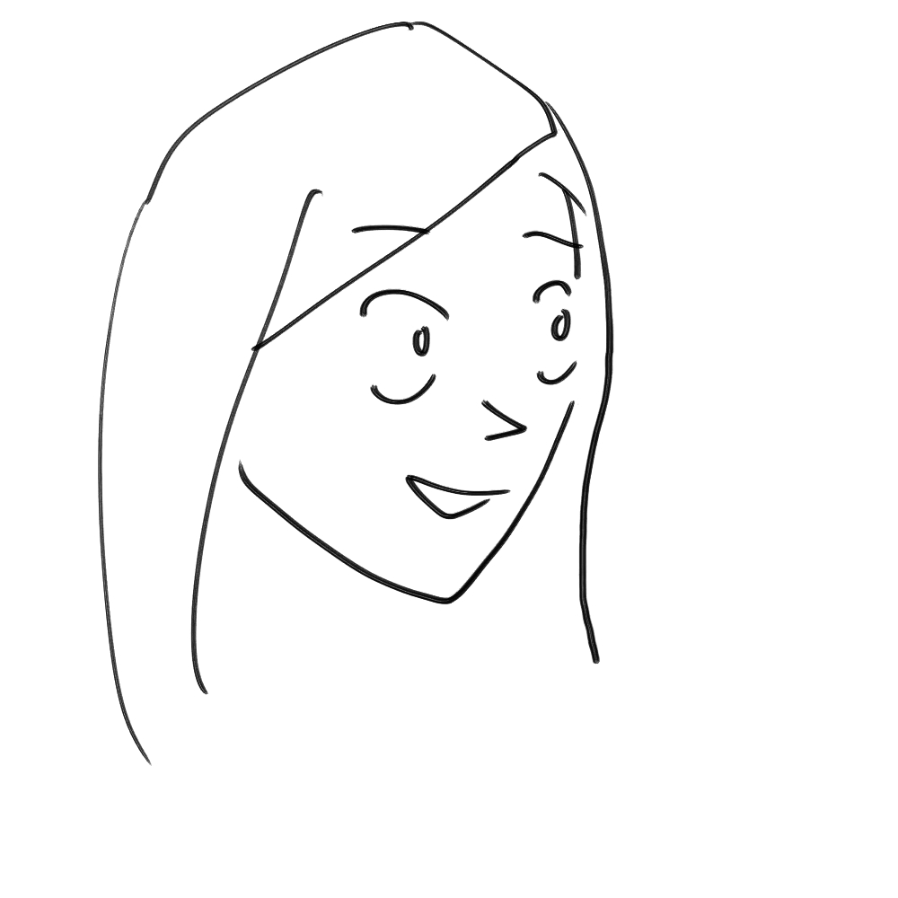
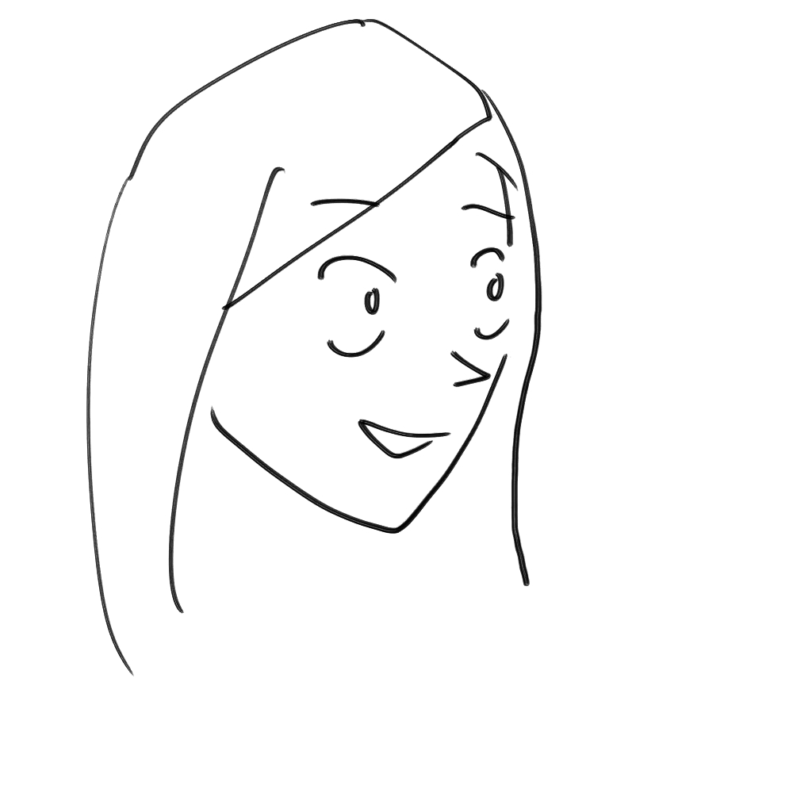
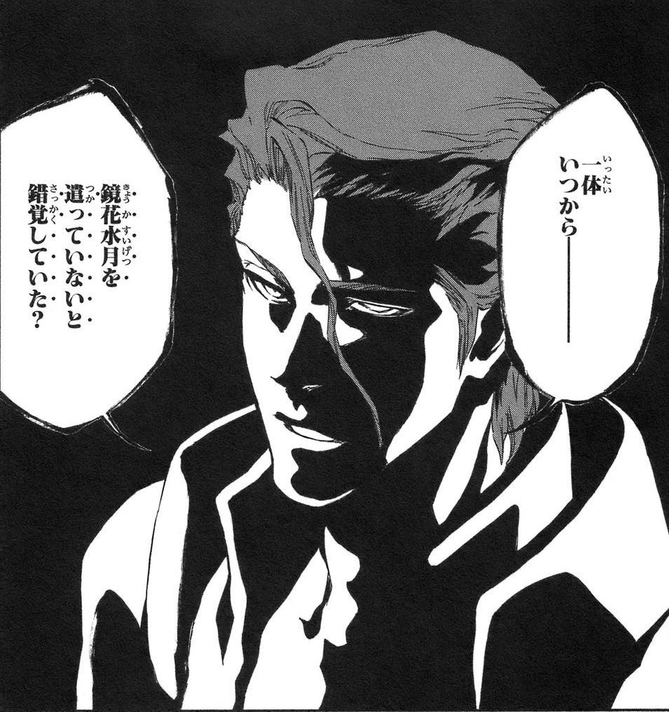
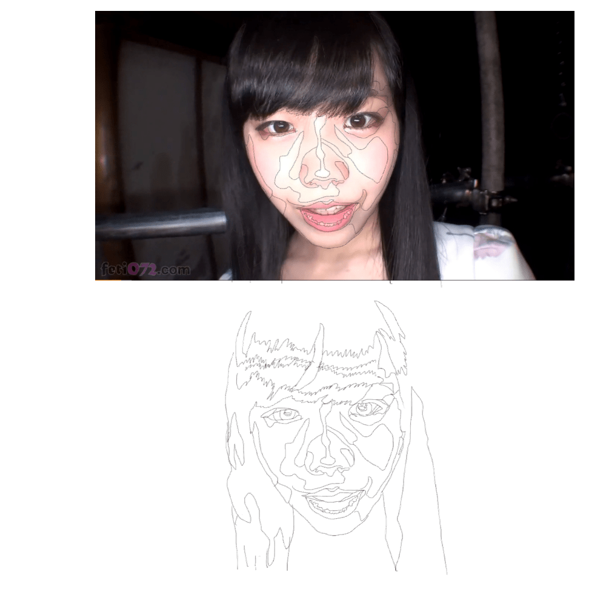
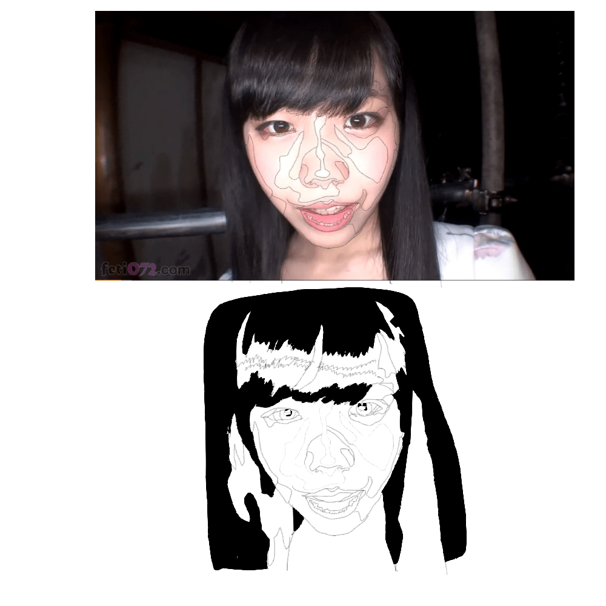
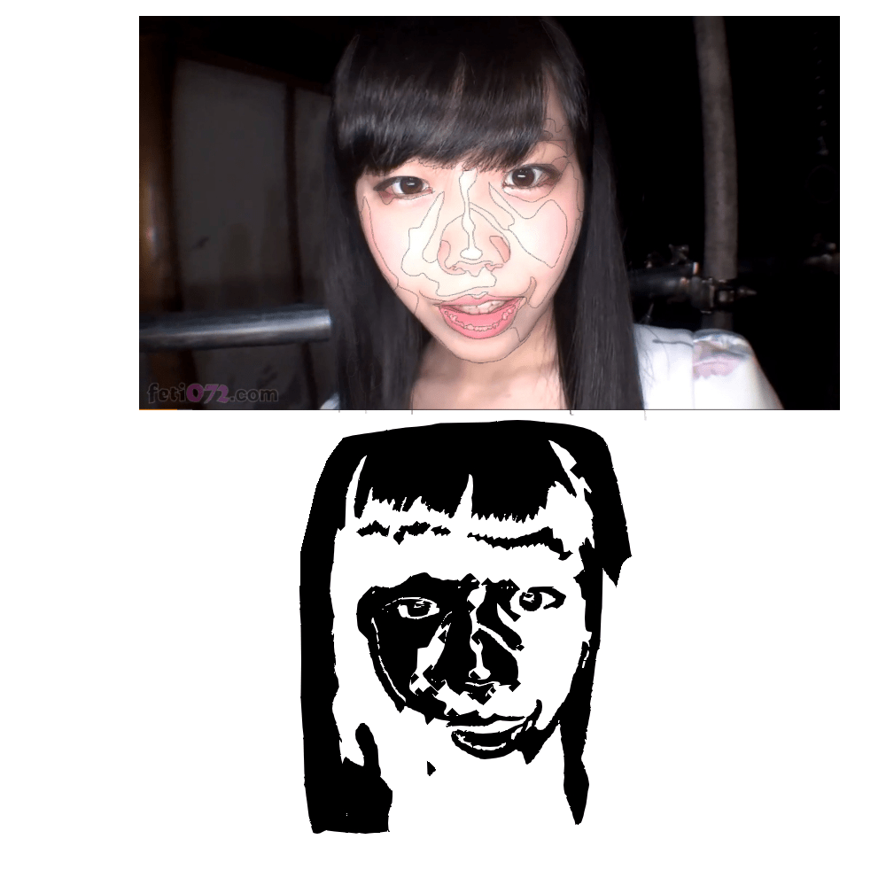
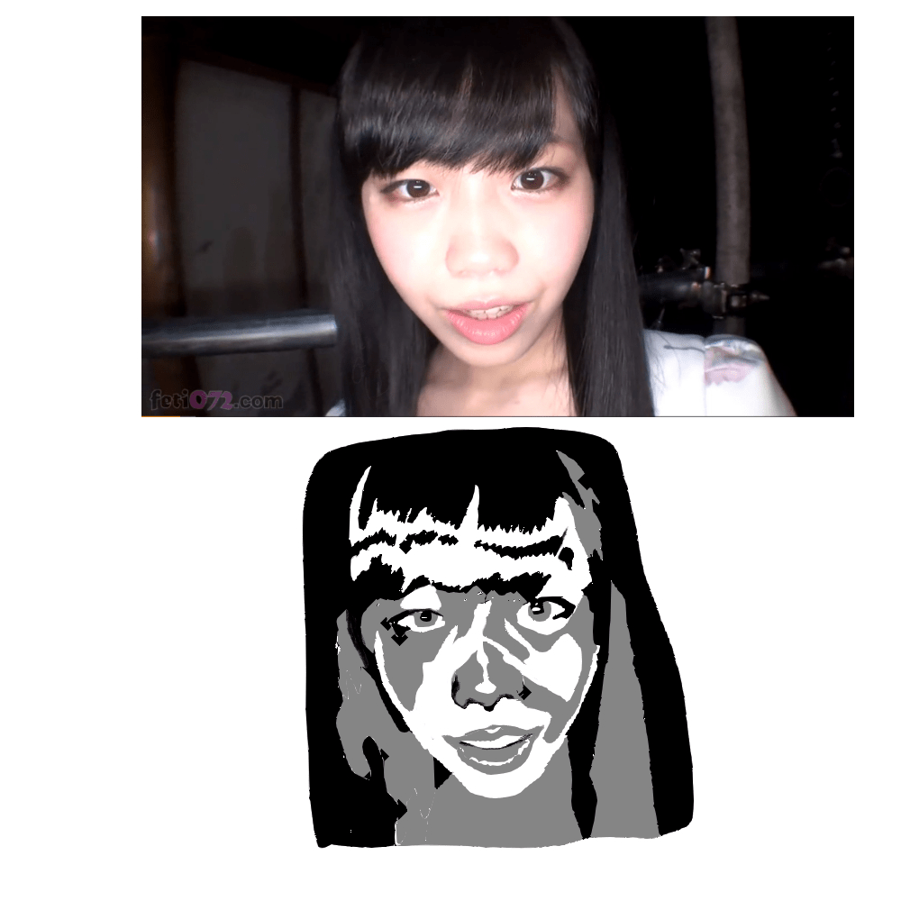

# [繪畫] 從零開始的繪畫練習—「面」篇 (簡化版臨摹練習)

作者：3213213210

TID：26159

<title>1</title> <link href="../Styles/Style.css" type="text/css" rel="stylesheet">

# 1

上集：[https://giantessnight.com/gnforu ... hread&tid=26155](https://giantessnight.com/gnforum2012/forum.php?mod=viewthread&tid=26155)
許多人試著畫漫畫，然後看到自己製作出來的怪物就封筆了
稍微有點耐心的人，就會去找已經有的漫畫來描，開始建構對線條的概念
上次，我寫了一篇描述「如何從實景中提取線條」，大家有練習嗎?
拜託去練一下，光是用看的不會了解我想表達的事情，實作才是最重要的

然而，單是練習線條，初期學習會更快、中期後卻會拖累自己的進步速度
平面繪畫，是嘗試利用二次元的平面重現三次元的物體
而只畫線條，就是只用一次元的細線拼出二次元的平面
光是想辦法讓畫面看起來「夠二次元」就辛苦，要如何長時意識到立體空間呢?

請試著看看這張臉，若不考慮漫畫效果，五官擺放的位置哪裡有誤?
<ignore_js_op>

**鼻子.jpg** *(77.51 KB, 下載次數: 0)*

[下載附件](forum.php?mod=attachment&aid=NzU3NDN8ZWJlMTYyNTN8MTY3NDA2OTY0NXwxODIzMHwyNjE1OQ%3D%3D&nothumb=yes)

2018-12-13 19:46 上傳

這只是一個無須認真看待的示意圖，但蘊含的問題比圖本身大多了
我的預設答案是鼻子，鼻樑的位置在側看時會更靠臉的朝向
<ignore_js_op>

**鼻子2.jpg** *(77.47 KB, 下載次數: 0)*

[下載附件](forum.php?mod=attachment&aid=NzU3NDR8NDIyNWMyMDV8MTY3NDA2OTY0NXwxODIzMHwyNjE1OQ%3D%3D&nothumb=yes)

2018-12-13 19:51 上傳

哇，很棒，移了一條線的位置瞬間就變立體了
……所以「蘊含的問題」是啥?
就是有許多人直接將上面那樣**沒將立體情況考慮進來**的圖**直接用處理立體物的方法上陰影和顏色**
明明畫技已經到了上色成熟，圖片的基底卻還是用線條拼湊起來的抽象畫
你可能會覺得我在針對誰，沒錯，不過被我針對的人兩隻手也數不完
Deviantart上隨便看都能看見這種大災難，更可怕的是Shader的挑選……
離題了，總而言之就是，即便能憑空構出像樣的圖，也不代表可以隨意脫離實物取材的階段

可是，如果看著圖也不知道該從哪裡開始理解也沒用
所以，今天的主題便是「從實景中意識到**面**的存在」
上上次的臨摹練習能提供最深入的理解( [https://giantessnight.com/gnforu ... hread&tid=26115](https://giantessnight.com/gnforum2012/forum.php?mod=viewthread&tid=26115) )，
但我也知道不是每個人都有把一張圖刻劃到完美的意志力 (我自己就沒有，笑死)
所以，降低難度，解開限制器，現在我只求大家能把筆拿起來就好……

=================================**正文**=======================================

好的，那麼我們來挑個衰鬼來擔任這次的模特兒
<ignore_js_op>

**正臉.jpg** *(192.44 KB, 下載次數: 0)*

[下載附件](forum.php?mod=attachment&aid=NzU3NDV8ZjQwMTMzODZ8MTY3NDA2OTY0NXwxODIzMHwyNjE1OQ%3D%3D&nothumb=yes)

2018-12-13 22:48 上傳

又見面了啊尾崎姊，今天也拜託你了
(圖：[https://www.pornhub.com/view_video.php?viewkey=ph5b3f843ebe075](https://www.pornhub.com/view_video.php?viewkey=ph5b3f843ebe075) )
(尾崎ののか，Ozaki Nonoka，evis00155)

這次的練習某種意義上來講可能比上次還簡單
首先，有電繪板的人，開圖層，沒有的人準備兩張描圖紙
目標是要用**最少的顏色完成一幅畫**
用最少的顏色是什麼概念?
<ignore_js_op>

**藍染.jpg** *(172.53 KB, 下載次數: 0)*

[下載附件](forum.php?mod=attachment&aid=NzU3NDZ8ZTFkNTAyZmJ8MTY3NDA2OTY0NXwxODIzMHwyNjE1OQ%3D%3D&nothumb=yes)

2018-12-13 23:20 上傳

請看，藍染只用三個顏色(黑、白、灰)就完成了這個名言，潮爆了
透過視覺錯覺，我們還能意識到不存在的鼻子輪廓

回到範例，看著你的圖，並試著將色塊切出來
從大到小，只要「顏色改變了」就切，漸層部分隨便你想怎麼切
不見得越細越好，看你準備填幾個顏色進去做調整
色塊切出來大概會長得像這樣
<ignore_js_op>

**簡單.jpg** *(293.02 KB, 下載次數: 0)*

[下載附件](forum.php?mod=attachment&aid=NzU3NTF8NzRmMDM0NTh8MTY3NDA2OTY0NXwxODIzMHwyNjE1OQ%3D%3D&nothumb=yes)

2018-12-14 01:13 上傳

(這個會花比較多時間，但其實比較簡單)
(背景麻煩死了，跳過)
接下來，**找出畫面中最深和最淺的地方**，先填上最深色和最淺色
(另外開圖層處理，剛才提的兩張描圖紙就是在這邊用第二張)
<ignore_js_op>

**簡單-上色1.jpg** *(301.08 KB, 下載次數: 0)*

[下載附件](forum.php?mod=attachment&aid=NzU3NTN8NzhlYjU5MDd8MTY3NDA2OTY0NXwxODIzMHwyNjE1OQ%3D%3D&nothumb=yes)

2018-12-14 01:21 上傳

(這張圖中用的是黑與白，前面有漏框的地方可以在這邊補)
接下來，準備色盤，把**同一色相不同深淺**的顏色排開，數量你爽就好
**依照顏色深度做排序，優先從最深色開始填**
這個步驟是整個作業中最重要的部分，意識畫面的深淺位置
等圖好像塗得差不多了再把參考用線條抽掉
(因為我很懶所以這邊用油漆桶解決)
用兩個顏色來畫：
<ignore_js_op>

**簡單-上色21.jpg** *(285.73 KB, 下載次數: 0)*

[下載附件](forum.php?mod=attachment&aid=NzU3NTR8YjU3Y2ZhODV8MTY3NDA2OTY0NXwxODIzMHwyNjE1OQ%3D%3D&nothumb=yes)

2018-12-14 01:31 上傳

用三個顏色來畫：
<ignore_js_op>

**簡單-上色33.jpg** *(275.02 KB, 下載次數: 0)*

[下載附件](forum.php?mod=attachment&aid=NzU3NTV8NTdkZWEyMDB8MTY3NDA2OTY0NXwxODIzMHwyNjE1OQ%3D%3D&nothumb=yes)

2018-12-14 01:48 上傳

用四……林北累了，不爽畫
P.S.如果色塊切太多反而很礙手礙腳，原因嘛……
<ignore_js_op>

**仔細.jpg** *(346.7 KB, 下載次數: 0)*

[下載附件](forum.php?mod=attachment&aid=NzU3NTJ8ZGNmMTNhNWF8MTY3NDA2OTY0NXwxODIzMHwyNjE1OQ%3D%3D&nothumb=yes)

2018-12-14 01:13 上傳

請自行體會

總之，等對形體的掌握熟悉後就能跳過繪製「實體色塊劃分線條」，
顏色多到一個地步後就能拋棄「用幾個顏色」的概念了
接下來請鎖住色相，只用深淺變化畫完一幅畫
顏色鎖住是什麼概念?
大概4這樣：
<ignore_js_op>

**25fe75ef.png** *(566.74 KB, 下載次數: 0)*

[下載附件](forum.php?mod=attachment&aid=NzU3NTZ8ZjFmYmJiYWV8MTY3NDA2OTY0NXwxODIzMHwyNjE1OQ%3D%3D&nothumb=yes)

2018-12-14 02:15 上傳

(月曜日のたわわ)
雖然一般是推薦用灰階練習，但想要多點樂趣可以用各種色相試試看
例圖嘛，沒那種東西，給我自己努力

最後，如果覺得玩夠了就可以挑戰油畫式硬派臨摹練習了
( [https://giantessnight.com/gnforu ... hread&tid=26115](https://giantessnight.com/gnforum2012/forum.php?mod=viewthread&tid=26115) )
事實上，那篇強調「可能花上數十小時」裡，最花時間的便是「形的掌握」
我到現在還沒放成品出來是因為那張圖已經蓋掉重來四次了還是不夠準……
如果能先提前訓練自己掌握形的大輪廓，臨摹起來會變得快速許多

那麼，如果臨摹一堆以後發現自己增進的只有複製能力呢?
沒問題的，這時候再去看繪畫教學書保證一點就通
一般人只能從書裡從零開始建構自己的知識，對於有經驗的人卻只是將自己的記憶概念化而已
「**先學習再練習**」大部分時候效果都比不上「**先練習再學習**」，
這是在各種領域都摸過一點以後我敢肯定的結論，尤其是繪畫練習這種試誤成本這麼低的領域

如果就是無法進步、或是出了事讓自己無法繼續下去呢?
那也沒關係，技藝和記憶都是自己的，也沒有頂尖才是意義這種事
如果……
媽的快開始練習啦
總之不要淪落到像我這樣只會講幹話就好</ignore_js_op></ignore_js_op></ignore_js_op></ignore_js_op></ignore_js_op></ignore_js_op></ignore_js_op></ignore_js_op></ignore_js_op></ignore_js_op>