# [販售心得] FF22之網聚的意義大於販賣

作者：s21117307

TID：14837

<title>1</title> <link href="../Styles/Style.css" type="text/css" rel="stylesheet">

# 1

.
首先，感謝所有與本次販售活動付出心力的人。

感謝 hte222（魏爺），他投資製作了這些刊物，並且忙到數日不眠不休，直到刊物全部完成。
感謝 Vivian，她在魏爺的製作遇上困難時，即便自己仍有繁忙的工作計畫，仍數次慷慨相助。
感謝 killer9999，他擔任魏爺與日方的翻譯，使整個社團可以順利與日本達成交流並前進C84。
感謝 XNR，他刺激了我們繼續前進的動力。
感謝 lovegts（愛版），他犧牲自己難得的休假日、跑來現場幫攤位進行搬運與販售，而且還讓他破財。
感謝 小蚱蜢、中文之許（阿許）、克里亞等人，他們不遠千里從外縣市前來台北，只為了支持販售活動。
感謝每一位購買刊物的人。當我親手將書遞給各位或是送到郵局時，我內心總是無比高興。

----------

７月２７日，醒來的時候已經早上八點，心情倒是很平靜。
總共300本的書籍，還有紙袋等週邊，已經在前一晚打包裝箱，這些破破的箱子裝著大家的夢想。
我覺得我沒有誇張，確實是這個樣子。畢竟在抵達會場、面對社會的考驗之前，夢想可以要多美就有多美。

我與愛版主是先約好碰面、再一起騎摩托車去活動會場的。
早上九點倒不太曬，路程也算短，而且週末一大早的路上不會遇到塞車，爽。
下貨之後我請愛版幫忙看管，我自己則騎車到捷運站接阿許到現場，這裡再次感謝他特地從台中北上來幫忙！
題外話，阿許的個頭真的是從大老遠就可以認得出來。

至於現場的人潮，可說已經十分洶湧，一如ＦＦ系列活動過去的慣例，客人們都提早了一天去排隊等候入場。
據說排隊的人龍最長的時候超過了兩公里，把廣大的台灣大學校區圈起了一半。
<ignore_js_op>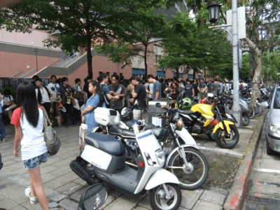

**DSCF65390.JPG** *(100.88 KB, 下載次數: 0)*

[下載附件](forum.php?mod=attachment&aid=MzUzNjd8MDBkMzRkMDZ8MTY3NDA2ODMxNXwxODIzMHwxNDgzNw%3D%3D&nothumb=yes)

FF22-1

2013-7-28 12:42 上傳

上圖拍到的甚至不算是隊伍，只是在等候要與朋友見面的人們。
這樣洶湧的人潮，是台灣大型同人活動的特色，雖然其中也夾雜了利益的層面……
但是對我們來說，這次活動無論如何，都是巨大少女這一愛好首次在台灣公眾前曝光。
我是不知道愛版與阿許他們的心情怎樣，我自己是完全不緊張，或者說非常樂觀。
畢竟在這天擔任攤位工作人員的三人當中，我是唯一有同人活動經驗的傢伙，雖然這次也是首度當賣方。
不過我很清楚在這種特殊的場合，不管彼此有怎樣難以啟齒的私密興趣，都需要放下心中的芥蒂。
買方如此，賣方更是如此，不然你還賣什麼呢？你已經光明正大坐在位子上面對群眾了。
過去日本的名繪師寺田在顧攤的時候，甚至還換上女裝。
這種在日常生活當中絕對不可能被容許做出的事情，在同人活動裡面，都是被允許的。

當然，我們三位工作人員都沒有女裝癖好就是。

搬運刊物是一件辛苦的差事，因為我們帶去的刊物數量多達240本，還有100個紙袋與100份特典。
號稱能載重65公斤的手推車好幾次看起來差一點斷裂，幸好愛版與阿許有幫忙。
雖然從下貨處進入會場只有短短100公尺的距離，不過現場的人太多，光是要小心別撞到人就已經夠頭痛了。
更不用說這些人也都是帶了一堆貨物要等著進場的社團們。

幸好，我們的攤位就在距離一樓入口的不遠處，拐兩個彎就到了。
雖然這次是跟其他人購買的位置，不過卻算是很好的地點，附近也很多賣H本的社團。
每個攤位的可使用桌面面積固定為 90x90 公分，事實上並不大。
不過佈置起來倒也不花時間，很快就弄成了像下圖的樣子：
<ignore_js_op>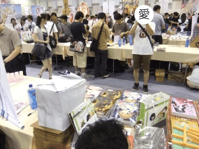

**DSCF65480.JPG** *(94.12 KB, 下載次數: 0)*

[下載附件](forum.php?mod=attachment&aid=MzUzNjh8MWRhMmQxZTB8MTY3NDA2ODMxNXwxODIzMHwxNDgzNw%3D%3D&nothumb=yes)

FF22-2

2013-7-28 13:01 上傳

這是愛版在攤位前面拍照的樣子，此時仍未開放客人入場。
如果各位有看到一些模樣很像在逛街購物的傢伙，那些是跟著社團混入場的，
算是台灣同人活動一直無法改去的缺點。
這些人利用協助社團擺攤的名義比一般客人更早入場，然後就開始狂買限量商品……十年來都是這樣囉。
我自己倒很期待有人會在一般客人入場前就來買我們的刊物，不過這種事情最終並沒有發生。

至於上圖的左邊，各位大概可以發現那裡的桌面相比之下非常空曠。
事實上我們左邊的攤位從頭到尾都沒有社團進駐，但手冊上確實有列名。
不知道是臨時發生了什麼事、還是根本從一開始就假冒社團名義跑進來狂買限定品……天知道哩。
反正最後左邊的空間就很自然地被我們佔用了（笑）。

這是從我們的視角看出去的模樣。
<ignore_js_op>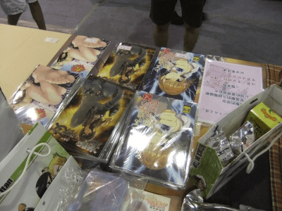

**DSCF65500.JPG** *(84.61 KB, 下載次數: 0)*

[下載附件](forum.php?mod=attachment&aid=MzUzNjl8MWRhNjE0NWR8MTY3NDA2ODMxNXwxODIzMHwxNDgzNw%3D%3D&nothumb=yes)

FF22-3

2013-7-28 13:10 上傳

右邊的紙袋被我們用來放一些乾糧。
事實上，後來我們三人根本沒有出去吃午飯，就靠一包餅乾過活。
大家似乎都很客氣的樣子，其實我準備的不只一包餅乾。
不過在那個場合似乎也不會覺得餓，畢竟後來不斷有同好跑來交流，實在是開心到忘記要吃飯。

然後這是我們攤位的招牌掛布：
<ignore_js_op>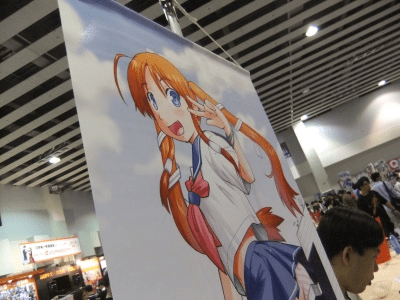

**DSCF65510.JPG** *(82.16 KB, 下載次數: 0)*

[下載附件](forum.php?mod=attachment&aid=MzUzNzB8MTNhZDBmNTN8MTY3NDA2ODMxNXwxODIzMHwxNDgzNw%3D%3D&nothumb=yes)

FF22-4

2013-7-28 13:10 上傳

我知道這根本不是我們畫的，但是我們原本設定的掛布不僅規格不合、也太重了。
我怎麼嘗試都掛不起來，索性帶這個去了。
現在想想，其實魏爺有另外寄給我一份電磁砲的GTS掛軸，我應該帶那個才對。
但我前一天晚上認為寬度超過規定、所以就沒帶了。
早知道我們隔壁會空出來的話……算了，千金難買早知道。

這邊也感謝原繪師、以及寄了這個掛軸給我的日本同好，充分發揮了應急的效用。

開場之前，拿著刊物端詳的阿許。
<ignore_js_op>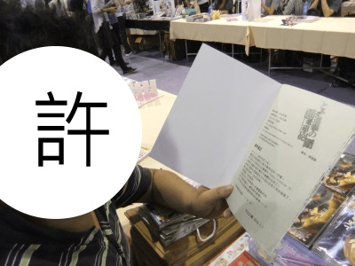

**DSCF65600.JPG** *(72.88 KB, 下載次數: 0)*

[下載附件](forum.php?mod=attachment&aid=MzUzNzF8NjEzNjU4MDZ8MTY3NDA2ODMxNXwxODIzMHwxNDgzNw%3D%3D&nothumb=yes)

FF22-5

2013-7-28 13:24 上傳

順便說，三種刊物的尾頁心得都是我弄的。

然後這是我們攤位前面的樣子。此時仍未開放一般客人入場。
不過即便是客人進來之後，偶爾也會出現這樣一大段路沒有人潮的詭異情況。
似乎是人潮受到兩側靠牆攤位的排隊者推擠所致。
<ignore_js_op>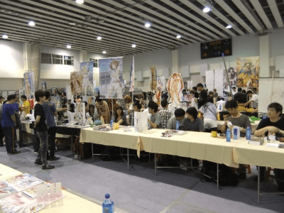

**DSCF65620.JPG** *(87.35 KB, 下載次數: 0)*

[下載附件](forum.php?mod=attachment&aid=MzUzNzJ8MjM2ZjMyODV8MTY3NDA2ODMxNXwxODIzMHwxNDgzNw%3D%3D&nothumb=yes)

FF22-6

2013-7-28 13:26 上傳

還有，我與愛版都對斜對面的那張砲姐掛布多看了幾眼。
<ignore_js_op>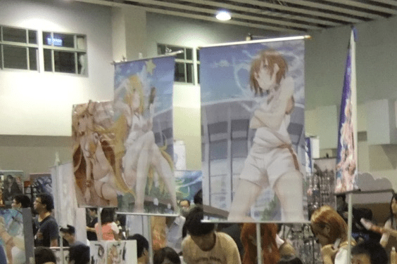

**DSCF65621.JPG** *(101.19 KB, 下載次數: 0)*

[下載附件](forum.php?mod=attachment&aid=MzUzNzN8NjdkZmU0YzJ8MTY3NDA2ODMxNXwxODIzMHwxNDgzNw%3D%3D&nothumb=yes)

FF22-7

2013-7-28 13:26 上傳

……好像是個很適合腦補成GTS的構圖？！

題外話，現在社團們的掛布廣告一個比一個H，只要不露點就怎麼挑逗都無所謂。
我們的掛布相較之下簡直是宛如修女一樣清純……

然後就是一般客人的入場了。
場內不會有主辦單位的廣播提醒，只會聽到一陣牛群奔跑的聲響逼近。
那時你就知道最前面排了一整天的客人們開始衝進來了。

不過他們的首選自然不是我們攤位。
事實上，我覺得我們前面的通道過了一陣子才開始有人潮。
畢竟大家都是先去排那些大手（熱門繪師的業界暱稱）的攤位，
然後這些人又剛好把我們走道的兩側堵住。
但這也只是一時的情況，很快我們面前的人潮就發展到了類似下面的樣子：
<ignore_js_op>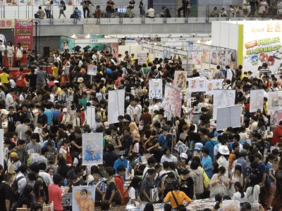

**DSCF65810.JPG** *(112.41 KB, 下載次數: 0)*

[下載附件](forum.php?mod=attachment&aid=MzUzNzR8NjY5YWFiMDd8MTY3NDA2ODMxNXwxODIzMHwxNDgzNw%3D%3D&nothumb=yes)

FF22-8

2013-7-28 13:34 上傳

這張照片是我下午去視野較好的三樓補拍的，畢竟場內規定不得攝影，我算是偷偷犯規。

而這張是活動的主舞台區：
<ignore_js_op>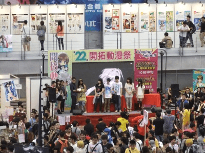

**DSCF65850.JPG** *(103.49 KB, 下載次數: 0)*

[下載附件](forum.php?mod=attachment&aid=MzUzNzV8YmYwYWUwYTV8MTY3NDA2ODMxNXwxODIzMHwxNDgzNw%3D%3D&nothumb=yes)

FF22-9

2013-7-28 13:36 上傳

活動的過程基本上就完全是在顧攤，前來翻閱試看本的客人很多。
同時也得提高警覺去注意扒手，據說這天有發生扒竊事件而鬧來了警察。
過去也曾有竊賊趁工作人員不注意而直接奪走整個錢箱逃跑的紀錄。

此外，隨著場內人潮不斷增加，冷氣也變得像沒有一樣。
在那麼悶熱、狹窄的空間裡長時間地提高注意力，其實是很累的工作。
幸好逐漸開始有同好上門，多半是有預購的論壇同好，其中的一些也有留下來閒聊。
反正隔壁攤位空著所以也擋不到誰。神啊感謝你讓隔壁攤空攤。

話說起來，雖然沒圖沒證據，但是那個帶著辣妹過來買書的論壇同好是誰來著？
我有叫愛版在他的ID旁邊加註一個「妹」字，不過愛版不願意，害我現在想不起來是誰了！

除了這樣有著現充模樣的同好之外，也有彼此結伴過來的同好。
從聊天的內容可以得知有一對自小結交的朋友、長大之後才發現原來彼此對GTS都有興趣。
這真是太奇妙了，對吧？
同時也是我小說的讀者，這真是太感激了，請務必再讓我表達一次我的感謝之意！
可惜我是個面對人群會有些語塞的個性，沒能好好與讀者交流，
甚至自己的作品都忘記了名字，真是抱歉！
更扯的是之後被要求簽名的時候，我差點要把自己的本名簽下去，吼～～！
我後來險些為了這件事而哭倒在愛版懷裡。

以上這些經過並沒有拍照留念，真是抱歉，但也確實是沒有那樣的餘裕。
畢竟會場內的人真的太多，總不能打擾到別的客人。

後來到下午的時候就稍微好一點了，也比較有空間可以拍點相片。
這個時候小蚱蜢與克里亞兩位也已經從外縣市趕到了，我真的很欽佩他們的行動力！

下面是後來人潮稍微散去時、我到攤位外面拍下的照片：
<ignore_js_op>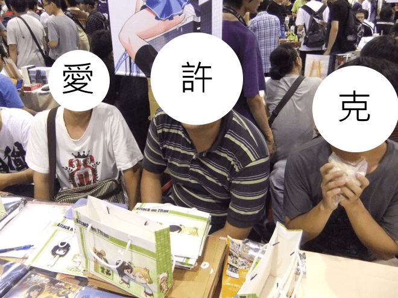

**DSCF65750.JPG** *(170.45 KB, 下載次數: 0)*

[下載附件](forum.php?mod=attachment&aid=MzUzNzZ8MWVhNDJmOTR8MTY3NDA2ODMxNXwxODIzMHwxNDgzNw%3D%3D&nothumb=yes)

FF22-10

2013-7-28 13:55 上傳

小蚱蜢前一晚用短訊放話說要扮成瘋狂假面亂入會場。
早上還寄簡訊過來說「我搭十點半的車喔，嘿嘿！」

還好他抵達的時候我人剛好在三樓拍照，等我回來時他已經把內褲從臉上脫掉了。
<ignore_js_op>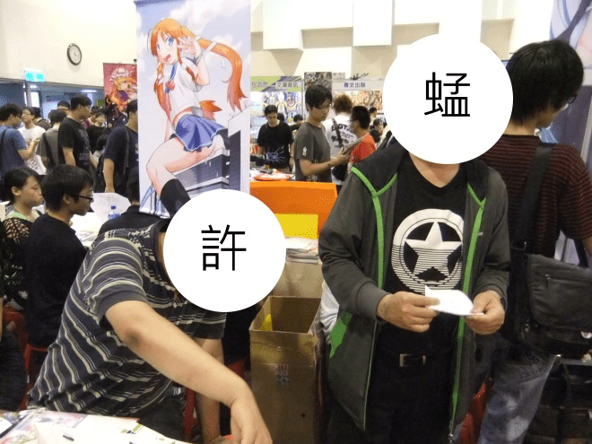

**DSCF65950.JPG** *(152.79 KB, 下載次數: 0)*

[下載附件](forum.php?mod=attachment&aid=MzUzNzd8NDQ0ZmQ0ZWJ8MTY3NDA2ODMxNXwxODIzMHwxNDgzNw%3D%3D&nothumb=yes)

FF22-11

2013-7-28 13:55 上傳

以上當然是開玩笑。
此外還是有人沒有被拍到，應該說是剛好吧！我拿出相機的時候他不在位置上。

嘛，其實待在攤位上，覺得時間過得超快！
明明一共是七個小時的活動，我卻覺得一下子就過去了，這就叫快樂時差嗎？
散場時老天不負眾望(?)下起了午後雷陣雨，把場地外面廣場的人群驅散了大半。
原本以為連散場都得一路排隊擠出去，結果倒是挺快速的。

這是歷年FF活動最主要的場地：台大新體 或稱 台灣大學綜合體育館
<ignore_js_op>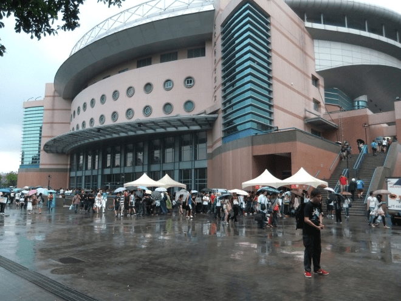

**DSCF66020.JPG** *(164.11 KB, 下載次數: 0)*

[下載附件](forum.php?mod=attachment&aid=MzUzNzl8ZWNiNTRjYjN8MTY3NDA2ODMxNXwxODIzMHwxNDgzNw%3D%3D&nothumb=yes)

FF22-13

2013-7-28 14:11 上傳

剩下要打包帶回去的東西：
<ignore_js_op>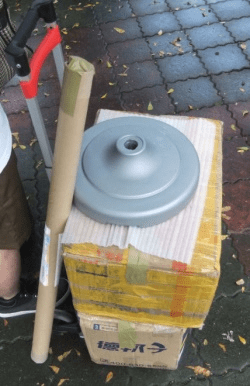

**DSCF66030.JPG** *(66.08 KB, 下載次數: 0)*

[下載附件](forum.php?mod=attachment&aid=MzUzODB8MzhhYWNiZmJ8MTY3NDA2ODMxNXwxODIzMHwxNDgzNw%3D%3D&nothumb=yes)

FF22-14

2013-7-28 14:13 上傳

結束的時候，打包的作業也非常順利，畢竟當時多出好幾隻手來幫忙了。
此時比起原本的販售目的，已經更像是一場同好的聚會了，氣氛溫馨和樂融融。
所以晚上索性就直接去附近的披薩屋聚餐了！
可惜相機不小心被我一起打包到紙箱裡去了，所以後面的行程完全沒辦法拍照。
我只能說大家真的都打開了話匣子、完全沒有冷場，話題就像說也說不完似的。
畢竟這次的聚會成員剛好都是去年台北網聚有來過的人，加深認識後反而更能放開來聊天呢。
之後我也送從外縣市來台北的三位同好去火車站搭車，並且再次感到他們的辛苦。
而且他們已經這樣子至少三次了，真的是太有愛了！

最後來一張愛的大合照！！儘管也不是所有人都照到啦。
<ignore_js_op>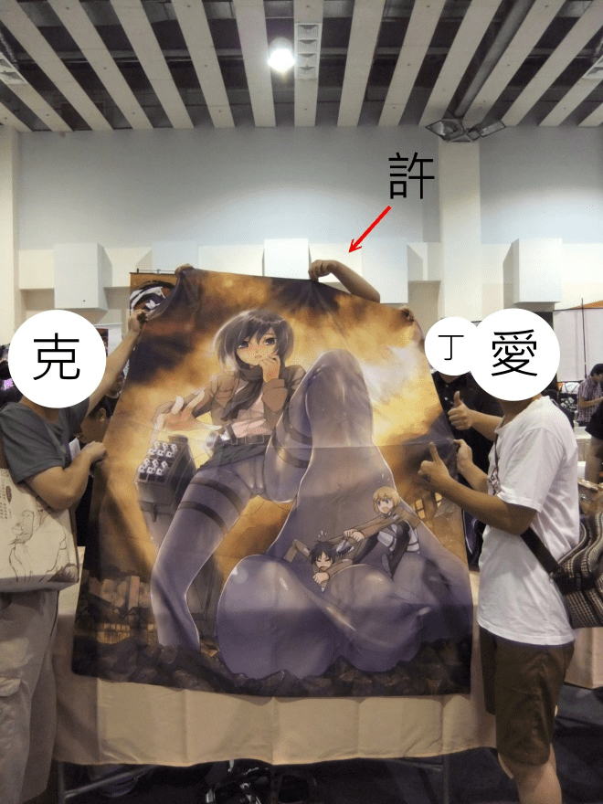

**DSCF65970.JPG** *(217.68 KB, 下載次數: 2)*

[下載附件](forum.php?mod=attachment&aid=MzUzNzh8MjVkMTc3NTh8MTY3NDA2ODMxNXwxODIzMHwxNDgzNw%3D%3D&nothumb=yes)

FF22-12

2013-7-28 13:55 上傳

再次感謝當天所有親臨現場的同好！

<title>2</title> <link href="../Styles/Style.css" type="text/css" rel="stylesheet">

# 2

.
事後檢討：

一、
愛版的摩托車慘遭拖吊。還付了比一整套本子更貴的罰款。
這件事看來頗不可思議，因為那一區根本到處都停滿了車子。
我們事後推論，應該是剛好停在沒有畫到停車格的地方。
儘管地上的停車格標線多半已經模糊不清到難以分辨的程度，但偉大的市警局才不管你哩。
對愛版來說真是極度悲劇的結束一天的方式。

二、
刊物的銷售情況不好。除了論壇同好以外，買的人不多。
明明我們的位置相當不錯，大多數讀者都是拿起試閱後就放了回去。
當然也有像愛版在另一篇心得文裡頭提到的情況，有很多不明白GTS的人搞不懂這在畫啥。
讀者們畢竟還是有預算限制的，不可能只為了有趣而買下自己不懂的東西。
所以儘管這次活動的氣氛很歡樂，之後可能不會再自己擺攤了。
因為根據經驗，將刊物交給專業代售的效果還更好，所以剩下的書我也會交給代售處理。

三、
雖然不會有下次，但如果真的有下次……
搬貨的工作我要丟給宅急便去處理，自己搬東西實在太累了。 <title>3</title> <link href="../Styles/Style.css" type="text/css" rel="stylesheet">

# 3

所以還是很在意，銷量怎麼樣 <title>4</title> <link href="../Styles/Style.css" type="text/css" rel="stylesheet">

# 4

销量看最后那个打包的箱子就看出了一些端倪啊 <title>5</title> <link href="../Styles/Style.css" type="text/css" rel="stylesheet">

# 5

看起來天氣不太好，本子沒有濕嗎? <title>6</title> <link href="../Styles/Style.css" type="text/css" rel="stylesheet">

# 6

原來當初看到的那張女裝顧攤的圖.似乎就是寺田本人..
弄得我有點想試試看了0.0,雖然有自知之明.但剛好他穿的那位我很喜歡

結果我到家翻那三本的時候才知道原來有翻成中文..
幸好當時有先決定不看.不然看過的話我大概就不太敢顧攤了 <title>7</title> <link href="../Styles/Style.css" type="text/css" rel="stylesheet">

# 7

> 題外話，阿許的個頭真的是從大老遠就可以認得出來。

知道了知道了_(:зゝ∠)_你上次就用红字强调过了。。。
。。。话说这难道就是中文sw兴趣的来源？Σヽ(ﾟД ﾟ; )ﾉ
啊咳咳。。。本版不谈本版不谈。。。

> 我們的掛布相較之下簡直是宛如修女一樣清純……

我可以吐槽这几年修女一个比一个不清纯么_(:зゝ∠)_

> 我後來險些為了這件事而哭倒在愛版懷裡。

(」・ω・)」结婚！(／・ω・)／结婚！＼(・ω・＼)在一起!(／・ω・)／在一起!
---
咳咳。。。最后说点什么吧。。。
销量看起来真的挺一般的。。。希望能回本。。。
不过如果包括爱版的摩托车事件，成本也已经回不来了吧。。。
<title>8</title> <link href="../Styles/Style.css" type="text/css" rel="stylesheet">

# 8

明年不管發生啥事(EX:考證照、技能比賽)我都要撥時間去完成我第一次的FF啊~~~~(血淚 <title>9</title> <link href="../Styles/Style.css" type="text/css" rel="stylesheet">

# 9

> 葬儀社 發表於 2013-7-28 18:07 
> 明年不管發生啥事(EX:考證照、技能比賽)我都要撥時間去完成我第一次的FF啊~~~~(血淚 ...

.
葬儀社！我們上次版聚還有討論到你。
明明你是屬於第一梯就出來活動的最早期同好之一，卻比小虎還更不活躍啊！
有空多來論壇發言讓大家加深印象啦！

--
竟然還有人以為你的ID是從罪惡王冠借用來的，我聽到這說法時差點沒吐血。

<title>10</title> <link href="../Styles/Style.css" type="text/css" rel="stylesheet">

# 10

这样啊......
所以说是意义大于贩卖吗？
第一次面向众人......初生的梦想......同好们聚在一起热烈地讨论.....
向往这种和谐有爱的氛围，可惜各种无力。
嗯......摆摊的诸位辛苦了。

题外话：爱版和蛋大一定要在一起！支持的举手~~ <title>11</title> <link href="../Styles/Style.css" type="text/css" rel="stylesheet">

# 11

這怎麼看都像是出來網聚的，販賣本子只是其次的……
大概差的就是一個專門用來聊天的安靜包間了？
看起來非常歡樂的樣子 <title>12</title> <link href="../Styles/Style.css" type="text/css" rel="stylesheet">

# 12

> alice 發表於 2013-7-28 19:56 
> 這怎麼看都像是出來網聚的，販賣本子只是其次的……
> 大概差的就是一個專門用來聊天的安靜包間了？
> 看起來非 ...

.
其實這樣也有「大隱隱於市」的感覺呀！
不過空氣不太好就是了，冷氣不冷、而且都是肥宅的味道。

--
三人當中最肥宅的我進行了一個自婊的動作

<title>13</title> <link href="../Styles/Style.css" type="text/css" rel="stylesheet">

# 13

但大以及協助擺攤的各位都辛苦了，

說真的，同人展的活動，

比起販賣，更有趣的地方還是在交流，

因為同人展的氣場，

可以讓人恥力大開，

無論多麼下流的東西都可以談得很起勁，

希望但大與協助擺攤的各位不要氣餒，

很多萌屬性一開始也都是沒有被注意到，

直到後來才漸漸的開化，

----------------------------

這次去買的時候，

沒有鼓起勇氣主動聊起來，

現在真的有點後悔，

不過當時在離開後，

意外的在別的攤位也有看到GTS本......

總之，這次FF22讓我收穫不少，

沒有鼓起勇氣去搭話，真的好後悔啊!!
<title>14</title> <link href="../Styles/Style.css" type="text/css" rel="stylesheet">

# 14

*本文章最後由 葬儀社 於 2013-7-28 20:41 編輯*

> >竟然還有人以為你的ID是從罪惡王冠借用來的，我聽到這說法時差點沒吐血。

更早是最遊記(當然我id根本不是這麼一回事)

因為我很少自己出門所以....才怪，我本來就不太主動會出遠門@口@
離島跟工作姑且算原因之一，但說真的沒有特別誘因我還真懶的出門(毆
所以原諒我這個孤島自閉男吧/_\ <title>15</title> <link href="../Styles/Style.css" type="text/css" rel="stylesheet">

# 15

*本文章最後由 Lastato 於 2013-7-28 21:55 編輯*

。w。

顧攤的大家都是親切的人呢 >///<

兩米級巨人果然名不虛傳。

如果考慮成本的話，擺FF可能真得會有點不划算。它的攤費好像一直在調漲。（思

而且FF肉跟H的比例佔八成，一些少見屬性也比較不會出現；反倒是之前去過春萌祭，就有看到病嬌、虐、獵奇的東西，也有比較正常的像是動物擬人、冒險故事、跑團的團錄小說（不過春萌是原創場。）整體來說，小說的比例雖然還是比較低，但比FF高得多。而且因為剛起步，攤費也比FF便宜。進行文字創作的同好可以考慮FF以外的場（不過文字創作者永遠的痛就是找不到繪者畫封面（攤死

不過FF的好處，就是因為是肉場，說些H或肉，甚至湯湯水水的東西，也比較不會恥（看向FF四周的掛軸）；搞不好這樣嘉年華（？）的氣氛有助於同好們浮出水面吧。w。

打開牛皮紙袋裝的特典的時看到裡面的東西後，呆愣了一下。
回過神來第一個念頭是：難怪但大會特別囑咐要回家才能打開（不然會爆體而亡（誤））。

備註：因為被說要多發文，所以浮上來發文。口口口。
<title>16</title> <link href="../Styles/Style.css" type="text/css" rel="stylesheet">

# 16

疑...我以為你會把罰PO出來說XD～～

其實心情還好拉，沒有說很難過，想到有免費的本子跟晚餐就很欣慰，不過以後遇到有大型活動，車子還是不要亂停。上次的經典賽跟朋友去信義區看現場大螢幕，兩位朋友停在不同條路的人行道上都被開單...媽的台北市政府是有這缺錢嗎...

<title>17</title> <link href="../Styles/Style.css" type="text/css" rel="stylesheet">

# 17

其實我沒注意到攤位海報

那時有個問題忘了問：何以能把攤位從場刊圖到包裝紙袋都看不出含GTS向的成分？莫非早有安排？ <title>18</title> <link href="../Styles/Style.css" type="text/css" rel="stylesheet">

# 18

> 無邊落木 發表於 2013-7-28 23:31 
> 其實我沒注意到攤位海報
> 
> 那時有個問題忘了問：何以能把攤位從場刊圖到包裝紙袋都看不出含GTS向的成 ...

.
攤位是之後跟人買來的，原攤主「栗落星盒」因故無法出展、求售攤位時被我找上。
所以場刊圖當然跟我們八竿子打不著關係。
至於紙袋則是考慮到大家提著上街搭車的恥度，想說弄成可愛版本的就好。

在此順便抱怨一下那個原攤主，他居然在我付款後整整八天不主動聯絡。
我也一直沒收到入場證，差點讓我以為遇上了詐騙。
儘管他後來做出一些補救措施，但我還是覺得他缺乏責任感。
幸好最終還是有順利入場擺攤。

<title>19</title> <link href="../Styles/Style.css" type="text/css" rel="stylesheet">

# 19

感覺族裡的活動越來越多啦!!!
 <title>20</title> <link href="../Styles/Style.css" type="text/css" rel="stylesheet">

# 20

> Lastato 發表於 2013-7-28 21:51 
> 。w。
> 
> 顧攤的大家都是親切的人呢 >///<

.
哈，其實你已經是當天到場者當中、發文算勤快的了！
愛版與阿許都說對你的ID頗有印象。

我們顧攤大部分時間就是呆坐在那裡，看著客人拿起書本又放下書本。
遇上能夠講話的同好，當然是像抓到救命稻草一樣、整個人活了起來啦！
而且也多虧了隔壁攤位空著（靠，你要講幾次啊），不然一般來說這麼小的位置，
實在很難讓各位久站著聊天呢。

希望你們後來都有買到自己想買的東西囉！
我聽說這次FF是史上人最多的一屆，都排到基隆路去了是吧？
大熱天的也真是辛苦各位了！致敬！

<title>21</title> <link href="../Styles/Style.css" type="text/css" rel="stylesheet">

# 21

> 帶著辣妹過來買書的論壇同好

...該不會是指我吧?
可惜的是，那位只是我妹而已
當然，她不知道刊物的內容是啥
當天因為朋友在等沒辦法多聊一下好可惜啊 <title>22</title> <link href="../Styles/Style.css" type="text/css" rel="stylesheet">

# 22

各位大大辛苦了(現在講會不會太晚XD  

拿到不枉費錢一天夜排得好東西。 <title>23</title> <link href="../Styles/Style.css" type="text/css" rel="stylesheet">

# 23

啊，，，我为什么出生在内地呢，以后有机会一定去台北
好强大的贩售活动啊。。。。 <title>24</title> <link href="../Styles/Style.css" type="text/css" rel="stylesheet">

# 24

卖这东西被旁人看到会是什么表情呢。。还有不会被查水表么。。</ignore_js_op></ignore_js_op></ignore_js_op></ignore_js_op></ignore_js_op></ignore_js_op></ignore_js_op></ignore_js_op></ignore_js_op></ignore_js_op></ignore_js_op></ignore_js_op></ignore_js_op></ignore_js_op>