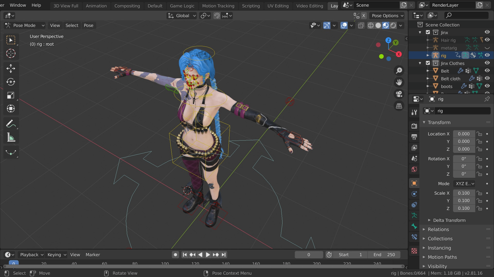
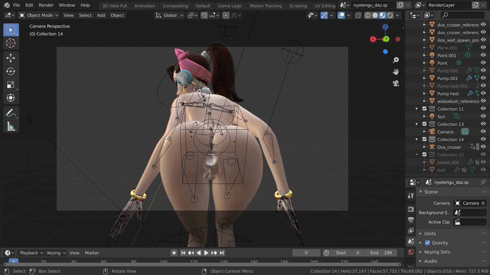
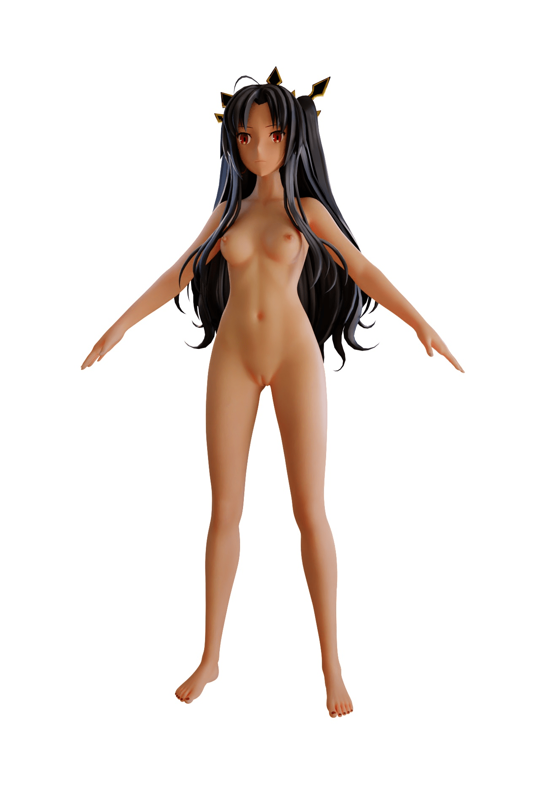

# [資源] 使用Blender需要的角色模型

作者：3213213210

TID：27778

<title>1</title> <link href="../Styles/Style.css" type="text/css" rel="stylesheet">

# 1

Blender，免費開源可以在Steam下載的3D軟體不拉不拉不拉算了，廢話全跳過，直接放上我找到的東西
(這篇只講角色，場景就普通地搜尋就好)

主要是要介紹這個網站，SMUTBASE
[https://smutba.se/](https://smutba.se/)
雖然裡面都是版權角色，但這裡沒人在乎對吧

順便附上個人最愛
蒂法：[https://smutba.se/project/423/](https://smutba.se/project/423/)
<ignore_js_op>

**Tifa3.jpg** *(231.58 KB, 下載次數: 0)*

[下載附件](forum.php?mod=attachment&aid=ODA2OTN8NjI3ZjU4ZDR8MTY3NDA2OTYzNHwxODIzMHwyNzc3OA%3D%3D&nothumb=yes)

2019-12-28 23:55 上傳

吉茵珂絲：[https://smutba.se/project/322/](https://smutba.se/project/322/)
<ignore_js_op>

**jinx.jpg** *(344.74 KB, 下載次數: 0)*

[下載附件](forum.php?mod=attachment&aid=ODA2OTJ8MGVjYjE5OTV8MTY3NDA2OTYzNHwxODIzMHwyNzc3OA%3D%3D&nothumb=yes)

2019-12-28 23:52 上傳

(對，衣服都可以拔掉)

如果嫌不夠或是想支持創作者，我也找到幾個名字：

Arhoangel：[https://www.patreon.com/Arhoangel/posts](https://www.patreon.com/Arhoangel/posts)
最近產量比較低，但模型數量還是很可觀，而且還提供專案檔，把男的拔掉就能改啦 (每月5鎂，沒做東西他會停收)
<ignore_js_op>

**some.jpg** *(360.46 KB, 下載次數: 0)*

[下載附件](forum.php?mod=attachment&aid=ODA2OTR8ZTNjM2UwZmZ8MTY3NDA2OTYzNHwxODIzMHwyNzc3OA%3D%3D&nothumb=yes)

2019-12-28 23:58 上傳

(本來有雞雞的，被我砍了，這是動畫喔，屁眼要關起來要去調Shape Key)
stukove：[https://www.patreon.com/stukoveMMD](https://www.patreon.com/stukoveMMD)
從MMD轉Blender的，應該是個中國人，目前Blender模型只有4個，每月要15鎂才能載模型，但日式動畫風目前我沒看到別人在做
<ignore_js_op>

**Ishtar - fate grand order.jpg** *(144.93 KB, 下載次數: 0)*

[下載附件](forum.php?mod=attachment&aid=ODA2OTV8MzU1NDg0MTB8MTY3NDA2OTYzNHwxODIzMHwyNzc3OA%3D%3D&nothumb=yes)

2019-12-29 00:03 上傳

ZixH：[https://www.patreon.com/ZixH](https://www.patreon.com/ZixH)
沒有要求收費的模型，但是他做了蒂法，所以捐點錢是應該的

最後提醒一下，如果有裝CATS的話，MMD、SFM跟XPS之類的很多格式都能讀，但效果不會太好
模型雖然能用，但是細節上的調整絕對沒有用Rigify特地處理過的來得方便
簡單舉例，調整XPS需要先調整肩膀、再調整手臂、再調整手掌，
而Blend的模型(通常)可以直接拉手掌的位置，手就被帶動了，然後可以直接調整手肘的朝向
MMD......我還沒試過，看到那個骨架頭就好痛
總之，尻尻快樂，也請大家分享

<title>2</title> <link href="../Styles/Style.css" type="text/css" rel="stylesheet">

# 2

好用，我收了，谢谢楼主</ignore_js_op></ignore_js_op></ignore_js_op></ignore_js_op>