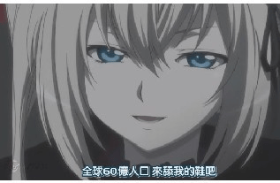
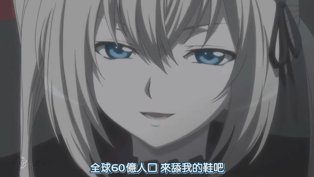
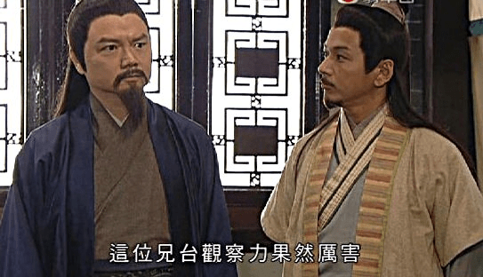

# 『這是水』，發洩情感的吐嘈

作者：elvisii

TID：10178

<title>1</title> <link href="../Styles/Style.css" type="text/css" rel="stylesheet">

# 1

這是吐嘈，假如看官們覺得太水，把我推落山也未遲。

話說，前些日子，在某論壇看了一個坑了很久的文的更新，輾轉反側，不能入睡。
沒錯，就是GIGA級女巨人。
我當時腦中浮現的，是「超凡入聖」，GIGA級女巨人，不就是由人類變為最接近神的存在?有些人的意見，乃GIGA級女巨人不能與人類作互動，所有東西都變成女巨人單向行為，太單調了。
哈哈

GIGA，就是無可阻擋、超越人類甚至大自然能力所及的存在，這是她引人注目的地方，我們人類不值一哂。即使是日常普通的少女，變成GIGA級後，她的一切都是壓倒性的破壞力，不論她有否察覺到，不論她有心或無意。而我們無從逃避，她可比天然災害的力量。

 有一堆人，會冒險追逐龍捲風，我想我們大都情迷於大自然級數的破壞力。輕輕拍一拍手，就會做成衝擊波，將方圓數百英里的一切毀滅。這不是人類可以擁有的力量 ，這是接近神的力量。人類屈服於超乎想像的力量之下，又對她的力量感到驚訝和興奮。

所以，我喜歡看GIGA級女巨人。

當然，看著由平凡人類一躍跳進神的景界，這就像一個嬰兒一夜之間身體長大成人。她未有時間去成熟心智，去運用神級的力量，所以和怪獸襲擊微微不同，GIGA少女最初很多都不為意自己在殺人，她們只是在繼續日常生活、她們只是在玩、她們只是一個凡人，忽然擁有可怕的巨大力量，她們和地上人類沒有地位上的分別。

然後，當這些一夜「長大」的GIGA少女發覺到自己的行為可以破壞性時，她們就會意識到自己不再是那些人類的層次了，而自己的生活無可避免地會破壞人類的社會時，為了逃避良心責備，她們只好將行為合理化，將自己變成超越理性的存在；漫不經心的散步會踐踏整個城市，數以萬計的人類會因而死去；她們不是不知道，只是這是無可避免的，沒有問題的，甚至是非常有趣、好玩的。自己可以玩弄整個地球，想做甚麼就為所欲為，沒有東西可以阻止自己，自己是整個星球最強大的存在，這些念頭出現在她們腦海中，她們就由人類去到接近神的地位。

最後，利用神般無可阻擋的威力，去行使一切來滿足自己的源自人類本性的慾望時，這是一個披上神的衣裳的人，為了滿足而陷所有人類以至地球於水深火熱中，那是超凡入聖的表現。

話說，前些日子，在某論壇看了一個坑了很久的文的更新，輾轉反側，不能入睡的原因，是看了這麼一句:

『Jill was so mighty, so gigantic, that the combined might of the most powerful military the world has ever known was not even enough to wake her up.』

(Jill是多麼的非凡，又如此的巨型，即使世界上已知最強勁的軍事力量的總合攻擊也不足以令打起鼾睡著的她起床。)
[http://www.giantessworld.net/vie ... ize=0&chapter=5](http://www.giantessworld.net/viewstory.php?sid=1738&textsize=0&chapter=5)

吐嘈一、
A:「或者她需要一個更好的鬧鐘。」

V:「或者她需要減少夜生活。。。。」

A:「或者他們應該播放音樂。」
V:「或者播哈利•波特很有效。」

[ *本帖最後由 wtman 於 2011-5-16 12:53 編輯* ] <title>2</title> <link href="../Styles/Style.css" type="text/css" rel="stylesheet">

# 2

可能是因為我不是這一類的菜吧。

光是塊頭大威力大破壞力強的話，其實也沒啥特別的。只能稱作是「現象」或者「災禍」一類吧。

「神」乃子民敬仰而生，于萬物崇拜而盛，如果這個「神」，無法從氣質上徹底超越，從思想上徹底征服我等凡民的話，只是一味轟隆隆的破壞殺戮，那麼，就結果論來看，她跟一顆Super加強版氫彈毫無區別。

力量只是「神」的其中一個方面，而不是全部；否則，大國政府們都應該把自家的核彈頭都拿出來，建個神社之類的供奉起來好了。

啊，其實，「神」到底該是神馬樣子的？

[ *本帖最後由 18X 於 2011-5-16 14:00 編輯* ] <title>3</title> <link href="../Styles/Style.css" type="text/css" rel="stylesheet">

# 3

關於GIGA的力量無可非議，但令在下喜歡的大概是“女性”這一微妙的反差美，那種至強與至弱，至剛與至柔的矛盾統一吧，而並非只是單純的力量堆積。

或許在下并不信仰神，只是癡迷於追隨女神的裙擺罷了……而那並非唯一，並非至高無上，卻推動著心甘情願的幻想不斷前進，永無止境。

“少女和世界，哪個更為重要？”——這句話的意義在此地恐怕完全不同吧XD <title>4</title> <link href="../Styles/Style.css" type="text/css" rel="stylesheet">

# 4

最強的神能讓自己變得不可取代 就算被打敗了 侵略的那方也無法改變自己子民的心
(你說為神馬很像某情節?我怎麼不可能不知道)
神可以有各種各樣的性格和能力,不過成功的方法都是一樣,就是偷掉子民的心

最後果斷表示這些吐槽弱爆了,再等一兩天時間吧 <title>5</title> <link href="../Styles/Style.css" type="text/css" rel="stylesheet">

# 5

其實，我基本同意兩位的說法。
就是因為我等凡人未見過神，所以才有我這篇吐嘈文。我也不信仰神，假如有個人自稱是神，我會罵他神經。

那麼，『最後，利用神般無可阻擋的威力，去行使一切來滿足自己的源自人類本性的慾望時，這是一個披上神的衣裳的人，為了滿足而陷所有人類以至地球於水深火熱中，那是超凡入聖的表現。』是指，她由始到終都不是神，只是她有了過人力量，而她的存在本身是人類不容亦無法視若無睹，對於未見識過神的凡人，她的確很類似神；

18爺說，『光是塊頭大威力大破壞力強的話，其實也沒啥特別的。只能稱作是「現象」或者「災禍」一類吧。
「神」乃子民敬仰而生，于萬物崇拜而盛，』
無錯，災難不是神明，但是神明可以做成災難。「神的憤怒，翻天覆地」，擁有強大力量，「順我者生，逆我者亡」，人們走投無路，而屈服其下。很多的神，乃是人們敬畏有之的。
當然由始至終，她都是類似神的，但她不是神，但大才是神!  (拖走他 )
或者，就像『我不知道』爺的某個故事，人類敬畏超越人力的天災的破壞力，就它實體成神，認為她有意識和喜好，透過滿足她來避禍，人尚且敬奉有意識的天災，更何況有樣有身材又有個性的GIGA少女?

『令在下喜歡的大概是“女性”這一微妙的反差美，那種至強與至弱，至剛與至柔的矛盾統一吧，而並非只是單純的力量堆積。』
當然!我不要筋肉型的亞馬遜啊!
我喜愛反差，身形反差，力量反差，行為反差。明明是日常普通不過的行為(例如，打瞌睡)，160cm和16萬公里的纖巧少女都是這樣子睡，但是在哪裡睡，中途轉變姿態對周圍環境的影響，怎樣子叫醒她，這就是少女的反差美，

這就是至剛與至柔的矛盾，打瞌睡是弱纖女郎最柔弱的時候，而人類最強的軍事力量是最堅剛的。最堅剛的軍力，不但滅不了、也傷不了沈睡中的弱纖女郎，甚至連半點打擾也談不上，擁有強大的科技人類連擾人清夢的蚊子也不如。

你看過少女的發洩麼?

10萬倍甚至100萬倍的少女發洩會怎樣?

「一起等死吧，等待超巨大少女從美夢中回到現實，向我等展示壓倒性的姿態。」

(其實我好想放三次元女郎，不過為了顧及大家。。。。)

『女郎想，假如她飲用完餘下的藥物，她會變成萬以十計巨大的女郎，到時這個城市的一切都是她眼中的灰塵。

——說好的GIGA呢？在下可是坐等這一段結果發現只不過是女郎的YY啊 。』
  我在窗外面的城市見到了GIGA級的eventually、18X和killer9999!!

[ *本帖最後由 wtman 於 2011-5-16 17:40 編輯* ] <title>6</title> <link href="../Styles/Style.css" type="text/css" rel="stylesheet">

# 6

 <ignore_js_op>[girl.jpg](forum.php?mod=attachment&aid=MjQ1NjV8NzkwM2M1NzB8MTY3NDA2ODc5MnwxODIzMHwxMDE3OA%3D%3D&nothumb=yes) *(4.79 KB, 下載次數: 0)*

[下載附件](forum.php?mod=attachment&aid=MjQ1NjV8NzkwM2M1NzB8MTY3NDA2ODc5MnwxODIzMHwxMDE3OA%3D%3D&nothumb=yes)

2011-5-16 17:23 上傳  

用核彈爆醒她們

</ignore_js_op>  <ignore_js_op>[girl32.jpg](forum.php?mod=attachment&aid=MjQ1NjZ8YTM3ZGViMDV8MTY3NDA2ODc5MnwxODIzMHwxMDE3OA%3D%3D&nothumb=yes) *(6.9 KB, 下載次數: 0)*

[下載附件](forum.php?mod=attachment&aid=MjQ1NjZ8YTM3ZGViMDV8MTY3NDA2ODc5MnwxODIzMHwxMDE3OA%3D%3D&nothumb=yes)

2011-5-16 17:23 上傳  

</ignore_js_op> <title>7</title> <link href="../Styles/Style.css" type="text/css" rel="stylesheet">

# 7

.
對Giga級有愛的理由，我覺得果然還是因為反差萌吧？

明明是嬌弱可愛的女孩子，只因為身體大了些，就能不經意地製造出難以想像規模的大破壞。
如果說一般的Mega gts 已經可以作到這種程度，那Giga級就是更進一步的詮釋吧？
就像之前有人請我寫一篇把地球串成自慰按摩棒那樣的小說，不得不說光想到都覺得很萌啊！

至於力量什麼的，我覺得我不是那麼在乎。
太過追求女性的力量，總覺得最後會演變成愛上筋肉女呢（笑）
普普通通的平凡少女忽然巨大化而得以毀天滅地，跟她得到驚人的力量（例如魔法少女）是不一樣的呦。
不然我們在看魔法少女、或者控制著巨大機器人的女駕駛員這樣的角色時，
應該也會感到一股與GTS作品同質的感動吧？
嘛，似乎也的確有人是這樣想的呢，不過我自己是感動不起來啦。
不把角色本身巨大化的話是根本找不到感動的呢。
所以我覺得，過度拘泥在GTS的力量上沒什麼必要呦，因為這似乎可以是兩碼子事呢。 <title>8</title> <link href="../Styles/Style.css" type="text/css" rel="stylesheet">

# 8

> 原帖由 *Dante* 於 2011-5-16 17:36 發表 
> .
> 對Giga級有愛的理由，我覺得果然還是因為反差萌吧？
> 
> 就像之前有人請我寫一篇把地球串成自慰按摩棒那樣的小說，不得不說光想到都覺得很萌啊！

 
認真，我想看看那篇作品，看如何將地球串成自慰按摩棒來用。 <title>9</title> <link href="../Styles/Style.css" type="text/css" rel="stylesheet">

# 9

喂喂 但大竟然自爆了 <title>10</title> <link href="../Styles/Style.css" type="text/css" rel="stylesheet">

# 10

对于GTS属性认真思考过，我对于GIGA级别的萌点和部分同好的不理解做出如下阐述。
（尽量言简意赅吧。。。）

<ignore_js_op>

**zzz.jpg** *(17.28 KB, 下載次數: 1)*

[下載附件](forum.php?mod=attachment&aid=MjQ1Njd8MzljMWZiMjF8MTY3NDA2ODc5MnwxODIzMHwxMDE3OA%3D%3D&nothumb=yes)

2011-5-16 19:38 上傳

GIGA级用一个词来形容：那就是GTS的“极致”表现。
萌点（或激发性趣点）：
1\. 极致的落差感
2\. 极致的支配和被支配感
3\. 极致的羞辱感
4\. 与所恋的女性身体部位的极致归附感。（她的身体就是这个世界，你所处的世界就是她身上的一部分，或被她肉体支配的一部分）
5\. 对于GTS同好来说，需要“极致”的想象力。

正是这最后一条，并不是所有GTS同好都具备的，对于“幻想力”这个前提条件要求是最高的，所以萌GIGA级别的GTS同好一直只占少数。
所谓的互动缺乏，并不是重点，只要有发达的想象力，没有不可能的互动。

欢迎交流。

PS： 最后还是求但丁的GIGA文。

[ *本帖最後由 xnr 於 2011-5-16 20:45 編輯* ] <title>11</title> <link href="../Styles/Style.css" type="text/css" rel="stylesheet">

# 11

> “少女和世界，哪個更為重要？”——這句話的意義在此地恐怕完全不同吧XD

嗯，俗稱“重色輕友”（基友乃世界的子集）。 <title>12</title> <link href="../Styles/Style.css" type="text/css" rel="stylesheet">

# 12

不是地球.
類地行星都不夠大顆.......

至少要來個木星啥的 壓縮的時候還會因為重力作用誘發行星核融合反應喔~<---(形成新恒星) <title>13</title> <link href="../Styles/Style.css" type="text/css" rel="stylesheet">

# 13

所以世界上的一切都變成鐵了嗎(笑 <title>14</title> <link href="../Styles/Style.css" type="text/css" rel="stylesheet">

# 14

所以世界上的一切都變成鐵奥了嗎(逃 <title>15</title> <link href="../Styles/Style.css" type="text/css" rel="stylesheet">

# 15

.
那魯齁多，未來新能源的趨勢是股間發電！
那我們該牽幾條電線進去了……

--
我是從什麼時候開始變得可以這樣輕鬆講出股間或屁眼這種詞彙的（淚下） <title>16</title> <link href="../Styles/Style.css" type="text/css" rel="stylesheet">

# 16

大小不區，只要夠S便好。
但是真的要說的話，個人還是比較喜歡50、100、200、1000和10000倍的。 <title>17</title> <link href="../Styles/Style.css" type="text/css" rel="stylesheet">

# 17

來吧! 菊花發電吧! <title>18</title> <link href="../Styles/Style.css" type="text/css" rel="stylesheet">

# 18

5L最後一句話給我去死！異端審問！大媽有情破顏拳！

果斷求6L的文

9L圖高同步~ <title>19</title> <link href="../Styles/Style.css" type="text/css" rel="stylesheet">

# 19

「全球60亿人来舔我的鞋吧」
哇察!!
  
「X大爺的觀察力果然厲害，我要去寫個舔鞋的故事!」

[ *本帖最後由 wtman 於 2011-5-17 17:01 編輯* ] <title>20</title> <link href="../Styles/Style.css" type="text/css" rel="stylesheet">

# 20

 <ignore_js_op>[b560d5b4ae9ad9a1b0fb95c0.jpg](forum.php?mod=attachment&aid=MjQ1Njl8YWI5NzZiODJ8MTY3NDA2ODc5NXwxODIzMHwxMDE3OA%3D%3D&nothumb=yes) *(34.29 KB, 下載次數: 0)*

[下載附件](forum.php?mod=attachment&aid=MjQ1Njl8YWI5NzZiODJ8MTY3NDA2ODc5NXwxODIzMHwxMDE3OA%3D%3D&nothumb=yes)

2011-5-17 17:00 上傳  

</ignore_js_op> <ignore_js_op>[rsz_647px-1513020073903.jpg](forum.php?mod=attachment&aid=MjQ1NzB8MzQzNTFjMzd8MTY3NDA2ODc5NXwxODIzMHwxMDE3OA%3D%3D&nothumb=yes) *(44.29 KB, 下載次數: 0)*

[下載附件](forum.php?mod=attachment&aid=MjQ1NzB8MzQzNTFjMzd8MTY3NDA2ODc5NXwxODIzMHwxMDE3OA%3D%3D&nothumb=yes)

2011-5-17 17:00 上傳  

</ignore_js_op> <title>21</title> <link href="../Styles/Style.css" type="text/css" rel="stylesheet">

# 21

好吧 MTS寫過的這篇是我覺得行星破壞中比較有趣的(節錄部分)
*實際上類木行星是沒有固態地殼的 雖然這沒啥重要性不過還是科普一下= =

MTS作

※この話は、一部に残酷な描写を含んでいますのでご注意ください。

３．太陽系の蹂躙

　太陽になりそこねた星と呼ばれる木星は、太陽系の中では最も大きな星だ。地球と比べると、直径では10倍以上、質量では300倍以上にもなる巨大な惑星である。
　という事は、太陽系に遊びに来た３人の女神達にとっては、少し大きめなボール位の大きさがあるという事だ。
　「あはは、あの星は私の玩具やからねぇ！」
　厚い大気で覆われた木星を指差したのは、アストレイアーだった。
　女神達で話し合った結果、太陽系で一番大きなこの惑星は、彼女の物という事に決まっていた。
　「おねーちゃん、ずるいー。
　　レーネも、おっきい星、食べたいよぉ！」
　いざ、姉が木星で遊ぼうという段階になると、末妹が文句を言い始めた。
　水星と金星をおやつ代わりに食べ、火星も姉達と一緒に溶けるまで舐め尽してしまった彼女だが、人差し指の先に乗ってしまうような小さな星を幾ら食べた所で、満足など出来なかった。
　「んー、こんなちっちゃい星、幾ら食べたってお腹いっぱいにならないぞ？
　　それより、違う事して遊ぼうや」
　アストレイアーは言いながら、木星に手を伸ばす。
　太陽の重力によって、その周りを周回運動している木星と、さらにその周りを回っている数十の衛星達の前に、肌色の壁が出来た。
　「ほれ、もう太陽の周りを回んなくてもいいんよ、木星君。
　　今から、君は、私達の玩具になるんやからねぇ？」
　太陽系で最も大きな惑星は、ゆっくりと太陽の周りを回っている。
　それでも、その平均速度は音の４０倍程度、１秒の間に１３キロという速度にもなる。
　時速という事で考えると、１時間に４７０００キロもの距離を進む速度という事だ。
　もしも、女神達の足元に木星が居たとすれば、１時間後には彼女の膝位までは来る事が出来るわけだ。物凄いスピードである。
　地球の半分以下の速度だが、まあ、女神達がじーっと観察していると、動いているのがわからなくもない。
　「そうか、この星達は、皆、太陽の周りを回っているのだな…」
　次女のエウノミアーが、少し感慨深く言った。
　ちっぽけな宇宙の小さな星達が、宇宙のルールに従って、秒速十数キロ∼数十キロというゆっくりとした速度だが、動いているのだ。
　彼女は小さな宇宙に存在する法則を考えて、物思いに深ける。胸に収めている、バリアに包んだ地球に指先を伸ばして、バリア越しに撫でてみた。
　「そうやねぇ。
　　ちっちゃいけど、みんな頑張ってるんやねぇ」
　アストライアーが、うんうん。と妹達に頷いた。
　彼女が何気なく広げた手のひら。
　そこに、地球の10倍以上大きな星が、秒速１３キロものスピードで衝突する。
　「ほれ、おとなしくしなさい！」
　弱々しく、自分の手のひらを押してくる星の事がアストライアーは可愛かった。
　少しだけ力を入れて、手のひらを閉じてみた。
　太陽系の中では最も大きな木星も、女神の虜となってしまった。
　だが、太陽系の他の惑星を全て合わせたよりも大きくて重い星は、さすがに他の星とは一味違う。
　アストライアーの手に入りきらず、まだ、少し動いていた。
　その小さな星の抵抗はアストライアーを楽しませた。
　やはり、少し手応えがあった方が面白い。
　「んふふ、ちっちゃなお星様が私達に逆らっても無駄なんよ？」
　にたぁ、と笑いながら指の間からはみ出そうな星に力を込めた。
　途端に木星の表面に亀裂が入る。
　このままでは、木星は砕けてしまう。
　「おーと、誰が壊れていいなんて言った？」
　あわてて、アストライアーはもう片方の手を添えて木星をしっかりと握り直す。
　「全く…根性の無い星やなぁ？」
　少し力を入れたら壊れてしまいそうな星に、女神は落胆の表情を隠せない。
　「仕方ないよぉ、ちっちゃいんだもん！」
　エイレーネーが、木星で遊んでいる姉を恨めしそうに見ている。
　「んふふ、ちょっと待っとりな、妹」
　アストライアーには何か考えがあるようだ。
　両手に握った星に力を加え、少しづつ砕きながら、同時に星を再生させるように創造の力を加えていく。
　すると、パンの生地でもこねるように木星の形が少しづつ変わっていく。
　「最初に大気を吹き飛ばしといた方が良かったなぁ、邪魔や…」
　星をこねていくと、その周りの大気が次第に惑星の岩盤と入り混じっていく。掴み所の無い大気が、アストレイアーは邪魔だった。
　時々、地球の直径ほどしかない細い小指を立てて木星を貫き、ガス抜きをしたりもした。
　しばらくすると、木星は細長い筒のような形に仕上がった。
　「よし、これに力を注いでと…」
　原型を留めていない星に、アストレイアーは力を注いだ。
　すると、まるで生き物のように木星筒（仮名）が揺れ始めた。
　「うん、こんなもんやね」
　神の力に耐えられずに、今にも爆発しそうに振動する木星筒。
　予定通りの品が出来たんで、アストレイアーは満足した。
　次は、これを使って遊ぶ番だ。
　「うわぁ、ぴくぴく動いてるね…」
　不思議そうに、エイレーネーが木星筒を眺める。
　その先端は、穏やかな流線型になっていた。
　「さて…レーネに新しい遊びを教えてやろうかね」
　「…え？」
　何だろう？
　エイレーネは、姉の言葉に首を傾げた。
　「なるほど…
　　レーネも、いつまでも子供じゃないから、良いかもしれない」
　エウノミアーが言った。
　彼女は地球を手のひらの中で転がし、色々な角度から眺め続けている。彼女の心は地球で遊ぶ事でいっぱいのようだ。
　何だろう？何するの？
　エイレーネーは、わけがわからない。
　「んふふ、レーネ。
　　女の子のここは、何の為にあるか、知ってるかい？」
　アストレイアーは末妹の股の間を、木星筒で指し示した。
　「え？おしっこを出すためでしょ？」
　きょとんと、きれいなピンク色をしている自分の股の間の割れ目を見てみた。
　他に何をしろと？
　「出すだけじゃないんだねぇ、これが。
　　入れる事もあるんだよぉ…」
　アストレイアーは、無垢な妹を楽しそうに見ている。
　「うん、初めてやしな。
　　ミアー、ちょっとレーネの事を抑えててな？」
　「了解した」
　エウノミアーは素直に姉の言う事に従って、妹の背中に回り、彼女の脇の下に手を回して羽交い絞めのようにした。
　「わ、な、何するの、お姉ちゃん？」
　「少し痛いかもしれない。
　　…でも、慣れると気持ちいい。我慢しなさい」
　淡々と言うエウノミアー。
　長姉よりは頼りになる彼女が言うならと、エイレーネーはおとなしくする事にした。
　「さ、足、開いてみ？」
　「こ、こんな感じ？」
　エイレーネーは、少し足を開いて宇宙空間に立つような姿勢になる。
　「んー、もっとやね。
　　座り込んで、がばーって開く感じや」
　「が、がばーっと？」
　言われるままに、お尻をついて座りながら膝を開いたような姿勢になってみる。
　そうすると、股の間が露になる。M字開脚のような体勢にになる。
　「うんうん、それや。
　　…じゃ、いくよぉ？」
　アストレイアーも、彼女の前に屈む様な姿勢になり、手にした木星筒を妹の股の間に近づける。
　「う、うわ、ぴくぴくしたのが近づいてくる…」
　女神の力で軽く振動する、木星筒。
　その、優しい流線型をした先端が、自分の股の間に近づいてくるのをエイレーネーは見入っていた。
　「ほれ、こんなちっぽけな星が怖いのかい？」
　「む、こ、怖くないもん。こんな玩具みたいな星なんて！」
　強がるエイレーネー。姉に乗せられている事には気づかない。
　頬を膨らませて、木星筒をにらんだ。
　…でも、やっぱりちょっと怖い。
　段々と、その先端が近づいてくる。
　やがて彼女のピンク色の割れ目に、それは触れた。
　「ほ、ほんとに中に入れちゃうの？」
　「ほんとに、入れちゃうなぁ」
　まだ、エイレーネーは少し信じられなかった。
　木星筒の振動を感じる。
　少しづつ、彼女の股の間の割れ目を押し広げて、それは体の中に入ってくる。
　「うぁぁ…何これぇ…」
　「下の口から、おやつを食べるって思えばいいかもなぁ？」
　初めての体験に嬌声を上げる妹に、姉は優しく言った。もう一人の姉が、震える妹をしっかりと羽交い絞めにしている。
　「んくっ…痛いよ！
　　何か破れたみたい…」
　エイレーネーは、木星筒を差し込まれた股の間で微かな痛みを感じた。
　何かが破られたような感じだ。
　本来なら、たかだか惑星ごときが体に触れた所でどうという事は無いのだが、木星筒には姉の女神が力を込めているのだ。
　「痛い…あんまり動かさないでよぉ…」
　股の間に挿入された木星筒が、乾いた胎内で彼女を刺激する。
　「もうちょっと我慢しててみ？
　　段々、気持ちよくなってくるから…」
　アストレイアーにとっては、手慣れたものである。妹が壊れない程度に、彼女の胎内を棒で弄んだ。
　姉の優しい声を聞きながら股の間をいじられていると、エイレーネーは、段々と気持ち良くなってくる事に気づいた。
　乾いていた胎内が、いつのまにか濡れてきた。そうすると、中で何かが擦れても余り痛くなくなってくる。
　体の中に棒が入ってくる事が、段々と気持ち良くなってきた。神の力でコーティングされた木星の残骸は、程よく彼女を刺激した。
　「お姉…ちゃん、これ、すごいね…！」
　気持ち良さと少しの痛さで、気を失いかけてるエイレーネーは、小さく呟いた。
　ぐったりと体の力が抜けて、感じた事の無い快楽に身を任せている。
　「んー、もうちょっといってみよっかねー？」
　妹の様子を満足そうに見つめたアストレイアーは、妹の股に挿入した木星筒に、さらに神の力を込めた。
　すると、すでに女神の力に耐えかねて振動していた木星筒は、一気に弾けたてしまった。
　かつて、太陽系で最も大きかった惑星が、エイレーネーの胎内で魔力と共に暴れ回った。
　「きゃぁぁぁん！」
　刺激に耐えかねたエイレーネーが、メス猫か何かの鳴き声にも聞こえる悲鳴を上げて、エウノミアーの手の中で一際暴れた後、動かなくなった。
　「気を失ってしまった。
　　少し、レーネには刺激が強すぎたようだ」
　エイレーネーを黙々と羽交い絞めにしていたエウノミアーが、ぐったりとした彼女から手を離した。
　「う…ご、ごめんな…」
　さすがに子供には刺激が強すぎたかと謝る、アストレイアー。
　それでも少し気を失っただけだから、少しすれば目を覚ますだろう。
　ちっぽけな星が弾けた位で、女神が死ぬ事などありえない。
　二人の姉は、妹の事をあまり心配していなかった。
　そうして、木星が女神の胎内で弾け、砕け散ったので、太陽系に残る星は土星、海王星、天王星、そしてエウノミアーが胸に抱えた地球だけになる。
　たまたま角度が良かった地球の住人は、木星が女神の自慰の道具として砕け散る様子を目の当たりにしていた。

[ *本帖最後由 observer 於 2011-5-17 17:03 編輯* ] <title>22</title> <link href="../Styles/Style.css" type="text/css" rel="stylesheet">

# 22

[http://gs-uploader.jpn.org/documents/hearthiel/opai.htm](http://gs-uploader.jpn.org/documents/hearthiel/opai.htm)
16夜的十六夜流おぱーいストリーム也是不錯的選擇，
尤其10萬倍和1000萬倍。
[http://nukochigura.sakura.ne.jp/](http://nukochigura.sakura.ne.jp/)
猫ちぐらさん的 魔王の戯れ也算 giga 的擦邊之作。 <title>23</title> <link href="../Styles/Style.css" type="text/css" rel="stylesheet">

# 23

炼乳术士霸气哦~ <title>24</title> <link href="../Styles/Style.css" type="text/css" rel="stylesheet">

# 24

跪求蛋大giga文。

(其實我想在談天開新post，不過怕太明目張膽逼稿，會被皇上抄家。。。。 )

[ *本帖最後由 wtman 於 2011-5-18 19:20 編輯* ] <title>25</title> <link href="../Styles/Style.css" type="text/css" rel="stylesheet">

# 25

我好想知道它的翻譯................. <title>26</title> <link href="../Styles/Style.css" type="text/css" rel="stylesheet">

# 26

以我的幻想,GIGA級女神還是能與人類互動?
既是女神,她不必食物就可以生存
她就可以看得見極微小的東西,
感覺到比微生物還小的人類在她身上爬行，
甚至人類的心思她都知道。 <title>27</title> <link href="../Styles/Style.css" type="text/css" rel="stylesheet">

# 27

> 原帖由 *chatina* 於 2011-5-22 08:06 發表 
> 以我的幻想,GIGA級女神還是能與人類互動?
> 既是女神,她不必食物就可以生存
> 她就可以看得見極微小的東西,
> 感覺到比微生物還小的人類在她身上爬行，
> 甚至人類的心思她都知道。

一定要互相了解对方的心思，一定要交流和对话才叫“互动”？
对于想象力高度发达的GIGA级GTS同好来说，那并不是重点。
unaware无意识属性、终极支配感和羞辱感，母体回归才是重点。 <title>28</title> <link href="../Styles/Style.css" type="text/css" rel="stylesheet">

# 28

我想到一個關於「力量」和「巨大」萌點不同的經驗
首先，我是同時是重炮軍武娘和千倍以上GTS的愛好者
兩種題材我都很愛畫
(所以在GN的產量少 有部份是因為一半的作品量不在這邊 )
然後，某天我試著將兩種少女幻想成真實的存在
雖然破壞力都很大，都有反差
但是帶來的恐懼感卻不同
俗話說恐懼和性慾只有一線之差
但是GTS帶來的恐懼比較接近上面那句話

.....兩個東西果然不能搞在一塊兒啊</ignore_js_op>