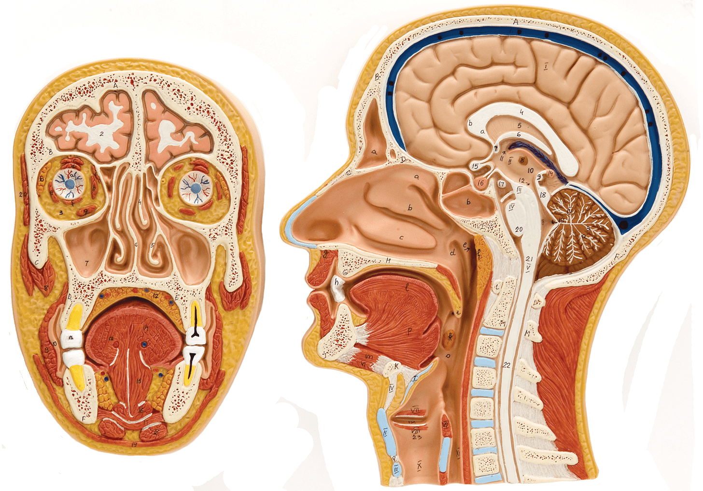
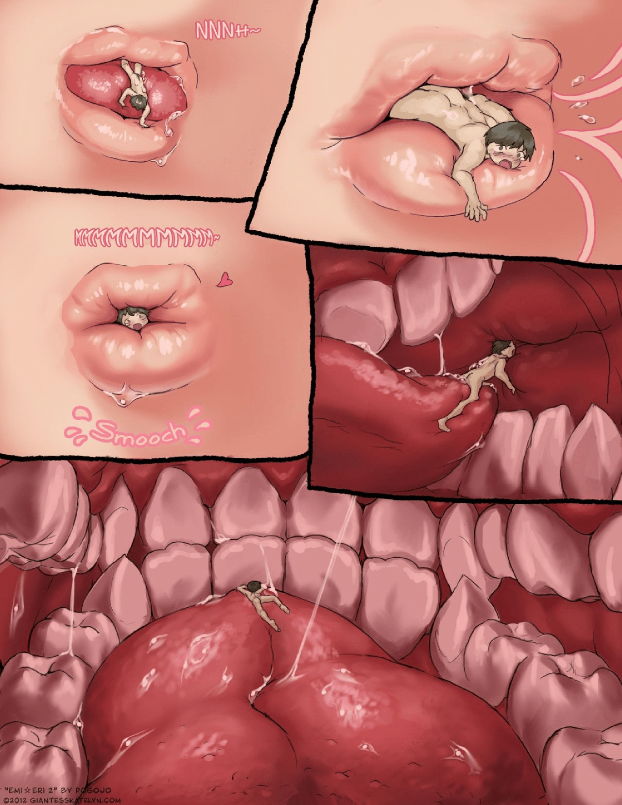
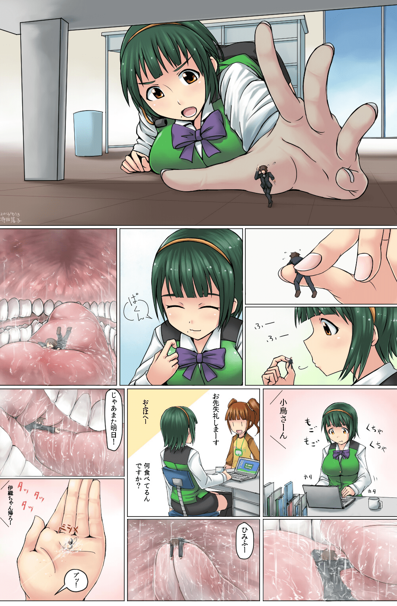
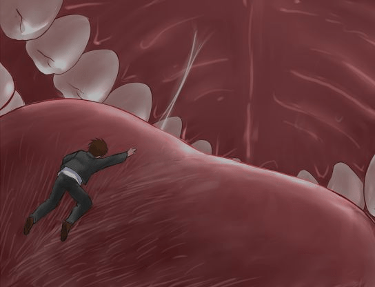
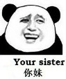

# [閒聊] 口內描寫常有的毛病

作者：3213213210

TID：26296

<title>1</title> <link href="../Styles/Style.css" type="text/css" rel="stylesheet">

# 1

如果你覺得標題很眼熟 那是因為我發過一篇一樣的文在講陰道
[https://giantessnight.com/gnforu ... hread&tid=25938](https://giantessnight.com/gnforum2012/forum.php?mod=viewthread&tid=25938)
不只標題 接下來的內文也是要寫差不多的東西

總之呢 最近在玩Blender 2.8的Sculpt(雕塑)模式
一路挖到嘴巴裡的時候覺得怎麼看都很怪 決定找點斷面圖當Ref(參考資料)來看
然後看到這張圖的時候我腦袋當機了
<ignore_js_op>

**sh202-ab.jpg** *(1.25 MB, 下載次數: 4)*

[下載附件](forum.php?mod=attachment&aid=NzYxOTh8ZjE5Y2M0MGR8MTY3NDA2Njg5NHwxODIzMHwyNjI5Ng%3D%3D&nothumb=yes)

2019-1-17 05:27 上傳

疑 嘴巴的空間呢
疑疑
欸欸欸欸欸欸欸欸欸欸
幹
幹幹幹幹幹幹幹幹幹幹

**下 顎 往 下 拉 時 嘴 巴 的 空 間 才 會 出 現 啊**

為什麼我可以忽略這個物理事實這麼久
稍微冷靜想一下 我現在舌頭不就貼著上顎嗎
而且舌頭稍微用力擴張 感受上就充滿牙齒內側了 這件事明明也已經知道好幾年了
不只如此 臉頰同時用力內收的話根本感受不到嘴巴裡哪裡有空隙
嘴巴裡的自由空間其實比想像中小非常多嘛

於是我終於明白了 為什麼以前在翻Pogojo的Emi ☆ Eri 2時
<ignore_js_op>

**這真的不對.jpg** *(203.72 KB, 下載次數: 4)*

[下載附件](forum.php?mod=attachment&aid=NzYyMDB8MzA3MzVhZGZ8MTY3NDA2Njg5NHwxODIzMHwyNjI5Ng%3D%3D&nothumb=yes)

2019-1-17 05:41 上傳

這一面我只能對著上半部尻 下半之後我會棄船
她的舌頭比下排牙齒還低啊媽的 會不會太唬爛了啊
而且顯然不只Pogojo會手動增加口腔高度廣度
<ignore_js_op>

**不對啊.jpg** *(544.23 KB, 下載次數: 8)*

[下載附件](forum.php?mod=attachment&aid=NzYxOTl8YzU3OGJhZjR8MTY3NDA2Njg5NHwxODIzMHwyNjI5Ng%3D%3D&nothumb=yes)

2019-1-17 05:41 上傳

舌頭太小了啊啊啊啊啊啊啊
<ignore_js_op>

**Shukushou_Gakuen_0044.jpg** *(20.36 KB, 下載次數: 0)*

[下載附件](forum.php?mod=attachment&aid=NzYyMDF8NWQ5MDM1M2N8MTY3NDA2Njg5NHwxODIzMHwyNjI5Ng%3D%3D&nothumb=yes)

2019-1-17 05:53 上傳

成惠啊啊啊啊啊啊啊啊啊

其實我能理解啦
閉合嘴巴的內部這種影像要找Ref有點強人所難
再說畫圖本來就不用對物理世界的東西照單全收，寬闊感可以單純是個表現手法
可是
這真的是那種只要一發現就再也無法忽略的事情
可恨啊，我的尻槍配菜一天比一天還限縮是怎樣
<title>2</title> <link href="../Styles/Style.css" type="text/css" rel="stylesheet">

# 2

话说我以前是VORE的忠实爱好者 现在做的project是用超声检测口腔和喉部 好多漂亮妹子来当被试 看多了感觉对vore兴趣越来越淡了。。。GG <title>3</title> <link href="../Styles/Style.css" type="text/css" rel="stylesheet">

# 3

為了寫好一篇足夠真實的文章，看來有必要花上十年讀個醫學系碩士了 <title>4</title> <link href="../Styles/Style.css" type="text/css" rel="stylesheet">

# 4

有那麼一刻我覺得這是一篇醫學文章。 <title>5</title> <link href="../Styles/Style.css" type="text/css" rel="stylesheet">

# 5

這其實比較接近放鬆情況下的剖面圖
有意識把舌頭往後縮的話，也是可以增加口腔內的空間，讓舌頭比較好活動的
像是閉著嘴含著喉糖或是棒棒糖，用舌頭去玩的狀況 <title>6</title> <link href="../Styles/Style.css" type="text/css" rel="stylesheet">

# 6

既然人可以变大变小这种设定都能接受了，就当自己的系解课也没上过嘛 <title>7</title> <link href="../Styles/Style.css" type="text/css" rel="stylesheet">

# 7

要是文章、漫画写这么严谨
作者写文章怕不是要查多少医学资料啊
<title>8</title> <link href="../Styles/Style.css" type="text/css" rel="stylesheet">

# 8

> [study 發表於 2019-1-19 09:08](https://giantessnight.cf/gnforum2012/forum.php?mod=redirect&goto=findpost&pid=394739&ptid=26296)
> 要是文章、漫画写这么严谨
> 作者写文章怕不是要查多少医学资料啊

這說是醫學資料 不如說是參考圖片吧又不是在寫工作細胞
<title>9</title> <link href="../Styles/Style.css" type="text/css" rel="stylesheet">

# 9

又一樁科學造成的悲劇

等等大腦選擇性遺忘之後再來重操舊業吧

....如果真有那麼一天的話(躺</ignore_js_op></ignore_js_op></ignore_js_op></ignore_js_op>