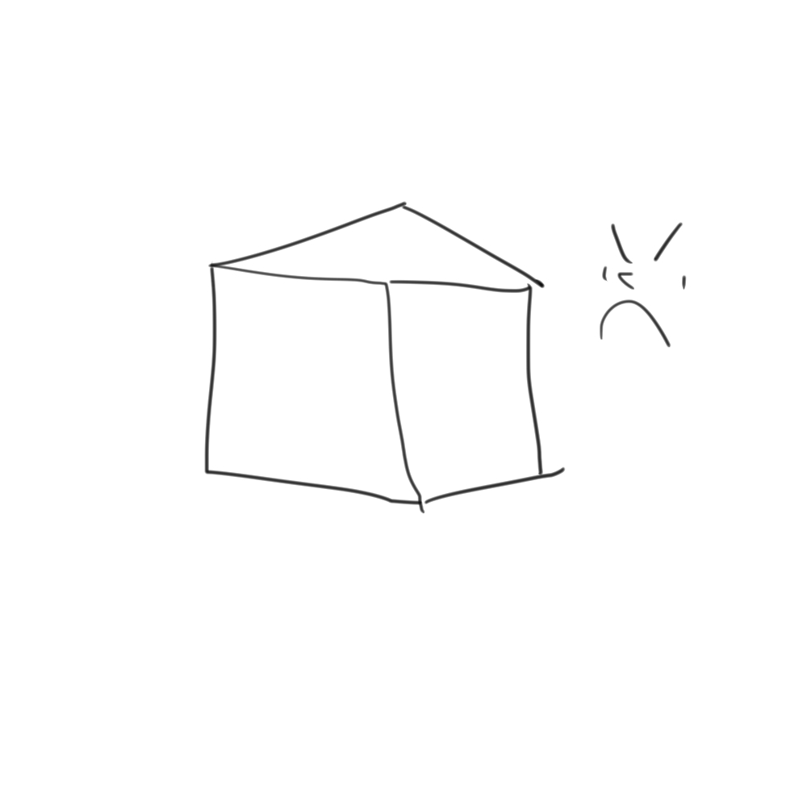
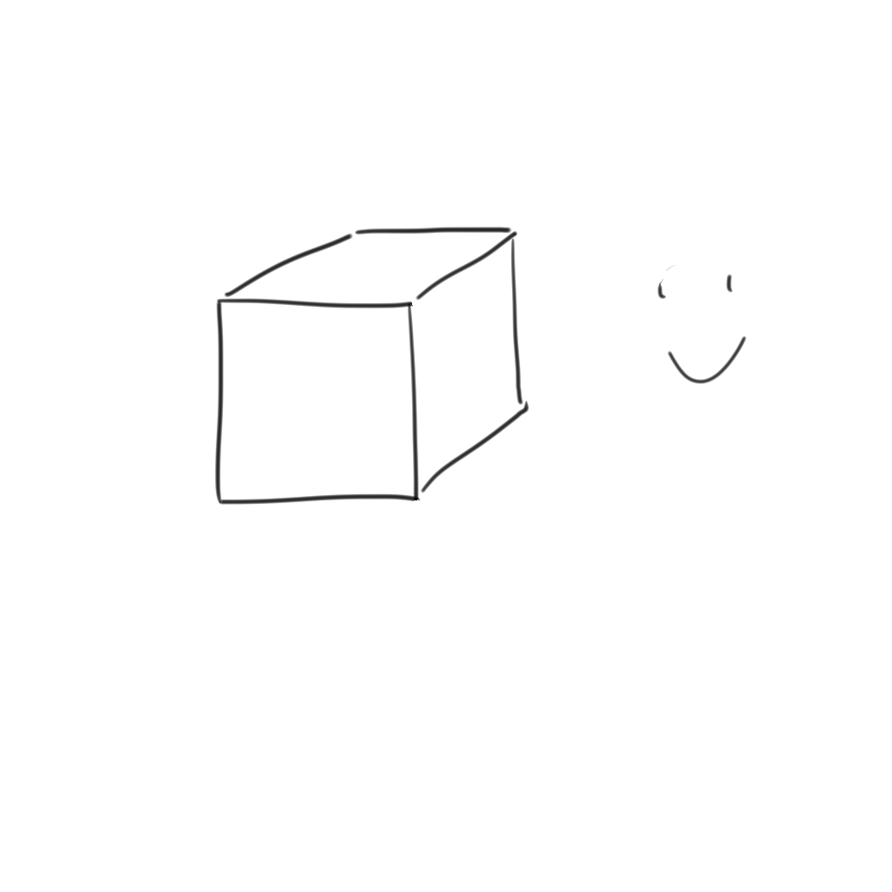
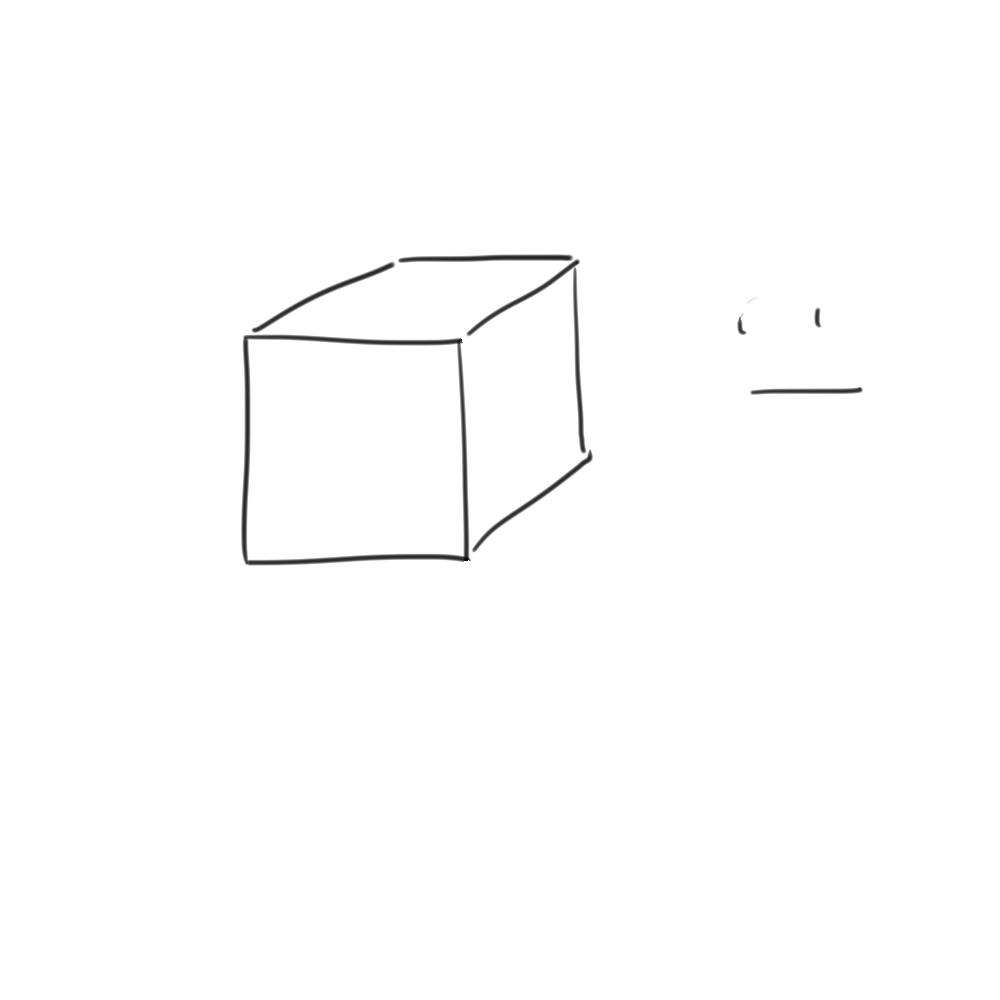
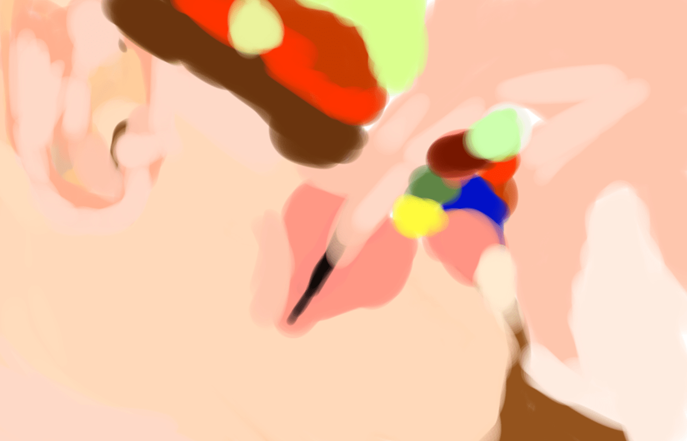

# [電繪] 如何進行臨摹練習(特別推薦給上色殘障)

作者：1033164383

TID：26115

<title>1</title> <link href="../Styles/Style.css" type="text/css" rel="stylesheet">

# 1

*本帖最後由 3213213210 於 2018-12-14 02:46 編輯*

完全初學者請先往這邊： [https://giantessnight.com/gnforu ... hread&tid=26155](https://giantessnight.com/gnforum2012/forum.php?mod=viewthread&tid=26155)
沒那麼初學但沒多好的： [https://giantessnight.com/gnforu ... hread&tid=26159](https://giantessnight.com/gnforum2012/forum.php?mod=viewthread&tid=26159)

======================================================================
參考文章：[https://ppt.cc/fvwqpx](https://ppt.cc/fvwqpx)
如果有人明明一直畫一直練卻都沒有進步
或者 像我一樣 電繪板買來只有當滑鼠替代品
這篇文章適合你 一起來血汗繪畫訓練吧

警告：
1.本實作保證有效但非常耗時，一張作品花上數十小時也不稀奇
2.由於是找素材作臨摹，成品基本上只能拿來自爽，因著作權上會有爭議
3.如果沒有電繪板還想做，歡迎，但是後期請多準備幾個能摔的滑鼠

好 回到文章
(為了顯示我有多認真，以下上全形句點)

===========================**可以略過的前言**===============================

我想還是不少人不知道：為什麼我們要練臨摹?
這是因為，繪畫，就像音樂，是一種將「想像」給「具現化」的過程。
「想像」與「具現化」是兩個相輔相成的能力，兩項缺一不可，且能互相拉拔提升。
而，若堅持自己所做的一切都必須是原創，練習到極致時就會遇到一個瓶頸：
**雖然能將腦中所想完整呈現，但大腦素材貧乏而限制了作品的可能性。**

「具現化」的意思是，當我看著自己畫的正方體，我會知道「我想像的形狀不是長這樣」。
<ignore_js_op>

**歪正方體.jpg** *(37.17 KB, 下載次數: 0)*

[下載附件](forum.php?mod=attachment&aid=NzU1ODB8YWRkZTEzZDN8MTY3NDA2OTY0NXwxODIzMHwyNjExNQ%3D%3D&nothumb=yes)

2018-11-27 23:10 上傳

而當我一再地修正、重畫，我將想像的正方體呈現在紙上的能力會越來越強。
<ignore_js_op>

**正正方體.jpg** *(29.29 KB, 下載次數: 0)*

[下載附件](forum.php?mod=attachment&aid=NzU1ODF8ZWU1Yjk2N2J8MTY3NDA2OTY0NXwxODIzMHwyNjExNQ%3D%3D&nothumb=yes)

2018-11-27 23:10 上傳

但是，由於我只能依據自己擁有的認知做為參考標準，所以若我無法有更進一步的想像，我就會永遠只會畫正方體。
舉例來說：這樣的我，若被要求「**請用光影表現出正方體的立體感**」……
<ignore_js_op>

**正正方體，然後呢.jpg** *(28.44 KB, 下載次數: 0)*

[下載附件](forum.php?mod=attachment&aid=NzU1ODJ8NjNmMTQzNDd8MTY3NDA2OTY0NXwxODIzMHwyNjExNQ%3D%3D&nothumb=yes)

2018-11-27 23:10 上傳

挫賽。
沒有實物、沒有相片、沒有先例可以參考的話，我只能盯著自己的「完美扁平正方體」發呆。
更糟的是，即便我的想像力有辦法暴力解開這個問題，
**若沒有指導或對照，我連「可以利用光影加強立體感」的想法都不會出現。**
這就是為什麼參考他人的作品如此重要，要改進自我的前提條件是**認知到自身的不足**。

當然，大部分的人會開始畫畫，都是因為看了別人的畫，沒有什麼「只有自己的作品能參考」的情況。
鑽研他人的作品，無疑是讓自己了解更多可能性的最快捷徑。
然而，很多人會拒絕全盤參考一個特定的作品，認為這樣會抹煞自己的獨特性和創造力。
**沒 那 回 事。**
你以為你卡卡西嗎，拷貝忍者嘞。能抄到五成像就算你厲害。
別說臨摹，就算只是描圖也能有效建構對繪畫方法的認知。
當然，理論上略過自己試誤的階段會限制大腦的想像力，但那可以用描更多圖來輕鬆補回。
臨摹不是抄襲，只是改善自身的一種手段而已。
總之，如果看到這邊能同意「臨摹是個好主意」，那就來做實際準備吧。

=========================**正文開始**===========================

首先，找一張照片。
本文的參考網誌使用了包包的照片，個人並不推薦，因為我們不會在乎包包畫的怎麼樣。
**請找裸露女性的照片。**
**不露也沒關係，大頭貼也可以，重點是要有性慾對象。**
性器官、淫蕩臉、扭腰擺臀……越爽的越好。
(不過同時別忘了，那是臨摹對象，初學者別找太複雜的圖折磨自己。)
這麼做的理由是，**如果畫歪了，你會感受到強烈的不和諧感，並產生驅使自己繼續努力的慾望。**
摸著自己的良心吧，難道把椅子畫歪能讓你產生罪惡感嗎?
如果在座有女性……屁啦，這裡沒有。但是有的話，挑選重點在於會不忍心畫歪的對象。
既然這裡是GTS愛好者社群，我再開放一個條件：
**可以使用合成圖。**
Giantessbooru.com上面隨便抓都一拖拉庫，我就不貼範例了。

接下來，開啟繪畫軟體。
再爛的軟體也沒關係，因為我們只需要一個工具。
**噴槍。**
接下來，把畫布視窗放到電腦螢幕右邊，把參考圖片放在左邊。
選色工具擺在螢幕上碰得到的地方，接下來，依循以下規則：

**1.不得使用橡皮擦工具。**
畫到最後整張圖每個隙縫都填有顏色，所以你不需要塗掉，蓋掉就好。
**2.不得使用噴槍以外其他筆刷。**
這是為了確保能清楚認知到圖上的所有顏色，禁止偷吃步。
**3.不得使用滴管工具。**
……這條其實沒前兩條那麼必要，但還是請不要輕易打破。(如果經驗太少，可以用**灰階**就好，只用深淺做畫面表現即可)
**4.圖層越少越好。**
最好是用一個圖層單刷整張圖。
理由嘛……避免圖層地獄。無論如何都想用的話請善用資料夾功能。
**5.禁止描圖。**
臨摹是放在旁邊，描圖就是直接疊在上面照抄。
用描的會讓腦袋跳過認識輪廓的步驟，除非你真的很忙不然別省這個時間。

**然後，嘗試複製出左邊的照片。**

繪畫的奧妙，就會在其中慢慢體會出來。
其中一個大密技，不用多久就能馬上體驗到。
**先從最大的筆刷開始塗，上完大色塊再慢慢縮小筆刷修細節。**
這是練習鉛筆與色鉛筆素描的人常有的盲點，畫完一小塊再畫另一小塊，
最後每個細節都顧到了卻毀了整張圖的平衡，得再花更多時間做細部調整。

這種「大家來找碴」的繪圖會建立起我們對影像的觀察方法。
我想，到了這邊，再做更多推銷也沒意義了，**重點是要去做**。

下面先放一張，剛剛塗了半小時的……東西。
參考圖是そりお([https://gs-uploader.jinja-modoki.com/upld-index.php?uname=solio](https://gs-uploader.jinja-modoki.com/upld-index.php?uname=solio))的合成圖。
<ignore_js_op>

**shuri12082401.jpg** *(158.36 KB, 下載次數: 0)*

[下載附件](forum.php?mod=attachment&aid=NzU1ODN8MDljNjZkOTZ8MTY3NDA2OTY0NXwxODIzMHwyNjExNQ%3D%3D&nothumb=yes)

2018-11-28 00:16 上傳

那麼我(其實根本是初學者)半小時可以做到什麼地步呢?
<ignore_js_op>

**新畫布.jpg** *(271.96 KB, 下載次數: 0)*

[下載附件](forum.php?mod=attachment&aid=NzU1ODR8MzU0YzJiYzd8MTY3NDA2OTY0NXwxODIzMHwyNjExNQ%3D%3D&nothumb=yes)

2018-11-28 00:16 上傳

WTF。
醜爆了，對吧?
不能線稿構圖、不能Ctrl+Z、不能直接讀取圖片顏色的確非常痛苦……
但是每一次修改，我都能很確實的感受到，這張圖離完成又更近了一步。
每次修改嘴巴的位置、每次修改陰影的粗細、每次調整顏色的位置，這張圖都比一分鐘前還要成功。
要達到完美，雖然很長，但真的只是時間的問題而已。

我沒有要在這裡放完成版的圖，因為上面那個就是目前的最新進度了。
這張圖會花多久完成呢? 兩個禮拜? 兩個月? 半年?
不重要，只要當下的自己有在前進就好。
共勉之。

<title>2</title> <link href="../Styles/Style.css" type="text/css" rel="stylesheet">

# 2

由于只会画房子而且画的不好，只试过p掉p站的图的背景然后画城市自嗨。。 <title>3</title> <link href="../Styles/Style.css" type="text/css" rel="stylesheet">

# 3

> [tddick2 發表於 2018-11-28 08:13](https://giantessnight.cf/gnforum2012/forum.php?mod=redirect&goto=findpost&pid=391522&ptid=26115)
> 由于只会画房子而且画的不好，只试过p掉p站的图的背景然后画城市自嗨。。 ...

想進步什麼就臨摹什麼，沒人一拿筆就會畫畫的
不過臨摹城市的話……
<ignore_js_op>

**CITY.jpg** *(96.85 KB, 下載次數: 0)*

[下載附件](forum.php?mod=attachment&aid=NzU1ODV8MDg0MzFlMDV8MTY3NDA2OTY0NXwxODIzMHwyNjExNQ%3D%3D&nothumb=yes)

2018-11-28 08:55 上傳

……我是光用看的頭就很痛啦
願意試的話，我會很敬佩你的恆心毅力的
<title>4</title> <link href="../Styles/Style.css" type="text/css" rel="stylesheet">

# 4

> [3213213210 發表於 2018-11-28 08:56](https://giantessnight.cf/gnforum2012/forum.php?mod=redirect&goto=findpost&pid=391523&ptid=26115)
> 想進步什麼就臨摹什麼，沒人一拿筆就會畫畫的
> 不過臨摹城市的話……

我是不会画人和涂阴影，但是楼房画的好。。。 所以就把一些图p的只剩人然后加画城市，这样会不会冒犯原作者。。
<title>5</title> <link href="../Styles/Style.css" type="text/css" rel="stylesheet">

# 5

> [tddick2 發表於 2018-11-28 10:20](https://giantessnight.cf/gnforum2012/forum.php?mod=redirect&goto=findpost&pid=391526&ptid=26115)
> 我是不会画人和涂阴影，但是楼房画的好。。。 所以就把一些图p的只剩人然后加画城市，这样会不会冒犯原作 ...

拿來自主練習的沒人管得到你，要po出來就標好原出處，真的聽到原作者有意見再刪就好然後，你這樣我真的不知道你的「會畫樓房」是指設計線稿還是很會畫長方體.....
不管怎樣，想學會就來練，就醬
<title>6</title> <link href="../Styles/Style.css" type="text/css" rel="stylesheet">

# 6

豆頁很痛
有時候初學者就是會把一切想的太簡單

可以請你不要再發自創教學文了可以嗎
你可以分享"大師"的教學文，但請不要瞎子摸象
我認同電繪狂的作品
這本來就是一個有系統的教學，他們甚至還需要花錢報名才能入社

而這篇文章不過是一個初心者在吃過鵝肝醬後拉出來的屎
如同我說的
請有點斤兩才能出師
如果沒有的話，拜託不要自己亂創邪教
樓主學習的方法我沒有任何一丁點認同點

我是第一次在論壇裡這樣大肆噴人
但請不要散佈錯誤的教學

我希望不要再看到類似的誤導文 <title>7</title> <link href="../Styles/Style.css" type="text/css" rel="stylesheet">

# 7

> [迷途小喵 發表於 2018-11-28 17:56](https://giantessnight.cf/gnforum2012/forum.php?mod=redirect&goto=findpost&pid=391540&ptid=26115)
> 豆頁很痛
> 有時候初學者就是會把一切想的太簡單

呃 那你可以告訴我 我的方法論哪裡出錯了嗎
別講出錯好了 告訴我 照這個方法練會造成什麼負面影響?
用錯誤的方法練瑜珈練重訓會弄傷身體，用沒效率的方法學畫畫是會瞎掉嗎?

我當然知道這種油畫式土法煉鋼不是某種很值得炫耀的神技，但我考慮的第一重點是發文環境
非常多人只覺得「我想畫畫」或「我想進步」，但是連最爛的方法都找不到所以沒有開始練習
我只是單純提供一個「最起碼你可以這麼做」，就算還是不想練至少能讓人認知到自己只是懶
我當然可以把所有已知的初學者瓶頸列出來、把常用的構圖和修正法一一做介紹，
但我簽名檔的繪畫教學連結已經死超久了卻從來沒人過問，今天改放套完整教學就會有人鳥我嗎?
我沒打算在這裡當誰的老師，只是鼓勵大家嘗試發現自己的問題這麼簡單
我的方法重點在「邏輯簡單，實作困難，進步確實」，你要罵至少告訴我問題點好嗎?

你可以笑我蠢，你可以嫌我的方法......邪教? 那到底什麼意思?
我就當你繪畫技能封頂，把任何一張照片用噴槍複製出來也不會有一丁點的進步，你有權鄙視這種作法
但你覺得，一個只畫過線稿的人、一個從來沒有嘗試觀察過人臉結構的人、一個連圓柱體都不確定怎麼畫都人沒辦法靠這個進步嗎?
如果只有「正派學習法」能當學習方法，你要不要幫壇友出錢上一小時一千的素描課?
不然最最最起碼，你提供個更有效的方法啊?
「這個方法不夠好」，那還是好過沒方法吧?
<title>8</title> <link href="../Styles/Style.css" type="text/css" rel="stylesheet">

# 8

首先，先慶祝製圖區終於有新文章了~!(煙火(逃

神技畫圖的方式有一萬種，街上隨便都有教學書，p站，水管，patron，縮時攝影，塗層教學，花錢不花錢的都有，

現在論壇裡缺的不是畫圖的技術，想畫的人很容易就能找到自己要的，缺的是願意畫圖的人

不茍同，懶的照樓主教學花時間慢慢磨的人大有人在，想學的人肯定很少，像俺就懶的描。學不學是個人選擇自由，不想學的自己會關掉文章馬上就忘了，有點兒興趣的還會轉一轉，笑罵這教學真奇葩，都無妨，起碼引起一點興趣，一點漣漪。

這教學即使教不出像樣的作圖方式，作為拋磚引玉的教學文範例我想也是合格的，有連結，有步驟，有附圖，甚至還有警告標示，是少了張精美的鎮樓圖啦(誤

因為自己技術不好就不能發文，不接受批評指教，閉門造車也不可能進步到更好的技術。

回到樓主的教學上，俺就自己的學習過程有點心得:

除了看大師的教學長知識，勤模仿外，
若覺得自己的圖有哪裡不對勁又找不出來時，找一些和自己程度差不多糟糕的畫師的作品，會比較容易看出盲點。

<title>9</title> <link href="../Styles/Style.css" type="text/css" rel="stylesheet">

# 9

其实应该练习的是基础，也就是说想要给自己来点信心想要画的让自己满意，那么基础的黑白灰关系是肯定要去花大量时间积累的，，还有建议初学者不要直接拿颜色起稿去临摹，那样你会发现你如何画也画不立体，建议就从黑白灰开始，画出投影 暗面 灰面和亮面，再去用调色的方式把颜色做出来，新手如果直接用颜色起稿，那么会比较打击自己的信心，画画自学最重要的就是保持自己内心的信心，从简单的来。 <title>10</title> <link href="../Styles/Style.css" type="text/css" rel="stylesheet">

# 10

而且楼主我看，，怎么好像笔没有压感? <title>11</title> <link href="../Styles/Style.css" type="text/css" rel="stylesheet">

# 11

我觉得楼主推荐的那份自学资料，其实不适合初学者，因为初学者也是很难在没有掌握色彩理论和黑白关系之前画出正确的体积来的是不可能的，就算是临摹也非常难做到，，首先新手不吸色去就用色快起稿其实太过硬核了，现在很多原画师也不是用色块去起稿的，其次这应该是有老师帮忙指导才能这么练习，，因为新手临摹最难得可能除了颜色 素描关系以外最大的难题就是形准，所以，，从基础开始慢慢来吧，别用颜色起稿  也尽量去多使用素材和工具， 多多积累自己的自己形体的精准度，还有黑白关系，颜色还是暂时不要去碰。 <title>12</title> <link href="../Styles/Style.css" type="text/css" rel="stylesheet">

# 12

*本帖最後由 迷途小喵 於 2018-11-29 10:26 編輯*

> [3213213210 發表於 2018-11-29 01:02](https://giantessnight.cf/gnforum2012/forum.php?mod=redirect&goto=findpost&pid=391563&ptid=26115)
> 呃 那你可以告訴我 我的方法論哪裡出錯了嗎
> 別講出錯好了 告訴我 照這個方法練會造成什麼負面影響?
> 用錯 ...

典型的還沒走路就想飛
要我發教學文?
根本不用，外面的色彩教學文多如牛毛
你貼的電繪狂就已經很足夠了
繪畫重在練習數量
但正確的方法才是有效率的辦法

用你的辦法練10000次
用正確的方法練100次就能達到
這不就是一個錯誤，而且沒效率的辦法嗎?
難道說今天你對一個要練肌肉的人不叫他去做重訓，叫他天天跳有氧嗎?
我也沒說跳有氧不能增加肌肉阿，大概跳個10年就有重訓3個月的效果了吧?

所有的"臨摹"請從"骨架"開始
就算真的初學者"照描"
也是可以接受的
你真的看過別人的程度了嗎?
你有為他人量身訂做課程嗎?
你真的有遇過何謂"甚麼都不會"嗎?

色彩更不用說
請從色彩學開始學起好嗎?
臨摹也是要挑作品的
不是隨便挑喜歡的就好
需要挑有完整骨架
完整構圖的作品
難道我挑一個Q版作品臨摹就能進步嗎?
更何況你的教學方式就是錯的
甚麼一個圖層幹到底?請問你是在用電繪還是用手繪?
不準擦掉?你當你是一筆大師嗎?
你連基礎的圖層混色都沒有研究過就亂說話?

你連顏色的順序要怎麼圖都不知道?還想說些甚麼?

說真的
想學的人早就學了
有多少好的教學流通在網路上
會來這裡真正看你的"教學"
來這裡直接罵你、委婉罵你的
只有我們這些程度多少比你好
比你有觀念一點的人罷了

每天在這裡發一些自學三毛程度就在這裡出師
請自己有一點自覺

在我眼裡你不過是個廚罷了
成天急著把想要分享成果
自以為對別人有益
實際上只不過是占版面
洗版般的存在

<title>13</title> <link href="../Styles/Style.css" type="text/css" rel="stylesheet">

# 13

> [迷途小喵 發表於 2018-11-29 10:23](https://giantessnight.cf/gnforum2012/forum.php?mod=redirect&goto=findpost&pid=391572&ptid=26115)
> 典型的還沒走路就想飛
> 要我發教學文?
> 根本不用，外面的色彩教學文多如牛毛

所以說啊，我對別人可能沒什麼益

那你嘞?

你拒絕具體指證別人的錯誤，只是堅持「這不夠好」，
然後嗆人方法叫「因為有別人比你更好」，然後連個連結都懶得貼
再說，你有任何研究資料顯示你的「好方法」一定比較有效嗎?
我也不想管你的方法有多屌，你沒貼出來讓人練習，
根本沒效益可言的事效率(效益/時間)絕對為零，
而你這樣「寧願別練習也別照我的方法練習」，

你不也是方法正確廚嗎?

繪畫先從骨架開始跟彈吉他從爬格子開始練一樣，只是一種保險作法，沒人保證那就是最好的方法
我今天說，「要學英文? 先隨便找個說英文的老外，然後訓練到能流暢朗讀他的影片台詞腔調吧」
那你當然可以覺得：「屁啦，學英文當然先從ABC開始念啊」，我也可以幫你想出一堆我的方法可能有的問題
但是對一個完全不懂英文的人來說，最重要的是什麼?
鬼才知道，每個個案都有差，那你怎麼這麼有信心我的方法無益?
臨摹Q版作品不會進步喔，那你構圖技能大概封頂不用練了吧，那些特地為Q版作品出書的人也是給初學者看的對吧

「練習」的目的在建構「認知」，
只開一個圖層練習、不用圖層混色是為了訓練自己準確抓住細部的顏色，
用太多工具時如果對自己的行為沒有準確認知到後面會連自己怎麼畫出來的都不知道
連圖層這麼簡單的東西，都可能因為大量濫用造成大災難，不寫那句誰知道能失控到什麼地步
最重要的叫做「培養觀察方法」，等有了對影像的認識再尋找捷徑
以這個目的而言，挑什麼樣的作品臨摹都不可能會沒進步(除非一片純色)，
因為要臨出來就非得準確掌握畫面，就算圖上只有一條黑線，準確掌握線的位置和角度也是得練習的學問

你知道什麼叫沒效率的方法嗎?
每次都憑自己的想像力畫圖，每次都畫完一張就忘了一張，下次再把同樣的錯都重犯一遍
這不是針對誰，是非常常見的情況，案例橫跨整個北半球
的確，會有更有效率的做法，但有這麼多不同的人卡在不同的地方，還有什麼比讓大家當自己老師更有效率的方法?
當然有，但 沒 錢 嘛 ，更 懂 的 人 不 想 寫 嘛

你很懂，很喜歡很棒的方法，那很好
自己去發一篇，不用自己寫，把外部連結整理進來就好
讓我的爛教學失去市場價值，讓大家一看就知道你的方法有價值很多
到時候我就在這篇開頭附上你的教學連結，如何?
<title>14</title> <link href="../Styles/Style.css" type="text/css" rel="stylesheet">

# 14

> [3213213210 發表於 2018-11-29 13:46](https://giantessnight.cf/gnforum2012/forum.php?mod=redirect&goto=findpost&pid=391576&ptid=26115)
> 所以說啊，我對別人可能沒什麼益
> 
> 那你嘞?

那我就簡潔扼要的講明的我的訴求好了
不好意思，我不歧視銅牌
但我歧視自以為的銅牌
今天你一個銅牌在那裡發再多的攻略文都是無意義的
你的一百條意見完全比不上
請自己收斂一點，以及好好增強實力到白金以上
再來發一個心得文

還有，你說教學資源問題
這裡不是繪圖交流社
只是巨大娘愛好交流論壇
真正想學習的人不可能找不到資源還特地來到這裡尋找
更何況你只是討論"一般"的繪圖技巧
而不是"巨大娘"相關的透視技巧之類的

這麼喜歡發繪圖教學，這麼喜歡指正別人
怎麼不去真正的繪圖交流論壇、社群呢?
保證你這個實力去那裏不是被無視就是被噴成腦殘

<title>15</title> <link href="../Styles/Style.css" type="text/css" rel="stylesheet">

# 15

> [迷途小喵 發表於 2018-11-29 15:16](https://giantessnight.cf/gnforum2012/forum.php?mod=redirect&goto=findpost&pid=391582&ptid=26115)
> 那我就簡潔扼要的講明的我的訴求好了
> 不好意思，我不歧視銅牌
> 但我歧視自以為的銅牌

自以為 是吧
我真不知道連「準確指出對方理論錯誤」都辦不到的人怎麼這麼有臉欸
從頭到尾你都在人身攻擊喔
「從你的理論和半成品判斷 我覺得你是廢物所以你該閉嘴 但我不針對你的理論 重點是你是廢物」
哇 真的是 社會學上哪種定義都符合的歧視呢

你要說這篇文跟GTS相關性不夠高 我還可以接受
就算多貼了一兩個取得合成圖的管道 這篇本質還是單純在講如何訓練觀察力
既然當版主 會看重「論壇主題純潔性」勝於「刺激社群尋找方法」 我也必須尊重

但從你前面的幾個回文 我真的無法想像你在乎的是論壇整潔和社群未來
我的幫助太沒效率了 要被幫的人會自己去找方法被幫?
如果把我的理論放到別的地方就會被譙? 抽換背景時空這種大絕都放出來了呢
看我不爽是你的事 笑我廢也是你的自由 我不在乎
不過你可以再誠實一點 你根本不在乎有沒有任何人能學到東西
這麼喜歡當老師 就應該先搞清楚自己的水準 對吧?
<title>16</title> <link href="../Styles/Style.css" type="text/css" rel="stylesheet">

# 16

为啥要拿硬笔画啊，，没有任何过渡怎么画调子啊，打开压感吧 <title>17</title> <link href="../Styles/Style.css" type="text/css" rel="stylesheet">

# 17

> [1033164383 發表於 2018-11-29 22:28](https://giantessnight.cf/gnforum2012/forum.php?mod=redirect&goto=findpost&pid=391596&ptid=26115)
> 为啥要拿硬笔画啊，，没有任何过渡怎么画调子啊，打开压感吧

感壓有開啦，不過只影響筆刷大小
因為打稿階段最重要的是大輪廓，邊界不明會很難辦事(畢竟畫歪的地方是要用蓋掉的)
再說，我要求自己畫這東西就是為了確保認識到每個顏色細節，所以調和顏色這種事在這階段我要求自己盡量少做
......不過等我在背景那邊卡到崩潰的時候應該就會開始調軟了</ignore_js_op></ignore_js_op></ignore_js_op></ignore_js_op></ignore_js_op></ignore_js_op>