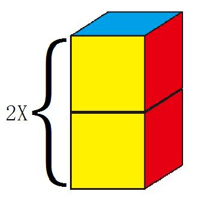

# 【鹿】可无の体重论

作者：jy24310350

TID：11316

<title>1</title> <link href="../Styles/Style.css" type="text/css" rel="stylesheet">

# 1

所谓GTS巨大化，体重增加是自然的
很多同好们提过，貌似身高超过原三倍则骨骼不能支撑体重
所以GTS是超出了正常范畴的
【以上仅为胡言乱语】
正题
用过计算器的同好们可能发现了，GTS的体重不是单纯的（巨大化倍数X原体重）
为什么呢？
这个问题比较难解释，请看图
在那之前，我们需要解释一下巨大化的理论。
巨大化≠细胞变大（否则GIGA级GTS在我们眼中会是一个个细胞……）
巨大化＝细胞数量增加
所以，假设下面这个立方体是GTS的一部分
<ignore_js_op>

**1.JPG** *(5.52 KB, 下載次數: 0)*

[下載附件](forum.php?mod=attachment&aid=MjY2OTV8MWI3ZjkyN2V8MTY3NDA2ODczOHwxODIzMHwxMTMxNg%3D%3D&nothumb=yes)

2011-11-4 11:53 上傳

则想要巨大化2倍，我们先增加其高度。
<ignore_js_op>

**2.JPG** *(10.02 KB, 下載次數: 0)*

[下載附件](forum.php?mod=attachment&aid=MjY2OTZ8MjQ3OTMwOTZ8MTY3NDA2ODczOHwxODIzMHwxMTMxNg%3D%3D&nothumb=yes)

2011-11-4 11:53 上傳

当然，这还不够，为什么呢？
因为这样事实上只增加了高度，宽度长度不变
那么出现的gts就好像用画图软件强行拉长两倍的图片
所以，我们也要把长度和宽度各增加两倍
则结果如下
<ignore_js_op>

**3.JPG** *(23.17 KB, 下載次數: 0)*

[下載附件](forum.php?mod=attachment&aid=MjY2OTd8NTkyYzc3YWN8MTY3NDA2ODczOHwxODIzMHwxMTMxNg%3D%3D&nothumb=yes)

2011-11-4 11:53 上傳

则巨大化2倍，事实上gts体积增大了8倍
但是如果我们用（原体重X8X巨大化倍数），那也是错的
我们看一下巨大化3倍的情景
我懒得作图了。。
<ignore_js_op>

**02d7d439c0f480dc3b87ce4c.jpg** *(60.05 KB, 下載次數: 0)*

[下載附件](forum.php?mod=attachment&aid=MjY2OTh8YmMxYmQ2MjN8MTY3NDA2ODczOHwxODIzMHwxMTMxNg%3D%3D&nothumb=yes)

2011-11-4 11:53 上傳

明白了吗？
所以公式其实应该是
（原体重X巨大化倍数&sup3;）
~以上~
其实我也不知写这个到底有没有用orz

实例：
原体重50kg，巨大化2倍
0.4T

原体重50kg，巨大化100倍
50000T

[ *本帖最後由 LKW 於 2011-11-5 11:01 編輯* ] <title>2</title> <link href="../Styles/Style.css" type="text/css" rel="stylesheet">

# 2

我似乎做了一件完全没有意义的事
算了就拿“知道理论也是很重要的不能只靠计算器”来安慰自己吧 <title>3</title> <link href="../Styles/Style.css" type="text/css" rel="stylesheet">

# 3

这个好象是完全不需要做图加以说明的常识吧... <title>4</title> <link href="../Styles/Style.css" type="text/css" rel="stylesheet">

# 4

這些對踩踏.重殘酷等SW類的還是有幫助的
只不過如果能用人物的圖來舉例可能更有可看性 <title>5</title> <link href="../Styles/Style.css" type="text/css" rel="stylesheet">

# 5

我本来也想用人物的，可是几个女的叠在一起好奇怪 <title>6</title> <link href="../Styles/Style.css" type="text/css" rel="stylesheet">

# 6

簡單來說，清析易懂。
你用一個非常簡單的例子，推論變大N倍不等於體重也跟著N倍重。

整體來說，還蠻有趣的。 <title>7</title> <link href="../Styles/Style.css" type="text/css" rel="stylesheet">

# 7

如果用你的理論下去,反觀的話...縮小就是細胞變少,這讓我想到某本書上提出縮小是完全不可行出現的原理,所以我本人還是支持縮小是把細胞變小...

不過這些都太複雜了,對我們這些對縮小以及變大有崇景的人,一個無視這些物理理論的文章或漫畫,或許才是最完美的東西~

不過在這些之前...交個女朋友或是有個能玩幻想遊戲的對象是很重要的(在外國有不少畫師或朋友都有跟對象玩縮小或變大的性遊戲,例如跪在自己女朋友腳邊,被她用對待蟲子的方式說話,或是買超大號SIZE的衣服在其中掙脫,以示自己縮小)

喔!對了!我還沒有女朋友呢....

FOREVER ALONE.... <title>8</title> <link href="../Styles/Style.css" type="text/css" rel="stylesheet">

# 8

> 原帖由 *中文之許* 於 2011-11-4 15:46 發表 
> 例如跪在自己女朋友腳邊

這個方式，我在12-13年前就玩過了
那時的女友，不知道我有GTS傾向 (現在這個還不知道，只知道我看到他玩弄螞蟻我會很興奮)。她坐在床上，我就在他腳邊磨啊，並順勢往上看，創作出pov的即視感。同時，他也會講一些調情的話，只是她的音量在我的耳中會自然放大20倍，接著自已就像蟲子一樣，順到他的腳慢慢往上磨，重點是創作出自已非常卑微的感覺，而這種感覺會反應在生理上。接下來，就是ooxxooxx啦~~
玩到分手時，她還是弄不懂，為什麼我每次都要用鼻子磨、聞她的腳與腿。 <title>9</title> <link href="../Styles/Style.css" type="text/css" rel="stylesheet">

# 9

有h超版这么常态的和你讨论是小鹿你的运气啊
要是换了那几位 <title>10</title> <link href="../Styles/Style.css" type="text/css" rel="stylesheet">

# 10

雖然不知道是不是這樣解釋，但無意間就知道了體重增長是呈三次方級數的結論……||| <title>11</title> <link href="../Styles/Style.css" type="text/css" rel="stylesheet">

# 11

个人觉得还是有帮助的，就好像“米”的进制是10，“立方米”的进制却为1000一样吧。
应该对新人们创作小说等等有些帮助吧！ <title>12</title> <link href="../Styles/Style.css" type="text/css" rel="stylesheet">

# 12

也许可以拿来做新文章的某种背景设定吧 <title>13</title> <link href="../Styles/Style.css" type="text/css" rel="stylesheet">

# 13

然後作者闡明了一個體系！！
與計算器算出來的幾乎一致！
結論正確了嗎？

其實使用論壇界面的計算器也很方便…
對吧~ <title>14</title> <link href="../Styles/Style.css" type="text/css" rel="stylesheet">

# 14

我覺得樓主只是就計算器的算法，提供一個合理的解釋。
別人信不信我不知道，但我信了 <title>15</title> <link href="../Styles/Style.css" type="text/css" rel="stylesheet">

# 15

你说得对，而且很形象， <title>16</title> <link href="../Styles/Style.css" type="text/css" rel="stylesheet">

# 16

> 原帖由 *0128* 於 2011-11-4 21:09 發表 
> 然後作者闡明了一個體系！！
> 與計算器算出來的幾乎一致！
> 結論正確了嗎？
> 
> 其實使用論壇界面的計算器也很方便…
> 對吧~

說起計算器
我發現乳房重量有問題
當巨大化1倍時,
乳房重量是2KG
正常人應該才數百克... <title>17</title> <link href="../Styles/Style.css" type="text/css" rel="stylesheet">

# 17

我对乳房构造实在是不了解。。。但是大概要算上三围体重罩杯身高等等……
另外你怎么知道是几百克。。
那东西不能量吧。。 <title>18</title> <link href="../Styles/Style.css" type="text/css" rel="stylesheet">

# 18

> 原帖由 *jy24310350* 於 2011-11-4 20:12 發表 
> 个人觉得还是有帮助的，就好像“米”的进制是10，“立方米”的进制却为1000一样吧。
> 应该对新人们创作小说等等有些&# ...

这个很形象，意思简单来说其实就是
1M=100CM
1M&sup3;=100X100X100=1000000CM
【吧】</ignore_js_op></ignore_js_op></ignore_js_op></ignore_js_op>