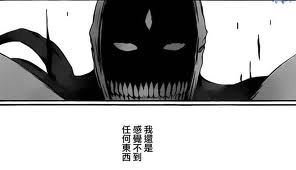

# 1000紅利點達成！

作者：神不保佑愚民

TID：12397

<title>1</title> <link href="../Styles/Style.css" type="text/css" rel="stylesheet">

# 1

如题↑↑↑

首先还是要感谢大家对我的支持和肯定，我会用更多更好的作品来回报大家！
虽然这东西不能吃，但也算是一种荣誉吧。

总之，在这新人辈出的年代，在这藏龙卧虎的论坛，我真心希望有人能超越我，也希望各位观众多多支持自己喜爱的创作者们。
在此与所有挤时间创作的GTS同好们共勉！
[http://giantessnight.com/gnforum/stats.php?type=creditsrank](http://giantessnight.com/gnforum/stats.php?type=creditsrank)

最后发一张改图预告，下周发布：  （从6月份起我会进入高密度创作期，敬请关注）

<ignore_js_op>

**N2.jpg** *(54.49 KB, 下載次數: 0)*

[下載附件](forum.php?mod=attachment&aid=Mjg2Njh8ZTM4ZmFhMjZ8MTY3NDA2ODY5NXwxODIzMHwxMjM5Nw%3D%3D&nothumb=yes)

2012-5-27 22:48 上傳

[ *本帖最後由 xnr 於 2012-5-28 00:10 編輯* ] <title>2</title> <link href="../Styles/Style.css" type="text/css" rel="stylesheet">

# 2

恩 祝贺一下……我的目标现在突破50 - -（好少啊） <title>3</title> <link href="../Styles/Style.css" type="text/css" rel="stylesheet">

# 3

你们都是坏人 <title>4</title> <link href="../Styles/Style.css" type="text/css" rel="stylesheet">

# 4

恭喜紅利破千!!
最近都做奈亞子的呢~
樓主有再跟新番嗎XD? <title>5</title> <link href="../Styles/Style.css" type="text/css" rel="stylesheet">

# 5

> 原帖由 *qwe74god69* 於 2012-5-27 23:49 發表 
> 恭喜紅利破千!!
> 最近都做奈亞子的呢~
> 樓主有再跟新番嗎XD?

没时间看动漫...真遗憾。。。

[ *本帖最後由 xnr 於 2012-5-28 18:26 編輯* ] <title>6</title> <link href="../Styles/Style.css" type="text/css" rel="stylesheet">

# 6

呃，快了，快赶上楼主了，只差中间加一个零...... <title>7</title> <link href="../Styles/Style.css" type="text/css" rel="stylesheet">

# 7

太強了
果真要好好學習
期待新的作品XD <title>8</title> <link href="../Styles/Style.css" type="text/css" rel="stylesheet">

# 8

-6的某人路过   <title>9</title> <link href="../Styles/Style.css" type="text/css" rel="stylesheet">

# 9

紅利點是做啥用的？能吃咩？（大霧…… <title>10</title> <link href="../Styles/Style.css" type="text/css" rel="stylesheet">

# 10

恭喜XNR大
能有這麼多的紅利點
都是因為你努力在創作的關係啊
希望以後還能看到更多你的作品 <title>11</title> <link href="../Styles/Style.css" type="text/css" rel="stylesheet">

# 11

不要说得这么直接，或者说这么傲娇。。。。 <title>12</title> <link href="../Styles/Style.css" type="text/css" rel="stylesheet">

# 12

我最近电脑回来了，养伤好了就可以投入工作了，今年内预定画两到三张吧……←坑？ <title>13</title> <link href="../Styles/Style.css" type="text/css" rel="stylesheet">

# 13

我是幫你突破1000點的人喔
當時本來要只給你七點湊整數的ＸＤ
但是你畫的真的很好阿 所以忍不住...
現在這幾天我超忙一直無法畫圖..只好期待你的坑
加油唄！ <title>14</title> <link href="../Styles/Style.css" type="text/css" rel="stylesheet">

# 14

 好多好多~~~~祝贺~
 期待xnr最新的作品呀~~~O(∩_∩)O~ <title>15</title> <link href="../Styles/Style.css" type="text/css" rel="stylesheet">

# 15

1000個紅利點，xnr會出現新形態.........就是和畫筆、電腦畫盤合體了....... <title>16</title> <link href="../Styles/Style.css" type="text/css" rel="stylesheet">

# 16

 <ignore_js_op>[images.jpg](forum.php?mod=attachment&aid=Mjg2NzZ8OTJlYjhhMzF8MTY3NDA2ODY5OXwxODIzMHwxMjM5Nw%3D%3D&nothumb=yes) *(5.94 KB, 下載次數: 0)*

[下載附件](forum.php?mod=attachment&aid=Mjg2NzZ8OTJlYjhhMzF8MTY3NDA2ODY5OXwxODIzMHwxMjM5Nw%3D%3D&nothumb=yes)

2012-5-28 20:17 上傳  

</ignore_js_op> <title>17</title> <link href="../Styles/Style.css" type="text/css" rel="stylesheet">

# 17

> 原帖由 *wtman* 於 2012-5-28 20:17 發表 
> 1000個紅利點，xnr會出現新形態.........就是和畫筆、電腦畫盤合體了.......

错，XNR会进入暴走形态@_@ <title>18</title> <link href="../Styles/Style.css" type="text/css" rel="stylesheet">

# 18

X兄战力指数破千了，，，愿X兄战力早点破万点啊 <title>19</title> <link href="../Styles/Style.css" type="text/css" rel="stylesheet">

# 19

XNR已成為藍染的存在。 <title>20</title> <link href="../Styles/Style.css" type="text/css" rel="stylesheet">

# 20

XNR大大红利点狩猎1000次达成！ <title>21</title> <link href="../Styles/Style.css" type="text/css" rel="stylesheet">

# 21

恭喜啦~期待新的大作哦
万恶的手机发了两次…

[ *本帖最後由 LKW 於 2012-5-31 11:49 編輯* ]</ignore_js_op>