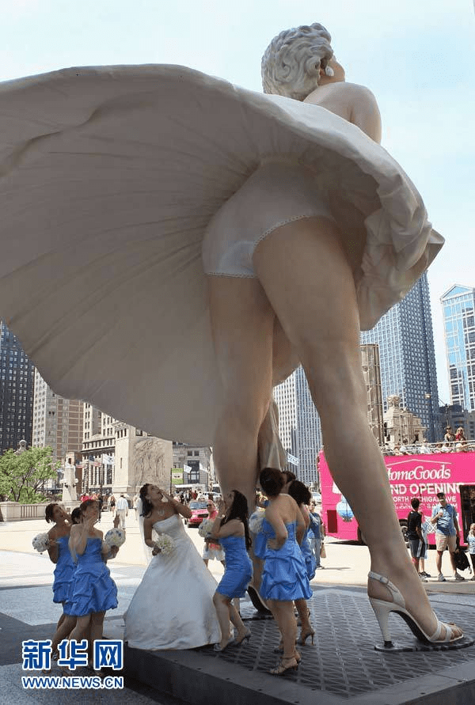
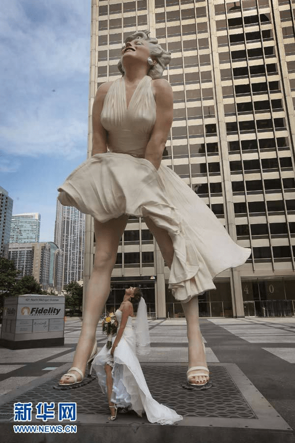
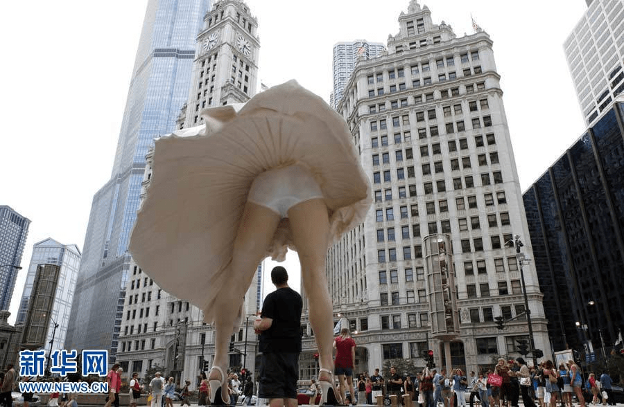
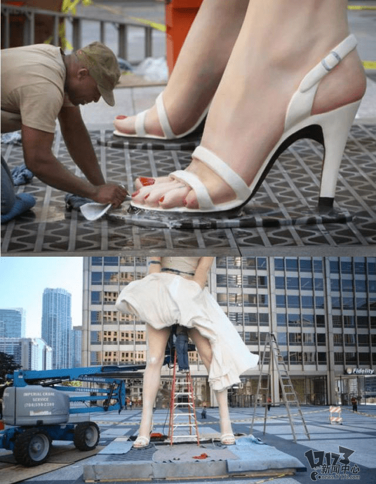

# 8米玛丽莲梦露像伫立芝加哥街头

作者：sda

TID：10607

<title>1</title> <link href="../Styles/Style.css" type="text/css" rel="stylesheet">

# 1

 应该……沾得上边吧……
 我们这里有个多好啊O(∩_∩)O~，再大点更好！ <title>2</title> <link href="../Styles/Style.css" type="text/css" rel="stylesheet">

# 2

 <ignore_js_op>[121675415_131n.jpg](forum.php?mod=attachment&aid=MjU1ODV8NThhOWY0Yzl8MTY3NDA2OTg2MXwxODIzMHwxMDYwNw%3D%3D&nothumb=yes) *(67.9 KB, 下載次數: 10)*

[下載附件](forum.php?mod=attachment&aid=MjU1ODV8NThhOWY0Yzl8MTY3NDA2OTg2MXwxODIzMHwxMDYwNw%3D%3D&nothumb=yes)

2011-7-17 09:12 上傳  

</ignore_js_op> <ignore_js_op>[121675415_151n.jpg](forum.php?mod=attachment&aid=MjU1ODZ8MmZlNWM0YWN8MTY3NDA2OTg2MXwxODIzMHwxMDYwNw%3D%3D&nothumb=yes) *(81.24 KB, 下載次數: 4)*

[下載附件](forum.php?mod=attachment&aid=MjU1ODZ8MmZlNWM0YWN8MTY3NDA2OTg2MXwxODIzMHwxMDYwNw%3D%3D&nothumb=yes)

2011-7-17 09:12 上傳  

</ignore_js_op> <ignore_js_op>[121675415_191n.jpg](forum.php?mod=attachment&aid=MjU1ODd8ZTRjZmY2NDN8MTY3NDA2OTg2MXwxODIzMHwxMDYwNw%3D%3D&nothumb=yes) *(83.49 KB, 下載次數: 2)*

[下載附件](forum.php?mod=attachment&aid=MjU1ODd8ZTRjZmY2NDN8MTY3NDA2OTg2MXwxODIzMHwxMDYwNw%3D%3D&nothumb=yes)

2011-7-17 09:12 上傳  

</ignore_js_op> <title>3</title> <link href="../Styles/Style.css" type="text/css" rel="stylesheet">

# 3

这个太XE了，晕，到的确是符合要求的。 <title>4</title> <link href="../Styles/Style.css" type="text/css" rel="stylesheet">

# 4

热情贴图区已经有人发过了。。。
把我的留言复制过来：

吐槽：跟自由女神像一样高可以么。。。

不管怎样，美国人有得爽了。。。CITY上面都HIGH爆了。。。梦露可是美国人心目中的性感女神啊，无可比拟的啊！ <title>5</title> <link href="../Styles/Style.css" type="text/css" rel="stylesheet">

# 5

太有创意了~确实牛呀 <title>6</title> <link href="../Styles/Style.css" type="text/css" rel="stylesheet">

# 6

 我错了…… <title>7</title> <link href="../Styles/Style.css" type="text/css" rel="stylesheet">

# 7

建议我们国内也搞个。。 <title>8</title> <link href="../Styles/Style.css" type="text/css" rel="stylesheet">

# 8

用泳装多好啊 <title>9</title> <link href="../Styles/Style.css" type="text/css" rel="stylesheet">

# 9

 <ignore_js_op>[11_07171335_03.jpg](forum.php?mod=attachment&aid=MjU1ODh8NTU4ZDE3MzF8MTY3NDA2OTg2MXwxODIzMHwxMDYwNw%3D%3D&nothumb=yes) *(177.84 KB, 下載次數: 8)*

[下載附件](forum.php?mod=attachment&aid=MjU1ODh8NTU4ZDE3MzF8MTY3NDA2OTg2MXwxODIzMHwxMDYwNw%3D%3D&nothumb=yes)

2011-7-17 19:42 上傳  

</ignore_js_op> <title>10</title> <link href="../Styles/Style.css" type="text/css" rel="stylesheet">

# 10

这个太厉害了 可是他们做这个是干什么的呢？ 纪念么. <title>11</title> <link href="../Styles/Style.css" type="text/css" rel="stylesheet">

# 11

10米鋼彈也山寨了，這個應該也山寨一下吧！ <title>12</title> <link href="../Styles/Style.css" type="text/css" rel="stylesheet">

# 12

美国人的想象力比日本人也差不到哪去 <title>13</title> <link href="../Styles/Style.css" type="text/css" rel="stylesheet">

# 13

很有真实感啊 太羡慕了 <title>14</title> <link href="../Styles/Style.css" type="text/css" rel="stylesheet">

# 14

为什么要造这个雕塑？ <title>15</title> <link href="../Styles/Style.css" type="text/css" rel="stylesheet">

# 15

我看着这个雕像感觉很邪恶，中国要是建，肯定不让走光，不解释啊，哈哈 <title>16</title> <link href="../Styles/Style.css" type="text/css" rel="stylesheet">

# 16

弄武則天吧~~~~~~ <title>17</title> <link href="../Styles/Style.css" type="text/css" rel="stylesheet">

# 17

看第一个图时还以为是真人PS呢，太有真实感了，我们中国感觉10年内都不太可能有这种建筑，羡慕妒忌恨呀 <title>18</title> <link href="../Styles/Style.css" type="text/css" rel="stylesheet">

# 18

哇，哪天有机会我也去那看看，超有感觉。 <title>19</title> <link href="../Styles/Style.css" type="text/css" rel="stylesheet">

# 19

等我有車或許可以過去光顧一下:目 <title>20</title> <link href="../Styles/Style.css" type="text/css" rel="stylesheet">

# 20

醉了，让我想到了国内的三财神 <title>21</title> <link href="../Styles/Style.css" type="text/css" rel="stylesheet">

# 21

这个是芝加哥现场的蜡像吗？ <title>22</title> <link href="../Styles/Style.css" type="text/css" rel="stylesheet">

# 22

然而我大中国是不可能的→_→果断奶了一口 <title>23</title> <link href="../Styles/Style.css" type="text/css" rel="stylesheet">

# 23

牛·····························