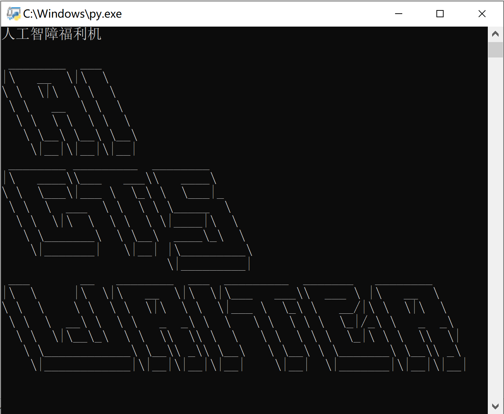

# AI GTS Writer（人工智障GTS文章生成器 Beta 0.0.1）[链接已上线]

作者：chr410445175

TID：33731

<title>1</title> <link href="../Styles/Style.css" type="text/css" rel="stylesheet">

# 1

*本帖最後由 Lcxzyr 於 2022-7-22 01:14 編輯*

大家好，这里是某个想不开到炼丹的人

前两天接触到了某个NLP（自然语言处理）模型，心血来潮看看能不能让它写点GTS文。

遂 *手动复制* 了GN文章区的 *一些* 文章作为炼丹的原料，在一块2070上面跑了两天两夜以后得到了一些模型

由于语料规模过小并且没有进行过精细化的筛查和处理，模型本身不是很完善，训练机制简陋，训练条件贫寒等因素的限制，这个小智障并不是很会说话，但是现在已经可以装模做样的输出一些福利段落了。

那么请允许我介绍人工智障福利机AI GTS Writer（

下面是一些这个智障的一些成果（开头由水柜提供）：

> 她跪在地上，看着自己脚上的些许城市，漏出了微笑。
>   “果然只是一些要被清理掉的小虫子呢?”
>   随着脚趾的揉动，那些脚心上残余的小人也在毁天灭地的震动中瑟瑟发抖，不时有那一片片褐色的城市残骸从脚掌上滑落，碎裂。（这三句是水柜提供的开头，接下来是生成的文字）
>   一些幸存者试图爬起来逃跑，但是他们怎么也逃不出女神的一只玉足呢?这对于他们来说，已经是一整片的足印了
>   “跑的好慢啊，再加十五分钟，你们就要被我碾死喽～”
>   双足轻轻一合，足底下的几百万小人就这样瞬间消失了。
>   两百多万的人和一整片地面瞬间被女神的裸足碾成了尘埃，连同他们的碎石被碾碎。
>   女神的玩具，只是微不足道的存在，实在太过卑微，脆弱的人类根本不可能反抗女神的行为，而他们也终究会迎接死亡。
>   噗嗤，女神的脚趾直接落地，足底变得更加粉碎，人类的残骸和碎肉血肉也在女神的碾压下变成了红色的斑点。
>   “那么，开始吧～”
>   伊莉丝忽而抬起双足，看着那被碾成一堆的碎肉，随后径直地向下落去，直至整座城市为中心区全部被她的脚掌碾平。
>   最后，女神的这个动作，结束了伊莉丝神圣的双足，带着些许欣慰的心情，回到了原先新的城市当中。以为自己好一点，就可以将城市化为一块平地，再一次迎接她的是和现在一般的大地截然不同的死亡。
>   不过，这还远远不够，伊莉丝当然还没有一点兴趣去享受这些可怜的小人们，在所有人还沉浸在同情之中时，伊莉丝忽而停下了她的脚步。只见她好像一路追逐着人群，似是在寻找着下一个猎物。

大佬们的评价：

> 它可以为我提供新的创意
> 
>                             ——大佬A

> 也许是协助作者描写福利的好帮手
> 
> ——大佬B

需要说明的是，由于训练集来自GN，所以偶尔会出现使用GN上的文章的主人公的名字的情况，程序生成文字中的名字与原有文章之主人公毫无关系。

另外，由于数据清洗的问题，有时候生成结果会突发恶疾，忽略即可（如果卡住就重开）

**由于训练集来自GN文章区，所以机器生成的文字版权属于全体GN论坛写手，不属于原创，请勿将生成的文字直接贴到GN原创文章区！（借用描写，获得灵感等不在此列）**

关于Demo分发：
如果您在2022.7.15日前在GN文章区发表过原创文章，那么模型中也有您的一份功劳，请下载下附的文件，运行获得机器码后私信我无偿获取授权码
如果你从未在GN发表过原创文章，恕不提供Deom的授权，请不要徒劳的下载下附的文件
如果你还是想尝试AI，你可以写一点开头放在下面，我会酌情使用AI生成相应的内容以供体验

关于性能要求：

下面提供的是CPU版本，N卡加速版本由于一些原因恕不提供

程序对CPU要求较高，CPU算力较差可能导致生成缓慢，请耐心等待
（测试环境：i9-9900K，4.7GHz，占用64%，输出速度平均约10-15字每秒）

程序启动时会加载模型，启动速度可能较慢，请耐心等待。

<ignore_js_op>

**屏幕截图 2022-07-21 233145.png** *(52.07 KB, 下載次數: 0)*

[下載附件](forum.php?mod=attachment&aid=OTc3NzR8MjBkZDcxYjF8MTY3NDA2NTQ1OXwxODIzMHwzMzczMQ%3D%3D&nothumb=yes)

2022-7-21 23:32 上傳

下载链接：
[https://share.giantess.eu.org/5\. ... 0Writer.rar?preview](https://share.giantess.eu.org/5.Games&Tools/AI%20GTS%20Writer.rar?preview)
(优先)

[https://writer.giantess.eu.org/AI_GTS_Writer.rar](https://writer.giantess.eu.org/AI_GTS_Writer.rar)

<title>2</title> <link href="../Styles/Style.css" type="text/css" rel="stylesheet">

# 2

牛啊牛啊 训练AI产粮 这是不曾设想的道路 但是未来可期啊 <title>3</title> <link href="../Styles/Style.css" type="text/css" rel="stylesheet">

# 3

AI的这个文风感觉就是大多数gts文的文风啊 但是也总感觉这个描述太过于直接与一些大佬的文还是差很多。故事剧情没有创造性。 <title>4</title> <link href="../Styles/Style.css" type="text/css" rel="stylesheet">

# 4

期待了，希望能早日用上AI产的文（ <title>5</title> <link href="../Styles/Style.css" type="text/css" rel="stylesheet">

# 5

人工纸张登场   （不是）  
 <title>6</title> <link href="../Styles/Style.css" type="text/css" rel="stylesheet">

# 6

牛哇牛哇，好像可以成立专门的文章修改小组然后结合AIwriter批量生产文章。感觉写作会变得很轻松啊，狠狠的期待了。
<title>7</title> <link href="../Styles/Style.css" type="text/css" rel="stylesheet">

# 7

> YuAE 發表於 2022-7-22 08:02
> 牛哇牛哇，好像可以成立专门的文章修改小组然后结合AIwriter批量生产文章。感觉写作会变得很轻松啊，狠狠的 ...

想的太美了(

机器人没法生成连贯的剧情，写文章主要靠的还是人，不是机器 <title>8</title> <link href="../Styles/Style.css" type="text/css" rel="stylesheet">

# 8

摸鱼生成器，灵感枯竭的时候可以生成一段，在此基础上润笔 <title>9</title> <link href="../Styles/Style.css" type="text/css" rel="stylesheet">

# 9

啊，好顶赞！

第一个反应是，“啊，好想试试……但是我没有写过文欸……”

然后第二个反应是，不对，我写过的！我很久以前写过一篇烂文过！ <title>10</title> <link href="../Styles/Style.css" type="text/css" rel="stylesheet">

# 10

总有一天，我们会可以用人工智能量产神文的，慢慢期待吧 <title>11</title> <link href="../Styles/Style.css" type="text/css" rel="stylesheet">

# 11

唉~看到这好东西真的时感觉终于有救星了~~~
安装上一看，要激活码（翻桌）
讲真，本人真的不太善于直接在电脑上写作，感觉打出来的东西总是没有写出来的有感觉（不知道哪里来的臭毛病）
但是感觉写出来之后再敲到电子稿里面又着实有些麻烦了，所以就完全没在原创文章区冒过泡（催更某剑除外）
但是看到这个，真的是想拿来试试水，所以上传几页底稿看看能不能搞个激活码吧~~~

> 第一章 初见
> 山中的气候永远是那么温和舒爽。
> 而我们的主角莱斯特，也正是在这美好的日子里，安静地坐在河边钓着鱼。
> 回想之前的血雨腥风，再看看现在的岁月静好，莱斯特不自觉地把手中的鱼竿握得紧了些。
> 而在他没看到的水面下，本要咬钩的鱼儿却被突然的震动吓了一跳，慌忙的离开了鱼钩的周围。
> 钓鱼也太难了，莱斯特不满地抱怨着本以为一切又会像往常一样的重复，莱斯特身后的树林中突然传出了与以往不同的声音。
> Duang~Duang~
> 仿佛重锤落地的沉闷声,
> 身经百战的莱斯特马上就意识到在解决掉身后的麻烦前，这鱼怕是钓不成了。
> 男人转身，飞速掏出一后别着的匕首，警戒的看着面前郁郁葱葱的树林。
> 男人对于自己能够使用匕首干翻一头熊还是有相当自信的。
> 然而，一切发生的都太快了，一道乌光带着强劲的风压掠过男人的头顶，甚至还没看清是什么东西飞过，他就被风压给掀翻飞了出去。
> 在晃动的视野中，他看清楚了：
> 一双雪白纤长的裸足之上，是两条笔直性感的长腿，白皙无暇的双腿之上，似乎由于赶路沾上了不少灰尘但这并不损女孩儿的俏丽，反而更添加了几分野性的美感。浑圆的臀部与纤细的腰部，宛若天神造物般完美，胸前的那两坨也似乎有生命般在散发着致命的魅力，而女孩的双臂，此时还保持着投掷后的缓冲动作，仿佛以此来宣示，为刚才的突袭负责。一切都是那么美好，除了女孩儿庞大的身形，以及头上那只独眼。
> 虽然是白天，少女的光辉却如同明月渲染了整个地面，此刻男人满目都是眼前的少女，除了吃惊，他心中已无其他。
> 曾经在落锤镇，他也不是没有见过独眼巨人这种生物，但那些浑身虬结肌肉的兄贵和眼前这个娇弱的少女完全不一样，好吗？
> 况且比拉什那家伙也告诉过自己，独眼巨人最高也就能长到十米顶天了，但眼前的女孩儿估计都有15米了，好吗？
> 不过，少女脸上的那只独眼却也毫无争议地在表示——自己绝非人类。
> 一方面由于吃惊，另一方面也感慨于少女的美丽，莱斯特竟然躺在河边仰望着她的身子而忘记了起身。但对面的女孩却没有放过这转瞬而逝的战机。
> 就一般关系而言，独眼巨人和人类都是敌人，在莱斯特好不容易回想起这一点的同时，巨人少女已经发动了攻势。
> 带着劲风，女孩儿巨大的裸足向着莱斯特躺着的地方踩了过去，终于反应过来的男人向着侧面翻滚起来，但却还是被女孩的右脚压住了一只胳膊，眼看他左脚也要踩上来，男人急中生智，竟朝相反方向翻滚起来，将身体搭上了女孩儿的脚背，然后又空出的另一只手紧紧地环抱住女孩儿的脚趾，虽说这么做很荒唐，但确实避免了被她踩在脚下。
> “虽说正在作战的时候这么想不好，但我抱住的分明是人类少女的裸足啊，这还真是种非常微妙的体验啊”莱斯特还有心胡思乱想。
> 不过这种处境并没有持续太久，女孩儿只是将脚丫用力一踩，男人就被甩飞了起来。
> 接着传来哗的一声，男人落在了浅浅的溪水中。
> 刹那间，女孩儿右脚的脚掌重重的压在了男人的身上，两根巨大的脚趾就卡在男人的脑袋两侧。
> 咯吱，咯吱~
> 脚掌虽说柔软，却带着女孩儿全身的重量，而且这脚掌还不停地在左右扭动，而男人就像一只被女孩踩在脚下的甲虫。还需要女孩儿施加全身的体重，扭动脚掌才能踩烂。
> 常理来看，这些巨人会利用他们巨大的双拳来砸扁敌人，或者直接抓起猎物用利齿撕碎。但就目前情况看来，我们的莱斯特同学似乎没有生命之忧。而且，女巨人目前的行为更像是一种对猎物的蹂躏，或许称为一种娱乐倒也不为过。
> 虽然被女巨人踩在了脚下，但男人的情况却也并没有看上去的那么危急，毕竟身为卓绝剑士的底子还在，而且四周也都是淤泥，实际上，男人受到最大的伤害不过是深陷淤泥无法移动而已。

————————————————————————————
以上是用语音识别软件搞出来的转录，可能会有些错字，望包涵（小黑屋里录GTS文章，想想就觉得好羞耻~~~） <title>12</title> <link href="../Styles/Style.css" type="text/css" rel="stylesheet">

# 12

希望这个便利的程序能有效辅助我们的灵感，但不要代替我们的大脑，写文这事还是要自己多动手实践才好。 <title>13</title> <link href="../Styles/Style.css" type="text/css" rel="stylesheet">

# 13

我前几天也做过类似的尝试，不过有几个问题。就是一个是人名，文章区的文章第一人称第三人称混用，训练出来效果不是特别好，还有一个就是数值，ai训练的结果是数值不敏感的，什么体积应该什么互动ai做不出来，还有就是逻辑，gts文章有明确的主导地位的，但是ai训练不出来。想和楼主交流一下，用的什么模型咋解决的呢 <title>14</title> <link href="../Styles/Style.css" type="text/css" rel="stylesheet">

# 14

用来给大佬们找灵感肯定很不错，尤其是画图和写文的大佬 <title>15</title> <link href="../Styles/Style.css" type="text/css" rel="stylesheet">

# 15

我倒是有种可以用ai文章来"查重"的感觉……大概就是如果你的文章写出来和ai生成的相似度很高，说明你这个文章已经不需要人类来生成了；如果以相似度作为判据的话，就变成变种的查重系统了…吗（？） <title>16</title> <link href="../Styles/Style.css" type="text/css" rel="stylesheet">

# 16

第一篇技术流，顶了顶了，什么包？</ignore_js_op>